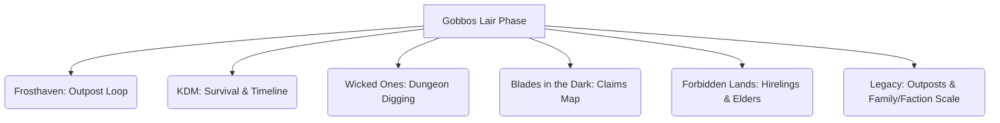

# Researcher Findings: The Lair, Outposts & Communal Goblin Society

**Role:** The Researcher  
**Objective:** Perform a deep-dive analysis of base-building, trade, and settlement mechanics in board games and TTRPGs to design a cooperative, mechanically rich, and chaotic Lair Phase for the *Gobbos* TTRPG.

---

## Part 1: Sources We Can "Steal with Pride" From

To make the Lair Phase feel like a cooperative tabletop game rather than spreadsheet bookkeeping, we analyze six major influences across board games and TTRPGs.



### 1. Frosthaven (Communal Growth & Upkeep)
*   **The Mechanic:** A structured downtime loop containing: **Calendar/Time -> Event -> Building Resolution -> Crafting/Downtime -> Construction**.
*   **Why it works:** It forces players to play by a clear sequence of phases. "Operations" happen before players spend money, making the base feel like a living machine.
*   **Gobbo Translation:** Keep a strict Lair Phase sequence:
    1. **Homecoming & Tally:** Pool Loot, resolve character deaths (add bones to the Pile).
    2. **Lair Event:** Draw a card (e.g., "Mushroom Blight," "Tax Collector Raid," "Communal Feast").
    3. **Cavern Income:** Buildings and Outposts produce resources.
    4. **Downtime Actions:** Each player spends actions (taming, crafting, recruiting, starting bar fights).
    5. **Communal Digging/Construction:** Pool resources to excavate new chambers or upgrade buildings.

### 2. Kingdom Death: Monster (Endeavors & Lethal Settlement Events)
*   **The Mechanic:** Returning survivors generate "Endeavors" (time/action tokens) used to innovate, craft, or trigger events. The settlement itself faces brutal timeline events that force progression or survival choices.
*   **Why it works:** Endeavors turn time into a strict, spendable currency. You don't just "do stuff"; you budget your population's collective energy.
*   **Gobbo Translation:** Every returning Boss and Mob generates **Labor Actions**. Upgrading a room isn't instant; it requires a player to allocate their Boss's Labor Actions or assign a Mob to "Dig."

### 3. Wicked Ones (Dungeon Excavation & Discoveries)
*   **The Mechanic:** Players spend downtime actions digging new tunnels. The GM rolls on a "Discovery Table," meaning expanding the base can unearth forgotten crypts, gold veins, or subterranean monsters.
*   **Why it works:** It gamifies base building. Digging is an exploration system, not just a purchase order.
*   **Gobbo Translation:** When the group pays to build a new chamber, they roll a **Digging Pool**. 
    *   *6s (Successes):* Progresses construction.
    *   *1s (Chaos):* Triggers a **Cavern Discovery**. They might breach a cave of giant centipedes, find a vein of glowing crystals (an Oddity!), or cause a cave-in.

### 4. Blades in the Dark (The Claims Map)
*   **The Mechanic:** The Crew advances by conquering adjacent nodes on a visual map of Turf/Claims. You cannot unlock the "Opium Den" until you seize the "Dockside Warehouse" next to it.
*   **Why it works:** Spatial progression. It replaces text lists with a visual map, making base-building feel like physical expansion.
*   **Gobbo Translation:** The Lair is represented by a **Tech Cavern Map**. Caverns are interconnected. The Gobbos start in the *Great Mud Pit* (center). To build a *Wolf Pen*, they must first excavate and clear the adjacent *Howling Caves* node.

### 5. Forbidden Lands (Elders & Hireling Tax)
*   **The Mechanic:** Stronghold rooms require specific NPCs (smiths, guards, tailors) to function.
*   **Why it works:** It connects base-building directly to NPCs. You can't just build a forge; you need to hire a dwarf or drag back a captive.
*   **Gobbo Translation:** Lair rooms are static structures until staffed. A **Gobbo Elder** (a retired player Boss) must run key facilities to unlock their elite bonuses. Other rooms require recruiting/capturing **Specialist NPCs** from the outside world.

### 6. Legacy: Life Among the Ruins (Outposts & Faction Scale)
*   **The Mechanic:** Players control both a singular character and a macro-level Family/Faction. They establish "Treaties" and expand influence across a map, establishing Outposts.
*   **Why it works:** It bridges the gap between local skirmishes and macro-level trade and warfare.
*   **Gobbo Translation:** As the Lair's **Infamy** grows, the Gobbos can establish **Outposts** in conquered raid sites. These Outposts must be staffed by a Mob and linked to the Lair via trade routes, generating abstract **Scrap** and specific components.

---

## Part 2: The Tech Cavern Map (The Lair Boardgame)

Instead of a spreadsheet, the Lair is tracked on a shared sheet containing the **Tech Caverns**—a grid or node map representing the underground warren. 

```
   [Fungal Nursery] <---> [Great Mud Pit] <---> [Scrap Yard]
                                |                     |
                                v                     v
                        [Brewery Cavern]      [Howling Caves]
```

### Cavern State
Caverns on the map have three states:
1.  **Unexplored (Blacked out):** Requires a **Raid** or a **Dig Action** to open.
2.  **Infested (Red outline):** Contains monsters, hazards, or subterranean rivals. Gobbos must clear them in a tactical skirmish (using a Mob or their Bosses) before they can build here.
3.  **Excavated (Clean):** Ready for construction.

### Construction Costs
Excavating and building requires two resources pooled in the Lair's **Communal Hoard**:
*   **Loot:** Gold, jewelry, and valuable garbage looted from the Tall-Men. Used to pay for specialized materials or hire external experts.
*   **Scrap:** The abstract infrastructure resource. Wood, iron beams, rusty gears, and stones. Generated passively by the Lair's territory and Outposts.

---

## Part 3: The Lair Loop & Labor Actions

When a raid ends, the game transitions to the Lair Phase.

### Step 1: Homecoming & The Bone Pile
*   **XP Distribution:** Players calculate Raid Points and Loot.
*   **Ceremony of the Dead:** Any Bosses who died are tossed onto the **Bone Pile**. The player adds a tick to the Bone Pile track. Every 5 ticks, the Lair gains a permanent ancestral trait (e.g., *Haunted Caverns:* +1d to defense against magic raids; *Ancestral Grudge:* All new Gobbos gain a free combat trait against the faction that killed the most Bosses).
*   **Bone Harvesting:** Players can harvest bones to craft **Bone Oddities** (ancestral relics).

### Step 2: Lair Event
Draw one card from the **Lair Event Deck**. Events are resolved collectively:
*   *Example: "Mushroom Rot."* The Fungal Nursery is shut down for this phase unless the group pays 5 Loot or a Boss spends a Brains test to cure it.
*   *Example: "Tax Collector."* Human guards have tracked you back. Pay 15 Loot from the Hoard, or fight an immediate **Lair Defense** encounter using your Mobs!

### Step 3: Labor Phase (Downtime Actions)
Each player gets **1 Boss Action** and **1 Mob Action** (representing their Gang's workforce) to spend on the following tasks:

| Action | Who Does It | Test Required | Mechanical Outcome |
| :--- | :--- | :--- | :--- |
| **Dig Cavern** | Mob | **Tough** (Mob size) | Progresses excavation of an unexplored node. Rolls of 1 trigger a **Cavern Discovery**. |
| **Craft Gear** | Boss | **Brains** | Create custom weapons/armor (see [[34_Crafting]]). |
| **Gather Scrap** | Mob | None | Venture into the immediate wilderness. Generates +1d6 Scrap for the Hoard. |
| **Recruit Grunts** | Boss | **Mouth** | Pitch the next raid to increase your Mob's size or recruit a specialist. |
| **Bar Fight** | Boss | **Tough** | Start a brawl at the Tavern. If you win, you gain +1 Infamy and steal 1d6 Loot from a rival Gang. |
| **Tame Beast** | Boss | **Tough** or **Brain** | Attempt to domesticate a captured beast (e.g., giant spider, wolf) to unlock animal Mob tags. |

### Step 4: Construction & Expansion
The group spends pooled **Loot** and **Scrap** from the Communal Hoard to build or upgrade facilities in excavated caverns.

---

## Part 4: The Communal Hoard & Dominance

Goblins are cooperative out of survival, but greedy by nature. The Lair economy bridges this with the **Dominance Mechanic**.

```
[COMMUNAL HOARD]
- Pooled Loot: 45
- Pooled Scrap: 12
-------------------------------
[ROOM: SCRAP FORGE]
Contributed:
- Smelly-Feet Gang: 10 Loot (DOMINANT)
- Red-Eye Gang: 5 Loot
```

### The Rules of Dominance:
1.  **Shared Costs:** When building a Room (e.g., *Proper Smithy* costs 20 Loot and 10 Scrap), all players contribute resources from their Gangs or the Communal Hoard.
2.  **The Ledger:** Players note down how much Loot/Scrap their specific Gang contributed to that room's construction or upgrade.
3.  **Claiming Dominance:** The Gang that contributed the *most* resources (or spent their Labor actions on it) gains **Dominance** over that room.
4.  **Dominance Perks:**
    *   **Renaming Rights:** The dominant Gang names the facility (e.g., *"The Smelly-Feet Iron-Works"*).
    *   **Priority Use:** If multiple players want to use the room in the same Lair Phase (e.g., both want to craft at the Smithy, but there is only one smith), the dominant Gang goes first.
    *   **Specialty Kickback:** The room grants a passive bonus exclusive to the dominant Gang.
        *   *Example (Proper Smithy):* The dominant Gang's Boss gets a free **Taming Success** when crafting weapons here.
        *   *Example (Brewery Cavern):* The dominant Gang's Mobs gain +1 Grit when fueled by the special reserve brew.

---

## Part 5: Room Directory (What the Lair Unlocks)

Upgrading the Lair directly expands character options, unlocks equipment tiers, enables better quirks, and provides larger/stronger Mobs.

### 1. Equipment & Scrap Workshops
These rooms set the **Oddity Ceiling** and determine what quality of Base Items you can craft (see [[34_Crafting#Layer 3 — Your Workshop]]).
*   **Scrap Forge (T2):** Requires 10 Scrap. Unlocks crafting **Scrappy** gear.
*   **Proper Smithy (T3):** Requires 20 Loot, 15 Scrap. Unlocks crafting **Standard** gear. Dominant Gang gets +1d on crafting rolls.
*   **Master's Vault (T4):** Requires 40 Loot, 30 Scrap, and a **Captive Dwarven Smith**. Unlocks **Superior** gear crafting.

### 2. Quirks & Training Grounds
Allows Gobbos to retrain, learn advanced tricks, or unlock high-tier Quirks.
*   **The Mud-Wrestling Ring:** Gobbos can spend a Downtime Action wrestling. Test **Tough**. On a success, gain +1 Max Grit for the next raid. Dominant Gang gets a free roll-modifier.
*   **Alchemist's Still:** Allows brewing volatile potions using monster parts (**Oddities**). Unlocks Brains-based potion-brewing Quirks.
*   **Elder's Council Chamber:** Required to retire Bosses. Staffing this room with an Elder allows other players to pay Loot to buy advanced, high-tier **Quirks** taught by the retired veteran.

### 3. Goblin Recruitment & Mob Upgrades
Increases Mob capacity, grants new Mob types, and unlocks tactical Mob equipment.
*   **Breeding & Hatching Pits:** Increases maximum Mob size by +1d6.
*   **Wolf Pens:** Allows capturing and housing wolves. Unlocks the `[Wolf Rider]` Mob archetype (higher movement, flanking bonuses) for the next raid.
*   **War Drum Hut:** Allows equipping your Mob with instrument tags, granting them moral bonuses in battle.

---

## Part 6: Populating the Lair (NPCs & Elders)

The Lair is populated by characters that bring it to life. We divide them into three categories:

```
                  ┌───────────────────────────┐
                  │      LAIR POPULATION      │
                  └─────────────┬─────────────┘
                                │
        ┌───────────────────────┼───────────────────────┐
        ▼                       ▼                       ▼
 ┌─────────────┐         ┌─────────────┐         ┌─────────────┐
 │   ELDERS    │         │ SPECIALISTS │         │  CAPTIVES   │
 │ Retired PCs │         │ Hired/Saved │         │ Dragged In  │
 └─────────────┘         └─────────────┘         └─────────────┘
```

### 1. The Elders (Retired Bosses)
When a Gobbo Boss reaches Max Level (or suffers too many permanent injuries), they can **Retire**. 
*   **The Transition:** The character sheet is handed over to the Lair. The player creates a new Level 1 Boss (inheriting a starting bonus from the retired veteran).
*   **Active Staffing:** The retired Boss becomes an **Elder NPC** who is assigned to run a Lair Room.
    *   *Example:* Retiring *Brak the Slasher* and placing him in the **Training Grounds** unlocks the "Slasher's Stance" trick for all new recruits.
    *   *Example:* Retiring *Fizzle the Mad* to the **Alchemist's Still** reduces the Bite of all crafted potions by -1.

### 2. Specialist NPCs
These are rare goblins (or friendly outcasts) recruited from the outside world during raids or random events.
*   **Recruitment:** Requires a specific quest or paying an upfront retainer in Loot.
*   **The Pig-Whisperer:** Staffs the Pig Sties. Unlocks pig-riding skirmishers.
*   **The Scrap-Shaman:** Staffs the Scrap Yard. Passively generates +2 Scrap every Lair Phase.
*   **The Rumormonger:** Staffs the Tavern. Allows players to spend a Downtime Action to find hidden paths or secret weaknesses in upcoming raid locations.

### 3. Captives (Involuntary Labor)
During raids, Gobbos can choose to kidnap NPCs rather than kill them, dragging them back in chains.
*   **The Prisoner Cage:** A Lair Room required to hold Captives.
*   **Enforced Labor:** Captives must be forced to work.
    *   *Example:* A **Captive Human Scholar** forced to work in the *Scrap Library* grants +1d to all Brains crafting checks, but increases the chance of an **Outpost Event Sabotage** because they are plotting an escape.
    *   *Example:* A **Dwarven Miner** forced to dig caverns doubles the rate of excavation but requires a Boss to spend an action guarding them (Testing **Tough** or **Mouth**) to prevent a strike or rebellion.

---

## Part 7: Trade, Outposts & Territory Expansion

Once the Lair is secure, the Gobbos want to expand their reach, transitioning from a hidden pack of thieves to a regional crime syndicate.

```
       [Lumber Outpost]
              \ (Trade Route: Wilds)
               \
                v
          [THE LAIR] <=========> [Dwarven Mine Outpost]
                        (Trade Route: High Risk)
```

### 1. Establishing an Outpost
During a raid, if the Gobbos clear an external location (e.g., an *abandoned iron mine*, a *human lumber mill*, or a *ruined temple*), they can declare it an **Outpost** instead of abandoning it.
*   **Garrison Cost:** Establishing an Outpost requires leaving a Mob behind as a permanent Garrison. This reduces the player's available Mob pool until they recruit replacements.
*   **Yield:** Each Outpost produces a specific yield every Lair Phase (e.g., +5 Scrap from the Mine, +3 Herbs from the Swamp).

### 2. Trade Routes & Supply Runs
To get the Outpost's yield back to the Lair, you must maintain a **Trade Route**.
*   **Route Risk:** Trade routes are rated by danger (e.g., *Safe, Wilds, High Risk*).
*   **The Supply Run:** During Step 3 of the Lair Phase, the players make a **Supply Roll** for each active trade route:
    *   **Safe Route:** Auto-success. The resources arrive in the Hoard.
    *   **Wilds Route:** Roll **1d6**. On a 1–2, the shipment is ambushed. Gobbos must spend a Mob Action to rescue it, or lose the shipment and increase the Outpost's damage.
    *   **High Risk Route:** Roll **2d6**. Needs a success (4+) to get through. Fumbles result in the Outpost being besieged!

### 3. Outpost Upgrades & Trade Agreements
Gobbos can spend resources to secure their routes or trade with neutral factions:
*   **Palisades / Guard Towers:** Built at the Outpost to increase its Defense Value against automated counter-attacks from the Tall-Men.
*   **Smuggler Pact:** Pay Loot to an NPC merchant guild to run your shipments. This turns a *High Risk* route into a *Safe* route, but the guild takes a 20% cut of all hauled resources.

---

## Summary of Core Loops (The "Gobbos" Pacing)

1.  **Raid Phase:** Infiltrate, fight, collect Loot, grab Oddities, capture prisoners, or conquer key locations.
2.  **Homecoming:** Mourn the dead (Bone Pile), calculate XP, and tax/skim the Loot.
3.  **Lair Events & Threats:** Resolve random events, protect the base from retaliation.
4.  **Labor & Digging:** Assign Bosses and Mobs to dig out new Tech Caverns, craft gear, or recruit.
5.  **Expand Empire:** Send shipments from Outposts, manage trade routes, and retire Bosses into legendary Elders to rule the underworld.
