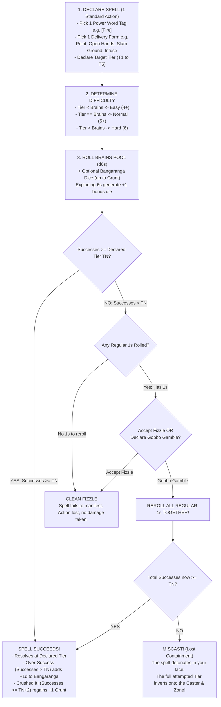
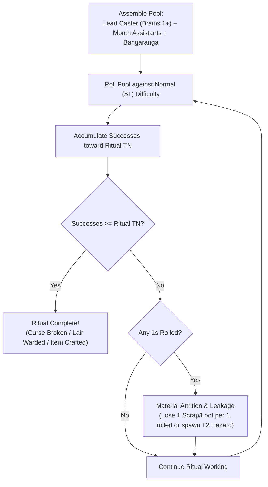

# Magic and Bangaranga

*Goblins do not study dusty, leather-bound grimoires in high towers. We shout words carved into mossy dungeon stones, crush glowing cavern mushrooms in our bare fists, and cling to raw cosmic lightning until our teeth rattle. If you are not risking a catastrophic explosion, you are not really casting.*

---

## 1. The Core Nature of Goblin Magic

Magic in **Gobbos** is ancient, unrefined, and dangerous. In-world, magic is the shattered command language of dead titans and subterranean ley-lines. Goblins do not understand magical grammar, complex equations, or protective safety wards. Instead, a **Goblin Boss** memorizes a raw, primordial **Power Word**, screams it at the top of their lungs, and channels the violent cosmic energy with bare hands.

Casting a spell is like **opening a high-pressure fire hose**. You point it in a direction, channel as much power as you dare, and desperately hold on.



---

## 2. Prerequisites & Memorization

To cast magic, a **Goblin Boss** must meet two simple requirements:
1.  **Brains Level 1+:** Every goblin with at least **Brains 1** can memorize and channel **Power Words**.
2.  **Unbound Hands or Conduit:** You must have at least one hand free, or be brandishing a magical **Component** (such as a runic staff, carved bone wand, glowing crystal, or weird fetish).

### Power Word Slots
Goblins do not memorize rigid lists of individual spells. You memorize volatile **Power Words** represented by narrative **Tags** (e.g. `[Fire]`, `[Sticky]`, `[Shock]`, `[Shadow]`, `[Bone]`, `[Slip]`, `[Snooze]`):

| Brains Level | Power Word Slots | Crafting Capacity | Routine Mastery (Easy 4+) |
| :---: | :---: | :---: | :---: |
| **Level 1** | **1 Power Word** | 1 Component Slot | None |
| **Level 2** | **2 Power Words** | 2 Component Slots | Tier 1 Spells |
| **Level 3** | **3 Power Words** | 3 Component Slots | Tier 1 & Tier 2 Spells |
| **Level 4** | **4 Power Words** | 4 Component Slots | Tier 1, 2, & 3 Spells |
| **Level 5** | **5 Power Words** | 5 Component Slots | Tier 1, 2, 3, & 4 Spells |

>> **Swapping Power Words:** You can attune to and swap prepared **Power Words** exclusively during the **Lair Phase** (see [The Lair Loop & Progression](10_The_Lair_Loop_and_Progression.md)). You can attune to any Word unlocked through personal **Feats**, discovered **Relics**, or **Lair Upgrades**.

---

## 3. The 4 Delivery Forms (Shaping the Magic)

You do not need to learn separate spells for a fire bolt, a fire ball, a fire shield, and a flaming sword. When you cast a **Power Word**, your physical posture directs the energy through one of **Four Universal Delivery Forms**:

1.  **Point (Bolt / Remote):** You point a finger or staff at a single distinct target at range.
2.  **Open Hands (Burst / Blast):** You cup both hands open and throw the energy, creating a wide **Area of Effect (AoE)** across an entire **Zone**.
3.  **Slam Ground (Barrier / Wall):** You slam both fists into the earth, raising a physical obstacle, barrier, or persistent hazard across a **Zone**.
4.  **Infuse (Imbue / Aura):** You slap the energy onto yourself, an ally, a carried weapon, or radiate it as a personal aura.

---

## 4. The 5 Universal Spell Tiers (T1 to T5)

The power, scale, and reach of a spell are governed by the **Declared Tier (T1 to T5)**. The Tier determines the required **Target Number (TN)** in successes:

| Spell Tier | Required TN | Combat Magnitude (Damage / Force) | Delivery Range | Target / Footprint | Utility Duration |
| :---: | :---: | :--- | :--- | :--- | :--- |
| **T1 (Trifle / Minor)** | **TN 1** | **1 Damage** OR +1 Attack Success | **Touch / Melee** | Self or 1 small object | **1 Round** (or 1 minute) |
| **T2 (Tactical / Standard)** | **TN 2** | **2 Damage** OR apply basic condition | **Ranged (1 Zone)** | 1 Target Creature | **1 Encounter** (or 10 minutes) |
| **T3 (Heroic / Zone-Wide)** | **TN 3** | **3 Damage** OR apply severe condition | **Far (2–3 Zones)** | **Entire Zone** OR **Whole Mob** | **1 Raid Phase** (or 1 hour) |
| **T4 (Destructive / Blast)**| **TN 4** | **4 Damage** OR encounter hazard | **Sight** | **Multi-Zone Blast** (Zone + Adjacent)| **Full Day** (until Lair rest) |
| **T5 (Mythic / Catastrophe)**| **TN 5** | Instant Defeat / Reality Warp | **Map-Wide** | **Entire Region / Map** | **Permanent** / Until Dismissed |

---

## 5. The Step-by-Step Casting Procedure

Casting a spell costs **1 Standard Action**. Execute the following four steps:

### Step 1 — Declare the Spell
Announce three elements before picking up the dice:
1.  **The Power Word:** (e.g. `[Fire]`, `[Sticky]`, `[Shadow]`, `[Slip]`).
2.  **The Delivery Form:** (Point, Open Hands, Slam Ground, or Infuse).
3.  **The Target Tier:** (Tier 1 through Tier 5). The Tier is your **Target Number (TN)**.

### Step 2 — Determine Difficulty Face
Compare your **Declared Tier** to your **Brains** attribute:
*   **Tier < Brains -> Easy (4+):** The spell is below your mental limit. Highly routine (4, 5, and 6 count as successes).
*   **Tier == Brains -> Normal (5+):** The spell matches your mental limit (5 and 6 count as successes).
*   **Tier > Brains -> Hard (6):** You are reaching beyond your capacity. Volatile (Only natural 6s count as successes).

### Step 3 — Assemble and Roll the Pool
*   Roll **d6s equal to your Brains** stat.
*   *(Optional)* Draw up to your **Grunt** in **Bangaranga Dice** from the communal pool to fuel the cast.
*   **Exploding 6s:** Every natural **6** rolled on a regular die counts as 1 success and immediately adds **+1 regular die** to the roll. Every **6** rolled on a **Bangaranga Die** explodes twice (**+2 regular dice**).

### Step 4 — Resolve the Outcome

#### Outcome A: Success (Successes >= Declared TN)
The spell manifests in full at the declared Tier!
*   **Over-Success (Successes > TN):** If you score extra successes beyond the required TN, your swagger fires up the runts. Immediately add **+1d6 to the communal Bangaranga Pool**.
*   **Crushed It! (Successes >= TN + 2):** If you beat the TN by 2 or more successes, choose one:
    *   *Gobbo Swagger:* Instantly restore **+1 Grunt** (up to maximum).
    *   *Overcharge:* Extend the spell's duration by one step, or strike 1 additional target.
*   **Ceiling Rule:** Extra successes **do not** increase the base Tier of the spell. (A declared T2 spell cannot become a T3 spell through over-success).

#### Outcome B: Clean Fizzle (Successes < TN, Accept Failure)
If your roll fails to meet the TN and you choose not to gamble (or have zero regular 1s), the spell simply fails to manifest. The action is spent, but no damage or mishap occurs.

#### Outcome C: The Gobbo Gamble & Miscast
If your roll failed to meet the TN, but contains one or more regular dice showing natural **1s**, you may declare a **Gobbo Gamble**:
1.  **Reroll Regular 1s:** Pick up all regular dice showing **1s** and reroll them together.
2.  **Locked Bangaranga 1s:** Any drawn **Bangaranga Dice** showing **1s** are locked and **cannot be rerolled**.
3.  **Triumph on Reroll:** If the rerolled dice generate enough new successes to bring your total pool up to or above the TN, the spell succeeds normally!
4.  **MISCAST on Reroll:** If the reroll fails to reach the required TN, the spell collapses into a **Miscast**.

> **Example:** Griznak (**Brains 3**, **Grunt 2**) wants to blast a squad of guards with `[Shock]`.
> *   **Declaration:** Griznak declares `[Shock]`, **Open Hands** (Burst), at **Tier 3** (**TN 3**).
> *   **Difficulty:** Tier 3 == Brains 3 -> **Normal (5+)**.
> *   **The Roll:** Griznak draws 1 **Bangaranga Die** and rolls 4d6 total (3 Brains + 1 Bangaranga). Result: `[5, 3, 1]` (regular) and `[2]` (Bangaranga). That is 1 success (short of TN 3).
> *   **The Gamble:** Griznak refuses to look foolish. Griznak declares a **Gobbo Gamble** and rerolls the regular `1`.
> *   **Second Roll:** The rerolled die lands on a `6`! It explodes, rolling another die that lands on a `5`.
> *   **Final Resolution:** Total successes are now 3 (`5`, `6`, `5`). The spell succeeds! A massive T3 lightning burst arcs across the entire enemy Zone, dealing 3 damage to every guard present.

---

## 6. The Miscast Engine (Spell Inversion)

When a spell suffers a **Miscast**, you **never roll on a random lookup table**. Instead, the high-pressure magical hose slips from your hands:

>> **THE MISCAST LAW OF LOST CONTAINMENT:**
>> The spell fails to strike the intended target. Instead, **the full attempted Tier effect inverts and discharges directly into YOU and your occupied Zone.**

A magical Miscast replaces the standard Fumble Grunt penalty. The nature of the backfire depends strictly on the **Delivery Form** attempted:

*   **Point (Bolt) Miscast:** The blast backfires into your hands. **The caster takes the full Tier damage/condition directly.**
*   **Open Hands (Burst) Miscast:** The blast detonates at your feet. **Your entire Zone (caster + all allies/runts present) suffers the full Tier damage/condition.**
*   **Slam Ground (Barrier) Miscast:** The hazard ruptures inward. **Your Zone becomes the hazardous terrain/barrier**, trapping you inside.
*   **Infuse (Aura) Miscast:** Your body violently rejects the energy. **You suffer the corresponding severe condition (e.g. Weakened, Stunned, or Prone)** and lose **1 Grunt**.

---

## 7. Bangaranga Integration & Arcane Drain

Channeling communal hype supercharges magic, but heightens volatility:
*   **Drawing Dice:** Before rolling Step 3, you may draw a number of **Bangaranga Dice** up to your **Grunt** rating and add them to your casting pool.
*   **Double Explosions:** Every **6** rolled on a **Bangaranga Die** explodes twice (**+2 regular dice**).
*   **Locked 1s & Drain:** Any Bangaranga die that rolls a **1** is locked and cannot be rerolled during a Gobbo Gamble. If a casting test ends in failure or a **Miscast**, the **Bangaranga Pool is drained**, immediately discarding dice equal to the number of Bangaranga dice drawn.

---

## 8. Ritual Casting Mechanics

Ritual Magic represents extended, cooperative spellcasting used for monumental supernatural feats: purifying **`[Cursed]`** or **`[Bonded]`** components, warding the **Lair**, erecting permanent elemental barriers, or crafting magical artifacts.



### Ritual Parameters
*   **Time & Scale:** A ritual requires **1 Lair Phase Turn** in the **Lair** (or 3 consecutive, uninterrupted combat rounds during a raid).
*   **Lead Caster:** Must possess the relevant **Power Word** Tag.
*   **Assistants:** Up to a number of goblins equal to the Lead Caster's **Mouth** stat may assist. Each assistant contributes **+1d** to the ritual pool.
*   **Communal Fuel:** The Lead Caster may draw up to their **Grunt** in **Bangaranga Dice** to fuel the ritual.

### Extended Accumulation Engine
Rituals do not use the single-action casting loop. Instead, the Lead Caster rolls the assembled pool against **Normal (5+)** difficulty, accumulating successes across steps toward a **Ritual Target Number**:
*   **Tier 3 Ritual (Cleansing Minor Curses / Basic Wards):** Requires **5 Accumulated Successes**.
*   **Tier 4 Ritual (Cleansing Bonded Relics / Fortress Wards):** Requires **8 Accumulated Successes**.
*   **Tier 5 Ritual (Major Reality Transmutation / Artifact Crafting):** Requires **12 Accumulated Successes**.

### Ritual Complications and Resource Attrition
Because rituals are grounded, stable workings, failing a single roll does not destroy accumulated successes:
*   **The Cost of Failure:** Every **1** rolled during a ritual step consumes extra resources: the party must immediately discard **1 Scrap** (or 1 Bulk of carried **Loot**) per 1 rolled, or suffer a **T2 Chaotic Hazard** in the ritual chamber.
*   **Interruption:** If the Lead Caster suffers unmitigated damage or gains the **Stunned** condition during the ritual, the working collapses, wasting all invested materials.

---

## 9. Combat Interactions & Target Defence

To maintain complete consistency with the [Combat Engine](05_Combat_Engine.md):
*   **Physical & Elemental Spells (`[Fire]`, `[Acid]`, `[Shock]`, `[Bone]`):** Inflict direct **Grit damage** (to Bosses/PCs) or **Size damage** (to Mobs). Targets in the area make their standard **Passive Defence** rolls to mitigate incoming damage.
*   **Mental, Spatial, & Status Spells (`[Snooze]`, `[Spooky]`, `[Fade]`, `[Slip]`):** Directly apply their designated **Condition** or displacement. **Physical armor and Passive Defence dice do NOT apply.**

---

## 10. Core Power Words Catalogue

### `[BURN]` (Elemental / Fire)
*   **Tag Category:** Elemental (Damage Base: Fire)
*   **Effect:** Conjures roaring flame, heat, and combustion.
*   **Tier Scaling:**
    *   *T1 (Touch / Imbue):* Infuse weapon with fire (+1 Fire Damage on hit) OR ignite flammable object.
    *   *T2 (Bolt):* Ranged fire bolt dealing **2 Fire Damage** to 1 target (1 Zone away).
    *   *T3 (Burst / Barrier):* Zone-wide fireball dealing **3 Fire Damage** to all in Zone OR Wall of Fire (Zone hazard dealing 2 damage to anyone entering).
    *   *T4 (Blast):* Multi-zone inferno dealing **4 Fire Damage** across target Zone and all adjacent Zones.
*   **Miscast:** The fire detonates in your grip. Caster takes attempted Tier damage, and the caster's Zone catches fire (`[Burning]`).

### `[ADHERE]` (Physical / Sticky)
*   **Tag Category:** Physical / Hazard (Damage Base: Blunt)
*   **Effect:** Generates thick, viscous, unyielding alchemical slime.
*   **Tier Scaling:**
    *   *T1 (Touch):* Glue 1 small item to a surface (cannot be moved without tools).
    *   *T2 (Bolt):* Slime bolt covers 1 target; target gains the **Restrained** condition.
    *   *T3 (Burst / Barrier):* Zone-wide glue bomb; entire Zone becomes difficult terrain, all grounded units gain **Restrained**.
    *   *T4 (Blast):* Floods multiple Zones in knee-deep adhesive sludge.
*   **Miscast:** Glue pot ruptures over the caster. Caster gains the **Restrained** condition and is glued to the floor.

### `[FADE]` (Deception / Shadow)
*   **Tag Category:** Deception / Stealth
*   **Effect:** Bends light, snuffs illumination, and conceals physical presence.
*   **Tier Scaling:**
    *   *T1 (Touch):* Snuff out torches/candles in melee range OR gain a **Boon (+1d)** on an immediate Slink stealth test.
    *   *T2 (Infuse):* Turn **yourself Invisible** for 1 combat encounter (or 10 minutes). Attacks against you suffer maximum Bane.
    *   *T3 (Burst / Infuse):* Turn **your entire Mob Invisible** OR plunge the entire **Zone** into pitch-black magical darkness for the encounter.
    *   *T4 (Blast):* Phase your entire party into ethereal shadows, bypassing physical walls for 1 round.
*   **Miscast:** Reality flashes brightly like a flare. Caster and all allies in the Zone gain the **Blinded** condition for 1 round, alerting all nearby sentries.

### `[LEVITATE]` (Spatial / Mobility)
*   **Tag Category:** Spatial / Movement
*   **Effect:** Negates and manipulates gravitational force.
*   **Tier Scaling:**
    *   *T1 (Touch):* Soft fall safely from any height (Feather Fall) OR float 1 small object.
    *   *T2 (Infuse):* Caster gains full **Flight** for 1 combat encounter (or 10 minutes).
    *   *T3 (Infuse / Burst):* Grant **Flight to your entire Mob** for 1 Raid Phase (1 hour) OR float all unsecured heavy objects in the Zone.
    *   *T4 (Burst):* Invert gravity across the entire room, slamming all enemies into the ceiling for **3 Blunt Damage** and the **Prone** condition.
*   **Miscast:** Gravitational whiplash. Caster is hurled into the air and slammed into the ground, taking **2 Grit Damage** and landing **Prone**.

---

## 11. Tag Effect and Spell Structural Schema

[CONTENT EXTENSION POINT: Magic Spells & Tag Effects]

All modular tag effects, living spell compendiums, and grimoire expansions must follow this formal structural schema:

```markdown
### [Power Word Name]
*   **Primary Tag:** `[Tag Name]` (e.g. `[Fire]`, `[Sticky]`, `[Shock]`, `[Spooky]`, `[Slip]`)
*   **Tag Category:** [Elemental | Physical | Mental / Social | Spatial / Movement | Metaphysical]
*   **Delivery Options:** [Point | Open Hands | Slam Ground | Infuse]
*   **Effect Scaling:**
    *   *T1 (Touch / Minor):* [Minor/Niche effect, +1 Success on attack OR 1 Grit/Size damage]
    *   *T2 (Bolt / Standard):* [Standard single-target effect, +2 Successes OR 2 Grit/Size damage; Sustained condition]
    *   *T3 (Burst / Zone):* [Heroic / Zone-wide effect, +3 Successes OR 3 Grit/Size damage; Persistent condition]
    *   *T4 (Blast / Multi-Zone):* [Destructive / Blast effect, +4 Successes OR 4 Grit/Size damage; Encounter condition]
    *   *T5 (Mythic / Legendary):* [Legendary / Encounter-scale effect; Instant defeat OR permanent reality warp]
*   **Miscast Outcome (Law of Lost Containment):** [Description of how the spell inverts onto the caster / occupied Zone when containment is lost]
```
