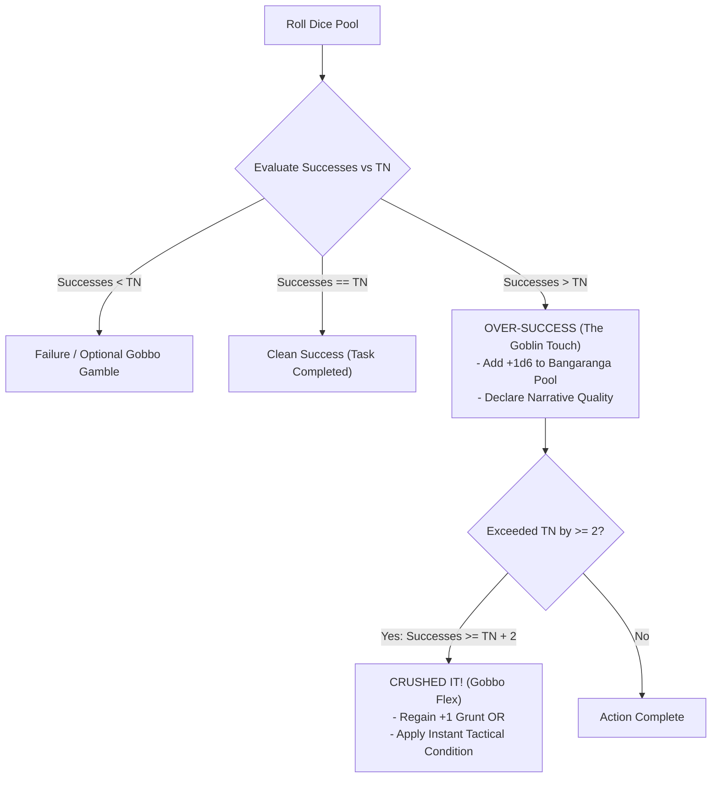
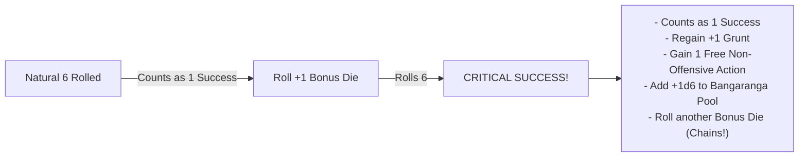
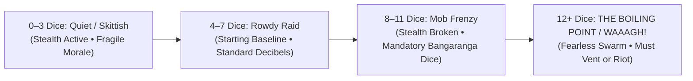

# Core Resolution & Dice Pool Engine

*Goblins do not rely on disciplined training, ancient martial manuals, or measured arithmetic. When a goblin Boss leaps into the fray, success is a messy collision of muscle, blind panic, screeching mobs, and sheer explosive momentum.*

This chapter defines the core resolution engine for **Gobbos**. All dice tests, difficulty structures, pool modifications, extra successes, horde hype levels, and chaotic risk mechanics operate under the rules codified below.

---

## The D6 Pool Framework

The resolution system in **Gobbos** uses standard six-sided dice (**d6**) exclusively. 

### The GM Never Rolls
All mechanical resolution is player-facing. **The Game Master (GM)** never rolls dice for standard tests, attacks, evasion, or environmental hazard checks. Enemies, traps, and the environment present static target thresholds that **Players** roll against using their active pools or passive defense ratings.

### Assembling the Dice Pool
When you attempt an action that carries a risk of failure or meaningful consequence, you assemble a **Dice Pool** of standard **d6s**:

**Dice Pool** = **Base Stat / Mob Size** + **Boons (+1d)** - **Banes (-1d)** + **Bangaranga Dice**

*   **Goblin Boss Tests**: Your base pool equals your current rating in the relevant **Main Stat** (**Tough**, **Slink**, **Brains**, or **Mouth**), which ranges from 1 to 5 dice.
*   **Mob Tests**: When rolling for a **Mob**, the base pool equals the Mob's current **Size** (1 to 5) for **Tough** tests, or a flat **2d6** for **Slink**, **Brains**, and **Mouth** tests (see [Mob Mechanics](06_Mob_Mechanics.md)).
*   **Pool Minimum**: A dice pool cannot be reduced below 0 dice. If penalties reduce a pool to 0 or fewer dice, you must make a desperate **Salvage Roll** (see below).

---

## Difficulty, Target Numbers & Extra Successes

Every test is defined by two values: a **Difficulty Face** (which die faces count as a success) and a **Target Number (TN)** (how many total successes you must accumulate to succeed).

### Difficulty Thresholds (Target Faces)
The circumstances of an action dictate which die faces generate a **Success**:

| Difficulty | Successful Die Faces | Description |
| :--- | :---: | :--- |
| **Easy (4+)** | **4, 5, 6** | Favorable conditions, superior tools, high ground, or vulnerable targets. |
| **Normal (5+)** | **5, 6** | Standard baseline for all routine challenges, attacks, and environmental checks. |
| **Hard (6)** | **6** | Extremely hostile conditions, heavy armor, narrow margins, or severe handicaps. |

>> **IMPORTANT:** The numeral **6** represents the absolute ceiling on a standard d6. In accordance with official system notation, **Hard** difficulty is written strictly as **6** (never write `6+`).

### Target Number (TN)
The **Target Number (TN)** is the total count of successes required to pass the test. Standard actions require a **TN of 1**. Complex tasks, fortified adversaries, thick locks, or hazardous obstacles demand a **TN of 2** or higher.

### Standard Slash Notation
To eliminate math bloat during play, all checks use the standard slash notation:

`[Stat] [Target Face]+/[Required Successes]`

*   **In Narrative Text**: *“You must pass a Slink test, needing at least 2 successes on a 5 or higher.”*
*   **In System Paragraphs**: *“Climbing the slick wall requires a Slink test against the zone profile of 5+ (2 successes).”*
*   **In Statblocks & Profiles**: `Slink 5+/2`, `Tough 4+/1`, `Brains 6/2`.

---

### Extra Successes & The Goblin Touch

When your roll yields more successes than the required **Target Number (TN)** (Successes > TN), you achieve an **Over-Success**. Rolling beyond the bare minimum excites the horde and allows you to dictate the style and narrative quality of your triumph.

#### 1. Hype Generation (+1d6 Bangaranga)
Whenever you score **at least one extra success** beyond the required TN (regardless of whether you beat it by 1, 3, or 5 successes), you immediately add **+1d6 directly to the communal Bangaranga Pool**. Your conspicuous competence fires up the surrounding runts and builds the raid's momentum.

#### 2. The Narrative Quality (The Goblin Touch)
When you over-succeed, you choose the narrative and tactical delivery of how you completed the action:
*   **Quiet (Ghost Gobbo):** The task is executed with zero sound or trace. Picking a lock or climbing a wall creates 0 Clatter and generates no suspicion from nearby sentries.
*   **Swift (In a Flash):** The task is executed in half the time, allowing you to react immediately or slip through a gap before an obstacle resets.
*   **Showy / Loud (Look at Me!):** You execute the task with obnoxious swagger, posing and drawing all enemy attention in the Zone onto yourself and away from sneaking allies.
*   **Demolishing (Splintered):** The obstacle is permanently ruined in the process. A picked lock is stripped clean; a bypassed grate is ripped out of the masonry so foes cannot lock it behind you.

#### 3. "Crushed It!" (Successes >= TN + 2)
If your total accumulated successes exceed the TN by **two (2) or more extra successes**, you completely smash the challenge. In addition to adding **+1d6 to the Bangaranga Pool**, choose one instant bonus:
*   **Gobbo Flex (+1 Grunt):** Your Boss's vanity and adrenaline surge, instantly restoring **+1 Grunt** (up to your maximum rating).
*   **Tactical Impact:** You impose an immediate physical condition on an enemy or feature in your Zone (apply the **Staggered** condition, knock a minion **Prone**, or push an opponent **1 Zone**).

> **Example:** Snagtooth attempts to pick a sturdy vault lock (`Brains 5+/1`). He rolls a pool of 4d6 and scores **3 successes** (2 extra successes). The lock snaps open instantly. 
> Snagtooth achieves an Over-Success: he immediately adds **+1d6 to the Bangaranga Pool** as his runts snicker with excitement. Because he beat the TN by 2 full successes, he triggers **Crushed It!**: he chooses the **Demolishing** narrative style (stripping the lock mechanism bare) and takes **+1 Grunt** from pure goblin swagger.

---

## Exploding 6s & Critical Successes

Goblins thrive on escalating chaos. Every die that rolls a natural **6** generates an extra burst of effort.

### Exploding 6s
Every natural **6** rolled on any die in your pool counts as **1 Success** and immediately grants **+1 bonus d6** rolled into the active pool. 
*   If the newly rolled bonus die also lands on a **6**, it counts as another success and explodes again.
*   This explosion chains indefinitely as long as additional natural **6s** are rolled.
*   To keep pool tallies clear, set aside the original 6s and roll fresh dice for the explosions rather than rerolling the original physical dice.

### Critical Success (Double Explosions)
A **Critical Success** occurs whenever an exploding natural **6** generates a bonus die that also lands on a natural **6** (a consecutive double-six chain).

When you achieve a **Critical Success**, you immediately receive two mechanical rewards:
1.  **Grunt Surge**: Your **Goblin Boss** immediately regains **+1 Grunt** (up to your maximum **Grunt** rating).
2.  **Adrenaline Burst**: You immediately gain **1 Free Action** (which must be a non-offensive **Move**, **Plunder**, or **Manipulate** action; see [Action Economy & Turn Flow](03_Action_Economy_and_Turn_Flow.md)).

---

## Zero Dice Pools & The Salvage Roll

When severe Banes, heavy encumbrance, or debilitating conditions reduce your active dice pool to **0d6 or fewer dice**, the action automatically fails by default. However, a goblin always makes one last desperate attempt.

### The Salvage Roll
When forced to test with a pool of **0d6 or fewer**, you roll exactly **1d6** as a **Salvage Roll**:

| Die Face | Result | Mechanical Outcome |
| :---: | :--- | :--- |
| **6** | **Miraculous Salvage** | Generates exactly **1 Success**. The die **does not explode**, and cannot trigger a Critical Success. |
| **1** | **Catastrophic Fumble** | The action fails catastrophically and triggers an immediate **Fumble**. If an allied **Mob** is present in your zone or an adjacent zone, you lose **1 Grunt**. |
| **2, 3, 4, 5** | **Clean Failure** | The action fails normally with no additional penalties or Grunt loss. |

---

## The Gobbo Gamble

When an initial roll fails, a goblin can push luck by doubling down on their worst dice.

### Declaring the Gamble
If your initial test fails to accumulate enough successes to meet the **Target Number (TN)**, but your roll contains one or more regular dice showing **1s**, you may declare a **Gobbo Gamble**:

1.  **Reroll Regular 1s Only**: Pick up all standard pool dice showing natural **1s** from the failed pool and reroll them together. You cannot choose to reroll only some of the regular 1s; all regular 1s must be rerolled.
2.  **Locked Bangaranga 1s**: Any drawn **Bangaranga Dice** showing **1s** represent erratic crowd blunders. They are locked and **cannot be rerolled** during a Gobbo Gamble. If a failed pool contains only Bangaranga 1s and zero regular 1s, you cannot declare a Gobbo Gamble.
3.  **The Blessing**: If the rerolled regular dice produce enough new successes to bring your total pool successes up to or above the **TN**, the test succeeds normally.
4.  **The Fumble**: If the total successes are still fewer than the **TN** after rerolling the regular 1s, you have **Fumbled**. The action fails catastrophically, and your **Goblin Boss** immediately loses **1 Grunt**.
5.  **Accepting Failure**: If you choose not to reroll your regular 1s (or if your failed roll contained zero regular 1s), the action fails normally. You suffer no **Fumble** penalty and lose **0 Grunt** (unless Bangaranga dice were drawn; see below).

---

## Boons & Banes (Tactical Stacking)

Circumstances, tactical positioning, environmental hazards, and specialized equipment modify dice pools by adding or removing physical dice.

### Boons (+1d)
A **Boon** represents a tactical advantage (such as attacking an unalert target, flanking with an allied Mob, using high ground, or wielding masterwork lockpicks). Each Boon adds **+1d6** to your active dice pool before the roll is made.

### Banes (-1d)
A **Bane** represents an active hindrance (such as attacking through thick smoke, firing into heavy cover, operating in pitch darkness, or moving while over-encumbered). Each Bane removes **1d6** from your active dice pool before the roll is made.

### 1-to-1 Cancellation & Uncapped Stacking
Boons and Banes cancel each other out on a strict **1-to-1 basis** before rolling:
*   **Uncapped Boons**: Positive modifiers stack naturally without an artificial ceiling. If a Boss combines high ground (+1d), flanking (+1d), and weapon reach (+1d), the Boss gains a net **Boon 3 (+3d6)**. Generating massive successes from stacked Boons directly fuels the communal **Bangaranga Pool**.
*   **Uncapped Banes**: Negative situational and environmental modifiers stack to reflect truly hostile perils. If cumulative Banes reduce a pool to **0d6 or lower**, the test is forced into a desperate **0d6 Salvage Roll**.

---

## The Bangaranga Pool & Horde Hype Engine

The **Bangaranga Pool** is a communal pool of distinctly colored standard d6s (such as bright red or neon green) placed in the center of the table. It physically tracks the decibel level, bloodlust, and collective momentum of the entire goblin horde.

---

### 1. Seeding the Pool (Raid Start)
At the start of every raid, the **Bangaranga Pool** is seeded with initial dice based on party composition:

| Party Element | Dice Seeded into Pool |
| :--- | :---: |
| Each **Goblin Boss** present | **+1d** per Boss |
| Each controlled **Mob** of **Size 3** or **Size 4** | **+1d** per Mob |
| Each controlled **Mob** of **Size 5** | **+2d** per Mob |

---

### 2. Loading the Pool (Hype Triggers)
During play, notable chaotic feats add physical dice to the active **Bangaranga Pool**:

| Trigger Event | Condition | Dice Added |
| :--- | :--- | :---: |
| **Over-Success** | Scoring successes strictly greater than the test's Target Number (TN) | **+1d6** |
| **Critical Success** | Any player rolls a double-six Critical Success on any test | **+1d6** |
| **Fumble** | Any player fumbles a test (via failed Gamble or 0d6 Salvage) | **+1d6** |
| **Notable Kill** | Defeating an enemy with the `[Notable]` or `[Big Threat]` tag | **+1d6** |
| **Major Loot Cache** | Claiming a chest or zone with the `[Big Loot]` or `[Hoard]` tag | **+1d6** |
| **Shenanigan Indulged** | Indulging a Gang **Shenanigan** compulsion to the party's detriment | **+1d6** |
| **Mob Mischief** | Rolling natural 1s during background node **Chaos Ticks** | **+1d6 per 1** |

---

### 3. Horde Hype Tiers (Decibel & Swarm Mood)

The total number of physical dice currently resting in the **Bangaranga Pool** dictates the auditory profile and psychological mood of the horde:

#### Tier 1: Quiet / Skittish (0–3 Dice in Pool)
*   **Auditory Profile:** Muffled whispers, crawling runts, nervous silence.
*   **Stealth:** Slink and stealth actions operate normally.
*   **Morale:** Goblins are timid. Mobs suffer standard Morale checks when taking casualties.

#### Tier 2: Rowdy Raid (4–7 Dice in Pool — *Starting Baseline*)
*   **Auditory Profile:** Clattering scrap, muttering, rattling pots. Standard raid decibel level.
*   **Command:** Baseline command range and Boss order flow.

#### Tier 3: Mob Frenzy (8–11 Dice in Pool)
*   **Auditory Profile:** Howling, banging weapons against shields, stomping feet. **Stealth is impossible.** All connected adjacent zones immediately become **Alert**.
*   **Mandatory Bangaranga:** The swarm carries you along. Every active test made by a Boss or Mob **must draw and roll at least 1 Bangaranga die**.
*   **Order Friction:** Goblins only want violence. Orders to **Attack**, **Charge**, or **Wreck** resolve normally. Subtle or restrained orders (**Wait**, **Sneak**, **Fall Back**) suffer a **Bane 1 (-1d)** penalty.

#### Tier 4: The Boiling Point / WAAAGH! (12+ Dice in Pool)
*   **Auditory Profile:** Total deafening pandemonium. The dungeon masonry shakes.
*   **Fearless Swarm:** Player Mobs become **Fearless**, completely ignoring all Morale checks caused by Mob casualties (they only check Morale if their Boss is incapacitated).
*   **Swarm Terror:** The howling horde terrifies defenders. Enemies suffer a **-1 penalty to their Morale TN** against player Swarm Terror checks.
*   **Boiling Pressure:** The horde cannot sustain this pressure at rest. During the **Round Closure Phase**, if the pool remains at 12+ dice, any **Unordered Mob** (a Mob that received no active orders this round) must immediately roll on the **Out of Control Table** (`06_Mob_Mechanics.md`) as runts run amok.

---

### 4. Tapping the Pool & The Messy Shortcut Rule

Before rolling any test, a **Goblin Boss** may draw dice from the **Bangaranga Pool** to add to their active dice pool:
*   **Grunt Draw Limit**: You can draw a maximum number of Bangaranga dice equal to your Boss's current **Grunt** rating (minimum 1 die if pool is at 8+ dice).
*   **The Bangaranga Tax**: If the number of Bangaranga dice drawn is **strictly greater than the test's Target Number (TN)**, you must pay a **1-die Tax**. One additional die is removed from the Bangaranga Pool and discarded unrolled back to the box.
*   **Rolling Bangaranga (Double Explosions)**: Every natural **6** rolled on a Bangaranga die counts as **1 Success** and **explodes twice**, immediately adding **two regular d6s** into the active pool.
*   **The Messy Shortcut Rule**: You may draw Bangaranga dice on **Brains** or **Slink** tests (such as picking locks, disarming traps, or tinkering), but doing so represents an impatient, chaotic shortcut. Using Bangaranga on a delicate test **automatically generates Noise / Clatter** and causes collateral damage to the surrounding mechanism or container.

---

### 5. "Hush the Swarm" (The Buzzkill Check)

To quiet a rowdy horde and reduce dungeon noise, a Boss can spend one **Standard Action** making a **Mouth** (or **Slink**) test to silence the runts. The required **Target Number (TN)** scales with the current Hype Tier:

| Current Bangaranga Pool | Horde Mood | "Hush the Swarm" Check | Success Outcome |
| :---: | :---: | :---: | :--- |
| **4 – 7 Dice** | **Rowdy** | `Mouth 5+/1` | Safely discards **2 Bangaranga dice**. |
| **8 – 11 Dice** | **Frenzy** | `Mouth 5+/2` | Safely discards **3 Bangaranga dice**. |
| **12+ Dice** | **Boiling Point** | `Mouth 6/2` | Safely discards **4 Bangaranga dice**. |

#### The "Buzzkill" Backfire (Failure)
Goblins despise a party-pooper. If a Boss fails a "Hush the Swarm" test:
1.  **Public Mockery**: The runts throw boots, bones, and rotten mushrooms. The Boss immediately loses **1 Grunt**.
2.  **Mob Riot**: The Mob in the Boss's Zone immediately enters the **Out of Control** state.
3.  **Spite Noise**: In open defiance, the mob bangs pots as loud as possible, alerting the nearest unalert zone.

---

### 6. Overreaching & Drain

Relying on the crowd's chaotic energy carries severe penalties when things go wrong:
*   **Grunt Loss**: If a test fails after including Bangaranga dice, your Boss immediately loses **1 Grunt**.
*   **Locked Bangaranga 1s**: Any drawn Bangaranga dice showing **1s** are locked on the table and **cannot be rerolled** during a Gobbo Gamble.
*   **Pool Drain**: If a test using Bangaranga dice ends in failure (whether by accepting failure, having only locked Bangaranga 1s, or failing a Gobbo Gamble) and the final pool contains **any natural 1s** (including locked Bangaranga 1s), the hype collapses. You must immediately remove and discard a number of dice from the communal **Bangaranga Pool** equal to the number of Bangaranga dice drawn for that test.

---

## Opposed & Resistance Resolution

Because the **Game Master (GM)** never rolls dice, all adversarial resistance, environmental opposition, and physical contests are resolved using static target profiles.

### Static Threat & Resistance Profiles
When an NPC, enemy guard, or trap resists a player's action:
1.  **Static Threshold**: The GM references the adversary's or obstacle's static rating, formatted as `Difficulty Face+/Resistance TN` (e.g. an alert guard possesses a passive detection profile of `5+/2`).
2.  **Active Player Test**: The player makes an active test using the appropriate stat (**Slink** for stealth, **Mouth** for intimidation, **Tough** for wrestling) against that static profile.
3.  **Outcome**: If player successes meet or exceed the static Resistance TN, the player overcomes the opposition. If successes fall short, the action fails and triggers enemy awareness or retaliation.

---

## Summary of Core Resolution Rules

1.  **ROLL:** Assemble pool = **Base Stat / Mob Size** + **Boons** - **Banes** + **Bangaranga**. (Boons/Banes stack uncapped).
2.  **COUNT:** Match faces against Difficulty (**Easy 4+**, **Normal 5+**, **Hard 6**).
3.  **EXPLODE:** Every natural **6** is +1 success and rolls +1 bonus d6.
    *   Double explosion (6 -> 6) is a **Critical Success**: +1 Grunt, +1 Free Action, and +1d6 to Bangaranga.
    *   Bangaranga **6** explodes into **two regular dice**.
4.  **EVALUATE:** Compare total successes to **Target Number (TN)**.
    *   **Successes >= TN + 2:** **Crushed It!** (+1d6 Bangaranga, declare Narrative Quality, and gain +1 Grunt OR apply instant Tactical Condition).
    *   **Successes > TN:** **Over-Success** (+1d6 Bangaranga and declare Narrative Quality).
    *   **Successes == TN:** **Standard Success** (Task completed).
    *   **Successes < TN with regular 1s:** Optional **Gobbo Gamble** (reroll regular 1s; Bangaranga 1s locked; fail = lose 1 Grunt).
    *   **Pool <= 0d6:** **Salvage Roll** (1d6: 6 = Success, 1 = Fumble & lose 1 Grunt, 2–5 = Failure).
