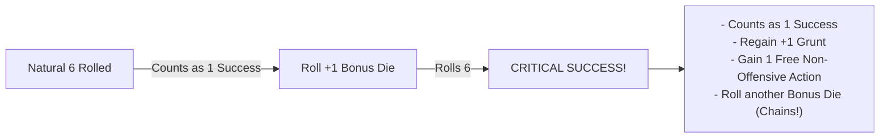

# Core Resolution & Dice Pool Engine

*Goblins do not rely on disciplined training, ancient martial manuals, or measured arithmetic. When a goblin Boss leaps into the fray, success is a messy collision of muscle, blind panic, screeching mobs, and sheer explosive momentum.*

This chapter defines the core resolution engine for **Gobbos**. All dice tests, difficulty structures, pool modifications, and chaotic risk mechanics operate under the rules codified below.

---

## The D6 Pool Framework

The resolution system in **Gobbos** uses standard six-sided dice (**d6**) exclusively. 

### The GM Never Rolls
All mechanical resolution is player-facing. **The Game Master (GM)** never rolls dice for standard tests, attacks, evasion, or environmental hazard checks. Enemies, traps, and the environment present static target thresholds that **Players** roll against using their active pools or passive defense ratings.

### Assembling the Dice Pool
When you attempt an action that carries a risk of failure or meaningful consequence, you assemble a **Dice Pool** of standard **d6s**:

**Dice Pool** = **Base Stat / Mob Size** + **Boons (+1d)** - **Banes (-1d)** + **Bangaranga Dice**

*   **Goblin Boss Tests**: Your base pool equals your current rating in the relevant **Main Stat** (**Tough**, **Slink**, **Brains**, or **Mouth**), which ranges from 1 to 5 dice.
*   **Mob Tests**: When rolling for a **Mob**, the base pool equals the Mob's current **Size** (1 to 5) for **Tough** tests, or a flat **2d6** for **Slink**, **Brains**, and **Mouth** tests (see [Mob Mechanics](06_Mob_Mechanics.md)).
*   **Pool Minimum**: A dice pool cannot be reduced below 0 dice. If penalties reduce a pool to 0 or fewer dice, you must make a desperate **Salvage Roll** (see below).

---

## Difficulty & Target Numbers

Every test is defined by two values: a **Difficulty Face** (which die faces count as a success) and a **Target Number (TN)** (how many total successes you must accumulate to succeed).

### Difficulty Thresholds (Target Faces)
The circumstances of an action dictate which die faces generate a **Success**:

| Difficulty | Successful Die Faces | Description |
| :--- | :---: | :--- |
| **Easy (4+)** | **4, 5, 6** | Favorable conditions, superior tools, high ground, or vulnerable targets. |
| **Normal (5+)** | **5, 6** | Standard baseline for all routine challenges, attacks, and environmental checks. |
| **Hard (6)** | **6** | Extremely hostile conditions, heavy armor, narrow margins, or severe handicaps. |

>> **IMPORTANT:** The numeral **6** represents the absolute ceiling on a standard d6. In accordance with official system notation, **Hard** difficulty is written strictly as **6** (never write `6+`).

### Target Number (TN)
The **Target Number (TN)** is the total count of successes required to pass the test. Standard actions require a **TN of 1**. Complex tasks, fortified adversaries, thick locks, or hazardous obstacles demand a **TN of 2** or higher.

### Standard Slash Notation
To eliminate math bloat during play, all checks use the standard slash notation:

`[Stat] [Target Face]+/[Required Successes]`

*   **In Narrative Text**: *“You must pass a Slink test, needing at least 2 successes on a 5 or higher.”*
*   **In System Paragraphs**: *“Climbing the slick wall requires a Slink test against the zone profile of 5+ (2 successes).”*
*   **In Statblocks & Profiles**: `Slink 5+/2`, `Tough 4+/1`, `Brains 6/2`.

> **Example:** Picking a sturdy lock requires `Brains 5+/2`. A **Goblin Boss** with **Brains 3** rolls 3d6. The dice land on **1**, **5**, and **6**. Because the test is **Normal (5+)**, both the **5** and the **6** count as successes. With 2 successes scored against a **TN of 2**, the lock clicks open.

---

## Exploding 6s & Critical Successes

Goblins thrive on escalating chaos. Every die that rolls a natural **6** generates an extra burst of effort.

### Exploding 6s
Every natural **6** rolled on any die in your pool counts as **1 Success** and immediately grants **+1 bonus d6** rolled into the active pool. 
*   If the newly rolled bonus die also lands on a **6**, it counts as another success and explodes again.
*   This explosion chains indefinitely as long as additional natural **6s** are rolled.
*   To keep pool tallies clear, set aside the original 6s and roll fresh dice for the explosions rather than rerolling the original physical dice.

### Critical Success (Double Explosions)
A **Critical Success** occurs whenever an exploding natural **6** generates a bonus die that also lands on a natural **6** (a consecutive double-six chain).

When you achieve a **Critical Success**, you immediately receive two mechanical rewards:
1.  **Grunt Surge**: Your **Goblin Boss** immediately regains **+1 Grunt** (up to your maximum **Grunt** rating).
2.  **Adrenaline Burst**: You immediately gain **1 Free Action** (which must be a non-offensive **Move**, **Plunder**, or **Manipulate** action; see [Action Economy & Turn Flow](03_Action_Economy_and_Turn_Flow.md)).

[MISSING RULE / GAP: Bangaranga Multi-Explosion Critical Cascade Definition — When rolling Bangaranga Dice, a natural 6 explodes into two regular dice simultaneously. The rules must define whether a 6 rolled on either bonus die triggers a Critical Success. Suggested Resolution: Any bonus die generated from an exploding die that rolls a 6 is treated as a Critical Success, granting +1 Grunt and a free non-offensive action. However, a single test action can grant a maximum of +1 Grunt and 1 bonus Free Action regardless of how many individual double-six chains occur in that single pool throw.]

---

## Zero Dice Pools & The Salvage Roll

When extreme Banes, encumbrance penalties, or debilitating conditions reduce your active dice pool to **0d6 or fewer dice**, the action automatically fails by default. However, a goblin always makes one last desperate attempt.

### The Salvage Roll
When forced to test with a pool of **0d6 or fewer**, you roll exactly **1d6** as a **Salvage Roll**:

| Die Face | Result | Mechanical Outcome |
| :---: | :--- | :--- |
| **6** | **Miraculous Salvage** | Generates exactly **1 Success**. The die **does not explode**, and cannot trigger a Critical Success. |
| **1** | **Catastrophic Fumble** | The action fails catastrophically and triggers an immediate **Fumble**. If an allied **Mob** is present in your zone or an adjacent zone, you lose **1 Grunt**. |
| **2, 3, 4, 5** | **Clean Failure** | The action fails normally with no additional penalties or Grunt loss. |

---

## The Gobbo Gamble

When an initial roll fails, a goblin can push luck by doubling down on their worst dice.

### Declaring the Gamble
If your initial test fails to accumulate enough successes to meet the **Target Number (TN)**, but your roll contains one or more dice showing **1s**, you may declare a **Gobbo Gamble**:

1.  **Reroll All 1s**: Pick up all dice showing natural **1s** from the failed pool and reroll them together. You cannot choose to reroll only some of the 1s; all 1s must be rerolled.
2.  **The Blessing**: If the rerolled dice produce enough new successes to bring your total pool successes up to or above the **TN**, the test succeeds normally.
3.  **The Fumble**: If the total successes are still fewer than the **TN** after rerolling the 1s, you have **Fumbled**. The action fails catastrophically, and your **Goblin Boss** immediately loses **1 Grunt**.
4.  **Accepting Failure**: If you choose not to reroll your 1s (or if your failed roll contained zero 1s), the action fails normally. You suffer no **Fumble** penalty and lose **0 Grunt**.

> **Example:** You make a `Tough 5+/2` test with a pool of 3d6. The dice show **1**, **1**, and **3** (0 successes). Because you have two 1s, you declare a **Gobbo Gamble** and reroll both 1s. 
> *   *Outcome A:* The rerolled dice land on **5** and **6**. You now have 2 successes. The test succeeds!
> *   *Outcome B:* The rerolled dice land on **2** and **5**. You now have 1 success (short of the TN of 2). The test fails, you trigger a **Fumble**, and you lose **1 Grunt**.

---

## Boons & Banes

Circumstances, tactical positioning, environmental traits, and specialized gear modify dice pools by adding or removing physical dice.

### Boons (+1d)
A **Boon** represents a tactical advantage (such as attacking an unalert target, using masterwork lockpicks, or having high ground). Each Boon adds **+1d6** to your active dice pool before the roll is made.

### Banes (-1d)
A **Bane** represents an active hindrance (such as attacking through thick smoke, firing into partial cover, or moving while over-encumbered). Each Bane removes **1d6** from your active dice pool before the roll is made.

### The Net Cap Rule
Multiple environmental, tactical, or situational modifiers do not stack indefinitely:
*   **1-to-1 Cancellation**: Boons and Banes cancel each other out on a 1-to-1 basis.
*   **Net Modifier Cap**: After cancellation, situational and environmental modifiers are capped at a net maximum of **+1d (Boon 1)** or **-1d (Bane 1)** on any single test.
*   *Exception*: Distinct gear properties (such as Heavy Armor imposing Bane 2 on Slink) or specific high-tier Quirks explicitly state when they bypass the situational net cap.

---

## The Bangaranga Pool Engine

The **Bangaranga Pool** is a shared, communal pool of distinctly colored standard d6s (such as bright red or neon green) placed in the center of the table. It represents the collective hype, screaming, bloodlust, and erratic momentum of the entire goblin horde.

>> **The Bangaranga Pool:** Shared Horde Momentum • Double-Exploding 6s • High Risk

### 1. Seeding the Pool (Raid Start)
At the start of every raid, the **Bangaranga Pool** is seeded with initial dice based on party composition:

| Party Element | Dice Seeded into Pool |
| :--- | :---: |
| Each **Goblin Boss** present | **+1d** per Boss |
| Each controlled **Mob** of **Size 3** or **Size 4** | **+1d** per Mob |
| Each controlled **Mob** of **Size 5** | **+2d** per Mob |

> **Example:** A raiding party consists of 3 **Goblin Bosses**, one **Size 4 Mob**, and one **Size 2 Mob**. At the start of the raid, the table seeds the **Bangaranga Pool** with **4d6** (3d from Bosses + 1d from the Size 4 Mob + 0d from the Size 2 Mob).

### 2. Loading the Pool (Hype Triggers)
During play, notable chaotic feats add physical dice to the active **Bangaranga Pool**:

| Trigger Event | Condition | Dice Added |
| :--- | :--- | :---: |
| **Critical Success** | Any player rolls a double-six Critical Success on any test | **+1d6** |
| **Fumble** | Any player fumbles a test (via failed Gamble or 0d6 Salvage) | **+1d6** |
| **Notable Kill** | Defeating an enemy with the `[Notable]` or `[Big Threat]` tag | **+1d6** |
| **Major Loot Cache** | Claiming a chest or zone with the `[Big Loot]` or `[Hoard]` tag | **+1d6** |
| **Shenanigan Indulged** | Indulging a Gang **Shenanigan** compulsion to the party's detriment | **+1d6** |
| **Mob Mischief** | Rolling natural 1s during background node **Chaos Ticks** | **+1d6 per 1** |

### 3. Tapping the Pool & The Bangaranga Tax
Before rolling any test, a **Goblin Boss** may draw dice from the **Bangaranga Pool** to add to their active dice pool:
*   **Grunt Draw Limit**: You can draw a maximum number of Bangaranga dice equal to your Boss's current **Grunt** rating.
*   **The Bangaranga Tax**: If the number of Bangaranga dice drawn is **strictly greater than the test's Target Number (TN)**, you must pay a **1-die Tax**. One additional die is removed from the Bangaranga Pool and discarded unrolled back to the box.
*   **Pool Coverage Requirement**: If the Bangaranga Pool contains insufficient dice to cover both the drawn dice and the required tax die, you cannot draw that number of dice.

> **Example (Tax Calculation on a 5+/2 Test):**
> *   Drawing 1 or 2 Bangaranga dice: No tax (2 dice drawn <= TN 2). Exactly 2 dice are drawn and rolled.
> *   Drawing 3 Bangaranga dice: Tax applies (3 dice drawn > TN 2). Requires 4 total dice in the pool. 3 dice are rolled, and 1 die is discarded unrolled.

### 4. Rolling Bangaranga Dice (Double Explosions)
Bangaranga dice are rolled alongside your standard pool dice:
*   Every natural **6** rolled on a Bangaranga die counts as **1 Success** and **explodes twice**.
*   You immediately roll **two regular d6s** into your pool for each exploding Bangaranga 6. These bonus regular dice can themselves succeed or explode normally.

### 5. Overreaching & Drain
Relying on the crowd's chaotic energy carries severe penalties when things go wrong:
*   **Grunt Loss**: If a test fails after including Bangaranga dice, your Boss immediately loses **1 Grunt**. (Because failure already costs 1 Grunt, you should always declare a **Gobbo Gamble** on any 1s rolled).
*   **Pool Drain**: If a test using Bangaranga dice ends in failure (either by accepting failure with 1s or failing the Gobbo Gamble) and the final pool contains **any natural 1s**, the hype collapses. You must immediately remove and discard a number of dice from the communal **Bangaranga Pool** equal to the number of Bangaranga dice drawn for that test.

---

## Opposed & Resistance Resolution

Because the **Game Master (GM)** never rolls dice, all adversarial resistance, environmental opposition, and physical contests are resolved using static target profiles.

### Static Threat & Resistance Profiles
When an NPC, enemy guard, or trap resists a player's action:
1.  **Static Threshold**: The GM references the adversary's or obstacle's static rating, formatted as `Difficulty Face+/Resistance TN` (e.g. an alert guard possesses a passive detection profile of `5+/2`).
2.  **Active Player Test**: The player makes an active test using the appropriate stat (**Slink** for stealth, **Mouth** for intimidation, **Tough** for wrestling) against that static profile.
3.  **Outcome**: If player successes meet or exceed the static Resistance TN, the player overcomes the opposition. If successes fall short, the action fails and triggers enemy awareness or retaliation.

[MISSING RULE / GAP: Unified Opposed & Resistance Test Mechanics — While the core engine specifies that the GM never rolls dice, complex opposed contests between multiple NPCs or asymmetric player-versus-player disputes lack an explicit tie-breaking formula. Suggested Resolution: In any direct contest between two active player characters, both roll their active stat pools against a default Normal (5+) difficulty; the character with the higher net successes wins. If tied, the character with the higher base Main Stat wins; if still tied, both suffer a chaotic collision and gain the Staggered condition.]

---

## Summary of Core Resolution Rules

1.  **ROLL:** Assemble pool = **Base Stat / Mob Size** + **Boons** - **Banes** + **Bangaranga**. The GM never rolls.
2.  **COUNT:** Match faces against Difficulty (**Easy 4+**, **Normal 5+**, **Hard 6**).
3.  **EXPLODE:** Every natural **6** is +1 success and rolls +1 bonus d6.
    *   Double explosion (6 -> 6) is a **Critical Success**: +1 Grunt & +1 Free Non-Offensive Action.
    *   Bangaranga **6** explodes into **two regular dice**.
4.  **EVALUATE:** Compare total successes to **Target Number (TN)**.
    *   **Successes >= TN:** Action succeeds.
    *   **Successes < TN with 1s:** Optional **Gobbo Gamble** (reroll all 1s; fail = lose 1 Grunt).
    *   **Pool <= 0d6:** **Salvage Roll** (1d6: 6 = Success, 1 = Fumble & lose 1 Grunt, 2–5 = Failure).
