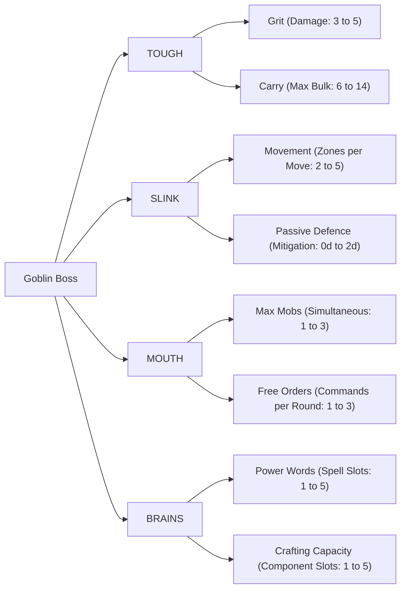
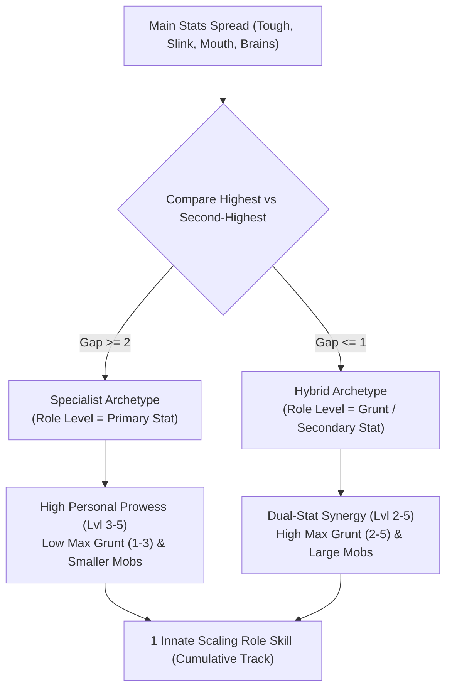
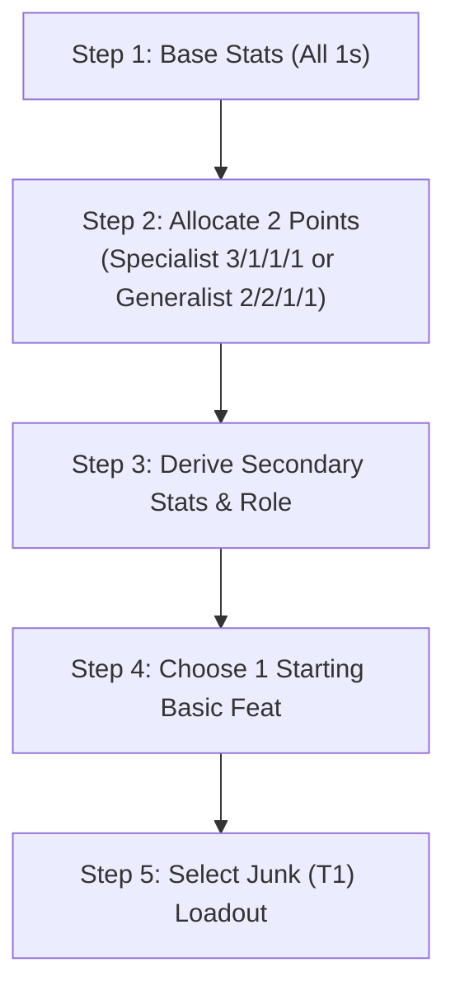
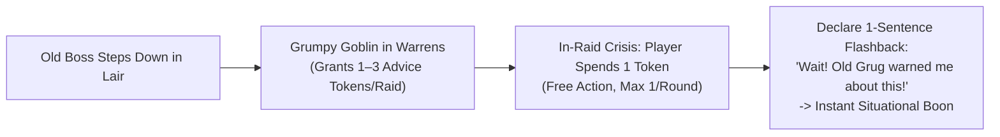

# Attributes, Boss Profile & Gang Fundamentals

*Every goblin Boss clawed their way to the top of the muck pile by being slightly meaner, faster, louder, or weirder than the screaming runts around them. But individual bosses are disposable; it is the Gang that endures, hoarding scrap and building a bloody legacy across generations.*

This chapter defines the attributes and secondary metrics of a **Goblin Boss**, the dynamic **Role and Archetype Engine**, the rules governing authority and **Grunt**, the character creation engine, the persistent mechanics of the **Gang as Class Archetype**, and the structural schema for **Feats**.

---

### Main Attributes (Level 1 to 5)

Every **Goblin Boss** possesses four **Main Stats** rated from **Level 1** to **Level 5**. A rating of Level 1 represents basic goblin competence, while Level 5 represents the pinnacle of goblin prowess.

>> **Main Stats:** **TOUGH (T)** • **SLINK (S)** • **MOUTH (M)** • **BRAINS (B)**

*   **Tough (T)**: Muscle, physical violence, brute resilience, intimidation, and raw lifting power. Tough forms the base dice pool for melee attacks and heavy physical feats.
*   **Slink (S)**: Agility, sleight of hand, stealth, acrobatics, balance, and quick reflexes. Slink forms the base dice pool for ranged attacks and evasion.
*   **Mouth (M)**: Shouting, bullying, bluffing, herd control, and vocal leadership. Mouth forms the base dice pool for commanding Mobs and rallying disorganized goblins.
*   **Brains (B)**: Cunning, trap awareness, salvage valuation, mechanical crafting, and volatile magic words. Brains forms the base dice pool for noticing hidden hazards, disarming mechanisms, crafting gear, and casting spells.

>> **IMPORTANT (Retirement at Level 6):** If any Main Stat advances to **Level 6**, the Boss immediately retires from active raiding to become an **Elder** (see [Elders & Retirement](#elders--retirement)).

---

## Secondary Stats & Progression Tracks

Each **Main Stat** governs two derived **Secondary Stats** that scale automatically as the parent stat increases:



### Tough Derived Stats: Grit & Carry

| Tough Level | Grit (Damage Capacity) | Carry Capacity (Max Bulk) |
| :---: | :---: | :---: |
| **Level 1** | **3** | **6 Bulk** |
| **Level 2** | **4** | **8 Bulk** |
| **Level 3** | **4** | **10 Bulk** |
| **Level 4** | **5** | **12 Bulk** |
| **Level 5** | **5** | **14 Bulk** |

*   **Grit**: The amount of physical damage your Boss can absorb before entering the **Downed State** (see [Damage, Grit & Wounds](07_Damage_Grit_and_Wounds.md)).
*   **Carry Capacity**: The total **Bulk** of equipment, weapons, and Loot you can carry before suffering encumbrance.
    *   **Over-Laden Rule**: If your carried Bulk exceeds your **Carry Capacity**, you suffer **-1 Zone Movement** per Move action and a **Bane 1 (-1d)** on all physical **Slink** and **Tough** tests. You cannot carry more than your Carry Capacity + 4 Bulk under any circumstances.

### Slink Derived Stats: Movement & Passive Defence

| Slink Level | Movement (Zones per Move) | Passive Defence (Armor Mitigation Dice) |
| :---: | :---: | :---: |
| **Level 1** | **2 Zones** | **0d** |
| **Level 2** | **3 Zones** | **0d** |
| **Level 3** | **3 Zones** | **+1d6** |
| **Level 4** | **4 Zones** | **+1d6** |
| **Level 5** | **5 Zones** | **+2d6** |

*   **Movement**: The maximum number of discrete environmental **Zones** your Boss can cross by spending a single **Move** action (see [Zones, Movement & Environment](04_Zones_and_Movement.md)).
*   **Passive Defence**: Innate dodging reflexes that grant passive mitigation dice. These dice are rolled alongside your equipped armor dice in the **Defence Roll**, reducing incoming damage on rolls of **5+** even if you have saved zero actions to actively Dodge (see [Combat Engine](05_Combat_Engine.md)).

### Mouth Derived Stats: Max Mobs & Free Orders

| Mouth Level | Max Controlled Mobs | Free Orders per Round |
| :---: | :---: | :---: |
| **Level 1** | **1 Mob** | **1 Free Order** |
| **Level 2** | **2 Mobs** | **1 Free Order** |
| **Level 3** | **2 Mobs** | **2 Free Orders** |
| **Level 4** | **3 Mobs** | **2 Free Orders** |
| **Level 5** | **3 Mobs** | **3 Free Orders** |

*   **Max Controlled Mobs**: The maximum number of distinct allied **Mobs** you can maintain under your command simultaneously during an encounter.
*   **Free Orders per Round**: The number of Mob command actions you can issue each round without spending your Boss's **Standard Actions** (see [Action Economy & Turn Flow](03_Action_Economy_and_Turn_Flow.md)).

### Brains Derived Stats: Power Words & Crafting Capacity

| Brains Level | Power Words (Spell Tag Slots) | Crafting Capacity (Component Slots) |
| :---: | :---: | :---: |
| **Level 1** | **1 Slot** | **1 Component Slot** |
| **Level 2** | **2 Slots** | **2 Component Slots** |
| **Level 3** | **3 Slots** | **3 Component Slots** |
| **Level 4** | **4 Slots** | **4 Component Slots** |
| **Level 5** | **5 Slots** | **5 Component Slots** |

*   **Power Words**: The maximum number of volatile magical element and delivery tags your Boss can commit to memory for casting spells (see [Magic & Bangaranga](08_Magic_and_Bangaranga.md)).
*   **Crafting Capacity**: The maximum number of specialized **Components** (custom mechanical attachments, alchemical coatings, spikes, and contraptions) you can install onto a single crafted item during downtime (see [The Lair Loop and Progression](10_The_Lair_Loop_and_Progression.md)).

---

## Grunt & Command Limits

**Grunt** represents personal authority, intimidation, and psychological command momentum. It determines how large a **Mob** you can intimidate into following orders, and acts as the currency for activating high-tier **Feats**.

### Calculating Maximum Grunt
A Boss's **Maximum Grunt** is strictly equal to the Boss's **second-highest Main Stat**:

**Max Grunt** = **Second-Highest Stat** (among Tough, Slink, Brains, Mouth)

> **Example Calculations:**
> *   Stats: **Tough 3**, **Slink 1**, **Brains 1**, **Mouth 1** -> Second-highest is 1 -> **Max Grunt = 1**.
> *   Stats: **Tough 2**, **Slink 2**, **Brains 1**, **Mouth 1** -> Second-highest is 2 -> **Max Grunt = 2**.
> *   Stats: **Tough 4**, **Slink 3**, **Brains 2**, **Mouth 1** -> Second-highest is 3 -> **Max Grunt = 3**.

### Tracking Current Grunt
Unlike the four static Main Stats, **Current Grunt** fluctuates dynamically between **0** and **Max Grunt** during a raid:

*   **Gaining Grunt (+1)**:
    *   Achieving a double-explosion **Critical Success** on any test (+1 Grunt).
    *   Personally slaying an enemy in your current or an adjacent Zone (+1 Grunt).
    *   Successfully dealing damage via **Assert Dominance** (+1 Grunt).
*   **Losing Grunt (-1)**:
    *   Suffering a **Fumble** on any test or failed **Gobbo Gamble** (-1 Grunt).
    *   Failing any test that included drawn **Bangaranga Dice** (-1 Grunt).
    *   Failing to deal damage when attempting **Assert Dominance** (-1 Grunt).

### Mob Command Limits & The Rebellion Test
A **Goblin Boss** can only maintain direct command over a **Mob** whose current **Size** is less than or equal to the Boss's **Current Grunt**:

**Maximum Commandable Mob Size <= Current Grunt**

*   **Rebellion Test**: If your current **Grunt** drops below the current **Size** of a Mob under your command (or if you attempt to command a Mob larger than your Grunt), you must immediately make a command test:
    `Tough or Mouth 5+/[Mob Size]`
    *   **Success**: The Mob remains intimidated and obeys your command for this round.
    *   **Failure**: The Mob realizes you are weak, breaks command, and immediately becomes **Out of Control** (see [Mob Mechanics](06_Mob_Mechanics.md)).

### Assert Dominance
When your Grunt is low and your Mobs are restless, you can beat your own followers to re-establish fear:
*   **Action Cost**: 1 **Standard Action**.
*   **Execution**: Make an undefended melee attack against a friendly **Mob** under your command in your Zone.
*   **Outcome**:
    *   If the attack deals **>= 1 damage** to the Mob's health dice, your Boss immediately regains **+1 Grunt** (up to Max Grunt).
    *   If the attack rolls **0 successes** (dealing 0 damage), the attack bounces, your goblins laugh at you, and your Boss loses **-1 Grunt**.

---

## The Role & Tactical Archetype Engine

A **Role** represents the emergent tactical archetype, battlefield persona, and leadership style of your **Goblin Boss**. Rather than a static character class, your **Role** is dynamically derived from your active **Main Stats** configuration.



### 1. Determining Your Role & Archetype

Your **Role** is calculated by comparing your **Primary Stat** (your highest Main Stat) against your **Secondary Stat** (your second-highest Main Stat, which also sets your **Max Grunt**):

*   **Specialist Archetype (Gap >= 2):** If your Primary Stat is **2 or more levels higher** than your Secondary Stat, you are a **Specialist** who relies on extreme personal focus in a single discipline.
    *   **Role Level:** Equal to your **Primary Stat** (Levels 3, 4, and 5).
    *   **Command Profile:** Low **Max Grunt (1 to 3)**. You command smaller **Mobs** (Size 1 to 3) and carry the fight through devastating personal power.
*   **Hybrid Archetype (Gap <= 1):** If the difference between your Primary and Secondary Stat is **1 or 0**, you are a **Hybrid** combining two attributes into a coordinated command style.
    *   **Role Level:** Equal to your **Secondary Stat / Max Grunt** (Levels 2, 3, 4, and 5).
    *   **Command Profile:** High **Max Grunt (2 to 5)**. You command large **Mobs** (Size 2 to 5) and fight through swarm coordination and tactical synergy.

>> **Tied Stats:** If multiple stats are tied for highest or second-highest, you designate which of those stats functions as your Primary and Secondary for active Role determination.

---

### 2. Role Skill Mechanics & Structural Formula

Every **Role** grants exactly **1 innate Role Skill** that defines that archetype's tactical profile on the table.

*   **Innate & Free (No XP Cost):** Role Skills are granted automatically by your active **Main Stats** spread and do not consume personal **Feat** slots.
*   **Dynamic Role Shifting:** If your stat spread changes during downtime in the Lair (e.g., raising Slink turns *The Meat-Wall* into *The Raider*), your Boss immediately adopts the new **Role** title and gains its corresponding **Role Skill** for free.
*   **The Structural Formula:** Every Role Skill combines a direct **Active Engine** (bonus dice pool boons on tests) with a **Passive Secondary Perk** (flat boosts to derived secondary stats):

**Role Skill** = **[Primary Stat Active Engine]** + **[Secondary Stat Passive Perk]**

#### Archetype Power Profiles:
1.  **Specialist Roles (Gap >= 2):**
    *   *Primary Active Engine:* Supercharged **+2d6 Boon** on all action tests made with your Primary Stat.
    *   *Secondary Passive Boost:* Boosts **both** secondary derived tracks of your primary discipline by **+1** (e.g., Tough Specialist gains **+1 Max Grit** AND **+4 Carry Capacity**).
2.  **Hybrid Roles (Gap <= 1):**
    *   *Primary Active Engine:* **+1d6 Boon** on all action tests made with your Primary Stat.
    *   *Secondary Passive Edge:* Grants **+1** to a single secondary derived track chosen from your secondary discipline (e.g., Tough + Slink Hybrid gains **+1 Zone Movement**).

---

### 3. The 16 Roles Reference Ledger

The following reference ledger contains the complete mechanical profiles for all 16 starting **Role Skills** (4 Specialists and 12 Hybrids):

#### 🔴 Tough Archetypes (Primary: Tough)

| Role Title | Archetype | Configuration | Active Engine (Primary) | Passive Perk (Secondary) |
| :--- | :--- | :---: | :--- | :--- |
| **The Meat-Wall** | Specialist | Tough >= Sec + 2 | **+2d6 Boon** on all **Tough** Melee attacks and physical feats of strength. | **+1 Max Grit** (starts at 5 Grit) **AND +4 Carry Capacity** (starts at 10 Bulk). |
| **The Raider** | Hybrid | Tough + Slink | **+1d6 Boon** on all **Tough** Melee attacks. | **+1 Zone Movement** on **Move** actions (runs 3 Zones per Move). |
| **The Enforcer** | Hybrid | Tough + Mouth | **+1d6 Boon** on all **Tough** Melee attacks. | **+1 Free Order per round** (usable for brutal melee command). |
| **The Iron-Tinker**| Hybrid | Tough + Brains | **+1d6 Boon** on all **Tough** Melee attacks. | **+1 Max Grit** from bolted scrap-armor plates (starts at 5 Grit). |

#### 🔵 Slink Archetypes (Primary: Slink)

| Role Title | Archetype | Configuration | Active Engine (Primary) | Passive Perk (Secondary) |
| :--- | :--- | :---: | :--- | :--- |
| **The Scuttler** | Specialist | Slink >= Sec + 2 | **+2d6 Boon** on all **Slink** Evasion, Stealth, and Infiltration tests. | **+1 Zone Movement** (runs 4 Zones per Move) **AND +1d Passive Armor Die** (dodging). |
| **The Gut-Cutter** | Hybrid | Slink + Tough | **+1d6 Boon** on all **Slink** Ranged and Sneak-Attack tests. | **+1 Max Grit** (starts at 4 Grit; survives close shaves). |
| **The Ring-Leader**| Hybrid | Slink + Mouth | **+1d6 Boon** on all **Slink** Stealth and Evasion tests. | **+1 Free Order per round** (issuing orders from full cover or stealth). |
| **The Saboteur** | Hybrid | Slink + Brains | **+1d6 Boon** on all **Slink** Infiltration and Sleight-of-Hand tests. | Automatically spot non-magical traps in your Zone without an action. |

#### 🟡 Mouth Archetypes (Primary: Mouth)

| Role Title | Archetype | Configuration | Active Engine (Primary) | Passive Perk (Secondary) |
| :--- | :--- | :---: | :--- | :--- |
| **The Over-Lord** | Specialist | Mouth >= Sec + 2 | **+2d6 Boon** on all **Mouth** Command, Intimidation, and Rebellion tests. | **+1 Free Order per round** (2 Free Orders total) **AND +1 Max Commanded Mob**. |
| **The Taskmaster** | Hybrid | Mouth + Tough | **+1d6 Boon** on all **Mouth** Command and Rebellion tests. | **+1 Max Commanded Mob Size** (commands Mobs of Size up to Grunt + 1). |
| **The Swindler** | Hybrid | Mouth + Slink | **+1d6 Boon** on all **Mouth** Bluff, Feint, and Misdirection tests. | **+1d Passive Dodge Die** when an ally or Mob is in your Zone. |
| **The Chant-Monger**| Hybrid | Mouth + Brains | **+1d6 Boon** on all **Mouth** Command tests. | Add **+1 free Bangaranga Die** to the communal pool when an allied Mob passes a test (max 1/round). |

#### 🟣 Brains Archetypes (Primary: Brains)

| Role Title | Archetype | Configuration | Active Engine (Primary) | Passive Perk (Secondary) |
| :--- | :--- | :---: | :--- | :--- |
| **The Sage-Tinker**| Specialist | Brains >= Sec + 2| **+2d6 Boon** on all **Brains** Trap, Hazard, Salvage, and Mechanism tests. | **1 Free Reroll per raid** on any failed test **AND +2 Inventory Component Slots**. |
| **The Runecaster** | Hybrid | Brains + Tough | **+1d6 Boon** on all **Brains** Hazard and Tactical analysis tests. | **+1 Max Grit** from etched defensive glyphs (starts at 4 Grit). |
| **The Hex-Weaver** | Hybrid | Brains + Slink | **+1d6 Boon** on all **Brains** Perception and Threat-spotting tests. | **+1 Zone Range** on all ranged weapons, slings, and thrown consumables. |
| **The Shaman** | Hybrid | Brains + Mouth | **+1d6 Boon** on all **Brains** tests and occult understanding. | Commanded Mobs gain a **+1d Boon** to resist all Morale and Swarm Terror checks. |

---

## Boss Creation Engine

Follow these sequential steps to create a starting **Goblin Boss**:



### Step 1: Set Base Stats
Set all four **Main Stats** to **1**:
*   **Tough**: 1
*   **Slink**: 1
*   **Mouth**: 1
*   **Brains**: 1

### Step 2: Distribute Starting Points
You have **2 points** to distribute among your four Main Stats (bringing starting **Stat Sum to 6**). At character creation, no stat can be increased above **Level 3**.

Choose one of two core archetype distributions:
1.  **Specialist (3, 1, 1, 1)**: Invest both points into one primary stat.
    *   *Result*: Primary Stat = 3, remaining stats = 1.
    *   *Derived Grunt*: **Max Grunt = 1**. (Commands a **Size 1 Mob** at campaign start).
    *   *Derived Role*: **Specialist Role** at **Role Level 3** (e.g., Tough Specialist = *The Meat-Wall* at Role Level 3).
2.  **Generalist (2, 2, 1, 1)**: Invest one point into two different stats.
    *   *Result*: Two Stats at 2, two stats at 1.
    *   *Derived Grunt*: **Max Grunt = 2**. (Commands a **Size 2 Mob** at campaign start).
    *   *Derived Role*: **Hybrid Role** at **Role Level 2** (e.g., Tough + Slink Hybrid = *The Raider* at Role Level 2).

### Step 3: Derive Secondary Stats & Role
Consult the progression tables to record your **Grit**, **Carry Capacity**, **Movement**, **Passive Defence**, **Max Mobs**, **Free Orders**, **Power Words**, and **Crafting Capacity**.

Identify your starting **Role** and **Role Level** from the Archetypes Matrix above, recording your starting **Role Skill** on your sheet.

### Step 4: Choose 1 Starting Basic Feat
Select **1 Basic Feat** matching a stat where your Boss's stat level meets or exceeds the Feat's Tier (starts with 0 Twists).

### Step 5: Select Starting Loadout
Choose starting gear of **Junk (T1)** quality from the scrap pile:
1.  **Melee Weapon (Choose 1)**:
    *   *Light Melee Weapon* (Bulk 1, One-Handed, Impact Size 1).
    *   *Medium Melee Weapon* (Bulk 2, One-Handed, Impact Size 1).
    *   *Heavy Melee Weapon* (Bulk 3, Two-Handed, Impact Size +1).
2.  **Ranged Weapon (Optional, Choose 1)**:
    *   *Sling* (Bulk 1, One-Handed, Range 1 Zone).
    *   *Shortbow* (Bulk 2, Two-Handed, Range 2 Zones).
    *   *Throwing Daggers* (Bulk 1, One-Handed, Range 1 Zone).
3.  **Defense (Optional, Choose 1)**:
    *   *Light Armor* (Bulk 1, +1d Passive Armor Die).
    *   *Shield* (Bulk 1, One-Handed, +1d Passive Armor Die, enables Tough Parry).

---

## The Gang as Class Archetype

In **Gobbos**, players do not play isolated lone heroes. The player's persistent, leveling entity is the **Gang**, which survives the death, retirement, or burnout of individual Bosses.

>> **The Gang:** Persistent Entity • Infamy Track (6–20) • The Hoard • The Bone Pile • The Grumpy Goblin

### 1. The Unified 6–20 Progression Scale

A Boss's overall power is measured by their **Stat Sum**:

**Boss Stat Sum** = **Tough** + **Slink** + **Mouth** + **Brains** (Range: **6 to 20**)

**Gang Infamy** represents the persistent baseline rating of your Gang and Lair across the campaign, tracking from **Infamy 6** (campaign start) to **Infamy 20** (legendary warren horde).

#### Earning Infamy Marks
A Gang advances its Infamy during play through three distinct avenues:
1.  **Loot Contribution**: Every **10 Loot Value** deposited into the Communal Hoard grants **1 Infamy Mark**.
2.  **Gang Agendas**: Completing a chosen **Gang Agenda** during a raid grants **1 Infamy Mark** (max 1 per raid).
3.  **The Generational Leap**: When an over-stretched Boss dies or steps down, the Gang's Infamy advances by up to **+2 steps** (see [The Generational Leap](10_The_Lair_Loop_and_Progression.md)).

#### Gang Infamy Milestones & Scale
| Gang Infamy Rating | Cumulative Marks Required | Successor Starting Stat Points | Ancestral Mojo Slots |
| :---: | :---: | :---: | :---: |
| **Infamy 6** | **0 Marks** | **6 Points** (1/1/1/1 + 2 points) | **0 Slots** |
| **Infamy 8** | **4 Marks** | **8 Points** (Max 3 in any stat) | **1 Mojo Slot** |
| **Infamy 10** | **9 Marks** | **10 Points** (Max 3 in any stat) | **1 Mojo Slot** |
| **Infamy 12** | **15 Marks** | **12 Points** (Max 4 in any stat) | **2 Mojo Slots** |
| **Infamy 14** | **22 Marks** | **14 Points** (Max 4 in any stat) | **2 Mojo Slots** |
| **Infamy 16** | **30 Marks** | **16 Points** (Max 4 in any stat) | **3 Mojo Slots** |
| **Infamy 18** | **39 Marks** | **18 Points** (Max 5 in any stat) | **3 Mojo Slots** |
| **Infamy 20** | **50 Marks** | **20 Points** (Max 5 in any stat) | **4 Mojo Slots** |

---

### 2. The XP Rubber Band Engine

Progression is not a flat linear track. Advancing a Boss's stats is evaluated relative to your Gang's active **Infamy Level**:

```
[ Gang Infamy Level ]
         │
 ┌───────┴────────────────────────┬────────────────────────┐
 ▼                                ▼                        ▼
[ Next Stat Sum <= Gang ]  [ Next Stat Sum = Gang + 1/2 ] [ Next Stat Sum >= Gang + 3 ]
   10 XP (Par Catch-Up)      25 XP / 60 XP (The Stretch)     150+ XP (The Brick Wall)
```

#### Relative Stat Advancement Costs
When spending Boss XP during the Lair Phase to raise any Main Stat by +1:

| Next Stat Sum vs. Gang Infamy | Progression Category | XP Cost per Stat Point | Table Experience |
| :--- | :---: | :---: | :--- |
| **Next Sum <= Gang Infamy** | **Par / Catch-Up** | **10 XP** | **Fast Catch-Up:** New Bosses easily catch up to the Gang's established baseline. |
| **Next Sum = Gang Infamy + 1** | **Stretch 1** | **25 XP** | **The Squeeze Begins:** Solid milestone requiring 1–2 successful raids. |
| **Next Sum = Gang Infamy + 2** | **Stretch 2** | **60 XP** | **Heavy Squeeze:** Major effort; the player feels the limits of this Boss's growth. |
| **Next Sum >= Gang Infamy + 3** | **The Brick Wall** | **150+ XP** | **The Outrageous Limit:** Nearly impossible for a single Boss to push alone. |

> **Example:**  
> A Gang is at **Infamy 8**. A new Boss starts with a Stat Sum of **8** (`3, 2, 2, 1`).  
> * Raising Tough from 3 to 4 increases Stat Sum to **9** (`Gang + 1`) -> costs **25 XP**.  
> * Raising Slink from 2 to 3 increases Stat Sum to **10** (`Gang + 2`) -> costs **60 XP**.  
> * Attempting to raise Mouth to 3 would increase Stat Sum to **11** (`Gang + 3`) -> costs **150 XP** (The Brick Wall).

---

### 3. The Grumpy Goblin (Voluntary Step-Down & Advice)

When a Boss reaches `Stat Sum >= Gang Infamy + 1`, the player may choose not to push against the extreme XP wall. During the **Lair Phase**, the Boss can voluntarily **Step Down** to become the Gang's **Grumpy Goblin**.



#### Advice Tokens per Raid
A **Grumpy Goblin** provides a pool of **Advice Tokens** on every future raid (refreshed for free during Homecoming) based on the retired Boss's highest Main Stat:
* **Retired Stat Level 3:** **1 Advice Token** per raid.
* **Retired Stat Level 4:** **2 Advice Tokens** per raid.
* **Retired Stat Level 5:** **3 Advice Tokens** per raid.

#### The 4 Grumpy Disciplines
When spending an **Advice Token** as a **Free Action** (max 1 per round), the active Boss declares a quick 1-sentence flashback advice quote matching the Grumpy Goblin's primary specialty:

1. **The Bruiser (Tough Specialty):** *"Smack 'em in the gristle!"*  
   * **Boon:** Roll **+2 Passive Armor Dice** against an unexpected hit, or smash through a physical barricade without needing a tool.
2. **The Sneak (Slink Specialty):** *"Guards never look at the ceiling!"*  
   * **Boon:** Automatically negate an environmental trap or ambush trigger, or escape a grapple/restraint as a Free Action.
3. **The Loudmouth (Mouth Specialty):** *"Scream loud and wave a dead chicken!"*  
   * **Boon:** Force an attacking humanoid foe to hesitate (losing 1 action on their turn), or immediately rally a fleeing Mob to combat formation for free.
4. **The Tinkerer (Brains Specialty):** *"Cut the green fuse, not the red one!"*  
   * **Boon:** Declare you retroactively packed a common utility tool/flask into your bag (Blades-in-the-Dark style), or instantly jury-rig a broken item.

>> **RULE: Single Active Grumpy Goblin**  
>> A Gang can only benefit from **one (1) active Grumpy Goblin at a time**. If a newer Boss steps down, the previous Grumpy Goblin settles into permanent comfortable retirement in the warrens, and the new Boss becomes the active advisor.

---

### 4. Successor Boss Generation

When a **Goblin Boss** dies, goes nuclear, or steps down as a Grumpy Goblin, the Gang promotes a new Boss:
1. **Allocate Stat Points:** Distribute total points equal to the current **Gang Infamy Rating** across Tough, Slink, Mouth, Brains (minimum 1 in each stat).
2. **Stat Cap at Creation:** No single stat can start higher than **Level 3** (at Infamy 6–10) or **Level 4** (at Infamy 12–16).
3. **Derive Secondary Stats & Role:** Derived automatically from the new stat configuration in seconds.
4. **Ancestral Mojo Inheritance:** The successor immediately benefits from all active Feats etched into the Gang's **Ancestral Mojo Wall** without consuming personal Feat slots.

---

### 5. The Gang Hoard & Bone Pile

* **The Hoard:** Central stockpile of unrefined scrap, tools, and wealth. Outfits recruited Mobs before raids.
* **The Bone Pile:** Monument of skulls from deceased Bosses. When a Boss dies, the Gang can salvage a skull/bone to forge **1 Relic** granting a **+1d Boon** tied to that Boss's highest stat.

---

### 6. Elders & True Retirement (Stat Level 6)

When any Boss achieves **Level 6** in a Main Stat, that Boss transcends active raiding and Grumpy Goblin status to become a permanent **Elder**, staffing major Lair facilities:
* **Elder of Tough (Training Ring):** All commanded Mobs gain **+1 Passive Armor Die**.
* **Elder of Slink (Shadow Den):** Reduces trap **Target Numbers (TN)** by **1** (minimum 1).
* **Elder of Mouth (Council Chambers):** Maximum **Grunt +1**; rally fleeing Mobs as a Free Action once per raid.
* **Elder of Brains (Tinker Yard):** Install **+1 extra Component** onto custom crafted gear.

---

### 7. Gang Shenanigan (Cultural Identity)

Every Gang possesses a defining cultural trait called a **Shenanigan** (e.g. *Pyromaniacs, Shiny-Snatchers, Trap-Trippers, Skull-Bangers*):
* **The Boon:** Grants a **+1d Boon** on action tests directly aligned with the Shenanigan.
* **The Compulsion:** When presented with an opportunity to indulge the Shenanigan, the Boss must make a `Brains 5+/1` test to resist.
* **Feeding the Bangaranga:** Whenever a player willingly indulges your Shenanigan to the tactical detriment of the party, immediately add **+1d6** to the communal **Bangaranga Pool**.

---

## 8. Feat Mechanics & Structural Schema

Feats are modular personal abilities that grant new tactical permissions, modify dice outcomes, or alter the action economy.

### 1. The Core Feat Rules
*   **The Personal Feat Limit:** A **Goblin Boss** can maintain a maximum of **three (3) Personal Feats** simultaneously.
*   **Starting Feat:** At character creation, a new Boss selects **one (1) Tier 1 Feat** matching any stat where the Boss has at least **Level 1** (or a **General Feat**).
*   **Stat Gating (Tier Requirements):** Feats are rated from **Tier 1 (T1)** to **Tier 5 (T5)**. To learn a Tier X Feat, your Boss's underlying relevant **Main Stat** (**Tough**, **Slink**, **Mouth**, or **Brains**) must be equal to or greater than X. **General Feats** have no stat prerequisite.
*   **Activation Costs:** Every Feat specifies its activation cost (**Passive**, **1 Free Action**, **1 Standard Action**, **1 Reaction**, or **1 Grunt**).

---

### 2. Feat Structural Schema

Every Feat in the game adheres to the following formal data structure:

```markdown
### [Feat Name]
- **Category:** [Tough | Slink | Mouth | Brains | General | Gang Mojo]
- **Tier & Prerequisite:** [T1–T5 | Stat Level >= Tier]
- **Cost & Trigger:** [Passive | 1 Free Action | 1 Standard Action | 1 Reaction | 1 Grunt]
- **Mechanical Effect:** [Direct Tier A rule specifying the mechanical interaction]
- **Keywords:** [Keywords from Master Tag Index]
```

---

### 3. Starter Feats Reference Ledger (Tiers 1 & 2)

The following reference ledger contains the starting catalogue of personal **Feats** available for character creation and early progression:

#### 🔴 Tough Feats (Brute Force & Impacts)

| Feat Name | Tier & Prereq | Cost & Trigger | Mechanical Effect | Keywords |
| :--- | :---: | :--- | :--- | :--- |
| **Batter-Up!** | **T1** (Tough 1+) | **Passive** (On Heavy Melee hit) | When you hit with a Heavy or Two-Handed weapon, shove the target **1 Zone backward** (into an adjacent Zone or against a wall). | `[Melee]`, `[Forced Move]` |
| **Bowling Strike** | **T2** (Tough 2+) | **Passive** (On Collision) | When an enemy is shoved into another creature or wall, both creatures take **1 flat damage** and are knocked **Prone**. | `[Impact]`, `[Prone]` |
| **Skull-Scab** | **T1** (Tough 1+) | **1 Reaction** (When enemy misses you or stands from Prone) | Make an immediate undefended Headbutt attack against that enemy, dealing **1 flat damage**. | `[Melee]`, `[Reaction]` |
| **Thick Scab** | **T1** (Tough 1+) | **Passive** (Once per raid) | When incoming damage would reduce your **Grit** to 0, ignore that instance of damage and remain at 1 Grit. | `[Survival]`, `[Grit]` |
| **Juggernaut Push** | **T2** (Tough 2+) | **Passive** (On Move action) | Smash through wooden doors, barricades, or weak walls during movement without spending extra actions or making a roll. | `[Movement]`, `[Breach]` |

#### 🔵 Slink Feats (Agility, Climbing & Stabs)

| Feat Name | Tier & Prereq | Cost & Trigger | Mechanical Effect | Keywords |
| :--- | :---: | :--- | :--- | :--- |
| **Spring-Heeled** | **T1** (Slink 1+) | **Passive** (On Move action) | Leap vertically up to 2 meters (onto ledges, wagons, beams, chandeliers) without spending extra movement or rolling athletics. | `[Movement]`, `[Vertical]` |
| **Wall-Scrawler** | **T1** (Slink 1+) | **Passive** | Gain a **+1d Boon** on climb tests, and you can end your turn clinging to sheer walls or ceilings. | `[Climb]`, `[Position]` |
| **Drop-Stab** | **T2** (Slink 2+) | **Passive** (Melee attack from higher elevation or falling) | Gain a **+2d Attack Boon** on your melee strike and knock the target **Prone** on hit. | `[Melee]`, `[High Ground]` |
| **Slip Away** | **T1** (Slink 1+) | **1 Free Action** (Start of turn in Cover/Darkness) | Immediately enter **Stealth** without spending a Standard Action. | `[Stealth]`, `[Cover]` |
| **Scurry-Dodge** | **T2** (Slink 2+) | **Passive** (On successful Dodge) | When you successfully Dodge an incoming attack, immediately **Move 1 Zone for free**. | `[Evasion]`, `[Reaction Move]` |

#### 🟡 Mouth Feats (Screaming, Bullying & Herds)

| Feat Name | Tier & Prereq | Cost & Trigger | Mechanical Effect | Keywords |
| :--- | :---: | :--- | :--- | :--- |
| **"Look Behind You!"** | **T1** (Mouth 1+) | **1 Free Action** (Once per round) | Point and scream at an enemy in your Zone. That target suffers **-1d Bane** on their next **Defence Roll** this round. | `[Deception]`, `[Bane]` |
| **Meat-Shield Shove** | **T1** (Mouth 1+) | **1 Reaction / 1 Grunt** (When taking damage) | Redirect the incoming hit entirely to an adjacent friendly Runt or enemy in your Zone. | `[Sacrifice]`, `[Defence]` |
| **Pile-On!** | **T2** (Mouth 2+) | **1 Reaction** (When you hit in melee) | An allied **Mob** in your Zone immediately makes a free out-of-turn **Attack** against that same target. | `[Mob]`, `[Synergy]` |
| **Bullhorn Roar** | **T1** (Mouth 1+) | **1 Standard Action** | Scream so loud that all Standard humanoid enemies in your Zone must pass `Tough 4+/1` or lose 1 action on their next turn. | `[Intimidation]`, `[Hesitate]` |
| **Whip-Crack Drive** | **T2** (Mouth 2+) | **1 Free Order** | Grant a commanded **Mob** +1 bonus Action this turn, but the Mob suffers **1 damage** (loses 1 pip on a health die) from exhaustion. | `[Mob]`, `[Overdrive]` |

#### 🟣 Brains Feats (Traps, Dirty Tricks & Contraptions)

| Feat Name | Tier & Prereq | Cost & Trigger | Mechanical Effect | Keywords |
| :--- | :---: | :--- | :--- | :--- |
| **Pocket Sand** | **T1** (Brains 1+) | **1 Standard Action** | Fling grit/pepper at an enemy in your Zone. The target is **Blinded** until the end of their next turn. | `[Dirty Trick]`, `[Blinded]` |
| **Tripwire Rigger** | **T2** (Brains 2+) | **1 Standard Action** | Rig an improvised snare in your Zone. The next enemy entering must pass `Slink 4+/1` or become **Restrained** and **Prone**. | `[Trap]`, `[Restrained]` |
| **Shrapnel Master** | **T1** (Brains 1+) | **Passive** (Detonating Bomb/Flask) | When you detonate any explosive bomb or flask, its blast expands to engulf **+1 adjacent Zone**. | `[Explosive]`, `[Area]` |
| **Weak-Spot Tapping**| **T2** (Brains 2+) | **1 Standard Action** | Study an enemy in your Zone. Your next attack against them completely ignores their **Passive Armor Dice**. | `[Tactics]`, `[Armor Piercing]` |
| **Quick-Rig** | **T1** (Brains 1+) | **1 Standard Action** | Temporarily patch a broken weapon/shield for the raid, or jimmy a standard door lock in 1 action with no tools. | `[Utility]`, `[Crafting]` |

#### ⚪ General Feats (Gremlin Tactics & Scavenging)

| Feat Name | Tier & Prereq | Cost & Trigger | Mechanical Effect | Keywords |
| :--- | :---: | :--- | :--- | :--- |
| **Ankle-Biter** | **T1** (General) | **Passive** | You suffer no penalties for attacking while **Prone**, and gain **+1d Attack Boon** against targets larger than yourself. | `[Combat]`, `[Prone]` |
| **Gremlin Latch** | **T2** (General) | **1 Standard Action** (Target Size 2+) | Latch onto a larger foe's back. You move with them, and they cannot hit you in melee without spending an action to shake you off. | `[Grapple]`, `[Mount]` |
| **Shiny-Snatcher** | **T1** (General) | **Passive** (On Melee hit) | When you hit an enemy in melee, make an immediate free `Slink 4+/1` check to snatch a pouch, potion, or item from their belt. | `[Plunder]`, `[Thievery]` |
| **Scab-Eater** | **T1** (General) | **Passive** (1 min Breather outside combat) | Restore **+1 lost Grit** without using healing supplies or grog. | `[Recovery]`, `[Grit]` |

---

### [CONTENT EXTENSION POINT: High-Tier Feats & Mojo Wall]
*Higher-tier Feats (T3–T5), Gang Ancestral Mojo Feats, and custom Twist modifiers are maintained in the modular Feats Compendium.*

