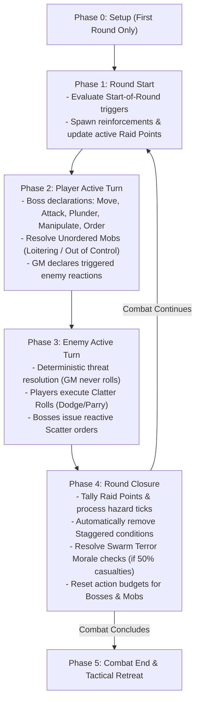

# Action Economy & Turn Flow

*A goblin battle is a storm of frantic screaming, chaotic orders, flying junk, and desperate scurrying. Victory belongs to the Boss who spends their momentum wisely—knowing when to strike, when to command the horde, and when to save an action to dive out of the way of a swinging axe.*

This chapter defines the action budgets for **Goblin Bosses** and **Mobs**, the standard action catalog, reaction holding mechanics, and the structured 5-Phase combat loop.

---

## Action Budgets & Categories

During an encounter, time is measured in **Rounds**. Every round, combatants receive a fresh allocation of actions that resets at the start of each round.

>> **Round Action Budgets:**
>> *   **Goblin Boss:** 3 Standard Actions + 1 to 3 Free Orders + Free Actions
>> *   **Goblin Mob:** 2 Actions (Governed by the Boredom Rule)

### Goblin Boss Action Budget
Every **Goblin Boss** receives the following action budget per round:
1.  **Three (3) Standard Actions**: The core currency of your turn. Standard Actions are spent to **Move**, **Attack**, **Plunder**, **Manipulate**, or issue an **Order**. Unspent Standard Actions may be saved to perform **Reactions** during the enemy turn.
2.  **Free Orders per Round**: An innate command allowance determined by your **Mouth** stat (1 Free Order at Mouth 1–2; 2 Free Orders at Mouth 3–4; 3 Free Orders at Mouth 5). Free Orders allow commanding Mobs without spending your precious Standard Actions.
3.  **Free Actions**: Minor, instantaneous maneuvers that cost zero Standard Actions (e.g. dropping an item, speaking, shouting a battle cry, drawing 1 light item once per turn).
4.  **Reactions**: Out-of-turn defensive or triggered responses (such as **Dodge**, **Parry**, **Scatter**, or reactive Quirks). Performing a Reaction strictly requires spending a saved **Standard Action** (or an unused Free Order for the Scatter reaction).

### Mob Action Budget
Every allied **Mob** possesses a strict budget of **two (2) actions** per round:
*   Mobs only act when given an **Order** by a Boss or during the **Unordered Mobs** step of the Player Active Turn.
*   If an Order directs a Mob to spend both actions on offense or movement, the Mob has 0 saved actions remaining and cannot react defensively if attacked later in the round.

### The Boredom Rule
Goblins have notoriously short attention spans and cannot stay focused on repetitive tasks.
*   **The Constraint**: A **Mob** cannot perform the exact same action twice in a single round. A Mob cannot Attack twice or Plunder twice in the same round.
*   **The Sole Exception**: A Mob *can* perform the **Move** action twice in a single round if it is actively charging toward an enemy or fleeing from danger.

---

## Standard Action Catalog

The following five actions constitute the core activities available to **Goblin Bosses** and **Mobs**:

>> **Standard Actions:** 1. **Move** | 2. **Attack** | 3. **Plunder** | 4. **Manipulate** | 5. **Order**

### 1. Move (Boss or Mob)
Spend 1 action to cross up to your **Movement** rating in connected **Zones**:
*   **Boss Movement**: Equal to your derived **Movement** stat (2 to 5 Zones based on **Slink**; see [Boss Profile and Gang](02_Boss_Profile_and_Gang.md)).
*   **Mob Movement**: Baseline 2 Zones per Move action (see [Mob Mechanics](06_Mob_Mechanics.md)).
*   **Environmental Profiles**: Crossing hazardous terrain, climbing vertical cliffs, or leaping chasms requires testing **Slink** against the established **Zone Profile** (e.g. `Slink 5+/1`; see [Zones, Movement & Environment](04_Zones_and_Movement.md)).

### 2. Attack (Boss or Mob)
Spend 1 action to engage an enemy in combat:
*   **Melee Attack**: Roll your **Tough** dice pool against the target's static **Defence TN** in your current Zone.
*   **Ranged Attack**: Roll your **Slink** dice pool against the target's static **Defence TN** across connected Zones within weapon range.
*   **Mob Attack**: Mobs roll **Size d6** for melee attacks (or 2d6 for ranged thrown attacks; see [Combat Engine](05_Combat_Engine.md)).

### 3. Plunder (Boss or Mob)
Spend 1 action to snatch, strip, and secure treasure in your current Zone:
*   **Securing Loot**: Collect loose Loot items, open unlocked chests, or strip valuables from fallen enemies (see [The Raid Loop](09_The_Raid_Loop.md)).
*   **Mob Plundering**: A Mob spending a Plunder action strips up to its current **Size** in loose Loot items from the Zone into its Loot Capacity.

### 4. Manipulate (Boss or Mob)
Spend 1 action to interact with physical mechanisms, terrain objects, or volatile contraptions:
*   **Simple Manipulation**: Open doors, throw levers, pick up dropped weapons, light torches, or uncork potions (requires no roll).
*   **Complex Manipulation**: Picking complex locks, disarming traps, or sabotaging steam pipes requires a **Brains** test against the mechanism's profile (e.g. `Brains 5+/2`).

### 5. Order (Boss Action Only)
Spend 1 **Free Order** (or 1 **Standard Action**) to issue verbal or physical commands to an allied **Mob**:
*   **Controlled Mobs**: Issuing orders to a Mob whose **Size** is <= your current **Grunt** requires no dice roll.
*   **Rebellious Mobs**: If Mob Size > your current Grunt, issuing an order requires passing an immediate **Rebellion Test** (`Tough or Mouth 5+/[Mob Size]`).
*   **Scope of Orders**: An Order directs the Mob to spend 1 or both of its round actions immediately (e.g. "Move and Attack!", "Plunder the chest!", "Hold the line!").

>> **IMPORTANT (Free Orders vs. Standard Orders):** Free Orders can only be spent on the **Order** action. They cannot be converted into personal attacks, movement, or plunder actions for the Boss.

---

## Free Actions & Free Orders

To maintain fast tactical flow, minor adjustments and commanding shouts do not consume your primary combat budget.

### Free Actions
A **Free Action** takes negligible time and can be performed freely on your turn (up to a reasonable limit enforced by common sense):
*   Dropping a held weapon or item to the ground.
*   Speaking a short sentence, screaming an insult, or sounding a war horn.
*   Drawing or stowing 1 light weapon/item (once per turn).
*   Spending a **Critical Success** bonus action to Move, Plunder, or Manipulate.

### Free Orders
A **Free Order** is a dedicated command shout granted by your **Mouth** stat. 
*   Free Orders function identically to the standard **Order** action, but **do not consume any of your 3 Standard Actions**.
*   You may spend Free Orders during your turn to command Mobs, or save an unused Free Order to shout the reactive **"Scatter!"** command during the enemy turn.

[MISSING RULE / GAP: Free Order Action Permissibility in Self-Defense Reactions — Rules clarify that Free Orders can be saved to issue a reactive "Scatter!" command to a Mob, but must explicitly define whether an unused Free Order can be spent by the Boss to Dodge or Parry in self-defense. Resolution: Free Orders are strictly limited to Mob command actions. A Boss cannot spend a Free Order to actively Dodge or Parry an attack directed at the Boss's own person; personal evasion strictly requires spending a saved Standard Action.]

---

## Reactions & Holding Actions

Combat in **Gobbos** is reactive. Enemies act deterministically, and player survival depends on tactical action preservation.

>> **The Reaction Doctrine:**
>> *   **SAVE Standard Actions on your turn** -> Spend as Reactions on enemy turn
>> *   **SPEND ALL Actions on your turn** -> 0 Active Defense (Armor only!)

### Holding Actions for Defense
On the Player Active Turn, you are not required to spend all 3 Standard Actions. Any unspent Standard Actions are **held**:
*   **Active Defense Requirement**: When targeted by an incoming enemy attack or area hazard during the Enemy Active Turn, you must spend **1 saved Standard Action** to make an active defense roll (**Dodge** or **Parry**).
*   **Zero Saved Actions**: If you spent all 3 Standard Actions on your turn, you have **0 saved actions**. You cannot attempt to actively evade, and must rely entirely on passive **Armor Dice** to absorb the strike!

### Reaction Types
1.  **Dodge (Boss Reaction)**: Spend 1 saved Standard Action. Roll your active **Slink** dice pool against the incoming attack's **Threat TN** in the **Clatter Roll**. Scoring successes >= Threat TN completely negates the attack (0 damage).
2.  **Parry (Boss Reaction)**: Spend 1 saved Standard Action. Roll your active **Tough** dice pool against the incoming attack's **Threat TN** in the **Clatter Roll**. Requires an equipped **Shield** or **Heavy Weapon**. Scoring successes >= Threat TN completely negates the attack (0 damage).
3.  **Scatter (Mob Reaction)**: Spend 1 saved Boss Standard Action (or 1 unused Free Order) to order a targeted Mob with >= 1 unused action to disperse. Roll your Boss's **Mouth** pool against `Threat TN + (Mob Size - 1)`. Success negates damage and scurries the Mob 1 Zone into cover.
4.  **Reactive Quirks**: Specific Boss abilities (such as *Meat Shield* or *Ankle Bite*) trigger out of turn by paying their stated Grunt or Reaction cost.on cost.

---

## The 5-Phase Round Flow

Every round of combat follows a strict 5-phase sequence:

### Phase 0: Combat Setup (Initial Encounter Start)
1.  **Zone Graph Deployment**: The GM reveals the node graph of interconnected **Zones**, identifying terrain traits, cover points, and baseline **Zone Profiles** (`Difficulty+/TN`).
2.  **Unit Placement**: Place Bosses, allied Mobs, and visible enemies in starting Zones.
3.  **Objective Declaration**: The GM declares active **Raid Point** objectives and visible **Loot** caches.

### Phase 1: Round Start
1.  **Condition Triggers**: Resolve any conditions or environmental hazards with "Start of Round" triggers (e.g. acid burns, regeneration).
2.  **Reinforcements**: Deploy newly arriving enemies or wandering patrols into entry Zones.
3.  **Raid Point Assessment**: Update active timers or moving objectives.

### Phase 2: Player Active Turn
1.  **Player Declarations**: Players act in any order they choose. Bosses spend Standard Actions and Free Orders to move, attack, plunder, manipulate mechanisms, and command Mobs.
2.  **Unordered Mobs Step**: Once all players have completed their actions, any allied Mob that did not receive an Order this round resolves its behavior:
    *   *Loitering Mob*: Roll on the Loitering Table (spends 1 action, saves 1 action for defense).
    *   *Out of Control Mob*: Roll on the Out of Control Table (spends 2 actions, saves 0 actions).
3.  **Enemy Reactions**: The GM resolves any triggered enemy reactions (e.g. counter-attacks or opportunity shots).

### Phase 3: Enemy Active Turn
Enemies act deterministically in accordance with their statblock profiles:
*   Standard enemies and Enemy Mobs receive **2 actions**; Apex Bosses receive **3 actions**.
*   Enemies move toward priority targets and unleash attacks with listed **Threat Profiles** and flat **Damage**.
*   Players resolve incoming attacks via the **Clatter Roll**, spending saved Standard Actions to Dodge or Parry, shouting "Scatter!" to save Mobs, or rolling passive Armor Dice.

### Phase 4: Round Closure
1.  **Raid Points Tally**: Tally confirmed and contested Raid Points for the round.
2.  **End-of-Round Ticks**: Resolve lingering hazard ticks (e.g. fire spreading on 1d6 roll of 5–6, poison degradation).
3.  **Clear Staggered**: Automatically remove the **Staggered** condition from all PCs, Mobs, and enemies.
4.  **Attrition Morale Checks**: If any Mob or enemy force ends the round having suffered 50% or more casualties, resolve an end-of-round **Morale Check** (or **Swarm Terror Check**; see [Mob Mechanics](06_Mob_Mechanics.md)). *(Note: Immediate triggers like Commander deaths or Beast panic resolve mid-phase as soon as they occur).*
5.  **Reset Action Budgets**: Reset all Boss budgets to 3 Standard Actions + Free Orders, and all Mob budgets to 2 Actions.

---

## Combat End & Tactical Retreat

Combat concludes when all enemies are slain, all PCs are eliminated, or one side flees the battlefield.

### Fleeing & Disengaging
Goblins are practical cowards; a tactical retreat preserves stolen Loot and saves lives.
*   **Escape Zones**: To escape an encounter, a Boss or Mob must enter a designated exit Zone and spend 1 Move action to withdraw.
*   **Disengaging from Melee**: Leaving an engaged enemy (**In Your Face**) without care triggers an immediate Opportunity Attack. To disengage safely, a Boss or Mob spends 1 Standard Action (or 1 Mob Action) to **Disengage**, testing `Slink 5+/[Highest Enemy Defence TN]`:
    *   **Success**: The unit withdraws safely into **Here** or an adjacent connected Zone (**There**) without triggering enemy reactions.
    *   **Failure**: The engaged enemy may spend 1 **Reaction** to execute an Opportunity Attack. The Boss receives a free reactive **Dodge Clatter Roll** (or the Mob receives a free **"Scatter!" Roll**). The unit completes its movement regardless of the outcome.
*   **Careless Fleeing / Panic Sprint**: A Boss or Mob spending a standard **Move** action to flee without disengaging triggers an **Unchecked Strike** from any engaged enemy with a Reaction (Boss/Mob cannot actively Dodge/Scatter, relying only on passive **Armor Dice**).
*   **The Heavy Loot Restriction (Bulk 3+)**: Hauling an unwieldy item of **Bulk 3 or higher** requires two hands. You **cannot perform a Disengage action while clutching a Bulk 3+ item**. To escape safely, you must drop the heavy loot as a Free Action, hand it off to a Mob, or perform a Careless Sprint.
