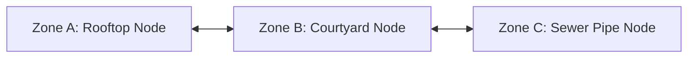
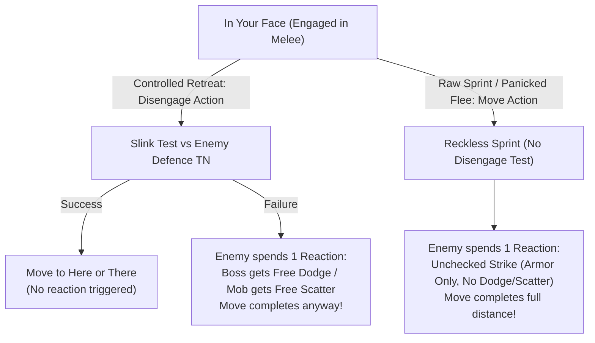
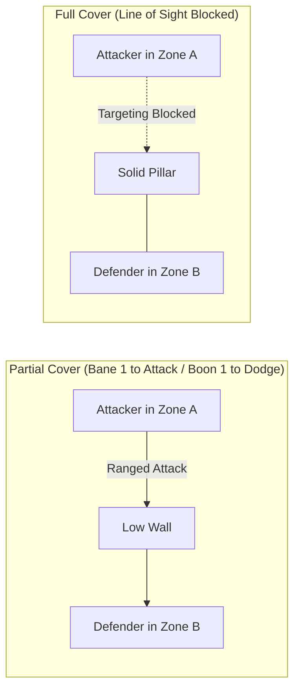

# Zones, Movement, and Environment

*Battlefields in Gobbos are dynamic, chaotic playgrounds where verticality, collapsing scenery, and hazardous obstacles matter far more than measuring inches on a grid. Goblins scurry through pipes, leap across burning chasms, and hide behind crumbling statues to outmaneuver taller, stronger foes.*

---

## Zone Topology & Spatial Abstraction

Tactical combat and exploration in **Gobbos** operate on an abstract node graph rather than a square or hex grid. The physical environment is divided into discrete, bounded spatial units called **Zones**.

### Discrete Tactical Nodes
A **Zone** represents a distinct environmental feature or bounded room, such as a tavern taproom, a raised wooden balcony, a slippery courtyard, a sewer tunnel, or a narrow rooftop. 
*   **Inter-Zone Distance:** Distance between separate rooms or clearings is measured as the number of connected Zone boundaries (steps) along the shortest available path.
*   **Adjacency & Connectivity:** Two Zones are adjacent if they share a direct spatial connection (a doorway, an open archway, a flight of stairs, or an open courtyard border). Blocked passages or sheer cliffs require specific actions or tools to cross.

### Spatial Properties of a Zone
Every Zone possesses baseline structural properties:
1.  **Connectivity & Passages:** Passages between Zones can be **Open** (free movement), **Chokepoints/Doors** (restricted frontline width), **Elevated/Cliffs** (requires climbing), or **Blocked** (requires tools or brute force to clear).
2.  **Capacity & Congestion:** A standard open Zone accommodates a soft capacity of up to **Size 6 total units** (a Goblin Boss or standard humanoid counts as **Size 1**; a Mob counts as its current **Size**). Exceeding this capacity causes **Overcrowding**: all occupants suffer a **Bane 1 (-1d)** penalty on physical **Dodge** and traversal checks.
3.  **Elevation Tiers:** Vertical differences are measured in discrete **Elevation Tiers** (Tier 0 Ground, Tier +1 Raised/Ledge, Tier -1 Pit/Chasm). Climbing 1 vertical Tier requires 1 **Move** action plus climbing gear or a successful `Slink 5+/1` test. Falling inflicts **1 Damage per vertical Tier fallen** and knocks the falling creature **Prone**.

---

## The Five Distance Bands

To eliminate grid measurement while allowing rich tactical combat, positioning both within and across Zones is tracked using five relative **Distance Bands**:

| Distance Band | Relative Location | What It Means Mechanically |
| :--- | :--- | :--- |
| **In Your Face** | Engaged in Melee | Tangled in close combat with a specific target. Required for Melee attacks. Leaving requires a **Disengage** action or triggers an Opportunity Attack. |
| **Here** | Same Zone (Unengaged) | Occupying the same room or area, but not locked in melee. Free to shoot, take cover, cast magic, or interact with loot. |
| **There** | 1 Zone Away (Adjacent) | The connected room, corridor, or courtyard next door. Standard throwing weapons, short-range spells, or 1 **Move** action. |
| **Over There** | 2 Zones Away (Long) | Down a long hallway or across a large courtyard. Standard bows, slings, and crossbows. |
| **Far Away** | 3+ Zones Away (Extreme) | Edge of line of sight, distant sniper perches, heavy arbalests, or artillery. |

---

## Movement & Tactical Positioning

Movement in **Gobbos** is measured in discrete Zones crossed and position adjustments between Distance Bands.

### The Move Action
Spending one **Standard Action** (or one **Mob Action**) on a **Move** action allows a character or Mob to traverse the battlefield:
*   **Within a Zone:** Move from **Here** to **In Your Face** with a target, or reposition between cover points in the same Zone.
*   **Across Zones:** Cross **1 connected Zone** (moving from **Here** in your current Zone to **Here** in an adjacent Zone).
*   **Entering Melee from Afar:** Entering an adjacent Zone and attacking in melee requires two separate actions: 1 **Move** action to enter the Zone (**There** to **Here**), followed by 1 **Attack** action to close in and strike (**In Your Face**).

---

## Engaging, Disengaging & Fleeing

Combatants inside the same Zone are not automatically locked in melee. A Zone can hold archers taking cover (**Here**), goblins looting a chest (**Here**), and a Boss wrestling a guard (**In Your Face**) without dragging everyone into one melee tangle.

### 1. Engaging in Melee
To attack a target with a melee weapon, you must close distance to get **In Your Face** with that target:
*   If you are already in the same Zone (**Here**), closing into **In Your Face** is performed as part of your **Attack** action.
*   Multiple allies can get **In Your Face** with the same enemy to gain the **Flanking** bonus (**Boon 1 (+1d)** on Melee attacks).

### 2. Controlled Disengage (The Disengage Action)
When you are **In Your Face** with an active enemy and wish to retreat carefully without leaving yourself wide open:
*   **Action Cost:** Spend 1 **Standard Action** (for a Boss) or issue an **Order** directing an allied Mob to spend 1 **Mob Action**.
*   **Movement Allowance:** Move from **In Your Face** to **Here** (same Zone), or withdraw into an adjacent connected Zone (**There**).
*   **The Agility Test:**
    *   *Goblin Boss:* Roll your **Slink** dice pool against `5+/[Highest Engaged Enemy Defence TN]`.
    *   *Goblin Mob:* Roll the standard Mob agility pool (**flat 2d6 Slink**) against `5+/[Highest Engaged Enemy Defence TN]`.
*   **Resolution:**
    *   **Success:** You slip away cleanly. No enemy reactions are triggered.
    *   **Failure:** The engaged enemy may spend 1 **Reaction** to strike on the way out. Because your withdrawal was guarded, you receive your active defense for free without spending an extra action:
        *   *Goblin Boss:* Roll an immediate **Dodge Defence Roll** (`Slink` vs Threat TN) or absorb with Armor.
        *   *Goblin Mob:* The Boss rolls an immediate **"Scatter!" Roll** (`Mouth` vs `Threat TN + Mob Size - 1`) or absorbs with Mob Armor.
    *   **Movement Never Halts:** Regardless of whether the test succeeds or fails (and whether damage is taken), the moving unit **always completes its movement** to the declared destination.

### 3. Careless Sprint & Panicked Fleeing (Move Action while Engaged)
If a Boss or Mob chooses to spend a standard **Move** action to sprint away from **In Your Face** without disengaging, or if a Mob's **Morale breaks** and it flees:
*   **The Penalty:** Every engaged enemy with an available **Reaction** may immediately spend 1 Reaction to execute an **Unchecked Strike** against the fleeing unit.
*   **Unchecked Strike Resolution:**
    *   *Goblin Boss:* The Boss cannot actively Dodge and must rely purely on passive **Armor Dice** to mitigate the damage to **Grit**.
    *   *Goblin Mob:* The Mob cannot Scatter; damage is dealt directly to its lowest active health die, mitigated only by passive **Mob Armor Dice**.
*   **Full Movement:** The fleeing unit completes its full movement speed immediately.

### 4. Enemy Disengagements & PC Opportunity Attacks
When an engaged enemy attempts to leave **In Your Face** with a Goblin Boss or allied Mob:
*   **If the Enemy uses a Controlled Disengage:** The GM declares the withdrawal. If a Boss or Mob has a saved **Reaction** (or saved Mob action), they may attempt to intercept. If the enemy fails their withdrawal test, the player spends 1 saved Reaction to make a standard **Melee Attack** roll.
*   **If the Enemy Flees in Panic (Broken Morale / Swarm Terror):** The enemy rushes away recklessly. Any engaged Boss or Mob with a saved Reaction may spend it to make an immediate **Melee Attack with a Boon 1 (+1d)**!

### 5. Heavy Loot Restriction (Bulk 3+)
Wielding or hauling an unwieldy object of **Bulk 3 or higher** requires two hands and heavy focus. A Boss or Mob **cannot perform a controlled Disengage action while carrying Bulk 3+ loot**. To escape safely, the character must drop the heavy loot as a **Free Action**, hand it off, or perform a Careless Sprint (taking an Unchecked Strike).

---

## Cover & Visibility

Obstacles, masonry, trenches, thick smoke, and darkness alter ranged targeting, melee charges, and line of sight.

### 1. Cover Types
*   **Partial Cover (Waist-high walls, crates, furniture, trenches, allied Mobs):**
    *   *Player Shooting Enemy in Cover:* The Player rolls their **Ranged Attack** dice pool with a **Bane 1 (-1d)** penalty against the enemy's static Defence TN.
    *   *Enemy Shooting Player in Cover:* The Player gains a **Boon 1 (+1d)** to their active **Dodge** (**Slink**) pool during a **Defence Roll** (or adds a **+1d Boon** to passive **Armor Dice**).
*   **Full Cover (Solid stone pillars, iron doors, thick walls):**
    *   A combatant behind Full Cover cannot be targeted by direct ranged attacks, single-target spells, or line-of-sight abilities originating from that vector.
    *   Bypassing Full Cover requires spending movement to cross into a connected Zone that clears the line of sight.

### 2. Snap-Shots & Popping Out from Full Cover
A combatant hunkered behind Full Cover (such as a stone pillar or doorway jamb) may lean out to make a ranged attack without permanently abandoning their cover:
1.  **The Snap-Shot:** Firing from Full Cover is an unaligned, hurried shot. The attacker rolls their **Ranged Attack with a Bane 1 (-1d)**.
2.  **Exposed Position:** After executing the attack, the attacker is leaning out and exposed in **Partial Cover** (enemies can now target them with return fire).
3.  **Ducking Back:** To return to **Full Cover**, the combatant must spend **1 Action** (a **Move** or **Manipulate** action) to duck fully back behind the barrier.

### 3. Fortified Positions vs. Melee Charges (First-Strike Advantage)
When a combatant is entrenched behind a fortified barrier (such as a sandbag trench, heavy overturned table, or spiked barricade), the barrier protects against incoming melee charges for the **first attack of the engagement**:
*   **Player Charging an Entrenched Enemy:** The Player’s first **Melee Attack roll** against that enemy suffers a **Bane 1 (-1d)**. Subsequent attacks in that melee tangle resolve normally.
*   **Enemy Charging an Entrenched Player:** The Player receives a **Boon 1 (+1d)** to their active **Dodge/Parry Defence Roll** (or Mob Armor roll) against the enemy's opening strike. Subsequent strikes resolve normally.
*   **The Breach:** Once that opening strike is resolved, the attacker has breached the barrier. Both combatants are now tangled **In Your Face**, and the fortification bonus no longer applies between them.

### 4. Line of Sight & Environmental Concealment
Line of sight across Zones depends on the environmental density of the intervening space:
*   **Open Sightlines (Corridors, open yards):** Clear line of sight across all connected Zones up to maximum weapon range (**There**, **Over There**, **Far Away**).
*   **Obscured / Dense Terrain (Thick woods, heavy fog, toxic smoke, dense gloom):**
    *   *Sightline Cap:* Line of sight is hard-capped at **1 Zone step (There)**. You cannot target or see anything at **Over There (2 Zones)** or **Far Away (3+ Zones)**.
    *   *Concealment Penalty:* Ranged attacks targeting creatures inside or passing through an Obscured Zone suffer a **Bane 1 (-1d)** penalty on attack rolls (or grant **Boon 1 (+1d)** to Dodge Defence Rolls).
    *   *Stealth Synergy:* Occupants inside an Obscured Zone gain a **Boon 1 (+1d)** to all stealth-related **Slink** tests.
*   **Blocked Sightlines (Solid stone walls, closed portcullises, sheer cliffs):** Direct targeting and ranged attacks across this boundary are impossible.

---

## Zone Modifiers & Environmental Framework

A **Zone Modifier** is a modular environmental trait attached to a Zone that alters movement, tests, or combat resolution. A Zone starts clean and can have **zero, one, or multiple Modifiers** active simultaneously.

### Lifespan (Duration)
*   **Permanent Fixtures:** Intrinsic physical features of the environment that remain indefinitely (*Sheer Cliff, Narrow Chokepoint, Iron Portcullis, Deep Water*).
*   **Temporary / Dynamic Effects:** Transient hazards or magical effects that last for a set number of rounds or until cleared (*Smoke Cloud, Burning Ground, Grease Slick, Acid Pool*).

### The Four Trigger Types
Every Zone Modifier defines when and how its mechanical rule triggers:

1.  **Passive / Environmental:** Constantly active for all occupants and attacks passing into or through the Zone (e.g. *Darkness, Howling Wind, Narrow Chokepoint*).
2.  **Traversal (Entry / Exit):** Triggers whenever a character or Mob crosses into or out of the Zone:
    *   *Difficult Ground:* Moving through the Zone costs double movement speed (spending 2 Zones of movement capacity per Zone crossed).
    *   *Hazardous Footing:* Crossing requires a `Slink 5+/1` test; on a failure, the unit falls **Prone** and its movement ends.
3.  **Turn / Round Tick:** Triggers at the start of a combatant's turn or during the Round Closure Phase for all occupants (e.g. *Burning* dealing fire damage, *Toxic Spores* requiring a `Tough 5+/1` test or gaining **Weakened**).
4.  **Interactive Prop (Opportunity):** Requires spending a **Manipulate** or **Attack** action to interact with an environmental feature (e.g. collapsing a timber support, searching a junk pile for scrap, detonating an explosive barrel).

### Hazard Severity Tiers
When an environmental hazard inflicts damage due to a failed test or unmitigated trigger, the damage scales by severity tier:
*   **Tier 1 Hazard (Minor):** Deals **1 Damage** to a Boss's **Grit** or a Mob's lowest active health die.
*   **Tier 2 Hazard (Dangerous):** Deals **2 Damage** to a Boss's **Grit** or a Mob's lowest active health die, or inflicts a sustained condition.
*   **Tier 3 Hazard (Lethal / Catastrophic):** Deals **3 Damage** to a Boss's **Grit** or a Mob's lowest active health die, or inflicts an immediate severe condition. Catastrophic hazards (such as collapsing mine shafts) can directly remove an entire Mob health die.

### Master Tag Interactions
Zone Modifiers utilize the master tag engine (`[Fire]`, `[Wet]`, `[Gaseous]`, `[Slick]`, `[Shock]`, `[Dark]`, `[Acidic]`, `[Crushing]`). Abilities, weapons, and environmental triggers interact dynamically with these tags:
*   Electrical attacks conducted into a `[Wet]` Zone affect all wet occupants.
*   Gale-force wind effects immediately clear `[Gaseous]` smoke and cloud hazards.
*   Open flames ignited in a `[Gaseous]` zone containing flammable fumes trigger an immediate Tier 2 Area Threat explosion.

### Ad-Hoc Traversal & Interaction Checks
For unscripted environmental actions not explicitly governed by a Modifier, tests resolve using standard system difficulty tiers:
*   **Standard Feat (Jumping a low fence, climbing a sturdy ladder):** `4+/1`
*   **Risky Feat (Scaling a slick wall, leaping a chasm, forcing a stuck door):** `5+/1`
*   **Heroic / Brutal Feat (Leaping across swinging chandeliers, prying iron bars):** `5+/2`
