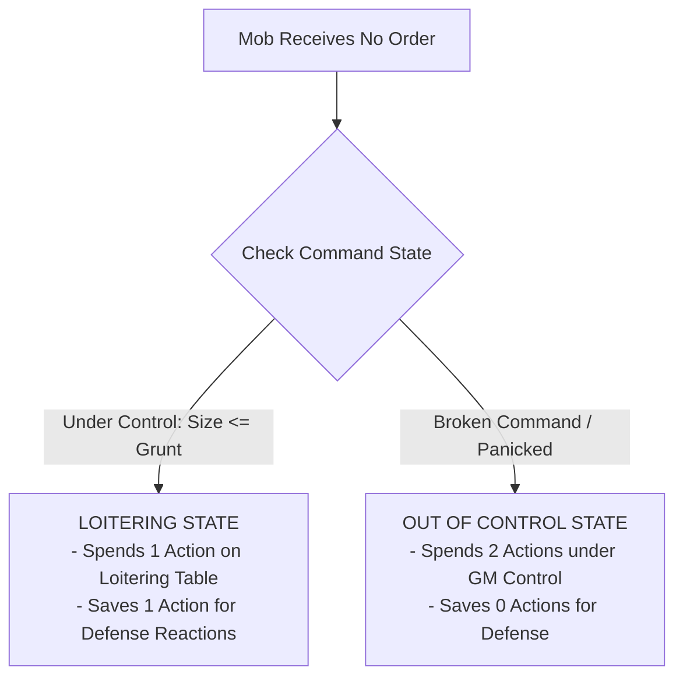

# Mob Mechanics

*A Goblin Boss is only as terrifying as the screaming swarm of runts behind you. A Mob is your living shield, your sledgehammer, and your treasure wagon. When ordered well, they overwhelm knights and plunder vaults; when left to their own devices, they pick their noses, argue over shiny pebbles, and set things on fire.*

---

## Mob Anatomy & Metrics

A **Mob** is a collection of lesser goblins under the direct command of a **Goblin Boss** (Player Character). Mobs do not possess individual attribute ratings; all of their combat strength, physical mass, and carrying capacities scale from their current **Size** rating (ranging from **Size 1** to **Size 5**).

| Classification | Size | Combat Dice | Required Grunt | Loot Capacity |
| :--- | :---: | :---: | :---: | :---: |
| **Runt Mob** | **1** | **1d6** | **1** | **4 Bulk** |
| **Skirmish Group** | **2** | **2d6** | **2** | **8 Bulk** |
| **Raid Troop** | **3** | **3d6** | **3** | **12 Bulk** |
| **War Gang** | **4** | **4d6** | **4** | **16 Bulk** |
| **Horde Company** | **5** | **5d6** | **5** | **20 Bulk** |

### Core Mob Attributes
1.  **Combat & Tough Dice Pool:** A Mob rolls a physical dice pool equal to its current **Size** (**1d6 to 5d6**) for Melee Attacks, physical force, lifting, and **Tough** hazard tests.
2.  **General Skill Baseline:** For non-physical tests (**Slink**, **Brains**, and **Mouth**), a Mob rolls a flat baseline pool of **2d6**, reflecting the aggregate cunning of the crowd.
3.  **Required Grunt:** To maintain absolute authority without command resistance, the controlling Boss must maintain a current **Grunt >= Mob Size**.
4.  **Loot Capacity:** A Mob carries up to **Size x 4 Bulk** in loose Loot and expedition gear without suffering encumbrance penalties.
5.  **Over-Laden Mobs:** If a Mob carries Bulk exceeding its Loot Capacity (up to a hard cap of **Size x 6 Bulk**), it becomes **Over-Laden**: its Movement is reduced by **-1 Zone** per Move action (minimum 1 Zone) and it suffers a **Bane 1 (-1d)** penalty on all physical tests.

---

## Mob Equipment & Loot Tradeoff

A Boss can outfit a Mob with protective armor and specialized tools, but doing so directly consumes the Mob's carrying capacity.

### Mob Armor (Scaled Bulk)
Equipping an entire Mob with armor requires sufficient scrap-plates or quilted hides for every runt in the Mob.
*   **Bulk Cost:** Mob Armor costs **Bulk equal to the Armor's Bulk rating multiplied by current Mob Size** (e.g. Light Armor costs Size x 1 Bulk; Medium Armor costs Size x 2 Bulk).
*   **Passive Armor Dice:** An armored Mob rolls its passive Armor Dice (+1d or +2d) **once per incoming attack**. Every success (**5+**) reduces incoming damage by 1 across all targeted health dice before damage is applied.
*   **Casualty Scaling:** When a Mob suffers casualties and loses Size, the armor of the fallen goblins remains on their corpses on the battlefield. Equipped Mob Armor never causes an encumbrance overload when Size drops.

### Expedition Tools & Weapons
*   **Shared Expedition Tools:** Expedition tools (such as Ropes, Crowbars, Lanterns, and Shovels) are shared across the Mob. Each tool occupies its standard flat **Bulk** rating (e.g. 1 Bulk for a Climbing Rope).
*   **Mob Weapons:** Equipping a Mob with specialized weapons (e.g. Cleavers or Greatclubs) costs **Size x Weapon Bulk**, granting the entire Mob the weapon's traits (e.g. `Heavy` granting +1 Impact Size, or `Cleave` damaging additional unengaged frontline dice).

---

## Health Dice Pool & Damage Resolution

A Mob's health is physically represented on the gaming table by a pool of **d6s equal to its current Size**, with each die starting at the **"6" face**.

> **Example (Size 3 Mob at Full Health):** `[Die 1: Face 6]` `[Die 2: Face 6]` `[Die 3: Face 6]`

### Damage Delivery Modes

| Attack Delivery Type | Mechanical Resolution Across Health Dice Pool |
| :--- | :--- |
| **Single-Target Attack** | Deduct from lowest-value active die. Spillover into next lowest die if reduced below 1. |
| **Mob-on-Mob Melee** | **The Frontline Rule:** Deduct damage simultaneously from min(Attacker Size, Defender Size) lowest-value dice. |
| **Cleaving Strike (`Cleave X`)** | Deduct damage simultaneously from up to X lowest-value active health dice. |
| **True Area Threat (`[AoE]`, Explosives)** | **Full Zone AoE:** Deduct damage simultaneously from EVERY SINGLE active health die in the Mob's pool. |

1.  **Single-Target Damage & Spillover:** Single-target strikes (arrows, single sword thrusts) apply damage directly to the Mob's **lowest-value active health die**. If the die drops below 1, that die is permanently removed from the table (reducing Mob Size by 1), and any remaining excess damage **spills over** into the next lowest die.
2.  **The Frontline Rule (Mob-on-Mob Melee):** When two Mobs clash in close combat, the attacking Mob strikes a number of health dice equal to its own current Size: **min(Attacker Size, Defender Size)**.
    *   *Lowest Dice First:* Damage is applied simultaneously to the defender's lowest-value health dice up to the engagement cap.
    *   *Simultaneous Reduction:* Each engaged die is reduced by the attack's effective damage. Any die reduced below 1 is removed.
    *   *Backline Immunity:* Unengaged backline dice suffer **0 damage**.
3.  **Cleaving Attacks (`Cleave X`):** Strikes with `Cleave X` sweep across frontline ranks, applying damage simultaneously to **up to X of the Mob's lowest-value active health dice**.
4.  **True Area Threats (`[AoE]` & Explosives):** Full-zone hazards, blast devices, and dragon breath apply damage simultaneously to **every single active health die** in the Mob's pool without an engagement cap.
5.  **Casualties & Dropped Loot:** When a Mob shrinks in Size, its Loot Capacity shrinks immediately. If carried loose Loot and tools exceed the new capacity, the controlling Boss must immediately declare which items are dropped onto the Zone floor.
6.  **Post-Combat Regrouping:** Mid-combat health dice redistribution is strictly forbidden. Once an active battle concludes (or during the Round Closure of Combat End), the Boss may freely rearrange remaining health points across all surviving dice. Lost Size can only be replenished through recruitment during the Lair Phase.

> **Example (Frontline Clash):** A Size 4 Goblin Mob has health dice reading `[6, 4, 2, 1]`. A Size 2 Town Guard unit attacks and deals 2 damage. Because the guards are Size 2, they engage the 2 lowest dice (`[1]` and `[2]`). Both dice take 2 damage and are reduced below 1 and removed. The Goblin Mob is now Size 2, with surviving dice `[6, 4]`.

---

## Boss Orders & Command Flow

A Mob receives **two (2) actions** per round, reset at Round Start. Mobs act during the **Player Active Turn** when directed by their Boss.

### Command Line of Sight & Distance
*   **Visual Line of Sight:** The Boss must maintain direct visual line of sight to the Mob (or a portion of the Mob) to issue verbal or somatic commands.
*   **Command Test Profile:** Issuing an Order to a controlled Mob within Grunt limits in the same Zone requires no roll (**Automatic Success**). When commanding across distances or exceeding Grunt, resolve using this profile:

| Command Factor | Distance / Condition | Command Resolution Rule |
| :--- | :--- | :--- |
| **Size <= Grunt** | Baseline | **Target Number (TN) = 1** |
| **Size > Grunt** | Rebellious Swarm | **TN increases by +1 per point of difference** |
| **Same Zone** | Point-blank | **+1 Automatic Success** (Guaranteed pass if Size <= Grunt) |
| **Distance <= Mouth** | Voice Range | **Normal (5+)** Difficulty test |
| **Distance = Mouth + 1** | Shouting Range | **Hard (6)** Difficulty test |
| **Distance > Mouth + 1** | Out of Range | **Command is physically impossible** |

### The Boredom Rule
>> **THE BOREDOM RULE:**
>> Goblins possess notoriously short attention spans. An ordered Mob cannot perform the exact same action twice in a single round (e.g. a Mob cannot Attack twice or Plunder twice).
>> *Exception:* A Mob may spend both actions taking **Move** actions if they are fleeing or charging.

### Action Economy Allocation
*   **Spending 2 Actions:** If an Order directs a Mob to spend both actions (e.g. Move then Attack), the Mob has 0 saved actions remaining for defense reactions.
*   **Saving 1 Action:** If an Order directs a Mob to spend only 1 action (e.g. Move into cover), its second action is saved, enabling the Boss to order an active **Scatter** reaction during the Enemy Active Turn.

---

## Unordered Mob States & Behavior Tables

Mobs that receive no direct orders from their Boss resolve their actions at the end of the **Player Active Turn** (after all player characters have finished their declarations).

### Loitering Table (1d6)
*Under control, but idle. The Mob spends **1 action** resolving the rolled behavior and saves **1 action** for defense:*

*   **1 (Bicker):** Goblins push, argue, and complain. *(Spends 1 action, saves 1 action).*
*   **2 (Inspect):** Runts pick their noses, stare at architecture, or draw crude graffiti. *(Spends 1 action, saves 1 action).*
*   **3 (Snatch):** Goblins plunder a loose shiny object or eat nearby rations (resolves as a Plunder action if Loot is present). *(Spends 1 action, saves 1 action).*
*   **4 (Wander):** The Mob scurries **1 Zone** in a random direction, refusing to leave visual line of sight of their Boss. *(Spends 1 action, saves 1 action).*
*   **5 (Snoop):** The Mob peers around curiously, granting a **Boon 1 (+1d)** to the next allied Boss who tests to search or disarm traps in the Zone. *(Spends 1 action, saves 1 action).*
*   **6 (Taunt):** Goblins scream insults, rattle pots, and moon the nearest enemy. *(Spends 1 action, saves 1 action).*

### Out of Control Table (1d6)
*Uncontrolled swarm. The Mob spends **both actions** running amok under GM direction (0 saved actions):*

*   **1–2 (Panic / Flee):** If a **Terrifying Enemy** (Elite, Boss, or creature with `[Frightening]`) is present, the Mob spends both actions fleeing toward the nearest exit. Otherwise, they squabble violently: the Mob takes **1 Damage** to its lowest health die and gains the **Staggered** condition. *(Spends 2 actions, 0 saved).*
*   **3–4 (Loot / Trash):** If unattended loot or food is present, the Mob plunders it (eating food heals **1d6 damage** on its health dice). Otherwise, they spend both actions vandalizing doors, crates, and scenery. *(Spends 2 actions, 0 saved).*
*   **5–6 (Frenzy):** The Mob swarms and attacks the nearest living creature in their Zone (friend or foe!). If no creatures are present, they sprint **1 Zone** toward the loudest noise. *(Spends 2 actions, 0 saved).*

### Rallying & Regaining Control
To restore command over an **Out of Control** Mob, the Boss must spend a Standard Action (**Order**) on your turn and pass a **Mouth** test against the standard command distance profile. On a success, the Mob immediately returns to the **Ordered** state; on a failure, it remains Out of Control.

---

## Mob Defense & The "Scatter!" Reaction

Mobs do not possess individual stats and cannot naturally perform a Dodge or Parry. When targeted by an incoming attack during the **Enemy Active Turn**:

### 1. Passive Armor Roll
If equipped with Mob Armor, the player rolls the Mob's passive **Armor Dice** once per incoming attack. Every success (**5+**) reduces incoming damage by **1** across all targeted health dice before damage is applied.

### 2. The "Scatter!" Order Reaction
If the Mob has at least **1 saved action remaining**, the Boss may spend a saved Standard Action (or an unused **Free Order**) to scream "Scatter!":

1.  **Assemble Mouth Pool:** The Boss rolls a dice pool equal to the Boss's **Mouth** stat.
2.  **The Size Penalty:** Large swarms are clumsy to disperse. The Scatter TN equals the attack's Threat TN plus the Mob's Size penalty:
    **Scatter TN** = **Threat TN** + (**Mob Size** - 1)
3.  **Clean Scatter:** If Mouth successes >= Scatter TN, the Mob evades completely (**0 Damage taken**) and immediately moves **1 Zone** into available cover.
4.  **Failed Scatter:** If Mouth successes < Scatter TN, the Mob takes incoming damage normally, mitigated only by passive Armor Dice.
5.  **The Scatter Gamble (Gobbo Gamble):** If the initial Scatter roll falls short, the Boss may reroll all **1s** on the Mouth dice. 
    *   *If the Gamble Succeeds:* The Mob pulls off a chaotic miracle dive, taking **0 Damage**.
    *   *If the Gamble Fails:* Catastrophic stampede! The Mob takes the full attack damage, suffers **1 Trample Damage to EVERY active health die** in its pool, drops **1 Bulk** of carried Loot, and immediately becomes **Out of Control**. If the Boss occupies the same Zone, the Boss is caught in the stampede and gains the **Staggered** condition.

---

## Morale & Swarm Terror

Goblins are cowardly by nature, and even tall-men break when swarmed by a screaming green horde. Morale resolution is strictly player-facing, requiring zero GM dice rolls.

### Universal Morale Trigger Windows
Morale checks are evaluated during two distinct combat windows:
1.  **Immediate Triggers (Mid-Phase):** Resolved immediately when an event occurs:
    *   *Commander Slain:* When an Enemy Commander or Leader is killed or incapacitated.
    *   *Orphaned Mob:* When a Player Mob's controlling Boss is incapacitated.
    *   *Ancestry Panic:* When an adversary with a fear flaw is triggered (e.g. a `[Beast]` exposed to `[Fire]` or `[Loud]` tags).
    *   *Active Intimidation:* When a Boss spends an action to roar, bang shields, or unleash terrifying magic.
2.  **Attrition Trigger (Phase 4: Round Closure):** Evaluated at the end of the round for any group that sustained heavy losses:
    *   *50% Casualties:* Any Mob or enemy squad that ends the round having lost **50% or more of its starting Size or unit headcount**.

### Player Mob Morale Checks
When an allied Mob is forced to test morale:
*   **Boss Active:** The controlling Boss makes an immediate **Mouth** or **Grunt** test against **Normal (5+/1)** difficulty (or **5+/2** if facing an enemy with the `[Terrifying]` or `[Frightening]` tag).
    *   *Success:* The Boss cracks the whip or screams authority; the Mob holds discipline and remains **Ordered**.
    *   *Failure:* Discipline shatters. The Mob enters the **Out of Control** state for 1 round, rolling on the Out of Control Table during its next turn.
*   **Boss Incapacitated (The Orphaned Mob):** If the controlling Boss is knocked unconscious or killed, the Mob has no leader to maintain order. The Mob **automatically fails without rolling** and immediately enters the **Out of Control** state at the start of the next round.

### Enemy Morale & The Swarm Terror Check
When an enemy force is forced to test morale, the players unleash their collective intimidation:

**Swarm Terror Pool** = **Surviving Mob Sizes in Same & Adjacent Zones** + **Surviving Bosses in Same & Adjacent Zones**

*   **The Roll:** Players assemble and roll the combined **Swarm Terror Pool** against the enemy group's printed **Morale Profile** (`[Target Face]+/[Required Successes]`, e.g. `4+/1` for Militia, `5+/2` for Watchmen, `6/2` for Knights; or `Immune` for Undead and Fiends).
*   **Success (Successes >= Morale TN):** The enemy force breaks!
    *   *Panicked Rout:* Broken enemies drop heavy weapons and carried Loot, and must spend **two (2) Move actions** on their turns fleeing toward the nearest exit until off the map.
    *   *The Parting Shot:* To prevent excessive table rolling during a rout, the fleeing group triggers **exactly one (1) free Opportunity Attack (or one free Plunder grab)**, awarded to **one Boss or Mob of the players' choice** in that Zone.
*   **Failure (Successes < Morale TN):** The enemies steel their nerves, hold the line, and continue fighting normally.
*   **Commander Rally:** If an **Enemy Commander** survives and did not break, the commander may spend **1 Standard Action** on their active turn to attempt a Rally, testing against the players' Swarm Terror profile to restore order.

---

## Splitting, Merging & Cross-Gang Mobs

### Splitting a Mob
A Boss can spend one **Order Action** to split a Mob into two smaller Mobs:
*   **Dice Distribution:** The Boss freely divides active health dice between the two new Mobs (e.g. a Size 5 Mob splits into Size 3 and Size 2).
*   **Gear Distribution:** Equipped Mob Armor travels with the goblins wearing it (both Mobs retain the armor tier). Carried tools are explicitly assigned to one of the split Mobs.

### Merging Mobs
Two allied Mobs occupying the same Zone can be merged into a single Mob using an **Order** or **Manipulate** action:
*   **Dice Combination:** Add surviving health dice together. Total combined Size **cannot exceed the Boss's Grunt** (otherwise an immediate Rebellion test is triggered: Mouth or Tough `5+/Size`).
*   **Armor Dilution:** If an armored Mob merges with an unarmored Mob, the armor is diluted and drops by **1 Tier** (e.g. Medium Armor becomes Light Armor) unless additional armor is equipped.

### The Super-Mob (Cross-Gang Merging)
Mobs belonging to different player Gangs can merge into a single colossal **Super-Mob**:
*   **Command Friction:** Any Boss attempting to issue an Order to a Cross-Gang Super-Mob must pass a **Grunt test** (**Tough** if in the same Zone, or **Mouth** from afar).
*   **In-Fighting Trigger:** Whenever a Cross-Gang Mob rolls a dice pool for *any check* (Attack, Move, or Hazard), **every 1 rolled deals 1 self-inflicted Damage to the Mob's active health dice**.

---

## Mob Sacrifice Maneuvers

When a Gang lacks proper tools, a Boss can order expendable runts into desperate tactical maneuvers:

| Maneuver Name | Minimum Mob Size | Cost | Mechanical Benefit |
| :--- | :---: | :--- | :--- |
| **Gobbo Pyramid** *(Living Ladder)* | **Size 2** | **1 Mob Action** | Goblins stack onto shoulders. An allied Boss or character climbs **1 vertical Zone** without making a climbing test. |
| **Living Bridge** *(Chasm Crosser)* | **Size 3** | **1 Mob Action** + **1 Mob Damage** | Goblins link arms across a chasm. Allied characters walk across safely without tests. The Mob takes 1 Damage from trample strain. |
| **Canary Runt** *(Trap Tripper)* | **Size 1** | **1 Mob Health Die** | A single runt triggers a discrete pressure trap or tests thin ice, clearing the passage safely for the rest of the gang. |
| **Meat Cushion** *(Soft Landing)* | **Size 1** | **Mob Reaction** (Takes Fall Damage) | If a Boss falls into a Zone occupied by an allied Mob, the Mob absorbs the blow: Boss takes **0 Damage**; Mob takes the full fall damage across its health dice. |
| **Gnaw the Hinges** *(Pry-bar Substitute)* | **Size 2** | **1 Mob Action** | The Mob tears at locked doors or chest hinges. Roll a `Tough` test (**Size dice**). If the test fails after pushing 1s, the Mob takes **1 Damage** from chipped teeth and crushed fingers. |

---

## Mechanical Gap Analysis & Missing Rules

[MISSING RULE / GAP: Mob Weapon Equipping & Scaling Rules — While Mob armor and tools have detailed Bulk rules, rules for outfitting Mobs with specialized melee weapons (e.g. Greatclubs, Cleavers, Polearms) lack an explicit framework in early drafts. Suggested Resolution: Standardize that equipping a Mob with specialized weapons costs Size x Weapon Bulk from their Loot Capacity, granting the entire Mob the weapon's built-in traits (such as Cleave or Heavy +1 Impact Size).]

[RESOLVED GAP: Swarm Terror Proximity & Cap — Swarm Terror pools are strictly bound to surviving Mobs and Bosses in the same and adjacent connected zones. Large multi-mob swarms concentrated in a single engagement represent an authentic goblin "deathball" that naturally terrifies defenders.]
