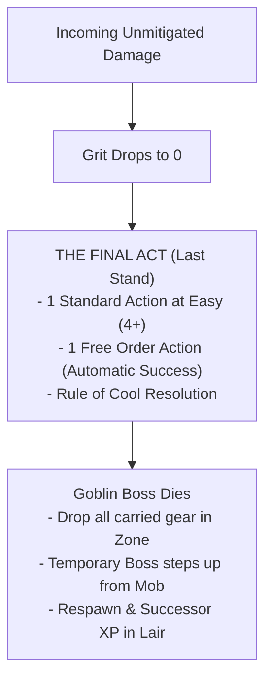

# Damage, Grit, Conditions and Wounds

*Goblins are squishy, breakable, and full of bad ideas. When a tall-man swings a poleaxe, you do not absorb the blow with stoic dignity. You duck, you shriek, your armor dents, or you get flattened into paste. Surviving a raid is not about being unbreakable; it is about making sure someone else takes the hit.*

---

## 1. Damage Resolution and Boss Grit

The Game Master (GM) never rolls attack tests or damage rolls. All enemy attacks present a deterministic **Threat Profile** (`Difficulty+/TN`) and a flat **Damage** value (see [Adversaries & Threats](12_Adversaries_and_Threats.md)).

### Boss Grit Pool
**Grit** is the mechanical tracker for a **Goblin Boss's** personal survival, physical stamina, and sheer luck. 
*   **Starting Grit:** A **Goblin Boss** has a maximum **Grit** determined strictly by the **Tough** attribute score (see [Boss Profile & Gang](02_Boss_Profile_and_Gang.md)):
    *   **Tough 1:** 3 **Grit**.
    *   **Tough 2–3:** 4 **Grit**.
    *   **Tough 4–5:** 5 **Grit**.
*   **The Synonym Ban:** A **Goblin Boss** tracks **Grit**. A **Goblin Boss** never tracks *Health* or *Wounds*. **Health Dice** are used exclusively by **Mobs** (see [Mob Mechanics](06_Mob_Mechanics.md)), and **Wounds** are tracked exclusively by **Elite** and **Boss** enemies.

### Unmitigated Damage Decrement
When an incoming attack targets a **Goblin Boss**, the **Player** resolves defense using a **Defence Roll** (see [Combat Engine](05_Combat_Engine.md)):
1.  **Active Evasion:** If the **Player** spent a saved **Standard Action** to declare a **Dodge** (testing **Slink**) or **Parry** (testing **Tough** with a shield or heavy weapon), scoring successes equal to or exceeding the attack's **Threat TN** negates the attack entirely (**0 Damage taken**).
2.  **Passive Armor Mitigation:** If active evasion fails or no saved action was available, the **Player** rolls passive **Armor Dice**. Every die showing **5+** reduces incoming **Damage** by **1**.
3.  **Grit Loss:** Any remaining unmitigated **Damage** reduces the **Goblin Boss's** current **Grit** on a 1-for-1 basis.

>> **RULE: No Mid-Roll Modifiers**
>> Damage reduction applies strictly through passive **Armor Dice** or explicit traits before deducting points. You never perform post-roll arithmetic to alter incoming damage values.

---

## 2. Zero Grit, The Final Act, and Death

When a **Goblin Boss** reaches **0 Grit**, the character dies. However, death in Gobbos is never instantaneous or silent; it triggers a blaze of chaotic glory before the character is removed from play.



### The Final Act (Last Stand)
The moment your **Grit** reaches **0**, your **Goblin Boss** immediately triggers **The Final Act**:
*   **Action Grant:** You immediately receive **1 Standard Action** plus **1 Free Order Action**, resolved out of turn sequence before your character falls.
*   **Easy Difficulty:** The **Standard Action** is resolved at **Easy (4+)** difficulty, regardless of standard environmental penalties or combat conditions.
*   **Guaranteed Orders:** The **Order Action** succeeds automatically without a dice roll, provided the target **Mob** is within visual line of sight.
*   **The Rule of Cool:** The **GM** must interpret the outcome under the **Rule of Cool**, allowing the dying **Goblin Boss** to pull off an epic stunt, detonate a hidden explosive, shove an ally to safety, or take down a hated nemesis.
*   **Death Execution:** Once **The Final Act** concludes, the **Goblin Boss** dies permanently. All carried weapons, armor, tools, and **Loot** drop to the floor in the current **Zone**.

### The Temporary Boss
During the remainder of the active raid, the **Player** cannot generate a new full **Goblin Boss** until returning to the **Lair**:
*   **Stepping Forward:** If the deceased character's **Gang** still has a surviving **Mob** on the map, one runt steps forward as a **Temporary Boss**.
*   **Profile:** The **Temporary Boss** is controlled by the **Player**, possesses no **Feats**, and has all attribute stats reduced by **1** compared to the deceased **Goblin Boss** (to a minimum attribute score of **1**).
*   **Survival:** The **Temporary Boss** allows the **Player** to remain active, issue commands, and extract surviving **Loot** back to the **Lair**.

### Successor Generation in the Lair
When the raid party returns to the **Lair**, the player generates a true **Successor Boss** (see [The Lair Loop & Progression](10_The_Lair_Loop_and_Progression.md)):
*   **Successor XP:** The new **Goblin Boss** starts with baseline stats plus bonus **Successor XP** equal to **Gang Infamy x 4**.
*   **Inherited Feats:** The new character inherits 1 **Gang Mark Feat** from the ancestral pool.
*   **Named Items:** The favorite weapon of the fallen boss can be recovered and enshrined as a **Named Item** in the **Lair**.

---

## 3. Enemy Wounds and The Overkill Rule

Adversaries do not use **Grit**. Instead, enemy casualties are resolved through two distinct mechanics based on threat tier:

### One-Hit Kill on Standard Enemies
Standard adversaries (peasants, town guards, minor beasts, skeleton grunts) possess no wound tracks:
*   **Execution:** When an attack roll scores successes equal to or greater than the standard enemy's **Defence TN**, the target is instantly killed and removed from the map.
*   **No Partial Damage:** Rolling fewer successes than the enemy's **Defence TN** inflicts **0 Damage** (though it may inflict the **Staggered** condition if **Impact Size** requirements are met).

### The Wounds Track (Elites and Bosses)
Powerful adversaries (**Elites** and **Bosses**) track survivability using a physical **Wounds Track** (ranging from **2 to 8 Wounds**).
*   **Baseline Hit:** Scoring successes equal to the target's **Defence TN** inflicts **1 Wound**.
*   **The Overkill Rule:** When a single attack roll exceeds the target's **Defence TN**, the attack deals **1 Wound for every full multiple of the Defence TN** scored on that roll:

**Wounds Dealt** = **Attack Successes** / **Target Defence TN** (rounded down)

> **Example:** A **Goblin Boss** strikes an Elite Solar Praetor (**Defence 2**, **5 Wounds**).
> *   Rolling **1 Success:** The attack fails to meet **Defence 2**. It deals **0 Wounds** (but may inflict **Staggered** if Impact Size >= Praetor Size).
> *   Rolling **2 or 3 Successes:** Scores 1 full multiple of 2. Inflicts **1 Wound**.
> *   Rolling **4 or 5 Successes:** Scores 2 full multiples of 2. Inflicts **2 Wounds**.
> *   Rolling **6 Successes:** Scores 3 full multiples of 2. Inflicts **3 Wounds**.

>> **GOLDEN RULE: No Fractional Wounds**
>> Remainder successes that do not form a complete multiple of the target's **Defence TN** are discarded. They do not carry over to subsequent attacks.

---

## 4. Impact Size and Stagger Resistance

When an attack scores at least **1 Success** but fails to meet the target's full **Defence TN**, the strike is a partial hit. A partial hit deals **0 Damage** and **0 Wounds**, but can throw the target off balance by applying the **Staggered** condition.

### Impact Size Values
Every attack possesses an **Impact Size** determined by its weapon traits, source entity, or spell tier:
*   **Standard Attack:** **Impact Size = 1** (or current **Mob Size** for **Mob** attacks).
*   **Heavy Weapon Trait:** +1 to **Impact Size** (a Size 1 **Goblin Boss** attacks with **Impact Size 2**).
*   **Crushing Weapon Trait:** +2 to **Impact Size** (attacks with **Impact Size 3**).
*   **Spells & Explosives:** **Impact Size** = **Spell/Explosive Tier** (T1 = Size 1, T2 = Size 2, T3 = Size 3, T4 = Size 4, T5 = Size 5).

### Mass Resistance Rule
A target is immune to the **Staggered** condition from partial hits unless the attack's **Impact Size** meets or exceeds the target's physical **Size**:

**Impact Size >= Target Physical Size**

*   **Size 1 Target (Humanoid/Goblin):** Staggered by **Impact Size 1** or higher.
*   **Size 2 Target (Warhorse/Bear):** Requires **Impact Size 2** or higher.
*   **Size 3 Target (Troll/Ogre):** Requires **Impact Size 3** or higher.
*   **Mass Resistance Execution:** If an attack's **Impact Size** is lower than the target's physical **Size**, the target has natural mass resistance and completely ignores the **Staggered** condition on a partial hit.

---

## 5. In-Game Status Conditions Matrix

Conditions represent temporary physiological, psychological, or tactical hindrances. Gobbos features **9 official systemic conditions**.

| Condition | Goblin Boss (PC) | Goblin Mob | Enemy / NPC |
| :--- | :--- | :--- | :--- |
| **Weakened** | **Bane 1 (-1d)** on **Tough** tests. | **Bane 1 (-1d)** on **Attack** rolls. | Attack **Threat TN** reduced by **1** (minimum 1). |
| **Restrained** | **Bane 1 (-1d)** on **Slink** tests; **Movement** becomes **0**. | Cannot **Scatter**; **Movement** becomes **0**. | **Movement** becomes **0**; **Defence TN** reduced by **1** (minimum 1). |
| **Dumb** | **Bane 1 (-1d)** on **Brains** and **Mouth** tests; cannot cast spells or activate **Brains** feats. | **Bane 1 (-1d)** on **Morale** checks; cannot receive complex orders. | Cannot cast spells or use tactical reactions. |
| **Silenced** | **Bane 1 (-1d)** on **Mouth** tests; cannot issue verbal orders or cast vocal spells. | Cannot hear orders; **Bane 1 (-1d)** on **Morale** checks. | Cannot issue orders or shout tactical warnings. |
| **Blinded** | **Bane 1 (-1d)** on physical tests; ranged attacks are **Hard (6)**; cannot **Dodge**. | **Bane 1 (-1d)** on physical tests; ranged attacks are **Hard (6)**; cannot **Scatter**. | Attacks become **Hard (6)**; **Defence TN** reduced by **1** (minimum 1). |
| **Terrified** | **Bane 1 (-1d)** on **Brains** and **Mouth** tests; cannot move closer to source of fear. | **Bane 2 (-2d)** on **Morale** checks; **Order** tests targeting **Mob** are **Hard (6)**. | Must spend all active actions fleeing from the source of fear. |
| **Stunned** | Cannot take any **Standard Actions**, **Free Actions**, or **Reactions**. | Cannot take any actions or reactions. | Skips active turn; incoming attacks against target are **Easy (4+)**. |
| **Prone** | **Bane 1 (-1d)** on **Slink** and **Dodge** tests; costs 1 **Move** action to stand up. | **Bane 1 (-1d)** on **Scatter** tests; costs 1 **Move** action to stand up. | Incoming melee attacks against target gain **+1d**; costs 1 **Move** action to stand up. |
| **Staggered** | **Bane 1 (-1d)** on **Dodge** and **Parry** Clatter rolls. | **-1 Armor Die** (or **-1d** on **Scatter** tests). | **Defence TN** reduced by **1** (minimum 1). |

>> **RULE: Bane Stacking Limits**
>> Multiple conditions applying Banes to the same attribute do not stack beyond the standard environmental limit. A character either has a single **Bane 1 (-1d)**, a single **Bane 2 (-2d)** from a severe specific rule, or a neutral pool if countered by Boons (see [Core Resolution](01_Core_Resolution.md)).

---

## 6. Application Triggers, Duration, and Recovery

Conditions are applied by weapon traits, spells, monster abilities, or environmental hazards. They clear according to strict duration classes:

### Round-Closure Clearance (Instant Conditions)
*   **Staggered:** The **Staggered** condition is temporary. It clears automatically from all **Goblin Bosses**, **Mobs**, and **Enemies** during the **Round Closure Phase** at the end of each combat round.

### Action Clearance (Hazard & Sustained Conditions)
*   **Environmental Obstacles:** Conditions inflicted by terrain or hazards (such as **Weakened** from toxic gas, **Restrained** from sticky mud, or **Blinded** from smoke) persist while remaining in the affected **Zone**.
*   **Standard Action Recovery:** Once in a clean **Zone**, a character can clear a sustained condition by spending **1 Standard Action** (performing a **Manipulate** action to wipe eyes, cut ropes, or catch breath) and passing a **Tough 5+/1** or **Slink 5+/1** test.
*   **Combat End:** All hazard-inflicted conditions clear automatically once combat concludes and the party catches their breath.

### Rest & Medical Recovery (Downtime Afflictions)
*   **Long-Term Afflictions:** Severe conditions (such as rotting filth fever, cursed blindness, or demonic corruption) persist beyond the raid. They can only be cleansed during the **Lair Phase** through specialized apothecary treatment, surgery, or purification rituals (see [The Lair Loop & Progression](10_The_Lair_Loop_and_Progression.md)).

### Healing Rates
*   **Goblin Bosses:** A **Goblin Boss** recovers **1 Grit per hour** of quiet, uninterrupted rest outside of combat.
*   **Goblin Mobs:** A **Mob** does **not heal** lost **Size** during a raid. Fallen goblins are permanently dead. After a battle concludes, the **Goblin Boss** may freely rearrange the face values of surviving **Health Dice** (e.g. turning two dice showing `[2, 3]` into `[5]` to consolidate stability). Lost **Size** can only be replenished by recruiting new goblins in the **Lair**.

---

## 7. Condition and Hazard Structural Schema

[CONTENT EXTENSION POINT: Environmental Hazards & Conditions]

All custom environmental hazards, status effects, and zone traps must follow this structural schema:

```markdown
### [Condition / Hazard Name]
*   **Classification:** [Status Condition | Static Environmental Obstacle | Dynamic Zone Hazard | Complex Weather Blueprint]
*   **Associated Tags:** `[Tag 1]`, `[Tag 2]` (e.g. `[Toxic]`, `[Gaseous]`, `[Slick]`, `[Burning]`)
*   **Severity Tier:** [T1 Minor | T2 Dangerous | T3 Lethal / Catastrophic]
*   **Application Trigger:** [On entering zone | At start of turn in zone | On taking unmitigated damage | On failing physical check]
*   **Target Profile / Check:** `[Stat] [Target Face]+/[Successes]` (e.g. `Tough 5+/1` or `Slink 4+/2`) to resist or avoid.
*   **Mechanical Effects:**
    *   *Goblin Boss (PC):* [Specific stat penalty, Bane modifier, movement restriction, or Grit loss]
    *   *Goblin Mob:* [Specific attack penalty, Scatter restriction, health die damage, or Morale Bane]
    *   *Enemy / NPC:* [Specific Defence TN reduction, action loss, or movement cap]
*   **Duration & Persistence:** [Instant | Round-Closure Clearance | Sustained (Action-Clear) | Encounter-Bounded | Lair-Treated]
*   **Removal / Recovery Check:** [Action cost and test required to clear, e.g. Spend 1 Standard Action in clean zone testing Tough 5+/1]
```

---

## 8. Mechanical Gaps and System Clarifications

[MISSING RULE / GAP: Mid-combat redistribution of Mob health dice is explicitly forbidden. Health dice face values can only be rearranged during the Round Closure phase of Combat End or during quiet exploration outside combat to prevent game-state manipulation during active initiative rounds.]

[MISSING RULE / GAP: Player Goblin Bosses exclusively track Grit (3 to 5 points) and never possess Wounds. Wounds are strictly reserved for Elite and Boss enemy tracks, and Health Dice are strictly reserved for Mobs. Any legacy reference to PC Wounds must be treated as Grit damage.]
