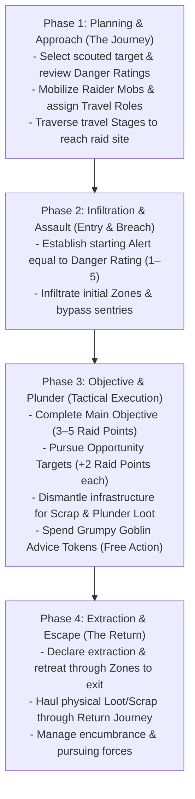

# The Raid Loop & Economy

*A goblin without a plan gets squashed. A goblin with a plan gets squashed while carrying something shiny. The raid is the lifeblood of the Warren—a high-stakes smash-and-grab where Bosses lead their Mobs into hostile territory to plunder riches, smash infrastructure, and haul back enough scrap to keep the Lair growing.*

---

## 1. The Four Raid Phases

Every raid operates within a continuous four-phase loop that structures the transition from the **Lair** to the target site and back again:



### Phase 1: Planning & Approach
Before leaving the **Lair**, you select a scouted target, inspect the known **Base Danger Rating** and **Objectives**, allocate **Raider Mobs** from the communal **Gobbo Pool** (up to your Boss's **Grunt** limit), and assign the four **Travel Roles**. Ensure your active **Grumpy Goblin Advice Tokens** are recorded on your sheet (see [Boss Profile & Gang](02_Boss_Profile_and_Gang.md)). The party then traverses wilderness or subterranean **Stages** as detailed in [Journeys & Hazards](11_Journeys_and_Hazards.md).

### Phase 2: Infiltration & Assault
The party breaches the target perimeter. The **GM** sets the location's starting **Alert** track equal to its **Base Danger Rating** (1 to 5). You navigate connected **Zones**, defeat sentries, bypass obstacles, and work to keep **Alert** low before sounding alarms.

### Phase 3: Objective & Plunder
The party executes tactical combat and exploration actions in the target **Zones**. You secure the **Main Objective** (worth 3–5 **Raid Points**), seek optional **Targets of Opportunity** (worth +2 **Raid Points** each), dismantle heavy machinery or architecture for **Scrap**, and spend **Plunder** **Standard Actions** to gather loose **Loot** and **Components**.

### Phase 4: Extraction & Escape
Once objectives are secured, or when **Alert** escalates to lethal levels, the party declares **Extraction**. You must haul all gathered physical **Loot**, **Scrap**, and **Components** back through the perimeter to the exit, managing encumbrance penalties and fighting off pursuers before resolving the return journey.

---

## 2. In-Raid Emergency Tactical Actions

During Phase 3 (Tactical Execution), players possess two specialized tactical lifelines:

### 1. Spending Grumpy Goblin Advice (Flashback Action)
If your Gang possesses an active **Grumpy Goblin** in the Lair, your Boss enters the raid with a pool of **1 to 3 Advice Tokens**:
* **Action Cost:** **Free Action** (maximum **1 Advice Token per round**).
* **Execution:** Declare a 1-sentence flashback quote from your retired veteran (*"Wait! Old Grug warned me about this!"*).
* **Benefit:** Trigger one immediate situational boon matching the Grumpy Goblin's discipline:
  * *Bruiser (Tough):* Roll **+2 Passive Armor Dice** against an unexpected hit, or smash a barricade without tools.
  * *Sneak (Slink):* Automatically negate a trap trigger, or escape a grapple/restraint for free.
  * *Loudmouth (Mouth):* Force a humanoid foe to lose 1 action in confusion, or immediately rally a fleeing Mob.
  * *Tinkerer (Brains):* Retroactively pull a common utility item from your sack, or instantly jury-rig a broken weapon.

### 2. Going Nuclear (The Overclock Rampage)
When an encounter turns catastrophic and defeat is imminent, a Boss can choose to go out in an epic blaze of glory rather than dying as a casualty:
* **Action Cost:** 1 **Standard Action** (can be triggered once per Boss lifespan).
* **The Overdrive State (Until Combat Concludes):**
  * **Peak Attributes:** All four **Main Stats** are temporarily elevated to **Level 5** (rolling 5d6 on all checks).
  * **Supercharged Chaos:** All dice explode on natural **5s and 6s** (each adding +1 success and +1 bonus die).
  * **Unstoppable Vigor:** Completely immune to **Staggered**, **Prone**, and **Terrified**; your **Grit** cannot drop below 1 until the combat scene ends.
* **The Terminal Burnout:** At the conclusion of the combat scene, the Boss suffers fatal cardiac explosion, gear detonation, or complete bodily collapse. The Boss dies or is permanently incapacitated.
* **The Payout:** The party secures safe extraction for all carried loot, the Gang earns the maximum **Generational Leap (+2 Gang Infamy)** during Homecoming, and the fallen Boss's signature Feat is etched into the **Ancestral Mojo Wall**.

---

## 3. The Raid Economy

The **Gobbos** economy operates without fractional coinage or coin-counting math. Wealth and progress are measured across five standardized systemic resources:

| Resource | Scope | Acquisition Method | Primary Mechanical Function |
| :--- | :--- | :--- | :--- |
| **Loot Value (LV)** | Liquid Wealth | Plundered as physical items during raids | Smelted via Rule of Five; buys equipment, hires specialists, expands Lair facilities. |
| **Scrap** | Building Matter | Harvested from broken infrastructure and salvage | Constructs facility chassis, expands rooms, and provides base weapon materials. |
| **Infamy Marks** | Gang Level | Contributed Loot (10 LV = 1 Mark) or Agendas | Determines Gang Infamy (6–20), Successor starting stat points, and unlocked Mojo slots. |
| **Raid Points (Glory)** | Shared Renown | Completing Main and Opportunity Objectives | Pooled at raid end; converts into shared **Boss XP** during Homecoming. |
| **Boss XP** | Personal Power | Pooled Raid Points, Personal Glory, Successor pools | Spent during downtime to advance **Main Stats** (**Tough**, **Slink**, **Brains**, **Mouth**). |

---

## 4. Loot Value & The Exponential Scale

All treasure plundered from a raid belongs to a **Quality Tier (T1–T5)** and possesses a **Loot Value (LV)** representing its concentrated material worth.

### The 5-to-1 Tier Ladder
Each tier represents an exponential **5-to-1 step** in value. Lower-tier items cannot bypass higher-tier economy gates without combining them in groups of five:

| Tier | Category & Quality | Single Unit Value | Typical Raid Plunder |
| :---: | :--- | :--- | :--- |
| **T1** | **Junk & Pocket Scrap** | 1x T1 | Brass buttons, bent iron nails, tin mugs, loose teeth. |
| **T2** | **Scrappy Plunder** | 5x T1 (1x T2) | Silver cutlery, iron shivs, copper kettles, crude pewter rings. |
| **T3** | **Standard Fine Treasure** | 25x T1 (5x T2 / 1x T3) | Gold banquet chalices, guard broadswords, bolts of fine silk. |
| **T4** | **Superior Masterwork** | 125x T1 (5x T3 / 1x T4) | Dwarven rune-hammers, jeweled altar idols, black pearl necklaces. |
| **T5** | **Legendary Mythic Relic** | 625x T1 (5x T4 / 1x T5) | Dragon skull trophies, intact godstone shards, astral astrolabes. |

### Multi-Unit Treasures & Hoards
Massive treasures possess a **Loot Value** greater than 1 of their Tier:
* A stolen **Alabaster Sarcophagus** might be valued at **4x T4**.
* Under the exponential scale, that single sarcophagus is worth:
  **4x T4** = **20x T3** = **100x T2** = **500x T1**
* This scale prevents hoarding loose Junk (T1) from trivializing high-tier economic purchases without physical smelting.

---

## 5. The Rule of Five: Smelting & Barter

During the **Lair Phase** (downtime between raids), you can combine, melt down, or break apart plunder using the **Rule of Five**:

1. **Trading Up (Smelting / Combining):** You combine **5 tokens of Tier X** into **1 token of Tier X+1**.
   * *Example:* 5x T2 silver goblets melt down into 1x T3 gold ingot.
2. **Trading Down (Breaking Down / Pawning):** You break down **1 token of Tier X+1** into **5 tokens of Tier X**.
   * *Example:* 1x T4 masterwork brooch trades down into 5x T3 trade bars.

>> **THE RULE OF FIVE RESTRICTION:**
>> Smelting upward requires exact multiples of five. Non-multiples of five cannot be traded up to the next tier until additional matching tokens are acquired.

---

## 6. Scrap Generation & Conversion

**Scrap** is abstract structural building matter (reclaimed iron plates, oak beams, lead pipes, chains, and masonry) required to construct Lair facilities, build defenses, and form custom weapon chassis.

### Generating Scrap
1. **Dismantling Infrastructure:** During a raid, a **Goblin Boss** or **Mob** can spend a **Standard Action** (**Manipulate** or **Attack**) to dismantle environmental objects (iron doors, portcullises, chandeliers, ballistas). A successful **Tough 5+/1** or **Brains 5+/1** test extracts **1d6 Scrap** (or the object's listed yield) into the party's carry load.
2. **Salvage Yields:** Plundered items with high structural bulk can be smelted down in the Lair. Dismantling a plundered item yields its listed **Scrap Yield** into the **Communal Hoard**.
3. **Passive Lair Yields:** Dedicated Lair facilities (such as the Junkyard Sifter or Scrap Forge) generate passive **Scrap** each **Lair Turn**.

---

## 7. Carry Capacity & Tactical Encumbrance

Greed has physical weight. All weapons, armor, tools, and plunder possess a **Bulk** rating (0 to 4+). 

### Goblin Boss Carry Capacity
Your unburdened **Carry** capacity is derived from your **Tough** stat:

**Carry Capacity** = **4 + (2 x Tough) Bulk**

| Tough Stat | Unburdened Carry | Over-Laden Threshold | Dragging Limit (2x Carry) |
| :---: | :---: | :---: | :---: |
| **Level 1** | **6 Bulk** | 7–7 Bulk | 12 Bulk |
| **Level 2** | **8 Bulk** | 9–10 Bulk | 16 Bulk |
| **Level 3** | **10 Bulk** | 11–13 Bulk | 20 Bulk |
| **Level 4** | **12 Bulk** | 13–16 Bulk | 24 Bulk |
| **Level 5** | **14 Bulk** | 15–19 Bulk | 28 Bulk |

### Load States & Penalties
Total the **Bulk** of all carried weapons, armor, gear, and plunder to determine your current **Load State**:

* **Unburdened (<= Carry):** Standard **Movement** speed (in Zones per **Move** action); zero test penalties; full access to all standard actions and reactions.
* **Over-Laden (Carry + 1 to Carry + Tough):** **-1 Zone** per **Move** action (minimum 1 Zone); **Bane 1 (-1d)** on all physical **Slink** and **Tough** tests; you cannot perform two **Move** actions in the same round.
* **Dragging (Carry + Tough + 1 to 2x Carry):** Fixed at **1 Zone** per **Move** action; auto-fails all stealth and jumping tests; requires **two hands**; you cannot attack with weapons and cannot perform **Dodge** or **Parry** **Reactions** (0 active defense).
* **Immobilized (> 2x Carry):** **0 Zones** movement speed; you cannot move and must drop carried items as a **Free Action** to regain mobility.

### The Bulk 3+ Item Rule
Items of **Bulk 3 or higher** (iron safes, great cauldrons, stone statues, heavy kegs) represent awkward, heavy loads:
* **Two Hands Required:** Hauling a loose Bulk 3+ item occupies two hands. You cannot wield a weapon, hold a shield, or cast somatic spells while carrying it.
* **No Disengage:** You cannot perform a **Disengage** action while holding a Bulk 3+ item. You must drop the item as a **Free Action** to disengage, defeat adjacent enemies, or take Opportunity Attacks.
* **Boss Hauling Limit:** A **Goblin Boss** can haul at most Tough / 2 (rounded down, minimum 1) loose Bulk 3+ items at one time.

### Mob Carry Limits & Casualties
* **Unburdened Mob Limit:** A **Mob** carries up to **Size x 4 Bulk** with normal movement and no penalties.
* **Dragging Mob Limit:** A **Mob** can drag up to **Size x 5 Bulk** (movement fixed at 1 Zone per **Move** action; cannot execute the reactive **Scatter!** order).
* **Mob Combat Penalty:** Every loose object of **Bulk 3+** carried by a **Mob** imposes **Bane 1 (-1d)** on that **Mob's** attack rolls. A **Mob** can carry a maximum number of Bulk 3+ items equal to its current **Size**.
* **Casualty Drops:** When a **Mob** takes damage that reduces its **Size**, its carry capacity shrinks immediately. The controlling **Goblin Boss** must **immediately declare which Loot items are dropped** in the current **Zone** to meet the new capacity ceiling. Picking dropped items back up requires spending a **Plunder** **Standard Action** per item.

---

## 8. Danger Scaling, Scouting & Alert

Raids scale dynamically based on site danger and the party's operational profile.

### Base Danger Rating (1 to 5)
Every raid target has a **Base Danger Rating** (T1 to T5) that sets its starting **Alert** level, baseline environmental hazard profiles, and enemy strength.

### Scouting the Target
During the Labor step of the **Lair Phase**, players allocate **Laborer Dice** to survey a target site. Roll the allocated pool against **4+**:

* **0 Successes (Blind Entry):** The location exists, but the party knows nothing. The party suffers a **Bane 1 (-1d)** on their first Zone entry test during the raid.
* **1 Success:** Reveals the **Base Danger Rating** and the **Main Objective** (worth 3–5 **Raid Points**).
* **2 Successes:** In addition to the above, reveals 1 **Target of Opportunity** (worth +2 **Raid Points**).
* **3+ Successes:** In addition to the above, reveals 2 **Targets of Opportunity** (+4 **Raid Points** total) and a **Secret Bypass** (grants the party a **Boon 1 (+1d)** on their first Zone entry test).

### The Alert Track
The **GM** tracks the raid location's active **Alert** (starting equal to the **Base Danger Rating**):
* **Alert Check Triggers:** The **GM** rolls **1d6** whenever the party enters a new **Zone**, completes a **Target of Opportunity**, or takes a rest round.
* **Resolution:**
  * If the roll is **strictly greater** than current **Alert**: The party remains undetected.
  * If the roll is **less than or equal to** current **Alert**: A complication triggers (reinforcements arrive, alarms sound, or traps arm), and **Alert** permanently increases by **+1**.

---

## 9. Post-Raid Reckoning & Payout

When the party extracts safely back to the **Lair**, rewards are tallied across three separate tracks during Homecoming:

### 1. Communal Glory to Shared Boss XP
All **Raid Points** earned by the party from completing objectives are pooled and converted into shared **Boss XP**:

| Pooled Raid Points | Shared Boss XP Awarded | Raid Reputation |
| :---: | :---: | :--- |
| **1–4 Points** | **0 XP** | Failure. The horde throws mud at the returning raiders. |
| **5–9 Points** | **10 XP** | Decent raid. The horde acknowledges the plunder. |
| **10+ Points** | **15 XP** | Legendary triumph! A feast is held in your honor. |

### 2. Personal Glory (+5 XP)
A **Goblin Boss** earns **+5 Personal Glory XP** (maximum +5 XP per raid) by fulfilling at least one of these chaotic acts:
* **The Compulsion:** Voluntarily trigger your Gang's **Shenanigan** compulsion in an disadvantageous tactical situation, causing a complication and adding a die to the communal **Bangaranga Pool**.
* **The Sacrifice:** Completely destroy a custom gear item by declaring an **Overload**.
* **The Tyrant:** Use the **Assert Dominance** action (attacking a **Mob** under your command) to regain **Grunt** in combat.
* **The Martyr:** Roll a **Fumble** or trigger **Overreaching** when rolling dice, yet survive the raid.

### 3. Communal Hoard Deposit vs. Private Gang Hoard
* **Communal Hoard:** All standard **Loot Value** and **Scrap** gathered by the party is deposited into the **Communal Hoard**. Contributing 10 **Loot Value** to the Communal Hoard earns your Gang **1 Infamy Mark**.
* **Component Drafting:** Rare **Components** extracted from the raid are placed on the table and distributed by **Player Consensus**. If an **Component** was physically carried out by a specific **Mob**, that **Mob's** controlling Gang holds **First Pick** rights.

---

## 10. Loot & Salvage Structural Schema

Every plundered treasure, scrap cache, or harvested monster component is defined by the following structural template:

```markdown
### [Item Name]
- **Category:** [Pocket Scrap | Scrappy Plunder | Fine Treasure | Masterwork | Mythic Relic | Component | Chassis | Consumable]
- **Quality Tier:** [T1 Junk | T2 Scrappy | T3 Standard | T4 Superior | T5 Legendary]
- **Bulk:** [0 | 1 | 2 | 3 | 4+]
- **Loot Value (LV):** [Quantity of Tier units, e.g. 1x T1, 1x T2, 3x T3, 1x T5]
- **Scrap Yield:** [Quantity of Scrap recovered if dismantled in Lair]
- **Divisibility:** [Divisible | Indivisible]
- **Special Utility / Crafting Tag:** [Attached Component (Tier/Bite), Weapon/Armor Tag, or Blueprint schematic]
- **Description:** [Brief physical Tier B/C description]
```

### Reference Plunder Instances

#### Bent Brass Nails
- **Category:** Pocket Scrap
- **Quality Tier:** T1 Junk
- **Bulk:** 0
- **Loot Value (LV):** 1x T1
- **Scrap Yield:** 1 Scrap
- **Divisibility:** Divisible
- **Special Utility / Crafting Tag:** None
- **Description:** *A pocketful of bent, tarnished brass nails pried from floorboards.*

#### Gilded Silver Chalice
- **Category:** Fine Treasure
- **Quality Tier:** T3 Standard
- **Bulk:** 1
- **Loot Value (LV):** 1x T3
- **Scrap Yield:** 2 Scrap
- **Divisibility:** Indivisible
- **Special Utility / Crafting Tag:** None
- **Description:** *A heavy silver banquet cup lined with gold filigree and small garnet beads.*
