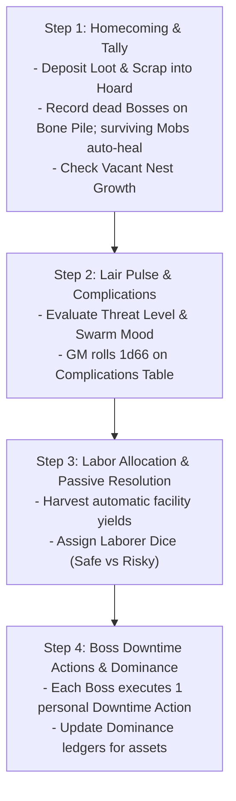

# The Lair Loop & Progression

*A single goblin dies in the mud, forgotten. A Warren of goblins builds an underground empire of rusted iron, stolen treasure, and smoking workshops. The Lair is the communal sanctuary where plunder is smelted, wild beasts are tamed, and the next generation of Bosses rises from the muck.*

---

## 1. The Lair Dashboard & Core Metrics

The **Lair** is the shared, cooperative base of operations managed by all players. The state of the settlement is tracked on the **Lair Sheet** across six core metrics:

| Metric | Category | Mechanical Scope |
| :--- | :--- | :--- |
| **1. Warren Tier & Capacity** | Settlement Scale | Tier 1 to 4; Max Active Assets = (Tier x 2) + 2 |
| **2. The Swarm (Gobbo Pool)** | Workforce Pool | Total population in d6s; split between Raider Mobs & Laborer Dice |
| **3. The Communal Hoard** | Shared Capital | Pooled Loot Value (liquid wealth) & Scrap (building matter) |
| **4. Swarm Mood** | Morale & Discipline | 0–5 Morale Track; Mob Mutiny triggers at Level 5 |
| **5. Threat Level** | Regional Heat | 0–5 Heat Track; Retaliatory Lair Assault triggers at Level 5 |
| **6. The Bone Pile** | Ancestral Legacy | Skull Tally; unlocks permanent Ancestral Boons every 4 Skulls |

### Warren Tier & Asset Capacity
**Warren Tier** measures the overall physical scale, engineering complexity, and regional renown of the goblin settlement:

* **Tier 1: Ragtag Mob Camp** (Hidden hovels, squatter dens under ruins; Max **4** Active Assets).
* **Tier 2: Fortified Warren** (Recognized regional hazard, reinforced palisades; Max **6** Active Assets).
* **Tier 3: Subterranean Stronghold** (Sprawling underground cavern network, heavy industry; Max **8** Active Assets).
* **Tier 4: Goblin Under-Kingdom** (Legendary subterranean fortress commanding regional outposts; Max **10** Active Assets).

**Asset Capacity** = (**Warren Tier** x 2) + 2

>> **THE ASSET CAPACITY CEILING:**
>> A Lair can only maintain a maximum number of **Active Assets** equal to (**Warren Tier** x 2) + 2. If the Lair exceeds this ceiling, the settlement suffers from overcrowding and structural strain: **Swarm Mood increases by +1 at the start of every Lair Turn for each asset over the cap.**

---

### The Gobbo Pool (Workforce)
The Lair's total goblin population is tracked as a communal dice pool: **The Gobbo Pool** (measured in **d6s**).

* **The Workforce Division:** At the start of each **Lair Turn**, players divide the **Gobbo Pool** into two groups:
  1. **Raider Mobs:** Dice assigned to **Bosses** (up to each Boss's **Grunt** limit) to form tactical **Mobs** for raids.
  2. **Laborer Dice:** Dice remaining in the Lair to perform scavenging, excavation, recruitment, and crafting operations.
* **Mob Survival & Auto-Heal:** If a Raider **Mob** returns from a raid with at least 1 health point on at least one health die (**Size** >= 1), it immediately **auto-heals back to its full allocated Size** for free during Step 1 (Homecoming).
* **Casualty Elimination:** If a **Mob** is reduced to **Size 0** (all health dice lost), those dice are permanently removed from the **Gobbo Pool**.
* **The Communal Runts Floor:** The Lair always maintains a baseline floor of **3d6 communal runts**. These runts cannot perform heavy labor or be assigned as Laborer Dice, but they guarantee that each **Player** can always lead at least a **Size 1 Runt Mob (1d6)** on a raid, even after a catastrophic wipe.
* **Vacant Nest Growth:** During Step 1 (Homecoming), if the total **Gobbo Pool** falls below **3d6 per Player** (e.g., under 9d6 in a 3-player campaign), the Lair automatically gains **+1d6** to the **Gobbo Pool** for free as wild runts move into empty burrows.

---

### The Communal Hoard
The **Communal Hoard** stores shared capital brought back from raids:
* **Loot Value (LV):** Liquid wealth (coins, gems, jewelry, fine mechanisms) used to fund Lair room construction, bribe troops, hire specialists, and purchase equipment.
* **Scrap:** Physical building material (rusted iron plates, oak timber, lead pipes, chains) used to construct facilities, clear excavations, and assemble weapon chassis.

---

### Threat Level (The Regional Heat Clock)
**Threat Level** is a track rated from **0 to 5** representing regional awareness and organized military response:

* **0–1 (Quiet):** The outside world considers the Lair minor vermin.
* **2–3 (Guarded):** Local settlements double their sentries; regional dungeon nodes gain +1 hazard.
* **4 (Hunted):** Enemy scout parties comb the wilderness; Lair complications suffer a **Bane 1 (-1d)**.
* **5 (Retaliatory Assault!):** The enemy launches a direct assault against the Lair. Players must defend the base using their **Mobs** and defenses. Following the assault resolution, **Threat Level** resets to 2.

---

### Swarm Mood (Morale & Mutiny)
**Swarm Mood** is a track rated from **0 to 5** representing internal discipline, morale, and obedience:

* **0–1 (Eager):** Grunts are hyped; all **Players** add **+1 die** to the communal **Bangaranga Pool** at the start of the next raid.
* **2–3 (Grumbly):** Standard goblin squabbling; failed orders during combat trigger immediate morale checks.
* **4 (Restless):** Grunts demand extra grog; Labor recruitment tests suffer a **Bane 1 (-1d)**.
* **5 (Mob Mutiny!):** Grunts refuse to embark on raids without upfront bribes (**5 Loot** per **Mob**). Internal brawls lock one random Lair facility until mutiny is suppressed.

---

### The Bone Pile (Ancestral Legacy)
The **Bone Pile** is a sacred memorial containing the skulls of fallen **Bosses**:
* Every dead **Boss** adds **1 Skull** to the **Bone Pile** track.
* **Ancestral Boons:** Every **4 Skulls** marked unlocks a permanent, Lair-wide ancestral perk (e.g., *Ancestral Grudge:* +1d attack against the enemy faction responsible for the most Boss deaths; *Haunted Warrens:* invaders suffer **Bane 1 (-1d)** during Lair assaults).
* **Relic Harvesting:** A **Boss** may salvage a skull or bone from the **Bone Pile** to forge a unique **Relic** item.

---

## 2. The Four-Step Lair Phase Sequence

The **Lair Phase** resolves in a strict four-step procedure between raids:



### Step 1: Homecoming & Tally
1. **Deposit Wealth:** Transfer all plundered **Loot Value** and **Scrap** into the **Communal Hoard**.
2. **Honour the Fallen:** Add deceased **Bosses** to the **Bone Pile**. Generate successor **Bosses** with starting **Successor XP** equal to **Gang Infamy x 4**.
3. **Regenerate Mobs:** Surviving **Mobs** (Size >= 1) restore all health dice to full allocated **Size**. Wiped **Mobs** are deleted from the pool.
4. **Vacant Nest Check:** If total **Gobbo Pool** is under 3d6 per player, add **+1d6** for free.

### Step 2: Lair Pulse & Complications
The **GM** rolls **1d66** on the **Lair Complications Table**:

| d66 | Event Name | Mechanical Resolution |
| :--- | :--- | :--- |
| **11–13** | **Tunnel Cave-In** | Lose **1d6 Scrap** from the Hoard, or assign 2 Laborer Dice to clear rubble. |
| **14–16** | **Squig Rampage** | A Boss must pass a **Tough 4+/1** test to subdue the beast, or lose **1d6 Runts** from the Gobbo Pool. |
| **21–23** | **Captive Breakout!** | All `[Person: Captive]` assets test escape: on a **1–2** on 1d6, they escape unless a Boss spends a Downtime Action to recapture them. |
| **24–26** | **Elder Tantrum** | Increase **Swarm Mood by +1** unless a Gang pays **5 Loot** from their private hoard to host a feast. |
| **31–33** | **Scout Probe** | Human or dwarven scouts spot smoke. Increase **Threat Level by +1** unless a Boss passes **Slink 4+/1** to silence them. |
| **34–36** | **Mushroom Rot** | Nursery mold rots food supplies. The Lair loses all passive recruitment yields this turn. |
| **41–43** | **Wandering Outcast** | A strange specialist visits the Lair. Pay **5 Loot** to recruit them as an active `[Ally]` asset. |
| **44–46** | **Turf Brawl** | Grunts riot over scrap. The two highest-Infamy Gangs lose 1 Mob health die or fight a Boss **Bar Brawl**. |
| **51–53** | **Stolen Cache** | A runt finds buried dungeon loot near the camp. Add **+2d6 Loot** (T1) to the Communal Hoard. |
| **54–56** | **Tribute Demand** | Rival warlords demand tribute. Pay **10 Loot** (T1) or increase **Threat Level by +2**. |
| **61–65** | **Smooth Operations** | The warren is humming. All active Labor tasks gain a **Boon 1 (+1d)** this turn. |
| **66** | **Ancestral Miracle!** | Green flames erupt from the Bone Pile. Add **+1 Skull** to the Bone Pile and reset **Swarm Mood to 0**. |

### Step 3: Labor Allocation & Operations
1. **Passive Harvest:** Collect automatic yields from active `[Facility]` and `[Outpost]` assets (e.g., Junkyard Sifter generating +2 Scrap).
2. **Workforce Allocation:** Assign available **Laborer Dice** to active projects:
   * **Scavenging Scrap:** Produces raw **Scrap** for the Hoard.
   * **Recruiting Runts:** Captures wild goblins to expand the **Gobbo Pool** permanently.
   * **Scouting Targets:** Surveys upcoming raid sites to reveal **Danger Ratings**, **Objectives**, and **Bypasses**.
   * **Excavating Projects:** Progresses construction thresholds for new facilities.

>> **THE LABOR RESOLUTION RULE: SAFE VS. PUSH**
>> When committing Laborer Dice to any labor task, players declare their work method:
>> * **Safe Labor (2 Dice):** Guarantees **1 automatic success**. No dice rolled; zero risk of injury.
>> * **Risky Push (1 Die):** Roll **1d6** against **4+** (6s explode). However, rolling a **1** triggers a workplace accident: the working runt is injured, placing that 1 die in the medical tent (unavailable for labor or raids for 1 Lair Turn).

### Step 4: Boss Downtime Actions
Each active **Goblin Boss** executes **one** personal Downtime Action:

* **The Pitch (Mouth Test):** Deliver an inspiring or terrifying speech. Pass a **Mouth 4+/1** test to reduce **Swarm Mood by 1**. *(Alternative: Spend 5 Loot from the Hoard to buy a round of rotgut grog, automatically reducing Swarm Mood by 1 with no roll).*
* **Laying Low (Slink Test):** Lead scouts into the surrounding wilderness to eliminate enemy patrols and erase tracks. Pass a **Slink 4+/1** test to reduce **Threat Level by 1**. *(Alternative: Spend 5 Loot to bribe local corrupt watchmen).*
* **Custom Crafting (Brains Test):** Operate a workshop to assemble, modify, or overload weapons and armor using **Scrap** and **Components** (see [Combat Engine](05_Combat_Engine.md)).
* **The Skim (Slink Test):** Secretly divert wealth from the Communal Hoard into your **Gang's Private Hoard**. Pass a **Slink 4+/1** test to divert up to your **Slink** rating in **Loot Value**. If your roll contains any **1s**, you are caught: you receive 0 Loot and **Swarm Mood increases by +1**.
* **Bar Brawl / Power Play (Tough or Mouth Test):** Challenge a rival Gang's dominance over a Lair facility. Pass a **Tough 4+/1** (physical brawl) or **Mouth 4+/1** (screaming dominance) test to transfer 1 point of contribution on that asset's ledger from the defender to your Gang.
* **Beast Taming (Brains or Tough Test):** Break and train a captured beast. Pass a **Brains 4+/1** or **Tough 4+/1** test to attach a beast archetype tag (e.g., `[Wolf Mount]`, `[Squig Hound]`) to a commanded **Mob**.

---

## 3. The Modular Asset Framework & Dominance

Knowledge and infrastructure in the Lair are not an abstract tech tree. **Knowledge is held in living Persons, physical Facilities, Allies, and Blueprints.** If an asset is killed, destroyed, or lost, its capability is disabled immediately.

### The Four Asset Categories
1. `[Person]` **(Elders, Specialists, Captives):** Living experts.
   * *Elders:* Retired Level 6 Bosses. High loyalty, but frail (vulnerable to health complications).
   * *Specialists:* Hired non-goblin outcasts. Require weekly **Loot Upkeep**; leave if unpaid.
   * *Captives:* Enslaved enemies (Dwarves, Humans, Elves). Provide elite masterwork knowledge, but carry high **Flight Risk** and increase **Threat Level**.
2. `[Facility]` **(Workshops, Dens, Fortifications):** Physical structures built with **Loot** and **Scrap**.
3. `[Ally]` **(Befriended Monsters, Patron Factions):** External creatures living alongside the horde. Powerful, but demand food or cause social friction.
4. `[Blueprint]` **(Physical Schematics, Stolen Scrolls):** Fragile paper or stone schematics (Bulk 0). Destroyed if hit by fire or water complications.

### Core Asset Rules
* **The Non-Stacking Clause:** Identical mechanical boons from Lair assets do not stack. A **Mob** can only gain a maximum of **+1 passive Defense Die** from Lair assets, regardless of how many armories or martial Elders are present.
* **Loss of Knowledge:** Destroying or losing an asset immediately disables its associated capability until a replacement asset is secured.

---

### Dominance & Inter-Gang Politics
While the Lair belongs to all goblins, individual assets are controlled by specific Gangs through **Dominance**:

1. **The Contribution Ledger:** When constructing or upgrading an asset, players record the total **Loot**, **Scrap**, and **Laborer Dice** contributed by their specific Gang.
2. **Dominant Gang:** The Gang with the highest cumulative contribution holds **Dominance** over that asset.
3. **Disputed Status:** Tied contributions render an asset *Disputed* (no Gang gains the kickback) until one Gang contributes additional resources or wins a **Bar Brawl** Downtime Action.

#### Dominance Benefits
* **Renaming Rights:** The dominant Gang names the facility (e.g., *"Snikt's Exploding Forge"*).
* **Priority Access:** The dominant Gang acts first whenever facility use is contested.
* **Dominance Kickback:** The dominant Gang exclusively receives the asset's specific **Dominance Perk**.

---

### Outposts & Macro-Territory
Secured dungeon sites or regional structures (iron mines, ruined watchtowers, breweries) can be garrisoned as **Outposts**:

* **Garrison Cost:** Deduct **1d6** permanently from the **Gobbo Pool** to staff the outpost.
* **Passive Yield:** Generates a flat resource yield each **Lair Turn** (e.g., *Iron Mine: +4 Scrap; Brewery: -1 Swarm Mood*).
* **Supply Run Checks:** During Step 3, resolve shipment delivery:
  * *Safe Route:* Automatic delivery.
  * *Wild Route:* Roll **1d6**. On a **1**, bandits intercept the shipment (lose yield for this turn).
  * *Hostile Route:* Roll **2d6** against **4+**. Needs at least one success to deliver. Rolling all 1s means the Outpost is besieged and must be relieved in a raid.

---

## 4. Roguelite Generational Progression & Death

Death in **Gobbos** is a stepping stone to greater power. When a **Goblin Boss** dies, the player does not start from zero.

### The "Next Gobbo Up" (Successor Creation)
When a Boss dies, the next prominent goblin in the Gang takes command:
* **Starting Stats:** Successors start with **1** in all Main Stats, receive **2 starting advances** (standard character creation), plus a starting pool of **Successor XP**:
**Successor XP** = **Gang Infamy x 4**
* **Successor Caps:** A successor cannot raise any stat above **Level 4** at creation and cannot start as an **Elder** (Level 6).
* **The Catch-Up Boost:** A fresh successor receives **+2 bonus XP** on the first survived raid.

### Gang Marks (Tattoos of the Dead)
The successor honors the fallen predecessor by receiving a crude soot tattoo:
* The successor inherits **one Feat or Twist** possessed by the deceased Boss.
* The successor **ignores all Stat and Tier requirements** for this inherited Feat.
* This Feat counts toward the Boss's limit of 3 personal Feats.

### Named Items & Revenge Quests
When a Boss dies, the Boss's favored equipment absorbs that chaotic spirit and becomes a **Named Item**:
* **Imbued Boon:** The item gains a **T1 Boon** reflecting the deceased Boss's highest stat or cause of death.
* **Recovery:** If surviving goblins drag the item back to the Lair, the successor inherits it.
* **Enemy Wielders:** If the raid wipes and the item is lost, the enemy killer claims the weapon. The item can be reclaimed in future revenge raids.
* **Gang Rebellion:** Named items rebel if wielded by a rival Gang (e.g., treating all Criticals as Fumbles).

### Patron Saints of the Bone Pile
When creating a successor, the player may select one deceased Boss from the **Bone Pile** to adopt as a **Patron Saint**:
* **The Boon:** Grants a specific situational power related to how the Saint lived or died (e.g., *Saint Grugor: Ignore fire damage once per raid*).
* **The Behavioral Catch:** To maintain the boon, the Boss must follow the Saint's behavioral feat (e.g., always choosing the loudest path, or never retreating).

### Retirement & Elders
When a Boss earns enough XP to raise any Main Stat to **Level 6**, the Boss automatically **Retires** from active raiding to become an **Elder**:
* **Elder of Tough:** Staffed at the Training Ring; grants **+1 passive Defense Die** (Armor) to all commanded friendly Mobs.
* **Elder of Slink:** Staffed at the Shadow Den; reduces trap **Target Numbers (TN)** by **1** (minimum 1) for the Gang.
* **Elder of Mouth:** Staffed at the Council Room; increases starting and maximum **Grunt** by **+1**, and allows rallying fleeing Mobs as a **Free Action** once per raid.
* **Elder of Brains:** Staffed at the Tinker Yard; enables installing **1 extra Component** on custom gear items.

---

## 5. Lair Room & Facility Structural Schema

Every constructible room, workshop, outpost, or living asset is defined by the following template:

```markdown
### [Asset Name]
- **Category / Type:** [Person: Elder | Person: Specialist | Person: Captive | Facility: Industry | Facility: Swarm | Facility: Beasts | Facility: Defense | Ally: Outcast | Blueprint]
- **Tier:** [Tier 1–4]
- **Construction Cost:** [X Base Loot, Y Base Scrap (or "None / Recruited / Discovered")]
- **Requirements & Prerequisites:** [Warren Tier X, Outpost / Mine required, or specific Elder staffed]
- **Upkeep:** [None | X Loot per Lair Turn | 1 Laborer Die per turn]
- **Passive Benefit (Boon):** [Exact mechanical modification or passive yield per Lair Turn]
- **Active Function / Crafting Station:** [Downtime Action enabled, Quality unlock, or Taming modifier]
- **Volatility & Cost (Bane / Catch):** [Complication trigger, flight risk, mutiny risk, or hazard]
- **Dominance Kickback:** [Exclusive mechanical perk granted to the Gang holding Dominance]
- **Upgrade Tiers:** [Path to upgrade to higher Tier and associated costs]
```

### Reference Facility Instances

#### The Scrap Forge
- **Category / Type:** Facility: Industry
- **Tier:** Tier 2
- **Construction Cost:** 10 Loot (T2), 15 Scrap
- **Requirements & Prerequisites:** Warren Tier 2
- **Upkeep:** None
- **Passive Benefit (Boon):** Unlocks Standard Quality (T3) weapon crafting; provides +1 Guaranteed Taming Success on weapon crafting.
- **Active Function / Crafting Station:** Custom Crafting Station for weapons and armor.
- **Volatility & Cost (Bane / Catch):** Crafting rolls containing any 1s inflict 1 Grit damage to the crafter.
- **Dominance Kickback:** The dominant Gang crafts weapon chassis for 0 base Scrap cost.
- **Upgrade Tiers:** Upgrade to Masterwork Foundry (Tier 3) for 20 Loot (T3), 30 Scrap.

#### Spore Breeding Nursery
- **Category / Type:** Facility: Swarm
- **Tier:** Tier 2
- **Construction Cost:** 10 Loot (T2), 20 Scrap
- **Requirements & Prerequisites:** Warren Tier 2
- **Upkeep:** None
- **Passive Benefit (Boon):** Generates **+1d6 Runts** added to the Gobbo Pool at the start of every Lair Turn (up to Tier cap).
- **Active Function / Crafting Station:** Safe labor assignment for runt cultivation.
- **Volatility & Cost (Bane / Catch):** If Swarm Mood is 4+, rolls of 1 on Lair Events spoil 5 Loot worth of supplies.
- **Dominance Kickback:** The dominant Gang gains first pick of recruits, increasing their commanded Mob's **Size cap by +1**.
- **Upgrade Tiers:** Upgrade to Great Fungal Warren (Tier 3) for 25 Loot (T3), 35 Scrap.

---

## Content Extension Point

[CONTENT EXTENSION POINT: Lair Rooms & Facilities]

All future compendiums of Lair structures, workshops, specialist quarters, beast pens, fortifications, and ancestral shrines must implement the Lair Room & Facility Structural Schema defined above, respecting Warren Tier caps, asset capacity limits, and Dominance kickbacks.

---

## Mechanical Gaps & Unresolved Systems

[MISSING RULE / GAP: Retaliatory Lair Assault Resolution Engine]
*   **Description:** Reaching Threat Level 5 triggers a "Retaliatory Assault" against the Lair, after which Threat resets to 2. However, there are no codified rules for how this assault is resolved, no enemy assault force generation tables, no rules for how defense facilities (like Trapped Palisade rolling 3d6) apply defensive damage, and no defined consequences if the defense is lost.
*   **Why it is needed:** Threat Level 5 is the primary external pressure clock in the game. Without clear resolution mechanics and stakes, regional heat has zero teeth.
*   **Suggested Resolution:** Establish a formal 3-step Lair Defense procedure:
    1. Determine Enemy Force based on Warren Tier and Threat level.
    2. Automated Defense Phase: Roll active Defense Facilities (e.g. 3d6 from Palisade) and assign Laborer Dice to inflict damage before enemies breach.
    3. Tactical Skirmish Phase: If enemies survive, resolve a combat round in the Lair Entrance Zone using Bosses and Raider Mobs. If defeated, the Lair suffers 1 destroyed Asset, loses 1d6 from the Gobbo Pool, and loses half the Communal Hoard.

[MISSING RULE / GAP: Mutiny Resolution Mechanics & Facility Recovery]
*   **Description:** At Swarm Mood 5, a "Mob Mutiny" locks one random Lair facility and forces grunts to demand upfront bribes of 5 Loot per Mob to embark on raids. The rules do not define how a locked facility is unlocked, what happens if players refuse to pay bribes, or how mutiny is suppressed without money.
*   **Why it is needed:** Mutiny is the core internal pressure clock. Players need actionable mechanical paths to break a strike through intimidation, brawling, or concessions.
*   **Suggested Resolution:** Codify Mutiny suppression options:
    1. Bribe: Pay 5 T1 Loot per Mob to clear the raid lockout.
    2. Tyrant's Beatdown: A Boss makes an opposed Tough 5+/2 or Mouth 5+/2 test as a Downtime Action. Success reduces Swarm Mood to 3 and unlocks the facility; failure inflicts 1 Grit damage on the Boss and increases Threat by +1 from the riot.

[MISSING RULE / GAP: Asset Decommissioning, Destruction, and Slot Recovery]
*   **Description:** A Lair can maintain up to (Tier * 2) + 2 active assets. If players wish to replace an obsolete Tier 1 facility with an advanced Tier 3 workshop, there are no rules for demolishing or dismantling existing assets, nor is it clear if dismantling returns Scrap to the Hoard.
*   **Why it is needed:** Hard asset caps force players to cycle assets as the Warren expands.
*   **Suggested Resolution:** Add a "Dismantle Asset" Downtime action: spending 1 Laborer Die dismantles an existing facility, frees the asset slot immediately, and recovers 50% of its base Scrap cost into the Communal Hoard.

[MISSING RULE / GAP: Mid-Raid Boss Death & Successor Spawning Timing]
*   **Description:** The rules describe the "Next Gobbo Up" successor generation during Homecoming. However, they do not specify what happens in the middle of a raid when a Boss dies. Does the player sit out the session, or does the next biggest runt in their Mob immediately promote to Boss status mid-combat?
*   **Why it is needed:** Player elimination during tactical skirmishes ruins table engagement and violates Tenet 1 (Fun at the Table).
*   **Suggested Resolution:** Implement the "Instant Promotion" rule: If a Boss dies during combat and commands an active Mob, the player immediately promotes the leading runt of that Mob into a makeshift Boss (with 3 Grit, 1 in all stats, and current Mob Size reduced by 1). Full successor generation and XP allocation take place during Homecoming.

[MISSING RULE / GAP: Formal Patron Saint Ledger & Appeasement Trigger System]
*   **Description:** The rules introduce Patron Saints from the Bone Pile with situational boons and behavioral appeasement catches, but lack rules governing: (a) how many Patron Saints a Gang can maintain; (b) the exact mechanical trigger for losing/restoring the boon; (c) the minimum criteria for a dead Boss to qualify as a Saint vs. a generic Skull.
*   **Why it is needed:** Patron Saints provide key roguelite meta-progression, but currently read as loose flavor suggestions.
*   **Suggested Resolution:**
    1. A Boss can attune to exactly 1 Patron Saint from the Gang's Bone Pile during character creation or Homecoming.
    2. Qualifying as a Saint requires the dead Boss to have reached at least Level 3 in one Main Stat or earned at least 5 Lifetime Glory.
    3. If the active Boss violates the Saint's behavioral catch during a raid, the boon is disabled for the remainder of that raid and the subsequent Lair Phase.
