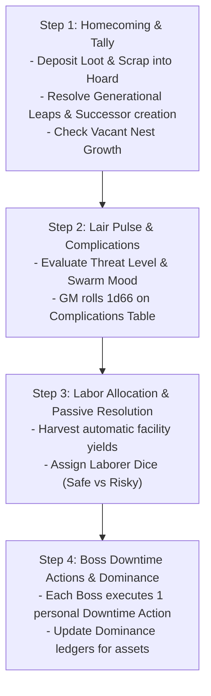
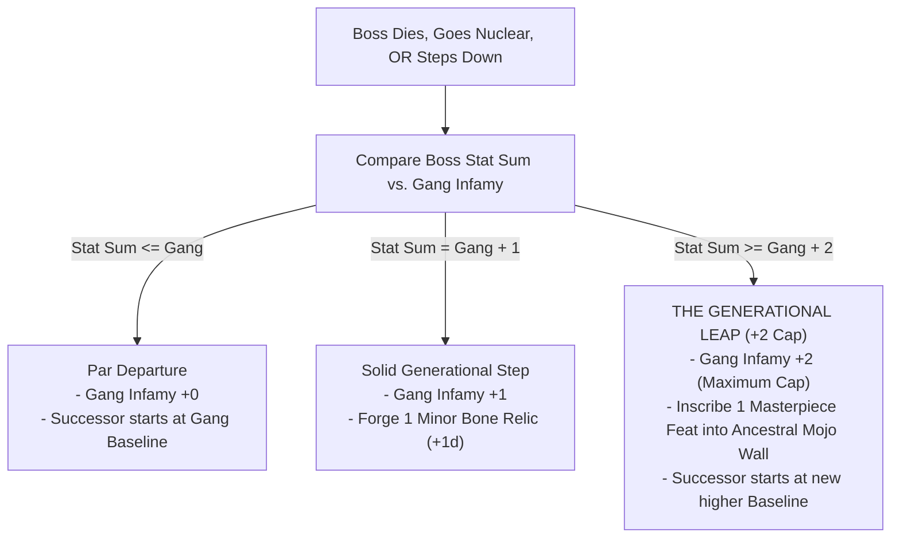

# The Lair Loop & Progression

*A single goblin dies in the mud, forgotten. A Warren of goblins builds an underground empire of rusted iron, stolen treasure, and smoking workshops. The Lair is the communal sanctuary where plunder is smelted, wild beasts are tamed, and the next generation of Bosses rises from the muck.*

---

## 1. The Lair Dashboard & Core Metrics

The **Lair** is the shared, cooperative base of operations managed by all players. The state of the settlement is tracked on the **Lair Sheet** across six core metrics:

| Metric | Category | Mechanical Scope |
| :--- | :--- | :--- |
| **1. Warren Tier & Capacity** | Settlement Scale | Tier 1 to 4; Max Active Assets = (Tier x 2) + 2 |
| **2. The Swarm (Gobbo Pool)** | Workforce Pool | Total population in d6s; split between Raider Mobs & Laborer Dice |
| **3. The Communal Hoard** | Shared Capital | Pooled Loot Value (liquid wealth) & Scrap (building matter) |
| **4. Swarm Mood** | Morale & Discipline | 0–5 Morale Track; Mob Mutiny triggers at Level 5 |
| **5. Threat Level** | Regional Heat | 0–5 Heat Track; Retaliatory Lair Assault triggers at Level 5 |
| **6. The Bone Pile & Mojo Wall**| Ancestral Legacy | Skull Tally (Ancestral Boons) & Ancestral Mojo Feat Slots (1–4) |

### Warren Tier & Asset Capacity
**Warren Tier** measures the overall physical scale, engineering complexity, and regional renown of the goblin settlement:

* **Tier 1: Ragtag Mob Camp** (Hidden hovels, squatter dens under ruins; Max **4** Active Assets).
* **Tier 2: Fortified Warren** (Recognized regional hazard, reinforced palisades; Max **6** Active Assets).
* **Tier 3: Subterranean Stronghold** (Sprawling underground cavern network, heavy industry; Max **8** Active Assets).
* **Tier 4: Goblin Under-Kingdom** (Legendary subterranean fortress commanding regional outposts; Max **10** Active Assets).

**Asset Capacity** = (**Warren Tier** x 2) + 2

>> **THE ASSET CAPACITY CEILING:**
>> A Lair can only maintain a maximum number of **Active Assets** equal to (**Warren Tier** x 2) + 2. If the Lair exceeds this ceiling, the settlement suffers from overcrowding and structural strain: **Swarm Mood increases by +1 at the start of every Lair Turn for each asset over the cap.**

---

### The Gobbo Pool (Workforce)
The Lair's total goblin population is tracked as a communal dice pool: **The Gobbo Pool** (measured in **d6s**).

* **The Workforce Division:** At the start of each **Lair Turn**, players divide the **Gobbo Pool** into two groups:
  1. **Raider Mobs:** Dice assigned to **Bosses** (up to each Boss's **Grunt** limit) to form tactical **Mobs** for raids.
  2. **Laborer Dice:** Dice remaining in the Lair to perform scavenging, excavation, recruitment, and crafting operations.
* **Mob Survival & Auto-Heal:** If a Raider **Mob** returns from a raid with at least 1 health point on at least one health die (**Size** >= 1), it immediately **auto-heals back to its full allocated Size** for free during Step 1 (Homecoming).
* **Casualty Elimination:** If a **Mob** is reduced to **Size 0** (all health dice lost), those dice are permanently removed from the **Gobbo Pool**.
* **The Communal Runts Floor:** The Lair always maintains a baseline floor of **3d6 communal runts**. These runts cannot perform heavy labor or be assigned as Laborer Dice, but they guarantee that each **Player** can always lead at least a **Size 1 Runt Mob (1d6)** on a raid, even after a catastrophic wipe.
* **Vacant Nest Growth:** During Step 1 (Homecoming), if the total **Gobbo Pool** falls below **3d6 per Player** (e.g., under 9d6 in a 3-player campaign), the Lair automatically gains **+1d6** to the **Gobbo Pool** for free as wild runts move into empty burrows.

---

### The Communal Hoard
The **Communal Hoard** stores shared capital brought back from raids:
* **Loot Value (LV):** Liquid wealth (coins, gems, jewelry, fine mechanisms) used to fund Lair room construction, bribe troops, hire specialists, and purchase equipment.
* **Scrap:** Physical building material (rusted iron plates, oak timber, lead pipes, chains) used to construct facilities, clear excavations, and assemble weapon chassis.

---

### Threat Level (The Regional Heat Clock)
**Threat Level** is a track rated from **0 to 5** representing regional awareness and organized military response:

* **0–1 (Quiet):** The outside world considers the Lair minor vermin.
* **2–3 (Guarded):** Local settlements double their sentries; regional dungeon nodes gain +1 hazard.
* **4 (Hunted):** Enemy scout parties comb the wilderness; Lair complications suffer a **Bane 1 (-1d)**.
* **5 (Retaliatory Assault!):** The enemy launches a direct assault against the Lair. Players must defend the base using their **Mobs** and defenses. Following the assault resolution, **Threat Level** resets to 2.

---

### Swarm Mood (Morale & Mutiny)
**Swarm Mood** is a track rated from **0 to 5** representing internal discipline, morale, and obedience:

* **0–1 (Eager):** Grunts are hyped; all **Players** add **+1 die** to the communal **Bangaranga Pool** at the start of the next raid.
* **2–3 (Grumbly):** Standard goblin squabbling; failed orders during combat trigger immediate morale checks.
* **4 (Restless):** Grunts demand extra grog; Labor recruitment tests suffer a **Bane 1 (-1d)**.
* **5 (Mob Mutiny!):** Grunts refuse to embark on raids without upfront bribes (**5 Loot** per **Mob**). Internal brawls lock one random Lair facility until mutiny is suppressed.

---

### The Bone Pile & Mojo Wall (Ancestral Legacy)
* **The Bone Pile:** A monument containing the skulls of fallen **Bosses**. Every dead **Boss** adds **1 Skull** to the track. Every **4 Skulls** marked unlocks a permanent, Lair-wide ancestral perk (e.g. *Ancestral Grudge:* +1d attack against the enemy faction responsible for the most Boss deaths).
* **The Ancestral Mojo Wall:** An etched stone wall preserving the signature Masterpiece Feats of over-stretched Bosses who achieved legendary generational leaps (see Section 4).

---

## 2. The Four-Step Lair Phase Sequence

The **Lair Phase** resolves in a strict four-step procedure between raids:



### Step 1: Homecoming & Tally
1. **Deposit Wealth:** Transfer all plundered **Loot Value** and **Scrap** into the **Communal Hoard**.
2. **Honour the Fallen / Settle Generations:** Add deceased Bosses to the **Bone Pile**. Evaluate **Generational Leaps** for deceased, nuclear, or stepped-down Bosses, and generate successors using the updated **Gang Infamy** rating.
3. **Regenerate Mobs:** Surviving **Mobs** (Size >= 1) restore all health dice to full allocated **Size**. Wiped **Mobs** are deleted from the pool.
4. **Vacant Nest Check:** If total **Gobbo Pool** is under 3d6 per player, add **+1d6** for free.

### Step 2: Lair Pulse & Complications
The **GM** rolls **1d66** on the **Lair Complications Table**:

| d66 | Event Name | Mechanical Resolution |
| :--- | :--- | :--- |
| **11–13** | **Tunnel Cave-In** | Lose **1d6 Scrap** from the Hoard, or assign 2 Laborer Dice to clear rubble. |
| **14–16** | **Squig Rampage** | A Boss must pass a **Tough 4+/1** test to subdue the beast, or lose **1d6 Runts** from the Gobbo Pool. |
| **21–23** | **Captive Breakout!** | All `[Person: Captive]` assets test escape: on a **1–2** on 1d6, they escape unless a Boss spends a Downtime Action to recapture them. |
| **24–26** | **Elder Tantrum** | Increase **Swarm Mood by +1** unless a Gang pays **5 Loot** from their private hoard to host a feast. |
| **31–33** | **Scout Probe** | Human or dwarven scouts spot smoke. Increase **Threat Level by +1** unless a Boss passes **Slink 4+/1** to silence them. |
| **34–36** | **Mushroom Rot** | Nursery mold rots food supplies. The Lair loses all passive recruitment yields this turn. |
| **41–43** | **Wandering Outcast** | A strange specialist visits the Lair. Pay **5 Loot** to recruit them as an active `[Ally]` asset. |
| **44–46** | **Turf Brawl** | Grunts riot over scrap. The two highest-Infamy Gangs lose 1 Mob health die or fight a Boss **Bar Brawl**. |
| **51–53** | **Stolen Cache** | A runt finds buried dungeon loot near the camp. Add **+2d6 Loot** (T1) to the Communal Hoard. |
| **54–56** | **Tribute Demand** | Rival warlords demand tribute. Pay **10 Loot** (T1) or increase **Threat Level by +2**. |
| **61–65** | **Smooth Operations** | The warren is humming. All active Labor tasks gain a **Boon 1 (+1d)** this turn. |
| **66** | **Ancestral Miracle!** | Green flames erupt from the Bone Pile. Add **+1 Skull** to the Bone Pile and reset **Swarm Mood to 0**. |

### Step 3: Labor Allocation & Operations
1. **Passive Harvest:** Collect automatic yields from active `[Facility]` and `[Outpost]` assets (e.g., Junkyard Sifter generating +2 Scrap).
2. **Workforce Allocation:** Assign available **Laborer Dice** to active projects:
   * **Scavenging Scrap:** Produces raw **Scrap** for the Hoard.
   * **Recruiting Runts:** Captures wild goblins to expand the **Gobbo Pool** permanently.
   * **Scouting Targets:** Surveys upcoming raid sites to reveal **Danger Ratings**, **Objectives**, and **Bypasses**.
   * **Excavating Projects:** Progresses construction thresholds for new facilities.

>> **THE LABOR RESOLUTION RULE: SAFE VS. PUSH**
>> When committing Laborer Dice to any labor task, players declare their work method:
>> * **Safe Labor (2 Dice):** Guarantees **1 automatic success**. No dice rolled; zero risk of injury.
>> * **Risky Push (1 Die):** Roll **1d6** against **4+** (6s explode). However, rolling a **1** triggers a workplace accident: the working runt is injured, placing that 1 die in the medical tent (unavailable for labor or raids for 1 Lair Turn).

### Step 4: Boss Downtime Actions
Each active **Goblin Boss** executes **one** personal Downtime Action:

* **Step Down as Grumpy Goblin (Voluntary Retirement):** If your **Stat Sum** is at least `Gang Infamy + 1`, your Boss steps down to become the Gang's active **Grumpy Goblin**, establishing in-raid **Advice Tokens** and triggering the **Generational Leap** for the new Boss.
* **The Pitch (Mouth Test):** Deliver an inspiring or terrifying speech. Pass a **Mouth 4+/1** test to reduce **Swarm Mood by 1**. *(Alternative: Spend 5 Loot from the Hoard to buy a round of rotgut grog, automatically reducing Swarm Mood by 1 with no roll).*
* **Laying Low (Slink Test):** Lead scouts into the surrounding wilderness to eliminate enemy patrols and erase tracks. Pass a **Slink 4+/1** test to reduce **Threat Level by 1**. *(Alternative: Spend 5 Loot to bribe local corrupt watchmen).*
* **Custom Crafting (Brains Test):** Operate a workshop to assemble, modify, or overload weapons and armor using **Scrap** and **Components** (see [Combat Engine](05_Combat_Engine.md)).
* **The Skim (Slink Test):** Secretly divert wealth from the Communal Hoard into your **Gang's Private Hoard**. Pass a **Slink 4+/1** test to divert up to your **Slink** rating in **Loot Value**. If your roll contains any **1s**, you are caught: you receive 0 Loot and **Swarm Mood increases by +1**.
* **Bar Brawl / Power Play (Tough or Mouth Test):** Challenge a rival Gang's dominance over a Lair facility. Pass a **Tough 4+/1** (physical brawl) or **Mouth 4+/1** (screaming dominance) test to transfer 1 point of contribution on that asset's ledger from the defender to your Gang.
* **Beast Taming (Brains or Tough Test):** Break and train a captured beast. Pass a **Brains 4+/1** or **Tough 4+/1** test to attach a beast archetype tag (e.g., `[Wolf Mount]`, `[Squig Hound]`) to a commanded **Mob**.

---

## 3. The Modular Asset Framework & Dominance

Knowledge and infrastructure in the Lair are not an abstract tech tree. **Knowledge is held in living Persons, physical Facilities, Allies, and Blueprints.** If an asset is killed, destroyed, or lost, its capability is disabled immediately.

### The Four Asset Categories
1. `[Person]` **(Elders, Specialists, Captives, Grumpy Goblins):** Living experts.
   * *Grumpy Goblins:* Retired Bosses providing in-raid Advice Tokens.
   * *Elders:* Level 6 retired Bosses providing permanent Lair-wide boons.
   * *Specialists:* Hired non-goblin outcasts. Require weekly **Loot Upkeep**; leave if unpaid.
   * *Captives:* Enslaved enemies. Provide elite knowledge, but carry **Flight Risk** and raise **Threat Level**.
2. `[Facility]` **(Workshops, Dens, Fortifications):** Physical structures built with **Loot** and **Scrap**.
3. `[Ally]` **(Befriended Monsters, Patron Factions):** External creatures living alongside the horde.
4. `[Blueprint]` **(Physical Schematics, Stolen Scrolls):** Fragile paper or stone schematics (Bulk 0).

---

## 4. Roguelite Generational Progression & The Generational Leap

Death, burnout, and stepping down in **Gobbos** are the primary engines of permanent meta-progression. When a Boss departs active raiding, the Gang absorbs that achievement through **The Generational Leap**.



### 1. The Generational Leap Formula
When a **Goblin Boss** leaves active raiding (via in-raid Death, Going Nuclear, or Stepping Down in the Lair), calculate the Gang's growth:

**Gang Infamy Increase** = **min(2, max(0, Boss Stat Sum - Gang Infamy))**

| Boss Stat Sum at Departure | Gang Infamy Gain | Outcome for Gang & Successor |
| :--- | :---: | :--- |
| **Stat Sum <= Gang Infamy** | **+0 Infamy** | **Par Departure:** Successor is generated at the current Gang Infamy baseline. |
| **Stat Sum = Gang Infamy + 1** | **+1 Infamy** | **Solid Step:** Gang Infamy advances by +1; Gang forges **1 Minor Relic** (+1d situational boon). |
| **Stat Sum >= Gang Infamy + 2** | **+2 Infamy (MAX)** | **Generational Leap!** Gang Infamy advances by the maximum cap of +2; inscribe **1 Masterpiece Feat** into the **Ancestral Mojo Wall**. |

>> **THE +2 GENERATIONAL CAP:**  
>> A Gang can absorb a maximum of **+2 Infamy** from a single Boss's career. Even if a Boss stretched to `Gang + 4`, excess power was enjoyed during that Boss's life, and the Gang advances by +2 upon departure.

---

### 2. The Successor Boss Generation
When generating a new Boss to replace a fallen or retired predecessor:
1. **Allocate Stat Points:** Distribute total points equal to current **Gang Infamy Rating** across Tough, Slink, Mouth, and Brains (minimum 1 in each stat).
2. **Stat Cap at Creation:** No single stat can start higher than **Level 3** (at Infamy 6–10) or **Level 4** (at Infamy 12–16).
3. **Derive Role & Grunt:** Derive your **Role**, **Role Level**, **Max Grunt**, and Secondary Stats directly from your new stat configuration.
4. **The Catch-Up Boost:** A fresh successor receives **+5 bonus XP** on the first survived raid.

---

### 3. The Ancestral Mojo Wall (Gang Feats)
The **Ancestral Mojo Wall** is a carved stone monument in the Warren where the signature abilities of legendary Bosses are preserved:
* **Mojo Capacity:** A Gang unlocks Mojo slots as its **Infamy Rating** grows:
  * **Infamy 8:** 1 Mojo Slot
  * **Infamy 12:** 2 Mojo Slots
  * **Infamy 16:** 3 Mojo Slots
  * **Infamy 20:** 4 Mojo Slots (Maximum Cap)
* **Inscribing a Masterpiece:** When a Boss triggers a **+2 Generational Leap**, choose 1 personal **Feat** possessed by that Boss and etch it into an open Mojo slot on the wall.
* **Passive Benefit:** All future Bosses and Mobs in this Gang gain this Feat's mechanical benefits **passively** without consuming personal Feat slots.
* **Overwriting Slots:** If all Mojo slots are full, a new +2 Generational Leap allows the player to overwrite an older Mojo with the new Boss's Feat.

---

### 4. True Elders & Campaign Milestones (Stat Level 6)
When any Boss raises a Main Stat to **Level 6**, that Boss automatically retires from active raiding to become an **Elder**:
* **Elder of Tough:** Staffed at the Training Ring; all commanded friendly Mobs gain **+1 Passive Armor Die**.
* **Elder of Slink:** Staffed at the Shadow Den; reduces trap **Target Numbers (TN)** by **1** (minimum 1).
* **Elder of Mouth:** Staffed at the Council Room; maximum **Grunt +1**; rally fleeing Mobs as a Free Action once per raid.
* **Elder of Brains:** Staffed at the Tinker Yard; enables installing **+1 extra Component** on custom crafted gear.

---

## 5. Lair Room & Facility Structural Schema

Every constructible room, workshop, outpost, or living asset is defined by the following template:

```markdown
### [Asset Name]
- **Category / Type:** [Person: Elder | Person: Specialist | Person: Captive | Person: Grumpy Goblin | Facility: Industry | Facility: Swarm | Facility: Beasts | Facility: Defense | Ally: Outcast | Blueprint]
- **Tier:** [Tier 1–4]
- **Construction Cost:** [X Base Loot, Y Base Scrap (or "None / Recruited / Discovered")]
- **Requirements & Prerequisites:** [Warren Tier X, Outpost / Mine required, or specific Elder staffed]
- **Upkeep:** [None | X Loot per Lair Turn | 1 Laborer Die per turn]
- **Passive Benefit (Boon):** [Exact mechanical modification or passive yield per Lair Turn]
- **Active Function / Crafting Station:** [Downtime Action enabled, Quality unlock, or Taming modifier]
- **Volatility & Cost (Bane / Catch):** [Complication trigger, flight risk, mutiny risk, or hazard]
- **Dominance Kickback:** [Exclusive mechanical perk granted to the Gang holding Dominance]
```
