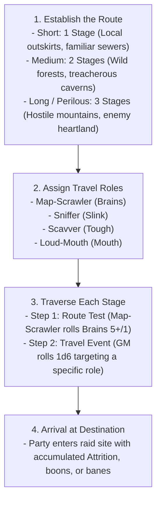

# Journeys & Hazards

*Getting to the raid is half the chaos—and usually half the casualties. The world outside the Warren is filled with human patrol hounds, rushing toxic sewers, rotting rope bridges, and worst of all, other goblins. A clever Boss herds the green horde through the wilds, but some gobbos are bound to get lost, poisoned, or squashed along the way.*

---

## 1. The Journey Loop & Travel Stages

Travel in **Gobbos** is designed to be fast, perilous, and highly chaotic. Rather than tracking individual rations or day-by-day distances, overland and subterranean journeys are resolved in abstract **Stages** before the raid begins. The primary threat during travel is **Mob Attrition**—losing goblins to the wilderness before reaching the target.



---

## 2. The Four Travel Roles

Every journey requires a clear division of labor (and someone to blame when disasters occur). All four **Travel Roles** must be assigned before rolling:

| Travel Role | Primary Attribute | Core Responsibilities & Duties |
| :--- | :---: | :--- |
| **Map-Scrawler** | **Brains** | Reads crude maps, interprets landmarks, and navigates routes. |
| **Sniffer** | **Slink** | Scouts ahead, detects ambushes, and smells out concealed traps. |
| **Scavver** | **Tough** | Clears physical debris, forages edible fungus, and hauls gear. |
| **Loud-Mouth** | **Mouth** | Enforces march discipline, suppresses panic, and silences bickering. |

### Mobs Assigned to Travel Roles
If playing with fewer than four players, a **Goblin Boss** may take multiple roles, or assign a commanded **Goblin Mob** to fill a vacant role:
* **Mobs testing Tough (Scavver):** Roll a dice pool equal to the **Mob's current Size** in d6s.
* **Mobs testing Slink, Brains, or Mouth (Sniffer, Map-Scrawler, Loud-Mouth):** Lesser goblins rely on collective cunning; they roll a baseline pool of **2d6** (as defined in [Mob Mechanics](06_Mob_Mechanics.md)).

>> **THE TRAVEL RESOLUTION RULE:**
>> The **GM** never rolls dice to resolve player success or failure during a journey. All tests are rolled by the players filling the designated roles. The standard success threshold for travel tests is **5+** (success on 5 or 6). Exploding 6s and standard fumbles apply.

---

## 3. Resolving a Stage

For each Stage of the journey, the party resolves two sequential steps:

### Step 1: The Route Test
The **Map-Scrawler** makes a **Brains 5+/1** navigation test against the route's baseline profile.

* **Success:** The route is clear. The party advances to the Stage's Travel Event with zero penalties.
* **Failure:** The party takes a grueling, hazardous detour. The entire party suffers **1 Mob Attrition** (every **Mob** in the party takes 1 point of damage to its active health die), and the party suffers a **Bane 1 (-1d)** on the upcoming **Travel Event** test.

### Step 2: The Travel Event
The **GM** rolls **1d6** on the **Gobbo Travel Event Table** below. The resulting event targets one of the other three roles, who must make a test to resolve it:

| d6 Roll | Event Name | Target Role | Stat Test | Success Outcome | Failure Outcome |
| :---: | :--- | :--- | :---: | :--- | :--- |
| **1** | **Narrow Pass** | Sniffer | **Slink 5+/1** | You slip through the crevices silently. | Gobbos get crushed by loose rocks. A **Mob** takes **2 damage** (or rolls armor defense). **Mobs of Size 3+** suffer a **Bane 1 (-1d)** on their next test. |
| **2** | **Deep Torrent** | Scavver | **Tough 5+/1** | The Scavver builds a crude rope bridge. | Gobbos are swept away. A **Mob** takes **Size damage** (losing 1 lowest-value health die, reducing Mob **Size** by 1), or you must discard 1 **Bulk** of equipped gear to save them. |
| **3** | **Spore Patch** | Scavver | **Tough 5+/1** | You harvest nourishing giant mushrooms. Restore 1 health point to a Mob's health die. | Poisonous bellyaches. Every **Mob** takes 1 damage. One random Boss tests **Tough 5+/1**; on failure, gains the **Weakened** condition. |
| **4** | **Bickering Over Loot** | Loud-Mouth | **Mouth 5+/1** | The Loud-Mouth cracks heads and restores order. Gain 1 **Loot** (T1) from the scrap. | Violent infighting! A **Mob** takes **1d6/2 (rounded up) damage**, and the Loud-Mouth Boss loses **1 Grunt**. |
| **5** | **Shadow Ambush** | Sniffer | **Slink 5+/1** | You detect the predator. Gain **Boon 1 (+1d)** on the first attack of the raid. | Caught off-guard! A random **Mob** takes **2 damage**, and the GM adds **+2 dice** to the shared **Bangaranga Pool** from the chaos. |
| **6** | **"Are We There Yet?"** | Loud-Mouth | **Mouth 5+/1** | The Loud-Mouth leads a rowdy, marching chant. | Desertion! The Loud-Mouth Boss loses **1 Grunt**, and one **Mob** shrinks by **1 Size** as runts sneak away. |

---

## 4. Return Journeys & Plunder Burden

Raiding a vault is simple; hauling heavy iron chests, bronze cauldrons, and gold idols back across the wilderness is where greed kills.

### Laden Mobs (> 50% Carry Capacity)
A **Mob** hauling significant expedition plunder (**Carried Bulk > Size x 2**) is **Laden**:
* **Laden** Mobs suffer **Bane 1 (-1d)** on all **Slink** and **Tough** tests during the return journey.
* The Map-Scrawler's **Route Test** required successes increase by +1 (e.g., from **Brains 5+/1** to **Brains 5+/2**).

### Over-Laden Mobs (Maximum & Dragging Capacity)
A **Mob** carrying at or above its unburdened carry capacity (**Carried Bulk >= Size x 4**, up to the dragging limit of **Size x 5**) is **Over-Laden**:
* **Over-Laden** Mobs suffer all penalties of being **Laden**.
* **Over-Laden** Mobs cannot roll passive armor defense dice against travel hazards.
* **Over-Laden** Mobs automatically take **1 damage** on failed Route Tests (representing exhaustion from dragging heavy scrap), in addition to standard party Attrition.
* If the party must flee or dodge a travel hazard, the party must immediately **discard 2 Bulk of Loot** per Over-Laden **Mob**, or that **Mob** becomes **Uncontrolled** as the Mob refuses to leave the plunder behind.

---

## 5. Environmental Hazards & Zone Profiles

All tactical environments (both during journeys and inside raid sites) are defined using the **Zone Profile** and **Zone Traits** framework.

### Zone Profiles
Every **Zone** possesses a standardized **Zone Profile** consisting of a **Difficulty** and a **Target Number (TN)** (e.g., `4+/1`, `5+/1`, `5+/2`, `6/2`).

>> **THE ZONE PROFILE PRINCIPLE:**
>> Any general environmental interaction, traversal, climbing, jumping, or search check attempted within a Zone defaults to using that Zone's Profile. The **GM** does not invent arbitrary DCs; all environmental tests test against the active Zone Profile.

---

### Zone Traits: Problems & Opportunities
A **Zone Trait** is a modular feature attached to a **Zone**, divided into **Problems** (Hazards/Obstacles) and **Opportunities** (Tactical Features/Treats):

#### 1. Predefined Problems (Hazards & Obstacles)
* **Burning (Hazard):** The Zone is engulfed in fire.
  * *Trigger:* Entering the Zone or starting a turn inside it.
  * *Rule:* Test **Slink** against the **Zone Profile** or suffer **1 Grit damage** (Boss) / **1 Size damage** (Mob). Spending a **Standard Action** extinguishes flames on self or an adjacent ally.
* **Narrow (Obstacle):** Tight tunnels or low sewer crawlspaces.
  * *Trigger:* Passive.
  * *Rule:* Maximum **Mob** size that can occupy the Zone without penalty is **Size 2**. Mobs of **Size 3+** suffer **Bane 1 (-1d)** on attacks and physical tests, and their **Movement** is capped at **1 Zone**. Giant enemies cannot enter.
* **Slippery (Obstacle):** Wet slime, grease, or ice.
  * *Trigger:* Entering the Zone.
  * *Rule:* Test **Slink** against the **Zone Profile** or fall **Prone** (movement ends immediately).
* **Smoky (Obstacle):** Dense smoke, fog, or spore clouds.
  * *Trigger:* Passive.
  * *Rule:* Ranged attacks targeting or passing through this Zone suffer **Bane 1 (-1d)**. Grants **Partial Cover** to all occupants.
* **Toxic (Hazard):** Poison gas or acid vapor.
  * *Trigger:* Starting a turn inside the Zone.
  * *Rule:* Test **Tough** against the **Zone Profile** or suffer the **Weakened** condition until a **Standard Action** is spent resting in a clean Zone.
* **Deep Water (Obstacle):** Flooded chambers or subterranean rivers.
  * *Trigger:* Passive / Traversal.
  * *Rule:* **Move** actions travel only **1 Zone**. Swimming creatures must test **Tough** against the **Zone Profile** each round or begin drowning (Bosses lose **1 Grit** per round; Mobs suffer **1 Size damage** per round).

#### 2. Predefined Opportunities (Features & Treats)
* **High Ground (Tactical Feature):** Ledges, scaffolding, or crate piles.
  * *Trigger:* Passive.
  * *Rule:* Ranged attacks made from this Zone gain **Boon 1 (+1d)**. Melee attacks made by enemies outside the Zone against targets inside suffer **Bane 1 (-1d)**.
* **Junk Pile (Treat):** Heaps of scrap iron, bones, and discarded tools.
  * *Trigger:* Interactive (**Manipulate** **Standard Action**).
  * *Rule:* Spend a **Standard Action** to test **Notice** against the **Zone Profile**. On success, unearth a throwable improvised weapon (1 damage ranged) or **1d6 Scrap**.
* **Shadowy (Tactical Feature):** Dark recesses and thick curtains.
  * *Trigger:* Passive.
  * *Rule:* Stealth and hiding tests made in this Zone gain **Boon 1 (+1d)** on **Slink**.
* **Shoring (Interactive Feature):** Wooden structural beams and pillars.
  * *Trigger:* Interactive (**Attack** or **Manipulate** **Standard Action**).
  * *Rule:* Spend a **Standard Action** to collapse the support beams. The Zone gains the **Crumbling** hazard (occupants test **Slink** against the **Zone Profile** or suffer **1 Grit damage** for Bosses / **1 Size damage** for Mobs) and blocks passage to adjacent Zones until cleared.

---

## 6. Journey Hazard & Event Structural Schema

Every journey hazard, weather obstacle, or wilderness encounter is defined by the following template:

```markdown
### [Hazard / Event Name]
- **Hazard Type:** [Environmental Obstacle | Ambush & Predator | Weather & Attrition | Social & Infighting | Trap & Debris]
- **Zone / Terrain Tag:** [Underground / Sewer | Forest / Wilds | Mountain / Chasm | Ruins / Keep | Swamp / Mire | Wasteland]
- **Target Role:** [Map-Scrawler (Brains) | Sniffer (Slink) | Scavver (Tough) | Loud-Mouth (Mouth)]
- **Trigger Condition:** [Route Test Failure | Travel Event Roll (1–6) | High Loot Weight]
- **Hazard Check & Difficulty:** [Stat tested against Target Number, e.g., Slink 5+/1 or Tough 5+/2]
- **Failure Consequence:** [Exact mechanical penalty: Mob Attrition damage, Boss Grit loss, Lost Bulk, Condition applied, or Alert increase]
- **Success Outcome:** [Hazard bypassed, Mob healed, Boon granted, or bonus Loot secured]
- **Mitigating Action / Avoidance:** [Equipment, Component, or alternative cost that bypasses the roll]
```

### Reference Hazard Instances

#### Rickety Rope Chasm
- **Hazard Type:** Environmental Obstacle
- **Zone / Terrain Tag:** Mountain / Chasm
- **Target Role:** Scavver (Tough)
- **Trigger Condition:** Travel Event Roll (2)
- **Hazard Check & Difficulty:** **Tough 5+/1**
- **Failure Consequence:** Planks snap. A **Mob** loses 1 health die (Size reduced by 1) or the party must drop 2 **Bulk** of carried equipment.
- **Success Outcome:** Ropes secured; the party crosses cleanly without delay.
- **Mitigating Action / Avoidance:** Spending 1 Climbing Kit or grappling hook guarantees automatic success with no roll.

#### Stalker Wolf Pack
- **Hazard Type:** Ambush & Predator
- **Zone / Terrain Tag:** Forest / Wilds
- **Target Role:** Sniffer (Slink)
- **Trigger Condition:** Travel Event Roll (5)
- **Hazard Check & Difficulty:** **Slink 5+/1**
- **Failure Consequence:** The pack attacks. A random **Mob** takes 2 damage and the starting **Alert** of the upcoming raid increases by +1.
- **Success Outcome:** Wolves are smelled and avoided; party gains **Boon 1 (+1d)** on their first ambush attack.
- **Mitigating Action / Avoidance:** Throwing 2 Bulk of meat or food distracts the wolves, bypassing the check.

---

## Content Extension Point

[CONTENT EXTENSION POINT: Journey Hazards & Events]

All future compendiums of travel encounters, wilderness terrain hazards, weather catastrophes, and subterranean navigation events must implement the Journey Hazard & Event Structural Schema defined above, respecting Travel Roles, Mob Attrition rules, and Zone Profile integration.

---

## Mechanical Gaps & Unresolved Systems

[MISSING RULE / GAP: Journey Terrain Difficulty Mapping & Transit Alert Coupling]
*   **Description:** Stage drafts define a flat Route Test of Brains 5+/1 regardless of terrain (mountains, swamps, or paved roads). Furthermore, loud transit failures (such as the Loud-Mouth causing a riot or failing an ambush test) do not mechanically feed into the starting Alert level of the upcoming raid.
*   **Why it is needed:** Travel difficulty should reflect the geographical environment, and noisy travel blunders should increase operational heat at the target site.
*   **Suggested Resolution:**
    1. Map Terrain Types to Route Test profiles: Mild Wilds = Brains 5+/1, Harsh Swamp/Chasm = Brains 5+/2, Perilous Mountains/Wasteland = Brains 6/2.
    2. Travel Failures that generate noise or reveal tracks add +1 to Starting Alert at the raid location.

[MISSING RULE / GAP: Mob Attrition Damage vs. Single Health Die Tracking]
*   **Description:** Route Test failure deals "1 Attrition (every Mob takes 1 damage to its active health die)". However, Mob damage rules in Chapter 06 track Mob health using a pool of d6s. The travel rules do not clarify whether Attrition damage spills over between dice if a die reaches 0, or how multi-die Mobs track travel wear.
*   **Why it is needed:** Inconsistent damage resolution between travel attrition and tactical combat creates table confusion.
*   **Suggested Resolution:** Explicitly state that Travel Attrition follows standard combat damage decrement: 1 damage reduces the active lowest health die of the Mob's pool. If a die reaches 0, it is removed and Mob Size decreases by 1, with excess damage spilling over into the next die.
