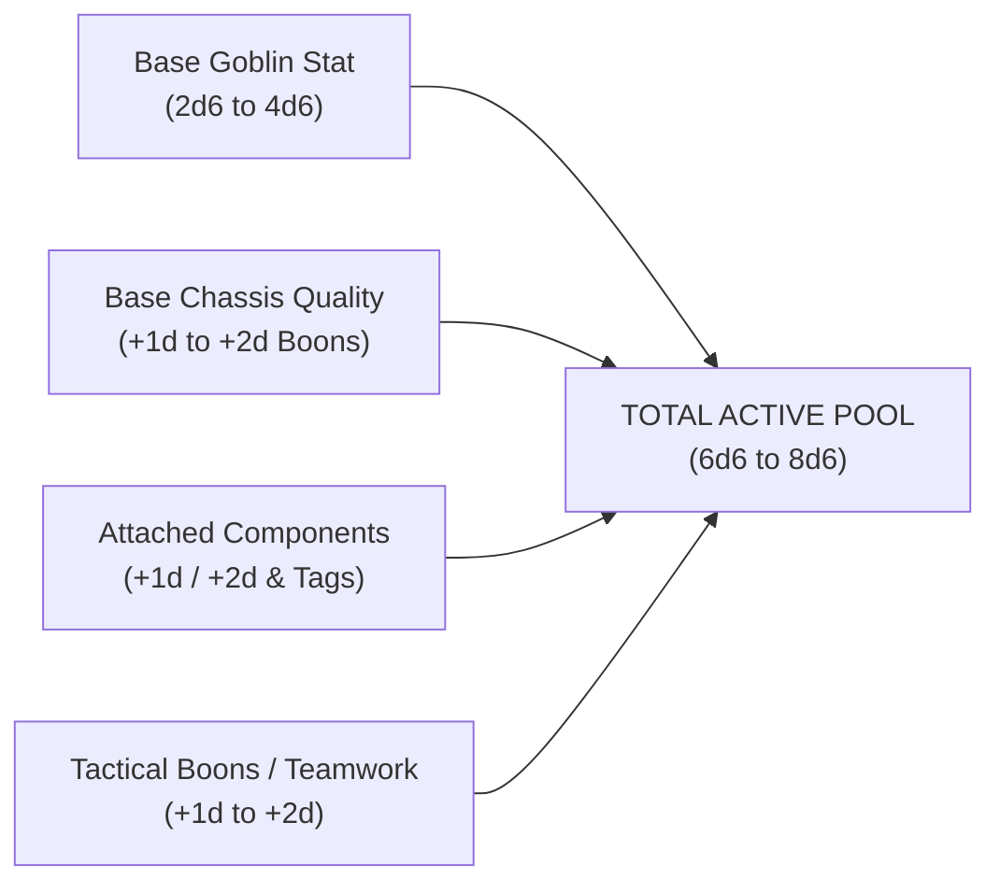
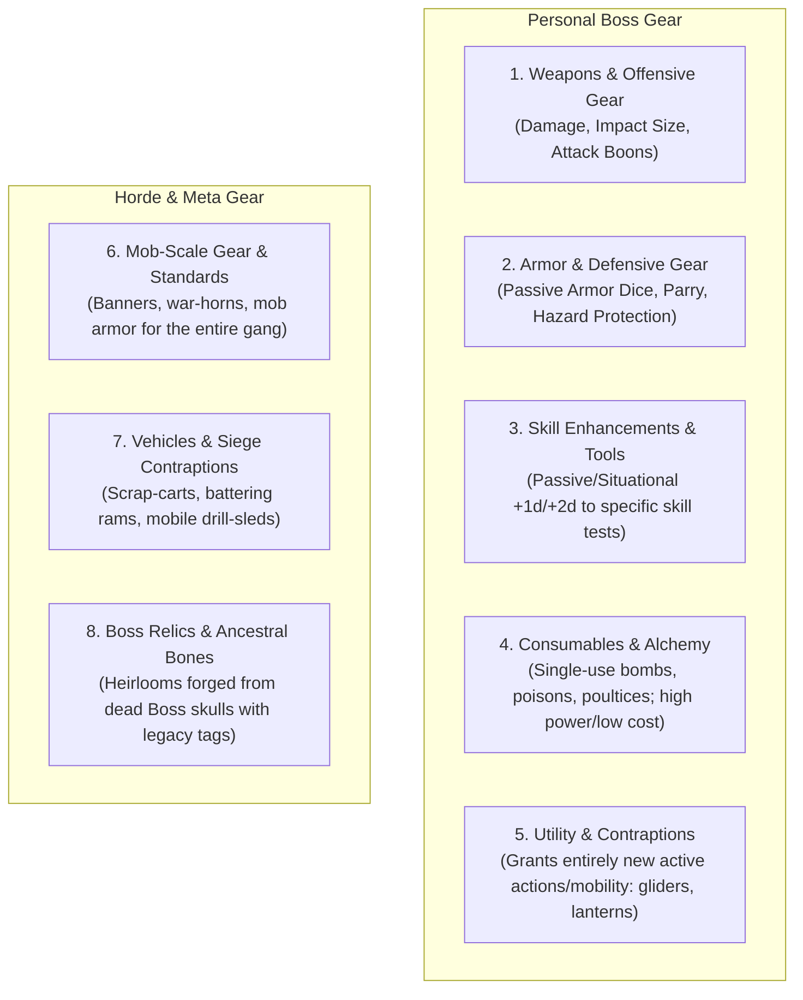
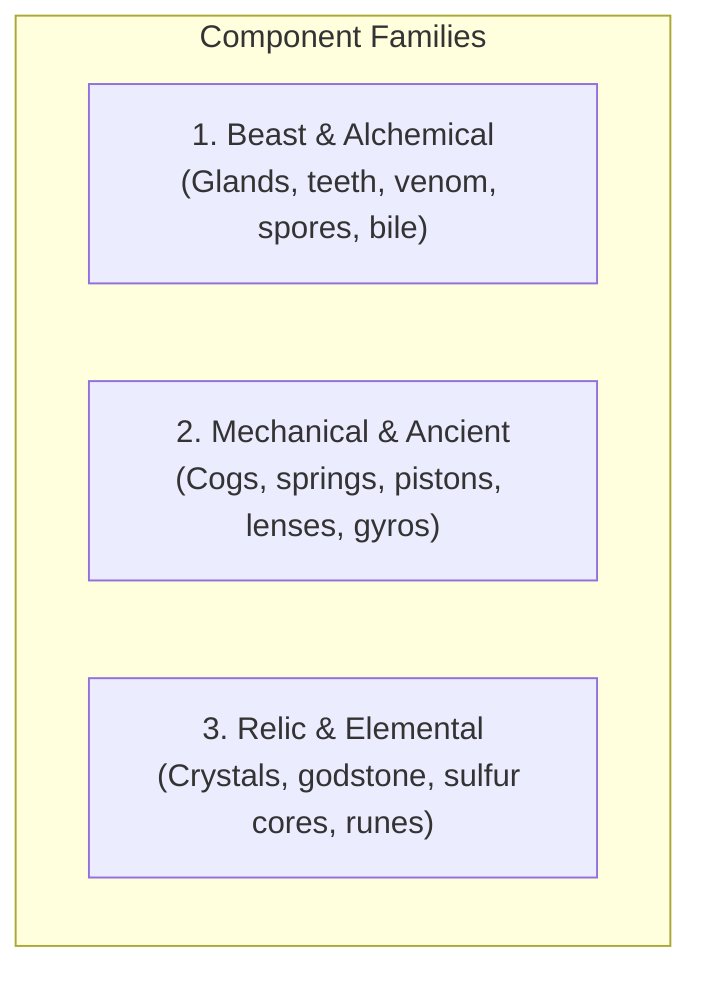
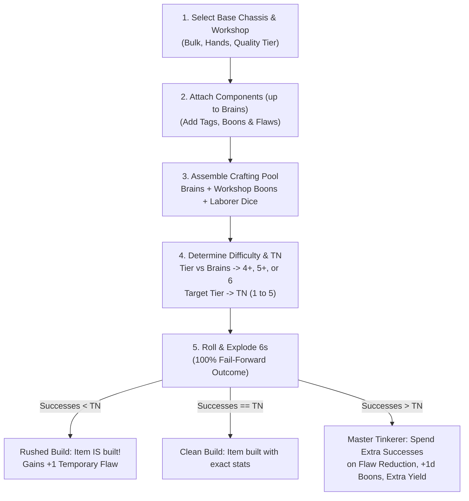
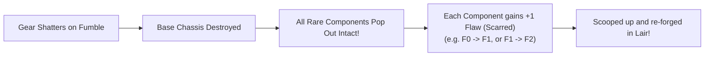

# Equipment, Gear & Custom Crafting

*A proper goblin does not care where a weapon came from—only how hard it hits, how heavy it is to drag, and how many shiny bits you can tape to it before it explodes. When raw muscle and blind luck are not enough, a Goblin Boss turns to the forge, welding dragon teeth, dwarven cogs, and volatile alchemical bile into gear that can actually win a war.*

This chapter defines the complete rules for mundane weapons, armor, adventuring tools, alchemical consumables, and the **Custom Crafting Engine** used during the **Lair Phase**.

---

## 1. The Core Philosophy of Gear & Crafting

In **Gobbos**, equipment and custom crafting serve three fundamental design purposes:

1. **Escalating Dice Pools (From 2d to 8d):** While a Goblin Boss’s innate stats provide a modest base pool of **2d6 to 4d6** (making high-defense targets difficult to crack), properly forged weapons, armor, and attached components add dependable **Boons (+1d to +2d)**, expanding active pools to a satisfying fistful of **6d6 to 8d6**.
2. **Engineered Reliability vs. Volatile Magic:** Unlike **Magic**, which is fueled by the chaotic, high-risk **Bangaranga Pool** and risks catastrophic miscasts, **Crafting** is an engineered investment of **Scrap**, **Workshops**, and **Brains** that produces permanent, dependable passive dice, armor mitigation, and tactical tags.
3. **Fail-Forward Tinkering (Zero Wasted Rare Loot):** Crafting in the Lair is 100% fail-forward. You **never** lose or destroy rare components on a bad crafting roll. A poor roll produces a functional weapon with a temporary flaw, while exceptional rolls allow you to tame instabilities and reinforce durability.

---

## 2. The 8 Equipment & Crafting Categories

All gear and crafted devices in the game belong to one of **Eight Distinct Categories**:

### 1. Weapons & Offensive Gear (Violence)
* **Purpose:** Inflict wounds, modify **Impact Size** for Stagger checks, provide Reach, bypass armor, or grant direct attack **Boons (+1d to +2d)**.
* **Key Stats:** Bulk, Handedness (1H/2H), Quality Tier, Break Roll threshold, Impact Size, and Combat Tags.

### 2. Armor & Defensive Gear (Survival)
* **Purpose:** Grant passive **Armor Dice** rolled in the **Defence Roll** to mitigate incoming damage, enable shield **Parry Reactions**, or resist environmental hazards.
* **Key Stats:** Bulk, Armor Dice (+1d to +3d), Mobility Penalties (Banes on Slink), and Break Roll threshold.

### 3. Skill Enhancements & Tools (Competence)
* **Purpose:** Grant passive or situational **Boons (+1d or +2d)**, reduce test difficulties (**Normal 5+ -> Easy 4+**), or provide leverage for non-combat tasks.
* **Key Stats:** Bulk, Quality Tier, Break Roll threshold, and Skill Modification profile.

### 4. Consumables & Alchemical Devices (Single-Use Force Multipliers)
* **Purpose:** Single-use weapons, alchemical flasks, and medical pastes. Because they are destroyed upon use, they punch above their weight, carrying higher Area Threat profiles, automatic conditions, or instant recovery at minimal Scrap cost.
* **Key Stats:** Bulk, Area Threat Profile, Damage, and Area Tags (`[Fire]`, `[Gaseous]`, `[Explosive]`).

### 5. Utility & Contraptions (New Capabilities)
* **Purpose:** Do not just add dice; grant *new permissions, movement modes, or environmental interactions* that you could not physically do before (e.g. gliding across chasm hazards, stripping darkness tags across multiple zones).
* **Key Stats:** Bulk, Handedness, Quality Tier, and Unique Functional Rules.

### 6. Mob-Scale Gear & Battle Standards (Horde Force Multipliers)
* **Purpose:** Outfits an entire **Mob** for an upcoming raid. Built by sacrificing Scrap and Components during downtime to grant the Mob temporary tactical tags (`[Shield Wall]`, `[Flaming Spears]`, `[Rallying]`).
* **Key Stats:** Mob Size requirement, Component consumed, and Raid-Duration Tag granted.

### 7. Vehicles & Siege Contraptions (Heavy Hardware)
* **Purpose:** Multi-goblin war engines and heavy contraptions (Bulk 4+, operated during raids or Lair defense).
* **Key Stats:** Bulk (4+), Crew requirement, Structural Integrity, and Heavy Siege Profile.

### 8. Boss Relics & Ancestral Bones (Legacy Heirlooms)
* **Purpose:** Ancestral relics harvested from the skeletal remains of fallen Bosses on the **Bone Pile**. Carries sentimental memory tags and revenge boons against the faction that killed them.
* **Key Stats:** Tier (T1–T2), Flaw (F0–F1), and Ancestral Grudge Tags.

---

## 3. Base Equipment & Plunder Catalogue

Every mundane item possesses a standard **Quality Tier (T1–T5)** and zero attached magical Components.

### The Five Quality Tiers & Break Rolls

When you roll a **Fumble** on an active combat test using an item (a roll containing no successes and at least one 1), you make a **1d6 Break Roll** against the item's Quality:

| Quality Level | Equivalent Tier | Typical Origin & Craftsmanship | Base Break Roll (Fumble) |
| :--- | :---: | :--- | :---: |
| **Junk** | **T1** | Sticks, bones, rusty wire, and wishful thinking. | **Breaks on 1–4** |
| **Scrappy** | **T2** | Splintered oak, hammered iron, standard goblin make. | **Breaks on 1–3** |
| **Standard** | **T3** | Proper forged steel, cured leather, human soldier gear. | **Breaks on 1–2** |
| **Superior** | **T4** | Dwarven alloy, reinforced reptile hide, master smith work. | **Breaks on 1** |
| **Legendary** | **T5** | Godstone alloy, void-touched crystal, ancient relic metal. | **Never Breaks** |

---

### Master Mundane Weapons Ledger

Melee attacks roll a **Dice Pool** equal to **Tough**; Ranged attacks roll **Slink** (see [Combat Engine](05_Combat_Engine.md)).

| Weapon Name | Quality | Bulk | Hands | Range | Break Roll | Impact Size | Mechanical Profile & Boons |
| :--- | :---: | :---: | :---: | :---: | :---: | :---: | :--- |
| **Sharpened Bone Shiv** | T1 | 1 | 1H | Melee | 1–4 | Size 1 | *Concealable:* Can be drawn as an incidental **Free Action**. |
| **Crude Spiked Club** | T1 | 2 | 1H | Melee | 1–4 | Size 1 | *Heavy Wood:* Splintered log with rusty nails. |
| **Rusty Cleaver** | T2 | 1 | 1H | Melee | 1–3 | Size 1 | *Chopper:* Standard goblin butcher blade. |
| **Goblin Shortspear** | T2 | 2 | 1H | Melee | 1–3 | Size 1 | `[Reach]`: Can strike enemies in your zone from behind an ally. |
| **Scrappy War-Flail** | T2 | 2 | 1H | Melee | 1–3 | Size 1 | `[Flexible]`: Ignores enemy shield cover benefits. |
| **Scrap Greataxe** | T2 | 3 | 2H | Melee | 1–3 | Size 2 | `[Heavy]`: Adds **+1 to Impact Size**; requires 2 hands. |
| **Leather Sling** | T1 | 1 | 1H | 1 Zone | 1–4 | Size 1 | *Scavenged Ammo:* Uses stones picked up freely in any zone. |
| **Throwing Daggers (3)** | T2 | 1 | 1H | 1 Zone | 1–3 | Size 1 | *Fast Throw:* Can be thrown without stowing your off-hand. |
| **Goblin Shortbow** | T2 | 2 | 2H | 2 Zones | 1–3 | Size 1 | *Rapid Shot:* Fires across 2 zones without penalty. |
| **Scrappy Crossbow** | T2 | 2 | 2H | 2 Zones | 1–3 | Size 1 | *Winch Crank:* Requires **Brains 2** to reload and fire cleanly. |
| **Soldier's Shortsword**| T3 | 2 | 1H | Melee | 1–2 | Size 1 | `[Balanced]`: Well-tempered human infantry blade. |
| **Knight's Longsword** | T3 | 2 | 1H/2H | Melee | 1–2 | Size 1 | `[Versatile]`: Grants **Boon 1 (+1d)** when swung with two hands. |
| **Heavy Halberd** | T3 | 3 | 2H | Melee/1Z| 1–2 | Size 2 | `[Heavy, Reach]`: **+1 Impact Size**. Can strike 1 adjacent zone. |
| **Military Longbow** | T3 | 2 | 2H | 3 Zones | 1–2 | Size 1 | *High Tension:* Requires **Tough 2**. Grants **Boon 1 (+1d)** at 2+ zones. |
| **Heavy Arbalest** | T3 | 3 | 2H | 3 Zones | 1–2 | Size 2 | `[Heavy]`: Requires **Tough 2** and **Brains 2**. **+1 Impact Size**. |
| **Dwarven War-Pick** | T4 | 2 | 1H | Melee | 1 | Size 1 | `[Piercing]`: Bypasses 1 Passive Armor Die from target armor. |
| **Dwarven Great-Hammer**| T4 | 3 | 2H | Melee | 1 | Size 3 | `[Crushing]`: Adds **+2 to Impact Size**; shatters stone barriers. |
| **Dwarven Repeater** | T4 | 3 | 2H | 2 Zones | 1 | Size 1 | `[Rapid]`: Can make two Ranged Attacks with 1 Standard Action. |
| **Ancient Titan Cleaver**| T5| 4 | 2H | Melee | **Never**| Size 3 | `[Crushing, Masterwork]`: **+2 Impact Size**, **Boon 1 (+1d)**. Req. **Tough 3**. |

---

### Master Armor & Shields Ledger

Armor and Shields provide passive dice rolled during the **Defence Roll** to soak damage when active evasion fails (see [Combat Engine](05_Combat_Engine.md)).

| Armor / Shield Name | Quality | Bulk | Slot | Break Roll | Armor Dice | Mobility Penalties & Special Rules |
| :--- | :---: | :---: | :---: | :---: | :---: | :--- |
| **Padded Rag Tunic** | T1 | 1 | Worn | 1–4 | **+1d** | *Light:* Quilted burlap rags. Zero penalties. |
| **Boiled Hide Armor** | T2 | 1 | Worn | 1–3 | **+1d** | *Light:* Cured reptile hide. Zero penalties. |
| **Cobbled Scrap-Plate** | T2 | 2 | Worn | 1–3 | **+2d** | *Medium:* Imposes **Bane 1 (-1d)** on **Slink** tests. |
| **Spiked Pot-Lid Shield**| T2 | 1 | 1H | 1–3 | **+1d** | *Shield:* Adds **+1d Armor Die**; enables **Parry Reaction** (**Tough** test). |
| **Knight's Chain Shirt** | T3 | 2 | Worn | 1–2 | **+2d** | *Medium:* Imposes **Bane 1 (-1d)** on **Slink** tests. |
| **Full Plate Harness** | T3 | 3 | Worn | 1–2 | **+3d** | *Heavy:* Imposes **Bane 2 (-2d)** on **Slink** tests; cannot swim. |
| **Tower Pavise Shield** | T3 | 2 | 1H | 1–2 | **+2d** | *Heavy Shield:* **+2d Armor Dice**; enables **Parry**; halves Movement while held. |
| **Dwarven Runed Carapace**| T4| 3 | Worn | 1 | **+3d** | *Heavy (Alloy):* Imposes **Bane 1 (-1d)** on **Slink** tests. Cannot swim. |
| **Ancient Godstone Aegis**| T5 | 2 | 1H | **Never** | **+2d** | *Relic Shield:* **+2d Armor Dice**; immune to all armor-piercing effects. |

---

### Master Tools, Consumables & Exploration Gear

| Item Name | Quality | Bulk | Category | Break / Uses | Mechanical Function & Rule |
| :--- | :---: | :---: | :---: | :---: | :--- |
| **Crude Bone Wire** | T1 | 0 | Tool | 1–4 | *Picks:* Allows picking crude locks; fumbling snaps the wire instantly. |
| **Heavy Crowbar** | T2 | 1 | Tool | 1–3 | *Leverage:* Grants **Boon 1 (+1d)** to **Tough** tests to force doors or smash chests. |
| **Hemp Rope & Iron Hook**| T2 | 1 | Tool | 1–3 | *Climbing:* Scale vertical walls without a test; snag Bulk 1–2 items 1 Zone away. |
| **Scent-Masking Paste** | T2 | 0 | Tool | 1–3 | *Deodorant:* Grants **Boon 1 (+1d)** to **Slink** tests against beast sentries. |
| **Master Thief's Picks** | T3 | 0 | Tool | 1–2 | *Precision:* Reduces lockpicking tests from **Hard (6) -> Normal (5+)** or **Normal (5+) -> Easy (4+)**. |
| **Brass Bullseye Lantern**| T3| 1 | Utility | 1–2 | *Focused Beam:* Strips `[Dark]` across **2 Zones in a line**; provides `[Light]`. |
| **Heavy Iron Manacles** | T3 | 1 | Utility | 1–2 | *Restraint:* Inflicts `[Restrained]` on helpless foe. Escaping requires `Slink 5+/2`. |
| **Dwarven Miner's Pick** | T4 | 2 | Tool | 1 | *Excavation:* Breaches solid stone walls in 3 rounds; **Boon 2 (+2d)** on mining tests. |
| **Torch** | T1 | 1 | Consumable| 1 Raid Phase | *Light & Weapon:* Strips `[Dark]`. Usable as melee weapon carrying `[Fire, Light]`. |
| **Bag of Caltrops** | T2 | 1 | Consumable| 1 Zone Use | *Zone Trap:* Moving through forces `Slink 5+/1` test or creature halts and takes 1 Damage. |
| **Fire Flask (Molotov)** | T2 | 1 | Consumable| 1 Use | *Fireblast:* Thrown 1 Zone. `Threat 5+/1`, 2 Damage, `[Fire]`. Sets terrain `[Burning]`. |
| **Choking Smoke Pot** | T2 | 1 | Consumable| 1 Use | *Screen:* Thrown 1 Zone. `Threat 4+/1`, 0 Damage, `[Gaseous]`. Fills Zone with fog (`[Dark]`). |
| **Troll-Slime Poultice** | T2 | 0 | Consumable| 1 Use | *First Aid:* Standard Action. Restores **1 Grit**; roll `Tough 5+/1` or suffer nausea 1 round. |
| **Demolition Powder Keg** | T3 | 2 | Consumable| 1 Use | *Detonation:* `Threat 5+/2`, 3 Damage, `[Explosive]`. Shatters gates and barricades. |
| **Siege Mortar Shell** | T4 | 3 | Consumable| 1 Use | *Heavy Shell:* `Threat 5+/3`, 4 Damage, `[Explosive]`. Blasts **2 adjacent Zones**. |
| **Sol-Quartz Core** | T5 | 4 | Consumable| 1 Use | *Cataclysm:* `Threat 6/3`, 5 Damage, `[Explosive]`. Blasts entire room quadrant. |

---

## 4. The 3-Family Component Matrix (Zero-Bloat Loot)

To eliminate the cognitive load of tracking hundreds of granular monster body parts, plants, and alloys, all lootable components belong to one of **Three Core Families**:

### The Component Shorthand Standard
Every component discovered on raids is written in a universal single-line format:

`[Name] — Tier (T1–T5) / Flaw (F0–F3) — Primary Tag & Boon`

* **Tier (T1–T5):** Governs the magnitude of the positive mechanical effect.
* **Flaw (F0–F3):** Governs the innate instability and drawbacks of the component.

| Flaw Level | Rating | In-Game Drawback & Volatility |
| :--- | :---: | :--- |
| **F0** | **Pure** | Completely stable. No negative tags or side effects. |
| **F1** | **Irritating** | Cosmetic or annoying drawbacks (smokes, chatters, smells of rotten eggs, glows near cheese). |
| **F2** | **Painful** | Mechanical drawback (costs 1 Grit if attack roll contains any 1s, requires fuel, or drains 1 Grunt on draw). |
| **F3** | **Dangerous** | Severe campaign risk (attracts apex predators, risks catastrophic Zone explosion on break). |

### The Three Component Families

#### 1. Beast & Alchemical Components
* **Typical Loot:** Dragon teeth, wyvern stingers, troll bile glands, giant spider venom sacs, fungal spore pods.
* **Typical Tags & Boons:** `[Vicious: +1d Melee]`, `[Toxic: 1 Wound on 6s]`, `[Acid: Destroys 1 Armor Die]`, `[Sticky: Restrains]`, `[Regenerating: Restores 1 Grit on Rest]`.

#### 2. Mechanical & Ancient Components
* **Typical Loot:** Dwarven gyro-cogs, clockwork tension springs, brass hydraulic pistons, precision scope lenses.
* **Typical Tags & Boons:** `[Balanced: +1d to Hit]`, `[Rapid: +1 Attack Action]`, `[Winch: +1 Zone Range]`, `[Piercing: Ignores Armor]`, `[Leverage: +1d vs Structures]`.

#### 3. Relic & Elemental Components
* **Typical Loot:** Sol-Quartz shards, void-touched crystals, sulfur blast-cores, ancient titan rune-plates.
* **Typical Tags & Boons:** `[Fire: Burns Zone]`, `[Shock: Chain Conduction]`, `[Shielding: +1d Armor Die]`, `[Blast: +1 Impact Size]`, `[Unbreakable]`.

>> **GM QUICK-DROP RULE:**  
>> The GM can generate loot instantly without tables by combining:  
>> **1 Descriptor** (*"Dwarven Piston"*) + **1 Tier/Flaw** (*"T3 / F1"*) + **1 Tag** (*"[Crushing: +1 Impact Size]"*).

---

## 5. The Custom Crafting Engine

Crafting takes place during **Step 4 of the Lair Phase** when a **Goblin Boss** spends their **Downtime Action** on *Custom Crafting* (see [The Lair Loop & Progression](10_The_Lair_Loop_and_Progression.md)).

---

### Step 1: Base Chassis & Workshop Tier
Select a **Base Item** from the equipment catalogue. Your Lair's active **Workshop Facility** determines the maximum base Quality you can forge from raw Scrap:

| Workshop Level | Max Base Quality | Lair Facility Requirement | Passive Crafting Boon |
| :--- | :---: | :--- | :---: |
| **Open Fire** | **Junk (T1)** | Always available in any cave. | None |
| **Scrap Forge** | **Scrappy (T2)** | Basic Scrap Forge facility. | None |
| **Proper Smithy** | **Standard (T3)** | Advanced Smithy facility. | **+1d Crafting Pool** |
| **Master Forge** | **Superior (T4)** | Dwarven Forge facility. | **+2d Crafting Pool** |
| **Legendary Forge**| **Legendary (T5)**| Mythic Relic Chamber facility. | **+3d Crafting Pool** |

>> **THE WORKSHOP CEILING RULE:**  
>> If you attach a Component whose Tier is *higher* than your Workshop's Quality level, the Component's **Flaw automatically increases by +1 for every Tier it exceeds the Workshop**.

---

### Step 2: Component Capacity & Brains
Your Boss's **Brains** rating sets your **Crafting Capacity**—the maximum number of Components you can attach to a single item:

$$\textbf{Component Slots} = \textbf{Brains Rating (1 to 5)}$$

>> **TAG UNIQUENESS RULE:**  
>> An item cannot benefit from multiple identical passive stat tags (e.g. you cannot install two `[Balanced: +1d to Hit]` cogs on one blade; one must be `[Balanced]` and the other something distinct like `[Vicious]` or `[Fire]`).

---

### Step 3: Assemble the Crafting Pool
Roll a dice pool based on your **Brains**, upgraded workshops, and assigned apprentice runts:

$$\textbf{Crafting Pool} = \textbf{Brains} + \textbf{Workshop Boons (+1d to +2d)} + \textbf{Laborer Dice (Apprentice Runts, max +2d)}$$

* You may assign up to **2 Laborer Dice** from the Lair's Gobbo Pool to work the bellows, adding **+1d per Laborer Die**.

---

### Step 4: Determine Difficulty & Target Number (TN)
The **Target Tier** equals the higher of the **Base Chassis Quality** OR the **highest attached Component Tier** (T1 to T5).

1. **Difficulty Target Face:**
   * **Target Tier < Brains:** **Easy (4+)**
   * **Target Tier == Brains:** **Normal (5+)**
   * **Target Tier > Brains:** **Hard (6)**
2. **Target Number (TN):** Equals the **Target Tier** in required successes (**T1 = TN 1**, **T2 = TN 2**, **T3 = TN 3**, **T4 = TN 4**, **T5 = TN 5**).

---

### Step 5: Roll & Resolve (100% Fail-Forward)

Roll all dice. Standard **exploding 6s** apply (every 6 counts as 1 success and explodes into an extra die).

#### 1. Rushed Build (`Successes < TN`)
* **The item IS built and 100% functional!** You never lose rare components or scrap.
* **The Catch:** The tolerances are loose; the finished item gains **+1 Temporary Flaw** (e.g. $F0 \rightarrow F1$ or $F1 \rightarrow F2$) until tuned during a future Lair phase.

#### 2. Clean Build (`Successes == TN`)
* The item is crafted cleanly with standard stats and innate Flaws.

#### 3. Master Tinkerer (`Successes > TN`)
* For **every extra success** scored beyond the TN, spend 1 success on the **Master Tinkerer Menu**:
  * **Tame a Flaw:** Reduce an attached Component's Flaw rating by 1 step (minimum F0).
  * **Reinforce Chassis:** Improve the Base Chassis Break Roll by 1 step (e.g. breaks on $1–2$ instead of $1–3$).
  * **Lightweighting:** Reduce item Bulk by 1 (minimum Bulk 0).
  * **Masterwork Polish:** Add an aesthetic or minor tag (`[Balanced: +1d to Hit]`, `[Sharp: +1 Damage]`, `[Reinforced: +1d Armor]`).
  * **Extra Batch Yield (Consumables only):** Gain **+1 additional consumable item/flask** for free per extra success!

---

### Step 6: Initial 1s (Harmless Chaos Quirks)
Count any natural **1s** rolled in the initial pool (excluding explosions). For each 1 rolled, the GM picks or rolls on the **Goblin Chaos Quirk Table**:

| d6 | Harmless Aesthetic Quirk |
| :---: | :--- |
| **1** | **Noisy:** Loudly whistles, hisses, or groans whenever swung or drawn. |
| **2** | **Stinky:** Smells intensely of burnt tallow, garlic, and sulfur. |
| **3** | **Fluorescent:** Glows faint neon green or pink in the dark near cheese or ale. |
| **4** | **Jittery:** Vibrates violently when placed stationary on a flat surface. |
| **5** | **Sparky:** Emits harmless festive sparks whenever drawn from its sheath. |
| **6** | **Slimy:** Leaks a sticky green residue that covers the wielder's fingers. |

---

## 6. Custom Gear in Play: Wear, Breakage & Salvage

Custom gear is put under violent stress during raids.

### Break Rolls & The Fumble Trigger
An item makes a **Break Roll** only when a combat attack or defense test using the item results in a **Fumble** (zero successes and at least one 1 rolled).

* Roll **1d6** against the item's Break Roll threshold (modified by attached components: +1 break threshold for every 2 attached components).
* **Break Roll Passed (Roll > Threshold):** The gear rattles and sparks, but holds together cleanly.
* **Break Roll Failed (Roll <= Threshold):** The **Base Chassis shatters into jagged scrap**. Trigger the **Scrap Cascade** immediately.

---

### The Scrap Cascade (Fail-Forward Component Salvage)

When a piece of custom gear shatters, **all attached Components pop out and survive!**

* **Zero Rare Component Loss:** The dragon tooth, dwarven cog, or void crystal is never obliterated by a standard break. You scoop it up from the mud.
* **The Consequence (+1 Flaw):** The violent trauma leaves the component **Scarred**, permanently increasing its innate **Flaw rating by +1** (e.g. from F0 Pure to F1 Irritating, or F1 to F2 Painful).
* **Repairing Scarred Components:** During the Lair Phase, a Boss can spend a Downtime Action to repair and stabilize a scarred component, reducing its Flaw back down.

>> **PERMANENT OBLITERATION RULES:**  
>> A component is permanently destroyed under ONLY two conditions:  
>> 1. **Voluntary Overload:** The player deliberately triggers an Overload (see below).  
>> 2. **Neglected F3 Catastrophe:** A component that has already reached **F3 (Dangerous)** breaks a second time without ever being repaired or stabilized in the Lair.

---

## 7. Overloading (The Panic Button)

Before declaring an Attack action in combat, you may announce an **Overload**. This pushes your contraption beyond its structural tolerance for a fight-winning mega-strike:

1. **Unstoppable Force:** The attack completely ignores the target's Passive Defense dice and armor mitigation.
2. **Cataclysmic Magnitude:** All positive Component Tags and Damage dice are **doubled** (or affect the entire Zone).
3. **Total Vaporization:** The moment the attack resolves, the item and all installed components are **instantly vaporized into grey ash**. Zero components survive; no Scrap Cascade is rolled.

---

## 8. Mob-Scale Crafting & Boss Relics

### Mob-Scale Crafting
During Step 4 of the Lair Phase, a Boss with access to a Scrap Forge or better can outfit an entire **Mob** for the upcoming raid:
* **Cost:** Sacrifice **1 Component** from the Lair's inventory and **1 Scrap per point of Mob Size**.
* **Effect:** The entire Mob gains a temporary tactical Tag matching the component's positive effect (`[Flaming Spears]`, `[Poison Darts]`, `[Spiked Shields]`) for the duration of the next raid.

### Boss Relics (Ancestral Skulls & Bones)
When a Goblin Boss dies on a raid, their remains are added to the **Bone Pile**. During downtime, a surviving Boss can harvest a bone to craft an **Ancestral Boss Relic** (Bulk 0, T1–T2, F0–F1):
* **Legacy Grudge Tag:** Grants **Boon 1 (+1d)** against the specific faction or monster type responsible for that Boss's death.
* **Ancestral Memory Tag:** Inherits a signature trait based on how the Boss died (e.g. incinerated by dragon breath $\rightarrow$ `[Fire-Scarred: +1d Armor vs Fire]`).
