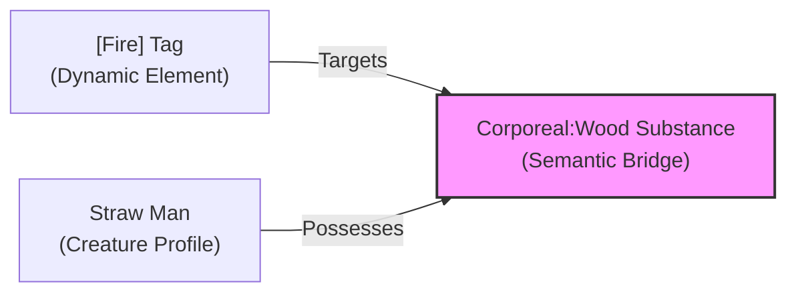
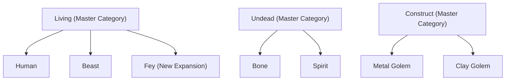

# Brainstorm: Atomic Tag Interactions & Extensibility

*If every time we add a new [Frostfire] spell we have to go back and update the statblocks of fifty different monsters, we have failed as game designers. A great system is modular and atomic—new elements plug in, and old monsters react naturally without needing a rewrite.*

This brainstorm addresses the tension between **Local Rules (on the monster statblock)** and **Global Rules (in the tag ontology)**. We want to find a decoupled framework that allows easy expansion (introducing new tags or monsters) without causing rules interdependency issues or requiring retrofitting.

---

## The Design Tension: Local vs. Global

There are two extreme ways to handle vulnerability/immunities:

### Option A: Fully Localized (Statblock-driven)
*   **How it works:** All tag interactions are printed directly on the creature's card.
    *   *Straw Man Statblock:* `Vulnerability: [Fire] (Defence TN is 1).`
*   **Pros:** Highly atomic at the table. The GM needs no global lookup. They look at the Straw Man, see `[Fire]`, and change the TN.
*   **Cons:** Hard to expand. If we add a new `[Acid]` tag, we must retroactively update the Straw Man to say if it is vulnerable to `[Acid]`.

### Option B: Fully Global (Rules-driven)
*   **How it works:** The tags themselves contain the rules of what they affect.
    *   *Fire Tag Rule:* `[Fire] attacks are Easy (4+) against Straw Men.`
*   **Pros:** Decoupled monster statblocks.
*   **Cons:** A nightmare to write. The `[Fire]` tag rulebook page would have a list of fifty different monsters it works on. If you create a new monster, you have to edit the `[Fire]` tag page.

---

## The Solution: The "Semantic Bridge" (Substance-Based Mapping)

To make the system truly atomic, **Tags should never target individual monsters, and monsters should never list individual tags.**

Instead, they both map to a **Semantic Bridge** of physical **Substances** (`Wood`, `Metal`, `Bone`, `Flesh`) and **Ancestries** (`Undead`, `Construct`, `Beast`).

### How this resolves the extensibility problem:

1.  **When writing a Monster:** You only define its core facets (e.g., `Substance: Corporeal:Wood`, `Ancestry: Construct`). You do *not* write any tags on it.
2.  **When writing a Tag/Element:** You only define what physical substances it interacts with.
    *   `[Fire]` $\rightarrow$ Target TN is reduced by 1 against `Corporeal:Wood` or `Corporeal:Plant`.
    *   `[Angelic]` $\rightarrow$ Attack Difficulty is Easy (4+) against `Undead`.
    *   `[Toxic]` $\rightarrow$ Has no effect against `Corporeal:Metal` or `Undead`.

---

## Solving the "Future Expansion" Problem: Master Category Fallbacks

The biggest concern with this decoupled bridge is **what happens when we introduce a new Ancestry/Substance category later (e.g., adding `Fey` or `Alien`)?** If existing tags don't reference `Fey`, how do they know how to interact?

We solve this using **Master Category Fallbacks (Broader Terms)**. We establish four immutable, high-level Master Categories that represent the fundamental states of life and matter. Any new category introduced in a future expansion *must* inherit from one of these master categories.

### The 4 Master Essences (Ancestries):
1.  **`Living`:** Biological entities. Default behavior: Affected normally by physical harm, sleep, fear, bleeding, and `[Toxic]` poisons.
2.  **`Undead`:** Animated remains/spirits. Default behavior: Immune to biological conditions (bleed, fear, poison). Vulnerable to `[Angelic]` or holy effects.
3.  **`Construct`:** Inanimate matter given purpose. Default behavior: Immune to biology, sleep, mind-affecting states, and poison.
4.  **`Elemental`:** Raw forces of nature. Default behavior: Immune to bleed/poison, highly reactive to opposing elemental tags.

### The 2 Master Substances:
1.  **`Corporeal`:** Physical matter. Default behavior: Can be blocked, grappled, and damaged by physical traits.
2.  **`Incorporeal`:** Spectral/gas states. Default behavior: Immune to non-magical grapple and standard physical traits.

---

### In Action: Adding "Fey" Later:
If we release a *Feywild expansion* and introduce a **Pixie**:
1.  We define the Pixie's facets as: `Ancestry: Living:Fey` | `Substance: Corporeal:Flesh`.
2.  **Immediate Resolution:** 
    *   Because it is under the `Living` master category, the existing `[Toxic]` (poison) tag automatically works on it.
    *   Because it is `Corporeal:Flesh`, standard weapon traits like `Cutting` automatically work on it.
    *   **No old tag or weapon rules need to be updated.**
3.  **Handling Fey-Specific Mechanics:** If Fey have unique properties (like vulnerability to Cold Iron), we don't edit old tags. We simply write the exception on the Fey category itself:
    *   *Fey Ancestry Rule:* `Fey: Vulnerable to Corporeal:Metal (Iron) weapons.`

This fallback inheritance ensures that the core game remains 100% stable, while leaving the door wide open for future modules.
