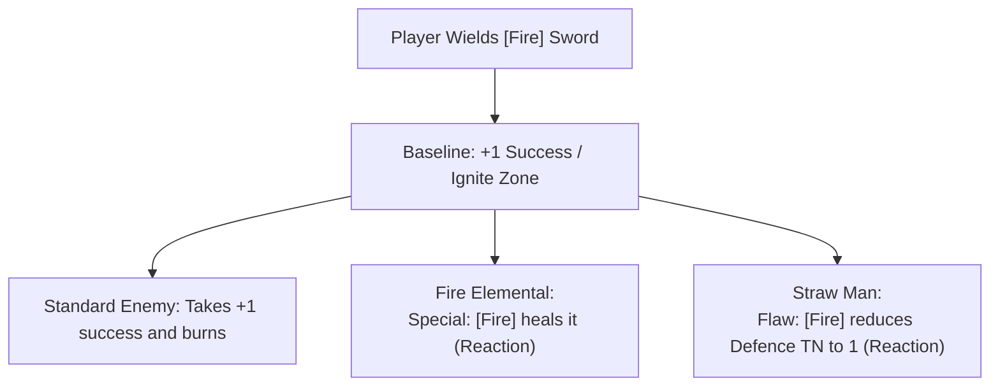

# Brainstorm: Baseline Tags & Monster Reactions

*A goblin wielding a fire sword expects things to burn. If a fire sword only does something when a monster has a "Flaw: Fire" tag on its card, the player feels cheated. The fire must be hot by default; monsters are just the things that react to the heat.*

This brainstorm details a hybrid framework that bridges **Player Agency** (clear, baseline tag effects that work universally) with **Monster Adaptability** (statblocks that react to and modify those baselines). This supports Crafting, Magic, and Combat symmetrically, keeping players in control of their tactics.

---

## The Hybrid Concept: Baseline vs. Reaction

To make the game highly tactical and understandable:
1.  **Tags have a Universal Baseline Effect:** Players know exactly what their tags do against standard enemies.
2.  **Monsters modify the Baseline:** Exceptional creatures have local traits, immunities, or flaws that override the baseline.

---

## 1. The Universal Tag Glossary (Player-Facing Baselines)

Every tag has a simple, universal baseline rules effect that applies to any standard foe:

### Elemental & Substance Tags (Layer 1)
*   **`[Fire]`**: Deals **+1 Success** on attack rolls and places the `[Burning]` tag on the target's Zone.
*   **`[Sticky]`**: Inflicts the **Restrained** condition (target cannot Move; suffers **-1d** to Dodge).
*   **`[Toxic]`**: Inflicts the **Weakened** condition (target suffers **-1d** to all action tests).
*   **`[Chilled]`**: Reduces the target's Movement by 1 Zone (minimum 0).
*   **`[Shock]`**: Arc damage. If the attack hits, it deals 1 automatic Grit/Size damage to one additional target in the same Zone.
*   **`[Angelic]`**: Holy energy. Shakes the resolve of standard foes, making attacks against them **Easy (4+)**.

### Weapon Traits / Physical Attributes (Layer 3)
*   **`Bashing`**: Blunt impact. Forces a **Bane (-1d)** on the target's Parry reaction.
*   **`Cutting`**: Sharp slice. Adds **+1d** to the attack pool against unarmored targets.
*   **`Poking`**: Piercing point. Ignores 1 point of static Armor damage reduction.

---

## 2. Monster Reactions (The Statblock Exceptions)

Standard human guards, farmers, and simple wild beasts have no special reactions. They take the baseline effects. 

Exceptional monsters, elites, and bosses list **Reactions** that modify or override these baselines:

### Type A: Immunities (Negating the Baseline)
The creature's biology or substance ignores the tag's condition or effect:
*   *Iron Golem:* **Immune: `[Toxic]`, `[Chilled]`** (ignores Weakened/Restrained from these sources).
*   *Wraith:* **Immune: Non-Magical physical traits** (ignores non-magical `Cutting`, `Bashing`, `Poking` damage).

### Type B: Flaws (Amplifying the Baseline)
The creature is especially vulnerable, upgrading the tag's effect:
*   *Straw Man:* **Flaw: `[Fire]` (Defence TN becomes 1)** (replaces the standard +1 success with instant death on 1 success).
*   *Skeleton:* **Flaw: `Bashing` (Defence TN is reduced by 1)**.

### Type C: Synergy / Absorption (Altering the Behavior)
The element triggers a completely different state:
*   *Tar Beast:* **Reaction: `[Fire]` explodes it** (deals 3 damage to everyone in the zone, destroying the Beast).
*   *Clay Golem:* **Reaction: `[Chilled]` makes it brittle** (Difficulty of physical attacks becomes Easy).

---

## Why This Supports Crafting, Combat, and Magic

This hybrid framework unifies all three pillars of the game under the same rules vocabulary:

1.  **Magic (Power Words):** When a goblin wizard casts the `[Sticky]` word, they know it inflicts *Restrained*. If they cast `[Fire]`, it deals damage and ignites the zone. They do not need to guess.
2.  **Crafting (Oddities):** A crafter who tapes a sun-crystal (`[Fire]`) to a spear knows their weapon now ignites zones and gains +1 success. 
3.  **Combat:** If they fight a standard guard, they burn him. If they fight a Mummy, the GM says: *"Wait, the Mummy card has a Flaw: `[Fire]` makes it panic."* The rules adapt locally.
4.  **Extensibility:** We don't have to define fey-interactions on tags. If we add `Fey` later, standard tags work on them normally. We only write custom fey-weaknesses (like cold iron) on the new fey cards themselves.
