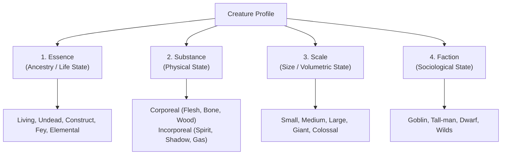
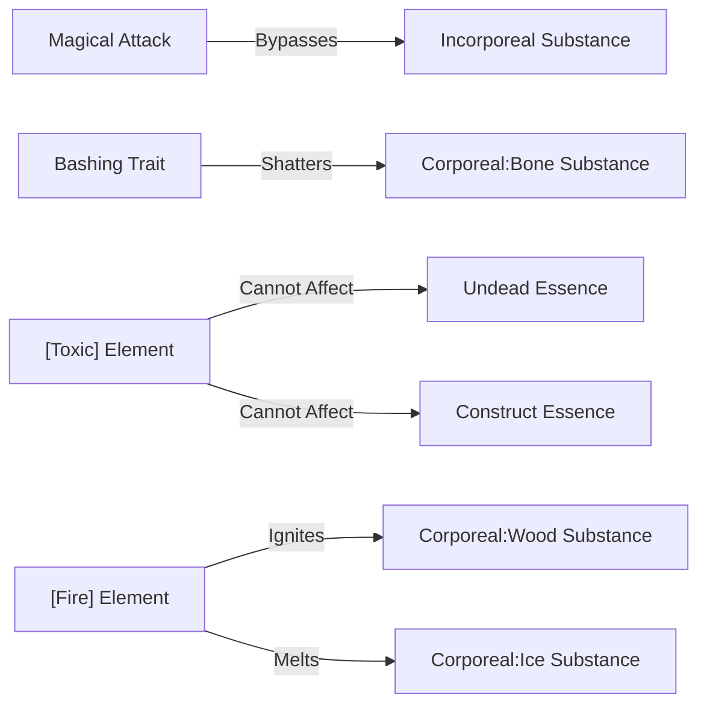

# Brainstorm: Ontology, Taxonomy & Faceted Classification in Gobbos

*Library science has spent centuries figuring out how to classify the universe. We can use that exact same knowledge to structure our chaotic little goblins, dwarf fortresses, and trash piles. By building a conscious, faceted ontology, we can create incredibly rich rules that resolve at the table in seconds.*

This document explores how we can apply principles of **Ontology Engineering**, **Thesaurus Design (BT/NT)**, and **Faceted Classification** to the rules of Gobbos. The goal is to build a classification system that allows deep tactical complexity (e.g., separating corporeal from incorporeal undead, or piercing from blunt weapon damage) without bogging down the GM with a complex hierarchical tree.

---

## 1. Faceted Classification (The Core Architecture)

In traditional taxonomy (like the Linnaean biological tree), every entity must fit into a single rigid hierarchy. A creature is a *Beast*, or an *Undead*, or a *Construct*.

In **Faceted Classification**, we describe entities along multiple orthogonal axes (facets). Each facet represents a distinct property of the entity. For Gobbos, we can define **Four Core Facets** for every creature:

### Why Faceted Classification is superior for TTRPGs:
Instead of trying to design a custom ruleset for a "Ghostly Beast," we simply give it the facets:
`Essence: Beast, Undead` | `Substance: Incorporeal` | `Scale: Medium`

*   A holy spell affecting `Undead` works on it.
*   A hunter's trap affecting `Beast` works on it.
*   A physical net cannot grab it because it is `Incorporeal`.
This gives the GM instant, emergent rules resolution without having to look up a custom "Ghost-Beast" monster page.

---

## 2. Thesaurus Design: Broader & Narrower Terms (Hierarchy)

To drill down into specific subtypes (e.g., dividing `Undead` into `Spirit` and `Corporeal`, or `Weapon Traits` into types of physical impact), we can use the library science concepts of **Broader Terms (BT)** and **Narrower Terms (NT)**.

Instead of writing complex nested inheritance rules, we establish a simple **sub-tagging vocabulary** using a colon separator (`Broader:Narrower`):

### Ancestry Sub-Tagging:
*   `Undead:Spirit` (Ghosts, Wraiths, Spectres)
*   `Undead:Rotter` (Zombies, Ghouls, Vampires)
*   `Undead:Bone` (Skeletons, Liches)

### Substance Sub-Tagging:
*   `Corporeal:Flesh` (Zombies, Humans, Beasts)
*   `Corporeal:Bone` (Skeletons)
*   `Corporeal:Metal` (Iron Golems, Armored Knights)

### How this resolves at the table (The Inheritance Rule):
Rules can target either the **Broader Term** or the **Narrower Term**:
*   *A Holy Spell:* "Deals +2d damage to `Undead`." (Affects `Undead:Spirit`, `Undead:Rotter`, and `Undead:Bone`).
*   *A Rusty Mace:* "`Bashing` trait bypasses defense of `Corporeal:Bone` enemies." (Affects Skeletons, but not Ghosts or Zombies).
*   *Poison Gas:* "`[Toxic]` tags have no effect on `Undead` or `Construct`." (Automatically protects all subtypes).

---

## 3. Ontological Relationship Mapping (The Rule Web)

An **Ontology** is a graph of concepts and the relationships between them. In Gobbos, we can define static **Ontological Axioms** that govern how different facets and tags interact. This moves rules out of individual statblocks and into a single master sheet.

### Concept: The Interaction Web

### Examples of Master Rules:
*   `immune_to(Undead, [Toxic])`
*   `immune_to(Incorporeal, Physical_Grapple)`
*   `vulnerable_to(Corporeal:Bone, Bashing)`
*   `vulnerable_to(Corporeal:Wood, [Fire])`

If a player crafts a mace (Trait: `Bashing`) and swings it at a skeleton (Substance: `Corporeal:Bone`), the interaction is already written in the ontology: **Bashing shatters Bone**. No rules text is needed on the skeleton's statblock.

---

## 4. The Resolution Principle: Pre-Roll Profile Calculation

>> **The Gobbos Design Core:** In Gobbos, there are **no post-roll modifications**. When the dice hit the table, the result must be instantly clear. All tag interactions, attributes, and environmental variables must modify the **Roll Profile** (the target's **Defence TN** or the test's **Difficulty**) *before* the player throws the dice.

To prevent the pre-roll phase from turning into an endless lookup spiral, we restrict calculations to three simple, sequential questions that the player and GM check:

### Question 1: What is the target's base Defence TN & Difficulty?
Start with the enemy's static statblock values:
*   *Example:* Golem has **Defence 3** (requires 3 successes). The attack is a standard melee attack (**Normal Difficulty**: success on 5+).

### Question 2: Does the Weapon Trait or Element interact with the target's Substance/Ancestry?
The player cross-references their weapon traits/elements with the target's facets. To keep this fast:
1.  **Weapon Trait vs. Substance:** (e.g., `Cutting` vs. `Corporeal:Metal` $\rightarrow$ blunted, shifts Difficulty to **Hard [6+]**; but the sword is `[Heavy]`, which negates this penalty).
2.  **Elemental Tag vs. Ancestry/Substance:** (e.g., `[Angelic]` magic vs. `Undead:Bone` $\rightarrow$ burns bone, reduces **Defence TN by 1**).
*   *Resulting Roll Profile:* Defence TN is now **2** (requires 2 successes), at **Normal Difficulty** (5+).

### Question 3: Does the Environment apply a Boon or Bane?
Apply the **Boon/Bane Stacking Cap** to handle all local zone elements (wind, mud, magic zones) in one step:
*   **The Boon/Bane Cap:** Multiple Boons (+1d) or Banes (-1d) from environmental and tactical sources do not stack. You either have one Boon, one Bane, or they cancel to zero.
*   *Example:* The zone is `[Sticky]` (mud) and there is `[Strong Wind]`. Since it's a melee attack, wind is ignored. The mud applies a **Bane (-1d)** to the attack pool.
*   *Final Roll Profile:* Player rolls their melee pool **minus 1 die**, needing **2 successes** at **Normal (5+) Difficulty**.

When the player rolls, they look only for 5s and 6s. If they get at least 2 successes, the golem is instantly shattered. No math is done after the dice land.

---

## 5. Avoiding Overcomplication: The 3-Rule Rule

While ontologies are incredibly powerful, we must not let them turn the game into a spreadsheet. To prevent "overcomplicating stuff" at the table, we should apply **The 3-Rule Rule** for GM cognitive limits:

1.  **Limit depth to 2 tiers:** A tag should never be nested deeper than `Broader:Narrower` (e.g. `Undead:Bone` is fine. `Undead:Bone:Skeleton:Skeletal_Archer` is too deep).
2.  **Statblocks only print local identifiers:** A skeleton's statblock should just say:
    `Ancestry: Undead:Bone | Substance: Corporeal`
    It should **never** print the rules for what those tags mean. Those are universal and memorized or looked up on a GM screen.
3.  **Default to natural language:** Sub-tags should use clear, punchy names (like `Rotter` instead of `Putrefied_Biological_Necrotic`).

---

## Actionable Integration Plan

If we integrate this ontology into Gobbos, our upcoming **`08_Tags_and_Synthesis.md`** file should be renamed or structured as a **`08_Vocabulary_and_Ontology.md`** file. 

This file will define:
1.  **The Four Facets:** The categories for classifying creatures and gear.
2.  **The Sub-Tag Vocabulary:** The controlled vocabulary of narrower terms (e.g., `Undead:Spirit`, `Corporeal:Metal`).
3.  **The Symmetrical Interaction Matrix:** A simple table showing how elements, weapon traits, and substances interact (e.g., how `Bashing` interacts with `Bone` or `Metal`, how `[Fire]` interacts with `Wood` or `Ice`).
