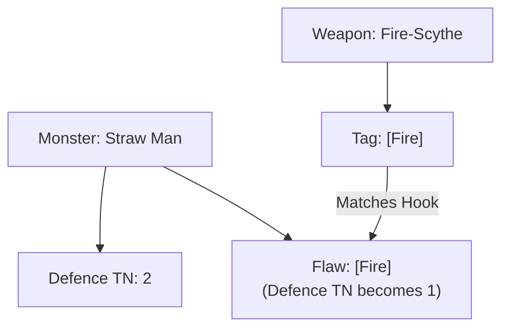

# Analysis: TTRPG Tag Systems & Gobbos Application

*Goblins don't read design manuals, but we must. To build a system that is both easy to run at the table and easy to expand in future books, we must look at how the industry has tackled this exact problem.*

This document analyzes how other TTRPG systems (Pathfinder 2e, Fate, Powered by the Apocalypse, and OSR games like *Into the Odd* and *Mausritter*) handle tags, keywords, and vulnerabilities, and how we can apply these lessons to Gobbos.

---

## 1. How Other Games Handle This

### System A: Pathfinder 2e (Strict Keywords & Traits)
*   **The Philosophy:** Object-oriented simulation. Every creature, spell, and weapon has a long list of rigid "Traits" (e.g., `Fire`, `Incorporeal`, `Construct`)[1][10].
*   **How Vulnerability Works:** Explicitly printed on the creature sheet (e.g., `Weakness: Fire 5`)[3][12]. 
*   **The "Fey" Expansion Problem:** High coupling. If PF2e adds a new trait, they must update how all existing mechanics interact with it, or define it so precisely that it fits into their massive global ontology framework.

### System B: Powered by the Apocalypse / Fate (Narrative Aspect Tags)
*   **The Philosophy:** Fiction-first narrative permission[6][19].
*   **How Vulnerability Works:** Tags are descriptive hooks (e.g., `{Flammable}`, `{Spooky}`). They do not have strict math attached. Instead, they provide *narrative permission*[9][6] (e.g., you can set a `{Flammable}` troll on fire, and fire might be the only way to stop its regeneration).
*   **The "Fey" Expansion Problem:** Zero coupling. If you add Fey later, you just write aspects/tags like `{Fey}` or `{Glamour}`. The GM and players negotiate what that means in the fiction during play.

### System C: OSR - Into the Odd / Mausritter (Descriptive Trait Hooks)
*   **The Philosophy:** Rulings-over-rules. Tags act as design shorthand.
*   **How Vulnerability Works:** The "Rule of Three" for creatures:
    1.  *Role:* `{Ambusher}`
    2.  *Threat:* `{Venom}`
    3.  *Flaw:* `{Brittle}` (shattered by blunt weapons) or `{Flammable}` (explodes with fire).
*   **The "Fey" Expansion Problem:** Low coupling. If you add Fey later, you just give them existing tags (like `{Ethereal}` or `{Fragile}`) or a specific flaw (e.g., `{Allergy: Iron}`).

---

## 2. The Solution for Gobbos: "Tag Hooks" (Decoupled Flaws)

To avoid both the **infinite pre-roll lookup spiral** and the **retrofitting problem** when adding new categories like `Fey`, Gobbos should use a **Tag Hook** system (adapted from OSR and PbtA).

Instead of a massive global ontology mapping elements to substances, **we write vulnerabilities directly on the monster cards as local "Flaws" using our standard tag vocabulary.**

### How this solves the Golem / Lookup Spiral:
The GM doesn't look up a global sheet to see how `[Fire]`, `[Angelic]`, `[Heavy]`, and `[Sticky]` interact with the Golem. They look *only* at the Golem's card:

> **Armored Bone Golem**
> *   **Defence TN:** 3 (Normal)
> *   **Flaws:** 
>     *   `Bashing` $\rightarrow$ Defence TN becomes 2.
>     *   `[Angelic]` $\rightarrow$ Attack is Easy (success on 4+).
> *   **Resistances:** 
>     *   `[Toxic]` $\rightarrow$ Immune.
>     *   `Cutting` $\rightarrow$ Attack is Hard (success on 6 only).

*   *The Resolution:* The player says, "I attack with a Heavy sword with Fire and Angelic magic."
*   *The GM looks at the Golem's card:*
    *   Do they have `Cutting`? Yes, but `[Heavy]` negates it. (Normal difficulty: 5+).
    *   Do they have `[Angelic]`? Yes. Difficulty shifts to **Easy (4+)**.
    *   Do they have `[Fire]`? No interaction listed. Fire behaves normally.
    *   Do they have `Bashing`? No. TN remains **3**.
*   *The Roll:* The player rolls, needing 3 successes on Easy (4+). Done. No global lookup.

---

### How this solves the "Fey Expansion" Problem:

When we create a new category (like `Fey` in a future book):
1.  **We do not need to update any old tags.**
2.  **We do not need to update any old monsters.**
3.  The new Fey creatures simply use our existing tag vocabulary to define their local flaws:
    *   *Pixie Boss:* `Flaw: [Iron] (Defence TN is 1)`.
    *   *The Player:* Wields a rusty knife with the `[Iron]` tag (or material property).
    *   *Interaction:* The player hits, sees the flaw hook matches, and resolves at TN 1.

---

## 3. Creative Recommendation for Gobbos

We should formalize the **Creature Flaw Hook** structure:

1.  **Tags are shorthand vocabulary:** We define what `[Fire]`, `[Angelic]`, `[Toxic]`, `[Iron]`, and `Bashing` mean in general terms (e.g., `[Fire]` sets dry things alight, `[Toxic]` is poison).
2.  **Creatures define their interactions locally:** Every monster statblock has a **Flaws & Resistances** block. This block maps standard tags to direct changes in **Defence TN** or **Difficulty Step** (Easy/Normal/Hard).
3.  **Default to Zero Interaction:** If a tag isn't listed under a creature's Flaws or Resistances, it has no special mechanical modifier—it just deals standard damage.
