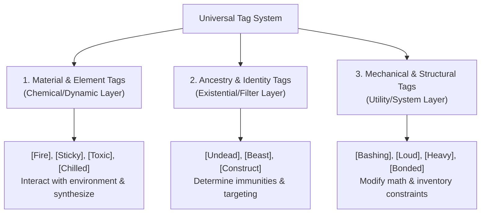

# Brainstorm: Tag Taxonomy & Semantic Analysis

*Goblins don't care about semantics; they care about what explodes. But if the rules lawyers don't build the foundation carefully, the whole game collapses when a player tries to tape an [Undead] tag to a bucket helmet and claims it makes them immune to dying.*

This document analyzes the semantic definition of **Tags** in Gobbos. As the game grows, "Tags" have become a catch-all term for very different mechanical concepts: elemental forces, creature categories, weapon forms, and item restrictions. To avoid lazy design, we must define a clear, conscious **Taxonomy of Tags** with distinct rules for how they function, combine, and interact with the environment.

---

## The Core Problem: The Catch-All Trait

Currently, a "Tag" can refer to:
1.  **An Element/Substance:** `[Fire]`, `[Sticky]`, `[Toxic]`.
2.  **An Ancestry:** `[Undead]`, `[Beast]`, `[Construct]`.
3.  **A Weapon Property:** `[Cutting]`, `[Bashing]`, `[Poking]`.
4.  **An Item Restriction:** `[Heavy]`, `[Loud]`, `[Bonded]`.

Lumping these together under the same rule-structure leads to logical breakdowns. For example, if **Element Synthesis** dictates that you can combine two tags during crafting:
*   `[Fire]` + `[Sticky]` = Burning Glue (Makes sense).
*   `[Fire]` + `[Undead]` = ...A burning zombie? A sword that deals fire damage to zombies? (The grammar breaks down because they belong to different semantic categories).

To solve this, we should categorize Tags into **Three Distinct Semantic Layers**, each with its own strict rules of behavior.

---

## The Three-Layer Tag Taxonomy

---

### Layer 1: Material & Element Tags (The Dynamic Layer)
*   **What they represent:** Physical substances, energies, or chemical/magical states.
*   **Examples:** `[Fire]`, `[Sticky]`, `[Chilled]`, `[Toxic]`, `[Acidic]`, `[Shock]`, `[Slick]`, `[Gaseous]`.
*   **Rule of Application:** These tags are highly fluid and can attach to almost any component of the game:
    *   **Attached to a Weapon:** Converts the weapon's damage type and automatically inflicts a mapped status condition on a hit (e.g., `[Toxic]` $\rightarrow$ *Weakened*).
    *   **Attached to a Zone:** Becomes an environmental hazard affecting anyone entering or ending their turn there (e.g., a `[Fire]` zone deals 1 Grit/Size damage).
    *   **Attached to a Creature:** Grants resistance/immunity to that element, or grants a passive aura.
*   **Interaction & Element Synthesis:** These are the **only** tags that participate in Element Synthesis. They combine logically (e.g., `[Fire]` + `[Sticky]` $\rightarrow$ Burning Glue, dealing fire damage and imposing *Restrained*).

---

### Layer 2: Ancestry & Identity Tags (The Filter Layer)
*   **What they represent:** The fundamental biological, mechanical, or spiritual category of a creature or object.
*   **Examples:** `[Undead]`, `[Beast]`, `[Construct]`, `[Human]`, `[Fey]`, `[Giant]`, `[Goblin]`.
*   **Rule of Application:** These tags are static and apply primarily to creatures (PCs, Mobs, and Enemies). They do not float freely onto zones or gear unless representing a material origin (e.g., a "Bone Shield" might have the `[Undead]` tag for targeting purposes).
    *   **Passive Attributes/Immunities:** Defines what the creature is immune to based on its nature. For example, `[Undead]` and `[Construct]` creatures are immune to psychological conditions (*Terrified*, *Dumb*) and biological status effects (*Sickened*, bleeding wounds).
    *   **Target Filters:** Used by spells, items, or traits to restrict who they can target or who they deal extra damage to (e.g., a `[Holy]` weapon deals +2d against `[Undead]`).
*   **Interaction & Element Synthesis:** They **do not** synthesize. You cannot mix `[Undead]` and `[Beast]` to create a new hybrid element; they are identity labels used for sorting.

---

### Layer 3: Mechanical & Structural Tags (The Utility Layer)
*   **What they represent:** Pure physical or mechanical design attributes of gear, weapons, armor, or structures.
*   **Examples:** `[Bashing]`, `[Cutting]`, `[Poking]`, `[Loud]`, `[Heavy]`, `[Fragile]`, `[Bonded]`.
*   **Rule of Application:** These tags apply strictly to items and weapons. They describe the physical construction and how it interacts with core rules math.
    *   **Combat Math Modifiers:** Directly alters target defenses or attack parameters (e.g., `[Bashing]` gives a player -1d on their Passive Defence roll; `[Cutting]` deals extra damage to unarmored targets).
    *   **System Constraints:** Interacts with inventory, noise, and equipping mechanics (e.g., `[Heavy]` requires two hands; `[Loud]` applies a Bane to Slink/Stealth checks).
*   **Interaction & Element Synthesis:** They **do not** synthesize. They are static traits that modify stats or actions. A `[Heavy]` hammer combined with a `[Loud]` shield does not create a new compound trait; they simply apply their individual rules.

---

## Standardizing the Tag Interactions

By separating tags into these three semantic categories, we prevent rules creep and make GM rulings incredibly simple:

1.  **If a player wants to synthesize elements (e.g., in crafting or magic):** They can only combine **Layer 1 (Element)** tags. They cannot combine Layer 2 or Layer 3 tags for synergy.
2.  **If a player attacks a creature:** The GM checks the creature's **Layer 2 (Ancestry)** tag to see if they are immune to any status conditions inflicted by the weapon's **Layer 1 (Element)** tag.
    *   *Example:* A goblin shoots a skeleton (`[Undead]`) with a poison dart (`[Toxic]`). The GM checks the tag rules: `[Toxic]` inflicts *Weakened*. Skeletons have `[Undead]`, which is immune to biological conditions. The poison has no effect.
3.  **If a player uses specialized gear:** They apply the static math modifiers dictated by the item's **Layer 3 (Mechanical)** tags.

---

## Actionable Design Proposal: A Unified Tag Directory

We should create a dedicated rules draft file: **`08_Tags_and_Synthesis.md`** under `01_STAGE_Drafts/00_Rules/`. 

This file will:
1.  Establish the three semantic layers (Material, Ancestry, Mechanical).
2.  Provide a **Master Glossary** defining every tag in the game, categorized by its layer.
3.  Define **Element Synthesis** combinations explicitly (e.g., `[Fire]` + `[Slick]` = `[Greasefire]`; `[Shock]` + `[Wet]` = `[Conduction]`), removing arbitrary GM interpretation.
