# Gobbos — Rules Master (PROD Core + STAGE Drafts)

> **Gobbos TTRPG Consolidated Knowledge Document**
> Comprehensive compilation of all locked PROD rules followed by active STAGE drafts.
> Generated on: 2026-08-24T19:38:43.356Z
> Total Chapters/Documents included: 42

---

## Table of Contents

1. [Rules / Dice](#doc-1) — `02_PROD_Core_Rules/00_Rules/01_Dice.md`
2. [Characters & Mobs / Stats](#doc-2) — `02_PROD_Core_Rules/01_Characters & Mobs/10_Stats.md`
3. [Core_Resolution](#doc-3) — `02_PROD_Core_Rules/01_Core_Resolution.md`
4. [Boss_Profile_and_Gang](#doc-4) — `02_PROD_Core_Rules/02_Boss_Profile_and_Gang.md`
5. [Action_Economy_and_Turn_Flow](#doc-5) — `02_PROD_Core_Rules/03_Action_Economy_and_Turn_Flow.md`
6. [Zones_and_Movement](#doc-6) — `02_PROD_Core_Rules/04_Zones_and_Movement.md`
7. [Combat_Engine](#doc-7) — `02_PROD_Core_Rules/05_Combat_Engine.md`
8. [Mob_Mechanics](#doc-8) — `02_PROD_Core_Rules/06_Mob_Mechanics.md`
9. [Damage_Grit_and_Wounds](#doc-9) — `02_PROD_Core_Rules/07_Damage_Grit_and_Wounds.md`
10. [Magic_and_Bangaranga](#doc-10) — `02_PROD_Core_Rules/08_Magic_and_Bangaranga.md`
11. [The_Raid_Loop](#doc-11) — `02_PROD_Core_Rules/09_The_Raid_Loop.md`
12. [The_Lair_Loop_and_Progression](#doc-12) — `02_PROD_Core_Rules/10_The_Lair_Loop_and_Progression.md`
13. [Journeys_and_Hazards](#doc-13) — `02_PROD_Core_Rules/11_Journeys_and_Hazards.md`
14. [Adversaries_and_Threats](#doc-14) — `02_PROD_Core_Rules/12_Adversaries_and_Threats.md`
15. [Rules / Overview](#doc-15) — `01_STAGE_Drafts/00_Rules/00_Overview.md`
16. [Rules / Dice](#doc-16) — `01_STAGE_Drafts/00_Rules/01_Dice.md`
17. [Rules / Combat](#doc-17) — `01_STAGE_Drafts/00_Rules/02 Combat.md`
18. [Rules / Movement & Zones](#doc-18) — `01_STAGE_Drafts/00_Rules/03_Movement & Zones.md`
19. [Rules / Giving orders](#doc-19) — `01_STAGE_Drafts/00_Rules/04_Giving orders.md`
20. [Rules / Raid points](#doc-20) — `01_STAGE_Drafts/00_Rules/05_Raid points.md`
21. [Rules / Keywords Index](#doc-21) — `01_STAGE_Drafts/00_Rules/06_Keywords Index.md`
22. [Rules / Wounds_Conditions](#doc-22) — `01_STAGE_Drafts/00_Rules/07_Wounds_Conditions.md`
23. [Rules / Master_Tag_Index](#doc-23) — `01_STAGE_Drafts/00_Rules/08_Master_Tag_Index.md`
24. [Characters & Mobs / Stats](#doc-24) — `01_STAGE_Drafts/01_Characters & Mobs/10_Stats.md`
25. [Characters & Mobs / Character Creation](#doc-25) — `01_STAGE_Drafts/01_Characters & Mobs/11_Character Creation.md`
26. [Characters & Mobs / 11a_Roles](#doc-26) — `01_STAGE_Drafts/01_Characters & Mobs/11a_Roles.md`
27. [Characters & Mobs / Gang](#doc-27) — `01_STAGE_Drafts/01_Characters & Mobs/12_Gang.md`
28. [Characters & Mobs / Boons_and_Banes](#doc-28) — `01_STAGE_Drafts/01_Characters & Mobs/13_Boons_and_Banes.md`
29. [Characters & Mobs / Goblin_mob](#doc-29) — `01_STAGE_Drafts/01_Characters & Mobs/13_Goblin_mob.md`
30. [Characters & Mobs / Quirks](#doc-30) — `01_STAGE_Drafts/01_Characters & Mobs/14_Quirks.md`
31. [Characters & Mobs / Level_Up and death](#doc-31) — `01_STAGE_Drafts/01_Characters & Mobs/15_Level_Up and death.md`
32. [Characters & Mobs / Unified_Modular_Powers_System](#doc-32) — `01_STAGE_Drafts/01_Characters & Mobs/16_Unified_Modular_Powers_System.md`
33. [Loot / loot](#doc-33) — `01_STAGE_Drafts/03_Loot/31_loot.md`
34. [Loot / Carry Stuff](#doc-34) — `01_STAGE_Drafts/03_Loot/32_Carry Stuff.md`
35. [Loot / Equipment](#doc-35) — `01_STAGE_Drafts/03_Loot/33_Equipment.md`
36. [Loot / Crafting](#doc-36) — `01_STAGE_Drafts/03_Loot/34_Crafting.md`
37. [Loot / Equipment_Catalogue](#doc-37) — `01_STAGE_Drafts/03_Loot/35_Equipment_Catalogue.md`
38. [Enemies / Enemies](#doc-38) — `01_STAGE_Drafts/04_Enemies/20_Enemies.md`
39. [Enemies / Bestiary](#doc-39) — `01_STAGE_Drafts/04_Enemies/21_Bestiary.md`
40. [Base / Lair_Rules](#doc-40) — `01_STAGE_Drafts/05_Base/00_Lair_Rules.md`
41. [Travel / Journey_Rules](#doc-41) — `01_STAGE_Drafts/07_Travel/00_Journey_Rules.md`
42. [Magic / Magic_Rules](#doc-42) — `01_STAGE_Drafts/08_Magic/00_Magic_Rules.md`

---

<a id="doc-1"></a>
<!-- ============================================================ -->
<!-- DOCUMENT 1: 02_PROD_Core_Rules/00_Rules/01_Dice.md -->
<!-- ============================================================ -->
# Rules — Dice
*Source: `02_PROD_Core_Rules/00_Rules/01_Dice.md`*

# Dice

Rolling dice is fun, and in Gobbos you roll a lot of dice if you are a player. The GM on the other hand never rolls dice, unless to possibly determine the outcome of a random event.

The only dice used in Gobbos are normal 6-sided dice, or d6. It is recommended that each player have bunch of them, preferably 8-10 dice in the same color.

## Tests

A [[Test]] in Gobbos is carried out by the player rolling a number of **d6s** (their [[Dice Pool]]). They then try to score as many [[Success|Successes]] as the GM has decided is the target for the [[Test]].

### Difficulty and Target Number

For any [[Test]], the GM sets a [[Difficulty]] and a [[Target Number (TN)]]. [[Difficulty]] depends on the circumstances, such as having the high ground when attacking or using quality lockpicks to pick a lock. [[Difficulty]] determines what counts as a [[Success]]. For an [[Easy]] roll, a **4, 5, or 6** is a [[Success]]. For a [[Normal]] roll, a **5 or 6** is a [[Success]]. For a [[Hard]] roll, only **6s** are a [[Success]].

[[Target Number (TN)]] is typically fixed, such as how good armor an enemy has or the quality of the lock that is about to be picked. [[TN]] then denotes how many [[Success|Successes]] you need to make whatever you are trying to do.

Most of the time, you will roll a [[Normal]] test with a [[TN]] of 1, denoted as **5+/1**. This means that whatever number of dice you have in your [[Dice Pool]], you succeed if there is at least one **5** or **6**.

| Difficulty | Success on |
| :--- | :--- |
| [[Easy]] | 4, 5, 6 |
| [[Normal]] | 5, 6 |
| [[Hard]] | 6 |

> **Example:** Picking a lock is typically a [Slink](../01_Characters & Mobs/10_Stats.md#slink) **5+/1** test. But if the lock is of extra good quality, it could be a **5+/2** test. And if the lockpicker has brought quality lockpicks, it could turn into an **4+/2** test.

### Dice Pool

The player is responsible for assembling their [[Dice Pool]]. If they carry out the task with their [[Boss]], it is almost always equal to their main stat, modified by equipment, [[Quirk|Quirks]], or other circumstances. So, if you have a [[Tough]] stat of 2, you roll 2 dice, or **2d6**.

If rolling for a [[Mob]] instead, the base number of dice in your [[Dice Pool]] is equal to the [[Size]] of the [[Mob]]. A [[Size]] 2 [[Mob]] rolls **2d6**, a [[Size]] 5 [[Mob]] rolls **5d6**, etc.

### Exploding Dice

Every time you roll a **6**, it is not only a [[Success]] but it allows you to roll an additional die. If that roll is a **6** again, you keep rolling until you no longer roll **6s**. This makes it possible, but still perhaps unlikely, to get a lot of [[Success|Successes]] on a single roll. If you have enough dice, it is recommended to grab a new dice instead of rerolling the 6 to make it easier to see the total number of successes.

### Criticals

Whenever you roll a **6** that explodes, and the new die you roll also turns into a **6**, you have achieved a [[Critical Success]]! This impressive feat allows you to regain 1 [[Grunt]] (up to your maximum) and also grants you a surge of adrenaline, allowing you to immediately perform an additional non-offensive action (a [[Move]], [[Plunder]], or [[Manipulate]] action).

*(Note: Grunt is fully explained in the [Character Stats rules](../01_Characters & Mobs/10_Stats.md#grunt)).*

### 1s and Fumbles

Sometimes, luck is just a bad joke waiting for a punchline. When you roll a [[Test]] and fail to accumulate enough [[Success|Successes]] (your [[Success|Successes]] are less than the [[Target Number (TN)]]), but you have one or more dice showing **1s**, you can choose to push your luck and re-roll all of those **1s**. 

* **The Blessing:** If the re-rolled dice generate enough [[Success|Successes]] to meet or exceed the [[Test|Test's]] [[TN]], the [[Test]] succeeds normally. 
* **The Fumble:** If the [[Test]] still fails after re-rolling the **1s**, you have [[Fumbled]]! The effort backfires catastrophically, and you lose 1 [[Grunt]].
* **Accepting Failure:** If you choose not to re-roll the **1s** (or if you failed the [[Test]] but rolled no **1s** at all), the action simply fails normally. You do not lose 1 [[Grunt]] or trigger any Fumble effects.

## The Bangaranga Pool

Goblins are easily carried away by their own rowdy excitement. When the crowd gets hyped by awesome stunts, hilarious disasters, or massive payouts, their collective noise and rowdiness builds up. This is represented by a shared pool of dice called the [[Bangaranga Pool]]. These should be of a distinct color from the other dice, e.g. bright red.

### Seeding the Pool (Start of Raid)

At the start of a [[Raid]], the [[Bangaranga Pool]] is seeded with a baseline level of chaotic energy based on the size and composition of the raiding party:

| Number of Gobbos | Dice to Add |
| :--- | :--- |
| Number of [[Boss|Bosses]] | **1d** per [[Boss]] |
| Number of [[Mob|Mobs]] ([[Size]] 3 or 4) | **1d** per [[Mob]] |
| Number of [[Mob|Mobs]] ([[Size]] 5) | **2d** per [[Mob]] |

> **Example:** A 3-player raid party has one [[Size]] 3 [[Mob]], one [[Size]] 4 [[Mob]], and one [[Size]] 2 [[Mob]]. The starting [[Bangaranga Pool]] is **5d** (3 baseline + 1 + 1 + 0).

### Loading the Pool (Hype Triggers)

Dice are added to the physical [[Bangaranga Pool]] during a [[Raid]] when notable events hype up the horde:

| Event | Description | Dice to Add |
| :--- | :--- | :--- |
| [[Critical Success|Critical Successes]] | Any player rolls a [[Critical Success]] | **+1d6** |
| [[Fumbles]] | Any player [[Fumbles]] a test | **+1d6** |
| Defeating a Notable Enemy | Defeating an enemy with the `[Notable]` or `[Big Threat]` tag | **+1d6** |
| Claiming a Big Loot Cache | Looting a chest, room, or zone with the `[Big Loot]` or `[Hoard]` tag | **+1d6** |

### Tapping the Pool & The Bangaranga Tax

Before rolling any test, a player can choose to take a number of dice from the [[Bangaranga Pool]] (up to a maximum equal to their Boss's [[Grunt]] stat) and add them to their current test's [[Dice Pool]].

However, using the crowd's energy for mundane tasks is considered "cheating" and costs a premium:

| Condition | Consequence |
| :--- | :--- |
| If the number of Bangaranga dice taken is **less than or equal to the Target Number (TN)** of the test | It costs nothing extra. |
| If the number of Bangaranga dice taken is **greater than the test's TN** | It costs **1 extra die** from the pool as a tax. This tax die is simply removed from the pool and discarded back to the box (not rolled). |
| If the pool does not contain enough dice to cover both the dice rolled and the tax die | The player cannot take that many dice. |

> **Example (5+/2 Test):**
> *   If you take **1 or 2 Bangaranga dice**, it costs no tax. You simply take them from the pool and roll them.
> *   If you want to take 3 [[Bangaranga dice]], 3 is greater than the TN of 2. You must pay a **1 die tax**. This requires a total of **4 dice** to be present in the pool. 3 dice are rolled, 1 die is discarded.

### Rolling Bangaranga Dice - Double Explosion!

Every **6** rolled on a Bangaranga Die counts as 1 [[Success]], but it **explodes twice**, meaning you immediately roll *two* additional regular dice instead of one, which can themselves succeed or explode normally!

### Overreaching

If your [[Test]] fails when you use [[Bangaranga Dice]], you lose 1 [[Grunt]]. Because a failed [[Bangaranga]] roll already carries this penalty, you have nothing to lose by re-rolling any **1s** in a desperate bid for [[Success]]!

However, using the horde's noise carries a high risk of exhausting their hype. If you fail the [[Test]] when using [[Bangaranga Dice]] (either by choosing not to re-roll **1s**, or by re-rolling them and still failing), and your final roll contains any **1s** (including those rolled on the re-roll), you immediately drain the [[Bangaranga Pool]], removing a number of [[Bangaranga Dice]] from the pool equal to the number of [[Bangaranga Dice]] you took for the [[Test]].

---

<a id="doc-2"></a>
<!-- ============================================================ -->
<!-- DOCUMENT 2: 02_PROD_Core_Rules/01_Characters & Mobs/10_Stats.md -->
<!-- ============================================================ -->
# Characters & Mobs — Stats
*Source: `02_PROD_Core_Rules/01_Characters & Mobs/10_Stats.md`*

# Stats

Your Boss has four [[Main Stats]], a set of derived [[Secondary Stats]] tied to them, and [[Grunt]], which represents your authority and command energy. Your [[Main Stats]], as well as your maximum [[Grunt]], range from **Level 1** to **Level 5**. Level 1 is the starting value. Increasing a stat not only adds more dice to your [[Dice Pool]] for related tests, but it also provides mechanical upgrades to your Boss's capabilities.

---

## Tough (T)

Used for violence, resilience, intimidation, and lifting stuff. [[Tough]] is simply how strong in body the Boss is, and the most important stat for direct combat. Most attacks will use [[Tough]] as the basis for your [[Dice Pool]].

[[Tough]] has two [[secondary stats]]: [[Grit]] (your health) and [[Carry]] (how much equipment and loot you can carry).

| Level | Grit | Carry |
| :---: | :---: | :---: |
| **Level 1** | 3 | 6 |
| **Level 2** | 4 | 8 |
| **Level 3** | 4 | 10 |
| **Level 4** | 5 | 12 |
| **Level 5** | 5 | 14 |

### Grit

[[Grit]] is your health, which defines how many hits the Boss can take before he dies. When your [[Grit]] is 0, you are dying and probably dead very soon. A higher [[Tough]] score is vital to survive the [[Raid|Raids]], while a low [[Tough]] makes you rely on your Gobbos or stealth to survive.

### Carry

[[Carry]] defines how many units of [[Bulk]] you can carry. Both equipment and loot have a [[Bulk]] rating, and with a higher [[Tough]], you can both go well armed to the [[Raid]] as well as carry a lot of loot back. While a low [[Carry]] means hard priorities.

---

## Slink (S)

Used for sneaking, dodging, and all manners of dirty tricks. [[Slink]] is how agile, dexterous, and quick on your feet you are. A higher [[Slink]] allows for greater movement on the battle map, and a higher chance to dodge any incoming attack.

[[Slink]] has two [[secondary stats]]: [[Movement]] (how far you can move per action) and [[Passive Defence]] (which allows you to dodge attacks without spending actions, much like armor, but without the bulk).

| Level | Movement | Passive Defence |
| :---: | :---: | :---: |
| **Level 1** | 2 | 0 |
| **Level 2** | 3 | 0 |
| **Level 3** | 3 | **1d** |
| **Level 4** | 4 | **1d** |
| **Level 5** | 5 | **2d** |

### Movement

Your movement stat determines how many zones you can move per [[Move]] action. Higher stats allow for greater mobility on the battle map. A higher [[Slink]] makes you move faster over the battlefield, while a low score means you have to plan ahead a bit more.

### Passive Defence

[[Passive Defence]] gives you passive protection against enemy attacks. These dice roll alongside your armor dice in the colored mitigation pool of the [[Clatter Roll]], reducing incoming damage even if you have no saved actions to dodge!

---

## Mouth (M)

Used for shouting orders, bullying, lying, and just talking a lot and loud. It is how good you are at shouting orders, and a high [[Mouth]] score allows you both to control more [[Mob|Mobs]] as well as getting more out of your [[Mob|Mobs]] for free. A low [[Mouth]] score will make you rely more on your own skills, and less on your [[Mob|Mobs]].

[[Mouth]] has two [[secondary stats]]: [[Max Mobs]] (how many different mobs you can have under your control) and [[Free Orders]] (which allows you to do things with your mobs without spending standard actions).

| Level | Max Mobs | Free Orders per Round |
| :---: | :---: | :---: |
| **Level 1** | 1 | 1 |
| **Level 2** | 2 | 1 |
| **Level 3** | 2 | 2 |
| **Level 4** | 3 | 2 |
| **Level 5** | 3 | 3 |

### Max Mobs

This is the maximum number of different [[Mob|Mobs]] you can have under your control. If your [[Grunt]] is low, you might just kick around a few gobbs. But if you are seen as fanciest, meanest, smartest, sneakiest, bulkiest (Gobbos can admire many different aspects, as long as is much of it), you can soon command a legion of greenies.

### Free Orders per Round

A high [[Mouth]] score makes giving orders such a natural thing you can do it while you are doing other things. This means you can use a [[standard action]] for something else and still give an order to a mob, as long as you do not exceed your **[[Free Orders]] per Round**.

---

## Brains (B)

[[Brains]] is used for understanding and noticing things, crafting, and magic. [[Brains]] is simply how good you are at understanding the complexity of Gobbo magic and Gobbo crafting, but it is also used for awareness and understanding of the world. A high [[Brains]] score allows you to use magic in [[Raid|Raids]], but also better arm yourselves or your gang between [[Raid|Raids]]. While a low score instead makes you trust your or your [[Mob|Mobs']] physical abilities instead.

[[Brains]] has two [[secondary stats]]: [[Power Words]] (your capacity to hold volatile magical formulas/spell tags in your head) and [[Crafting Capacity]] (which controls how many [[oddities]] you can attach to any single item).

| Level | Power Words | Crafting Capacity |
| :---: | :---: | :---: |
| **Level 1** | 0 | 1 |
| **Level 2** | 0 | 2 |
| **Level 3** | 2 | 3 |
| **Level 4** | 4 | 4 |
| **Level 5** | 6 | 5 |

### Power Words

Gobbo magic is short, loud, and volatile. It is more words and complex spells, but a Gobbo brain is still not that big, and can only hold so much. With a higher score you can start using [[Power Words]] to your advantage, remembering even more as your [[Brains]] score increases. It is only when you reach the base level of 3 that you can even attempt to use them.

### Crafting Capacity

Crafting is an excellent way to get more out of your loot, and to create weapons, contraptions, and potions. Equipment is one of the most important tools to add more dice to your [[Dice Pool]]. A low score means you can craft more simple things, while a high score allows you to craft more complex and powerful items.

---

## Grunt

Your authority and energy. Gobbos respect a Boss that is strong, sneaky, loud, or seems smart. They can respect many qualities as long as it is a lot of it. [[Grunt]] is equal to your second highest Main Stat. So if you have [[Tough]] 2, [[Slink]] 4, [[Mouth]] 2, [[Brains]] 2, your [[Grunt]] is 2. If you have [[Tough]] 2, [[Slink]] 4, [[Mouth]] 5, [[Brains]] 2, your [[Grunt]] is 4.

Your [[Grunt]] determines the maximum [[Size]] of a [[Mob]] you can command (e.g., [[Grunt]] 3 means you can command a maximum [[Size]] 3 [[Mob]]). [[Grunt]] also limits how many [[Bangaranga Dice]] you can use.

Unlike the other [[Main Stats]], [[Grunt]] has a maximum value as well as a current value, as you can both lose and gain [[Grunt]] during a [[Raid]].

### Losing and Gaining Grunt

If you [[Fumbled]] when performing a test, or simply fail when using [[Bangaranga Dice]], you lose one [[Grunt]]. However, if you score a [[Critical]] result on the test, you gain one [[Grunt]].

### Rebellion

If you are trying to control a [[Mob]] that is now bigger than your [[Grunt]] allows, you must pass a [[Mouth]] or [[Tough]] test (your choice) against a target of **5+** with the required successes (TN) equal to the [[Mob|Mob's]] [[Size]] (denoted as **5+/Size**). If you fail the test, the [[Mob]] realizes you are weak and will rebel, becoming [[Uncontrolled]]!

### Defeating Enemies

You can gain [[Grunt]]. The most common way is to defeat an enemy yourself. Each defeated enemy when in the same or adjacent zone automatically gains you one [[Grunt]], up to your maximum.

### Asserting Dominance

But in a dire situation you can also simply kill some of your own goblins to reassert dominance. Make an undefended attack against a [[Mob]] under your control that you can attack. If you do damage, increase your [[Grunt]] by 1. If you however fail to deal out any damage, you are indeed weak and lose another [[Grunt]]!

### Showing Off

If you roll a [Critical Success](../00_Rules/01_Dice.md#criticals) on a test, your Gobbos are impressed and you gain 1 [[Grunt]] (up to your maximum) and a bonus action as detailed in the dice rules.

---

## Abilities

### Quirks

[[Quirk|Quirks]] are what make your Gobbo unique from any other Gobbos, giving you an edge in specific circumstances. Typically you can gain [[Quirk|Quirks]] as you play, but you also get some [[Quirk|Quirks]] when you start, depending on the level you start at.

---

<a id="doc-3"></a>
<!-- ============================================================ -->
<!-- DOCUMENT 3: 02_PROD_Core_Rules/01_Core_Resolution.md -->
<!-- ============================================================ -->
# Core_Resolution
*Source: `02_PROD_Core_Rules/01_Core_Resolution.md`*

# Core Resolution & Dice Pool Engine

*Goblins do not rely on disciplined training, ancient martial manuals, or measured arithmetic. When a goblin Boss leaps into the fray, success is a messy collision of muscle, blind panic, screeching mobs, and sheer explosive momentum.*

This chapter defines the core resolution engine for **Gobbos**. All dice tests, difficulty structures, pool modifications, and chaotic risk mechanics operate under the rules codified below.

---

## The D6 Pool Framework

The resolution system in **Gobbos** uses standard six-sided dice (**d6**) exclusively. 

### The GM Never Rolls
All mechanical resolution is player-facing. **The Game Master (GM)** never rolls dice for standard tests, attacks, evasion, or environmental hazard checks. Enemies, traps, and the environment present static target thresholds that **Players** roll against using their active pools or passive defense ratings.

### Assembling the Dice Pool
When you attempt an action that carries a risk of failure or meaningful consequence, you assemble a **Dice Pool** of standard **d6s**:

**Dice Pool** = **Base Stat / Mob Size** + **Boons (+1d)** - **Banes (-1d)** + **Bangaranga Dice**

*   **Goblin Boss Tests**: Your base pool equals your current rating in the relevant **Main Stat** (**Tough**, **Slink**, **Brains**, or **Mouth**), which ranges from 1 to 5 dice.
*   **Mob Tests**: When rolling for a **Mob**, the base pool equals the Mob's current **Size** (1 to 5) for **Tough** tests, or a flat **2d6** for **Slink**, **Brains**, and **Mouth** tests (see [Mob Mechanics](06_Mob_Mechanics.md)).
*   **Pool Minimum**: A dice pool cannot be reduced below 0 dice. If penalties reduce a pool to 0 or fewer dice, you must make a desperate **Salvage Roll** (see below).

---

## Difficulty & Target Numbers

Every test is defined by two values: a **Difficulty Face** (which die faces count as a success) and a **Target Number (TN)** (how many total successes you must accumulate to succeed).

### Difficulty Thresholds (Target Faces)
The circumstances of an action dictate which die faces generate a **Success**:

| Difficulty | Successful Die Faces | Description |
| :--- | :---: | :--- |
| **Easy (4+)** | **4, 5, 6** | Favorable conditions, superior tools, high ground, or vulnerable targets. |
| **Normal (5+)** | **5, 6** | Standard baseline for all routine challenges, attacks, and environmental checks. |
| **Hard (6)** | **6** | Extremely hostile conditions, heavy armor, narrow margins, or severe handicaps. |

>> **IMPORTANT:** The numeral **6** represents the absolute ceiling on a standard d6. In accordance with official system notation, **Hard** difficulty is written strictly as **6** (never write `6+`).

### Target Number (TN)
The **Target Number (TN)** is the total count of successes required to pass the test. Standard actions require a **TN of 1**. Complex tasks, fortified adversaries, thick locks, or hazardous obstacles demand a **TN of 2** or higher.

### Standard Slash Notation
To eliminate math bloat during play, all checks use the standard slash notation:

`[Stat] [Target Face]+/[Required Successes]`

*   **In Narrative Text**: *“You must pass a Slink test, needing at least 2 successes on a 5 or higher.”*
*   **In System Paragraphs**: *“Climbing the slick wall requires a Slink test against the zone profile of 5+ (2 successes).”*
*   **In Statblocks & Profiles**: `Slink 5+/2`, `Tough 4+/1`, `Brains 6/2`.

> **Example:** Picking a sturdy lock requires `Brains 5+/2`. A **Goblin Boss** with **Brains 3** rolls 3d6. The dice land on **1**, **5**, and **6**. Because the test is **Normal (5+)**, both the **5** and the **6** count as successes. With 2 successes scored against a **TN of 2**, the lock clicks open.

---

## Exploding 6s & Critical Successes

Goblins thrive on escalating chaos. Every die that rolls a natural **6** generates an extra burst of effort.

### Exploding 6s
Every natural **6** rolled on any die in your pool counts as **1 Success** and immediately grants **+1 bonus d6** rolled into the active pool. 
*   If the newly rolled bonus die also lands on a **6**, it counts as another success and explodes again.
*   This explosion chains indefinitely as long as additional natural **6s** are rolled.
*   To keep pool tallies clear, set aside the original 6s and roll fresh dice for the explosions rather than rerolling the original physical dice.

### Critical Success (Double Explosions)
A **Critical Success** occurs whenever an exploding natural **6** generates a bonus die that also lands on a natural **6** (a consecutive double-six chain).

When you achieve a **Critical Success**, you immediately receive two mechanical rewards:
1.  **Grunt Surge**: Your **Goblin Boss** immediately regains **+1 Grunt** (up to your maximum **Grunt** rating).
2.  **Adrenaline Burst**: You immediately gain **1 Free Action** (which must be a non-offensive **Move**, **Plunder**, or **Manipulate** action; see [Action Economy & Turn Flow](03_Action_Economy_and_Turn_Flow.md)).

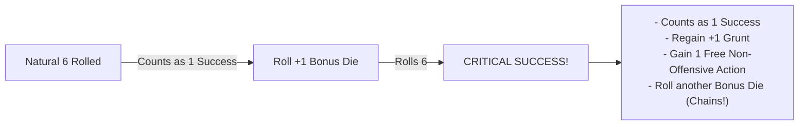

[MISSING RULE / GAP: Bangaranga Multi-Explosion Critical Cascade Definition — When rolling Bangaranga Dice, a natural 6 explodes into two regular dice simultaneously. The rules must define whether a 6 rolled on either bonus die triggers a Critical Success. Suggested Resolution: Any bonus die generated from an exploding die that rolls a 6 is treated as a Critical Success, granting +1 Grunt and a free non-offensive action. However, a single test action can grant a maximum of +1 Grunt and 1 bonus Free Action regardless of how many individual double-six chains occur in that single pool throw.]

---

## Zero Dice Pools & The Salvage Roll

When extreme Banes, encumbrance penalties, or debilitating conditions reduce your active dice pool to **0d6 or fewer dice**, the action automatically fails by default. However, a goblin always makes one last desperate attempt.

### The Salvage Roll
When forced to test with a pool of **0d6 or fewer**, you roll exactly **1d6** as a **Salvage Roll**:

| Die Face | Result | Mechanical Outcome |
| :---: | :--- | :--- |
| **6** | **Miraculous Salvage** | Generates exactly **1 Success**. The die **does not explode**, and cannot trigger a Critical Success. |
| **1** | **Catastrophic Fumble** | The action fails catastrophically and triggers an immediate **Fumble**. If an allied **Mob** is present in your zone or an adjacent zone, you lose **1 Grunt**. |
| **2, 3, 4, 5** | **Clean Failure** | The action fails normally with no additional penalties or Grunt loss. |

---

## The Gobbo Gamble

When an initial roll fails, a goblin can push luck by doubling down on their worst dice.

### Declaring the Gamble
If your initial test fails to accumulate enough successes to meet the **Target Number (TN)**, but your roll contains one or more dice showing **1s**, you may declare a **Gobbo Gamble**:

1.  **Reroll All 1s**: Pick up all dice showing natural **1s** from the failed pool and reroll them together. You cannot choose to reroll only some of the 1s; all 1s must be rerolled.
2.  **The Blessing**: If the rerolled dice produce enough new successes to bring your total pool successes up to or above the **TN**, the test succeeds normally.
3.  **The Fumble**: If the total successes are still fewer than the **TN** after rerolling the 1s, you have **Fumbled**. The action fails catastrophically, and your **Goblin Boss** immediately loses **1 Grunt**.
4.  **Accepting Failure**: If you choose not to reroll your 1s (or if your failed roll contained zero 1s), the action fails normally. You suffer no **Fumble** penalty and lose **0 Grunt**.

> **Example:** You make a `Tough 5+/2` test with a pool of 3d6. The dice show **1**, **1**, and **3** (0 successes). Because you have two 1s, you declare a **Gobbo Gamble** and reroll both 1s. 
> *   *Outcome A:* The rerolled dice land on **5** and **6**. You now have 2 successes. The test succeeds!
> *   *Outcome B:* The rerolled dice land on **2** and **5**. You now have 1 success (short of the TN of 2). The test fails, you trigger a **Fumble**, and you lose **1 Grunt**.

---

## Boons & Banes

Circumstances, tactical positioning, environmental traits, and specialized gear modify dice pools by adding or removing physical dice.

### Boons (+1d)
A **Boon** represents a tactical advantage (such as attacking an unalert target, using masterwork lockpicks, or having high ground). Each Boon adds **+1d6** to your active dice pool before the roll is made.

### Banes (-1d)
A **Bane** represents an active hindrance (such as attacking through thick smoke, firing into partial cover, or moving while over-encumbered). Each Bane removes **1d6** from your active dice pool before the roll is made.

### The Net Cap Rule
Multiple environmental, tactical, or situational modifiers do not stack indefinitely:
*   **1-to-1 Cancellation**: Boons and Banes cancel each other out on a 1-to-1 basis.
*   **Net Modifier Cap**: After cancellation, situational and environmental modifiers are capped at a net maximum of **+1d (Boon 1)** or **-1d (Bane 1)** on any single test.
*   *Exception*: Distinct gear properties (such as Heavy Armor imposing Bane 2 on Slink) or specific high-tier Quirks explicitly state when they bypass the situational net cap.

---

## The Bangaranga Pool Engine

The **Bangaranga Pool** is a shared, communal pool of distinctly colored standard d6s (such as bright red or neon green) placed in the center of the table. It represents the collective hype, screaming, bloodlust, and erratic momentum of the entire goblin horde.

>> **The Bangaranga Pool:** Shared Horde Momentum • Double-Exploding 6s • High Risk

### 1. Seeding the Pool (Raid Start)
At the start of every raid, the **Bangaranga Pool** is seeded with initial dice based on party composition:

| Party Element | Dice Seeded into Pool |
| :--- | :---: |
| Each **Goblin Boss** present | **+1d** per Boss |
| Each controlled **Mob** of **Size 3** or **Size 4** | **+1d** per Mob |
| Each controlled **Mob** of **Size 5** | **+2d** per Mob |

> **Example:** A raiding party consists of 3 **Goblin Bosses**, one **Size 4 Mob**, and one **Size 2 Mob**. At the start of the raid, the table seeds the **Bangaranga Pool** with **4d6** (3d from Bosses + 1d from the Size 4 Mob + 0d from the Size 2 Mob).

### 2. Loading the Pool (Hype Triggers)
During play, notable chaotic feats add physical dice to the active **Bangaranga Pool**:

| Trigger Event | Condition | Dice Added |
| :--- | :--- | :---: |
| **Critical Success** | Any player rolls a double-six Critical Success on any test | **+1d6** |
| **Fumble** | Any player fumbles a test (via failed Gamble or 0d6 Salvage) | **+1d6** |
| **Notable Kill** | Defeating an enemy with the `[Notable]` or `[Big Threat]` tag | **+1d6** |
| **Major Loot Cache** | Claiming a chest or zone with the `[Big Loot]` or `[Hoard]` tag | **+1d6** |
| **Shenanigan Indulged** | Indulging a Gang **Shenanigan** compulsion to the party's detriment | **+1d6** |
| **Mob Mischief** | Rolling natural 1s during background node **Chaos Ticks** | **+1d6 per 1** |

### 3. Tapping the Pool & The Bangaranga Tax
Before rolling any test, a **Goblin Boss** may draw dice from the **Bangaranga Pool** to add to their active dice pool:
*   **Grunt Draw Limit**: You can draw a maximum number of Bangaranga dice equal to your Boss's current **Grunt** rating.
*   **The Bangaranga Tax**: If the number of Bangaranga dice drawn is **strictly greater than the test's Target Number (TN)**, you must pay a **1-die Tax**. One additional die is removed from the Bangaranga Pool and discarded unrolled back to the box.
*   **Pool Coverage Requirement**: If the Bangaranga Pool contains insufficient dice to cover both the drawn dice and the required tax die, you cannot draw that number of dice.

> **Example (Tax Calculation on a 5+/2 Test):**
> *   Drawing 1 or 2 Bangaranga dice: No tax (2 dice drawn <= TN 2). Exactly 2 dice are drawn and rolled.
> *   Drawing 3 Bangaranga dice: Tax applies (3 dice drawn > TN 2). Requires 4 total dice in the pool. 3 dice are rolled, and 1 die is discarded unrolled.

### 4. Rolling Bangaranga Dice (Double Explosions)
Bangaranga dice are rolled alongside your standard pool dice:
*   Every natural **6** rolled on a Bangaranga die counts as **1 Success** and **explodes twice**.
*   You immediately roll **two regular d6s** into your pool for each exploding Bangaranga 6. These bonus regular dice can themselves succeed or explode normally.

### 5. Overreaching & Drain
Relying on the crowd's chaotic energy carries severe penalties when things go wrong:
*   **Grunt Loss**: If a test fails after including Bangaranga dice, your Boss immediately loses **1 Grunt**. (Because failure already costs 1 Grunt, you should always declare a **Gobbo Gamble** on any 1s rolled).
*   **Pool Drain**: If a test using Bangaranga dice ends in failure (either by accepting failure with 1s or failing the Gobbo Gamble) and the final pool contains **any natural 1s**, the hype collapses. You must immediately remove and discard a number of dice from the communal **Bangaranga Pool** equal to the number of Bangaranga dice drawn for that test.

---

## Opposed & Resistance Resolution

Because the **Game Master (GM)** never rolls dice, all adversarial resistance, environmental opposition, and physical contests are resolved using static target profiles.

### Static Threat & Resistance Profiles
When an NPC, enemy guard, or trap resists a player's action:
1.  **Static Threshold**: The GM references the adversary's or obstacle's static rating, formatted as `Difficulty Face+/Resistance TN` (e.g. an alert guard possesses a passive detection profile of `5+/2`).
2.  **Active Player Test**: The player makes an active test using the appropriate stat (**Slink** for stealth, **Mouth** for intimidation, **Tough** for wrestling) against that static profile.
3.  **Outcome**: If player successes meet or exceed the static Resistance TN, the player overcomes the opposition. If successes fall short, the action fails and triggers enemy awareness or retaliation.

[MISSING RULE / GAP: Unified Opposed & Resistance Test Mechanics — While the core engine specifies that the GM never rolls dice, complex opposed contests between multiple NPCs or asymmetric player-versus-player disputes lack an explicit tie-breaking formula. Suggested Resolution: In any direct contest between two active player characters, both roll their active stat pools against a default Normal (5+) difficulty; the character with the higher net successes wins. If tied, the character with the higher base Main Stat wins; if still tied, both suffer a chaotic collision and gain the Staggered condition.]

---

## Summary of Core Resolution Rules

1.  **ROLL:** Assemble pool = **Base Stat / Mob Size** + **Boons** - **Banes** + **Bangaranga**. The GM never rolls.
2.  **COUNT:** Match faces against Difficulty (**Easy 4+**, **Normal 5+**, **Hard 6**).
3.  **EXPLODE:** Every natural **6** is +1 success and rolls +1 bonus d6.
    *   Double explosion (6 -> 6) is a **Critical Success**: +1 Grunt & +1 Free Non-Offensive Action.
    *   Bangaranga **6** explodes into **two regular dice**.
4.  **EVALUATE:** Compare total successes to **Target Number (TN)**.
    *   **Successes >= TN:** Action succeeds.
    *   **Successes < TN with 1s:** Optional **Gobbo Gamble** (reroll all 1s; fail = lose 1 Grunt).
    *   **Pool <= 0d6:** **Salvage Roll** (1d6: 6 = Success, 1 = Fumble & lose 1 Grunt, 2–5 = Failure).

---

<a id="doc-4"></a>
<!-- ============================================================ -->
<!-- DOCUMENT 4: 02_PROD_Core_Rules/02_Boss_Profile_and_Gang.md -->
<!-- ============================================================ -->
# Boss_Profile_and_Gang
*Source: `02_PROD_Core_Rules/02_Boss_Profile_and_Gang.md`*

# Attributes, Boss Profile & Gang Fundamentals

*Every goblin Boss clawed their way to the top of the muck pile by being slightly meaner, faster, louder, or weirder than the screaming runts around them. But individual bosses are disposable; it is the Gang that endures, hoarding scrap and building a bloody legacy across generations.*

This chapter defines the attributes and secondary metrics of a **Goblin Boss**, the character creation engine, the rules governing authority and **Grunt**, the persistent mechanics of the **Gang as Class Archetype**, and the structural schema for **Quirks**.

---

### Main Attributes (Level 1 to 5)

Every **Goblin Boss** possesses four **Main Stats** rated from **Level 1** to **Level 5**. A rating of Level 1 represents basic goblin competence, while Level 5 represents the pinnacle of goblin prowess.

>> **Main Stats:** **TOUGH (T)** • **SLINK (S)** • **MOUTH (M)** • **BRAINS (B)**

*   **Tough (T)**: Muscle, physical violence, brute resilience, intimidation, and raw lifting power. Tough forms the base dice pool for melee attacks and heavy physical feats.
*   **Slink (S)**: Agility, sleight of hand, stealth, acrobatics, balance, and quick reflexes. Slink forms the base dice pool for ranged attacks and evasion.
*   **Mouth (M)**: Shouting, bullying, bluffing, herd control, and vocal leadership. Mouth forms the base dice pool for commanding Mobs and rallying disorganized goblins.
*   **Brains (B)**: Cunning, trap awareness, salvage valuation, mechanical crafting, and volatile magic words. Brains forms the base dice pool for noticing hidden hazards, disarming mechanisms, crafting gear, and casting spells.

>> **IMPORTANT (Retirement at Level 6):** If any Main Stat advances to **Level 6**, the Boss immediately retires from active raiding to become an **Elder** (see [Elders & Retirement](#elders--retirement)).

---

## Secondary Stats & Progression Tracks

Each **Main Stat** governs two derived **Secondary Stats** that scale automatically as the parent stat increases:

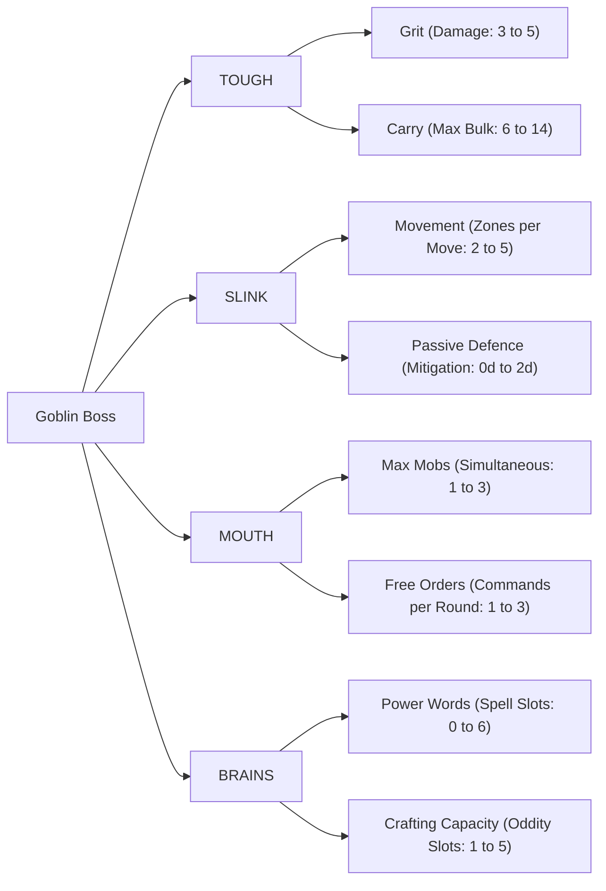

### Tough Derived Stats: Grit & Carry

| Tough Level | Grit (Damage Capacity) | Carry Capacity (Max Bulk) |
| :---: | :---: | :---: |
| **Level 1** | **3** | **6 Bulk** |
| **Level 2** | **4** | **8 Bulk** |
| **Level 3** | **4** | **10 Bulk** |
| **Level 4** | **5** | **12 Bulk** |
| **Level 5** | **5** | **14 Bulk** |

*   **Grit**: The amount of physical damage your Boss can absorb before entering the **Downed State** (see [Damage, Grit & Wounds](07_Damage_Grit_and_Wounds.md)).
*   **Carry Capacity**: The total **Bulk** of equipment, weapons, and Loot you can carry before suffering encumbrance.
    *   **Over-Laden Rule**: If your carried Bulk exceeds your **Carry Capacity**, you suffer **-1 Zone Movement** per Move action and a **Bane 1 (-1d)** on all physical **Slink** and **Tough** tests. You cannot carry more than your Carry Capacity + 4 Bulk under any circumstances.ances.

### Slink Derived Stats: Movement & Passive Defence

| Slink Level | Movement (Zones per Move) | Passive Defence (Armor Mitigation Dice) |
| :---: | :---: | :---: |
| **Level 1** | **2 Zones** | **0d** |
| **Level 2** | **3 Zones** | **0d** |
| **Level 3** | **3 Zones** | **+1d6** |
| **Level 4** | **4 Zones** | **+1d6** |
| **Level 5** | **5 Zones** | **+2d6** |

*   **Movement**: The maximum number of discrete environmental **Zones** your Boss can cross by spending a single **Move** action (see [Zones, Movement & Environment](04_Zones_and_Movement.md)).
*   **Passive Defence**: Innate dodging reflexes that grant passive mitigation dice. These dice are rolled alongside your equipped armor dice in the **Clatter Roll**, reducing incoming damage on rolls of **5+** even if you have saved zero actions to actively Dodge (see [Combat Engine](05_Combat_Engine.md)).

### Mouth Derived Stats: Max Mobs & Free Orders

| Mouth Level | Max Controlled Mobs | Free Orders per Round |
| :---: | :---: | :---: |
| **Level 1** | **1 Mob** | **1 Free Order** |
| **Level 2** | **2 Mobs** | **1 Free Order** |
| **Level 3** | **2 Mobs** | **2 Free Orders** |
| **Level 4** | **3 Mobs** | **2 Free Orders** |
| **Level 5** | **3 Mobs** | **3 Free Orders** |

*   **Max Controlled Mobs**: The maximum number of distinct allied **Mobs** you can maintain under your command simultaneously during an encounter.
*   **Free Orders per Round**: The number of Mob command actions you can issue each round without spending your Boss's **Standard Actions** (see [Action Economy & Turn Flow](03_Action_Economy_and_Turn_Flow.md)).

### Brains Derived Stats: Power Words & Crafting Capacity

| Brains Level | Power Words (Spell Tag Slots) | Crafting Capacity (Oddity Slots) |
| :---: | :---: | :---: |
| **Level 1** | **0 Slots** | **1 Oddity Slot** |
| **Level 2** | **0 Slots** | **2 Oddity Slots** |
| **Level 3** | **2 Slots** | **3 Oddity Slots** |
| **Level 4** | **4 Slots** | **4 Oddity Slots** |
| **Level 5** | **6 Slots** | **5 Oddity Slots** |

*   **Power Words**: The maximum number of volatile magical element and delivery tags your Boss can commit to memory for casting spells (see [Magic & Bangaranga](08_Magic_and_Bangaranga.md)). You must have at least **Brains 3** to memorize Power Words and cast spells.
*   **Crafting Capacity**: The maximum number of specialized **Oddities** (custom mechanical attachments, alchemical coatings, spikes, and contraptions) you can install onto a single crafted item during downtime (see [The Lair Loop and Progression](10_The_Lair_Loop_and_Progression.md)).

---

## Grunt & Command Limits

**Grunt** represents personal authority, intimidation, and psychological command momentum. It determines how large a **Mob** you can intimidate into following orders, and acts as the currency for activating high-tier **Quirks**.

### Calculating Maximum Grunt
A Boss's **Maximum Grunt** is strictly equal to the Boss's **second-highest Main Stat**:

**Max Grunt** = **Second-Highest Stat** (among Tough, Slink, Brains, Mouth)

> **Example Calculations:**
> *   Stats: **Tough 3**, **Slink 1**, **Brains 1**, **Mouth 1** -> Second-highest is 1 -> **Max Grunt = 1**.
> *   Stats: **Tough 2**, **Slink 2**, **Brains 1**, **Mouth 1** -> Second-highest is 2 -> **Max Grunt = 2**.
> *   Stats: **Tough 4**, **Slink 3**, **Brains 2**, **Mouth 1** -> Second-highest is 3 -> **Max Grunt = 3**.

### Tracking Current Grunt
Unlike the four static Main Stats, **Current Grunt** fluctuates dynamically between **0** and **Max Grunt** during a raid:

*   **Gaining Grunt (+1)**:
    *   Achieving a double-explosion **Critical Success** on any test (+1 Grunt).
    *   Personally slaying an enemy in your current or an adjacent Zone (+1 Grunt).
    *   Successfully dealing damage via **Assert Dominance** (+1 Grunt).
*   **Losing Grunt (-1)**:
    *   Suffering a **Fumble** on any test or failed **Gobbo Gamble** (-1 Grunt).
    *   Failing any test that included drawn **Bangaranga Dice** (-1 Grunt).
    *   Failing to deal damage when attempting **Assert Dominance** (-1 Grunt).

### Mob Command Limits & The Rebellion Test
A **Goblin Boss** can only maintain direct command over a **Mob** whose current **Size** is less than or equal to the Boss's **Current Grunt**:

**Maximum Commandable Mob Size <= Current Grunt**

*   **Rebellion Test**: If your current **Grunt** drops below the current **Size** of a Mob under your command (or if you attempt to command a Mob larger than your Grunt), you must immediately make a command test:
    `Tough or Mouth 5+/[Mob Size]`
    *   **Success**: The Mob remains intimidated and obeys your command for this round.
    *   **Failure**: The Mob realizes you are weak, breaks command, and immediately becomes **Out of Control** (see [Mob Mechanics](06_Mob_Mechanics.md)).

### Assert Dominance
When your Grunt is low and your Mobs are restless, you can beat your own followers to re-establish fear:
*   **Action Cost**: 1 **Standard Action**.
*   **Execution**: Make an undefended melee attack against a friendly **Mob** under your command in your Zone.
*   **Outcome**:
    *   If the attack deals **>= 1 damage** to the Mob's health dice, your Boss immediately regains **+1 Grunt** (up to Max Grunt).
    *   If the attack rolls **0 successes** (dealing 0 damage), the attack bounces, your goblins laugh at you, and your Boss loses **-1 Grunt**.

---

## Boss Creation Engine

Follow these sequential steps to create a starting **Goblin Boss**:

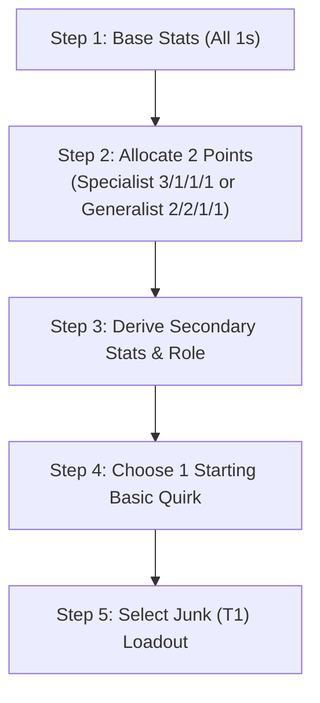

### Step 1: Set Base Stats
Set all four **Main Stats** to **1**:
*   **Tough**: 1
*   **Slink**: 1
*   **Mouth**: 1
*   **Brains**: 1

### Step 2: Distribute Starting Points
You have **2 points** to distribute among your four Main Stats. At character creation, no stat can be increased above **Level 3**.

Choose one of two core archetype distributions:
1.  **Specialist (3, 1, 1, 1)**: Invest both points into one primary stat.
    *   *Result*: Primary Stat = 3, remaining stats = 1.
    *   *Derived Grunt*: **Max Grunt = 1**. (Can command a **Size 1 Mob** at campaign start).
2.  **Generalist (2, 2, 1, 1)**: Invest one point into two different stats.
    *   *Result*: Two Stats at 2, two stats at 1.
    *   *Derived Grunt*: **Max Grunt = 2**. (Can command a **Size 2 Mob** at campaign start).

### Step 3: Derive Secondary Stats & Role
Consult the progression tables above to record your **Grit**, **Carry Capacity**, **Movement**, **Passive Defence**, **Max Mobs**, **Free Orders**, **Power Words**, and **Crafting Capacity**.

Your highest stat and second-highest stat define your starting **Role** (e.g. Tough Specialist = Meat-Wall; Tough/Slink Hybrid = Raider; Slink/Brains Hybrid = Saboteur; Slink/Mouth Hybrid = Ring-Leader; Mouth/Brains Hybrid = Chant-Monger; Brains Specialist = Sage-Tinker).

### Step 4: Choose 1 Starting Basic Quirk
Select **1 Basic Quirk** matching a stat where your Boss's stat level meets or exceeds the Quirk's Tier (starts with 0 Twists).

### Step 5: Select Starting Loadout
Choose starting gear of **Junk (T1)** quality from the scrap pile:
1.  **Melee Weapon (Choose 1)**:
    *   *Light Melee Weapon* (Bulk 1, One-Handed, Impact Size 1).
    *   *Medium Melee Weapon* (Bulk 2, One-Handed, Impact Size 1).
    *   *Heavy Melee Weapon* (Bulk 3, Two-Handed, Impact Size +1).
2.  **Ranged Weapon (Optional, Choose 1)**:
    *   *Sling* (Bulk 1, One-Handed, Range 1 Zone).
    *   *Shortbow* (Bulk 2, Two-Handed, Range 2 Zones).
    *   *Throwing Daggers* (Bulk 1, One-Handed, Range 1 Zone).
3.  **Defense (Optional, Choose 1)**:
    *   *Light Armor* (Bulk 1, +1d Passive Armor Die).
    *   *Shield* (Bulk 1, One-Handed, +1d Passive Armor Die, enables Tough Parry).

[MISSING RULE / GAP: Weapon Damage Metric & Loadout Notation Discrepancy — Legacy character creation drafts incorrectly listed starting weapons with "+2d damage / +3d damage" dice bloat. In the standardized rules engine, all weapon attacks roll the Boss's Tough (melee) or Slink (ranged) dice pool against the target's Defence TN, dealing flat 1 damage or 1 Wound per success threshold. Weapon category dictates Hands, Bulk, Range, and Impact Size (+1 Heavy, +2 Crushing).]

[MISSING RULE / GAP: Dual-Wielding Melee Weapons — Character creation references wielding two Light Melee weapons simultaneously, but requires formal resolution. Suggested Resolution: Wielding an off-hand Light Melee weapon grants a passive Boon 1 (+1d) to melee attack pools or allows splitting scored successes between two distinct targets in the same Zone.]

---

## The Gang as Class Archetype

In **Gobbos**, players do not play isolated lone heroes. The player's persistent, leveling entity is the **Gang**, which survives the death or retirement of individual Bosses.

>> **The Gang:** Persistent Entity • Infamy Track (1–5) • The Hoard • The Bone Pile

### 1. Infamy Track (Level 1 to 5)
**Infamy** represents how feared, respected, and notorious your Gang is across the Lair. It acts as the Gang's overall level, scaling from **Infamy 1** to **Infamy 5**.

#### Earning Infamy Marks
A Gang advances its Infamy by earning **Infamy Marks**:
1.  **Loot Contribution**: Every **10 Loot Value** brought back from raids and deposited into the Lair Hoard grants **1 Infamy Mark**.
2.  **Gang Agendas**: Completing a chosen **Gang Agenda** during a raid grants **1 Infamy Mark** (maximum 1 Mark from Agendas per raid).

#### Infamy Milestones & Scaling
| Infamy Level | Cumulative Marks Required | Successor Starting XP | Max Equipped Gang Quirks |
| :---: | :---: | :---: | :---: |
| **Infamy 1** | **0 Marks** | **4 XP** | **1 Gang Quirk** |
| **Infamy 2** | **3 Marks** | **8 XP** | **2 Gang Quirks** |
| **Infamy 3** | **6 Marks** | **12 XP** | **3 Gang Quirks** |
| **Infamy 4** | **10 Marks** | **16 XP** | **4 Gang Quirks** |
| **Infamy 5** | **15 Marks** | **20 XP** | **5 Gang Quirks** |

### 2. Successor Boss Generation (Roguelite Legacy)
When a **Goblin Boss** dies, the Gang promotes the next biggest goblin to take command:
1.  **Base Setup**: The successor begins with base **1** in all four Main Stats, plus the standard **2 starting points**.
2.  **Successor XP**: The successor receives a bonus pool of **Successor XP** equal to **Infamy Level x 4** to purchase additional stat upgrades at standard advancement costs.
3.  **Successor Stat Cap**: A newly generated successor cannot raise any stat above **Level 4** at creation.
4.  **The Gang Mark**: The successor receives a permanent tattoo inked in soot and blood, inheriting **1 Quirk or Twist** possessed by the deceased Boss, completely bypassing stat tier prerequisites.

### 3. The Gang Hoard
**The Hoard** is the Gang's central stockpile of unrefined scrap, stolen tools, spare weapons, and trade wealth stored in the Lair. 
*   Before embarking on a raid, the Gang draws from the Hoard to outfit recruited **Mobs** with weapons, armor, and utility consumables.
*   Loot brought back from raids that is not contributed to Lair infrastructure is melted down into the Hoard (see [The Raid Loop](09_The_Raid_Loop.md)).

### 4. The Bone Pile & Relics
The **Bone Pile** is a literal monument of skulls and bones belonging to the Gang's deceased former Bosses.
*   **Forging Relics**: When a Boss dies, the Gang can recover a bone or token and attach it to a weapon or armor piece to forge a **Relic**.
*   **Relic Boon**: The Relic grants a mechanical Boon (+1d) tied to the deceased Boss's highest Main Stat. A Boss may equip at most **1 Relic** at a time.

### 5. Elders & Retirement
When any **Goblin Boss** reaches **Level 6** in any Main Stat, that Boss automatically retires from active raiding to become an **Elder**. Elders are permanently staffed at Lair facilities to grant persistent bonuses:
*   **Elder of Tough (Training Ring)**: All Mobs commanded by the Gang gain **+1 Passive Armor Die** without consuming Bulk.
*   **Elder of Slink (Shadow Den)**: Reduces the Target Number (**TN**) of all environmental traps by **1** (minimum TN 1).
*   **Elder of Mouth (Council Chambers)**: Increases the Boss's Maximum **Grunt** by **+1**; once per raid, allows rallying all fleeing Mobs in the zone as a Free Action.
*   **Elder of Brains (Tinker Yard)**: Allows installing **+1 extra Oddity** onto crafted custom gear beyond standard Crafting Capacity.

### 6. Gang Shenanigan (Cultural Identity)
Every Gang possesses a defining cultural trait called a **Shenanigan** (e.g. *Pyromaniacs, Shiny-Snatchers, Trap-Trippers, Skull-Bangers*):
*   **The Boon**: Grants a **+1d Boon** on action tests directly aligned with the Shenanigan.
*   **The Compulsion**: When presented with an opportunity to indulge the Shenanigan, the Boss must make a `Brains 5+/1` test to resist.
*   **Feeding the Bangaranga**: Whenever a player willingly indulges your Shenanigan to the tactical detriment of the party, immediately add **+1d6** to the communal **Bangaranga Pool**.

---

## Quirk Structural Schema

Quirks are modular personal abilities that modify dice outcomes, manipulate conditions, or alter the action economy. Every Quirk must conform to the following formal schema:

```markdown
### [CONTENT INSTANCE: Boss Quirk]
**Name**: <Quirk Name>
**Category**: <Tough | Slink | Brains | Mouth | General | Gang Legacy>
**Tier**: <T1 | T2 | T3 | T4 | T5>
**Prerequisite**: <Stat Name> Level >= Tier
**Cost**: <Passive | 1 Grunt | 1 Standard Action | 1 Reaction | 1 Free Order>
**Trigger**: <Passive | On Hit | On Dodge | On Fumble | Start of Turn | Action Declaration>
**Target Hub**: <Self | Allied Mob | Enemy in Zone | Zone Environment>
**Mechanical Effect**: <Direct Tier A rule specifying dice modification, condition, or action bypass>
**Twist Slots**: <1 Twist Max | 0 Twists>
**Keywords**: <[Keywords from Master Index]>
```

### [CONTENT EXTENSION POINT: Boss Quirks & Talents]
*All specific Boss Quirks, talent trees, and Twist modifiers are maintained in the modular Quirks Compendium and attach directly to the core rules via the schema above.*

---

<a id="doc-5"></a>
<!-- ============================================================ -->
<!-- DOCUMENT 5: 02_PROD_Core_Rules/03_Action_Economy_and_Turn_Flow.md -->
<!-- ============================================================ -->
# Action_Economy_and_Turn_Flow
*Source: `02_PROD_Core_Rules/03_Action_Economy_and_Turn_Flow.md`*

# Action Economy & Turn Flow

*A goblin battle is a storm of frantic screaming, chaotic orders, flying junk, and desperate scurrying. Victory belongs to the Boss who spends their momentum wisely—knowing when to strike, when to command the horde, and when to save an action to dive out of the way of a swinging axe.*

This chapter defines the action budgets for **Goblin Bosses** and **Mobs**, the standard action catalog, reaction holding mechanics, and the structured 5-Phase combat loop.

---

## Action Budgets & Categories

During an encounter, time is measured in **Rounds**. Every round, combatants receive a fresh allocation of actions that resets at the start of each round.

>> **Round Action Budgets:**
>> *   **Goblin Boss:** 3 Standard Actions + 1 to 3 Free Orders + Free Actions
>> *   **Goblin Mob:** 2 Actions (Governed by the Boredom Rule)

### Goblin Boss Action Budget
Every **Goblin Boss** receives the following action budget per round:
1.  **Three (3) Standard Actions**: The core currency of your turn. Standard Actions are spent to **Move**, **Attack**, **Plunder**, **Manipulate**, or issue an **Order**. Unspent Standard Actions may be saved to perform **Reactions** during the enemy turn.
2.  **Free Orders per Round**: An innate command allowance determined by your **Mouth** stat (1 Free Order at Mouth 1–2; 2 Free Orders at Mouth 3–4; 3 Free Orders at Mouth 5). Free Orders allow commanding Mobs without spending your precious Standard Actions.
3.  **Free Actions**: Minor, instantaneous maneuvers that cost zero Standard Actions (e.g. dropping an item, speaking, shouting a battle cry, drawing 1 light item once per turn).
4.  **Reactions**: Out-of-turn defensive or triggered responses (such as **Dodge**, **Parry**, **Scatter**, or reactive Quirks). Performing a Reaction strictly requires spending a saved **Standard Action** (or an unused Free Order for the Scatter reaction).

### Mob Action Budget
Every allied **Mob** possesses a strict budget of **two (2) actions** per round:
*   Mobs only act when given an **Order** by a Boss or during the **Unordered Mobs** step of the Player Active Turn.
*   If an Order directs a Mob to spend both actions on offense or movement, the Mob has 0 saved actions remaining and cannot react defensively if attacked later in the round.

### The Boredom Rule
Goblins have notoriously short attention spans and cannot stay focused on repetitive tasks.
*   **The Constraint**: A **Mob** cannot perform the exact same action twice in a single round. A Mob cannot Attack twice or Plunder twice in the same round.
*   **The Sole Exception**: A Mob *can* perform the **Move** action twice in a single round if it is actively charging toward an enemy or fleeing from danger.

---

## Standard Action Catalog

The following five actions constitute the core activities available to **Goblin Bosses** and **Mobs**:

>> **Standard Actions:** 1. **Move** | 2. **Attack** | 3. **Plunder** | 4. **Manipulate** | 5. **Order**

### 1. Move (Boss or Mob)
Spend 1 action to cross up to your **Movement** rating in connected **Zones**:
*   **Boss Movement**: Equal to your derived **Movement** stat (2 to 5 Zones based on **Slink**; see [Boss Profile and Gang](02_Boss_Profile_and_Gang.md)).
*   **Mob Movement**: Baseline 2 Zones per Move action (see [Mob Mechanics](06_Mob_Mechanics.md)).
*   **Environmental Profiles**: Crossing hazardous terrain, climbing vertical cliffs, or leaping chasms requires testing **Slink** against the established **Zone Profile** (e.g. `Slink 5+/1`; see [Zones, Movement & Environment](04_Zones_and_Movement.md)).

### 2. Attack (Boss or Mob)
Spend 1 action to engage an enemy in combat:
*   **Melee Attack**: Roll your **Tough** dice pool against the target's static **Defence TN** in your current Zone.
*   **Ranged Attack**: Roll your **Slink** dice pool against the target's static **Defence TN** across connected Zones within weapon range.
*   **Mob Attack**: Mobs roll **Size d6** for melee attacks (or 2d6 for ranged thrown attacks; see [Combat Engine](05_Combat_Engine.md)).

### 3. Plunder (Boss or Mob)
Spend 1 action to snatch, strip, and secure treasure in your current Zone:
*   **Securing Loot**: Collect loose Loot items, open unlocked chests, or strip valuables from fallen enemies (see [The Raid Loop](09_The_Raid_Loop.md)).
*   **Mob Plundering**: A Mob spending a Plunder action strips up to its current **Size** in loose Loot items from the Zone into its Loot Capacity.

### 4. Manipulate (Boss or Mob)
Spend 1 action to interact with physical mechanisms, terrain objects, or volatile contraptions:
*   **Simple Manipulation**: Open doors, throw levers, pick up dropped weapons, light torches, or uncork potions (requires no roll).
*   **Complex Manipulation**: Picking complex locks, disarming traps, or sabotaging steam pipes requires a **Brains** test against the mechanism's profile (e.g. `Brains 5+/2`).

### 5. Order (Boss Action Only)
Spend 1 **Free Order** (or 1 **Standard Action**) to issue verbal or physical commands to an allied **Mob**:
*   **Controlled Mobs**: Issuing orders to a Mob whose **Size** is <= your current **Grunt** requires no dice roll.
*   **Rebellious Mobs**: If Mob Size > your current Grunt, issuing an order requires passing an immediate **Rebellion Test** (`Tough or Mouth 5+/[Mob Size]`).
*   **Scope of Orders**: An Order directs the Mob to spend 1 or both of its round actions immediately (e.g. "Move and Attack!", "Plunder the chest!", "Hold the line!").

>> **IMPORTANT (Free Orders vs. Standard Orders):** Free Orders can only be spent on the **Order** action. They cannot be converted into personal attacks, movement, or plunder actions for the Boss.

---

## Free Actions & Free Orders

To maintain fast tactical flow, minor adjustments and commanding shouts do not consume your primary combat budget.

### Free Actions
A **Free Action** takes negligible time and can be performed freely on your turn (up to a reasonable limit enforced by common sense):
*   Dropping a held weapon or item to the ground.
*   Speaking a short sentence, screaming an insult, or sounding a war horn.
*   Drawing or stowing 1 light weapon/item (once per turn).
*   Spending a **Critical Success** bonus action to Move, Plunder, or Manipulate.

### Free Orders
A **Free Order** is a dedicated command shout granted by your **Mouth** stat. 
*   Free Orders function identically to the standard **Order** action, but **do not consume any of your 3 Standard Actions**.
*   You may spend Free Orders during your turn to command Mobs, or save an unused Free Order to shout the reactive **"Scatter!"** command during the enemy turn.

[MISSING RULE / GAP: Free Order Action Permissibility in Self-Defense Reactions — Rules clarify that Free Orders can be saved to issue a reactive "Scatter!" command to a Mob, but must explicitly define whether an unused Free Order can be spent by the Boss to Dodge or Parry in self-defense. Resolution: Free Orders are strictly limited to Mob command actions. A Boss cannot spend a Free Order to actively Dodge or Parry an attack directed at the Boss's own person; personal evasion strictly requires spending a saved Standard Action.]

---

## Reactions & Holding Actions

Combat in **Gobbos** is reactive. Enemies act deterministically, and player survival depends on tactical action preservation.

>> **The Reaction Doctrine:**
>> *   **SAVE Standard Actions on your turn** -> Spend as Reactions on enemy turn
>> *   **SPEND ALL Actions on your turn** -> 0 Active Defense (Armor only!)

### Holding Actions for Defense
On the Player Active Turn, you are not required to spend all 3 Standard Actions. Any unspent Standard Actions are **held**:
*   **Active Defense Requirement**: When targeted by an incoming enemy attack or area hazard during the Enemy Active Turn, you must spend **1 saved Standard Action** to make an active defense roll (**Dodge** or **Parry**).
*   **Zero Saved Actions**: If you spent all 3 Standard Actions on your turn, you have **0 saved actions**. You cannot attempt to actively evade, and must rely entirely on passive **Armor Dice** to absorb the strike!

### Reaction Types
1.  **Dodge (Boss Reaction)**: Spend 1 saved Standard Action. Roll your active **Slink** dice pool against the incoming attack's **Threat TN** in the **Clatter Roll**. Scoring successes >= Threat TN completely negates the attack (0 damage).
2.  **Parry (Boss Reaction)**: Spend 1 saved Standard Action. Roll your active **Tough** dice pool against the incoming attack's **Threat TN** in the **Clatter Roll**. Requires an equipped **Shield** or **Heavy Weapon**. Scoring successes >= Threat TN completely negates the attack (0 damage).
3.  **Scatter (Mob Reaction)**: Spend 1 saved Boss Standard Action (or 1 unused Free Order) to order a targeted Mob with >= 1 unused action to disperse. Roll your Boss's **Mouth** pool against `Threat TN + (Mob Size - 1)`. Success negates damage and scurries the Mob 1 Zone into cover.
4.  **Reactive Quirks**: Specific Boss abilities (such as *Meat Shield* or *Ankle Bite*) trigger out of turn by paying their stated Grunt or Reaction cost.on cost.

---

## The 5-Phase Round Flow

Every round of combat follows a strict 5-phase sequence:

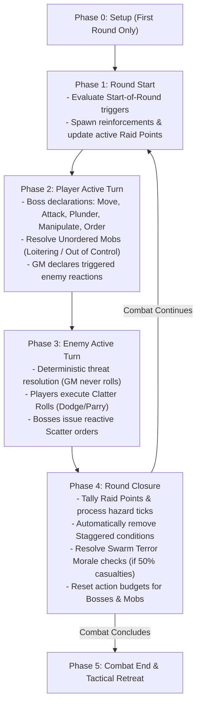

### Phase 0: Combat Setup (Initial Encounter Start)
1.  **Zone Graph Deployment**: The GM reveals the node graph of interconnected **Zones**, identifying terrain traits, cover points, and baseline **Zone Profiles** (`Difficulty+/TN`).
2.  **Unit Placement**: Place Bosses, allied Mobs, and visible enemies in starting Zones.
3.  **Objective Declaration**: The GM declares active **Raid Point** objectives and visible **Loot** caches.

### Phase 1: Round Start
1.  **Condition Triggers**: Resolve any conditions or environmental hazards with "Start of Round" triggers (e.g. acid burns, regeneration).
2.  **Reinforcements**: Deploy newly arriving enemies or wandering patrols into entry Zones.
3.  **Raid Point Assessment**: Update active timers or moving objectives.

### Phase 2: Player Active Turn
1.  **Player Declarations**: Players act in any order they choose. Bosses spend Standard Actions and Free Orders to move, attack, plunder, manipulate mechanisms, and command Mobs.
2.  **Unordered Mobs Step**: Once all players have completed their actions, any allied Mob that did not receive an Order this round resolves its behavior:
    *   *Loitering Mob*: Roll on the Loitering Table (spends 1 action, saves 1 action for defense).
    *   *Out of Control Mob*: Roll on the Out of Control Table (spends 2 actions, saves 0 actions).
3.  **Enemy Reactions**: The GM resolves any triggered enemy reactions (e.g. counter-attacks or opportunity shots).

### Phase 3: Enemy Active Turn
Enemies act deterministically in accordance with their statblock profiles:
*   Standard enemies and Enemy Mobs receive **2 actions**; Apex Bosses receive **3 actions**.
*   Enemies move toward priority targets and unleash attacks with listed **Threat Profiles** and flat **Damage**.
*   Players resolve incoming attacks via the **Clatter Roll**, spending saved Standard Actions to Dodge or Parry, shouting "Scatter!" to save Mobs, or rolling passive Armor Dice.

### Phase 4: Round Closure
1.  **Raid Points Tally**: Tally confirmed and contested Raid Points for the round.
2.  **End-of-Round Ticks**: Resolve lingering hazard ticks (e.g. fire spreading on 1d6 roll of 5–6, poison degradation).
3.  **Clear Staggered**: Automatically remove the **Staggered** condition from all PCs, Mobs, and enemies.
4.  **Morale Checks**: If any Mob or enemy force suffered 50% casualties this round, resolve a **Swarm Terror Morale Check** (see [Mob Mechanics](06_Mob_Mechanics.md)).
5.  **Reset Action Budgets**: Reset all Boss budgets to 3 Standard Actions + Free Orders, and all Mob budgets to 2 Actions.

---

## Combat End & Tactical Retreat

Combat concludes when all enemies are slain, all PCs are eliminated, or one side flees the battlefield.

### Fleeing & Disengaging
Goblins are practical cowards; a tactical retreat preserves stolen Loot and saves lives.
*   **Escape Zones**: To escape an encounter, a Boss or Mob must enter a designated exit Zone and spend 1 Move action to withdraw.
*   **Disengaging from Melee**: Leaving a Zone containing alert enemies without fighting triggers an immediate Opportunity Attack. To disengage safely, a Boss or Mob must spend 1 Standard Action to **Disengage**, testing:
    `Slink 5+/[Highest Enemy Defence TN]`
    *   **Success**: The unit withdraws safely into an adjacent connected Zone without taking damage.
    *   **Failure**: The highest-Threat enemy in the Zone executes an immediate Opportunity Attack against the fleeing unit, and the unit's movement immediately ends inside the current Zone.

[MISSING RULE / GAP: Disengage Failure & Opportunity Attack Resolution — Legacy drafts did not define exact mechanical outcomes when failing a Disengage test. Resolution codified: On a failed Disengage test, the highest Threat enemy in the zone executes an immediate Opportunity Attack, and the fleeing unit's movement ends immediately in the contested zone.]

*   **The Heavy Loot Restriction (Bulk 3+)**: Hauling an unwieldy item of **Bulk 3 or higher** requires two hands. You **cannot perform a Disengage action while clutching a Bulk 3+ item**. To escape safely, you must drop the heavy loot as a Free Action, hand it off to a Mob, or defeat the pursuing enemies.

---

<a id="doc-6"></a>
<!-- ============================================================ -->
<!-- DOCUMENT 6: 02_PROD_Core_Rules/04_Zones_and_Movement.md -->
<!-- ============================================================ -->
# Zones_and_Movement
*Source: `02_PROD_Core_Rules/04_Zones_and_Movement.md`*

# Zones, Movement, and Environment

*Battlefields in Gobbos are dynamic, chaotic playgrounds where verticality, collapsing scenery, and hazardous obstacles matter far more than measuring inches on a grid. Goblins scurry through pipes, leap across burning chasms, and hide behind crumbling statues to outmaneuver taller, stronger foes.*

---

## Zone Topology & Spatial Abstraction

Tactical combat and exploration in **Gobbos** operate on an abstract node graph rather than a square or hex grid. The physical environment is divided into discrete, bounded spatial units called **Zones**.

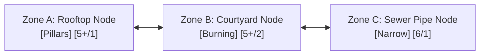

### Discrete Tactical Nodes
A **Zone** represents a distinct environmental feature or bounded room, such as a tavern taproom, a raised wooden balcony, a slippery courtyard, a sewer tunnel, or a narrow rooftop. 
*   **Intra-Zone Distance (Engaged):** All creatures, allies, hazards, and loot within the same Zone are considered adjacent and engaged with one another. Moving between targets within the same Zone costs no additional movement.
*   **Inter-Zone Distance (Node Steps):** Distance between separate locations is measured strictly as the integer number of connected Zone boundaries (steps) along the shortest available path.
*   **Adjacency & Connectivity:** Two Zones are adjacent if they share a direct spatial connection (a doorway, an open archway, a flight of stairs, or an open courtyard border). Blocked passages or sheer cliffs require specific actions or tools to cross.

### Tabletop Representation
At the physical gaming table, the environment is managed across two complementary tracking spaces:
1.  **The Macro Minimap (Point-Crawl Nodes):** Tracks the overarching raid location (dungeon, fortress, or town quarter) using connected abstract nodes. A single party token represents the main horde, showing broad exploration routes, locked security gates, and designated extraction points.
2.  **The Clash Cluster (Micro Battleground):** Deployed when combat breaks out. The GM places 3 to 6 modular Zone cards or tactile boundary markers on the table representing the immediate tactical theater. Player Boss miniatures and physical **d6** Mob health dice are placed directly onto these Zone cards.

---

## Zone Profiles

Every Zone on the battlefield possesses an intrinsic baseline difficulty known as its **Zone Profile**, written in standard slash notation: `Difficulty+/Target Number (TN)` (for example, `5+/1`, `5+/2`, or `6/1`).

>> **THE ZONE PROFILE RULE:**
>> Any general physical interaction, traversal feat, jump, climb, search, door-forcing, or balance check attempted within a Zone defaults to testing against that Zone's Profile. The GM does not invent ad-hoc Target Numbers; all unlisted environmental tests resolve against the active Zone Profile.

### Traversal and Interaction Resolution
*   **Baseline Checks:** When you attempt an unscripted physical maneuver (such as scaling a brick wall, jumping a ditch, or prying a floorboard loose), you roll the appropriate attribute pool (**Slink** for agility/traversal, **Tough** for brute force/lifting, or **Brains** for searching/spotting mechanisms) against the Zone Profile.
*   **Applying Boons and Banes:** Situational factors, specialized gear, or adverse conditions apply standard **Boons (+1d)** or **Banes (-1d)** to your dice pool before rolling, while leaving the underlying Zone Profile unchanged.

> **Example:** A crumbling armory has a Zone Profile of `5+/2`. Attempting to climb a broken weapon rack in this Zone requires a Slink test against `5+/2` (needing 2 successes on 5s or 6s). If the Goblin Boss uses a grappling hook, the tool grants a **Boon 1 (+1d)** to the pool, but the test profile remains `5+/2`.

---

## Movement & Tactical Positioning

Movement in **Gobbos** is measured in discrete Zones crossed rather than feet or inches.

### The Move Action
Spending one **Standard Action** on a **Move** action allows a character or Mob to cross a number of connected Zones up to their **Movement** rating:
*   **Goblin Boss Movement:** A Goblin Boss moves a number of Zones equal to their secondary **Movement** stat (ranging from 2 to 5 Zones per Move action, derived from their **Slink** stat; see [Boss Profile & Gang](02_Boss_Profile_and_Gang.md)).
*   **Mob Movement:** A Mob moves a baseline of **2 Zones** per Move action.
*   **Mobility Restrictions:** Difficult terrain, heavy encumbrance, or specific traits can increase movement costs or cap maximum speed.

### Tactical Disengagement & Opportunity Attacks
Leaving a Zone that contains alert, unengaged enemy combatants is inherently dangerous.

1.  **The Disengage Test:** To safely exit a Zone containing active enemies, a Goblin Boss or Mob must declare a Disengage maneuver as part of their Move action and pass a **Slink** test:
    `Slink 5+/[Highest Enemy Defence TN]`
2.  **Successful Disengage:** On a success, the unit moves out of the Zone safely along their declared movement path.
3.  **Failed Disengage:** On a failure, the highest **Threat** enemy in the Zone immediately executes an unavoidable **Opportunity Attack** against the escaping unit. Furthermore, the unit's movement is immediately halted, forcing them to remain inside the current Zone for the remainder of the round.
4.  **Bulk 3+ Restriction:** Wielding or hauling a loose object of **Bulk 3** or greater requires both hands and total focus. A character **cannot attempt a Disengage test** while clutching a Bulk 3+ item. To escape, the character must drop the item as a **Free Action**, defeat the threatening enemies, or have a Mob transport the burden.

---

## Cover Mechanics

Obstacles, low masonry, furniture, and environmental barriers provide crucial protection against incoming ranged attacks. Cover is classified into two distinct mechanical levels:

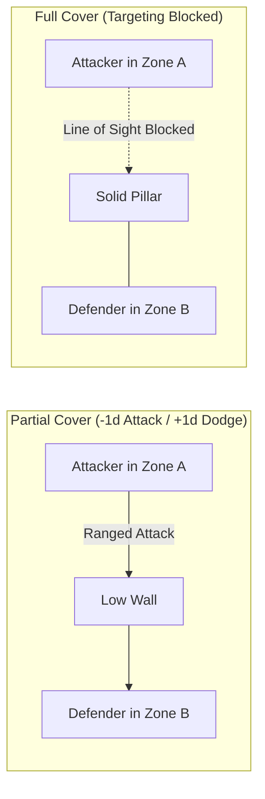

### Partial Cover
Partial Cover represents waist-high stone walls, overturned tables, dense thickets, wooden barricades, or clusters of allied goblins.
*   **Attacking into Partial Cover:** Ranged attacks targeting a creature behind Partial Cover suffer a **Bane 1 (-1d)** penalty to the attack dice pool.
*   **Defending behind Partial Cover:** A defender situated behind Partial Cover gains a **Boon 1 (+1d)** to their active **Dodge** (**Slink**) dice pool during a **Clatter Roll** against ranged threats.

### Full Cover
Full Cover represents solid stone pillars, reinforced iron doors, thick masonry walls, or total line-of-sight obstruction.
*   **Targeting Blocked:** A creature behind Full Cover cannot be targeted by direct ranged attacks, single-target spells, or line-of-sight abilities originating from the blocked direction.
*   **Bypassing Full Cover:** An attacker must spend movement to cross into a connected Zone that clears the sightline or flank around the barrier before declaring an attack.

---

## Modular Zone Traits & Hazards

A **Zone Trait** is an environmental modifier attached to a Zone that alters movement, tests, or combat resolution. Traits are modular building blocks that the GM combines to construct dynamic encounter maps.

### Hazard Severity Tiers
When an environmental hazard inflicts damage due to a failed test or unmitigated trigger, the damage scales by severity tier:
*   **Tier 1 Hazard (Minor):** Deals **1 Damage** to a Boss's **Grit** or a Mob's lowest active health die.
*   **Tier 2 Hazard (Dangerous):** Deals **2 Damage** to a Boss's **Grit** or a Mob's lowest active health die, or inflicts a sustained condition.
*   **Tier 3 Hazard (Lethal / Catastrophic):** Deals **3 Damage** to a Boss's **Grit** or a Mob's lowest active health die, or inflicts an immediate severe condition. Catastrophic hazards (such as collapsing mine shafts) can directly remove an entire Mob health die.

### Predefined Static Obstacles

| Trait Name | Category | Primary Tags | Trigger Timing | Mechanical Rule & Resolution Profile |
| :--- | :--- | :--- | :--- | :--- |
| **Slippery** | Obstacle | `[Slick]` | On Entry / Exit | Any creature entering or leaving this Zone must pass a `Slink` test against the Zone Profile. On a failure, the creature falls **Prone** and their movement ends immediately. |
| **Rubble** | Obstacle | Terrain | Traversing | Difficult ground. Moving through this Zone costs double movement speed (spending 2 Zones of movement capacity per Zone crossed). |
| **Narrow** | Obstacle | Spatial Cap | Passive | Restricts physical capacity and frontline width (default **Size 2**). Mobs exceeding this capacity suffer **Bane 1 (-1d)** on physical tests, their Movement is capped at 1 Zone, and their Melee combat pool is capped at the narrow limit. Giant foes (`[Huge]`, `[Colossal]`) cannot enter. |
| **Chasm / Pit** | Hazard (T3) | Obstacle | Crossing / Shove | Crossing or being pushed into the pit requires a `Slink` test against the Zone Profile. On a failure, the creature plummets, taking **3 Damage** and gaining the **Restrained** condition. Climbing out requires a Standard Action and a successful `Tough` test against the Profile. |
| **Vertical Cliff** | Obstacle | Elevation | Vertical Move | Scaling a sheer wall or scaffolding requires a Move action and a `Slink` test against the Zone Profile. On a failure, the climber falls, taking 1 Damage per Zone height fallen and landing **Prone**. |
| **Deep Water** | Obstacle | `[Wet]` | Passive / Move | Traversing requires a Move action to cross only 1 Zone. Swimming without a boat or flotation gear requires testing `Tough` against the Zone Profile at round start or taking 1 drowning damage per round. |
| **Pillars / Statues** | Opportunity | Cover | Passive / Free Action | A creature occupying this Zone may declare they are ducking behind a pillar as a **Free Action**, gaining **Full Cover** against attacks originating from one designated adjacent Zone. |
| **Hedges / Thickets** | Opportunity | Cover | Passive | Thick vegetation provides passive **Partial Cover** to all occupants against ranged attacks originating outside the Zone. |
| **Shadowy** | Opportunity | Stealth | Passive | Deep darkness and heavy alcoves grant a **Boon 1 (+1d)** to all stealth-related `Slink` tests made within this Zone. |
| **Junk Pile** | Opportunity | Treat | Interactive | A character can spend a Standard Action (**Manipulate**) to search the debris (`Brains` vs Zone Profile). On a success, they salvage an improvised throwing weapon (1 Damage ranged) or 1d6 Scrap. Exhausted after one successful search. |

### Predefined Dynamic Hazards

| Trait Name | Category | Primary Tags | Trigger Timing | Mechanical Rule & Resolution Profile |
| :--- | :--- | :--- | :--- | :--- |
| **Burning** | Hazard (T2) | `[Fire]`, `[Gaseous]` | Entry / Turn Start | Imposes active `[Fire]` (attacks in Zone score **+1 Success**) and `[Gaseous]` (ranged attacks suffer **Bane 1**). Entering or starting a turn here requires a `Slink` test vs Zone Profile; failure deals **2 Damage** and inflicts Burning. Spreads to flammable adjacent Zones at Round Closure on a 1d6 roll of 5–6. |
| **Crumbling Ceiling** | Hazard (T3) | `[Crushing]` | Round Start / Trigger | All occupants must test `Slink` against the Zone Profile. On a failure, they take **3 Damage** and are knocked **Prone**. After resolving, the Zone permanently gains the **Rubble** trait. |
| **Howling Wind** | Hazard (T1) | `[Gale]` | Passive | All ranged attacks passing into or through this Zone suffer a **Bane 1 (-1d)**. Moving against the wind requires a `Tough` test vs Profile; on a failure, movement speed is halved. |
| **Toxic Spores / Gas** | Hazard (T2) | `[Toxic]`, `[Gaseous]` | Turn Start | All creatures starting their turn in this Zone must test `Tough` against the Zone Profile. On a failure, they suffer the **Weakened** condition (**Bane 1 (-1d)** on physical tests) until they spend a Standard Action catching breath in a clean Zone. |
| **Quicksand / Mud** | Hazard (T2) | `[Wet]`, `[Sinking]` | On Entry | Entering or moving inside this Zone requires a `Slink` test against the Zone Profile. On a failure, the creature gains the **Restrained** condition. Escaping requires spending a Standard Action to test `Tough` against the Profile. |
| **Shoring** | Opportunity | Structural | Interactive | Goblins can deliberately collapse timber supports by spending a Standard Action (**Manipulate** or **Attack**) testing `Brains` or Melee attack vs Zone Profile. On a success, the Zone immediately triggers a **Crumbling Ceiling** hazard and all exits become blocked. Clearing a blocked exit requires a Standard Action testing `Tough` vs Profile. |

---

## Environmental Blueprints (Weather & Composite Hazards)

The GM can construct complex, encounter-wide weather patterns or atmospheric hazards by combining modular tags into unified environmental blueprints:

*   **Blizzard (T2 Hazard | `[Chilled]`, `[Blinding]`, `[Slick]`):** Freezing winds halve movement speed (`[Chilled]`), blinding snow makes ranged attacks **Hard (6)** and prevents Dodge reactions (`[Blinding]`), and icy footing requires a `Slink` test vs Zone Profile upon moving or fall **Prone** (`[Slick]`).
*   **Thunderstorm (T2 Hazard | `[Wet]`, `[Shock]`):** Heavy rain douses mundane flames and soaks all occupants (`[Wet]`). Any electrical damage or spark effect conducted through wet targets makes all incoming attacks against them **Easy (4+)** for 1 round (`[Shock]`).
*   **Smog Marsh (T2 Hazard | `[Wet]`, `[Toxic]`, `[Dark]`):** Foul sewer sumps conduct lightning (`[Wet]`), noxious marsh gas forces a `Tough` test vs Profile at round start or inflicts **Weakened** (`[Toxic]`), and dense gloom imposes **Bane 1 (-1d)** on notice and attack tests (`[Dark]`).
*   **Tornado / Gale Vortex (T3 Hazard | `[Gale]`, `[Weightless]`, `[Loud]`):** Howling vortex deflects ranged attacks (`[Gale]`), roaring winds drown out verbal orders and stealth (`[Loud]`), and updrafts lift creatures off the ground (`[Weightless]`). Stabilizing or exiting requires a `Tough` test against the Zone Profile.
*   **Acid Mire (T2 Hazard | `[Acidic]`, `[Slick]`):** Corrosive sludge destroys 1 passive Armor Die on a hit or failed hazard test (`[Acidic]`), and slick chemical mud forces a `Slink` test on entry or the creature falls **Prone** (`[Slick]`).

---

## Background Node Resolution (The Chaos Tick)

When a player chooses to split their forces and leave an unsupervised Mob behind at an inactive macro map node (for example, to guard a captured chokepoint, harvest a scrap pile, or hold a rear exit), that node is removed from active micro-combat tracking.

>> **Active vs. Background Tracking:** Active tactical zones are tracked in micro-combat rounds, while unsupervised mobs at distant macro nodes resolve their actions via the **Chaos Tick** during the Round Closure Phase.

### Unsupervised Mob Priority AI
Without direct Boss supervision, an unsupervised Mob automatically follows its base instinct priority list:
1.  **Survival:** Flee from overwhelming threats or lethal hazards.
2.  **Loot & Eat:** Scavenge loose food, mushrooms, shiny objects, and Scrap.
3.  **Violence:** Attack vulnerable stragglers or pick fights with nearby rivals.
4.  **Trash Stuff:** Vandalize architecture, smash furniture, and dismantle machinery.
5.  **Wander Off:** Scurry into adjacent corridors following noise or smell.

### Resolving the Chaos Tick
At the end of each combat round during the **Round Closure Phase**, the controlling player resolves the background Mob's actions by rolling the **Chaos Tick**:

>> **THE CHAOS TICK RULE:**
>> The player rolls a number of **d6s equal to the unsupervised Mob's current Size**. The test resolves against the background node's assigned Zone Profile (defaulting to **5+/1**):
>> *   **Successes (5+):** Tally successes to determine task progress and loot secured.
>> *   **Ones (1s):** Each **1** rolled represents growing insubordination and friction. Tally all **1s** rolled, add **+1 die per 1 rolled** to the communal **Bangaranga Pool**, and consult the **Gobbo Mischief Table**.
>> *   **The Farkle:** Rolling **zero successes** and **two or more 1s** triggers a catastrophic failure, causing the Mob to mutiny, trigger a trap, or wander off the map.

### The Gobbo Mischief Table

| 1s Rolled | Mischief Result | Mechanical Consequence |
| :---: | :--- | :--- |
| **0** | **Smooth Operations** | Perfect discipline! The Mob works together without internal fighting. |
| **1** | **Bickering** | Goblins fight over a shiny rock. The Mob takes **1 Damage** to its lowest active health die. |
| **2** | **Tasting Time** | The runts lick glowing moss or eat questionable sludge. The Mob gains the **Weakened** condition. |
| **3** | **Straying** | Several goblins get distracted and wander into dark pipes. The Mob's **Size decreases by 1**. |
| **4+** | **Mutiny / Riot** | Complete breakdown of authority! The Mob becomes **Out of Control** and permanently hostile to all Gangs, turning into an independent threat or vanishing with all carried gear. |

### Chaos Tick Success Progress

| Successes (5+) | Operational Outcome & Scavenged Payout |
| :---: | :--- |
| **0 Successes** | Distracted and idle. The Mob makes zero progress on their assignment. |
| **1 Success** | Basic task accomplished. If foraging, the Mob secures **1d6 Scrap**, or heals **1d6 damage** on its health dice by scavenging rations. |
| **2 Successes** | Productive haul. The Mob gathers **2d6 Scrap** or unearths a low-grade **Oddity** chassis. |
| **3+ Successes** | Masterful looting! The Mob completely clears and secures the node (making future traversal **Safe** with no hazard tests required) and secures **1 Standard Loot item**. |

---

## Mechanical Gap Analysis & Missing Rules

[MISSING RULE / GAP: Vertical Zone Height and Fall Damage Scaling — While falling from cliffs specifies 1 damage per Zone height, rules do not define maximum terminal fall damage or the exact interaction with Mob cushioning when falling onto enemies. Suggested Resolution: Cap falling damage at 5 damage (terminal velocity within dungeon scale). If a Boss or creature falls onto an enemy in a lower Zone, resolve as an improvised Attack with Impact Size equal to the height fallen; on a hit, damage is split equally between the falling creature and the target.]

[MISSING RULE / GAP: Zone Capacity Limits for Giant Adversaries — Narrow traits restrict Mobs and ban giant foes, but standard open Zones lack explicit entity capacity caps. In extreme scenarios, multiple player Mobs and enemy swarms could crowd into a single node. Suggested Resolution: Define standard open Zones as having a soft capacity of Size 10 total units. Exceeding Size 10 in a single Zone imposes Bane 1 (-1d) on all physical Dodge and traversal tests due to chaotic overcrowding.]

---

<a id="doc-7"></a>
<!-- ============================================================ -->
<!-- DOCUMENT 7: 02_PROD_Core_Rules/05_Combat_Engine.md -->
<!-- ============================================================ -->
# Combat_Engine
*Source: `02_PROD_Core_Rules/05_Combat_Engine.md`*

# Combat Engine

*Combat in Gobbos is fast, visceral, and uncompromisingly deterministic. The Game Master never rolls dice to strike or calculate damage; instead, enemies present lethal Threat profiles that goblin Bosses evade through acrobatic dodges, desperate shield parries, or the noisy protection of clattering scrap-iron armor.*

---

## The Attack Pipeline

All attacks in **Gobbos**—whether delivered via a rusty cleaver, a scavenged crossbow, or an explosive pot—follow a unified, single-source resolution pipeline.

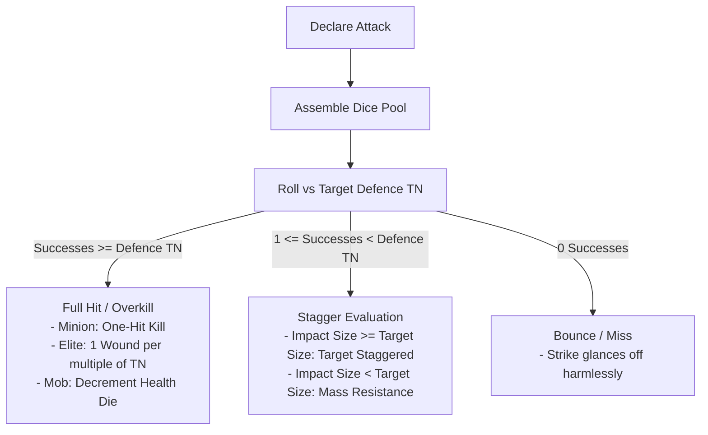

---

## Melee Attacks

A **Melee Attack** represents close-quarters combat against a target occupying the same **Zone**.

### Execution & Dice Pool
*   **Action Cost:** Costs one **Standard Action** during the **Player Active Turn**.
*   **Base Pool:** The attacking Goblin Boss rolls a dice pool equal to their **Tough** stat:
    **Melee Attack Pool** = **Tough** + **Boons (+1d)** - **Banes (-1d)** + **Bangaranga Dice**
*   **Target Number (TN):** The attack resolves against the target's static **Defence TN** (typically 1 to 4).

### Resolving Melee Outcomes
1.  **Standard Enemy (Minion):** If accumulated successes meet or exceed the target's **Defence TN** (Successes >= Defence TN), the minion is instantly defeated and removed from play (**One-Hit Kill**).
2.  **Elite / Boss Enemy (The Overkill Rule):** If successes meet or exceed the target's **Defence TN**, the strike inflicts **1 Wound for every full multiple of the Defence TN** scored on the single roll:
    **Wounds Dealt** = **Attack Successes** / **Target Defence TN** (rounded down)
    *(Example: Against an Elite with Defence 2, rolling 2 or 3 successes deals 1 Wound; rolling 4 or 5 successes deals 2 Wounds; rolling 6 successes deals 3 Wounds).*
3.  **Enemy Mob (Single-Target Melee):** If successes meet or exceed the Mob's **Defence TN**, the strike reduces the face value of the Mob's lowest active health die by the weapon's damage (default 1). If reduced below 1, the die is removed and excess damage spills over into the next lowest die.
4.  **Enemy Mob (Mob-on-Mob Clash):** When a player Mob attacks an enemy Mob, combat resolves via the **Frontline Rule** (see [Mob Mechanics](06_Mob_Mechanics.md)).
5.  **Partial Hit (Stagger):** If the roll yields at least **one (1) success** but fewer than the target's **Defence TN**, the strike deals 0 damage, but triggers an **Impact Size vs. Target Size** comparison to determine if the target is **Staggered**.
6.  **Bounce (Miss):** If the roll yields **zero (0) successes**, the attack bounces harmlessly off the target's armor or parry.

---

## Ranged Attacks

A **Ranged Attack** represents firing projectiles (stones, arrows, bolts, or thrown blades) across one or more **Zones**.

### Execution & Dice Pool
*   **Action Cost:** Costs one **Standard Action** during the **Player Active Turn**.
*   **Base Pool:** The attacking Goblin Boss rolls a dice pool equal to their **Slink** stat:
    **Ranged Attack Pool** = **Slink** + **Boons (+1d)** - **Banes (-1d)** + **Bangaranga Dice**
*   **Target Number (TN):** Resolves against the target's static **Defence TN**.

### Range in Zones
Ranged weapons measure distance strictly in discrete Zone steps:
*   **1 Zone Range (Close):** Slings, thrown daggers, firepots. Targets creatures in the same Zone or 1 adjacent connected Zone.
*   **2 Zones Range (Standard):** Shortbows, standard crossbows. Targets creatures up to 2 connected Zones away.
*   **3 Zones Range (Long / Heavy):** Heavy arbalests, sniper slings. Targets creatures up to 3 connected Zones away.

### Ranged Environmental Penalties & Cover
*   **Partial Cover:** Targeting a creature behind Partial Cover imposes a **Bane 1 (-1d)** penalty on the attack pool.
*   **Full Cover:** Line of sight is completely blocked; the creature cannot be targeted.
*   **Environmental Obstacles:** Firing through Zones with the `Howling Wind` (`[Gale]`) trait or dense smoke screens (`[Gaseous]`) imposes a **Bane 1 (-1d)** penalty.

---

## Impact Size & Stagger Resolution

When an attack scores at least **one (1) success** but falls short of the target's **Defence TN**, the blow lands with insufficient precision to pierce armor or flesh, but carries physical momentum.

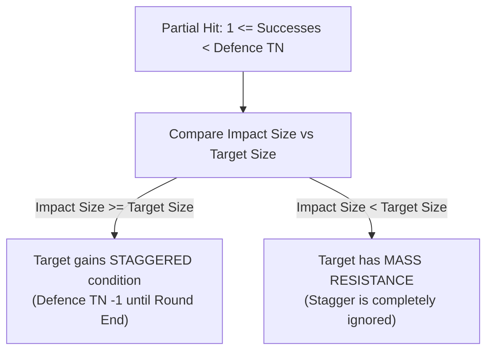

### Calculating Impact Size
**Impact Size** = **Attacker Base Size** + **Weapon Trait Modifiers**

*   **Attacker Base Size:** A Goblin Boss is **Size 1**. A Mob has a base size equal to its current **Mob Size** (1 to 5).
*   **`Heavy` Weapon Trait:** Grants **+1 Impact Size** (e.g. a Size 1 Boss wielding a heavy two-handed maul strikes with **Impact Size 2**).
*   **`Crushing` Weapon Trait:** Grants **+2 Impact Size** (e.g. a Size 1 Boss swinging a wrecking flail strikes with **Impact Size 3**).
*   **Explosives & Spells:** Explosive blast devices and magic attacks possess an Impact Size equal to their **Tier** (Tier 1 = Impact Size 1, Tier 2 = Impact Size 2, Tier 3 = Impact Size 3, Tier 4 = Impact Size 4, Tier 5 = Impact Size 5).

### Stagger Evaluation & Mass Resistance
*   **Stagger Applied (Impact Size >= Target Size):** If the attack's Impact Size equals or exceeds the target's physical **Size**, the target is thrown violently off balance and gains the **Staggered** condition until the **Round Closure Phase**.
*   **Mass Resistance (Impact Size < Target Size):** If the attack's Impact Size is strictly less than the target's physical **Size**, the giant foe absorbs the blow without budging. The target completely ignores the Stagger effect.

>> **THE STAGGERED CONDITION:**
>> A **Staggered** enemy or Boss suffers reduced combat effectiveness:
>> *   **Enemies & Bosses:** Static **Defence TN** is reduced by **1** (to a minimum of 1).
>> *   **Goblin Bosses & PCs:** Suffer a **Bane 1 (-1d)** penalty on active **Dodge** and **Parry** rolls.
>> *   **All Staggered conditions automatically clear on all combatants at the end of each round during the Round Closure Phase.**

---

## Weapon Mechanics & Traits

Weapons provide tactical reach, modify Impact Size, and grant specialized combat properties.

### Structural Properties
*   **Handedness:** One-Handed (**1H**) weapons allow holding a Shield, torch, or Loot item in the off-hand. Two-Handed (**2H**) weapons require both hands to attack and prevent holding off-hand gear.
*   **Bulk Footprint:** Light weapons occupy **Bulk 1**; Medium weapons occupy **Bulk 2**; Heavy weapons occupy **Bulk 3**. Improvised weapons occupy **Bulk 0**.
*   **Quality & Durability:** Weapons belong to a Quality Tier (T1 Junk, T2 Scrappy, T3 Standard, T4 Superior, T5 Legendary). When a player **Fumbles** a test using a weapon, they roll a 1d6 **Break Roll**:
    *   *T1 Junk:* Breaks on a roll of **1–4**.
    *   *T2 Scrappy:* Breaks on a roll of **1–3**.
    *   *T3 Standard:* Breaks on a roll of **1–2**.
    *   *T4 Superior:* Breaks on a roll of **1**.
    *   *T5 Legendary:* **Never breaks**.

### Standard Weapon Traits

| Trait | Category | Mechanical Function |
| :--- | :--- | :--- |
| `Heavy` | Offensive | Adds **+1 to Impact Size** when calculating Stagger. Requires two hands (**2H**). |
| `Crushing` | Offensive | Adds **+2 to Impact Size** when calculating Stagger. Requires two hands (**2H**). |
| `Cleave X` | Offensive | Sweeps across frontline ranks. Deals damage simultaneously to up to **X adjacent standard targets** or up to **X lowest active health dice** in an enemy Mob. |
| `Reach` | Tactical | Allows melee attacks against targets in an adjacent connected Zone without moving into that Zone. |
| `Concealable` | Utility | Compact profile (**Bulk 1**). Can be drawn or stowed as an incidental **Free Action** once per turn. |
| `Versatile` | Tactical | Balanced one-handed profile (**1H**). Can be swung with two hands to gain **+1 Impact Size**. |
| `Piercing` | Tactical | Precision point. Effective against armored foes; suffers **Bane 1 (-1d)** against skeletal Undead. |
| `Bashing` | Tactical | Blunt impact. Grants **Boon 1 (+1d)** to Melee Attack pools against brittle or skeletal Undead. |

---

## Formal Weapon Structural Schema

[CONTENT EXTENSION POINT: Weapons]

All weapon instances, armory catalogues, and custom forge chassis must adhere strictly to this standardized schema:

```markdown
### [Weapon Name]
*   **Category:** [Melee | Ranged | Improvised]
*   **Quality Tier:** [T1 Junk | T2 Scrappy | T3 Standard | T4 Superior | T5 Legendary]
*   **Hands Required:** [1H | 2H]
*   **Bulk:** [Integer 0 to 3+]
*   **Range:** [Current Zone (Melee) | 1 Zone | 2 Zones | 3 Zones]
*   **Base Impact Size:** [Wielder Size | Wielder Size + 1 | Wielder Size + 2]
*   **Attack Stat Profile:** [`Tough` (Melee) | `Slink` (Ranged)] vs Target Defence TN
*   **Break Roll Threshold:** [Breaks on 1–4 | Breaks on 1–3 | Breaks on 1–2 | Breaks on 1 | Never breaks]
*   **Built-in Traits:** [`Heavy`, `Crushing`, `Cleave X`, `Reach`, `Concealable`, `Versatile`, `Piercing`, `Bashing`]
*   **Elemental / Material Tags:** [Optional bracketed tags, e.g. `[Fire]`, `[Spiked]`, `[Silvered]`]
*   **Special Mechanical Capabilities:** [Direct Tier A rules permissions or situational boons]
```

---

## Armor & Shields Mechanics

Armor and shields provide passive protection, absorb incoming blows, and enable active parrying reactions.

### Passive Armor Dice
Worn armor provides bonus colored dice (the **Armor Dice pool**) that are thrown alongside active defense dice during a **Clatter Roll**:
*   **Light Armor (Bulk 1 | 0 Bane):** Grants **+1d Armor Die**. Flexible and quiet; imposes zero mobility or stealth penalties.
*   **Medium Armor (Bulk 2 | Bane 1):** Grants **+2d Armor Dice**. Stiff leather or mail; imposes **Bane 1 (-1d)** on all **Slink** tests.
*   **Heavy Armor (Bulk 3 | Bane 2):** Grants **+3d Armor Dice**. Rigid plate; imposes **Bane 2 (-2d)** on all **Slink** tests, and the wearer **cannot swim** (sinks instantly in Deep Water).

### Shield Mechanics
*   **Armor Bonus:** Equipping a Shield (**Bulk 1 | 1H**) grants **+1d Armor Die** to your passive mitigation pool.
*   **Enables Parry Reaction:** Wielding an active Shield unlocks the ability to declare a **Parry** reaction using your **Tough** stat instead of being limited to a Slink Dodge.

### Passive Mitigation Ceiling
>> **THE 5D MITIGATION CEILING:**
>> The total passive mitigation pool rolled on any single Clatter Roll (combining Armor Dice, Shield bonus dice, and Slink Passive Defence dice) is hard-capped at **5d6 Armor Dice** to prevent absolute invulnerability.

### Ablative Gear Sacrifice Rule
When a Goblin Boss suffers an incoming strike with enough unmitigated damage to reduce their **Grit to 0** (or cause immediate death), the Boss may declare an immediate **Gear Sacrifice**:
*   **The Shatter:** The Boss permanently destroys one equipped Shield or suit of Armor on the spot, reducing the item to worthless, unrepairable scrap.
*   **The Salvation:** The sacrifice completely absorbs the lethal impact, reducing the incoming strike's damage to **0**.
*   *(Note: This rule applies strictly to PC Goblin Bosses; Mobs do not track individual ablative gear).*

---

## Formal Armor & Shield Structural Schema

[CONTENT EXTENSION POINT: Armor & Shields]

All protective gear instances and shields must adhere strictly to this schema:

```markdown
### [Armor / Shield Name]
*   **Category:** [Light Armor | Medium Armor | Heavy Armor | Shield | Heavy Pavise]
*   **Quality Tier:** [T1 Junk | T2 Scrappy | T3 Standard | T4 Superior | T5 Legendary]
*   **Slot / Hands:** [Worn (Body) | 1H (Held)]
*   **Bulk:** [Integer 1 to 3] (For Mobs: Bulk Rating x Mob Size)
*   **Passive Armor Dice:** [+1d | +2d | +3d]
*   **Mobility Penalties:** [None | Bane 1 (-1d) on Slink | Bane 2 (-2d) on Slink, Cannot Swim]
*   **Break Roll Threshold:** [Breaks on 1–4 | Breaks on 1–3 | Breaks on 1–2 | Breaks on 1 | Never breaks]
*   **Special Mechanical Properties:** [e.g. Enables Tough Parry reaction, Ablative Sacrifice eligible]
*   **Elemental / Material Tags:** [Optional bracketed tags, e.g. `[Reinforced]`, `[Spiked]`, `[Insulated]`]
```

---

## Gear, Tools & Consumables Mechanics

Expedition tools, alchemical explosives, and utility gear provide non-combat problem solving and area threat projection.

### Design Mandate: Difficulty & Permissions
Tools never grant "+1 flat math modifiers" to die faces. Instead, tools operate through three clear mechanisms:
1.  **Narrative Permission:** Enables a task that is otherwise physically impossible (e.g. a 30 ft rope allows climbing sheer cliffs).
2.  **Difficulty Step Shift:** Reduces test Difficulty (e.g. Quality Lockpicks shift lockpicking from **Hard (6)** to **Normal (5+)**).
3.  **Dice Boons:** Adds physical dice to the test pool (**Boon 1 (+1d)**).

### Consumables & Explosive Area Threat Profiles
Explosives (grenades, molotovs, powder kegs) do not roll single-target attack pools. When thrown or detonated, they project an **Area Threat Profile** across their target Zone:

**Area Threat Profile** = `Threat [Difficulty]+/[TN]`, `[Damage]`, `[Tags]`, `Blast Range: X Zones`, `Impact Size: Y`

*   **PC Bosses in Blast Zone:** Must resolve an immediate **Clatter Roll** (Dodge vs Threat TN) or suffer full blast damage to Grit.
*   **Mobs in Blast Zone:** May execute an active **Scatter** reaction or suffer blast damage applied simultaneously to all health dice.
*   **Standard Minions in Blast Zone:** Instantly destroyed if the explosive's Threat TN >= Minion Defence TN.
*   **Elite Enemies in Blast Zone:** Take 1 Wound if Threat TN >= Defence TN, and gain **Staggered** if blast Impact Size >= Enemy Size.

---

## Formal Gear, Tools & Consumables Schema

[CONTENT EXTENSION POINT: Gear, Tools & Consumables]

All adventuring gear, tools, and consumables must adhere strictly to this schema:

```markdown
### [Item Name]
*   **Category:** [Adventuring Tool | Utility Gear | Consumable / Explosive | Loot Plunder]
*   **Quality Tier:** [T1 Junk | T2 Scrappy | T3 Standard | T4 Superior | T5 Legendary]
*   **Bulk:** [Integer 0 to 4+]
*   **Usage Lifespan:** [Permanent | Single-Use Expended | 1 Exploration Phase]
*   **Break Roll Threshold:** [Breaks on 1–4 | Breaks on 1–3 | Breaks on 1–2 | Breaks on 1 | Never breaks]
*   **Mechanical Function:** [Permission rule, Difficulty step shift, or Boon (+1d)]
*   **Area Threat Profile** *(Consumables only)*: `Threat [Face]+/[TN]`, [Damage], `[Tags]`, Blast Range: [X Zones], Impact Size: [Tier 1–5]
*   **Loot Value** *(Plunder only)*: [Tier 1–5 Value tokens]
```

---

## The Clatter Defense Roll

The **Clatter Roll** is the core defensive mechanic in **Gobbos**. When an enemy strikes during the **Enemy Active Turn**, the GM announces the attack's **Threat Profile** (`Threat [Face]+/[TN]`) and flat **Damage**. The defending Goblin Boss resolves defense in a single simultaneous throw.

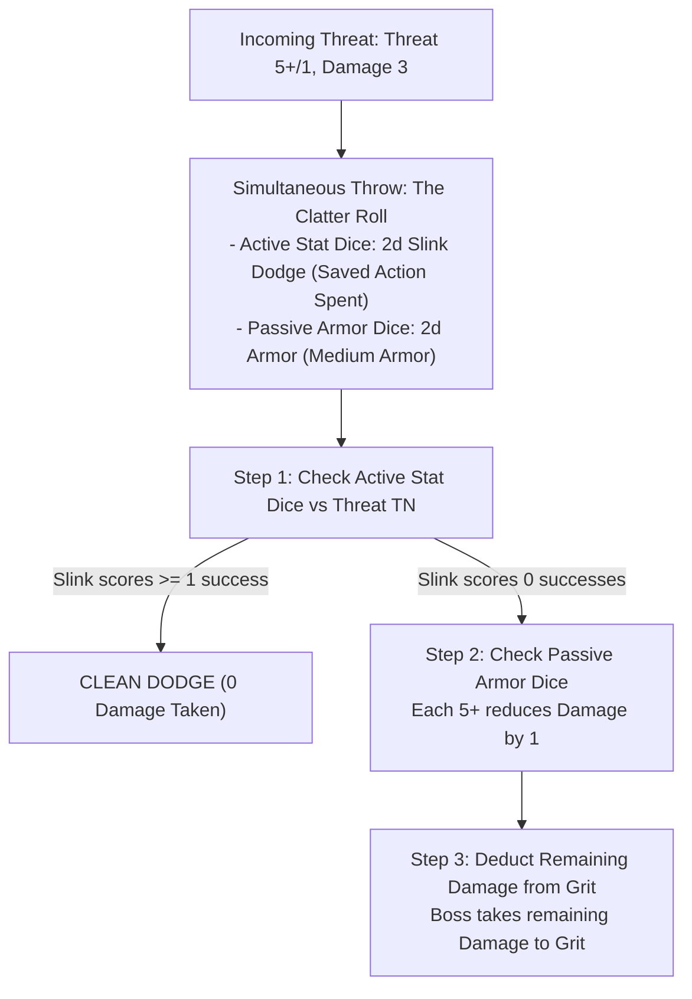

### Step-by-Step Clatter Roll Procedure

1.  **Saved Action Declaration:** To roll active **Stat Dice**, the Boss must spend one saved **Standard Action** (declaring a **Dodge** using `Slink`, or a **Parry** using `Tough` if equipped with a Shield).
    *   *Zero Saved Actions:* If the Boss spent all 3 actions on their active turn, they cannot roll Stat Dice and must rely entirely on passive Armor Dice.
2.  **Simultaneous Throw:** The player rolls their active Stat Dice alongside their distinct colored **Armor Dice** (plus any Slink Passive Defence dice) in a single roll.
3.  **Evaluating Active Evasion:**
    *   If successes on active **Stat Dice** meet or exceed the incoming **Threat TN**, the Boss achieves a **Clean Dodge/Parry**: **0 Damage is taken**.
4.  **Evaluating Armor Mitigation:**
    *   If active Stat Dice fall short of the Threat TN (or if 0 saved actions were available), the attack hits.
    *   Every success (**5+**) rolled on the **Armor Dice** reduces incoming Damage by **1**.
5.  **Grit Decrement:** Any remaining unmitigated damage is deducted directly from the Boss's **Grit** (see [Damage, Grit & Wounds](07_Damage_Grit_and_Wounds.md)).

---

## Group Attacks & Flanking

To prevent table slowdown and avoid draining all player reaction actions against large swarms of lesser foes, the GM uses **Group Attacks**.

### Group Attack (Enemy Swarm) Rules
When multiple standard minions gang up on a single Goblin Boss:
*   **Consolidated Attack:** The GM combines up to **3 standard enemies** into a single incoming strike.
*   **Damage Scaling:** The attack uses the primary enemy's Threat profile, and deals:
    **Group Damage** = **Base Enemy Damage** + (1 Damage per additional enemy)
*   **Single Defense Resolution:** The defending Boss spends only **one (1) saved Standard Action** to resolve a single Clatter Roll against the entire combined swarm attack.
*   **Targeting Cap:** A maximum of 3 standard enemies may combine against a single PC Boss. (Attacks against player Mobs have no grouping cap).

### Flanking & Crossfire Boons
*   **Flanking in Melee:** If two allied Bosses (or a Boss and an allied Mob) engage the same enemy from different approach vectors or surround a foe within a Zone, both attackers gain a **Boon 1 (+1d)** on their Melee Attack rolls.
*   **Crossfire in Ranged:** If ranged attackers target an enemy from two separate connected Zones, ranged attacks against that target gain a **Boon 1 (+1d)**.

---

## Mechanical Gap Analysis & Missing Rules

[MISSING RULE / GAP: Dual-Wielding Light Melee Weapons — Character creation permits equipping two Light Melee weapons, but the core combat rules lack an explicit mechanical rule for dual-wielding. Suggested Resolution: Wielding a secondary off-hand Light Melee weapon grants either a passive Boon 1 (+1d) to Melee Attack pools or allows splitting successes across two distinct adjacent targets in the same Zone on a single Attack action.]

[MISSING RULE / GAP: Ranged Weapon Ammunition Tracking and Depletion — Rules specify slings use scavenged stones, but bows and crossbows lack explicit ammunition management. Suggested Resolution: Standardize that a mundane Quiver/Bolt Case occupies Bulk 1 (providing sufficient ammunition for an entire raid). Fumbling a ranged attack roll with a bow or crossbow expends or breaks the active ammunition supply, requiring a Manipulate action in a Junk Pile or spending 1 Scrap to restock.]

---

<a id="doc-8"></a>
<!-- ============================================================ -->
<!-- DOCUMENT 8: 02_PROD_Core_Rules/06_Mob_Mechanics.md -->
<!-- ============================================================ -->
# Mob_Mechanics
*Source: `02_PROD_Core_Rules/06_Mob_Mechanics.md`*

# Mob Mechanics

*A Goblin Boss is only as terrifying as the screaming swarm of runts behind you. A Mob is your living shield, your sledgehammer, and your treasure wagon. When ordered well, they overwhelm knights and plunder vaults; when left to their own devices, they pick their noses, argue over shiny pebbles, and set things on fire.*

---

## Mob Anatomy & Metrics

A **Mob** is a collection of lesser goblins under the direct command of a **Goblin Boss** (Player Character). Mobs do not possess individual attribute ratings; all of their combat strength, physical mass, and carrying capacities scale from their current **Size** rating (ranging from **Size 1** to **Size 5**).

| Classification | Size | Combat Dice | Required Grunt | Loot Capacity |
| :--- | :---: | :---: | :---: | :---: |
| **Runt Mob** | **1** | **1d6** | **1** | **4 Bulk** |
| **Skirmish Group** | **2** | **2d6** | **2** | **8 Bulk** |
| **Raid Troop** | **3** | **3d6** | **3** | **12 Bulk** |
| **War Gang** | **4** | **4d6** | **4** | **16 Bulk** |
| **Horde Company** | **5** | **5d6** | **5** | **20 Bulk** |

### Core Mob Attributes
1.  **Combat & Tough Dice Pool:** A Mob rolls a physical dice pool equal to its current **Size** (**1d6 to 5d6**) for Melee Attacks, physical force, lifting, and **Tough** hazard tests.
2.  **General Skill Baseline:** For non-physical tests (**Slink**, **Brains**, and **Mouth**), a Mob rolls a flat baseline pool of **2d6**, reflecting the aggregate cunning of the crowd.
3.  **Required Grunt:** To maintain absolute authority without command resistance, the controlling Boss must maintain a current **Grunt >= Mob Size**.
4.  **Loot Capacity:** A Mob carries up to **Size x 4 Bulk** in loose Loot and expedition gear without suffering encumbrance penalties.
5.  **Over-Laden Mobs:** If a Mob carries Bulk exceeding its Loot Capacity (up to a hard cap of **Size x 6 Bulk**), it becomes **Over-Laden**: its Movement is reduced by **-1 Zone** per Move action (minimum 1 Zone) and it suffers a **Bane 1 (-1d)** penalty on all physical tests.

---

## Mob Equipment & Loot Tradeoff

A Boss can outfit a Mob with protective armor and specialized tools, but doing so directly consumes the Mob's carrying capacity.

### Mob Armor (Scaled Bulk)
Equipping an entire Mob with armor requires sufficient scrap-plates or quilted hides for every runt in the Mob.
*   **Bulk Cost:** Mob Armor costs **Bulk equal to the Armor's Bulk rating multiplied by current Mob Size** (e.g. Light Armor costs Size x 1 Bulk; Medium Armor costs Size x 2 Bulk).
*   **Passive Armor Dice:** An armored Mob rolls its passive Armor Dice (+1d or +2d) **once per incoming attack**. Every success (**5+**) reduces incoming damage by 1 across all targeted health dice before damage is applied.
*   **Casualty Scaling:** When a Mob suffers casualties and loses Size, the armor of the fallen goblins remains on their corpses on the battlefield. Equipped Mob Armor never causes an encumbrance overload when Size drops.

### Expedition Tools & Weapons
*   **Shared Expedition Tools:** Expedition tools (such as Ropes, Crowbars, Lanterns, and Shovels) are shared across the Mob. Each tool occupies its standard flat **Bulk** rating (e.g. 1 Bulk for a Climbing Rope).
*   **Mob Weapons:** Equipping a Mob with specialized weapons (e.g. Cleavers or Greatclubs) costs **Size x Weapon Bulk**, granting the entire Mob the weapon's traits (e.g. `Heavy` granting +1 Impact Size, or `Cleave` damaging additional unengaged frontline dice).

---

## Health Dice Pool & Damage Resolution

A Mob's health is physically represented on the gaming table by a pool of **d6s equal to its current Size**, with each die starting at the **"6" face**.

> **Example (Size 3 Mob at Full Health):** `[Die 1: Face 6]` `[Die 2: Face 6]` `[Die 3: Face 6]`

### Damage Delivery Modes

| Attack Delivery Type | Mechanical Resolution Across Health Dice Pool |
| :--- | :--- |
| **Single-Target Attack** | Deduct from lowest-value active die. Spillover into next lowest die if reduced below 1. |
| **Mob-on-Mob Melee** | **The Frontline Rule:** Deduct damage simultaneously from min(Attacker Size, Defender Size) lowest-value dice. |
| **Cleaving Strike (`Cleave X`)** | Deduct damage simultaneously from up to X lowest-value active health dice. |
| **True Area Threat (`[AoE]`, Explosives)** | **Full Zone AoE:** Deduct damage simultaneously from EVERY SINGLE active health die in the Mob's pool. |

1.  **Single-Target Damage & Spillover:** Single-target strikes (arrows, single sword thrusts) apply damage directly to the Mob's **lowest-value active health die**. If the die drops below 1, that die is permanently removed from the table (reducing Mob Size by 1), and any remaining excess damage **spills over** into the next lowest die.
2.  **The Frontline Rule (Mob-on-Mob Melee):** When two Mobs clash in close combat, the attacking Mob strikes a number of health dice equal to its own current Size: **min(Attacker Size, Defender Size)**.
    *   *Lowest Dice First:* Damage is applied simultaneously to the defender's lowest-value health dice up to the engagement cap.
    *   *Simultaneous Reduction:* Each engaged die is reduced by the attack's effective damage. Any die reduced below 1 is removed.
    *   *Backline Immunity:* Unengaged backline dice suffer **0 damage**.
3.  **Cleaving Attacks (`Cleave X`):** Strikes with `Cleave X` sweep across frontline ranks, applying damage simultaneously to **up to X of the Mob's lowest-value active health dice**.
4.  **True Area Threats (`[AoE]` & Explosives):** Full-zone hazards, blast devices, and dragon breath apply damage simultaneously to **every single active health die** in the Mob's pool without an engagement cap.
5.  **Casualties & Dropped Loot:** When a Mob shrinks in Size, its Loot Capacity shrinks immediately. If carried loose Loot and tools exceed the new capacity, the controlling Boss must immediately declare which items are dropped onto the Zone floor.
6.  **Post-Combat Regrouping:** Mid-combat health dice redistribution is strictly forbidden. Once an active battle concludes (or during the Round Closure of Combat End), the Boss may freely rearrange remaining health points across all surviving dice. Lost Size can only be replenished through recruitment during the Lair Phase.

> **Example (Frontline Clash):** A Size 4 Goblin Mob has health dice reading `[6, 4, 2, 1]`. A Size 2 Town Guard unit attacks and deals 2 damage. Because the guards are Size 2, they engage the 2 lowest dice (`[1]` and `[2]`). Both dice take 2 damage and are reduced below 1 and removed. The Goblin Mob is now Size 2, with surviving dice `[6, 4]`.

---

## Boss Orders & Command Flow

A Mob receives **two (2) actions** per round, reset at Round Start. Mobs act during the **Player Active Turn** when directed by their Boss.

### Command Line of Sight & Distance
*   **Visual Line of Sight:** The Boss must maintain direct visual line of sight to the Mob (or a portion of the Mob) to issue verbal or somatic commands.
*   **Command Test Profile:** Issuing an Order to a controlled Mob within Grunt limits in the same Zone requires no roll (**Automatic Success**). When commanding across distances or exceeding Grunt, resolve using this profile:

| Command Factor | Distance / Condition | Command Resolution Rule |
| :--- | :--- | :--- |
| **Size <= Grunt** | Baseline | **Target Number (TN) = 1** |
| **Size > Grunt** | Rebellious Swarm | **TN increases by +1 per point of difference** |
| **Same Zone** | Point-blank | **+1 Automatic Success** (Guaranteed pass if Size <= Grunt) |
| **Distance <= Mouth** | Voice Range | **Normal (5+)** Difficulty test |
| **Distance = Mouth + 1** | Shouting Range | **Hard (6)** Difficulty test |
| **Distance > Mouth + 1** | Out of Range | **Command is physically impossible** |

### The Boredom Rule
>> **THE BOREDOM RULE:**
>> Goblins possess notoriously short attention spans. An ordered Mob cannot perform the exact same action twice in a single round (e.g. a Mob cannot Attack twice or Plunder twice).
>> *Exception:* A Mob may spend both actions taking **Move** actions if they are fleeing or charging.

### Action Economy Allocation
*   **Spending 2 Actions:** If an Order directs a Mob to spend both actions (e.g. Move then Attack), the Mob has 0 saved actions remaining for defense reactions.
*   **Saving 1 Action:** If an Order directs a Mob to spend only 1 action (e.g. Move into cover), its second action is saved, enabling the Boss to order an active **Scatter** reaction during the Enemy Active Turn.

---

## Unordered Mob States & Behavior Tables

Mobs that receive no direct orders from their Boss resolve their actions at the end of the **Player Active Turn** (after all player characters have finished their declarations).

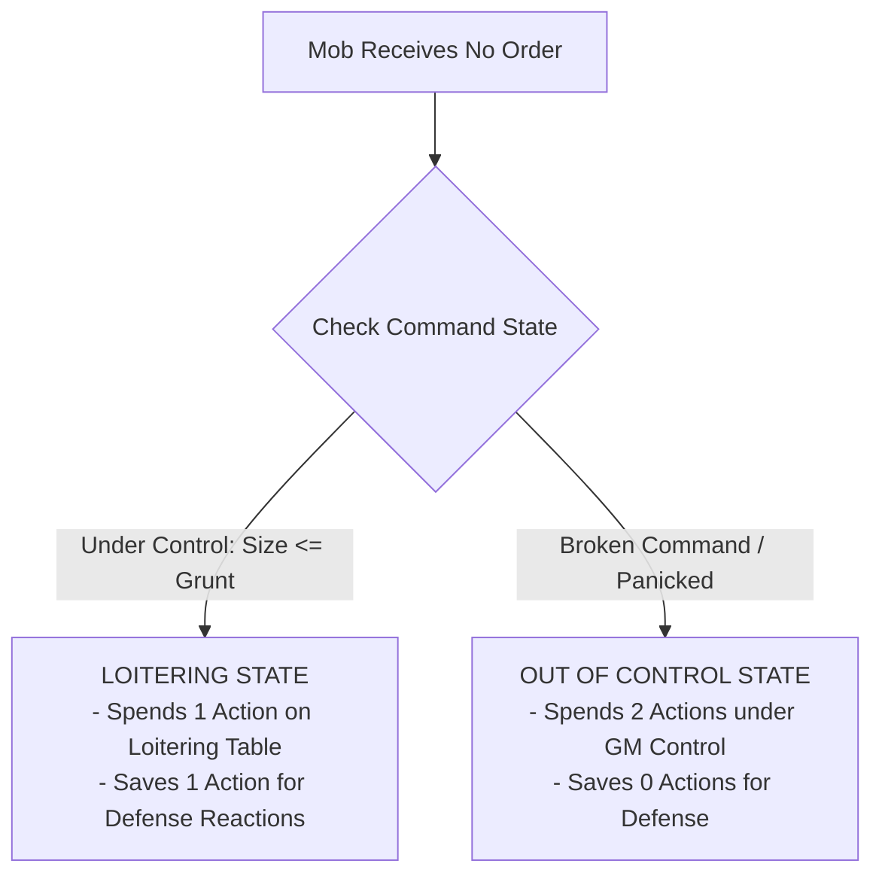

### Loitering Table (1d6)
*Under control, but idle. The Mob spends **1 action** resolving the rolled behavior and saves **1 action** for defense:*

*   **1 (Bicker):** Goblins push, argue, and complain. *(Spends 1 action, saves 1 action).*
*   **2 (Inspect):** Runts pick their noses, stare at architecture, or draw crude graffiti. *(Spends 1 action, saves 1 action).*
*   **3 (Snatch):** Goblins plunder a loose shiny object or eat nearby rations (resolves as a Plunder action if Loot is present). *(Spends 1 action, saves 1 action).*
*   **4 (Wander):** The Mob scurries **1 Zone** in a random direction, refusing to leave visual line of sight of their Boss. *(Spends 1 action, saves 1 action).*
*   **5 (Snoop):** The Mob peers around curiously, granting a **Boon 1 (+1d)** to the next allied Boss who tests to search or disarm traps in the Zone. *(Spends 1 action, saves 1 action).*
*   **6 (Taunt):** Goblins scream insults, rattle pots, and moon the nearest enemy. *(Spends 1 action, saves 1 action).*

### Out of Control Table (1d6)
*Uncontrolled swarm. The Mob spends **both actions** running amok under GM direction (0 saved actions):*

*   **1–2 (Panic / Flee):** If a **Terrifying Enemy** (Elite, Boss, or creature with `[Frightening]`) is present, the Mob spends both actions fleeing toward the nearest exit. Otherwise, they squabble violently: the Mob takes **1 Damage** to its lowest health die and gains the **Staggered** condition. *(Spends 2 actions, 0 saved).*
*   **3–4 (Loot / Trash):** If unattended loot or food is present, the Mob plunders it (eating food heals **1d6 damage** on its health dice). Otherwise, they spend both actions vandalizing doors, crates, and scenery. *(Spends 2 actions, 0 saved).*
*   **5–6 (Frenzy):** The Mob swarms and attacks the nearest living creature in their Zone (friend or foe!). If no creatures are present, they sprint **1 Zone** toward the loudest noise. *(Spends 2 actions, 0 saved).*

### Rallying & Regaining Control
To restore command over an **Out of Control** Mob, the Boss must spend a Standard Action (**Order**) on your turn and pass a **Mouth** test against the standard command distance profile. On a success, the Mob immediately returns to the **Ordered** state; on a failure, it remains Out of Control.

---

## Mob Defense & The "Scatter!" Reaction

Mobs do not possess individual stats and cannot naturally perform a Dodge or Parry. When targeted by an incoming attack during the **Enemy Active Turn**:

### 1. Passive Armor Roll
If equipped with Mob Armor, the player rolls the Mob's passive **Armor Dice** once per incoming attack. Every success (**5+**) reduces incoming damage by **1** across all targeted health dice before damage is applied.

### 2. The "Scatter!" Order Reaction
If the Mob has at least **1 saved action remaining**, the Boss may spend a saved Standard Action (or an unused **Free Order**) to scream "Scatter!":

1.  **Assemble Mouth Pool:** The Boss rolls a dice pool equal to the Boss's **Mouth** stat.
2.  **The Size Penalty:** Large swarms are clumsy to disperse. The Scatter TN equals the attack's Threat TN plus the Mob's Size penalty:
    **Scatter TN** = **Threat TN** + (**Mob Size** - 1)
3.  **Clean Scatter:** If Mouth successes >= Scatter TN, the Mob evades completely (**0 Damage taken**) and immediately moves **1 Zone** into available cover.
4.  **Failed Scatter:** If Mouth successes < Scatter TN, the Mob takes incoming damage normally, mitigated only by passive Armor Dice.
5.  **The Scatter Gamble (Gobbo Gamble):** If the initial Scatter roll falls short, the Boss may reroll all **1s** on the Mouth dice. 
    *   *If the Gamble Succeeds:* The Mob pulls off a chaotic miracle dive, taking **0 Damage**.
    *   *If the Gamble Fails:* Catastrophic stampede! The Mob takes the full attack damage, suffers **1 Trample Damage to EVERY active health die** in its pool, drops **1 Bulk** of carried Loot, and immediately becomes **Out of Control**. If the Boss occupies the same Zone, the Boss is caught in the stampede and gains the **Staggered** condition.

---

## Morale & Swarm Terror

Goblins are cowardly by nature. When battle turns against them, discipline shatters.

### Player Mob Morale Checks
*   **Trigger:** Occurs during the **Round Closure Phase** if a Mob lost **50% or more of its starting Size** during the round, or if its controlling Boss was incapacitated.
*   **The Check:** The Boss must pass an immediate **Mouth** or **Grunt** test against **Normal (5+/1)** difficulty (or **5+/2** if facing a `[Terrifying]` foe).
*   **Failure:** The Mob breaks command and enters the **Out of Control** state, fleeing toward the exit on its next turn.

### Enemy Morale & The Swarm Terror Check
When an enemy group suffers catastrophic loss (50% casualties or their commander is slain), the player horde unleashes their collective terror:

**Swarm Terror Pool** = **Surviving Mob Sizes in Zone/Adjacent** + **Surviving Bosses in Zone/Adjacent**

*   **The Roll:** Players roll the combined **Swarm Terror Pool** against the enemy's static **Morale TN** (typically 1 to 3).
*   **Success (Successes >= Morale TN):** The enemy force breaks and flees toward the nearest exit for 2 actions per turn until off the map.
*   **Commander Rally:** A surviving Enemy Commander can spend 1 action on their active turn to attempt a Rally, testing against the players' Swarm Terror profile.

---

## Splitting, Merging & Cross-Gang Mobs

### Splitting a Mob
A Boss can spend one **Order Action** to split a Mob into two smaller Mobs:
*   **Dice Distribution:** The Boss freely divides active health dice between the two new Mobs (e.g. a Size 5 Mob splits into Size 3 and Size 2).
*   **Gear Distribution:** Equipped Mob Armor travels with the goblins wearing it (both Mobs retain the armor tier). Carried tools are explicitly assigned to one of the split Mobs.

### Merging Mobs
Two allied Mobs occupying the same Zone can be merged into a single Mob using an **Order** or **Manipulate** action:
*   **Dice Combination:** Add surviving health dice together. Total combined Size **cannot exceed the Boss's Grunt** (otherwise an immediate Rebellion test is triggered: Mouth or Tough `5+/Size`).
*   **Armor Dilution:** If an armored Mob merges with an unarmored Mob, the armor is diluted and drops by **1 Tier** (e.g. Medium Armor becomes Light Armor) unless additional armor is equipped.

### The Super-Mob (Cross-Gang Merging)
Mobs belonging to different player Gangs can merge into a single colossal **Super-Mob**:
*   **Command Friction:** Any Boss attempting to issue an Order to a Cross-Gang Super-Mob must pass a **Grunt test** (**Tough** if in the same Zone, or **Mouth** from afar).
*   **In-Fighting Trigger:** Whenever a Cross-Gang Mob rolls a dice pool for *any check* (Attack, Move, or Hazard), **every 1 rolled deals 1 self-inflicted Damage to the Mob's active health dice**.

---

## Mob Sacrifice Maneuvers

When a Gang lacks proper tools, a Boss can order expendable runts into desperate tactical maneuvers:

| Maneuver Name | Minimum Mob Size | Cost | Mechanical Benefit |
| :--- | :---: | :--- | :--- |
| **Gobbo Pyramid** *(Living Ladder)* | **Size 2** | **1 Mob Action** | Goblins stack onto shoulders. An allied Boss or character climbs **1 vertical Zone** without making a climbing test. |
| **Living Bridge** *(Chasm Crosser)* | **Size 3** | **1 Mob Action** + **1 Mob Damage** | Goblins link arms across a chasm. Allied characters walk across safely without tests. The Mob takes 1 Damage from trample strain. |
| **Canary Runt** *(Trap Tripper)* | **Size 1** | **1 Mob Health Die** | A single runt triggers a discrete pressure trap or tests thin ice, clearing the passage safely for the rest of the gang. |
| **Meat Cushion** *(Soft Landing)* | **Size 1** | **Mob Reaction** (Takes Fall Damage) | If a Boss falls into a Zone occupied by an allied Mob, the Mob absorbs the blow: Boss takes **0 Damage**; Mob takes the full fall damage across its health dice. |
| **Gnaw the Hinges** *(Pry-bar Substitute)* | **Size 2** | **1 Mob Action** | The Mob tears at locked doors or chest hinges. Roll a `Tough` test (**Size dice**). If the test fails after pushing 1s, the Mob takes **1 Damage** from chipped teeth and crushed fingers. |

---

## Mechanical Gap Analysis & Missing Rules

[MISSING RULE / GAP: Mob Weapon Equipping & Scaling Rules — While Mob armor and tools have detailed Bulk rules, rules for outfitting Mobs with specialized melee weapons (e.g. Greatclubs, Cleavers, Polearms) lack an explicit framework in early drafts. Suggested Resolution: Standardize that equipping a Mob with specialized weapons costs Size x Weapon Bulk from their Loot Capacity, granting the entire Mob the weapon's built-in traits (such as Cleave or Heavy +1 Impact Size).]

[MISSING RULE / GAP: Maximum Swarm Terror Pool Ceiling — In massive multi-player raids with multiple Size 5 Mobs, Swarm Terror dice pools can reach 15d–20d6, mathematically guaranteeing enemy routs. Suggested Resolution: Cap the Swarm Terror dice pool at a maximum of 8d6 on any single Morale test, ensuring high-morale commanders retain a viable chance to hold the line.]

---

<a id="doc-9"></a>
<!-- ============================================================ -->
<!-- DOCUMENT 9: 02_PROD_Core_Rules/07_Damage_Grit_and_Wounds.md -->
<!-- ============================================================ -->
# Damage_Grit_and_Wounds
*Source: `02_PROD_Core_Rules/07_Damage_Grit_and_Wounds.md`*

# Damage, Grit, Conditions and Wounds

*Goblins are squishy, breakable, and full of bad ideas. When a tall-man swings a poleaxe, you do not absorb the blow with stoic dignity. You duck, you shriek, your armor dents, or you get flattened into paste. Surviving a raid is not about being unbreakable; it is about making sure someone else takes the hit.*

---

## 1. Damage Resolution and Boss Grit

The Game Master (GM) never rolls attack tests or damage rolls. All enemy attacks present a deterministic **Threat Profile** (`Difficulty+/TN`) and a flat **Damage** value (see [Adversaries & Threats](12_Adversaries_and_Threats.md)).

### Boss Grit Pool
**Grit** is the mechanical tracker for a **Goblin Boss's** personal survival, physical stamina, and sheer luck. 
*   **Starting Grit:** A **Goblin Boss** has a maximum **Grit** determined strictly by the **Tough** attribute score (see [Boss Profile & Gang](02_Boss_Profile_and_Gang.md)):
    *   **Tough 1:** 3 **Grit**.
    *   **Tough 2–3:** 4 **Grit**.
    *   **Tough 4–5:** 5 **Grit**.
*   **The Synonym Ban:** A **Goblin Boss** tracks **Grit**. A **Goblin Boss** never tracks *Health* or *Wounds*. **Health Dice** are used exclusively by **Mobs** (see [Mob Mechanics](06_Mob_Mechanics.md)), and **Wounds** are tracked exclusively by **Elite** and **Boss** enemies.

### Unmitigated Damage Decrement
When an incoming attack targets a **Goblin Boss**, the **Player** resolves defense using a **Clatter Roll** (see [Combat Engine](05_Combat_Engine.md)):
1.  **Active Evasion:** If the **Player** spent a saved **Standard Action** to declare a **Dodge** (testing **Slink**) or **Parry** (testing **Tough** with a shield or heavy weapon), scoring successes equal to or exceeding the attack's **Threat TN** negates the attack entirely (**0 Damage taken**).
2.  **Passive Armor Mitigation:** If active evasion fails or no saved action was available, the **Player** rolls passive **Armor Dice**. Every die showing **5+** reduces incoming **Damage** by **1**.
3.  **Grit Loss:** Any remaining unmitigated **Damage** reduces the **Goblin Boss's** current **Grit** on a 1-for-1 basis.

>> **RULE: No Mid-Roll Modifiers**
>> Damage reduction applies strictly through passive **Armor Dice** or explicit traits before deducting points. You never perform post-roll arithmetic to alter incoming damage values.

---

## 2. Zero Grit, The Final Act, and Death

When a **Goblin Boss** reaches **0 Grit**, the character dies. However, death in Gobbos is never instantaneous or silent; it triggers a blaze of chaotic glory before the character is removed from play.

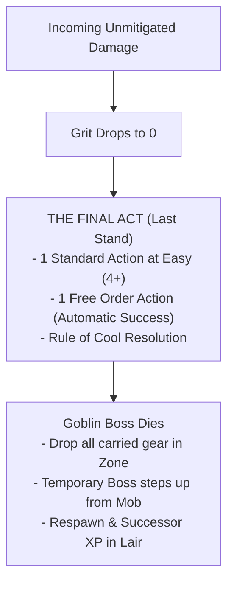

### The Final Act (Last Stand)
The moment your **Grit** reaches **0**, your **Goblin Boss** immediately triggers **The Final Act**:
*   **Action Grant:** You immediately receive **1 Standard Action** plus **1 Free Order Action**, resolved out of turn sequence before your character falls.
*   **Easy Difficulty:** The **Standard Action** is resolved at **Easy (4+)** difficulty, regardless of standard environmental penalties or combat conditions.
*   **Guaranteed Orders:** The **Order Action** succeeds automatically without a dice roll, provided the target **Mob** is within visual line of sight.
*   **The Rule of Cool:** The **GM** must interpret the outcome under the **Rule of Cool**, allowing the dying **Goblin Boss** to pull off an epic stunt, detonate a hidden explosive, shove an ally to safety, or take down a hated nemesis.
*   **Death Execution:** Once **The Final Act** concludes, the **Goblin Boss** dies permanently. All carried weapons, armor, tools, and **Loot** drop to the floor in the current **Zone**.

### The Temporary Boss
During the remainder of the active raid, the **Player** cannot generate a new full **Goblin Boss** until returning to the **Lair**:
*   **Stepping Forward:** If the deceased character's **Gang** still has a surviving **Mob** on the map, one runt steps forward as a **Temporary Boss**.
*   **Profile:** The **Temporary Boss** is controlled by the **Player**, possesses no **Quirks**, and has all attribute stats reduced by **1** compared to the deceased **Goblin Boss** (to a minimum attribute score of **1**).
*   **Survival:** The **Temporary Boss** allows the **Player** to remain active, issue commands, and extract surviving **Loot** back to the **Lair**.

### Successor Generation in the Lair
When the raid party returns to the **Lair**, the player generates a true **Successor Boss** (see [The Lair Loop & Progression](10_The_Lair_Loop_and_Progression.md)):
*   **Successor XP:** The new **Goblin Boss** starts with baseline stats plus bonus **Successor XP** equal to **Gang Infamy x 4**.
*   **Inherited Quirks:** The new character inherits 1 **Gang Mark Quirk** from the ancestral pool.
*   **Named Items:** The favorite weapon of the fallen boss can be recovered and enshrined as a **Named Item** in the **Lair**.

---

## 3. Enemy Wounds and The Overkill Rule

Adversaries do not use **Grit**. Instead, enemy casualties are resolved through two distinct mechanics based on threat tier:

### One-Hit Kill on Standard Enemies
Standard adversaries (peasants, town guards, minor beasts, skeleton grunts) possess no wound tracks:
*   **Execution:** When an attack roll scores successes equal to or greater than the standard enemy's **Defence TN**, the target is instantly killed and removed from the map.
*   **No Partial Damage:** Rolling fewer successes than the enemy's **Defence TN** inflicts **0 Damage** (though it may inflict the **Staggered** condition if **Impact Size** requirements are met).

### The Wounds Track (Elites and Bosses)
Powerful adversaries (**Elites** and **Bosses**) track survivability using a physical **Wounds Track** (ranging from **2 to 8 Wounds**).
*   **Baseline Hit:** Scoring successes equal to the target's **Defence TN** inflicts **1 Wound**.
*   **The Overkill Rule:** When a single attack roll exceeds the target's **Defence TN**, the attack deals **1 Wound for every full multiple of the Defence TN** scored on that roll:

**Wounds Dealt** = **Attack Successes** / **Target Defence TN** (rounded down)

> **Example:** A **Goblin Boss** strikes an Elite Solar Praetor (**Defence 2**, **5 Wounds**).
> *   Rolling **1 Success:** The attack fails to meet **Defence 2**. It deals **0 Wounds** (but may inflict **Staggered** if Impact Size >= Praetor Size).
> *   Rolling **2 or 3 Successes:** Scores 1 full multiple of 2. Inflicts **1 Wound**.
> *   Rolling **4 or 5 Successes:** Scores 2 full multiples of 2. Inflicts **2 Wounds**.
> *   Rolling **6 Successes:** Scores 3 full multiples of 2. Inflicts **3 Wounds**.

>> **GOLDEN RULE: No Fractional Wounds**
>> Remainder successes that do not form a complete multiple of the target's **Defence TN** are discarded. They do not carry over to subsequent attacks.

---

## 4. Impact Size and Stagger Resistance

When an attack scores at least **1 Success** but fails to meet the target's full **Defence TN**, the strike is a partial hit. A partial hit deals **0 Damage** and **0 Wounds**, but can throw the target off balance by applying the **Staggered** condition.

### Impact Size Values
Every attack possesses an **Impact Size** determined by its weapon traits, source entity, or spell tier:
*   **Standard Attack:** **Impact Size = 1** (or current **Mob Size** for **Mob** attacks).
*   **Heavy Weapon Trait:** +1 to **Impact Size** (a Size 1 **Goblin Boss** attacks with **Impact Size 2**).
*   **Crushing Weapon Trait:** +2 to **Impact Size** (attacks with **Impact Size 3**).
*   **Spells & Explosives:** **Impact Size** = **Spell/Explosive Tier** (T1 = Size 1, T2 = Size 2, T3 = Size 3, T4 = Size 4, T5 = Size 5).

### Mass Resistance Rule
A target is immune to the **Staggered** condition from partial hits unless the attack's **Impact Size** meets or exceeds the target's physical **Size**:

**Impact Size >= Target Physical Size**

*   **Size 1 Target (Humanoid/Goblin):** Staggered by **Impact Size 1** or higher.
*   **Size 2 Target (Warhorse/Bear):** Requires **Impact Size 2** or higher.
*   **Size 3 Target (Troll/Ogre):** Requires **Impact Size 3** or higher.
*   **Mass Resistance Execution:** If an attack's **Impact Size** is lower than the target's physical **Size**, the target has natural mass resistance and completely ignores the **Staggered** condition on a partial hit.

---

## 5. In-Game Status Conditions Matrix

Conditions represent temporary physiological, psychological, or tactical hindrances. Gobbos features **9 official systemic conditions**.

| Condition | Goblin Boss (PC) | Goblin Mob | Enemy / NPC |
| :--- | :--- | :--- | :--- |
| **Weakened** | **Bane 1 (-1d)** on **Tough** tests. | **Bane 1 (-1d)** on **Attack** rolls. | Attack **Threat TN** reduced by **1** (minimum 1). |
| **Restrained** | **Bane 1 (-1d)** on **Slink** tests; **Movement** becomes **0**. | Cannot **Scatter**; **Movement** becomes **0**. | **Movement** becomes **0**; **Defence TN** reduced by **1** (minimum 1). |
| **Dumb** | **Bane 1 (-1d)** on **Brains** and **Mouth** tests; cannot cast spells or activate **Brains** quirks. | **Bane 1 (-1d)** on **Morale** checks; cannot receive complex orders. | Cannot cast spells or use tactical reactions. |
| **Silenced** | **Bane 1 (-1d)** on **Mouth** tests; cannot issue verbal orders or cast vocal spells. | Cannot hear orders; **Bane 1 (-1d)** on **Morale** checks. | Cannot issue orders or shout tactical warnings. |
| **Blinded** | **Bane 1 (-1d)** on physical tests; ranged attacks are **Hard (6)**; cannot **Dodge**. | **Bane 1 (-1d)** on physical tests; ranged attacks are **Hard (6)**; cannot **Scatter**. | Attacks become **Hard (6)**; **Defence TN** reduced by **1** (minimum 1). |
| **Terrified** | **Bane 1 (-1d)** on **Brains** and **Mouth** tests; cannot move closer to source of fear. | **Bane 2 (-2d)** on **Morale** checks; **Order** tests targeting **Mob** are **Hard (6)**. | Must spend all active actions fleeing from the source of fear. |
| **Stunned** | Cannot take any **Standard Actions**, **Free Actions**, or **Reactions**. | Cannot take any actions or reactions. | Skips active turn; incoming attacks against target are **Easy (4+)**. |
| **Prone** | **Bane 1 (-1d)** on **Slink** and **Dodge** tests; costs 1 **Move** action to stand up. | **Bane 1 (-1d)** on **Scatter** tests; costs 1 **Move** action to stand up. | Incoming melee attacks against target gain **+1d**; costs 1 **Move** action to stand up. |
| **Staggered** | **Bane 1 (-1d)** on **Dodge** and **Parry** Clatter rolls. | **-1 Armor Die** (or **-1d** on **Scatter** tests). | **Defence TN** reduced by **1** (minimum 1). |

>> **RULE: Bane Stacking Limits**
>> Multiple conditions applying Banes to the same attribute do not stack beyond the standard environmental limit. A character either has a single **Bane 1 (-1d)**, a single **Bane 2 (-2d)** from a severe specific rule, or a neutral pool if countered by Boons (see [Core Resolution](01_Core_Resolution.md)).

---

## 6. Application Triggers, Duration, and Recovery

Conditions are applied by weapon traits, spells, monster abilities, or environmental hazards. They clear according to strict duration classes:

### Round-Closure Clearance (Instant Conditions)
*   **Staggered:** The **Staggered** condition is temporary. It clears automatically from all **Goblin Bosses**, **Mobs**, and **Enemies** during the **Round Closure Phase** at the end of each combat round.

### Action Clearance (Hazard & Sustained Conditions)
*   **Environmental Obstacles:** Conditions inflicted by terrain or hazards (such as **Weakened** from toxic gas, **Restrained** from sticky mud, or **Blinded** from smoke) persist while remaining in the affected **Zone**.
*   **Standard Action Recovery:** Once in a clean **Zone**, a character can clear a sustained condition by spending **1 Standard Action** (performing a **Manipulate** action to wipe eyes, cut ropes, or catch breath) and passing a **Tough 5+/1** or **Slink 5+/1** test.
*   **Combat End:** All hazard-inflicted conditions clear automatically once combat concludes and the party catches their breath.

### Rest & Medical Recovery (Downtime Afflictions)
*   **Long-Term Afflictions:** Severe conditions (such as rotting filth fever, cursed blindness, or demonic corruption) persist beyond the raid. They can only be cleansed during the **Lair Phase** through specialized apothecary treatment, surgery, or purification rituals (see [The Lair Loop & Progression](10_The_Lair_Loop_and_Progression.md)).

### Healing Rates
*   **Goblin Bosses:** A **Goblin Boss** recovers **1 Grit per hour** of quiet, uninterrupted rest outside of combat.
*   **Goblin Mobs:** A **Mob** does **not heal** lost **Size** during a raid. Fallen goblins are permanently dead. After a battle concludes, the **Goblin Boss** may freely rearrange the face values of surviving **Health Dice** (e.g. turning two dice showing `[2, 3]` into `[5]` to consolidate stability). Lost **Size** can only be replenished by recruiting new goblins in the **Lair**.

---

## 7. Condition and Hazard Structural Schema

[CONTENT EXTENSION POINT: Environmental Hazards & Conditions]

All custom environmental hazards, status effects, and zone traps must follow this structural schema:

```markdown
### [Condition / Hazard Name]
*   **Classification:** [Status Condition | Static Environmental Obstacle | Dynamic Zone Hazard | Complex Weather Blueprint]
*   **Associated Tags:** `[Tag 1]`, `[Tag 2]` (e.g. `[Toxic]`, `[Gaseous]`, `[Slick]`, `[Burning]`)
*   **Severity Tier:** [T1 Minor | T2 Dangerous | T3 Lethal / Catastrophic]
*   **Application Trigger:** [On entering zone | At start of turn in zone | On taking unmitigated damage | On failing physical check]
*   **Target Profile / Check:** `[Stat] [Target Face]+/[Successes]` (e.g. `Tough 5+/1` or `Slink 4+/2`) to resist or avoid.
*   **Mechanical Effects:**
    *   *Goblin Boss (PC):* [Specific stat penalty, Bane modifier, movement restriction, or Grit loss]
    *   *Goblin Mob:* [Specific attack penalty, Scatter restriction, health die damage, or Morale Bane]
    *   *Enemy / NPC:* [Specific Defence TN reduction, action loss, or movement cap]
*   **Duration & Persistence:** [Instant | Round-Closure Clearance | Sustained (Action-Clear) | Encounter-Bounded | Lair-Treated]
*   **Removal / Recovery Check:** [Action cost and test required to clear, e.g. Spend 1 Standard Action in clean zone testing Tough 5+/1]
```

---

## 8. Mechanical Gaps and System Clarifications

[MISSING RULE / GAP: Mid-combat redistribution of Mob health dice is explicitly forbidden. Health dice face values can only be rearranged during the Round Closure phase of Combat End or during quiet exploration outside combat to prevent game-state manipulation during active initiative rounds.]

[MISSING RULE / GAP: Player Goblin Bosses exclusively track Grit (3 to 5 points) and never possess Wounds. Wounds are strictly reserved for Elite and Boss enemy tracks, and Health Dice are strictly reserved for Mobs. Any legacy reference to PC Wounds must be treated as Grit damage.]

---

<a id="doc-10"></a>
<!-- ============================================================ -->
<!-- DOCUMENT 10: 02_PROD_Core_Rules/08_Magic_and_Bangaranga.md -->
<!-- ============================================================ -->
# Magic_and_Bangaranga
*Source: `02_PROD_Core_Rules/08_Magic_and_Bangaranga.md`*

# Magic and Bangaranga

*Goblins do not study dusty, leather-bound grimoires in high towers. We shout words carved into mossy dungeon stones, crush glowing cavern mushrooms in our bare fists, and cling to raw cosmic lightning until our teeth rattle. If you are not risking a catastrophic explosion, you are not really casting.*

---

## 1. The Pure Mechanical Casting Engine

Magic in Gobbos is unstable, highly tactile, and governed by a **Push-Your-Luck (Farkle-style)** pattern-matching dice engine. There are no mana points, spell slots, or daily casting limits. Magic is limited solely by your nerve, your **Brains** attribute, and the imminent danger of your head detonating.

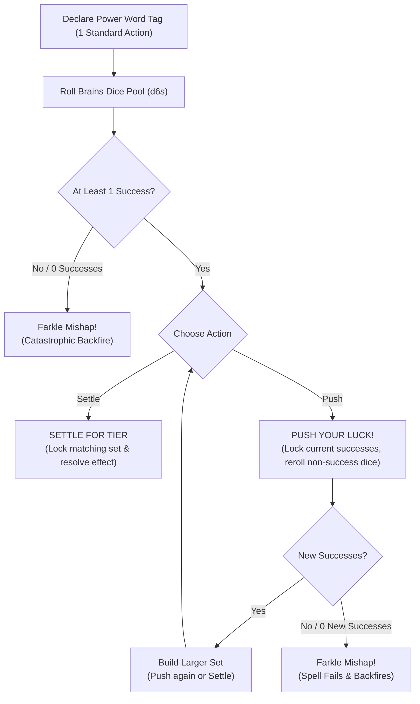

### Prerequisites to Cast
To channel the unstable currents of magic, a **Goblin Boss** must meet two mechanical requirements:
1.  **Brains Level 3+:** You must possess at least **Brains 3** to unlock **Power Word Slots**. Characters with **Brains 1** or **Brains 2** have 0 slots and cannot cast magic.
2.  **Magical Conduit:** You must possess a magic-focused **Quirk** (such as *Weirdo*, *Bone-Speaker*, or *Shaman*) or wield an active magical **Oddity** (such as a runic staff, crystal skull, or channeling wand).

### Power Word Slots and Memorization
Goblins do not learn rigid spells; they memorize **Power Words** represented by narrative **Tags** (e.g. `[Fire]`, `[Sticky]`, `[Shock]`, `[Spooky]`, `[Slip]`):
*   **Brains Level 1–2:** 0 Power Word Slots (Cannot cast).
*   **Brains Level 3:** **2 Power Word Slots**.
*   **Brains Level 4:** **4 Power Word Slots**.
*   **Brains Level 5:** **6 Power Word Slots**.
*   **Tag Swapping:** Swapping prepared **Power Words** in your slots takes place strictly in the **Lair** during the **Lair Phase** (see [The Lair Loop & Progression](10_The_Lair_Loop_and_Progression.md)). A character can attune to any Tag accessible through personal **Quirks**, carried **Gear**, or **Lair Upgrades**.

---

## 2. The Casting Step-by-Step Procedure

Casting a spell costs **1 Standard Action**. When your **Goblin Boss** casts a spell, execute the following four steps:

### Step 1 — Declare Power Word
Announce the primary **Tag** being channeled from your memorized slots (e.g. `[Fire]`, `[Toxic]`, `[Teleport]`).

### Step 2 — Roll Brains Pool
Assemble a dice pool of **d6s** equal to your **Brains** attribute (plus any optional **Bangaranga Dice** drawn from the pool). Roll against the **Difficulty** set by the **GM** based on the target's resistance or environmental warding:
*   **Easy (4+):** 4, 5, 6 are successes.
*   **Normal (5+):** 5, 6 are successes.
*   **Hard (6):** Only 6s are successes.

>> **RULE: Exploding 6s in Magic**
>> Any **6** rolled on a regular die counts as 1 success and explodes, immediately adding +1 regular die to your un-locked pool. Any **6** rolled on a **Bangaranga Die** explodes twice (+2 regular dice).

### Step 3 — Lock and Push
To maintain the spell, the roll must generate at least **one (1) success**:
*   **Settle:** You choose to stop rolling. Immediately resolve the spell's effect based on your current locked successes.
*   **Push:** You lock all current success dice and reroll all remaining non-success dice to hunt for matching faces and build higher-tier sets.

### Step 4 — The Farkle (Mishap)
If you choose to **Push** your luck and a reroll yields **zero (0) new successes**, the spell collapses into a **Farkle**. The casting fails completely, no spell effect is produced, and you must immediately roll on the **Spell Mishap** table corresponding to the spell's category.

---

## 3. Resolving Spell Tiers and Potency

The mechanical potency and area of effect of a spell are determined strictly by the size of the **largest matching set of success dice** (e.g. two 5s, three 6s, four 4s).

| Matching Set Size | Spell Tier | Delivery Footprint & Impact |
| :--- | :--- | :--- |
| **Single Success (No Pairs)** | **T1 (Minor)** | Touch / Melee (1 Success / 1 Damage) |
| **Pair (2-of-a-kind)** | **T2 (Standard)** | Ranged 1 Zone (2 Successes / 2 Damage) |
| **Triple (3-of-a-kind)** | **T3 (Heroic)** | Zone-Wide Area (3 Successes / 3 Damage) |
| **Quadruple (4-of-a-kind)** | **T4 (Blast)** | Multi-Zone Blast (4 Successes / 4 Damage) |
| **Quintuple (5-of-a-kind)** | **T5 (Legendary)** | Map-Wide Reality Warp / Annihilation |

### The Five Spell Tiers
*   **T1 Effect (Single Success, No Pairs):** Minor or niche manifestation. Inflicts 1 Grit/Size damage or grants +1 Success to an immediate physical action. Range: Touch / Melee.
*   **T2 Effect (Pair / 2-of-a-kind):** Standard tactical magic. Inflicts 2 Grit/Size damage or applies a sustained condition to 1 target. Range: Ranged (1 Zone).
*   **T3 Effect (Triple / 3-of-a-kind):** Heroic area magic. Inflicts 3 Grit/Size damage or applies a persistent condition across an entire **Zone**. Range: Zone-Wide.
*   **T4 Effect (Quadruple / 4-of-a-kind):** Destructive blast magic. Inflicts 4 Grit/Size damage or applies severe environmental hazards across the target Zone and all adjacent Zones. Range: Blast Area.
*   **T5 Effect (Quintuple / 5-of-a-kind):** Legendary encounter-scale catastrophe. Wipes out standard enemy swarms, collapses large structures, or permanently alters the battlefield topology.

### Potency (Singleton Successes)
If you roll multiple successes that do not form matching pairs (for example, rolling `[4, 5, 6]` on an Easy 4+ test), the spell resolves as a **T1 Effect**. However, every success beyond the first provides **Potency**. For each point of Potency, choose one:
*   **Extra Target:** Strike 1 additional enemy in the delivery area.
*   **Bonus Magnitude:** Add **+1 Damage** (against Grit or Mob health dice) or **+1 Success** to the spell's resolution.

> **Example:** A caster with **Brains 5** casts `[Shock]` against a **5+** profile.
> *   **First Roll:** `[5, 5, 3, 2, 1]` -> The caster locks the two `5`s (a pair -> **T2 Effect**).
> *   **The Push:** The caster wants a zone-wide lightning blast. The two `5`s remain locked, and the caster rerolls the `[3, 2, 1]`.
> *   **Second Roll:** `[5, 6, 2]` -> The roll yields a new `5` and an exploding `6`. The caster locks both. The pool now contains three `5`s (a triple -> **T3 Effect**) plus one singleton `6` (providing **1 Potency**).
> *   **Final Resolution:** The caster stops. The spell unleashes a **T3 Zone-Wide** shockwave dealing 3 damage to all enemies in the target Zone, plus +1 damage to the enemy commander from the Potency die.

---

## 4. Chaotic Leakage (Side Effects)

Channeling magical energy without precision causes raw power to bleed into the environment. Sets formed by **non-success dice** (dice faces falling below the success threshold) represent **Chaotic Leakage**:
*   **Pair of Non-Successes:** Triggers a **T2 Side Effect**.
*   **Triple of Non-Successes:** Triggers a **T3 Side Effect**.
*   **Quadruple+ of Non-Successes:** Triggers a **T4 Side Effect**.

>> **GOLDEN RULE: Hard Difficulty Volatility**
>> On **Hard (6)** casting tests, non-6 faces are non-successes. Hard casts naturally produce large non-success pools, making **Chaotic Leakage** almost guaranteed unless the caster takes the risk to **Push** and convert those non-successes into successes.

---

## 5. Standardized Mishap and Side Effect Tables

When resolving **Chaotic Leakage** or a **Farkle Mishap**, locate the table matching your **Power Word's** category:

### Category 1: Elemental & Physical
*(Tags: `[Fire]`, `[Sticky]`, `[Shock]`, `[Toxic]`, `[Acidic]`, `[Chilled]`, `[Slick]`)*

#### Elemental Side Effects (Leakage)
*   **T2 Leakage:** The element coats the floor in your **Zone**. All movement into or out of the **Zone** suffers a **Bane 1 (-1d)** until the end of the round.
*   **T3 Leakage:** Sudden backfire. The caster suffers the corresponding **T2 Condition** (e.g. **Weakened** from `[Toxic]`, **Restrained** from `[Sticky]`, or 1 fire damage from `[Fire]`).
*   **T4+ Leakage:** A wild elemental vortex engulfs your **Zone**. Every creature in the **Zone** (friend and foe) immediately loses **2 Grit** (or suffers 2 damage to Mob health dice).

#### Elemental Spell Mishap (Farkle)
*   **Mishap Outcome:** The spell detonates violently in your hands. The spell fails completely. The caster loses **2 Grit**, and the occupied **Zone** gains a permanent hazardous terrain tag matching the element (e.g. `[Burning]` or `[Toxic]`).

---

### Category 2: Mental & Social
*(Tags: `[Spooky]`, `[Loud]`, `[Confusing]`, `[Angelic]`, `[Vile]`, `[Soporific]`)*

#### Mental Side Effects (Leakage)
*   **T2 Leakage:** Sensory overload. Your eyes glow and you speak in overlapping whispers. You cannot issue verbal commands or coordinate with your **Mob** until the end of your next turn.
*   **T3 Leakage:** Psychic backlash. All allies in your **Zone** suffer a **Bane 1 (-1d)** on their next action test.
*   **T4+ Leakage:** Mental fracture. The caster gains the **Terrified** or **Dumb** condition, fleeing from the nearest ally or enemy for 1 round.

#### Mental Spell Mishap (Farkle)
*   **Mishap Outcome:** Your mind snaps under magical pressure. The spell fails, you black out until the end of the round (suffering the **Stunned** condition), and you suffer a **Bane 1 (-1d)** to all **Brains** tests until resting in the **Lair**.

---

### Category 3: Movement & Spatial
*(Tags: `[Slip]`, `[Elastic]`, `[Teleport]`, `[Fast]`, `[Bouncy]`, `[Weightless]`)*

#### Movement Side Effects (Leakage)
*   **T2 Leakage:** Gravitational wobble. The caster is violently yanked 1 **Zone** in a random direction and falls **Prone**.
*   **T3 Leakage:** Spatial swap. The caster and a random creature (friend or foe) in the same or adjacent **Zone** instantly swap physical positions.
*   **T4+ Leakage:** Dimensional phase. The caster becomes partially detached from reality, suffering a **Bane 1 (-1d)** on all physical tests (**Tough** and **Slink**) until combat ends.

#### Movement Spell Mishap (Farkle)
*   **Mishap Outcome:** Catastrophic kinetic ejection. The spell fails. You are hurled through the air into an adjacent **Zone**, take **2 Grit Damage** from the physical impact, drop all carried hand gear, and land **Prone**.

---

## 6. Bangaranga Integration in Spellcasting

A spellcaster can tap the communal **Bangaranga Pool** (see [Core Resolution](01_Core_Resolution.md)) to supercharge their magical channeling:
*   **Drawing Dice:** Before rolling **Step 2**, you may take a number of **Bangaranga Dice** up to your **Goblin Boss's** **Grunt** attribute and add them to your **Brains** casting pool.
*   **The Bangaranga Tax:** If the number of Bangaranga dice taken exceeds the test's **Target Number (TN)**, **1 extra die** must be removed from the pool and discarded back to the box as a tax.
*   **Double Explosions:** Every **6** rolled on a **Bangaranga Die** counts as a success and **explodes twice**, immediately granting two additional regular dice to the casting pool.
*   **Overreaching & Drain Risk:**
    *   If a spell that used Bangaranga dice fails or suffers a **Farkle**, the caster loses **1 Grunt**.
    *   If the failed roll contains any **1s** (even after pushing luck), the **Bangaranga Pool** is drained, immediately discarding dice equal to the number of Bangaranga dice taken.

---

## 7. Ritual Casting Mechanics

Ritual Magic represents extended, cooperative spellcasting used for monumental supernatural feats: purifying **`[Cursed]`** or **`[Bonded]`** oddities, warding the **Lair**, erecting permanent elemental barriers, or crafting magical artifacts.

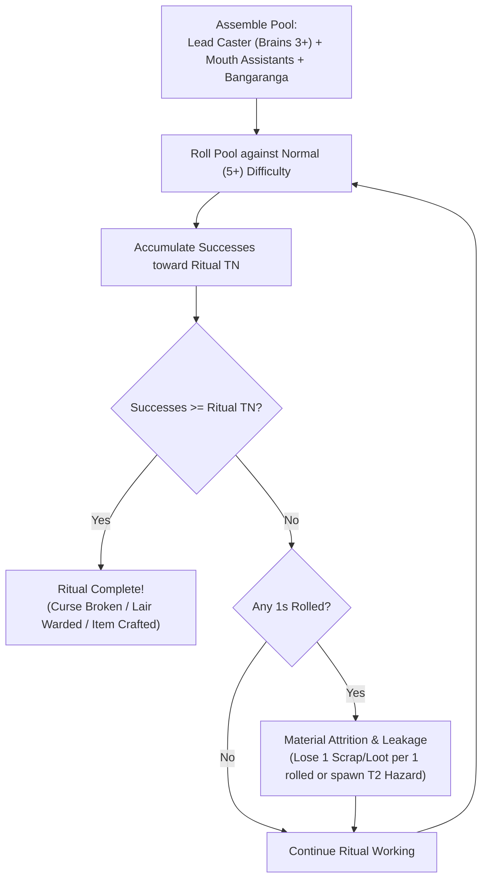

### Ritual Parameters
*   **Time & Scale:** A ritual requires **1 Lair Phase Turn** in the **Lair** (or 3 consecutive, uninterrupted combat rounds during a raid).
*   **Lead Caster:** Must possess **Brains 3+** and the relevant **Power Word** Tag.
*   **Assistants:** Up to a number of goblins equal to the Lead Caster's **Mouth** stat may assist. Each assistant contributes **+1d** to the ritual pool.
*   **Communal Fuel:** The Lead Caster may draw up to their **Grunt** in **Bangaranga Dice** to fuel the ritual.

### Extended Accumulation Engine
Rituals do not use the single-round Farkle loop. Instead, the Lead Caster rolls the assembled pool against **Normal (5+)** difficulty, accumulating successes across steps toward a **Ritual Target Number**:
*   **Tier 3 Ritual (Cleansing Minor Curses / Basic Wards):** Requires **5 Accumulated Successes**.
*   **Tier 4 Ritual (Cleansing Bonded Relics / Fortress Wards):** Requires **8 Accumulated Successes**.
*   **Tier 5 Ritual (Major Reality Transmutation / Artifact Crafting):** Requires **12 Accumulated Successes**.

### Ritual Complications and Resource Attrition
Because rituals are grounded, stable workings, failing a single roll does not destroy accumulated successes:
*   **The Cost of Failure:** Every **1** rolled during a ritual step consumes extra resources: the party must immediately discard **1 Scrap** (or 1 Bulk of carried **Loot**) per 1 rolled, or suffer a **T2 Chaotic Leakage Hazard** in the ritual chamber.
*   **Interruption:** If the Lead Caster suffers unmitigated damage or gains the **Stunned** condition during the ritual, the working collapses, wasting all invested materials.

---

## 8. Tag Effect and Spell Structural Schema

[CONTENT EXTENSION POINT: Magic Spells & Tag Effects]

All modular tag effects, living spell compendiums, and grimoire expansions must follow this formal structural schema:

```markdown
### [Spell / Tag Power Name]
*   **Primary Tag:** `[Tag Name]` (e.g. `[Fire]`, `[Sticky]`, `[Shock]`, `[Spooky]`, `[Slip]`)
*   **Tag Category:** [Elemental / Physical | Mental / Social | Movement / Spatial | Metaphysical]
*   **Delivery Type:** [Personal | Touch / Melee | Ranged (1–3 Zones) | Zone-Wide | Blast]
*   **Bangaranga / Action Cost:** 1 Standard Action (Optional: Draw up to Grunt in Bangaranga Dice)
*   **Target Profile:** GM-set Difficulty (Easy 4+, Normal 5+, Hard 6) vs Target / Environment
*   **Effect by Tier:**
    *   **T1 (Single Success):** [Minor/Niche effect, +1 Success on attack OR 1 Grit/Size damage; Potency options]
    *   **T2 (Pair / 2-of-a-kind):** [Standard effect, +2 Successes OR 2 Grit/Size damage; Sustained condition]
    *   **T3 (Triple / 3-of-a-kind):** [Heroic / Zone-wide effect, +3 Successes OR 3 Grit/Size damage; Persistent condition]
    *   **T4 (Quadruple / 4-of-a-kind):** [Destructive / Blast effect, +4 Successes OR 4 Grit/Size damage; Encounter condition]
    *   **T5 (Quintuple / 5-of-a-kind):** [Legendary / Encounter-scale effect; Instant defeat OR permanent reality warp]
*   **Chaotic Leakage (Side Effects):**
    *   *Pair of Non-Successes (T2):* [Minor zone hazard, temporary Bane, or positioning wobble]
    *   *Triple of Non-Successes (T3):* [Dangerous self-inflicted condition, friendly Bane, or spatial warp]
    *   *Quadruple+ of Non-Successes (T4+):* [Zone-wide damage, severe condition, or dimensional fracture]
*   **Farkle / Mishap Outcome:** [Catastrophic consequence triggered when a push yields zero new successes]
*   **Element Synthesis Hooks:** [Predefined synergies when combined with other tags, e.g. `[Tag]` + `[Other]` -> Result]
```

---

## 9. Mechanical Gaps and System Clarifications

[MISSING RULE / GAP: Power Word slot progression is strictly bound to Brains Level 3+ (Level 3 = 2 slots, Level 4 = 4 slots, Level 5 = 6 slots). Any early draft reference to Brains 2 granting Power Word slots is deprecated; Brains 1 and 2 characters possess 0 slots and cannot cast magic.]

[MISSING RULE / GAP: Ritual casting mechanics were previously absent from stage drafts despite multiple references to cleansing curses and warding lairs. The extended cooperative accumulation engine (Lead Caster + Assistants + Bangaranga vs TN 5/8/12) is the authoritative rule for non-combat extended magic.]

---

<a id="doc-11"></a>
<!-- ============================================================ -->
<!-- DOCUMENT 11: 02_PROD_Core_Rules/09_The_Raid_Loop.md -->
<!-- ============================================================ -->
# The_Raid_Loop
*Source: `02_PROD_Core_Rules/09_The_Raid_Loop.md`*

# The Raid Loop & Economy

*A goblin without a plan gets squashed. A goblin with a plan gets squashed while carrying something shiny. The raid is the lifeblood of the Warren—a high-stakes smash-and-grab where Bosses lead their Mobs into hostile territory to plunder riches, smash infrastructure, and haul back enough scrap to keep the Lair growing.*

---

## 1. The Four Raid Phases

Every raid operates within a continuous four-phase loop that structures the transition from the **Lair** to the target site and back again:

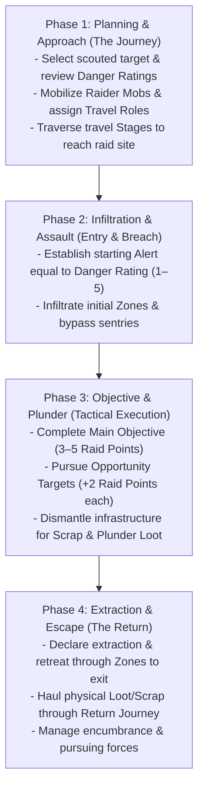

### Phase 1: Planning & Approach
Before leaving the **Lair**, you select a scouted target, inspect the known **Base Danger Rating** and **Objectives**, allocate **Raider Mobs** from the communal **Gobbo Pool** (up to your Boss's **Grunt** limit), and assign the four **Travel Roles**. The party then traverses wilderness or subterranean **Stages** as detailed in [Journeys & Hazards](11_Journeys_and_Hazards.md).

### Phase 2: Infiltration & Assault
The party breaches the target perimeter. The **GM** sets the location's starting **Alert** track equal to its **Base Danger Rating** (1 to 5). You navigate connected **Zones**, defeat sentries, bypass obstacles, and work to keep **Alert** low before sounding alarms.

### Phase 3: Objective & Plunder
The party executes tactical combat and exploration actions in the target **Zones**. You secure the **Main Objective** (worth 3–5 **Raid Points**), seek optional **Targets of Opportunity** (worth +2 **Raid Points** each), dismantle heavy machinery or architecture for **Scrap**, and spend **Plunder** **Standard Actions** to gather loose **Loot** and **Oddities**.

### Phase 4: Extraction & Escape
Once objectives are secured, or when **Alert** escalates to lethal levels, the party declares **Extraction**. You must haul all gathered physical **Loot**, **Scrap**, and **Oddities** back through the perimeter to the exit, managing encumbrance penalties and fighting off pursuers before resolving the return journey.

---

## 2. The Raid Economy

The **Gobbos** economy operates without fractional coinage or coin-counting math. Wealth and progress are measured across five standardized systemic resources:

| Resource | Scope | Acquisition Method | Primary Mechanical Function |
| :--- | :--- | :--- | :--- |
| **Loot Value (LV)** | Liquid Wealth | Plundered as physical items during raids | Smelted via Rule of Five; buys equipment, hires specialists, expands Lair facilities. |
| **Scrap** | Building Matter | Harvested from broken infrastructure and salvage | Constructs facility chassis, expands rooms, and provides base weapon materials. |
| **Infamy Marks** | Gang Level | Contributed Loot (10 LV = 1 Mark) or Agendas | Determines Gang Infamy (1–5), Successor starting XP, and equipped Gang Quirks. |
| **Raid Points (Glory)** | Shared Renown | Completing Main and Opportunity Objectives | Pooled at raid end; converts into shared **Boss XP** during Homecoming. |
| **Boss XP** | Personal Power | Pooled Raid Points, Personal Glory, Successor pools | Spent during downtime to advance **Main Stats** (**Tough**, **Slink**, **Brains**, **Mouth**). |

---

## 3. Loot Value & The Exponential Scale

All treasure plundered from a raid belongs to a **Quality Tier (T1–T5)** and possesses a **Loot Value (LV)** representing its concentrated material worth.

### The 5-to-1 Tier Ladder
Each tier represents an exponential **5-to-1 step** in value. Lower-tier items cannot bypass higher-tier economy gates without combining them in groups of five:

| Tier | Category & Quality | Single Unit Value | Typical Raid Plunder |
| :---: | :--- | :--- | :--- |
| **T1** | **Junk & Pocket Scrap** | 1x T1 | Brass buttons, bent iron nails, tin mugs, loose teeth. |
| **T2** | **Scrappy Plunder** | 5x T1 (1x T2) | Silver cutlery, iron shivs, copper kettles, crude pewter rings. |
| **T3** | **Standard Fine Treasure** | 25x T1 (5x T2 / 1x T3) | Gold banquet chalices, guard broadswords, bolts of fine silk. |
| **T4** | **Superior Masterwork** | 125x T1 (5x T3 / 1x T4) | Dwarven rune-hammers, jeweled altar idols, black pearl necklaces. |
| **T5** | **Legendary Mythic Relic** | 625x T1 (5x T4 / 1x T5) | Dragon skull trophies, intact godstone shards, astral astrolabes. |

### Multi-Unit Treasures & Hoards
Massive treasures possess a **Loot Value** greater than 1 of their Tier:
* A stolen **Alabaster Sarcophagus** might be valued at **4x T4**.
* Under the exponential scale, that single sarcophagus is worth:
  **4x T4** = **20x T3** = **100x T2** = **500x T1**
* This scale prevents hoarding loose Junk (T1) from trivializing high-tier economic purchases without physical smelting.

---

## 4. The Rule of Five: Smelting & Barter

During the **Lair Phase** (downtime between raids), you can combine, melt down, or break apart plunder using the **Rule of Five**:

1. **Trading Up (Smelting / Combining):** You combine **5 tokens of Tier X** into **1 token of Tier X+1**.
   * *Example:* 5x T2 silver goblets melt down into 1x T3 gold ingot.
2. **Trading Down (Breaking Down / Pawning):** You break down **1 token of Tier X+1** into **5 tokens of Tier X**.
   * *Example:* 1x T4 masterwork brooch trades down into 5x T3 trade bars.

>> **THE RULE OF FIVE RESTRICTION:**
>> Smelting upward requires exact multiples of five. Non-multiples of five cannot be traded up to the next tier until additional matching tokens are acquired.

---

## 5. Scrap Generation & Conversion

**Scrap** is abstract structural building matter (reclaimed iron plates, oak beams, lead pipes, chains, and masonry) required to construct Lair facilities, build defenses, and form custom weapon chassis.

### Generating Scrap
1. **Dismantling Infrastructure:** During a raid, a **Goblin Boss** or **Mob** can spend a **Standard Action** (**Manipulate** or **Attack**) to dismantle environmental objects (iron doors, portcullises, chandeliers, ballistas). A successful **Tough 5+/1** or **Brains 5+/1** test extracts **1d6 Scrap** (or the object's listed yield) into the party's carry load.
2. **Salvage Yields:** Plundered items with high structural bulk can be smelted down in the Lair. Dismantling a plundered item yields its listed **Scrap Yield** into the **Communal Hoard**.
3. **Passive Lair Yields:** Dedicated Lair facilities (such as the Junkyard Sifter or Scrap Forge) generate passive **Scrap** each **Lair Turn**.

---

## 6. Carry Capacity & Tactical Encumbrance

Greed has physical weight. All weapons, armor, tools, and plunder possess a **Bulk** rating (0 to 4+). 

### Goblin Boss Carry Capacity
Your unburdened **Carry** capacity is derived from your **Tough** stat:

**Carry Capacity** = **4 + (2 x Tough) Bulk**

| Tough Stat | Unburdened Carry | Over-Laden Threshold | Dragging Limit (2x Carry) |
| :---: | :---: | :---: | :---: |
| **Level 1** | **6 Bulk** | 7–7 Bulk | 12 Bulk |
| **Level 2** | **8 Bulk** | 9–10 Bulk | 16 Bulk |
| **Level 3** | **10 Bulk** | 11–13 Bulk | 20 Bulk |
| **Level 4** | **12 Bulk** | 13–16 Bulk | 24 Bulk |
| **Level 5** | **14 Bulk** | 15–19 Bulk | 28 Bulk |

### Load States & Penalties
Total the **Bulk** of all carried weapons, armor, gear, and plunder to determine your current **Load State**:

* **Unburdened (<= Carry):** Standard **Movement** speed (in Zones per **Move** action); zero test penalties; full access to all standard actions and reactions.
* **Over-Laden (Carry + 1 to Carry + Tough):** **-1 Zone** per **Move** action (minimum 1 Zone); **Bane 1 (-1d)** on all physical **Slink** and **Tough** tests; you cannot perform two **Move** actions in the same round.
* **Dragging (Carry + Tough + 1 to 2x Carry):** Fixed at **1 Zone** per **Move** action; auto-fails all stealth and jumping tests; requires **two hands**; you cannot attack with weapons and cannot perform **Dodge** or **Parry** **Reactions** (0 active defense).
* **Immobilized (> 2x Carry):** **0 Zones** movement speed; you cannot move and must drop carried items as a **Free Action** to regain mobility.

### The Bulk 3+ Item Rule
Items of **Bulk 3 or higher** (iron safes, great cauldrons, stone statues, heavy kegs) represent awkward, heavy loads:
* **Two Hands Required:** Hauling a loose Bulk 3+ item occupies two hands. You cannot wield a weapon, hold a shield, or cast somatic spells while carrying it.
* **No Disengage:** You cannot perform a **Disengage** action while holding a Bulk 3+ item. You must drop the item as a **Free Action** to disengage, defeat adjacent enemies, or take Opportunity Attacks.
* **Boss Hauling Limit:** A **Goblin Boss** can haul at most Tough / 2 (rounded down, minimum 1) loose Bulk 3+ items at one time.

### Mob Carry Limits & Casualties
* **Unburdened Mob Limit:** A **Mob** carries up to **Size x 4 Bulk** with normal movement and no penalties.
* **Dragging Mob Limit:** A **Mob** can drag up to **Size x 5 Bulk** (movement fixed at 1 Zone per **Move** action; cannot execute the reactive **Scatter!** order).
* **Mob Combat Penalty:** Every loose object of **Bulk 3+** carried by a **Mob** imposes **Bane 1 (-1d)** on that **Mob's** attack rolls. A **Mob** can carry a maximum number of Bulk 3+ items equal to its current **Size**.
* **Casualty Drops:** When a **Mob** takes damage that reduces its **Size**, its carry capacity shrinks immediately. The controlling **Goblin Boss** must **immediately declare which Loot items are dropped** in the current **Zone** to meet the new capacity ceiling. Picking dropped items back up requires spending a **Plunder** **Standard Action** per item.

---

## 7. Danger Scaling, Scouting & Alert

Raids scale dynamically based on site danger and the party's operational profile.

### Base Danger Rating (1 to 5)
Every raid target has a **Base Danger Rating** (T1 to T5) that sets its starting **Alert** level, baseline environmental hazard profiles, and enemy strength.

### Scouting the Target
During the Labor step of the **Lair Phase**, players allocate **Laborer Dice** to survey a target site. Roll the allocated pool against **4+**:

* **0 Successes (Blind Entry):** The location exists, but the party knows nothing. The party suffers a **Bane 1 (-1d)** on their first Zone entry test during the raid.
* **1 Success:** Reveals the **Base Danger Rating** and the **Main Objective** (worth 3–5 **Raid Points**).
* **2 Successes:** In addition to the above, reveals 1 **Target of Opportunity** (worth +2 **Raid Points**).
* **3+ Successes:** In addition to the above, reveals 2 **Targets of Opportunity** (+4 **Raid Points** total) and a **Secret Bypass** (grants the party a **Boon 1 (+1d)** on their first Zone entry test).

### The Alert Track
The **GM** tracks the raid location's active **Alert** (starting equal to the **Base Danger Rating**):
* **Alert Check Triggers:** The **GM** rolls **1d6** whenever the party enters a new **Zone**, completes a **Target of Opportunity**, or takes a rest round.
* **Resolution:**
  * If the roll is **strictly greater** than current **Alert**: The party remains undetected.
  * If the roll is **less than or equal to** current **Alert**: A complication triggers (reinforcements arrive, alarms sound, or traps arm), and **Alert** permanently increases by **+1**.

---

## 8. Post-Raid Reckoning & Payout

When the party extracts safely back to the **Lair**, rewards are tallied across three separate tracks:

### 1. Communal Glory to Shared Boss XP
All **Raid Points** earned by the party from completing objectives are pooled and converted into shared **Boss XP**:

| Pooled Raid Points | Shared Boss XP Awarded | Raid Reputation |
| :---: | :---: | :--- |
| **1–4 Points** | **0 XP** | Failure. The horde throws mud at the returning raiders. |
| **5–9 Points** | **1 XP** | Decent raid. The horde acknowledges the plunder. |
| **10+ Points** | **2 XP** | Legendary triumph! A feast is held in your honor. |

### 2. Personal Glory (+1 XP)
A **Goblin Boss** earns **+1 Personal Glory** (maximum 1 per raid, converting to **+1 XP** during Homecoming) by fulfilling at least one of these chaotic acts:
* **The Compulsion:** Voluntarily trigger your Gang's **Shenanigan** compulsion in an disadvantageous tactical situation, causing a complication and adding a die to the communal **Bangaranga Pool**.
* **The Sacrifice:** Completely destroy a custom gear item by declaring an **Overclock**.
* **The Tyrant:** Use the **Assert Dominance** action (attacking a **Mob** under your command) to regain **Grunt** in combat.
* **The Martyr:** Roll a **Fumble** or trigger **Overreaching** when rolling dice, yet survive the raid.

### 3. Communal Hoard Deposit vs. Private Gang Hoard
* **Communal Hoard:** All standard **Loot Value** and **Scrap** gathered by the party is deposited into the **Communal Hoard**. Contributing 10 **Loot Value** to the Communal Hoard earns your Gang **1 Infamy Mark**.
* **Oddity Drafting:** Rare **Oddities** extracted from the raid are placed on the table and distributed by **Player Consensus**. If an **Oddity** was physically carried out by a specific **Mob**, that **Mob's** controlling Gang holds **First Pick** rights.

---

## 9. Loot & Salvage Structural Schema

Every plundered treasure, scrap cache, or harvested monster oddity is defined by the following structural template:

```markdown
### [Item Name]
- **Category:** [Pocket Scrap | Scrappy Plunder | Fine Treasure | Masterwork | Mythic Relic | Oddity | Chassis | Consumable]
- **Quality Tier:** [T1 Junk | T2 Scrappy | T3 Standard | T4 Superior | T5 Legendary]
- **Bulk:** [0 | 1 | 2 | 3 | 4+]
- **Loot Value (LV):** [Quantity of Tier units, e.g. 1x T1, 1x T2, 3x T3, 1x T5]
- **Scrap Yield:** [Quantity of Scrap recovered if dismantled in Lair]
- **Divisibility:** [Divisible | Indivisible]
- **Special Utility / Crafting Tag:** [Attached Oddity (Tier/Bite), Weapon/Armor Tag, or Blueprint schematic]
- **Description:** [Brief physical Tier B/C description]
```

### Reference Plunder Instances

#### Bent Brass Nails
- **Category:** Pocket Scrap
- **Quality Tier:** T1 Junk
- **Bulk:** 0
- **Loot Value (LV):** 1x T1
- **Scrap Yield:** 1 Scrap
- **Divisibility:** Divisible
- **Special Utility / Crafting Tag:** None
- **Description:** *A pocketful of bent, tarnished brass nails pried from floorboards.*

#### Gilded Silver Chalice
- **Category:** Fine Treasure
- **Quality Tier:** T3 Standard
- **Bulk:** 1
- **Loot Value (LV):** 1x T3
- **Scrap Yield:** 2 Scrap
- **Divisibility:** Indivisible
- **Special Utility / Crafting Tag:** None
- **Description:** *A heavy silver banquet cup lined with gold filigree and small garnet beads.*

#### Flame Drake Bile Gland
- **Category:** Oddity
- **Quality Tier:** T4 Superior
- **Bulk:** 2
- **Loot Value (LV):** 1x T4
- **Scrap Yield:** 0 Scrap
- **Divisibility:** Indivisible
- **Special Utility / Crafting Tag:** [Fire] (Tier 4, Bite 3, [Searing] Tag)
- **Description:** *A pulsating, smoking organ harvested from a drake carcass. Warm to the touch.*

---

## Content Extension Point

[CONTENT EXTENSION POINT: Loot & Salvage Items]

All future compendiums of treasures, trade goods, monster harvest oddities, relics, and scrap caches must implement the Loot & Salvage Structural Schema defined above, respecting Quality Tiers (T1–T5), Bulk encumbrance rules, and Scrap yields.

---

## Mechanical Gaps & Unresolved Systems

[MISSING RULE / GAP: Economy Currency Normalization & Tiered Conversion]
*   **Description:** Stage drafts define Loot Value on a 5-to-1 exponential scale (T1–T5), but Lair construction rules list flat costs like "10 Loot, 15 Scrap" and Gang progression awards 1 Infamy Mark per "10 Loot Value" contributed. If a single T5 Relic equals 6,250 T1 units, depositing one T5 item would grant 625 Infamy Marks, instantly maxing Gang Infamy 40 times over.
*   **Why it is needed:** The macro progression and Lair construction loops collapse into hyper-inflation or complete ambiguity if currency tiers are not strictly normalized.
*   **Suggested Resolution:**
    1. Define all flat Lair construction costs in matching Tier tokens (e.g., Tier 2 rooms cost T2 tokens, Tier 3 rooms cost T3 tokens).
    2. Normalize Infamy Mark generation to require 10x T1 for Infamy 1, 10x T2 for Infamy 2, 10x T3 for Infamy 3, 10x T4 for Infamy 4, and 10x T5 for Infamy 5.

[MISSING RULE / GAP: Codified Extraction Phase & Chase Mechanics]
*   **Description:** While Journey rules handle travel to and from the site, there is no formal mechanical procedure for the transition between dungeon combat/plunder and extraction. If Alert reaches 4 or 5, there are no rules for whether enemies chase the party into the return journey, or how players disengage from the dungeon node to start return stages.
*   **Why it is needed:** The "Extraction & Escape" phase is one of the four core raid pillars, but currently lacks dedicated evasion mechanics.
*   **Suggested Resolution:** Define the Extraction Trigger: Once the party declares Extraction, each Zone between their current location and the entrance must be traversed. If Alert is 4+, each exit transition triggers an immediate Slink 5+/1 evasion test; failure inflicts 1 Attrition damage on all Mobs and carries +1 Alert into the Return Journey.

[MISSING RULE / GAP: Private Gang Hoard vs. Communal Hoard Economy]
*   **Description:** The Skim Downtime Action allows a Boss to secretly divert Loot into the Gang's Private Hoard. However, the rules never define what a Gang's Private Hoard can be spent on versus the Communal Hoard, or whether Private Hoard wealth counts toward Infamy Marks.
*   **Why it is needed:** Without distinct mechanical uses (e.g. purchasing personal gear without table consensus, bribing Elders for personal perks, or buying unshared Mob upgrades), the Skim action has no tactical purpose.
*   **Suggested Resolution:** Clarify that the Communal Hoard is spent strictly by group consensus for Lair upgrades and shared outfitting, while a Gang's Private Hoard is spent exclusively by that player to purchase personal gear, bribe Elders, or buy personal Mob equipment. Wealth in the Private Hoard only grants Infamy Marks when deposited into the Communal Hoard.

---

<a id="doc-12"></a>
<!-- ============================================================ -->
<!-- DOCUMENT 12: 02_PROD_Core_Rules/10_The_Lair_Loop_and_Progression.md -->
<!-- ============================================================ -->
# The_Lair_Loop_and_Progression
*Source: `02_PROD_Core_Rules/10_The_Lair_Loop_and_Progression.md`*

# The Lair Loop & Progression

*A single goblin dies in the mud, forgotten. A Warren of goblins builds an underground empire of rusted iron, stolen treasure, and smoking workshops. The Lair is the communal sanctuary where plunder is smelted, wild beasts are tamed, and the next generation of Bosses rises from the muck.*

---

## 1. The Lair Dashboard & Core Metrics

The **Lair** is the shared, cooperative base of operations managed by all players. The state of the settlement is tracked on the **Lair Sheet** across six core metrics:

| Metric | Category | Mechanical Scope |
| :--- | :--- | :--- |
| **1. Warren Tier & Capacity** | Settlement Scale | Tier 1 to 4; Max Active Assets = (Tier x 2) + 2 |
| **2. The Swarm (Gobbo Pool)** | Workforce Pool | Total population in d6s; split between Raider Mobs & Laborer Dice |
| **3. The Communal Hoard** | Shared Capital | Pooled Loot Value (liquid wealth) & Scrap (building matter) |
| **4. Swarm Mood** | Morale & Discipline | 0–5 Morale Track; Mob Mutiny triggers at Level 5 |
| **5. Threat Level** | Regional Heat | 0–5 Heat Track; Retaliatory Lair Assault triggers at Level 5 |
| **6. The Bone Pile** | Ancestral Legacy | Skull Tally; unlocks permanent Ancestral Boons every 4 Skulls |

### Warren Tier & Asset Capacity
**Warren Tier** measures the overall physical scale, engineering complexity, and regional renown of the goblin settlement:

* **Tier 1: Ragtag Mob Camp** (Hidden hovels, squatter dens under ruins; Max **4** Active Assets).
* **Tier 2: Fortified Warren** (Recognized regional hazard, reinforced palisades; Max **6** Active Assets).
* **Tier 3: Subterranean Stronghold** (Sprawling underground cavern network, heavy industry; Max **8** Active Assets).
* **Tier 4: Goblin Under-Kingdom** (Legendary subterranean fortress commanding regional outposts; Max **10** Active Assets).

**Asset Capacity** = (**Warren Tier** x 2) + 2

>> **THE ASSET CAPACITY CEILING:**
>> A Lair can only maintain a maximum number of **Active Assets** equal to (**Warren Tier** x 2) + 2. If the Lair exceeds this ceiling, the settlement suffers from overcrowding and structural strain: **Swarm Mood increases by +1 at the start of every Lair Turn for each asset over the cap.**

---

### The Gobbo Pool (Workforce)
The Lair's total goblin population is tracked as a communal dice pool: **The Gobbo Pool** (measured in **d6s**).

* **The Workforce Division:** At the start of each **Lair Turn**, players divide the **Gobbo Pool** into two groups:
  1. **Raider Mobs:** Dice assigned to **Bosses** (up to each Boss's **Grunt** limit) to form tactical **Mobs** for raids.
  2. **Laborer Dice:** Dice remaining in the Lair to perform scavenging, excavation, recruitment, and crafting operations.
* **Mob Survival & Auto-Heal:** If a Raider **Mob** returns from a raid with at least 1 health point on at least one health die (**Size** >= 1), it immediately **auto-heals back to its full allocated Size** for free during Step 1 (Homecoming).
* **Casualty Elimination:** If a **Mob** is reduced to **Size 0** (all health dice lost), those dice are permanently removed from the **Gobbo Pool**.
* **The Communal Runts Floor:** The Lair always maintains a baseline floor of **3d6 communal runts**. These runts cannot perform heavy labor or be assigned as Laborer Dice, but they guarantee that each **Player** can always lead at least a **Size 1 Runt Mob (1d6)** on a raid, even after a catastrophic wipe.
* **Vacant Nest Growth:** During Step 1 (Homecoming), if the total **Gobbo Pool** falls below **3d6 per Player** (e.g., under 9d6 in a 3-player campaign), the Lair automatically gains **+1d6** to the **Gobbo Pool** for free as wild runts move into empty burrows.

---

### The Communal Hoard
The **Communal Hoard** stores shared capital brought back from raids:
* **Loot Value (LV):** Liquid wealth (coins, gems, jewelry, fine mechanisms) used to fund Lair room construction, bribe troops, hire specialists, and purchase equipment.
* **Scrap:** Physical building material (rusted iron plates, oak timber, lead pipes, chains) used to construct facilities, clear excavations, and assemble weapon chassis.

---

### Threat Level (The Regional Heat Clock)
**Threat Level** is a track rated from **0 to 5** representing regional awareness and organized military response:

* **0–1 (Quiet):** The outside world considers the Lair minor vermin.
* **2–3 (Guarded):** Local settlements double their sentries; regional dungeon nodes gain +1 hazard.
* **4 (Hunted):** Enemy scout parties comb the wilderness; Lair complications suffer a **Bane 1 (-1d)**.
* **5 (Retaliatory Assault!):** The enemy launches a direct assault against the Lair. Players must defend the base using their **Mobs** and defenses. Following the assault resolution, **Threat Level** resets to 2.

---

### Swarm Mood (Morale & Mutiny)
**Swarm Mood** is a track rated from **0 to 5** representing internal discipline, morale, and obedience:

* **0–1 (Eager):** Grunts are hyped; all **Players** add **+1 die** to the communal **Bangaranga Pool** at the start of the next raid.
* **2–3 (Grumbly):** Standard goblin squabbling; failed orders during combat trigger immediate morale checks.
* **4 (Restless):** Grunts demand extra grog; Labor recruitment tests suffer a **Bane 1 (-1d)**.
* **5 (Mob Mutiny!):** Grunts refuse to embark on raids without upfront bribes (**5 Loot** per **Mob**). Internal brawls lock one random Lair facility until mutiny is suppressed.

---

### The Bone Pile (Ancestral Legacy)
The **Bone Pile** is a sacred memorial containing the skulls of fallen **Bosses**:
* Every dead **Boss** adds **1 Skull** to the **Bone Pile** track.
* **Ancestral Boons:** Every **4 Skulls** marked unlocks a permanent, Lair-wide ancestral perk (e.g., *Ancestral Grudge:* +1d attack against the enemy faction responsible for the most Boss deaths; *Haunted Warrens:* invaders suffer **Bane 1 (-1d)** during Lair assaults).
* **Relic Harvesting:** A **Boss** may salvage a skull or bone from the **Bone Pile** to forge a unique **Relic** item.

---

## 2. The Four-Step Lair Phase Sequence

The **Lair Phase** resolves in a strict four-step procedure between raids:

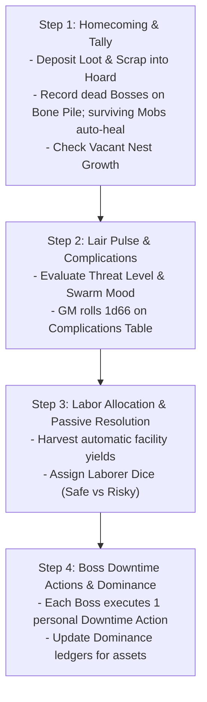

### Step 1: Homecoming & Tally
1. **Deposit Wealth:** Transfer all plundered **Loot Value** and **Scrap** into the **Communal Hoard**.
2. **Honour the Fallen:** Add deceased **Bosses** to the **Bone Pile**. Generate successor **Bosses** with starting **Successor XP** equal to **Gang Infamy x 4**.
3. **Regenerate Mobs:** Surviving **Mobs** (Size >= 1) restore all health dice to full allocated **Size**. Wiped **Mobs** are deleted from the pool.
4. **Vacant Nest Check:** If total **Gobbo Pool** is under 3d6 per player, add **+1d6** for free.

### Step 2: Lair Pulse & Complications
The **GM** rolls **1d66** on the **Lair Complications Table**:

| d66 | Event Name | Mechanical Resolution |
| :--- | :--- | :--- |
| **11–13** | **Tunnel Cave-In** | Lose **1d6 Scrap** from the Hoard, or assign 2 Laborer Dice to clear rubble. |
| **14–16** | **Squig Rampage** | A Boss must pass a **Tough 4+/1** test to subdue the beast, or lose **1d6 Runts** from the Gobbo Pool. |
| **21–23** | **Captive Breakout!** | All `[Person: Captive]` assets test escape: on a **1–2** on 1d6, they escape unless a Boss spends a Downtime Action to recapture them. |
| **24–26** | **Elder Tantrum** | Increase **Swarm Mood by +1** unless a Gang pays **5 Loot** from their private hoard to host a feast. |
| **31–33** | **Scout Probe** | Human or dwarven scouts spot smoke. Increase **Threat Level by +1** unless a Boss passes **Slink 4+/1** to silence them. |
| **34–36** | **Mushroom Rot** | Nursery mold rots food supplies. The Lair loses all passive recruitment yields this turn. |
| **41–43** | **Wandering Outcast** | A strange specialist visits the Lair. Pay **5 Loot** to recruit them as an active `[Ally]` asset. |
| **44–46** | **Turf Brawl** | Grunts riot over scrap. The two highest-Infamy Gangs lose 1 Mob health die or fight a Boss **Bar Brawl**. |
| **51–53** | **Stolen Cache** | A runt finds buried dungeon loot near the camp. Add **+2d6 Loot** (T1) to the Communal Hoard. |
| **54–56** | **Tribute Demand** | Rival warlords demand tribute. Pay **10 Loot** (T1) or increase **Threat Level by +2**. |
| **61–65** | **Smooth Operations** | The warren is humming. All active Labor tasks gain a **Boon 1 (+1d)** this turn. |
| **66** | **Ancestral Miracle!** | Green flames erupt from the Bone Pile. Add **+1 Skull** to the Bone Pile and reset **Swarm Mood to 0**. |

### Step 3: Labor Allocation & Operations
1. **Passive Harvest:** Collect automatic yields from active `[Facility]` and `[Outpost]` assets (e.g., Junkyard Sifter generating +2 Scrap).
2. **Workforce Allocation:** Assign available **Laborer Dice** to active projects:
   * **Scavenging Scrap:** Produces raw **Scrap** for the Hoard.
   * **Recruiting Runts:** Captures wild goblins to expand the **Gobbo Pool** permanently.
   * **Scouting Targets:** Surveys upcoming raid sites to reveal **Danger Ratings**, **Objectives**, and **Bypasses**.
   * **Excavating Projects:** Progresses construction thresholds for new facilities.

>> **THE LABOR RESOLUTION RULE: SAFE VS. PUSH**
>> When committing Laborer Dice to any labor task, players declare their work method:
>> * **Safe Labor (2 Dice):** Guarantees **1 automatic success**. No dice rolled; zero risk of injury.
>> * **Risky Push (1 Die):** Roll **1d6** against **4+** (6s explode). However, rolling a **1** triggers a workplace accident: the working runt is injured, placing that 1 die in the medical tent (unavailable for labor or raids for 1 Lair Turn).

### Step 4: Boss Downtime Actions
Each active **Goblin Boss** executes **one** personal Downtime Action:

* **The Pitch (Mouth Test):** Deliver an inspiring or terrifying speech. Pass a **Mouth 4+/1** test to reduce **Swarm Mood by 1**. *(Alternative: Spend 5 Loot from the Hoard to buy a round of rotgut grog, automatically reducing Swarm Mood by 1 with no roll).*
* **Laying Low (Slink Test):** Lead scouts into the surrounding wilderness to eliminate enemy patrols and erase tracks. Pass a **Slink 4+/1** test to reduce **Threat Level by 1**. *(Alternative: Spend 5 Loot to bribe local corrupt watchmen).*
* **Custom Crafting (Brains Test):** Operate a workshop to assemble, modify, or overclock weapons and armor using **Scrap** and **Oddities** (see [Combat Engine](05_Combat_Engine.md)).
* **The Skim (Slink Test):** Secretly divert wealth from the Communal Hoard into your **Gang's Private Hoard**. Pass a **Slink 4+/1** test to divert up to your **Slink** rating in **Loot Value**. If your roll contains any **1s**, you are caught: you receive 0 Loot and **Swarm Mood increases by +1**.
* **Bar Brawl / Power Play (Tough or Mouth Test):** Challenge a rival Gang's dominance over a Lair facility. Pass a **Tough 4+/1** (physical brawl) or **Mouth 4+/1** (screaming dominance) test to transfer 1 point of contribution on that asset's ledger from the defender to your Gang.
* **Beast Taming (Brains or Tough Test):** Break and train a captured beast. Pass a **Brains 4+/1** or **Tough 4+/1** test to attach a beast archetype tag (e.g., `[Wolf Mount]`, `[Squig Hound]`) to a commanded **Mob**.

---

## 3. The Modular Asset Framework & Dominance

Knowledge and infrastructure in the Lair are not an abstract tech tree. **Knowledge is held in living Persons, physical Facilities, Allies, and Blueprints.** If an asset is killed, destroyed, or lost, its capability is disabled immediately.

### The Four Asset Categories
1. `[Person]` **(Elders, Specialists, Captives):** Living experts.
   * *Elders:* Retired Level 6 Bosses. High loyalty, but frail (vulnerable to health complications).
   * *Specialists:* Hired non-goblin outcasts. Require weekly **Loot Upkeep**; leave if unpaid.
   * *Captives:* Enslaved enemies (Dwarves, Humans, Elves). Provide elite masterwork knowledge, but carry high **Flight Risk** and increase **Threat Level**.
2. `[Facility]` **(Workshops, Dens, Fortifications):** Physical structures built with **Loot** and **Scrap**.
3. `[Ally]` **(Befriended Monsters, Patron Factions):** External creatures living alongside the horde. Powerful, but demand food or cause social friction.
4. `[Blueprint]` **(Physical Schematics, Stolen Scrolls):** Fragile paper or stone schematics (Bulk 0). Destroyed if hit by fire or water complications.

### Core Asset Rules
* **The Non-Stacking Clause:** Identical mechanical boons from Lair assets do not stack. A **Mob** can only gain a maximum of **+1 passive Defense Die** from Lair assets, regardless of how many armories or martial Elders are present.
* **Loss of Knowledge:** Destroying or losing an asset immediately disables its associated capability until a replacement asset is secured.

---

### Dominance & Inter-Gang Politics
While the Lair belongs to all goblins, individual assets are controlled by specific Gangs through **Dominance**:

1. **The Contribution Ledger:** When constructing or upgrading an asset, players record the total **Loot**, **Scrap**, and **Laborer Dice** contributed by their specific Gang.
2. **Dominant Gang:** The Gang with the highest cumulative contribution holds **Dominance** over that asset.
3. **Disputed Status:** Tied contributions render an asset *Disputed* (no Gang gains the kickback) until one Gang contributes additional resources or wins a **Bar Brawl** Downtime Action.

#### Dominance Benefits
* **Renaming Rights:** The dominant Gang names the facility (e.g., *"Snikt's Exploding Forge"*).
* **Priority Access:** The dominant Gang acts first whenever facility use is contested.
* **Dominance Kickback:** The dominant Gang exclusively receives the asset's specific **Dominance Perk**.

---

### Outposts & Macro-Territory
Secured dungeon sites or regional structures (iron mines, ruined watchtowers, breweries) can be garrisoned as **Outposts**:

* **Garrison Cost:** Deduct **1d6** permanently from the **Gobbo Pool** to staff the outpost.
* **Passive Yield:** Generates a flat resource yield each **Lair Turn** (e.g., *Iron Mine: +4 Scrap; Brewery: -1 Swarm Mood*).
* **Supply Run Checks:** During Step 3, resolve shipment delivery:
  * *Safe Route:* Automatic delivery.
  * *Wild Route:* Roll **1d6**. On a **1**, bandits intercept the shipment (lose yield for this turn).
  * *Hostile Route:* Roll **2d6** against **4+**. Needs at least one success to deliver. Rolling all 1s means the Outpost is besieged and must be relieved in a raid.

---

## 4. Roguelite Generational Progression & Death

Death in **Gobbos** is a stepping stone to greater power. When a **Goblin Boss** dies, the player does not start from zero.

### The "Next Gobbo Up" (Successor Creation)
When a Boss dies, the next prominent goblin in the Gang takes command:
* **Starting Stats:** Successors start with **1** in all Main Stats, receive **2 starting advances** (standard character creation), plus a starting pool of **Successor XP**:
**Successor XP** = **Gang Infamy x 4**
* **Successor Caps:** A successor cannot raise any stat above **Level 4** at creation and cannot start as an **Elder** (Level 6).
* **The Catch-Up Boost:** A fresh successor receives **+2 bonus XP** on the first survived raid.

### Gang Marks (Tattoos of the Dead)
The successor honors the fallen predecessor by receiving a crude soot tattoo:
* The successor inherits **one Quirk or Twist** possessed by the deceased Boss.
* The successor **ignores all Stat and Tier requirements** for this inherited Quirk.
* This Quirk counts toward the Boss's limit of 3 personal Quirks.

### Named Items & Revenge Quests
When a Boss dies, the Boss's favored equipment absorbs that chaotic spirit and becomes a **Named Item**:
* **Imbued Boon:** The item gains a **T1 Boon** reflecting the deceased Boss's highest stat or cause of death.
* **Recovery:** If surviving goblins drag the item back to the Lair, the successor inherits it.
* **Enemy Wielders:** If the raid wipes and the item is lost, the enemy killer claims the weapon. The item can be reclaimed in future revenge raids.
* **Gang Rebellion:** Named items rebel if wielded by a rival Gang (e.g., treating all Criticals as Fumbles).

### Patron Saints of the Bone Pile
When creating a successor, the player may select one deceased Boss from the **Bone Pile** to adopt as a **Patron Saint**:
* **The Boon:** Grants a specific situational power related to how the Saint lived or died (e.g., *Saint Grugor: Ignore fire damage once per raid*).
* **The Behavioral Catch:** To maintain the boon, the Boss must follow the Saint's behavioral quirk (e.g., always choosing the loudest path, or never retreating).

### Retirement & Elders
When a Boss earns enough XP to raise any Main Stat to **Level 6**, the Boss automatically **Retires** from active raiding to become an **Elder**:
* **Elder of Tough:** Staffed at the Training Ring; grants **+1 passive Defense Die** (Armor) to all commanded friendly Mobs.
* **Elder of Slink:** Staffed at the Shadow Den; reduces trap **Target Numbers (TN)** by **1** (minimum 1) for the Gang.
* **Elder of Mouth:** Staffed at the Council Room; increases starting and maximum **Grunt** by **+1**, and allows rallying fleeing Mobs as a **Free Action** once per raid.
* **Elder of Brains:** Staffed at the Tinker Yard; enables installing **1 extra Oddity** on custom gear items.

---

## 5. Lair Room & Facility Structural Schema

Every constructible room, workshop, outpost, or living asset is defined by the following template:

```markdown
### [Asset Name]
- **Category / Type:** [Person: Elder | Person: Specialist | Person: Captive | Facility: Industry | Facility: Swarm | Facility: Beasts | Facility: Defense | Ally: Outcast | Blueprint]
- **Tier:** [Tier 1–4]
- **Construction Cost:** [X Base Loot, Y Base Scrap (or "None / Recruited / Discovered")]
- **Requirements & Prerequisites:** [Warren Tier X, Outpost / Mine required, or specific Elder staffed]
- **Upkeep:** [None | X Loot per Lair Turn | 1 Laborer Die per turn]
- **Passive Benefit (Boon):** [Exact mechanical modification or passive yield per Lair Turn]
- **Active Function / Crafting Station:** [Downtime Action enabled, Quality unlock, or Taming modifier]
- **Volatility & Cost (Bane / Catch):** [Complication trigger, flight risk, mutiny risk, or hazard]
- **Dominance Kickback:** [Exclusive mechanical perk granted to the Gang holding Dominance]
- **Upgrade Tiers:** [Path to upgrade to higher Tier and associated costs]
```

### Reference Facility Instances

#### The Scrap Forge
- **Category / Type:** Facility: Industry
- **Tier:** Tier 2
- **Construction Cost:** 10 Loot (T2), 15 Scrap
- **Requirements & Prerequisites:** Warren Tier 2
- **Upkeep:** None
- **Passive Benefit (Boon):** Unlocks Standard Quality (T3) weapon crafting; provides +1 Guaranteed Taming Success on weapon crafting.
- **Active Function / Crafting Station:** Custom Crafting Station for weapons and armor.
- **Volatility & Cost (Bane / Catch):** Crafting rolls containing any 1s inflict 1 Grit damage to the crafter.
- **Dominance Kickback:** The dominant Gang crafts weapon chassis for 0 base Scrap cost.
- **Upgrade Tiers:** Upgrade to Masterwork Foundry (Tier 3) for 20 Loot (T3), 30 Scrap.

#### Spore Breeding Nursery
- **Category / Type:** Facility: Swarm
- **Tier:** Tier 2
- **Construction Cost:** 10 Loot (T2), 20 Scrap
- **Requirements & Prerequisites:** Warren Tier 2
- **Upkeep:** None
- **Passive Benefit (Boon):** Generates **+1d6 Runts** added to the Gobbo Pool at the start of every Lair Turn (up to Tier cap).
- **Active Function / Crafting Station:** Safe labor assignment for runt cultivation.
- **Volatility & Cost (Bane / Catch):** If Swarm Mood is 4+, rolls of 1 on Lair Events spoil 5 Loot worth of supplies.
- **Dominance Kickback:** The dominant Gang gains first pick of recruits, increasing their commanded Mob's **Size cap by +1**.
- **Upgrade Tiers:** Upgrade to Great Fungal Warren (Tier 3) for 25 Loot (T3), 35 Scrap.

---

## Content Extension Point

[CONTENT EXTENSION POINT: Lair Rooms & Facilities]

All future compendiums of Lair structures, workshops, specialist quarters, beast pens, fortifications, and ancestral shrines must implement the Lair Room & Facility Structural Schema defined above, respecting Warren Tier caps, asset capacity limits, and Dominance kickbacks.

---

## Mechanical Gaps & Unresolved Systems

[MISSING RULE / GAP: Retaliatory Lair Assault Resolution Engine]
*   **Description:** Reaching Threat Level 5 triggers a "Retaliatory Assault" against the Lair, after which Threat resets to 2. However, there are no codified rules for how this assault is resolved, no enemy assault force generation tables, no rules for how defense facilities (like Trapped Palisade rolling 3d6) apply defensive damage, and no defined consequences if the defense is lost.
*   **Why it is needed:** Threat Level 5 is the primary external pressure clock in the game. Without clear resolution mechanics and stakes, regional heat has zero teeth.
*   **Suggested Resolution:** Establish a formal 3-step Lair Defense procedure:
    1. Determine Enemy Force based on Warren Tier and Threat level.
    2. Automated Defense Phase: Roll active Defense Facilities (e.g. 3d6 from Palisade) and assign Laborer Dice to inflict damage before enemies breach.
    3. Tactical Skirmish Phase: If enemies survive, resolve a combat round in the Lair Entrance Zone using Bosses and Raider Mobs. If defeated, the Lair suffers 1 destroyed Asset, loses 1d6 from the Gobbo Pool, and loses half the Communal Hoard.

[MISSING RULE / GAP: Mutiny Resolution Mechanics & Facility Recovery]
*   **Description:** At Swarm Mood 5, a "Mob Mutiny" locks one random Lair facility and forces grunts to demand upfront bribes of 5 Loot per Mob to embark on raids. The rules do not define how a locked facility is unlocked, what happens if players refuse to pay bribes, or how mutiny is suppressed without money.
*   **Why it is needed:** Mutiny is the core internal pressure clock. Players need actionable mechanical paths to break a strike through intimidation, brawling, or concessions.
*   **Suggested Resolution:** Codify Mutiny suppression options:
    1. Bribe: Pay 5 T1 Loot per Mob to clear the raid lockout.
    2. Tyrant's Beatdown: A Boss makes an opposed Tough 5+/2 or Mouth 5+/2 test as a Downtime Action. Success reduces Swarm Mood to 3 and unlocks the facility; failure inflicts 1 Grit damage on the Boss and increases Threat by +1 from the riot.

[MISSING RULE / GAP: Asset Decommissioning, Destruction, and Slot Recovery]
*   **Description:** A Lair can maintain up to (Tier * 2) + 2 active assets. If players wish to replace an obsolete Tier 1 facility with an advanced Tier 3 workshop, there are no rules for demolishing or dismantling existing assets, nor is it clear if dismantling returns Scrap to the Hoard.
*   **Why it is needed:** Hard asset caps force players to cycle assets as the Warren expands.
*   **Suggested Resolution:** Add a "Dismantle Asset" Downtime action: spending 1 Laborer Die dismantles an existing facility, frees the asset slot immediately, and recovers 50% of its base Scrap cost into the Communal Hoard.

[MISSING RULE / GAP: Mid-Raid Boss Death & Successor Spawning Timing]
*   **Description:** The rules describe the "Next Gobbo Up" successor generation during Homecoming. However, they do not specify what happens in the middle of a raid when a Boss dies. Does the player sit out the session, or does the next biggest runt in their Mob immediately promote to Boss status mid-combat?
*   **Why it is needed:** Player elimination during tactical skirmishes ruins table engagement and violates Tenet 1 (Fun at the Table).
*   **Suggested Resolution:** Implement the "Instant Promotion" rule: If a Boss dies during combat and commands an active Mob, the player immediately promotes the leading runt of that Mob into a makeshift Boss (with 3 Grit, 1 in all stats, and current Mob Size reduced by 1). Full successor generation and XP allocation take place during Homecoming.

[MISSING RULE / GAP: Formal Patron Saint Ledger & Appeasement Trigger System]
*   **Description:** The rules introduce Patron Saints from the Bone Pile with situational boons and behavioral appeasement catches, but lack rules governing: (a) how many Patron Saints a Gang can maintain; (b) the exact mechanical trigger for losing/restoring the boon; (c) the minimum criteria for a dead Boss to qualify as a Saint vs. a generic Skull.
*   **Why it is needed:** Patron Saints provide key roguelite meta-progression, but currently read as loose flavor suggestions.
*   **Suggested Resolution:**
    1. A Boss can attune to exactly 1 Patron Saint from the Gang's Bone Pile during character creation or Homecoming.
    2. Qualifying as a Saint requires the dead Boss to have reached at least Level 3 in one Main Stat or earned at least 5 Lifetime Glory.
    3. If the active Boss violates the Saint's behavioral catch during a raid, the boon is disabled for the remainder of that raid and the subsequent Lair Phase.

---

<a id="doc-13"></a>
<!-- ============================================================ -->
<!-- DOCUMENT 13: 02_PROD_Core_Rules/11_Journeys_and_Hazards.md -->
<!-- ============================================================ -->
# Journeys_and_Hazards
*Source: `02_PROD_Core_Rules/11_Journeys_and_Hazards.md`*

# Journeys & Hazards

*Getting to the raid is half the chaos—and usually half the casualties. The world outside the Warren is filled with human patrol hounds, rushing toxic sewers, rotting rope bridges, and worst of all, other goblins. A clever Boss herds the green horde through the wilds, but some gobbos are bound to get lost, poisoned, or squashed along the way.*

---

## 1. The Journey Loop & Travel Stages

Travel in **Gobbos** is designed to be fast, perilous, and highly chaotic. Rather than tracking individual rations or day-by-day distances, overland and subterranean journeys are resolved in abstract **Stages** before the raid begins. The primary threat during travel is **Mob Attrition**—losing goblins to the wilderness before reaching the target.

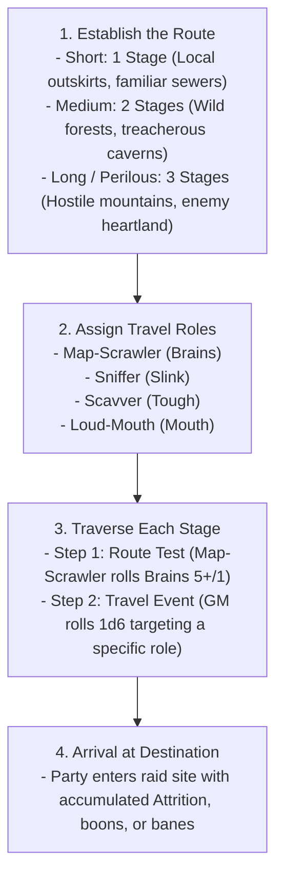

---

## 2. The Four Travel Roles

Every journey requires a clear division of labor (and someone to blame when disasters occur). All four **Travel Roles** must be assigned before rolling:

| Travel Role | Primary Attribute | Core Responsibilities & Duties |
| :--- | :---: | :--- |
| **Map-Scrawler** | **Brains** | Reads crude maps, interprets landmarks, and navigates routes. |
| **Sniffer** | **Slink** | Scouts ahead, detects ambushes, and smells out concealed traps. |
| **Scavver** | **Tough** | Clears physical debris, forages edible fungus, and hauls gear. |
| **Loud-Mouth** | **Mouth** | Enforces march discipline, suppresses panic, and silences bickering. |

### Mobs Assigned to Travel Roles
If playing with fewer than four players, a **Goblin Boss** may take multiple roles, or assign a commanded **Goblin Mob** to fill a vacant role:
* **Mobs testing Tough (Scavver):** Roll a dice pool equal to the **Mob's current Size** in d6s.
* **Mobs testing Slink, Brains, or Mouth (Sniffer, Map-Scrawler, Loud-Mouth):** Lesser goblins rely on collective cunning; they roll a baseline pool of **2d6** (as defined in [Mob Mechanics](06_Mob_Mechanics.md)).

>> **THE TRAVEL RESOLUTION RULE:**
>> The **GM** never rolls dice to resolve player success or failure during a journey. All tests are rolled by the players filling the designated roles. The standard success threshold for travel tests is **5+** (success on 5 or 6). Exploding 6s and standard fumbles apply.

---

## 3. Resolving a Stage

For each Stage of the journey, the party resolves two sequential steps:

### Step 1: The Route Test
The **Map-Scrawler** makes a **Brains 5+/1** navigation test against the route's baseline profile.

* **Success:** The route is clear. The party advances to the Stage's Travel Event with zero penalties.
* **Failure:** The party takes a grueling, hazardous detour. The entire party suffers **1 Mob Attrition** (every **Mob** in the party takes 1 point of damage to its active health die), and the party suffers a **Bane 1 (-1d)** on the upcoming **Travel Event** test.

### Step 2: The Travel Event
The **GM** rolls **1d6** on the **Gobbo Travel Event Table** below. The resulting event targets one of the other three roles, who must make a test to resolve it:

| d6 Roll | Event Name | Target Role | Stat Test | Success Outcome | Failure Outcome |
| :---: | :--- | :--- | :---: | :--- | :--- |
| **1** | **Narrow Pass** | Sniffer | **Slink 5+/1** | You slip through the crevices silently. | Gobbos get crushed by loose rocks. A **Mob** takes **2 damage** (or rolls armor defense). **Mobs of Size 3+** suffer a **Bane 1 (-1d)** on their next test. |
| **2** | **Deep Torrent** | Scavver | **Tough 5+/1** | The Scavver builds a crude rope bridge. | Gobbos are swept away. A **Mob** takes **Size damage** (losing 1 lowest-value health die, reducing Mob **Size** by 1), or you must discard 1 **Bulk** of equipped gear to save them. |
| **3** | **Spore Patch** | Scavver | **Tough 5+/1** | You harvest nourishing giant mushrooms. Restore 1 health point to a Mob's health die. | Poisonous bellyaches. Every **Mob** takes 1 damage. One random Boss tests **Tough 5+/1**; on failure, gains the **Weakened** condition. |
| **4** | **Bickering Over Loot** | Loud-Mouth | **Mouth 5+/1** | The Loud-Mouth cracks heads and restores order. Gain 1 **Loot** (T1) from the scrap. | Violent infighting! A **Mob** takes **1d6/2 (rounded up) damage**, and the Loud-Mouth Boss loses **1 Grunt**. |
| **5** | **Shadow Ambush** | Sniffer | **Slink 5+/1** | You detect the predator. Gain **Boon 1 (+1d)** on the first attack of the raid. | Caught off-guard! A random **Mob** takes **2 damage**, and the GM adds **+2 dice** to the shared **Bangaranga Pool** from the chaos. |
| **6** | **"Are We There Yet?"** | Loud-Mouth | **Mouth 5+/1** | The Loud-Mouth leads a rowdy, marching chant. | Desertion! The Loud-Mouth Boss loses **1 Grunt**, and one **Mob** shrinks by **1 Size** as runts sneak away. |

---

## 4. Return Journeys & Plunder Burden

Raiding a vault is simple; hauling heavy iron chests, bronze cauldrons, and gold idols back across the wilderness is where greed kills.

### Laden Mobs (> 50% Carry Capacity)
A **Mob** hauling significant expedition plunder (**Carried Bulk > Size x 2**) is **Laden**:
* **Laden** Mobs suffer **Bane 1 (-1d)** on all **Slink** and **Tough** tests during the return journey.
* The Map-Scrawler's **Route Test** required successes increase by +1 (e.g., from **Brains 5+/1** to **Brains 5+/2**).

### Over-Laden Mobs (Maximum & Dragging Capacity)
A **Mob** carrying at or above its unburdened carry capacity (**Carried Bulk >= Size x 4**, up to the dragging limit of **Size x 5**) is **Over-Laden**:
* **Over-Laden** Mobs suffer all penalties of being **Laden**.
* **Over-Laden** Mobs cannot roll passive armor defense dice against travel hazards.
* **Over-Laden** Mobs automatically take **1 damage** on failed Route Tests (representing exhaustion from dragging heavy scrap), in addition to standard party Attrition.
* If the party must flee or dodge a travel hazard, the party must immediately **discard 2 Bulk of Loot** per Over-Laden **Mob**, or that **Mob** becomes **Uncontrolled** as the Mob refuses to leave the plunder behind.

---

## 5. Environmental Hazards & Zone Profiles

All tactical environments (both during journeys and inside raid sites) are defined using the **Zone Profile** and **Zone Traits** framework.

### Zone Profiles
Every **Zone** possesses a standardized **Zone Profile** consisting of a **Difficulty** and a **Target Number (TN)** (e.g., `4+/1`, `5+/1`, `5+/2`, `6/2`).

>> **THE ZONE PROFILE PRINCIPLE:**
>> Any general environmental interaction, traversal, climbing, jumping, or search check attempted within a Zone defaults to using that Zone's Profile. The **GM** does not invent arbitrary DCs; all environmental tests test against the active Zone Profile.

---

### Zone Traits: Problems & Opportunities
A **Zone Trait** is a modular feature attached to a **Zone**, divided into **Problems** (Hazards/Obstacles) and **Opportunities** (Tactical Features/Treats):

#### 1. Predefined Problems (Hazards & Obstacles)
* **Burning (Hazard):** The Zone is engulfed in fire.
  * *Trigger:* Entering the Zone or starting a turn inside it.
  * *Rule:* Test **Slink** against the **Zone Profile** or suffer **1 Grit damage** (Boss) / **1 Size damage** (Mob). Spending a **Standard Action** extinguishes flames on self or an adjacent ally.
* **Narrow (Obstacle):** Tight tunnels or low sewer crawlspaces.
  * *Trigger:* Passive.
  * *Rule:* Maximum **Mob** size that can occupy the Zone without penalty is **Size 2**. Mobs of **Size 3+** suffer **Bane 1 (-1d)** on attacks and physical tests, and their **Movement** is capped at **1 Zone**. Giant enemies cannot enter.
* **Slippery (Obstacle):** Wet slime, grease, or ice.
  * *Trigger:* Entering the Zone.
  * *Rule:* Test **Slink** against the **Zone Profile** or fall **Prone** (movement ends immediately).
* **Smoky (Obstacle):** Dense smoke, fog, or spore clouds.
  * *Trigger:* Passive.
  * *Rule:* Ranged attacks targeting or passing through this Zone suffer **Bane 1 (-1d)**. Grants **Partial Cover** to all occupants.
* **Toxic (Hazard):** Poison gas or acid vapor.
  * *Trigger:* Starting a turn inside the Zone.
  * *Rule:* Test **Tough** against the **Zone Profile** or suffer the **Weakened** condition until a **Standard Action** is spent resting in a clean Zone.
* **Deep Water (Obstacle):** Flooded chambers or subterranean rivers.
  * *Trigger:* Passive / Traversal.
  * *Rule:* **Move** actions travel only **1 Zone**. Swimming creatures must test **Tough** against the **Zone Profile** each round or begin drowning (Bosses lose **1 Grit** per round; Mobs suffer **1 Size damage** per round).

#### 2. Predefined Opportunities (Features & Treats)
* **High Ground (Tactical Feature):** Ledges, scaffolding, or crate piles.
  * *Trigger:* Passive.
  * *Rule:* Ranged attacks made from this Zone gain **Boon 1 (+1d)**. Melee attacks made by enemies outside the Zone against targets inside suffer **Bane 1 (-1d)**.
* **Junk Pile (Treat):** Heaps of scrap iron, bones, and discarded tools.
  * *Trigger:* Interactive (**Manipulate** **Standard Action**).
  * *Rule:* Spend a **Standard Action** to test **Notice** against the **Zone Profile**. On success, unearth a throwable improvised weapon (1 damage ranged) or **1d6 Scrap**.
* **Shadowy (Tactical Feature):** Dark recesses and thick curtains.
  * *Trigger:* Passive.
  * *Rule:* Stealth and hiding tests made in this Zone gain **Boon 1 (+1d)** on **Slink**.
* **Shoring (Interactive Feature):** Wooden structural beams and pillars.
  * *Trigger:* Interactive (**Attack** or **Manipulate** **Standard Action**).
  * *Rule:* Spend a **Standard Action** to collapse the support beams. The Zone gains the **Crumbling** hazard (occupants test **Slink** against the **Zone Profile** or suffer **1 Grit damage** for Bosses / **1 Size damage** for Mobs) and blocks passage to adjacent Zones until cleared.

---

## 6. Journey Hazard & Event Structural Schema

Every journey hazard, weather obstacle, or wilderness encounter is defined by the following template:

```markdown
### [Hazard / Event Name]
- **Hazard Type:** [Environmental Obstacle | Ambush & Predator | Weather & Attrition | Social & Infighting | Trap & Debris]
- **Zone / Terrain Tag:** [Underground / Sewer | Forest / Wilds | Mountain / Chasm | Ruins / Keep | Swamp / Mire | Wasteland]
- **Target Role:** [Map-Scrawler (Brains) | Sniffer (Slink) | Scavver (Tough) | Loud-Mouth (Mouth)]
- **Trigger Condition:** [Route Test Failure | Travel Event Roll (1–6) | High Loot Weight]
- **Hazard Check & Difficulty:** [Stat tested against Target Number, e.g., Slink 5+/1 or Tough 5+/2]
- **Failure Consequence:** [Exact mechanical penalty: Mob Attrition damage, Boss Grit loss, Lost Bulk, Condition applied, or Alert increase]
- **Success Outcome:** [Hazard bypassed, Mob healed, Boon granted, or bonus Loot secured]
- **Mitigating Action / Avoidance:** [Equipment, Oddity, or alternative cost that bypasses the roll]
```

### Reference Hazard Instances

#### Rickety Rope Chasm
- **Hazard Type:** Environmental Obstacle
- **Zone / Terrain Tag:** Mountain / Chasm
- **Target Role:** Scavver (Tough)
- **Trigger Condition:** Travel Event Roll (2)
- **Hazard Check & Difficulty:** **Tough 5+/1**
- **Failure Consequence:** Planks snap. A **Mob** loses 1 health die (Size reduced by 1) or the party must drop 2 **Bulk** of carried equipment.
- **Success Outcome:** Ropes secured; the party crosses cleanly without delay.
- **Mitigating Action / Avoidance:** Spending 1 Climbing Kit or grappling hook guarantees automatic success with no roll.

#### Stalker Wolf Pack
- **Hazard Type:** Ambush & Predator
- **Zone / Terrain Tag:** Forest / Wilds
- **Target Role:** Sniffer (Slink)
- **Trigger Condition:** Travel Event Roll (5)
- **Hazard Check & Difficulty:** **Slink 5+/1**
- **Failure Consequence:** The pack attacks. A random **Mob** takes 2 damage and the starting **Alert** of the upcoming raid increases by +1.
- **Success Outcome:** Wolves are smelled and avoided; party gains **Boon 1 (+1d)** on their first ambush attack.
- **Mitigating Action / Avoidance:** Throwing 2 Bulk of meat or food distracts the wolves, bypassing the check.

---

## Content Extension Point

[CONTENT EXTENSION POINT: Journey Hazards & Events]

All future compendiums of travel encounters, wilderness terrain hazards, weather catastrophes, and subterranean navigation events must implement the Journey Hazard & Event Structural Schema defined above, respecting Travel Roles, Mob Attrition rules, and Zone Profile integration.

---

## Mechanical Gaps & Unresolved Systems

[MISSING RULE / GAP: Journey Terrain Difficulty Mapping & Transit Alert Coupling]
*   **Description:** Stage drafts define a flat Route Test of Brains 5+/1 regardless of terrain (mountains, swamps, or paved roads). Furthermore, loud transit failures (such as the Loud-Mouth causing a riot or failing an ambush test) do not mechanically feed into the starting Alert level of the upcoming raid.
*   **Why it is needed:** Travel difficulty should reflect the geographical environment, and noisy travel blunders should increase operational heat at the target site.
*   **Suggested Resolution:**
    1. Map Terrain Types to Route Test profiles: Mild Wilds = Brains 5+/1, Harsh Swamp/Chasm = Brains 5+/2, Perilous Mountains/Wasteland = Brains 6/2.
    2. Travel Failures that generate noise or reveal tracks add +1 to Starting Alert at the raid location.

[MISSING RULE / GAP: Mob Attrition Damage vs. Single Health Die Tracking]
*   **Description:** Route Test failure deals "1 Attrition (every Mob takes 1 damage to its active health die)". However, Mob damage rules in Chapter 06 track Mob health using a pool of d6s. The travel rules do not clarify whether Attrition damage spills over between dice if a die reaches 0, or how multi-die Mobs track travel wear.
*   **Why it is needed:** Inconsistent damage resolution between travel attrition and tactical combat creates table confusion.
*   **Suggested Resolution:** Explicitly state that Travel Attrition follows standard combat damage decrement: 1 damage reduces the active lowest health die of the Mob's pool. If a die reaches 0, it is removed and Mob Size decreases by 1, with excess damage spilling over into the next die.

---

<a id="doc-14"></a>
<!-- ============================================================ -->
<!-- DOCUMENT 14: 02_PROD_Core_Rules/12_Adversaries_and_Threats.md -->
<!-- ============================================================ -->
# Adversaries_and_Threats
*Source: `02_PROD_Core_Rules/12_Adversaries_and_Threats.md`*

# Adversaries and Threats

*Gobbos are small, loud, and easily crushed underfoot. The world is infested with towering knights, lumbering trolls, and howling beasts that want nothing more than to wipe your gang off the map. But tall-men fight in rigid formations, and monsters are predictable. Goblins win through numbers, dirty tricks, and chaotic swarm violence.*

---

## 1. Deterministic Threat Resolution Engine

In Gobbos, the Game Master (GM) **never rolls dice**. Adversaries do not test for success, roll to hit, or roll variable damage. Every enemy action is a deterministic, incoming physical threat.

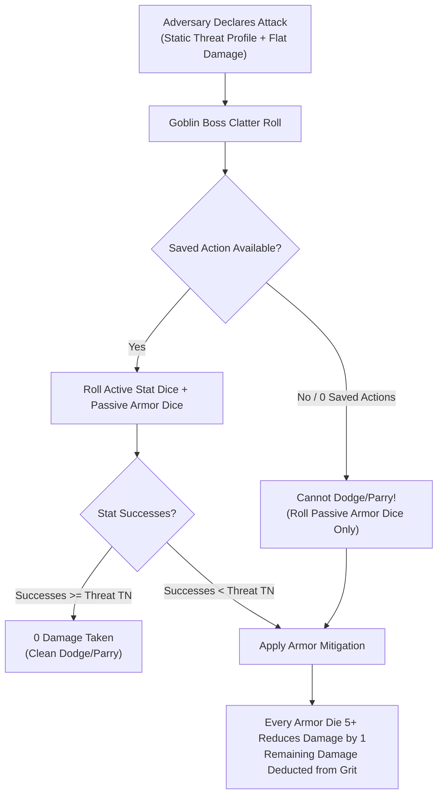

### Threat Profiles and Flat Damage
Every enemy attack is defined by a **Threat Profile** (`[Stat] [Target Face]+/[Successes]`) and a flat **Damage** value:
*   **Active Defense (Evasion):** When targeted by an attack, a **Goblin Boss** with a saved **Standard Action** rolls active stat dice (**Slink** to **Dodge**, or **Tough** to **Parry** if wielding a shield or heavy weapon). If the successes rolled meet or exceed the attack's **Threat TN**, the attack misses completely (**0 Damage taken**).
*   **Passive Defense (Armor):** If active evasion fails or the **Goblin Boss** has 0 saved actions, the attack hits. The player rolls passive **Armor Dice**; each die showing **5+** reduces incoming flat **Damage** by **1**.
*   **Unmitigated Damage:** Any remaining damage reduces the target's **Grit** (for Bosses) or removes health dice values (for Mobs).

---

## 2. The Three Enemy Scales

Adversaries are categorized into three distinct mechanical scales to govern how they absorb damage and die:

### 1. Standard Enemies (One-Hit Kill)
Standard enemies represent individual grunts, peasants, city guards, footpads, and minor monsters:
*   **One-Hit Kill:** When a player's attack scores successes equal to or greater than the standard enemy's **Defence TN**, the enemy is killed instantly and removed from the map.
*   **No Wounds:** Standard enemies do not possess a wounds track. Rolling fewer successes than **Defence TN** inflicts 0 damage (though it may inflict the **Staggered** condition if **Impact Size** meets or exceeds the target's physical **Size**).

### 2. Elites and Bosses (The Wounds Track)
Elites and Bosses represent formidable champions, armored commanders, and colossal apex predators:
*   **The Wounds Track:** Elites and Bosses track survivability using a **Wounds Track** (typically **2 to 8 Wounds**).
*   **The Overkill Rule:** An attack deals **1 Wound for every full multiple of the target's Defence TN** scored on a single attack roll:

**Wounds Dealt** = **Attack Successes** / **Target Defence TN** (rounded down)

>> **GOLDEN RULE: No Fractional Wounds**
>> Leftover successes that do not form a complete multiple of the enemy's **Defence TN** are discarded. They do not carry over to subsequent attacks.

### 3. Enemy Mobs (Swarms)
Enemy Mobs represent coordinated squads of standard foes acting as a single unit (e.g. a squad of 4 Town Watchmen or a swarm of 5 Giant Rats):
*   **Symmetrical Health Dice:** An Enemy **Mob** of **Size X** is tracked using **X physical d6s** on the table, each starting at the **"6" face**.
*   **Damage Resolution:** Single-target strikes damage the Mob's lowest active health die, spilling over to the next lowest die when a die reaches 0 and is removed.
*   **Frontline Rule:** Melee attacks from a player **Mob** apply damage simultaneously to a number of enemy health dice equal to the attacking Mob's current **Size**.
*   **Area Threats (`[AoE]`):** Full-zone explosive or breath hazards apply flat damage to **every single active die** in the Enemy Mob's pool simultaneously.
*   **The No Elite Mobs Rule:** Mobs can only consist of standard, one-hit-kill units. Elite and Boss enemies must always be fought as individual entities.

---

## 3. Enemy Mob Damage Scaling

An Enemy Mob's automatic attack damage scales deterministically with its current **Size**:

**Enemy Mob Damage** = **Base Unit Damage** + (**Current Mob Size** - 1)

*   **Attacking a Player Mob:** The Enemy Mob delivers this damage across the frontline, affecting a number of player goblin health dice equal to the Enemy Mob's current **Size** (targeting the lowest-value dice first).
*   **Attacking a Goblin Boss:** The Enemy Mob delivers this total damage as a single combined strike, which the **Goblin Boss** defends against using a single **Clatter Roll**.

---

## 4. The Three-Layer Trait Hierarchy

To eliminate rulebook page-flipping and prevent rules bloat during combat, all adversary behaviors are organized into a strict three-layer hierarchy.

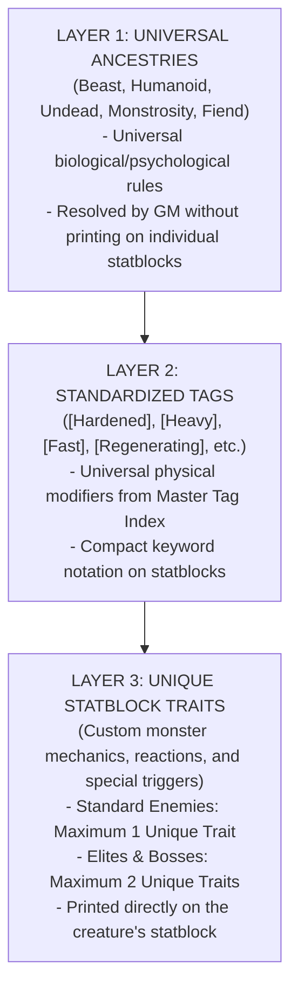

### Layer 1: Universal Ancestries
Every adversary belongs to exactly one **Ancestry**, establishing its core psychological and biological baseline:

#### 1. Beast
*   **Morale Vulnerability:** Triggers an immediate **Morale Check** if exposed to sudden `[Fire]` or `[Loud]` tags in its **Zone**.
*   **Predatory Instinct:** Gains a **Boon 1 (+1d)** to attack targets with the `[Tasty]` or `[Bleeding]` tag, prioritizing them over all other targets.
*   **Social Immunity:** Immune to verbal **Mouth** manipulation or intimidation.

#### 2. Humanoid
*   **Tactical Discipline:** Utilizes cover and prioritizes attacking enemy commanders (**Goblin Bosses**).
*   **Standard Morale:** Subject to group **Morale Checks** upon suffering 50% casualties or the death of a leader.
*   **Plunder:** Drops salvageable weapons, armor, and **Loot** upon defeat.

#### 3. Undead
*   **Morale & Fear Immunity:** Completely immune to **Morale Checks** and the **Terrified** condition.
*   **Biological Immunity:** Immune to the **Weakened** condition caused by poison or disease; immune to `[Bleeding]`.
*   **Holy Vulnerability:** Attacks carrying the `[Angelic]` or `[Light]` tags deal **+1 Success** (lowering effective **Defence TN** by 1).

#### 4. Monstrosity
*   **Mass & Stagger Resistance:** Immune to the **Staggered** condition from partial hits unless the attack's **Impact Size** meets or exceeds the monster's physical **Size** (Impact Size >= Size).
*   **Natural Cleave:** All melee attacks possess the `Cleave 2` trait (or higher), sweeping across multiple frontline health dice.

#### 5. Fiend (Demon)
*   **Fire & Terror Immunity:** Immune to damage and hazards with the `[Fire]` tag; immune to **Terrified** and **Dumb** conditions.
*   **Holy Bane:** Attacks carrying the `[Angelic]` tag ignore passive armor and reduce the Fiend's **Defence TN** by 1.
*   **Chaos Retaliation:** When a **Player** rolls a **Fumble** within 1 **Zone** of a Fiend, the Fiend immediately triggers a free reaction attack against that player.

### Layer 2: Standardized Tags
Tags represent universal physical modifiers (e.g. `[Hardened]`, `[Heavy]`, `[Teeny]`, `[Fast]`, `[Regenerating]`, `[Spiky]`). Their mechanical effects are identical across items, environments, and creatures (see [Combat Engine](05_Combat_Engine.md)).

### Layer 3: Unique Statblock Traits
Unique traits represent specialized combat maneuvers, reactions, or unique abilities printed directly on the creature's statblock:
*   **Standard Enemies:** Limited to a maximum of **one (1) unique statblock trait**.
*   **Elites and Bosses:** Limited to a maximum of **two (2) unique statblock traits**.

---

## 5. Enemy Action Economy, Reactions, and Group Attacks

### Action Economy
*   **Standard Action Pool:** On the Enemy Active Turn, each enemy unit (Standard, Mob, or Elite) receives **two (2) actions** per round to spend on **Move**, **Attack**, or **Manipulate** actions.
*   **Apex Bosses:** Colossal Bosses may possess traits granting **three (3) actions** or multi-phase action clocks.

### Enemy Reactions
Adversaries can trigger specialized reactions (such as parrying shields, retaliatory strikes, or steam vents) outside their active turn:
*   **Action Deduction:** Triggering an active reaction immediately expends **1 action** from the enemy's upcoming active turn.
*   **Reaction Cap:** Standard enemies and Elites may perform a maximum of **one (1) reaction per round**, and only if they have at least 1 saved action remaining. If an enemy has already spent both actions on its turn, it cannot trigger active reactions until actions reset at Round Start.

### Group Attacks (Enemy Swarms vs Bosses)
To prevent overwhelming action-economy drain and endless individual rolls when multiple standard enemies surround a single **Goblin Boss**:
*   **Combined Strike:** Up to **three (3) standard enemies** in melee range of the same **Goblin Boss** combine their attacks into a single strike.
*   **Damage Formula:** **Combined Damage** = **Base Damage** + 1 per additional attacking enemy.
*   **Single Defense:** The **Goblin Boss** defends against the combined blow using a single **Clatter Roll**.

---

## 6. Enemy Morale, Swarm Terror, and Rallying

### The Morale Trigger
An enemy group must make an immediate **Morale Check** during the **Round Closure Phase** if they suffer catastrophic collapse:
1.  The enemy group loses **50% or more of its total units** (or 50% of an Enemy Mob's starting **Size**).
2.  The enemy group's **Commander** is slain.

### The Swarm Terror Check
The players roll a combined **Swarm Terror Pool** against the enemy group's static **Morale TN** (testing against **5+** difficulty):

**Swarm Terror Dice** = **Surviving Mob Sizes in Zone/Adjacent** + **Surviving Bosses in Zone/Adjacent**

*   **Success (Successes >= Morale TN):** The enemy group breaks! The enemies drop heavy gear and must spend **two (2) Move actions** on their turns fleeing toward the nearest exit.
*   **Failure (Successes < Morale TN):** The enemies hold their ground and continue fighting.

### The Commander Rally
If an **Enemy Commander** survives and did not break, the commander may spend **1 Standard Action** on its turn to attempt a **Rally**:
*   **Opposed Roll:** The players roll their current **Swarm Terror Pool** against the Commander's **Morale TN**.
*   **Resolution:** If the players succeed, the goblin shouting and shield-banging drowns out the commander, and the troops continue fleeing. If the players fail, the commander restores order, and the troops return to combat.

---

## 7. Adversary and NPC Statblock Structural Schema

[CONTENT EXTENSION POINT: Bestiary & Adversary Statblocks]

All living bestiary compendiums, monster catalogs, and NPC adversaries must follow this deterministic statblock schema:

```markdown
### [Enemy Name]
*[Threat Classification: Standard | Elite | Boss | Enemy Mob] [Ancestry: Beast | Humanoid | Undead | Monstrosity | Fiend | Construct] (Size [0–5])*  
*(If Elite or Boss) **Wounds:** [Wounds Track Value, e.g. 2–8]*  
*(If Enemy Mob) **Mob Size:** [Size 1–5, tracked via X physical d6s]*

| Defence | Movement | Morale | Tags |
| :---: | :---: | :---: | :--- |
| **[Defence TN 1–4]** | **[Zones 1–4]** | **[Morale Profile, e.g. 5+/2, Immune]** | `[Tag 1]`, `[Tag 2]` |

**Special — [Unique Trait 1 Name]:** [Mechanical rule, trigger condition, and resolution. Standard enemies max 1 trait, Elites/Bosses max 2.]  
**Special — [Unique Trait 2 Name (Elite/Boss Only)]:** [Second unique trait or triggered reaction.]

#### Attacks
| Attack | Threat | Damage | Range | Special |
| :--- | :---: | :---: | :---: | :--- |
| **[Attack Name 1]** | `[Stat] [Face]+/[TN]` (e.g. `Slink 5+/1`, `Tough 5+/2`) | [Flat Damage, e.g. 1–4] | [Melee | Ranged (X Zones) | Zone-Wide] | [Traits: Cleave X, Piercing, inflicts Condition on failed evasion] |
| **[Attack Name 2 (Optional)]** | `[Stat] [Face]+/[TN]` | [Flat Damage] | [Range] | [Special effects] |

**Reactions:** [Specific out-of-turn triggers, deducting 1 action from active turn if used.]  
**Flaw Hook / Vulnerability:** [Specific Tag interaction that lowers Defence TN or makes attacks Easy (4+).]  
**Plunder:** [Salvageable Scrap tier, Loot Value tokens, or Oddity parts dropped on defeat.]
```

---

## 8. Mechanical Gaps and System Clarifications

[MISSING RULE / GAP: Enemy reaction economy is capped at 1 reaction per round for Standard and Elite foes. An enemy must have at least 1 saved action remaining to react; an enemy that spent both actions on its turn cannot react until Round Start.]

[MISSING RULE / GAP: The Swarm Terror pool formula sums both surviving Mob Sizes and surviving Goblin Bosses in the combat zone and adjacent zones. This ensures high-chaos goblin swarms exert psychological pressure proportional to their collective presence.]

---

<a id="doc-15"></a>
<!-- ============================================================ -->
<!-- DOCUMENT 15: 01_STAGE_Drafts/00_Rules/00_Overview.md -->
<!-- ============================================================ -->
# Rules — Overview
*Source: `01_STAGE_Drafts/00_Rules/00_Overview.md`*

# What is Gobbos?

This game is a **Rougelite Tactical Skirmish RPG** for Goblins that wants to be the big boss. 

The players will each control a goblin boss, that has a mob of smaller goblins and runts. They will compete and cooperatate to loot, trash, kill to climb the hierarchy of the Goblin tribe. But goblins are a fickle bunch. The mob of the goblins will easily disperse, flee, disobey or even attack each other or the player! Death is common, and usually met with a laugh from fellow Goblins. 

But fear not! A new goblin boss will soon step forth, and the game continues. The new boss will hopefully learned something from the previous failures, and emerge stronger than the previous boss. 

Meanwhile the GM will ensure that just getting that loot will be no easy challenge. He will play the guards in the village, the knights in the castle, the orcs in the camp, the skeletons in the dungeon and even the other goblin clans. None that really want a horde of dirty goblins invade their land and steal their stuff 

# Inspirations

The game takes quite a lot of inspiration from OSR games, such as old D&D, Shadowdark, Mausritter, Dungeon Crawl Classics, and more. 

It also takes inspiration from video games, such as Darkest Dungeon, XCOM series, etc. 

# The Core Loop

The game is played in sessions, where each session represents a delve into a dungeon, a raid on a village, or some other adventure. Between sessions, the players will return to their base, with whatever loot they could salvage, and try to improve their base to unlock new features. The players will thus not only level up their characters, but also their base, which in turn give them better equipment, more goblins, and other advantages in future sessions. 

# The World

The game is set in a fantasy world, where goblins are a race of small, green-skinned humanoids that live in tribes. They are not very strong, nor very smart, but they are many, and they are sneaky. They are also very good at looting, and they have a knack for finding trouble. They are typically considered a pest and nucieance by most other races. But more morally flexible races, such as humans, orcs and dwarves, will interact with them for trade, or for dirty work.

---

<a id="doc-16"></a>
<!-- ============================================================ -->
<!-- DOCUMENT 16: 01_STAGE_Drafts/00_Rules/01_Dice.md -->
<!-- ============================================================ -->
# Rules — Dice
*Source: `01_STAGE_Drafts/00_Rules/01_Dice.md`*

# Dice

Rolling dice is fun, and in Gobbos you roll a lot of dice if you are a player. The GM on the other hand never rolls dice, unless to possibly determine the outcome of a random event.

The only dice used in Gobbos are normal 6-sided dice, or d6. It is recommended that each player have bunch of them, preferably 8-10 dice in the same color.

## Tests

A [[Test]] in Gobbos is carried out by the player rolling a number of **d6s** (their [[Dice Pool]]). They then try to score as many [[Success|Successes]] as the GM has decided is the target for the [[Test]].

### Difficulty and Target Number

For any [[Test]], the GM sets a [[Difficulty]] and a [[Target Number (TN)]]. [[Difficulty]] depends on the circumstances, such as having the high ground when attacking or using quality lockpicks to pick a lock. [[Difficulty]] determines what counts as a [[Success]]:

*   **[[Easy]]:** A **4, 5, or 6** is a [[Success]]. *(Note: Certain special actions, such as a dying Boss's Last Act, are always Easy by default).*
*   **[[Normal]]:** A **5 or 6** is a [[Success]]. This is the default difficulty for most tests.
*   **[[Hard]]:** Only **6s** count as a [[Success]].

[[Target Number (TN)]] is typically fixed, such as how good armor an enemy has or the quality of the lock that is about to be picked. [[TN]] then denotes how many [[Success|Successes]] you need to make whatever you are trying to do.

Most of the time, you will roll a [[Normal]] test with a [[TN]] of 1, denoted as **5+/1**. This means that whatever number of dice you have in your [[Dice Pool]], you succeed if there is at least one **5** or **6**.

| Difficulty | Success on |
| :--- | :--- |
| [[Easy]] | 4, 5, 6 |
| [[Normal]] | 5, 6 |
| [[Hard]] | 6 |

> **Example:** Picking a lock is typically a [Slink](../01_Characters & Mobs/10_Stats.md#slink) **5+/1** test. But if the lock is of extra good quality, it could be a **5+/2** test. And if the lockpicker has brought quality lockpicks, it could turn into an **4+/2** test.

### Dice Pool

The player is responsible for assembling their [[Dice Pool]]. If they carry out the task with their [[Boss]], it is almost always equal to their main stat, modified by equipment, [[Quirk|Quirks]], [[Boon|Boons]] (**+1d**, **+2d**), or [[Bane|Banes]] (**-1d**, **-2d**). So, if you have a [[Tough]] stat of 2, you roll 2 dice, or **2d6**.

If rolling for a [[Mob]] instead, the base number of dice in your [[Dice Pool]] is equal to the [[Size]] of the [[Mob]]. A [[Size]] 2 [[Mob]] rolls **2d6**, a [[Size]] 5 [[Mob]] rolls **5d6**, etc.

### Zero Dice Pools (The Salvage Roll)

If penalties, conditions, or [[Bane|Banes]] reduce your [[Dice Pool]] to **0d6 or less**, the test automatically fails by default. However, goblins never give up without a desperate flail. You still roll a single **1d6** as a **Salvage Roll**:

*   **Roll a 6:** The action is miraculously salvaged, generating exactly **1 Success**. (This die does not explode).
*   **Roll a 1:** A catastrophic failure occurs—you immediately suffer a [[Fumble]] and lose 1 [[Grunt]] (if you have one or more [[Mob|Mobs]] in your zone or an adjacent zone).
*   **Roll 2–5:** The test fails normally without additional penalty or Fumble consequences.

### Exploding Dice

Every time you roll a **6**, it is not only a [[Success]] but it allows you to roll an additional die. If that roll is a **6** again, you keep rolling until you no longer roll **6s**. This makes it possible, but still perhaps unlikely, to get a lot of [[Success|Successes]] on a single roll. If you have enough dice, it is recommended to grab a new dice instead of rerolling the 6 to make it easier to see the total number of successes.

### Criticals

Whenever you roll a **6** that explodes, and the new die you roll also turns into a **6**, you have achieved a [[Critical Success]]! This impressive feat allows you to regain 1 [[Grunt]] (up to your maximum) and also grants you a surge of adrenaline, allowing you to immediately perform an additional non-offensive action (a [[Move]], [[Plunder]], or [[Manipulate]] action).

*(Note: Grunt is fully explained in the [Character Stats rules](../01_Characters & Mobs/10_Stats.md#grunt)).*

### 1s and Fumbles

Sometimes, luck is just a bad joke waiting for a punchline. When you roll a [[Test]] and fail to accumulate enough [[Success|Successes]] (your [[Success|Successes]] are less than the [[Target Number (TN)]]), but you have one or more dice showing **1s**, you can choose to push your luck and re-roll all of those **1s**. 

* **The Blessing:** If the re-rolled dice generate enough [[Success|Successes]] to meet or exceed the [[Test|Test's]] [[TN]], the [[Test]] succeeds normally. 
* **The Fumble:** If the [[Test]] still fails after re-rolling the **1s**, you have [[Fumbled]]! The effort backfires catastrophically, and you lose 1 [[Grunt]].
* **Accepting Failure:** If you choose not to re-roll the **1s** (or if you failed the [[Test]] but rolled no **1s** at all), the action simply fails normally. You do not lose 1 [[Grunt]] or trigger any Fumble effects.

## The Bangaranga Pool

Goblins are easily carried away by their own rowdy excitement. When the crowd gets hyped by awesome stunts, hilarious disasters, or massive payouts, their collective noise and rowdiness builds up. This is represented by a shared pool of dice called the [[Bangaranga Pool]]. These should be of a distinct color from the other dice, e.g. bright red.

### Seeding the Pool (Start of Raid)

At the start of a [[Raid]], the [[Bangaranga Pool]] is seeded with a baseline level of chaotic energy based on the size and composition of the raiding party:

| Number of Gobbos | Dice to Add |
| :--- | :--- |
| Number of [[Boss|Bosses]] | **1d** per [[Boss]] |
| Number of [[Mob|Mobs]] ([[Size]] 3 or 4) | **1d** per [[Mob]] |
| Number of [[Mob|Mobs]] ([[Size]] 5) | **2d** per [[Mob]] |

> **Example:** A 3-player raid party has one [[Size]] 3 [[Mob]], one [[Size]] 4 [[Mob]], and one [[Size]] 2 [[Mob]]. The starting [[Bangaranga Pool]] is **5d** (3 baseline + 1 + 1 + 0).

### Loading the Pool (Hype Triggers)

Dice are added to the physical [[Bangaranga Pool]] during a [[Raid]] when notable events hype up the horde:

| Event | Description | Dice to Add |
| :--- | :--- | :--- |
| [[Critical Success|Critical Successes]] | Any player rolls a [[Critical Success]] | **+1d6** |
| [[Fumbles]] | Any player [[Fumbles]] a test | **+1d6** |
| Defeating a Notable Enemy | Defeating an enemy with the `[Notable]` or `[Big Threat]` tag | **+1d6** |
| Claiming a Big Loot Cache | Looting a chest, room, or zone with the `[Big Loot]` or `[Hoard]` tag | **+1d6** |

### Tapping the Pool & The Bangaranga Tax

Before rolling any test, a player can choose to take a number of dice from the [[Bangaranga Pool]] (up to a maximum equal to their Boss's [[Grunt]] stat) and add them to their current test's [[Dice Pool]].

However, using the crowd's energy for mundane tasks is considered "cheating" and costs a premium:

| Condition | Consequence |
| :--- | :--- |
| If the number of Bangaranga dice taken is **less than or equal to the Target Number (TN)** of the test | It costs nothing extra. |
| If the number of Bangaranga dice taken is **greater than the test's TN** | It costs **1 extra die** from the pool as a tax. This tax die is simply removed from the pool and discarded back to the box (not rolled). |
| If the pool does not contain enough dice to cover both the dice rolled and the tax die | The player cannot take that many dice. |

> **Example (5+/2 Test):**
> *   If you take **1 or 2 Bangaranga dice**, it costs no tax. You simply take them from the pool and roll them.
> *   If you want to take 3 [[Bangaranga dice]], 3 is greater than the TN of 2. You must pay a **1 die tax**. This requires a total of **4 dice** to be present in the pool. 3 dice are rolled, 1 die is discarded.

### Rolling Bangaranga Dice - Double Explosion!

Every **6** rolled on a Bangaranga Die counts as 1 [[Success]], but it **explodes twice**, meaning you immediately roll *two* additional regular dice instead of one, which can themselves succeed or explode normally!

### Overreaching

If your [[Test]] fails when you use [[Bangaranga Dice]], you lose 1 [[Grunt]]. Because a failed [[Bangaranga]] roll already carries this penalty, you have nothing to lose by re-rolling any **1s** in a desperate bid for [[Success]]!

However, using the horde's noise carries a high risk of exhausting their hype. If you fail the [[Test]] when using [[Bangaranga Dice]] (either by choosing not to re-roll **1s**, or by re-rolling them and still failing), and your final roll contains any **1s** (including those rolled on the re-roll), you immediately drain the [[Bangaranga Pool]], removing a number of [[Bangaranga Dice]] from the pool equal to the number of [[Bangaranga Dice]] you took for the [[Test]].

---

<a id="doc-17"></a>
<!-- ============================================================ -->
<!-- DOCUMENT 17: 01_STAGE_Drafts/00_Rules/02 Combat.md -->
<!-- ============================================================ -->
# Rules — Combat
*Source: `01_STAGE_Drafts/00_Rules/02 Combat.md`*

# Combat and Actions
Combat is a key mechanic in Gobbos. The combat can either be only the PC against some foe, or a more tactical battle with loads of Goblins piling on. 
The combat is structured in a number of rounds, that are repeated until the combat ends. All the players act in the Players Active turn, and then the enemies act in the Enemy Active turn. But both can use Reactions to react to anything that the other does. 

## Actions
Actions represent how much a goblin can accomplish in a round. There are three types of actions:
1.  **Standard Actions:** Every PC has **three (3) Standard Actions** per round, reset at the start of each round. Standard Actions are spent to Move, Attack, Plunder, Manipulate, or Order. They can be saved to be used as Reactions.
2.  **Free Actions:** Minor tasks that cost no Standard Actions (e.g., dropping an item, speaking, or activating passive quirks).
3.  **Reactions:** Actions taken out of turn in response to enemy actions (e.g., Dodge or Parry). You must spend a saved [[Standard Action]] to perform a Reaction.
Additionally, PCs have **one (1) Free [[Order Action]]** per round (which does not count toward their 3 Standard Actions).

Each Mob has **two (2) actions**, which are also reset at the start of each round, but they only act when Ordered. When they are left to their own devices (see [[Uncontrolled Mobs]]), they act on their own as per a predefined priority list

### Actionlist
#### Move (Mob or PC)
With a Move action, you can move up to your [[Movement]] number of zones. The different conditions of the zones are taken into account, and the movement might be limited or entirely blocked by hazards. If a climb, swim, jump, or other physical feat is required based on the circumstances in the zone, you must typically make a [[Slink]] test. The [[Difficulty]] and [[TN]] default to the established [[zone profile]] (e.g., **5+/1**), subject to GM adjustment. 
#### Attack (Mob or PC)
The Attack action can only be used in the Players Active turn. 
To Attack, the player's base [[dice pool]] is based on the player's [[Tough]] for [[Melee attack]] and [[Slink]] for [[Ranged attack]], modified by any equipment, Quirks, or other circumstances. 
*   **Kill / Wound / Mob Damage:** If you roll successes equal to or greater than the target's current [[Defence]] (acting as the test's [[TN]]):
    *   *Standard Enemy:* Instantly defeated (**One-Hit Kill**).
    *   *Boss / Elite:* Deals **1 [[Wound]] for every full multiple of the target's Defence TN** scored on the roll (see [Enemies](../04_Enemies/20_Enemies.md)).
    *   *Enemy Mob (Single-Target Attack):* Reduces the face value of the Mob's lowest active health die by the attack's damage (or by 1 if untyped).
    *   *Enemy Mob (Mob-on-Mob Melee):* Resolves via the **Frontline Rule** (see [Goblin Mobs](../01_Characters%20&%20Mobs/13_Goblin_mob.md)), applying damage simultaneously to the enemy's lowest-value health dice up to your attacking Mob's current [[Size]]. *(Note: Melee dice pools may be constrained by environmental terrain, such as `Narrow` choke points; see [Movement & Zones](03_Movement%20&%20Zones.md)).*
*   **Stagger (Impact Size vs. Target Size):** If you roll at least **one (1) success** but fewer than the target's current [[Defence]] TN, the attack does not deal damage, but it can throw the target off balance. To inflict the [[Staggered]] condition, the attack's **Impact Size** must be equal to or greater than the target's **Physical [[Size]]** (Impact Size >= Target Size):
    *   **Calculating Impact Size:**
        *   *Standard Attacks:* Equal to the attacker's physical [[Size]] (a lone Goblin Boss is **Size 1**; a [[Mob]] uses its current **Mob [[Size]]**).
        *   *`Heavy` Weapon Trait:* Adds **+1** to Impact Size (a Size 1 Goblin swinging a heavy hammer attacks with **Impact Size 2**).
        *   *`Crushing` Weapon Trait:* Adds **+2** to Impact Size (attacks with **Impact Size 3**).
        *   *Explosives & Spells:* An explosion's Impact Size equals its **Tier** (T1 = Size 1, T2 Grenade = Size 2, T3 Powder Keg = Size 3, T4 Mortar/Cannon = Size 4, T5 Reactor = Size 5).
    *   *Result:* If Impact Size >= Target Size, the target gains the [[Staggered]] condition until the end of the round. If Impact Size < Target Size, the target has natural mass resistance and ignores the Stagger effect entirely.
*   **Bounce:** If you roll **zero (0) successes**, the attack bounces harmlessly off their armor. Nothing happens.
#### Plunder (Mob or PC)
The [[Plunder]] action is to pick up any [[Loot]] at where the Player or the Mob stands.  
#### Dodge / Parry (Reaction) & The Clatter Roll
The Dodge or Parry action can only be used as a [[Reaction]] to an incoming Attack or Environmental effect (typically during the Enemy Active turn). You **must** have saved a [[Standard Action]] from your turn to use this. If you have no saved actions, you cannot attempt to evade and must rely entirely on passive armor to absorb the blow!

When targeted by an attack with a listed **Threat** (e.g., `5+/1`) and **Damage** (e.g., `3`), resolve the defense in a single simultaneous throw—the **Clatter Roll**:
*   **Stat Dice:** Roll your active defense dice: [[Slink]] (for Dodge) or [[Tough]] (for Parry with an equipped shield or heavy weapon).
*   **Armor Dice:** Roll any passive bonus dice granted by your equipped [[Armor]] (use distinct colored dice, such as gray or black).

**Resolving the Clatter Roll:**
1.  **Check Stat Dice vs. Threat:** Count successes rolled on your **Stat Dice**. If your successes meet or exceed the attack's **Threat TN**, you achieve a clean Dodge or Parry: **you take 0 Damage**.
2.  **Mitigation on Failed Evasion:** If your Stat Dice fall short of the Threat TN (or if you had 0 saved actions), the evasion fails. You now look at your **Armor Dice**:
    *   Every success (**5+**) rolled on your Armor Dice reduces the incoming Damage by 1.
    *   Any remaining Damage is deducted directly from your [[Grit]].

**Mob Defense & The "Scatter!" Order:**
Mobs do not have individual attributes and cannot naturally dodge. A Mob has a strict maximum of **two (2) actions per round**. If an Order directed them to spend both actions on the Player Active turn, they have 0 actions left and cannot react. When targeted by an attack, a Mob resolves defense based on its state and available actions:
1.  **Passive Armor:** If equipped with Armor, the Mob rolls its passive Armor Dice **once per incoming attack**. Each success (**5+**) reduces the incoming attack damage by 1 across all targeted dice before damage is applied.
2.  **Active Scatter ("Scatter!" Reaction):** If a Mob has at least **1 unused action remaining**, the Boss can spend a saved [[Standard Action]] (or an unused Free Order) as a reaction to scream "Scatter!". The Mob uses its remaining action to roll active defense dice equal to the Boss's [[Mouth]] stat.
    *   **The Size Target Penalty:** Large mobs occupy more space and are sluggish to disperse. Every point of Mob [[Size]] above 1 increases the enemy attack's Threat TN by **+1** for the Scatter test (e.g., a Size 3 Mob faces a +2 TN penalty).
    *   **Clean Scatter:** If the Mouth dice meet the modified Threat TN, the Mob evades completely (0 damage) and immediately moves **1 Zone** into cover.
    *   **Failed Scatter:** If the Mouth dice fail, the Mob takes damage normally, reduced only by any passive Armor Dice successes.
    *   **Mob Gambling (High-Stakes Mouth Gamble):** If the initial Scatter roll falls short, the Boss may use the [[Gobbo Gamble]] to reroll all **1s** on the Mouth dice. 
        *   *If the Gamble succeeds:* The Mob pulls off a miracle dive and takes 0 damage.
        *   *If the Gamble fails:* Panic ensues! The Mob takes the full attack damage, suffers **1 Trample Damage** applied to every single die in the Mob's health pool (like an AoE crush), drops **1 Bulk** of carried [[Loot]], and immediately breaks into the [[Out of Control]] state. If the Boss is present in the same [[Zone]], the Boss is caught in the stampede and gains the [[Staggered]] condition until the end of the round.

### GM Tactics: Group Attacks (Enemy Swarms)
If multiple enemies surround and attack a Gobbo, the GM should NOT make separate attacks. Instead, they combine into a [[Group Attack]]. While a PC can only be attacked by a maximum of 3 enemies, there is no limit on attacker on a Mob
*   The base damage is the primary enemy's Attack stat, **+1 damage** for every additional enemy in the swarm. 
*   The player only spends **one** saved Action to Dodge/Parry the entire [[Group Attack]]. 
> *GM Advice:* Avoid splitting enemies into many small attacks against a single PC. This will instantly drain their saved actions and create a frustrating "death by a thousand cuts." Swarm them into Group Attacks instead!

#### Manipulate
The Manipulate action is a catch-all for whenever a Mob or PC tries to interact with an item or the environment in any way. The base [[dice pool]] is based on whatever attribute is most relevant to the action, modified by any equipment, Quirks, or other circumstances. The GM sets the [[Difficulty]] and [[TN]] (typically **5+/1**). 
*   **Player-Triggered Traps & Hazards:** When a player spends an action to trigger an environmental hazard or trap against enemies (such as dropping a chandelier or cutting a rope), the player first tests the relevant stat to activate it. To determine the effect without GM rolls, the player rolls the trap's listed **Damage Dice Pool** (e.g. 3d6, where each success on **5+** deals 1 Damage or 1 Wound).

#### Order 
The [[Order action]] is used to give commands to your goblins, directing a Mob to use up to their **two (2) actions** for the round. Standard Orders to controlled Mobs do not require a dice roll.
*   **The 3 Mob States:** A Mob is always in one of three states on their turn:
    *   **Ordered:** Direct instructions from the Boss. They spend 1 or both actions as ordered. If they spend both actions, they have 0 saved actions left for defense. If ordered to spend only 1 action (e.g. Move), their remaining 1 action is saved.
    *   **[[Loitering]]:** Under control, but receives no orders. Goblins use **1 action** to loiter (roll/choose on the [[Loitering]] Table in [Goblin Mobs](../01_Characters%20&%20Mobs/13_Goblin_mob.md)) and save **1 action** for defense (1d6 [[Defence]]).
    *   **[[Out of Control]]:** Broken command (out of sight, size exceeds Grunt, or failed morale). They spend both actions running amok under GM control (roll/choose on the [[Out of Control]] Table in [Goblin Mobs](../01_Characters%20&%20Mobs/13_Goblin_mob.md)), leaving them with 0 saved actions for defense.
*   **Regaining Control:** To regain control of an [[Out of Control]] Mob, the Boss must spend a [[Standard Action]] to [[Order]] them, resolving it using the standard command test rules in [Giving Orders](04_Giving%20orders.md). On a success, the Mob becomes controlled and receives their instructions; on a failure, they ignore the Boss and remain [[Out of Control]].
*   **Cross-Gang Super Mobs:** Issuing an Order to a Mob merged from multiple different player Gangs *always* requires a Grunt test (Test [[Tough]] if in the same Zone, or [[Mouth]] from afar).
*   **The Boredom Rule:** Mobs have short attention spans. When acting (Ordered, [[Loitering]], or [[Out of Control]]), a Mob cannot perform the exact same action twice (e.g., they cannot Attack twice, or Plunder twice). *Exception:* A Mob *can* take the Move action twice if they are fleeing or charging.
*   **[[Free Orders]] & Maximum Mobs:** Your ability to command the swarm is dictated strictly by your [[Mouth]] stat progression (see [[Stat|Stats]]). As you level up Mouth, you can command more Mobs simultaneously, and you are granted additional [[Free Orders]] per round. You never have to spend your Standard Actions to issue these [[Free Orders]]!


## Cover
Taking cover behind walls, pillars, or upturned tables protects you from ranged attacks. There are two levels of cover:
*   **[[Partial Cover]]:** You are partially blocked (e.g., behind a low barricade, crate, or thick foliage).
    *   **Attacking a target in [[Partial Cover]]:** If a PC or Mob attacks a target in [[Partial Cover]], the attack roll suffers a [[Bane]] (-1d).
    *   **Defending while in [[Partial Cover]]:** If you are in [[Partial Cover]] and are targeted by a [[ranged attack]], you gain a [[Boon]] (+1d) to your [[Dodge]] test.
*   **[[Full Cover]]:** You are completely hidden behind a solid obstacle (e.g., a stone pillar, wall, or closed door).
    *   You cannot be targeted by ranged attacks from that direction. An attacker must move to clear their line of sight or bypass the obstacle before they can attack.


## The Combat loop
The combat follows a structured loop, that is repeated until the combat ends. 
0. Combat Setup
1. Round start
2. Players active turn
3. Enemy active turn
4. Round closure 
5. Combat End
### Combat Setup
The GM sets up any combat at the start of the combat. This typically include a map of the environment, where the goblins and their enemy stands. The GM should point out any obvious places where there is environmental hazard, special conditions or so. However, not all might be visible to the players at once. There might be hidden traps, enemies in hiding or loot that is hidden. 
The GM should also mention what the objectives of the battle, in regards to where there are  [[Raid-Points]] to be gain.
The Setup happens once, and the rest of the steps are looped until you get to the Combat End. 
### Round start
Make a quick assessment on the status, who is where, who is hiding, and such to give everyone a fair view of the battlefield. 
#### Conditions
Any Conditions with Start of Round-activations happens now for all participants. 
#### Reinforcments
If any side gets reinforcements they are placed on the board now in a suitable zone. 
#### Points
The GM updates if there are any changes to the points to be awarded, such as a new location being discovered or a special character now appeared. 
### Players active turn
On the Players *active* turn, they can use any actions they want to move, plunder, attack, or execute other shenanigans.
1.  **Player Actions:** All player characters take their actions in any order. This is when Bosses can move, attack, or issue orders to control their Mobs.
2.  **Unordered Mobs:** Once all players have finished taking their actions, any Mobs that were **not ordered** this turn (both [[Loitering]] and [[Out of Control]] Mobs) resolve their behaviors. Roll on the appropriate behavior table for each.
During this phase, the GM may use enemy reactions to respond to players or mobs (e.g., taking opportunity shots or counter-attacking). 
### Enemy active turn
On the Enemy Active turn, all enemies take their actions. Standard enemies, Enemy Mobs, and Elites receive **two (2) actions** per round by default (used to Move, Attack, etc.). Truly colossal Apex Bosses or specialized monsters may possess traits granting **three (3) actions** or unique action clocks. If an enemy spent an action on a reaction earlier in the round, that action is deducted from their pool now.
In this phase, players might react to enemy attacks using saved Standard Actions (e.g., Dodge or Parry Clatter Rolls, or shouting "Scatter!" to a Mob with a saved action).
### Round closure
#### Points
[[Raid points]] are calculated, including currently held as well as confirmed, based on objectives and the basic Raid rules. 
#### Conditions
All around the table are recommended to do a short assessment of the current standing. How hurt any mobs are, where the enemies are and whatever conditions they might have. Any conditions with End of Round abilities is carried out now. Additionally, all [[Staggered]] conditions on PCs, Mobs, and Enemies are automatically removed. 
#### Moral check
The GM and the players do a [[Morale Check]] if needed, to see if some or all flees. Few opponents fight to the death, unless there is no alternatives (or they are immune to Morale)
#### Environmental effects
The GM checks for any changes in the Environment, such as spreading fire or smoke. Perhaps the a damn has been broken floods the battlefield or a fissure in the ground spews out lava. Note down any zones affected by these changes. 
#### Reset actions
If the combatants are still willing to fight, go back to the Round start, and resets everyone's actions.
### Combat End 
If there are no one fighting on one side, or one side gives up or flees, the Combat ends. 
#### Fleeing (Tactical Retreat)
Goblins are cowards at heart, and running away is a highly viable survival strategy.
*   **Escape Zones:** To flee an encounter, a PC or Mob must move into a designated escape zone or exit.
*   **Disengaging & Opportunity Attacks:** If a PC or Mob attempts to leave a Zone containing alert enemies, they trigger a reactionary Opportunity Attack from each enemy in the zone. To prevent this, they must spend a [[Standard Action]] to Disengage, testing [[Slink]] against a difficulty of **5+** and successes required equal to the highest enemy [[Defence]] TN (denoted as **5+/Defence**). On a success, they may move out of the Zone safely.
    *   *Bulk 3+ Restriction:* Hauling a loose Bulk 3+ item requires two hands. You **cannot perform a Disengage action** while clutching a Bulk 3+ item. To escape safely, you must either drop the item as a [[Free Action]], defeat the threatening enemies, or have a Mob carry the loot.
*   **Carrying Bulk:** Goblins fleeing with heavy treasure are slowed. Standard movement and dragging penalties for [[Bulk]] apply while fleeing. A PC or Mob can choose to drop their loot as a [[Free Action]] to restore full movement speed.
*   **Mob Fleeing:** Mobs flee when given a "Scatter" or "Retreat" Order, or automatically when a failed [[Morale Check]] triggers group panic.

---

<a id="doc-18"></a>
<!-- ============================================================ -->
<!-- DOCUMENT 18: 01_STAGE_Drafts/00_Rules/03_Movement & Zones.md -->
<!-- ============================================================ -->
# Rules — Movement & Zones
*Source: `01_STAGE_Drafts/00_Rules/03_Movement & Zones.md`*

# Movement, Zones, & Map Layout

The map architecture in **Gobbos** is designed to solve the "Panzer Brigade" dilemma: balancing a massive, chaotic horde of multiple players and 6 to 8 active squads without clogging the physical tabletop or turning a fast-paced rogue-lite delve into a slow traffic jam. 

The layout gives a clear, high-level sense of macro-exploration while dropping into highly dynamic, multi-level, gridless tactical theaters only when a fight breaks out.

---

## The Tabletop Layout (Visual Sketch)

At the physical gaming table, the components are arranged to keep macro-exploration and micro-skirmishes visually separated, ensuring clear command lines and zero clutter:

```
+---------------------------------------------------------------------------------+
|                                 THE GAMING TABLE                                |
+---------------------------------------------------------------------------------+
|                                                                                 |
|   [ Lair Sheet & Communal Hoard ]                     [ GM Screen ]             |
|   Tracks pooled Loot, Scrap, and Lair rooms.          Reference tables,         |
|                                                       encounter notes.          |
|                                                                                 |
|   +-----------------------------+         +---------------------------------+   |
|   |     MACRO MINIMAP           |         |        ACTIVE CLASH CLUSTER     |   |
|   |     (Point-Crawl Nodes)     |         |        (Micro Battleground)     |   |
|   |                             |         |                                 |   |
|   |  [Node A] <-- (Locked) -->  |         |   +---------+     +---------+   |   |
|   |     |                       |         |   | Zone 1  |     | Zone 2  |   |   |
|   |     v                       |         |   | Balcony |<--->| Hallway |   |   |
|   |  [Node B] (Horde Token)     |         |   | [Cover] |     | [Narrow]|   |   |
|   |     |                       |         |   +---------+     +---------+   |   |
|   |     v                       |         |        ^               ^        |   |
|   |  [Node C] (Active Encounter)|         |        |               |        |   |
|   |                             |         |        v               v        |   |
|   |                             |         |   +-------------------------+   |   |
|   |                             |         |   |         Zone 3          |   |   |
|   |                             |         |   |        Courtyard        |   |   |
|   |                             |         |   |        [Burning]        |   |   |
|   |                             |         |   +-------------------------+   |   |
|   +-----------------------------+         +---------------------------------+   |
|                                                                                 |
|                                                                                 |
|   [Player 1: Boss + Mob]        [Player 2: Boss + Mob]     [Player 3: Boss + Mob] |
|   - Boss Character Sheet        - Boss Character Sheet     - Boss Character Sheet |
|   - Mob D6 Health Tracker       - Mob D6 Health Tracker    - Mob D6 Health Tracker|
|   - Active Quirks & Gear        - Active Quirks & Gear     - Active Quirks & Gear |
|                                                                                 |
+---------------------------------------------------------------------------------+
```

---

## Core Architectural Concept: The Hybrid Map System

The physical table is split into two distinct visual tracking spaces: the macro-world where the horde travels, and the active micro-world where the blood spills.

### 1. The Macro Minimap (The Point-Crawl Blueprint)

Instead of a sprawling, room-by-room grid layout, the overall raid location (castle, village, or crypt) is tracked on a central node map.

*   **The Scale:** Individual goblin tokens do not live here. Instead, a single token representing the bulk of the horde moves along connected nodes.
*   **The Function:** It shows the pathways between major sections of the raid, locked doorways, known hazards, and designated escape zones used for tactical retreats. It tracks the progression of the raid at a glance without requiring any drawn architecture.

### 2. The Micro Battleground (Interconnected Clash Clusters)

When an encounter triggers at a node, the GM deploys a localized "Clash Cluster" consisting of 3 to 4 abstract, interconnected physical tiles or cards to represent the immediate environment.

*   **The Scale:** This is where the actual goblin boss miniatures and physical piles of **d6** squad dice are placed to resolve combat.
*   **The Fluidity:** A single battle easily bleeds across these local zones. For example, a street skirmish can seamlessly transition into a house interior or climb up onto a rooftop zone in real-time.

---

## Abstract, Gridless Zones

In Gobbos, [[Zones]] are used to create a framework for movement, especially in combat. A Zone can be of any shape, but is often clearly defined by the environment, such as a room, a corridor, or a field. 

A player's movement is measured in number of Zones, and a normal movement speed is to move 2 Zones per round and action.

---


## Zone Profiles

Every Zone in an encounter is assigned a default [[Zone Profile]] consisting of a [[Difficulty]] and a [[Target Number (TN)]] (e.g., **5+/1**, **5+/2**, or **6/1**).

>> **THE [[ZONE PROFILE]] RULE:**
>> Any general environmental interaction, traversal, or search test attempted within a Zone defaults to using that Zone's Profile. GMs do not invent DCs for individual tasks; they simply use the [[Zone Profile]].
>> *   *Example:* Climbing a wall, forcing a door, jumping a trench, or searching a junk pile in a Zone with a **5+/2** profile all require **2 successes** on a [[Normal]] (5+) test.

GMs can adjust the Difficulty level of a specific task based on tools or circumstances using standard [[Boon|Boons]] and [[Bane|Banes]] (e.g., using professional climbing gear grants a [[Boon]] (+1d) to the traversal test, while a rusty lock imposes a [[Bane]] (-1d) on the test), but the base TN and Difficulty remain tied to the Zone itself.

---

## Zone Traits

A [[Zone Trait]] is a mechanical modifier or effect associated with a specific Zone. Traits represent either obstacles players must overcome or advantages they can exploit. All traits fall under two general categories:

### Problems (Hazards & Obstacles)
These are negative environmental features.
*   **Triggering:** Problems trigger passively (continuous effect while occupying the zone), on entry (as soon as a creature enters the zone), or at a specific phase in the round (e.g., End of Round).
*   **Resolution:** To avoid negative effects, a player must make a relevant test (typically [[Slink]] or [[Tough]]) against the [[Zone Profile]]. On a failure, they suffer Wounds (Grit Loss), or a negative [[Condition]]. 
*   **GM Rolling:** GMs never roll to see if a hazard succeeds; the GM simply announces the hazard's trigger and the affected player rolls to resist.
*   **Hazard Damage Scaling:** Environmental hazard damage scales by severity:
    *   **T1 Hazard (Minor):** Deals 1 damage to a PC's Grit or a Mob's active health die on a failed test.
    *   **T2 Hazard (Dangerous):** Deals **2 damage**.
    *   **T3 Hazard (Lethal):** Deals **3 damage** or applies a severe condition.
    *   *Note:* Extreme catastrophic events (like a collapsing cave-in) can deal direct **Size damage** (removing the Mob's lowest-value D6).

### Opportunities (Tactical Features & Treats)
These are interactive or beneficial environmental features.
*   **Passive Benefits:** Some opportunities provide constant benefits (e.g., providing cover or granting a [[Boon]] to attacks).
*   **Interactive Benefits:** Goblins can interact with an opportunity by spending a [[Standard Action]] ([[Manipulate]] or [[Attack]]) and testing a relevant stat against the [[Zone Profile]] to yield a benefit.

---

## Predefined Zone Traits

GMs can customize battlefields by placing these standardized, modular traits onto Zones.

### 1. Static Environment (Terrain & Obstacles)

*   **Chasm / Pit (T3 Obstacle):** A gaping hole, trench, or cliff edge.
    *   *Trigger:* Attempting to cross, or being pushed toward the edge.
    *   *Rules:* Traversing requires a [[Slink]] test against the [[Zone Profile]]. On a failure, the creature falls in, taking **3 damage** and gaining the [[Restrained]] condition. Clambering out requires spending a [[Standard Action]] to test [[Tough]] against the profile.
*   **Deep Water (Obstacle):** Flooded chambers, sewer channels, or rapid rivers.
    *   *Trigger:* Passive / Interactive (for swimming).
    *   *Rules:* Traversing this Zone requires a [[Move]] action to travel only 1 [[Zone]] (ignoring standard movement speed). If forced to swim or stay afloat (directly in the water without a boat or bridge), a creature starting their turn in this Zone must test [[Tough]] against the [[Zone Profile]] or begin drowning (taking 1 damage per round).
*   **Narrow (Obstacle):** A tight crawlspace, pipe, doorway, or rocky crevice.
    *   *Trigger:* Passive.
    *   *Rules:* A Narrow zone defines a maximum physical capacity and frontline width (default **Size 2**, though specific zone descriptions may define tighter or wider limits). Mobs exceeding this capacity suffer a [[Bane]] (-1d) to all physical tests, have their Movement capped at 1 [[Zone]], and their maximum Melee Combat Dice pool / Frontline Width is capped at the zone's listed rating as backline units queue behind. Giant enemies cannot enter.
*   **Pillars / Statues (Tactical Feature):** Solid stone pillars or crumbling carvings.
    *   *Trigger:* Passive.
    *   *Rules:* Anyone occupying this Zone can declare they are taking cover behind a pillar (as a [[Free Action]]), granting them [[Full Cover]] against attacks coming from one specific adjacent Zone.
*   **Rubble (Obstacle):** Loose stones, steep scree, or collapsed vaults.
    *   *Trigger:* Traversing.
    *   *Rules:* Moving through this Zone costs double movement (spending 2 Zones' worth of movement speed to cross).
*   **Vertical Cliff (Obstacle):** A sheer stone wall, scaffold, or ladder.
    *   *Trigger:* Traversing vertically.
    *   *Rules:* Climbing requires a [[Move]] action and a [[Slink]] test against the [[Zone Profile]]. On a failure, the creature falls back to the bottom, taking 1 damage for every Zone's worth of height fallen and landing [[Prone]].

### 2. Dynamic Environment (Hazards & Triggers)

*   **Burning (T2 Hazard):** *Spreading fire, hot lava pools, or burning oil.* | `[Fire]`, `[Gaseous]`
    *   *Trigger:* Entering the Zone, or starting a turn inside it.
    *   *Rules:* The Zone imposes the active states of `[Fire]` (attacks deal **+1 Success**; ignites Zone) and `[Gaseous]` (ranged attacks suffer a [[Bane]]). Anyone entering or starting their turn in this Zone must pass a [[Slink]] test against the [[Zone Profile]] or take **2 damage** to Grit (PC) or active health die (Mob) and gain the [Burning] state. Fire spreads to adjacent wooden/flammable zones at the End of Round on a roll of 5–6 on **1d6** (rolled by the GM or a player).
*   **Crumbling Ceiling (T3 Hazard):** *Loose rock vaults, rotting timber supports, or ice stalactites.* | `[Crushing]`
    *   *Trigger:* Announce at Round Start or when triggered by structural damage.
    *   *Rules:* The Zone imposes the active state of `[Crushing]` (restricted movement, attacks are Easy). All creatures occupying the Zone must test [[Slink]] against the [[Zone Profile]]. On a failure, they take **3 damage** and are knocked [[Prone]]. After collapsing, the Zone permanently gains the **Rubble** trait.
*   **Howling Wind (T1 Hazard):** *Heavy drafts, storm winds, or venting steam.* | `[Gale]`
    *   *Trigger:* Passive.
    *   *Rules:* The Zone imposes the active state of `[Gale]`. All ranged attacks passing through or targeting someone inside this Zone suffer a [[Bane]] (-1d). Moving against the direction of the wind requires a [[Tough]] test against the profile; on a failure, movement speed is halved.
*   **Quicksand / Mud (T2 Hazard):** *Sticky mud or waterlogged silt.* | `[Wet]`, `[Sinking]`
    *   *Trigger:* Entering the Zone.
    *   *Rules:* The Zone imposes the active states of `[Wet]` (conducts electricity, extinguishes fire) and `[Sinking]` (downward drag). Any creature entering or moving in the Zone must test [[Slink]] against the [[Zone Profile]]. On a failure, they gain the [[Restrained]] condition. Breaking free requires spending a [[Standard Action]] to test [[Tough]] against the profile.
*   **Slippery (Obstacle):** *Smooth ice, wet grease, or organic slime.* | `[Slick]`
    *   *Trigger:* Entering the Zone.
    *   *Rules:* The Zone imposes the active state of `[Slick]`. Any creature attempting to move into or out of the Zone must test [[Slink]] against the [[Zone Profile]]. On a failure, they fall [[Prone]] and their movement ends immediately.
*   **Toxic Spores / Gas (T2 Hazard):** *Poisonous sewer gases, acid clouds, or mold spores.* | `[Toxic]`, `[Gaseous]`
    *   *Trigger:* Starting a turn inside the Zone.
    *   *Rules:* The Zone imposes the active states of `[Toxic]` (inflicts [[Weakened]] condition) and `[Gaseous]` (creates dark screen). All creatures starting their turn inside this Zone must test [[Tough]] against the [[Zone Profile]]. On a failure, they suffer the [[Weakened]] condition until they spend a [[Standard Action]] to catch their breath in a clean zone.

### 3. Environmental Blueprints (Weather & Complex Hazards)

GMs can construct complex, dynamic weather events or composite environmental hazards by layering multiple tags. The combined rules resolve simultaneously based on the active tags:

*   **Blizzard (T2 Hazard):** *A freezing, howling storm of snow and wind that swallows all sight.* | `[Chilled]`, `[Blinding]`, `[Slick]`
    *   *Rules:* The Zone is treated as freezing, blind, and slippery. Movement is halved (`[Chilled]`), ranged attacks are Hard and Dodge reactions are impossible (`[Blinding]`), and moving requires a [[Slink]] test against the profile or the creature falls [[Prone]] (`[Slick]`).
*   **Tornado (T3 Hazard):** *A roaring vortex of wind that sweeps debris and creatures into the air.* | `[Gale]`, `[Weightless]`, `[Loud]`
    *   *Rules:* The wind lifts creatures off the ground (`[Weightless]`), creating a deafening roar that fails stealth and verbal orders (`[Loud]`), while deflecting all ranged attacks (`[Gale]`). Creatures are swept up and tossed about; leaving the zone or stabilizing requires a [[Tough]] test against the [[Zone Profile]].
*   **Hurricane (T3 Hazard):** *Torrential rain combined with brutal, slamming winds.* | `[Wet]`, `[Gale]`, `[Loud]`
    *   *Rules:* Rain douses all fire and conducts sparks (`[Wet]`), violent wind gusts deflect ranged attacks (`[Gale]`), and the storm's noise drowns out all orders and stealth attempts (`[Loud]`).
*   **Sandstorm (T2 Hazard):** *Thick, choking clouds of abrasive sand and dust.* | `[Blinding]`, `[Gale]`
    *   *Rules:* Vision is blocked entirely (`[Blinding]`), making ranged attacks Hard and Dodge impossible, while high-velocity winds deflect projectiles and blow away loose items (`[Gale]`).
*   **Thunderstorm (T2 Hazard):** *Soaking downpour paired with crackling static electricity.* | `[Wet]`, `[Shock]`
    *   *Rules:* Everything is completely soaked (`[Wet]`). Any static spark or electrical attack instantly triggers the `[Shock]` tag's conduction effect, making all attacks against wet targets in the Zone **Easy (4+)** for 1 round.
*   **Wildfire (T2 Hazard):** *Searing heat, open flames, and thick screens of smoke.* | `[Fire]`, `[Gaseous]`, `[Loud]`
    *   *Rules:* Flames deal automatic damage and place burning effects (`[Fire]`), choking smoke obscures vision and blocks ranged attacks (`[Gaseous]`), and the roaring timber prevents quiet action (`[Loud]`).
*   **Flash Flood (T2 Hazard):** *A sudden wall of high-velocity water.* | `[Wet]`, `[Fast]`
    *   *Rules:* Water washes away chemicals and coatings (`[Wet]`) while rushing down-zone, allowing creatures to move 1 Zone as a [[Free Action]] (`[Fast]`) but carrying unattended items and creatures away in the torrent at the End of Round unless they pass a [[Tough]] test.
*   **Earthquake / Cave-In (T3 Hazard):** *Violent shaking and falling stone debris.* | `[Vibrating]`, `[Crushing]`
    *   *Rules:* The ground shakes violently, disrupting spellcasting and notice checks (`[Vibrating]`), while falling rocks pin creatures and slow movement to a maximum of 1 Zone (`[Crushing]`).
*   **Smog Marsh (T2 Hazard):** *A swamp filled with thick sewer gas where light dies.* | `[Wet]`, `[Toxic]`, `[Dark]`
    *   *Rules:* Waterlogged sumps conduct electricity (`[Wet]`), sewer gas inflicts the [[Weakened]] condition (`[Toxic]`), and poor visibility imposes a **Bane (-1d)** on attacks and notice checks (`[Dark]`).
*   **Haunted Woods (T2 Hazard):** *A dark forest filled with uncanny dread and phantom hands.* | `[Terrifying]`, `[Haunted]`
    *   *Rules:* Eldritch whispers inflict the [[Terrified]] condition (`[Terrifying]`), while phantom hands impose a **Bane (-1d)** to Slink and Mouth tests (`[Haunted]`).
*   **Acid Mire (T2 Hazard):** *A factory waste dump that slips and melts boots off.* | `[Acidic]`, `[Slick]`
    *   *Rules:* Acidic runoff eats away at armor reduction on a hit (`[Acidic]`), while slippery mud causes creatures to fall [[Prone]] on a failed Slink test (`[Slick]`).

### 4. Opportunities (Treats & Cover)

*   **Hedges / Thickets (Tactical Feature):** Heavy brambles, bushes, or hanging tapestries.
    *   *Trigger:* Passive.
    *   *Rules:* Anyone inside this Zone gains [[Partial Cover]] (ranged attacks targeting them suffer a [[Bane]] (-1d), and they gain a [[Boon]] (+1d) to [[Dodge]] reactions).
*   **Junk Pile (Treat):** Stacks of dungeon scrap, refuse, or broken weapons.
    *   *Trigger:* Interactive ([[Standard Action]]: [[Manipulate]]).
    *   *Rules:* Goblins can search the pile (test [[Brains]] against the [[Zone Profile]]). On a success, they find a throw-able object (deals 1 damage ranged) or a random piece of low-grade loot. Once successfully searched, the Junk Pile is exhausted and cannot be searched again during the raid.
*   **Shadowy (Tactical Feature):** Deep alcoves, heavy curtains, or dim corners.
    *   *Trigger:* Passive.
    *   *Rules:* Goblins attempting to Hide in this Zone gain a [[Boon]] (+1d) on their stealth-related [[Slink]] tests.
*   **Shoring (Interactive Opportunity):** Wooden structural beams supporting the ceiling.
    *   *Trigger:* Interactive ([[Standard Action]]: [[Manipulate]] or [[Attack]]).
    *   *Rules:* Goblins can collapse the beams. Test [[Brains]] (to sabotage) or make a successful [[melee attack]] against the [[Zone Profile]]. On a success, the Zone immediately gains the **Crumbling Ceiling** hazard (everyone in the zone tests [[Slink]] or takes **3 damage**), and all exits to adjacent Zones are blocked. Clearing a blocked exit requires spending a [[Standard Action]] to successfully test [[Tough]] against the [[Zone Profile]].

---

## Examples of Play

These scenarios illustrate how different hazards, opportunities, and Mob rules play out at the table.

### Example 1: Slipping on the Ice (Slink Tests)
> **Example:** Grub (PC) and his **Size 3** Mob run from town guards into a frozen courtyard designated as **Zone A** (Profile: **5+/2**; Trait: **Slippery**). 
> * **The PC**: Grub enters the zone and must make a Slink test. Grub has **Slink 2**, rolling **2d6** (Stat). He rolls `5, 5`—two successes! He keeps his footing.
> * **The Mob**: The Mob enters the zone. Mobs roll a base of **2d6** for [[Slink]] tests. The player rolls `5, 3`—only one success! The Mob fails the **5+/2** Slink test. The Mob falls [[Prone]] in a dog-pile, and their movement ends immediately in the middle of the ice sheet. Grub could choose to push the roll and reroll the `3`, risking a Fumble if it still fails!

### Example 2: Braving the Toxic Fumes (Tough Tests & Mob Scaling)
> **Example:** Snarl (PC) and her massive **Size 5** Mob are pursuing a dwarf through a sewer pipe designated as **Zone B** (Profile: **5+/2**; Traits: [Toxic] and **Narrow**). They start their turn in the zone.
> * **The PC**: Snarl has **Tough 2**, rolling **2d6** (Stat). She rolls `6, 3`. The `6` explodes and she rolls another `3`. The total is one success—not enough for the **5+/2** profile! Snarl fails the test and gains the [[Weakened]] condition.
> * **The Mob**: Because it is a Tough test, the Mob rolls [[Size]] dice (**5d6**). However, the zone has the **Narrow** trait, imposing a permanent [[Bane]] (-1d) on all physical tests. The Mob's [[dice pool]] is reduced to **4d6**. The player rolls `6, 5, 5, 2`. The `6` explodes and rolls a `4`. That is three successes! The Mob easily passes the test and is unaffected by the gas, their sheer numbers and mass helping them pull each other through.

### Example 3: Collapsing the Support (Shoring Opportunity)
> **Example:** Wizgog (PC) is cornered by a heavily armored knight in a crypt (**Zone C**, Profile: **5+/1**; Trait: **Shoring**). Wizgog wants to collapse the ceiling on the knight.
> * **The Action**: Wizgog spends a [[Standard Action]] to smash the rotten wooden support column. Since this is an interactive opportunity, he tests [[Brains]] (his stat is 3, so he rolls **3d6**) against the zone's **5+/1** profile.
> * **The Result**: He rolls `5, 2, 1`—one success! The column splinters. The Zone immediately triggers a cave-in (**Crumbling Ceiling**).
> * **The Resisting Tests**: 
>   * Wizgog tests Slink (**2d6**) and rolls `5, 1` (success), jumping clear of the debris.
>   * The Knight tests Slink. The GM rules the heavy armor imposes a [[Bane]] (-1d). The Knight rolls `3, 2` (failure). The Knight takes **3 damage** and is knocked [[Prone]], buried under rubble.
>   * The adjacent exit is blocked, cutting off the knight's allies.

---

## Background Node Resolution (The Chaos Tick)

If a player chooses to abandon a Mob in a previously cleared node on the macro minimap (for example, leaving them behind to forage for treasure or guard a chokepoint while the main party moves forward), that node is physically swept from the main table's active tactical space. 

Because they lack a Boss to command them, the split-off Mob is tracked purely on the macro node map. They default entirely to their automated Priority AI list:

1. **Survival**
2. **Loot/Eat**
3. **Violence**
4. **Trash Stuff**
5. **Wander Off**

### Resolving the Chaos Tick

At the end of each combat round, the player resolves the unsupervised Mob's actions using the **Chaos Tick**.

>> **THE CHAOS TICK RULE:**
>> Roll a number of **d6** equal to the unsupervised Mob's current [[Size]]. The Target Number and Difficulty default to the cleared zone's Profile (typically **5+/1**). 
>> *   **Successes (5+)**: Count successes to resolve the Priority AI's progress.
>> *   **Ones (1s)**: Each **1** rolled represents growing chaos and bickering. Tally the **1s** and consult the **Gobbo Mischief Table** below. Each **1** also adds **1 die** to the communal [[Bangaranga Pool]] as the background racket hypes up the horde.
>> *   **The Farkle**: If the roll yields **zero successes** and **two or more 1s**, the Mob fumbles catastrophically, triggering a disastrous event.

### The Gobbo Mischief Table (Tally of 1s)

| 1s Rolled | Mischief Result | Mechanical Outcome |
| :--- | :--- | :--- |
| **0** | **Smooth Operations** | No chaos! Gobbos cooperate perfectly. |
| **1** | **Bickering** | Goblins fight over a shiny rock. The Mob takes 1 damage to its active health die. |
| **2** | **Tasting Time** | They eat glowing mushrooms or lick rusty gears. The Mob gains the [[Weakened]] condition. |
| **3** | **Straying** | A few runts wander off into the dark. The Mob's [[Size]] decreases by 1. |
| **4+** | **Mutiny / Riot** | The Mob tears itself apart or rebels. The Mob becomes [[Uncontrolled]] and hostile to all Gangs, splitting into two smaller hostile mobs or wandering off the map entirely. |

### Resolution of Successes (5+ on Normal)

*   **0 Successes:** The Mob gets distracted pick-nosing. No progress is made.
*   **1 Success:** The Mob accomplishes a basic task. If foraging, they add 1d6 [[Scrap]] to the Hoard, or they heal **1d6 damage** on their health dice by eating old rations found in the zone.
*   **2 Successes:** They find a cache of useful garbage. Add 2d6 [[Scrap]] to the Hoard, or find a low-grade [[Oddity]].
*   **3+ Successes:** Outstanding teamwork! The Mob secures the node, making future travel through it **Safe** (no hazard checks required), and finds a piece of **Standard Loot**.

---

<a id="doc-19"></a>
<!-- ============================================================ -->
<!-- DOCUMENT 19: 01_STAGE_Drafts/00_Rules/04_Giving orders.md -->
<!-- ============================================================ -->
# Rules — Giving orders
*Source: `01_STAGE_Drafts/00_Rules/04_Giving orders.md`*

# Giving Orders

Goblin mobs without orders are prone to follow their most basic instincts—survival, eating, trashing things, or running away. This might be exactly what you want them to do! But if you need them to do something tactical, you have to Order them.

## Order Action
To give an Order in Combat counts as an action. 
#### Basic Order
A Basic Order is something that can reasonably be done by the goblins in a round. Good examples of orders are "Attack the Troll!", "Move into the barn!", "Smash the place up!" or "Eat all the food in here!". 
#### Advanced Order 
An Advanced Order is possible, but goblins are easily distracted and their memory is short. So any order that require a longer timespan have always an increased inherit chance of failure. These could be "Stand here and guard the door!", "Go to the forest Over There, and if there is loot, bring it back!" or "Circle around the house, touch nothing and report back what you saw!". 

### Flow of Order giving
This is the basic flow of giving an order: 
* Select which mob to order. You must be able to see it to command it. Seeing a portion of the mob is enough. So standing outside a house with a broken window with the mob inside is fine, standing behind a wall with the mob on the other side makes it impossible to order them. 
* Compare the size of the Mob to your current Grunt
	* If the Mob's [[Size]] is smaller than or equal to your [[Grunt]], the [[TN]] is 1 (requiring 1 success).
	* If the Mob is bigger than your [[Grunt]], the [[TN]] increases by 1 success for each point of difference in size! 
		* *Example: Your current [[Grunt]] is 3, allowing you to command a [[Size]] 3 [[Mob]] at **TN 1**. But if you are trying to command a [[Size]] 4 [[Mob]], the [[TN]] becomes 2 (requiring 2 successes).*
* Calculate the distance between you and the Mob
	* If they are in the same [[Zone]] as you, you gain one automatic success (this means giving an order to a [[Mob]] within your size limit in the same [[Zone]] will always succeed).
	* If they are in a [[Zone]] further away, the test is [[Normal]] (5+) if the distance is equal to or less than your [[Mouth]] stat. One [[Zone]] further away than your [[Mouth]] increases the difficulty to [[Hard]] (6), and further away than that is impossible. 
		* *Example: You have [[Mouth]] 2, so you can shout orders to a [[Mob]] up to 2 [[Zones]] away using a [[Normal]] (5+) test. Shouting to a [[Mob]] 3 [[Zones]] away increases the difficulty to [[Hard]] (6). Shouting 4 [[Zones]] away is impossible.*

---

<a id="doc-20"></a>
<!-- ============================================================ -->
<!-- DOCUMENT 20: 01_STAGE_Drafts/00_Rules/05_Raid points.md -->
<!-- ============================================================ -->
# Rules — Raid points
*Source: `01_STAGE_Drafts/00_Rules/05_Raid points.md`*

# Raid Points & Scouting

*Before you hit the trail, you need to know what you are raiding. Is it a peasant's pig sty or a heavily fortified dwarven outpost? Scouting reveals the targets, but chasing every last bit of glory will draw the guards' attention.*

[[Raid Points]] (Glory) measure the success and chaos of a raid. They are earned by completing objectives and are converted into shared Boss XP during Homecoming (see [Level Up & Death](15_Level_Up%20and%20death.md)).

---

## Danger Ratings

Every Raid Location has a [[Base Danger Rating]] from **1 to 5** (T1 to T5). This rating determines the strength of the enemies, the severity of environmental hazards, and the rate at which threats escalate.

*   **T1 (Low Risk):** Farmhouses, goblin outcasts, wild beast dens.
*   **T2 (Normal Risk):** Human villages, bandit hideouts, abandoned mines.
*   **T3 (High Risk):** Orc camps, fortified watchtowers, ancient ruins.
*   **T4 (Extreme Risk):** Dwarven fortresses, wizard towers, dragon-adjacent vaults.
*   **T5 (Legendary Risk):** Dragon lairs, lich vaults, demon-gate abysses.

---

## The Scouting Task

During the Labor step of the [[Lair Phase]], players can allocate **Laborer Dice** to [[Scouting]] a chosen Raid Location. Roll the allocated [[dice pool]] (successes on **4+**).

The number of successes determines what the party knows and what opportunities they can target:

*   **0 Successes (Going in Blind):** The party knows the location exists but nothing else. They do not know the Danger Rating or any Targets of Opportunity. The party suffers a [[Bane]] (-1d) on their first Zone entry test during the raid.
*   **1 Success:** Reveals the [[Base Danger Rating]] and the **Main Objective** (worth **3–5 [[Raid Points]]** upon completion).
*   **2 Successes:** In addition to the above, reveals 1 **Target of Opportunity** (worth **+2 [[Raid Points]]**).
*   **3+ Successes:** In addition to the above, reveals 2 **Targets of Opportunity** (worth **+4 [[Raid Points]]** total) and a **Secret Bypass** (granting the party a [[Boon]] (+1d) on their first Zone entry test).

>> **Targets of Opportunity**: These are secondary objectives revealed by scouting (e.g., *“Steal the Captain’s ledger,” “Burn the grain store,” or “Slay the guard dog”*). Completing them is optional but increases your total [[Raid Points]].

---

## Danger Scaling (The Alert Check)

Chasing extra Targets of Opportunity keeps the party in the Raid Location longer, increasing the likelihood of discovery and danger.

### The Alert Track
During a raid, the GM tracks the location's current **Alert level**. 
*   **Starting Alert:** The Alert level starts equal to the location's [[Base Danger Rating]] (e.g., 2 for a T2 village).
*   **Alert Checks:** Each time the party moves to a new Zone, completes a Target of Opportunity, or spends an active round resting/healing, the GM rolls **1d6**:
    *   If the roll is **strictly greater** than the current Alert level: The party remains undetected.
    *   If the roll is **less than or equal to** the current Alert level: A complication triggers. The GM rolls on the Hazard or Wandering Monster table, and the Alert level permanently increases by **+1**.

Completing the Main Objective and immediately fleeing is the safest route; staying to clear all Targets of Opportunity is a high-risk gamble that can easily trigger a total party wipe.

---

<a id="doc-21"></a>
<!-- ============================================================ -->
<!-- DOCUMENT 21: 01_STAGE_Drafts/00_Rules/06_Keywords Index.md -->
<!-- ============================================================ -->
# Rules — Keywords Index
*Source: `01_STAGE_Drafts/00_Rules/06_Keywords Index.md`*

# Keywords Index

This is a master list of the core game mechanics and goblin keywords to quickly reference while playing.

*   [[Action]]: The resource spent on a turn to perform standard or free maneuvers. Goblins receive 3 Standard Actions and Mobs receive 2.
*   [[Ancestry]]: The biological origin of a goblin (e.g. Cave, Forest) providing a starting stat package.
*   [[Area of Effect (AoE)]]: An attack or spell property that targets all characters or Mobs within a designated Zone.
*   [[Assert Dominance]]: A Lair Action testing Mouth or Tough to secure control over Lair facilities and thralls.
*   [[Attack]]: A Standard Action spent to engage an enemy in melee or ranged combat, rolling successes against their Defence.
*   [[Bane]]: A negative modifier that subtracts dice from a test's dice pool before rolling. Banes scale in integer steps: **Bane 1 (-1d)**, **Bane 2 (-2d)**, etc. If total Banes reduce a pool to 0d or less, the player rolls a 1d Salvage Roll.
*   [[Bangaranga]]: The chaotic energy generated by goblin failures, fuel for catastrophic fumbles and high magic.
*   [[Bangaranga Dice]]: Extra dice added to a roll by spending points from the communal Bangaranga Pool.
*   [[Bangaranga Pool]]: A communal pool of d6s built by fumbles and ones, spent by players to purchase temporary Boons or activate magic.
*   [[Base Danger Rating]]: The default difficulty profile of a raid, setting the default Difficulty and TN of all unlisted hazards.
*   [[Bite (B)]]: The instability of an Oddity. Ranges from 0 (pure, stable) to 3 (dangerous). Represents the negative consequences of using the Oddity.
*   [[Blinded]]: A condition blocking sight, making ranged attacks Hard and preventing Dodge reactions.
*   [[Blueprint]]: A physical item (Bulk 0) that records the structure of a specific Oddity effect. Produced by Reverse Engineering. Tradeable.
*   **[Bonded]:** A Tag on an Oddity that cannot be freely removed once installed. Removing it requires a specific condition defined by the GM.
*   [[Bone Oddity]]: An Oddity crafted from the remains of a dead Gobbo Boss. Always T1–T2, always B0–B1. Tags reflect how the Boss died.
*   [[Bone Pile]]: A memorial in the Lair where dead PCs are recorded, granting boons to their successors.
*   [[Boon]]: A positive modifier that adds bonus dice to a test's dice pool before rolling. Boons scale in integer steps: **Boon 1 (+1d)**, **Boon 2 (+2d)**, etc.
*   [[Boon|Boons]]: Positive modifiers adding bonus dice to a test's dice pool (**Boon 1 (+1d)**, **Boon 2 (+2d)**).
*   [[Boss]]: A player character or elite NPC possessing Grit, specialized Quirks, and command over Mobs.
*   [[Brains]]: Main stat representing wit, alchemical knowledge, and custom gear crafting capacity.
*   [[Bulk]]: A measure of how heavy/unwieldy an item is. High bulk reduces movement or requires multiple goblins.
*   [[Carry]]: An attribute indicating the maximum Bulk of items a character or Mob can carry without penalty.
*   [[Carry Capacity]]: The maximum weight or Bulk a character can carry without speed or action penalties.
*   [[Chassis]]: The base item that forms the body of a piece of Custom Gear. Built from Scrap. Determines the item type, Bulk, and base dice.
*   [[Clatter Roll]]: A simultaneous roll of active Stat Dice (Slink for Dodge or Tough for Parry) alongside colored passive Armor Dice. Meeting the Threat TN results in 0 damage; failing triggers Armor Dice to mitigate remaining damage.
*   [[Cleave|Cleave X]]: A weapon or monster attack property allowing melee strikes to sweep across multiple foes, dealing its damage simultaneously to up to **X adjacent targets** or up to **X of the lowest-value health dice** in a Mob (e.g., a standard Greataxe has `Cleave 2`, an Ogre has `Cleave 3`, and a Colossal Giant has `Cleave 5`).
*   [[Condition]]: A temporary state applied to a character or Mob, imposing penalties or mechanical limits.
*   [[Cover]]: Defensive positioning against ranged attacks. Partial cover grants a [[Boon]] (+1d) to Dodge, or imposes a [[Bane]] (-1d) on attacks. Full cover blocks targeting. See [[02 Combat]].
*   [[Crafting Capacity]]: The maximum number of Oddities that can be attached to a single item. Equal to the crafter's Brains score.
*   [[Critical]]: Rolling a **6** that explodes, and rolling another **6** on the resulting die (a double-six chain). It grants **+1 Grunt** and an immediate bonus action. See [Dice](01_Dice.md#criticals).
*   [[Critical Success]]: An exceptional roll resulting from double-six chains, granting bonus actions or Grunt recovery.
*   [[Custom Gear]]: Equipment built by a Gobbo Boss using a Chassis and one or more Oddities. Defined by Tier and Bite rather than a simple quality rating.
*   [[Defence]]: The static threshold (acting as a test's TN) that an attacker must meet or exceed in successes to hit or damage a target.
*   [[Defence TN]]: The target number of successes required to successfully hit or damage a creature.
*   [[Delivery]]: The method by which a magical spell is projected, such as Touch, Ray, or Zone.
*   [[Dice Pool]]: The total number of d6s rolled for a test, determined by a character's base stat, equipment, quirks, and Boon/Bane modifiers.
*   [[Difficulty]]: The die face needed to score a success (Easy 4+, Normal 5+, Hard 6). This is typically dependent on the circumstances of the test.
*   [[Dodge]]: An active Reaction to completely avoid an incoming attack by rolling Slink against the attack's Threat TN in a Clatter Roll.
*   [[Dominance]]: A Lair test made to command internal Lair factions or establish authority, reducing unrest.
*   [[Dragging]]: Hauling massive plunder exceeding your Over-Laden threshold (up to 2x Carry). Locks movement to 1 Zone, requires both hands, and prevents active Dodge or Parry reactions.
*   [[Dumb]]: A condition preventing the wielder from casting spells or using Brains-based active Quirks.
*   [[Duration]]: The timeframe that an effect, spell, or condition remains active on a target or Zone.
*   [[Easy]]: A test Difficulty requiring a die face of 4+ to score a success.
*   [[Elder]]: A player character who reaches a stat of 6 and automatically retires, granting a permanent passive boon to their Gang.
*   [[Elite]]: A powerful enemy tier possessing Wounds and Grit, behaving like mini-bosses.
*   [[Encounter]]: A distinct scene or battle segment during a raid.
*   [[Exploding Dice]]: Rolling a 6 counts as a success and allows you to roll another die.
*   [[First Pick ("My Mob, My Loot")]]: If a specific PC's Mob physically carries a usable item out of the dungeon, their Gang gets First Pick to claim it before the rest of the loot is pooled.
*   [[Free Action]]: Minor or immediate actions that cost no Standard Actions (e.g. dropping a weapon or speaking). See [[02 Combat]].
*   [[Free Orders]]: Extra command activations granted by Mouth progression that do not cost Standard Actions.
*   [[Full Cover]]: Positioning behind a solid obstacle that completely blocks direct targeting from ranged attacks.
*   [[Fumble]]: Rolling two or more 1s and zero successes. If you fumble near your Gobbos, you lose 1 Grunt.
*   [[Fumbled]]: A failed test result triggered by rolling two or more 1s and zero successes, causing mishaps or losing authority.
*   [[Fumbles]]: Mishaps triggered during tests by rolling multiple 1s without success.
*   [[Fumbling]]: The act of rolling multiple 1s with zero successes, leading to combat or environmental complications.
*   [[Gang]]: A PC's overarching group (e.g., *The Gnashers*). Death of a PC results in another gobbo from the same Gang taking over.
*   [[Gang Agenda]]: A long-term objective chosen by the Gang that rewards Infamy or Scrap upon completion.
*   [[Gang Agenda|Gang Agendas]]: A long-term objective chosen by the Gang that rewards Infamy or Scrap upon completion.
*   [[Gang Mark]]: The tracking sheet recording the Gang's shared upgrades, Lair rooms, and Infamy level.
*   [[Gang Quirks]]: Upgraded abilities shared by all members of a specific Gang, unlocked via Lair Upgrades and Infamy.
*   [[Gang Sheet]]: The master ledger recording a Gang's members, shared Infamy progress, and unlocked Lair rooms.
*   [[Glory]]: Raid points earned by completing objectives, pooled at the end of a raid to reward shared XP.
*   [[Glory (Raid Points)]]: Weightless points awarded for objective completion. At the end of the raid, all points are pooled, and the XP payout is shared equally among surviving PCs.
*   [[Greed (Loot Value)]]: The raw value of stolen goods. Pooled to upgrade the Lair and grant shared XP.
*   [[Grit]]: [TODO: Define] Your health or resilience. Reducing this to 0 triggers death or a Last Stand.
*   [[Group Attack]]: A consolidated GM attack where multiple surrounding enemies combine their strength into a single roll.
*   [[Grunt]]: Your authority. Can be spent before a roll (+1 Die per Grunt) or after a roll (Reroll any 1s). 
*   [[Hard]]: A test Difficulty requiring a die face of 6 to score a success.
*   [[Infamy]]: A progress track representing the reputation and plunder of a Gang, determining starting stat advances for new PCs.
*   [[Infamy Level]]: A measure of a Gang's overall standing based on their Loot contributions. Determines how many Stat Advances a newly respawned PC within that Gang starts out with.
*   [[Infamy Mark]]: A permanent marker of a Gang's progress, unlocked by pooling Loot Value during Lair Phases.
*   [[Junk]]: The lowest quality tier (T1) of equipment, constructed from flimsy scrap and prone to breaking.
*   [[Lair Phase]]: The downtime period between raids where players spend Loot to upgrade the Lair, craft, and level up.
*   [[Lair Upgrades]]: Improvements to the base bought with pooled Loot, granting permanent boons to all raiding goblins.
*   [[Legendary]]: The highest quality tier (T5) of equipment, crafted from mythic materials like godstone.
*   [[Loitering]]: A Mob state where no order is given. The Mob performs a minor loitering action and saves 1 action for defense.
*   [[Loot]]: Valuable scrap, gear, or treasures scavenged during a raid, categorized by Quality Tiers (T1–T5) and Bulk.
*   [[Loot Capacity]]: The maximum Bulk of items a goblin or Mob can carry during a raid without penalty.
*   [[Loot Value]]: The worth of treasure expressed in Tier tokens (T1–T5). Follows the 5-to-1 exponential scale (5x T1 = 1x T2, 5x T2 = 1x T3, etc.) for Lair smelting, purchases, and upgrades.
*   [[Main Stats]]: The four primary attributes defining a goblin: Tough, Slink, Brains, and Mouth.
*   [[Manipulate]]: A Standard Action catch-all used to interact with items, machinery, traps, or environmental components.
*   [[Marks]]: Communal Gang progression milestones equivalent to levels, unlocking new quirks and upgrades.
*   [[Max Mobs]]: The maximum number of Mobs a Boss can command simultaneously, determined by their Mouth stat.
*   [[Melee]]: Close-range combat conducted within the same Zone.
*   [[Melee attack]]: A close-quarters attack action testing Tough against the target's Defence.
*   [[Mob]]: A squad of lesser goblins commanded by a Boss (Player Character). Their Size determines their combat strength and carrying capacity.
*   [[Mob|Mobs]]: A squad of lesser goblins under a PC Boss's command, whose combat capability and health are determined by their Size.
*   [[Morale]]: A Mob's willpower tracker. Mobs check Morale when taking heavy losses to avoid mutiny or routing.
*   [[Morale Check]]: A Mouth or Grunt test made by a Mob when they take heavy losses to prevent them from fleeing or going Out of Control.
*   [[Mouth]]: Main stat representing leadership, mob command capacity, and free orders.
*   [[Move]]: A Standard Action allowing a character or Mob to cross a number of Zones up to their Movement rating.
*   [[Movement]]: A stat or action indicating how many Zones a character or Mob can cross on their turn.
*   [[Named Item]]: A piece of gear imbued with the spirit of a dead PC, possessing minor magical properties and "Gang Loyalty."
*   [[Normal]]: The default test Difficulty requiring a die face of 5+ to score a success.
*   [[Oddities]]: Unique components like demon hearts or elemental crystals attached to custom gear to add magical properties.
*   [[Oddity]]: A unique component (monster part, magical crystal, ancient mechanism) attached to a Chassis to give Custom Gear its special properties. Defined by a Tier (T) and Bite (B) value.
*   [[Order]]: A Standard Action used by a PC Boss to direct a Mob's actions, bypassing command rolls for controlled Mobs.
*   [[Order Action]]: The action spent to direct a Mob, executing their priority combat behavior.
*   [[Out of Control]]: A Mob state triggered by failed command rolls or size limits. The Mob acts randomly under GM direction.
*   [[Over-Laden]]: A load state where carried Bulk exceeds baseline Carry capacity (up to Carry + Tough). Reduces movement speed by 1 Zone and imposes Bane 1 (-1d) on physical Slink and Tough tests.
*   [[Overclock]]: A declaration made before an Attack Action that amplifies Custom Gear's effect to its maximum, destroys the item, and ignores the target's Passive Defence dice.
*   [[Overreaching]]: The risk of casting magic beyond safety limits, drawing d6s from the Bangaranga Pool and risking fumbles.
*   [[Parry]]: An active Reaction to block incoming melee attacks by testing Tough while holding a shield, reducing damage.
*   [[Partial Cover]]: Positioning behind partial obstacles, granting a Boon to Dodge and imposing a Bane on incoming attacks.
*   [[Passive]]: A Quirk or rule that is either always active or triggered automatically without costing a Standard Action, Grunt, or Free Order.
*   [[Passive Defence]]: Defence dice granted automatically by armor or positioning without requiring a Standard Action or Reaction.
*   [[Patron Saint]]: A chosen spirit of a dead PC from the Pile of Bones that grants a new PC a highly specific situational boon (so long as the new PC appeases them).
*   [[Persistent]]: An effect or spell duration that remains active across multiple rounds or encounters.
*   [[Personal Quirks]]: Unique abilities specific to a single PC Boss rather than shared across their Gang.
*   [[Pile of Bones]]: The resting place for glorious dead PCs. 
*   [[Player]]: The real-world participant controlling a goblin Boss and their associated Gang.
*   [[Plunder]]: A Standard Action spent to pick up and secure loose Loot, Scrap, or items in the current Zone.
*   [[Power Words]]: Modular magical components representing alchemical elements or domains used to construct spells.
*   [[Prone]]: A condition representing being knocked down. Restricts movement and imposes a -1d Bane on melee attacks.
*   [[Quality]]: The standard tier of construction for items, determining durability and crafting ceilings.
*   [[Quirk]]: A modular base ability (a "Knack" or action) that defines a character's fighting style or special talent. Measured in Tiers (T1-T5).
*   [[Quirk|Quirks]]: A modular ability or special talent measured in Tiers (T1–T5) that defines a character's action or passive benefits.
*   [[Raid|Raids]]: An expedition into dangerous territory to secure Loot, Scrap, and Glory for the Gang.
*   [[Raid]]: An expedition into dangerous territory to secure Loot, Scrap, and Glory for the Gang.
*   [[Raid Boss (MVP)]]: A title voted upon at the end of a raid. Grants the winner a Flair Item or Temporary Boon for the next raid.
*   [[Raid Points]]: Objective metrics earned during a raid that determine the final Glory and XP payouts.
*   [[Raid-Points]]: Objective metrics earned during a raid that determine the final Glory and XP payouts.
*   [[Ranged attack]]: A distant attack action testing Slink against the target's Defence, suffering Banes for cover.
*   [[Reaction]]: An action taken out of turn in response to a trigger (e.g., Dodge/Parry), costing a saved Standard Action. See [[02 Combat]].
*   [[Relic]]: A rare, powerful magical or alchemical oddity found during raids, used in advanced crafting.
*   [[Restrained]]: A condition preventing movement and imposing a -1d Bane to Dodge reactions.
*   [[Retire]]: The process of withdrawing a high-level goblin Boss (reaching a stat of 6) to become a Patron Saint or Elder.
*   [[Route Test]]: A travel test made during journeys using Brains or Slink to navigate path hazards and find safe passages.
*   [[Salvage Roll]]: A single **1d6** rolled when a test's [[Dice Pool]] is reduced to **0d6 or less**. A roll of **6** generates 1 [[Success]] (non-exploding); a roll of **1** triggers an immediate [[Fumble]].
*   [[Scarred]]: An Oddity that has survived a Scrap Cascade. Has permanently gained +1 Bite.
*   [[Scouting]]: A travel role utilizing Slink or Brains to identify path hazards and choose route options.
*   [[Scrap]]: Base resources used to build a Chassis. Comes in Tiers 1–5.
*   [[Scrap Cascade]]: When Custom Gear breaks, each Oddity rolls a d6 for survival. An Oddity that survives becomes Scarred (+1 Bite).
*   [[Scrappy]]: The second quality tier (T2) of equipment, representing crude but functional goblin forge-work.
*   [[Secondary Stats]]: Stats derived from main stats or leveling up, such as Grit, Grunt, and Carry.
*   [[Shenanigan]]: A high-chaos, situational action performed by a goblin character or Mob using their traits.
*   [[Size]]: [TODO: Define for PCs] Influences interactions like grappling, carrying, and being shoved.
*   [[Slink]]: Main stat representing agility, stealth, and ranged combat capability.
*   [[Staggered]]: A condition inflicted by partial combat successes, lasting until the end of the round and imposing a -1d active defense penalty.
*   [[Standard]]: The baseline quality tier (T3) for equipment, equivalent to standard human military gear.
*   [[Standard Action]]: The primary actions spent on a turn (3 per round). Used for Move, Attack, Plunder, Order, or Manipulate. See [[02 Combat]].
*   [[Stat]]: One of the numerical attributes defining a character's capabilities (Tough, Slink, Brains, Mouth).
*   [[Stats (Main)]]: Tough (T), Slink (S), Brains (B), and Mouth (M). Range from 1 to 5. Defines how many dice you roll.
*   [[Status Effects (Conditions)]]: Volatile states applied to characters (e.g., [[Prone]], [[Stunned]], [[Weakened]], [[Restrained]], [[Blinded]], [[Terrified]], and [[Staggered]]). See [Grit and Death](07_Wounds_Conditions.md#conditions).
*   [[Stunned]]: A condition causing a character or Mob to lose all actions on their turn and exposing them to easy attacks.
*   [[Success]]: A die roll that meets or exceeds the test's Difficulty face (usually 5+). Exploding 6s generate additional rolls.
*   [[Success|Successes]]: A die roll that meets or exceeds the test's Difficulty face (usually 5+). Exploding 6s generate additional rolls.
*   [[Superior]]: The fourth quality tier (T4) of equipment, representing high-quality dwarven smithing or rare alloys.
*   [[Tag|Tags]]: Dynamic elements and physical forces (always bracketed, e.g., `[Fire]`, `[Sticky]`, `[Toxic]`) that can be dynamically slapped onto or stripped away from zones, weapons, and creatures. For a full glossary of baseline tag behaviors and element synthesis rules, see [Master Tag Index](08_Master_Tag_Index.md).
*   [[Tag]]: A transient elemental, material, or magical state bracketed like [Fire] that can be dynamically attached to items or zones.
*   [[Taming]]: Spending 6s from the Crafting Roll to reduce an Oddity's active Bite level, boost base item stats, or add flavour tags.
*   [[Target Number (TN)]]: The total number of successes required to pass a test (e.g., in shorthand **5+/1**, you need one die to land on 5 or 6). This is typically a fixed number. 
*   [[Terrified]]: A condition forcing a character or Mob to flee from a source of fear and preventing them from closing distance.
*   [[Test]]: A roll of a d6 dice pool to determine success against a target face (Difficulty) and required successes (TN).
*   [[Threat]]: The incoming evasion profile of an enemy attack (e.g. `5+/1`), defining the Difficulty and TN a defender must meet to avoid damage.
*   [[Tier]]: The mechanical power level of a Quirk, Tag, Oddity, or item, ranging from 1 to 5.
*   [[Tier (T)]]: The power level of an Oddity's positive effect. Ranges from 1 to 5.
*   [[TN]]: Target Number. The total number of success rolls (usually meeting the Difficulty face) required to pass a test.
*   [[Tough]]: Main stat representing physical power, raw force, and melee combat capability.
*   [[Trait]]: A static mechanical property of armor, weapons, or zones that modifies rolls without participating in synthesis.
*   [[Traits (Weapon/Armor)]]: Static physical properties built into equipment (e.g., `Bashing`, `Cutting`, `Heavy`, `Loud`). They are permanent properties of the item's design, modify core rules math, and do not participate in element synthesis. See [Equipment](33_Equipment.md).
*   [[Travel Event]]: A random event resolved during journeys, indicating hazards, encounters, or opportunities.
*   [[Twist]]: A modifier attached to a Quirk that alters how it works or adds an extra effect. Multiple Twists can be attached to the same Quirk to create a "Molecule."
*   [[Uncontrolled]]: A state where a Mob ignores commands and acts randomly according to GM-controlled mischief tables.
*   [[Uncontrolled Mobs]]: Mobs that have broken command and resolve their actions randomly using behavior tables.
*   [[Weakened]]: A condition imposing a -1d Bane on all action tests.
*   [[Wound]]: A mark of serious physical trauma. PCs and Elite enemies are defeated or knocked down after taking their maximum Wounds.
*   [[Wound|Wounds]]: A mark of serious physical trauma. PCs and Elite enemies are defeated or knocked down after taking their maximum Wounds.
*   [[XP]]: Experience points earned by securing Loot and Glory, spent during Lair Phases to advance stats or purchase Quirks.
*   [[Zone]]: An abstract area of the battlefield (a room, a field, a corridor) used to measure movement and range.
*   [[Zone Profile]]: The default Difficulty and TN profile of a Zone (e.g. 5+/1) that traversal or manipulation tests in that Zone resolve against.
*   [[Zone Trait]]: A permanent physical attribute of a Zone (such as Slippery or Narrow) that applies passive modifiers.
*   [[Zones]]: Abstract spatial segments of the battlefield used to track distance, line of sight, and hazard boundaries.

---

<a id="doc-22"></a>
<!-- ============================================================ -->
<!-- DOCUMENT 22: 01_STAGE_Drafts/00_Rules/07_Wounds_Conditions.md -->
<!-- ============================================================ -->
# Rules — Wounds_Conditions
*Source: `01_STAGE_Drafts/00_Rules/07_Wounds_Conditions.md`*

# Grit and Death

[[Grit]] is the mechanical representation of a Boss's health and resilience. As the game aims for quick and deadly combat, it is up to the GM and player to decide how losing [[Grit]] is represented in the fiction. Mechanically, each point of [[Grit]] damage is the same, no matter the cause. Gobbos can't take many hits, but they heal quickly; lost [[Grit]] is typically fully recovered after a few hours of rest.

## Death

When a PC's [[Grit]] reaches 0, they are dead. However, they are allowed 1 [[Action]] + 1 [[Order Action]] that they can take immediately at the point of death as a final act. This allows the player to go out with a bang in an epic scene. Therefore, this final action is always [[Easy]], no matter the circumstances. The normal rules apply, but by the **Rule of Cool**, the GM should be lenient on what is possible. In the same way, the [[Order]] action cannot fail if the Mob being ordered is within range. Then, the Boss dies, and their gear is dropped where they fell.

### Temporary PC

The player cannot create a new PC until they are back in the Lair. But in the meantime, if a Mob of the Gang is still available, one goblin will step forward to take over as the temporary boss. This goblin is not a PC, but is controlled by the player. It has no talent (other than what is given as native for the whole Gang), and every stat is 1 lower than the deceased PC, to a minimum of 1.

# Conditions

There are a number of conditions that can affect a gobbo. Most of these have a direct effect on one stat for a PC, or a variety of effects for a Mob.

| Condition | PC | Mob |
|---|---|---|   
| [[Weakened]] | **-1d** on [[Tough]] | **-1d** on Attack |
| [[Restrained]] | **-1d** on [[Slink]], [[Movement]] becomes 0 | Cannot Scatter, [[Movement]] becomes 0 |
| [[Dumb]] | **-1d** on [[Brains]] and [[Mouth]] | **-1d** on Morale (TBD: Might fail to obey orders) |
| **Silenced** | **-1d** on [[Mouth]] | **-1d** on Morale |
| [[Blinded]] | **-1d** on Physical tests | **-1d** on Physical tests |
| [[Terrified]] | **-1d** on [[Brains]] and [[Mouth]] tests, cannot move closer to the source of fear | **-2d** on Morale tests, Order tests are Hard |
| [[Stunned]] | Cannot take any actions or reactions | Cannot take any actions or reactions |
| [[Prone]] | **-1d** on [[Slink]], 1 [[Move]] action to stand up | **-1d** on Scatter tests, 1 [[Move]] action to stand up |
| [[Staggered]] | **-1d** on [[Dodge]] and [[Parry]] tests | **-1 Armor Die** (or **-1d** on Scatter tests) |

*Note: For **Enemies** (who use static target numbers instead of stat pools), the [[Staggered]] condition reduces their [[Defence]] stat by **1** (minimum 1). The [[Staggered]] condition is temporary and automatically clears during the Round Closure phase. An attack can only inflict [[Staggered]] if its **Impact Size** meets or exceeds the target's physical **[[Size]]** (Impact Size >= Target Size). Attacks with lower Impact Size deal normal damage on a full hit, but cannot Stagger on a partial hit.*

# Healing

Gobbos are not very durable, but if they survive a fight they typically heal fully given some time. Your PC heals 1 [[Grit]] per hour. A Mob, however, does not heal. The losses they take are permanent as those are Gobbos that died. The only way to recover the [[Size]] of a Mob is to recruit new Gobbos, which can be done in the Lair.

However, once a battle is concluded, the Boss can organize their Mobs again and freely redistribute the damage dice.

> **Example:** A **3d6** Mob has taken a beating, and their damage dice after the battle read **3**, **4**, and **2**. The Boss can now rearrange the damage dice to **6**, **2**, and **1** (retaining [[Size]] 3 but with one goblin close to death), or perhaps to **5** and **4** (reducing the [[Size]] of the Mob to 2 in order to make it more stable).

## Healing from Conditions

Typically a condition is removed once the cause of it is removed. Usually this is obvious (e.g., leaving a smoke-filled room clears the [[Blinded]] or Smoky effect).

*   **Hazard Conditions:** Conditions inflicted by environmental hazards (such as [[Weakened]] from poison gas or [[Restrained]] from sticky mud) are removed once a PC or Mob spends a [[Standard Action]] ([[Manipulate]] or catching their breath) in a clean zone, or automatically at the end of combat.

---

<a id="doc-23"></a>
<!-- ============================================================ -->
<!-- DOCUMENT 23: 01_STAGE_Drafts/00_Rules/08_Master_Tag_Index.md -->
<!-- ============================================================ -->
# Rules — Master_Tag_Index
*Source: `01_STAGE_Drafts/00_Rules/08_Master_Tag_Index.md`*

# 08. Master Tag Index

*Goblins don't write dictionaries, but they do have a lot of words for things that burn, melt, smell, or go squish. A [Fire] blade sets a peasant alight; a [Sticky] Net keeps him from running; an [Angelic] word makes a knight's heavy plate feel like tissue paper. This is the master ledger of the active forces in the world.*

---

## 1. The Core Architecture: What is a Tag?

A [[Tag]] (always written in brackets, e.g., `[Fire]`, `[Sticky]`) is the dynamic systemic vocabulary of Gobbos. It represents a transient physical force, element, substance, or magical state that can be slung as a spell, crafted into an item, or applied to a zone. 

Unlike a creature's [[Ancestry]] (what it *is*) or an item's [[Trait]] (how it is *constructed*), a Tag represents a temporary state that can be dynamically attached or stripped away during play.

---

## 2. Pre-Roll Profile Calculations

>> **GOLDEN RULE: No Post-Roll Math**
>> To keep combat fast and chaotic, all tag interactions, vulnerabilities, and environmental modifiers must be resolved **before** the dice are thrown. Once the dice land, the result must be instantly clear.

When a player makes a test involving tags (e.g., attacking a monster with an elemental weapon), they calculate the **Roll Profile** in three quick steps:

1.  **Check Base Stats:** Look up the attacker's pool ([[Tough]] or [[Slink]]) and the target's base [[Defence]] TN and [[Difficulty]] 
2.  **Check Monster Hooks (Local Overrides):** Compare the attacker's weapon tags with the target's printed **Flaw Hooks** or **Resistance Hooks**:
    *   *Flaws:* If a tag matches a Flaw, it typically reduces [[Defence TN]] or makes the test **Easy (4+)**.
    *   *Resistances:* If a tag matches a Resistance, it typically increases [[Defence TN]] or makes the test **Hard (6)**.
3.  **Apply the Boon/Bane Cap:** Apply any environmental zone tags (e.g., a `[Slick]` floor or `[Strong Wind]` battlefield).
    *   *The Cap:* Multiple environmental Boons or Banes do not stack. You either have one Boon (**+1d**), one Bane (**-1d**), or they cancel to **0** bonus dice.

---

## 3. Element Synthesis

When two dynamic elements meet (either combined in [[custom gear]] crafting or overlapping in a zone), they synthesize into a new state. Element synthesis is resolved at creation or downtime to avoid combat speed-bumps.

*   `[Fire]` + `[Sticky]` $\rightarrow$ **Burning Glue**: Inflicts the *Restrained* condition and deals **+1 success** on the attack.
*   `[Toxic]` + `[Chilled]` $\rightarrow$ **Numbing Venom**: Inflicts the *Restrained* condition (movement becomes 0).
*   `[Wet]` + `[Shock]` $\rightarrow$ **Conduction**: Shakes the target's defenses, making all attack tests against them **Easy (4+)** for 1 round.
*   `[Wet]` + `[Fire]` $\rightarrow$ **Steam Cloud**: Immediately strips the `[Fire]` tag and creates a `[Dark]` zone hazard.
*   `[Fire]` + `[Volatile]` $\rightarrow$ **Detonation**: Immediately triggers a `[Explosive]` payload, clearing the source items.

---

## 4. The Master Tag Catalog

---

### Group 1: Elemental & Material States (Alchemical Hazards)

#### `[Acidic]`
*   *Flavor:* Sizzling green slime, corrosive bile, or rusted metal-eating juice.
*   *Universal Baseline:* Corrosion. Destroys 1 Passive Defense die granted by the target's armor on a hit.
*   *Fictional Interaction:* Eats through wood, leather, and metal, but is inert against glass or stone.

#### `[Chilled]`
*   *Flavor:* Frost-covered metal, frozen wind, or magical numbing cold.
*   *Universal Baseline:* Reduces the target's [[Movement]] by 1 Zone (minimum 0) for 1 round.
*   *Fictional Interaction:* Freezes standing water, cracks brittle stone, and extinguishes fires.

#### `[Explosive]`
*   *Flavor:* Black powder, pressurized boilers bursting, or volatile alchemical detonations.
*   *Universal Baseline:* Detonation. Produces an Area Threat Profile affecting all targets in the [[Zone]]. An explosion has an **Impact Size equal to its Tier (T1–T5)**, allowing it to **Stagger**, shove, or knock [[Prone]] any creature whose physical [[Size]] is equal to or smaller than the explosion's Impact Size (Impact Size >= Target Size).
*   *Fictional Interaction:* Shatters wooden barricades, collapses stone tunnels, destroys cover, and ignites `[Slick]` grease.

#### `[Fire]`
*   *Flavor:* Crackling embers, liquid pitch, or sudden alchemical heat.
*   *Universal Baseline:* Deals **+1 Success** on attack tests and places the `[Burning]` tag on the target's Zone.
*   *Fictional Interaction:* Ignites dry wood, melts ice, burns away ropes, and strips `[Wet]` tags.

#### `[Gaseous]`
*   *Flavor:* Choking green fumes, heavy mist, or toxic sulfur.
*   *Universal Baseline:* Suffocating screen. The Zone becomes `[Dark]` (ranged attacks suffer a [[Bane]]).
*   *Fictional Interaction:* Dispersed instantly by wind tags (`[Gale]`).

#### `[Shock]`
*   *Flavor:* Blue static sparks, crackling lightning, or sudden nerve spasms.
*   *Universal Baseline:* Arc damage. If the attack hits, it deals **1 automatic success** (against standard enemies) or **1 automatic Grit/Size damage** (against PCs/Bosses/Mobs) to one additional target in the same [[Zone]].
*   *Fictional Interaction:* Conducts instantly through metal armor (`Corporeal:Metal`) or water (`[Wet]`), making tests against them **Easy (4+)**.

#### `[Slick]`
*   *Flavor:* Buttered grease, wet ice, or slimy oil.
*   *Universal Baseline:* Slippery footing. Any creature attempting to Move into or out of the Zone must succeed on a [[Slink]] test or fall [[Prone]] (wasting their movement).
*   *Fictional Interaction:* Can be ignited by `[Fire]`, turning the zone into a raging greasefire.

#### `[Sticky]`
*   *Flavor:* Spider webs, boiling sap, or thick industrial glue.
*   *Universal Baseline:* Inflicts the [[Restrained]] condition (target cannot Move; suffers **-1d** to Dodge).
*   *Fictional Interaction:* Can be burned away by `[Fire]`, clearing the restraint but dealing 1 Grit damage.

#### `[Toxic]`
*   *Flavor:* Serpent venom, bubbling sewer gas, or glowing fungal spores.
*   *Universal Baseline:* Inflicts the [[Weakened]] condition (**-1d** to all action tests).
*   *Fictional Interaction:* Can be washed away with clean water. Ignored by constructs (`Construct`) and undead (`Undead`).

#### `[Wet]`
*   *Flavor:* Splashing water, damp swamp moss, or heavy rain.
*   *Universal Baseline:* Extinguishes the `[Burning]` tag on a creature or zone.
*   *Fictional Interaction:* Conducts electricity (triggers conduction with `[Shock]`), washes away poisons, and increases the difficulty of climbing.

---

### Group 2: Kinetic & Spatial Forces (Movement & Positioning)

#### `[Anchored]`
*   *Flavor:* Heavy gravity, roots wrapping feet, or electromagnetic clamps.
*   *Universal Baseline:* Target cannot move vertically, leap over hazards, fly, or use the `[Teleport]` tag.
*   *Fictional Interaction:* Forces flying beasts to land; keeps incorporeal spirits from phasing through floors.

#### `[Bouncy]`
*   *Flavor:* Rubbery alloys, compressed springs, or gelatinous membranes.
*   *Universal Baseline:* Kinetic ricochet. If a [[ranged attack]] using this tag misses, the projectile bounces, making an immediate attack check against a random adjacent target in the [[Zone]]. A projectile can only bounce once per attack.
*   *Fictional Interaction:* Allows gobbos to bounce off walls, adding **+1 Zone** of movement on a jump.

#### `[Crushing]`
*   *Flavor:* High-gravity fields, massive atmospheric pressure, or giant weights.
*   *Universal Baseline:* Compression. Target is slowed to a maximum of 1 Zone of movement. Attacks against the compressed target are **Easy (4+)** due to their restricted mobility.
*   *Fictional Interaction:* Collapses wooden structures, triggers cave-ins, and snaps tree branches.

#### `[Elastic]`
*   *Flavor:* Rubbery limbs, stretchy skin, or weirdly double-jointed bones.
*   *Universal Baseline:* Stretch. Increases melee range to Adjacent Zone (1 zone away) and grants a **Boon (+1d)** to escape physical restraints.
*   *Fictional Interaction:* Allows reaching high ledges, squeezing through narrow pipes, and bouncing back blunt physical impacts.

#### `[Fast]`
*   *Flavor:* Twitchy legs, high-velocity reflexes, or caffeinated energy.
*   *Universal Baseline:* High speed. Allows moving 1 [[Zone]] as a [[Free Action]] once per round.
*   *Fictional Interaction:* Harder to pin down; grants a **Boon (+1d)** to Dodge reactions.

#### `[Gale]`
*   *Flavor:* Whirling typhoons, blast valves, or wind spells.
*   *Universal Baseline:* Air current. All ranged attacks passing through the Zone suffer a **Bane (-1d)**. The wielder can spend 1 action to push a target to an adjacent Zone.
*   *Fictional Interaction:* Disperses gaseous clouds (`[Gaseous]`), blows away light bulk items, and deflects arrows.

#### `[Heavy]`
*   *Flavor:* Dense lead alloys, black-stone cores, or massive bulk.
*   *Universal Baseline:* Exhausting weight. The wielder suffers a **Bane (-1d)** on all tests unless they spend a [[Standard Action]] to brace. Target's carrying capacity is halved.
*   *Fictional Interaction:* Sinks instantly in water, collapses thin floors, and anchors items against wind.

#### `[Magnetic]`
*   *Flavor:* Lodestone shards, copper wire windings, or lightning-charged steel.
*   *Universal Baseline:* Pull. Pulls all metal objects or metal-armored creatures (`Corporeal:Metal`) in the Zone to the center. Metal targets suffer a **Bane (-1d)** to Dodge.
*   *Fictional Interaction:* Disarms metal weapons, forces iron doors open, and yanks knights into melee range.

#### `[Sinking]`
*   *Flavor:* Quicksand, boiling tar pools, or loose mud.
*   *Universal Baseline:* Downward drag. Any creature entering or moving in the Zone must succeed on a [[Slink]] test or become [[Restrained]].
*   *Fictional Interaction:* Heavy items sink instantly. Can be neutralized by freezing the surface with `[Chilled]`.

#### `[Teleport]`
*   *Flavor:* Purple smoke, folding space, or sudden pops.
*   *Universal Baseline:* Warp. Instantly move 1 Zone, ignoring all intervening obstacles, zones, and enemies.
*   *Fictional Interaction:* Bypasses physical locks, walls, and opportunity attacks.

#### `[Weightless]`
*   *Flavor:* Buoyant gas, levitation runes, or gravity negation.
*   *Universal Baseline:* Levitation. Target ignores vertical terrain, mud, and ground hazards. However, the lack of leverage causes a **Bane (-1d)** on Melee attacks.
*   *Fictional Interaction:* Allows crossing chasms, floating to ceilings, and drifting away in heavy wind.

---

### Group 3: Sensory & Mental Distortions (Perception & Focus)

#### `[Blinding]`
*   *Flavor:* Piercing flashes, pocket sand, or burning smoke.
*   *Universal Baseline:* Blindness. Target suffers the [[Blinded]] condition (attacks are Hard [6 only]; Dodge reactions are impossible) for 1 round.
*   *Fictional Interaction:* Clears shadow-camouflage and triggers panic in cave beasts.

#### `[Confusing]`
*   *Flavor:* Swirling colors, off-key humming, or backwards speech.
*   *Universal Baseline:* Bewilderment. Inflicts the [[Dumb]] condition (target cannot cast spells or issue orders; spends actions wandering aimlessly).
*   *Fictional Interaction:* Breaks concentration, ruins coordinated guard ranks.

#### `[Dark]`
*   *Flavor:* Thick shadows, magical gloom, or heavy black smoke.
*   *Universal Baseline:* Poor visibility. All attacks and notice tests in the Zone suffer a **Bane (-1d)**.
*   *Fictional Interaction:* Can be dispelled by `[Light]`. Enables stealth tests without cover.

#### `[Deafening]`
*   *Flavor:* Thunderstones, shrieking metal, or explosions.
*   *Universal Baseline:* Silence. Target is immune to verbal Mouth/Order actions and cannot hear incoming threats (attacks against them from behind gain a [[Boon]]). A deafened Mob cannot receive [[Order|Orders]] from their Boss.
*   *Fictional Interaction:* Disrupts verbal spellcasting, ruins coordinated troop maneuvers.

#### `[Echoing]`
*   *Flavor:* Hollow cavern chambers, metallic halls, or soundboards.
*   *Universal Baseline:* Amplification. Any noise or sound-based tag (like `[Loud]` or `[Deafening]`) has its duration doubled in this Zone.
*   *Fictional Interaction:* Shatters fragile glass structures if sonic tags are used.

#### `[Light]`
*   *Flavor:* Glowing sun-stones, holy lanterns, or dancing sprites.
*   *Universal Baseline:* Illumination. Strips the `[Dark]` tag from the Zone.
*   *Fictional Interaction:* Blinds shadow-dwelling creatures and triggers panic checks in cave beasts.

#### `[Loud]`
*   *Flavor:* Clattering copper pots, screeching alarms, or whistling gears.
*   *Universal Baseline:* Noise. Automatically fails any Slink/Stealth tests while active.
*   *Fictional Interaction:* Wakes up adjacent zones, alerts sleeping guards, and interrupts quiet spellcasting.

#### `[Phantasmal]`
*   *Flavor:* Shimmering light, auditory illusions, or ghost lights.
*   *Universal Baseline:* Illusion. Target suffers a **Bane (-1d)** to all attacks as they swing at illusory copies.
*   *Fictional Interaction:* Has zero physical mass. Can be disbelieved with a [[Brains]] test.

#### `[Shiny]`
*   *Flavor:* Gleaming gold coins, polished brass, or cut gems.
*   *Universal Baseline:* Distraction. Greed-obsessed minds (including player Goblins, dragons, and kobolds) suffer a **Bane (-1d)** to attacks/dodge unless they spend their turn moving toward the shiny object.
*   *Fictional Interaction:* Lures guards, distracts monsters, and triggers infighting among mobs.

#### `[Soporific]`
*   *Flavor:* Sweet poppy vapors, rhythmic humming, or sleep dust.
*   *Universal Baseline:* Drowsiness. Target suffers a **Bane (-1d)** to all tests. If they roll a Fumble, they fall asleep ([[Stunned]] until damaged).
*   *Fictional Interaction:* Lulls guard beasts, quietens rowdy mobs.

#### `[Tasty]`
*   *Flavor:* Roasted meat aromas, alchemical beast-lure, or sweet blood.
*   *Universal Baseline:* Bait. All beasts (`Beast`) gain a **Boon (+1d)** to attack rolls against the target and will prioritize them over all others.
*   *Fictional Interaction:* Triggers ravenous feeding frenzies.

#### `[Terrifying]`
*   *Flavor:* Overwhelming majesty, horror runes, or bloodcurdling shrieks.
*   *Universal Baseline:* Dread. Inflicts the [[Terrified]] condition (target suffers **-1d** to Brains/Mouth and must move away).
*   *Fictional Interaction:* Ignored by mindless constructs and undead.

---

### Group 4: Physiological & Physical Conditions (Health & Hardiness)

#### `[Bleeding]`
*   *Flavor:* Deep gashes, severed veins, or jagged iron wounds.
*   *Universal Baseline:* Lingering harm. The target takes **1 automatic Grit/Size damage** at the start of their round until treated.
*   *Fictional Interaction:* Attracts beasts, leaves a clear trail, and is ignored by undead and constructs.

#### `[Exposed]`
*   *Flavor:* Broken guard, off-balance posture, or shattered shields.
*   *Universal Baseline:* Open defense. All attacks against the target are **Easy (4+)** and ignore passive defense.
*   *Fictional Interaction:* Represents a perfect opening to strike.

#### `[Feral]`
*   *Flavor:* Beast blood, regression spells, or wild madness.
*   *Universal Baseline:* Beast regression. The target cannot cast spells, use complex items, or speak/issue orders. However, Melee attacks gain **+1 Success**.
*   *Fictional Interaction:* Governed by basic survival instincts.

#### `[Frenzied]`
*   *Flavor:* Boiling blood, red mist, or uncontrollable rage.
*   *Universal Baseline:* Berserk state. Target must spend all standard actions to Move toward and [[Melee Attack]] the nearest creature (friend or foe) in melee range on its turn.
*   *Fictional Interaction:* Bypasses self-preservation, ignores pain, and causes the target to break tactical cover.

#### `[Hardened]`
*   *Flavor:* Spiked scales, stone hide, or thick chitin.
*   *Universal Baseline:* Reinforcement. Increases [[Defence TN]] by +1 (maximum 5) against `Cutting` and `Poking` attacks.
*   *Fictional Interaction:* Impervious to minor cuts and arrows.

#### `[Itchy]`
*   *Flavor:* Fungal rash, stinging spores, or hives.
*   *Universal Baseline:* Distraction. Frantic scratching. Target cannot use Reactions (no Dodge/Parry) as they scratch.
*   *Fictional Interaction:* Ruin concentration, breaks guard.

#### `[Mindless]`
*   *Flavor:* Lobotomized servants, hollow puppets, or simple plants.
*   *Universal Baseline:* Cognitive void. Immune to `[Spooky]` (fear) and `[Confusing]` (dumb) tags. Cannot take independent actions; must be ordered.
*   *Fictional Interaction:* Unaffected by illusions or mental manipulation.

#### `[Puppet]`
*   *Flavor:* Soul-strings, blood magic, or master-runes.
*   *Universal Baseline:* Domination. The caster can spend 1 [[Standard Action]] on their turn to force the target to perform a Move or basic Attack action on the target's turn.
*   *Fictional Interaction:* Forces enemies to attack their own allies.

#### `[Regenerating]`
*   *Flavor:* Troll blood, rapid cell division, or life-magic.
*   *Universal Baseline:* Rapid healing. Target heals 1 [[Wound]] or 1 [[Grit]] at the start of their turn.
*   *Fictional Interaction:* Cannot regenerate if damaged by `[Fire]` or `[Acidic]` tags this round.

#### `[Rotting]`
*   *Flavor:* Putrid flesh, necrosis, or gangrenous moss.
*   *Universal Baseline:* Decay. The target cannot recover [[Grit]] or heal wounds while this tag is active.
*   *Fictional Interaction:* Smells terrible, spoils food, and ruins non-metal gear over time.

#### `[Spiky]`
*   *Flavor:* Covered in sharp barbs, glass shards, or rusted nails.
*   *Universal Baseline:* Thorns. Any creature attacking the target in Melee takes **1 automatic success** (against standard enemies) or **1 automatic Grit/Size damage** (against PCs/Bosses/Mobs) on a hit.
*   *Fictional Interaction:* Ruin grappling attempts, damages ropes and nets.

#### `[Swollen]`
*   *Flavor:* Giant mass, muscle bloat, or alchemical growth.
*   *Universal Baseline:* Gigantism. The target's [[Size]] increases by 1. Melee attacks gain a **Boon (+1d)**, but Slink/Stealth tests suffer a **Bane (-1d)**.
*   *Fictional Interaction:* Cannot fit through narrow bottlenecks.

#### `[Teeny]`
*   *Flavor:* Pixie dust, shrinking potions, or magic runes.
*   *Universal Baseline:* Shrinking. The target's [[Size]] decreases to 0. Slink/Stealth tests and Dodge tests gain a **Boon (+1d)**, but carrying capacity is 0.
*   *Fictional Interaction:* Can slip through keyholes and under doors.

---

### Group 5: Metaphysical & Cosmic Anomalies (Reality-Bending Laws)

#### `[Angelic]`
*   *Flavor:* Blinding gold radiance, choral echoes, or pure law.
*   *Universal Baseline:* Holy aura. Attacks against standard foes are **Easy (4+)**.
*   *Fictional Interaction:* Highly destructive to undead (`Undead`) and demons, reducing their [[Defence TN]] by 1.

#### `[Blessed]`
*   *Flavor:* Fortunate whispers, gleaming luck, or a patron's favor.
*   *Universal Baseline:* Good fortune. The target ignores their first Fumble during an encounter.
*   *Fictional Interaction:* Clears minor curses and dark tags on contact.

#### `[Cursed]`
*   *Flavor:* Dark runes, weeping blood, or terrible luck.
*   *Universal Baseline:* Bad fortune. The target fumbles on *any* rolled 1s (rather than needing two 1s).
*   *Fictional Interaction:* Can only be cleared by a Lair ritual or a specialized quest.

#### `[Haunted]`
*   *Flavor:* Lingering ghosts, cold drafts, or phantom hands.
*   *Universal Baseline:* Spectral curse. The target suffers a **Bane (-1d)** to Slink and Mouth tests. Any [[fumbled]] roll summons a minor ghost (`Undead:Spirit`) that attacks the target.
*   *Fictional Interaction:* Can be cleansed with holy tags (`[Angelic]`) or exorcisms.

#### `[Laggy]`
*   *Flavor:* Temporal distortion, slow-motion fields, or stuttering movements.
*   *Universal Baseline:* Time lag. The target's declared action does not resolve until the End of Round phase.
*   *Fictional Interaction:* Allows allies to interrupt, flee, or block the attack before it hits.

#### `[Linked]`
*   *Flavor:* Sympathetic soul-tethering, silver threads, or blood pacts.
*   *Universal Baseline:* Soul-tether. When two targets are `[Linked]`, any damage or conditions suffered by one are instantly mirrored onto the other. Damage or conditions mirrored by `[Linked]` cannot trigger further `[Linked]` mirrors.
*   *Fictional Interaction:* Allows clever players to harm bosses by attacking linked minions.

#### `[Nullified]`
*   *Flavor:* Anti-magic circles, lead runes, or cold iron anchors.
*   *Universal Baseline:* Dead-zone. Temporarily deactivates all active supernatural traits, magical tags, and [[oddities]] in the [[Zone]].
*   *Fictional Interaction:* Turns magic weapons back into normal scrap, shuts down spellcasting.

#### `[Petrified]`
*   *Flavor:* Medusa glare, basilisk breath, or stone-flesh curses.
*   *Universal Baseline:* Stone state. Target is [[Stunned]] (cannot act) but gains +3 Passive Defense dice.
*   *Fictional Interaction:* Target becomes incredibly heavy and brittle to blunt impacts.

#### `[Poofed]`
*   *Flavor:* Banishing smoke, planar rifts, or sudden displacement.
*   *Universal Baseline:* Planar banishment. Target is removed from the map entirely. They return at the start of the next round in the same spot. If the spot is occupied when they return, they appear in the nearest unoccupied space.
*   *Fictional Interaction:* Traps targets in a timeless pocket dimension.

#### `[Purified]`
*   *Flavor:* Healing water, clean sunlight, or restorative runes.
*   *Universal Baseline:* Exorcism. Instantly removes all poison, decay, curses, and diseases from the target.
*   *Fictional Interaction:* Cleanses corrupted objects or defiled zones.

#### `[Revealing]`
*   *Flavor:* Glowing lenses, true-sight dust, or magical lanterns.
*   *Universal Baseline:* Expose. Instantly reveals invisible entities, ignores illusions, and exposes hidden doors.
*   *Fictional Interaction:* Discredits `[Phantasmal]` tags.

#### `[Serene]`
*   *Flavor:* Calming incense, pacifism runes, or angelic presence.
*   *Universal Baseline:* Pacifism. Attacks and violence are impossible in this [[Zone]]; characters must spend 1 [[Grunt]] or 1 [[Grit]] to override the calm.
*   *Fictional Interaction:* Forces negotiations, halts raging mobs.

#### `[Siphoning]`
*   *Flavor:* Vampiric runes, soul-drain valves, or parasitic thorns.
*   *Universal Baseline:* Life drain. Successful attacks recover 1 Grit/Size for the attacker (up to their maximum limit).
*   *Fictional Interaction:* Feeds the wielder's vitality.

#### `[Spectral]`
*   *Flavor:* Intangible, ghost-like properties that allow slipping through physical walls and armor.
*   *Universal Baseline:* Intangibility. Bypasses physical walls and ignores Passive Defense dice from armor.
*   *Fictional Interaction:* Attacker cannot be physically touched or blocked.

#### `[Vile]`
*   *Flavor:* Demonic corruption, defiled blood, or dark runes.
*   *Universal Baseline:* Defilement. Corrupts holy or blessed things, converting them into cursed states.
*   *Fictional Interaction:* Spoils holy water, defiles shrines.

---

### Group 6: Mechanical & Material Flaws (Systemic Failures)

#### `[Bonded]`
*   *Flavor:* Grafted flesh, parasitic spirits, or soul-locked steel.
*   *Universal Baseline:* Soulbind. Once equipped, the item cannot be removed, discarded, or stored.
*   *Fictional Interaction:* Bypasses standard disarm attacks. Removing the item requires a Lair ritual, an amputation, or a specialized GM quest.

#### `[Fragile]`
*   *Flavor:* Brittle clay, cheap alloys, or rusty wires.
*   *Universal Baseline:* Cheap build. Item breaks permanently on a Fumble (ignoring standard durability break checks).
*   *Fictional Interaction:* Shatters under sudden impact or stress.

#### `[Jammed]`
*   *Flavor:* Clogged gears, snapped springs, or dirt in the barrel.
*   *Universal Baseline:* Gridlock. Item cannot be used until a [[Standard Action]] (and a [[Brains]] test) is spent to clear the jam.
*   *Fictional Interaction:* Disables mechanical devices.

#### `[Overcharged]`
*   *Flavor:* Humming power cells, unstable alchemical pressure, or magical feedback.
*   *Universal Baseline:* Volts. Next attack gains **+2 Successes**, then the tag is consumed.
*   *Fictional Interaction:* Risks exploding if the attack fumbles.

#### `[Unstable]`
*   *Flavor:* Nitroglycerin canisters, loose gears, or cursed runes.
*   *Universal Baseline:* Fragility. [[Fumbling]] an action triggers a T3 explosion (`[Explosive]`) in the [[Zone]].
*   *Fictional Interaction:* Detonates at the slightest bump.

---

<a id="doc-24"></a>
<!-- ============================================================ -->
<!-- DOCUMENT 24: 01_STAGE_Drafts/01_Characters & Mobs/10_Stats.md -->
<!-- ============================================================ -->
# Characters & Mobs — Stats
*Source: `01_STAGE_Drafts/01_Characters & Mobs/10_Stats.md`*

# Stats

Your Boss has four [[Main Stats]], a set of derived [[Secondary Stats]] tied to them, and [[Grunt]], which represents your authority and command energy. Your [[Main Stats]], as well as your maximum [[Grunt]], range from **Level 1** to **Level 5**. Level 1 is the starting value. Increasing a stat not only adds more dice to your [[Dice Pool]] for related tests, but it also provides mechanical upgrades to your Boss's capabilities.

---

## Tough (T)

Used for violence, resilience, intimidation, and lifting stuff. [[Tough]] is simply how strong in body the Boss is, and the most important stat for direct combat. Most attacks will use [[Tough]] as the basis for your [[Dice Pool]].

[[Tough]] has two [[secondary stats]]: [[Grit]] (your health) and [[Carry]] (how much equipment and loot you can carry).

| Level | Grit | Carry |
| :---: | :---: | :---: |
| **Level 1** | 3 | 6 |
| **Level 2** | 4 | 8 |
| **Level 3** | 4 | 10 |
| **Level 4** | 5 | 12 |
| **Level 5** | 5 | 14 |

### Grit

[[Grit]] is your health, which defines how many hits the Boss can take before he dies. When your [[Grit]] is 0, you are dying and probably dead very soon. A higher [[Tough]] score is vital to survive the [[Raid|Raids]], while a low [[Tough]] makes you rely on your Gobbos or stealth to survive.

### Carry

[[Carry]] defines how many units of [[Bulk]] you can carry. Both equipment and loot have a [[Bulk]] rating, and with a higher [[Tough]], you can both go well armed to the [[Raid]] as well as carry a lot of loot back. While a low [[Carry]] means hard priorities.

---

## Slink (S)

Used for sneaking, dodging, and all manners of dirty tricks. [[Slink]] is how agile, dexterous, and quick on your feet you are. A higher [[Slink]] allows for greater movement on the battle map, and a higher chance to dodge any incoming attack.

[[Slink]] has two [[secondary stats]]: [[Movement]] (how far you can move per action) and [[Passive Defence]] (which allows you to dodge attacks without spending actions, much like armor, but without the bulk).

| Level | Movement | Passive Defence |
| :---: | :---: | :---: |
| **Level 1** | 2 | 0 |
| **Level 2** | 3 | 0 |
| **Level 3** | 3 | **1d** |
| **Level 4** | 4 | **1d** |
| **Level 5** | 5 | **2d** |

### Movement

Your movement stat determines how many zones you can move per [[Move]] action. Higher stats allow for greater mobility on the battle map. A higher [[Slink]] makes you move faster over the battlefield, while a low score means you have to plan ahead a bit more.

### Passive Defence

[[Passive Defence]] gives you passive protection against enemy attacks. These dice roll alongside your armor dice in the colored mitigation pool of the [[Clatter Roll]], reducing incoming damage even if you have no saved actions to dodge!

---

## Mouth (M)

Used for shouting orders, bullying, lying, and just talking a lot and loud. It is how good you are at shouting orders, and a high [[Mouth]] score allows you both to control more [[Mob|Mobs]] as well as getting more out of your [[Mob|Mobs]] for free. A low [[Mouth]] score will make you rely more on your own skills, and less on your [[Mob|Mobs]].

[[Mouth]] has two [[secondary stats]]: [[Max Mobs]] (how many different mobs you can have under your control) and [[Free Orders]] (which allows you to do things with your mobs without spending standard actions).

| Level | Max Mobs | Free Orders per Round |
| :---: | :---: | :---: |
| **Level 1** | 1 | 1 |
| **Level 2** | 2 | 1 |
| **Level 3** | 2 | 2 |
| **Level 4** | 3 | 2 |
| **Level 5** | 3 | 3 |

### Max Mobs

This is the maximum number of different [[Mob|Mobs]] you can have under your control. If your [[Grunt]] is low, you might just kick around a few gobbs. But if you are seen as fanciest, meanest, smartest, sneakiest, bulkiest (Gobbos can admire many different aspects, as long as is much of it), you can soon command a legion of greenies.

### Free Orders per Round

A high [[Mouth]] score makes giving orders such a natural thing you can do it while you are doing other things. This means you can use a [[standard action]] for something else and still give an order to a mob, as long as you do not exceed your **[[Free Orders]] per Round**.

---

## Brains (B)

[[Brains]] is used for understanding and noticing things, crafting, and magic. [[Brains]] is simply how good you are at understanding the complexity of Gobbo magic and Gobbo crafting, but it is also used for awareness and understanding of the world. A high [[Brains]] score allows you to use magic in [[Raid|Raids]], but also better arm yourselves or your gang between [[Raid|Raids]]. While a low score instead makes you trust your or your [[Mob|Mobs']] physical abilities instead.

[[Brains]] has two [[secondary stats]]: [[Power Words]] (your capacity to hold volatile magical formulas/spell tags in your head) and [[Crafting Capacity]] (which controls how many [[oddities]] you can attach to any single item).

| Level | Power Words | Crafting Capacity |
| :---: | :---: | :---: |
| **Level 1** | 0 | 1 |
| **Level 2** | 0 | 2 |
| **Level 3** | 2 | 3 |
| **Level 4** | 4 | 4 |
| **Level 5** | 6 | 5 |

### Power Words

Gobbo magic is short, loud, and volatile. It is more words and complex spells, but a Gobbo brain is still not that big, and can only hold so much. With a higher score you can start using [[Power Words]] to your advantage, remembering even more as your [[Brains]] score increases. It is only when you reach the base level of 3 that you can even attempt to use them.

### Crafting Capacity

Crafting is an excellent way to get more out of your loot, and to create weapons, contraptions, and potions. Equipment is one of the most important tools to add more dice to your [[Dice Pool]]. A low score means you can craft more simple things, while a high score allows you to craft more complex and powerful items.

---

## Grunt

Your authority and energy. Gobbos respect a Boss that is strong, sneaky, loud, or seems smart. They can respect many qualities as long as it is a lot of it. [[Grunt]] is equal to your second highest Main Stat. So if you have [[Tough]] 2, [[Slink]] 4, [[Mouth]] 2, [[Brains]] 2, your [[Grunt]] is 2. If you have [[Tough]] 2, [[Slink]] 4, [[Mouth]] 5, [[Brains]] 2, your [[Grunt]] is 4.

Your [[Grunt]] determines the maximum [[Size]] of a [[Mob]] you can command (e.g., [[Grunt]] 3 means you can command a maximum [[Size]] 3 [[Mob]]). [[Grunt]] also limits how many [[Bangaranga Dice]] you can use.

Unlike the other [[Main Stats]], [[Grunt]] has a maximum value as well as a current value, as you can both lose and gain [[Grunt]] during a [[Raid]].

### Losing and Gaining Grunt

If you [[Fumbled]] when performing a test, or simply fail when using [[Bangaranga Dice]], you lose one [[Grunt]]. However, if you score a [[Critical]] result on the test, you gain one [[Grunt]].

### Rebellion

If you are trying to control a [[Mob]] that is now bigger than your [[Grunt]] allows, you must pass a [[Mouth]] or [[Tough]] test (your choice) against a target of **5+** with the required successes (TN) equal to the [[Mob|Mob's]] [[Size]] (denoted as **5+/Size**). If you fail the test, the [[Mob]] realizes you are weak and will rebel, becoming [[Uncontrolled]]!

### Defeating Enemies

You can gain [[Grunt]]. The most common way is to defeat an enemy yourself. Each defeated enemy when in the same or adjacent zone automatically gains you one [[Grunt]], up to your maximum.

### Asserting Dominance

But in a dire situation you can also simply kill some of your own goblins to reassert dominance. Make an undefended attack against a [[Mob]] under your control that you can attack. If you do damage, increase your [[Grunt]] by 1. If you however fail to deal out any damage, you are indeed weak and lose another [[Grunt]]!

### Showing Off

If you roll a [Critical Success](../00_Rules/01_Dice.md#criticals) on a test, your Gobbos are impressed and you gain 1 [[Grunt]] (up to your maximum) and a bonus action as detailed in the dice rules.

---

## Abilities

### Quirks

[[Quirk|Quirks]] are what make your Gobbo unique from any other Gobbos, giving you an edge in specific circumstances. Typically you can gain [[Quirk|Quirks]] as you play, but you also get some [[Quirk|Quirks]] when you start, depending on the level you start at.

---

<a id="doc-25"></a>
<!-- ============================================================ -->
<!-- DOCUMENT 25: 01_STAGE_Drafts/01_Characters & Mobs/11_Character Creation.md -->
<!-- ============================================================ -->
# Characters & Mobs — Character Creation
*Source: `01_STAGE_Drafts/01_Characters & Mobs/11_Character Creation.md`*

# Character Creation

*Goblins are not born heroes. They are spawned in the mud, raised on stolen mushrooms, and rise to power by being slightly bigger, louder, or faster than the rest of the mob. To create your Boss, you must follow the steps below in order to assemble your starting character and define their Gang.*

This chapter details the sequential steps to create a starting Goblin Boss. If you are rolling a new Boss to replace one that has died or retired, see [Death & Legacy](15_Level_Up%20and%20death.md) for how your Gang's [[Infamy]] grants additional starting advantages.

---

## 1. Choose or Create your Gang

Before creating your individual Boss, you must define the Gang they lead. Your Gang is the persistent, leveling entity that you carry from session to session, surviving even when individual Bosses die.

1. **Name Your Gang:** Give your Gang a fearsome, ridiculous, or dirty name (e.g., *The Bone-Snappers, The Wet-Ear Raiders, The Shiny-Stealers*).
2. **Set [[Infamy]]:** A starting Gang begins at **[[Infamy]] 1**.
3. **Choose a [[Shenanigan]]:** Select one starting [[Shenanigan]] tag for your Gang (e.g., *Pyromaniacs, Sneak-Thieves, Shiny-Snatchers*). This defines your Gang's culture and provides both a boon and a compulsion during raids. For details on how these work, see [Gangs](12_Gang.md).

---

## 2. Set Base Stats

Every Goblin Boss starts with a baseline level of competence before their specific training or natural talent is taken into account. 

Set all four of your [[Main Stats]] to **1**:
*   **[[Tough]]**: 1
*   **[[Slink]]**: 1
*   **[[Mouth]]**: 1
*   **[[Brains]]**: 1

---

## 3. Distribute Starting Points

Your Boss has stood out from the crowd and grown slightly stronger than a common grunt. 

You have **2 points** to distribute among your four [[Main Stats]]. 
*   **The Limit:** You cannot increase any single stat above **3** at character creation (since you start at 1, this means you can spend at most 2 points on a single stat).
*   **Distribution Options:**
    *   **Specialist:** Put both starting points into a single stat, resulting in one stat at **3** and three stats at **1** (e.g. 3, 1, 1, 1).
    *   **Generalist:** Put one starting point into two different stats, resulting in two stats at **2** and two stats at **1** (e.g. 2, 2, 1, 1).

### The Insta-Gobbo Origin Table
If you want to skip manual allocation and roll up a character instantly, roll **1d6** on the table below to determine your starting stats, starting [[Role]], starting [[Quirk]], and starting equipment:

| d6 | Origin (Role) | Starting Stats | Starting Quirk | Starting Loadout |
| :---: | :--- | :--- | :--- | :--- |
| **1** | **The Meat-Wall** (Tough Specialist) | **[[Tough]]** 3, **[[Slink]]** 1, **[[Mouth]]** 1, **[[Brains]]** 1 | **Meat Shield** | Heavy Melee Weapon, Light Armor |
| **2** | **The Raider** (Tough + Slink Hybrid) | **[[Tough]]** 2, **[[Slink]]** 2, **[[Mouth]]** 1, **[[Brains]]** 1 | **Ankle-Biter** | Two Light Melee Weapons, Light Armor |
| **3** | **The Saboteur** (Slink + Brains Hybrid) | **[[Tough]]** 1, **[[Slink]]** 2, **[[Mouth]]** 1, **[[Brains]]** 2 | **Opportunity Strike** | Shortbow, Light Melee Weapon |
| **4** | **The Ring-Leader** (Slink + Mouth Hybrid) | **[[Tough]]** 1, **[[Slink]]** 2, **[[Mouth]]** 2, **[[Brains]]** 1 | **Loud Shouter** | Light Melee Weapon, Sling, Shield |
| **5** | **The Chant-Monger** (Mouth + Brains Hybrid) | **[[Tough]]** 1, **[[Slink]]** 1, **[[Mouth]]** 2, **[[Brains]]** 2 | **Pocket Sand** | Light Melee Weapon, Sling |
| **6** | **The Sage-Tinker** (Brains Specialist) | **[[Tough]]** 1, **[[Slink]]** 1, **[[Mouth]]** 1, **[[Brains]]** 3 | **Swallow Loot** | Light Melee Weapon, Throwing Daggers |

---

## 4. Derive Secondary Stats & Role

Your [[Main Stats]] determine your derived [[Secondary Stats]] (such as [[Grit]], [[Carry]], [[Movement]], [[Max Mobs]], and [[Free Orders]]). Refer directly to the stat tracks in [Stats](10_Stats.md) to look up these values and write them on your character sheet.

### Grunt & Your Boss's Role
[[Grunt]] represents your personal authority and raw command energy, which dictates the maximum size of a [[Mob]] you can control. Your starting maximum [[Grunt]] is equal to your **second-highest Main Stat**.

The combination of your highest stat (Primary) and your second-highest stat (Secondary / Grunt) determines your Boss's [[Role]] (such as [[The Raider]], [[The Enforcer]], or [[The Sage-Tinker]]). Your [[Role]] defines your tactical playstyle, your vibe, and your starting abilities.

>> **IMPORTANT (The Tactical Choice):** 
>> * If you build a **Generalist** Boss (two stats at 2), your second-highest stat is **2**, giving you a starting maximum [[Grunt]] of **2** and a **Hybrid [[Role]]** at **Role Level 2** (allowing you to command a **Size** 2 **Mob** at campaign start with Level 2 of your Hybrid Role Skill).
>> * If you build a **Specialist** Boss (one stat at 3), your second-highest stat is **1**, giving you a starting maximum [[Grunt]] of **1** and a **Specialist [[Role]]** at **Role Level 3** (limiting your command to a single **Size** 1 **Mob** at campaign start, but starting with Level 3 of your Specialist Role Skill).
>>
>> For the full list of the 16 available roles and their scaling skills, see [Roles](11a_Roles.md).

> **Example:** Grub creates a Boss and puts both starting points into [[Tough]] to specialize. His stats are [[Tough]] 3, [[Slink]] 1, [[Brains]] 1, and [[Mouth]] 1. His second-highest stat is 1, so his starting maximum [[Grunt]] is **1** (can command a Size 1 Mob). Since his highest stat (Tough 3) is 2 levels higher than his Grunt (1), his [[Role]] is **The Meat-Wall** (Tough Specialist) at **Role Level 3**, granting him Level 3 of the *Iron Hide* skill right from character creation.
> 
> If Grub instead wanted to command a larger mob from the start, he could have put one point in [[Tough]] and one point in [[Mouth]] (Tough 2, Mouth 2, Slink 1, Brains 1) to make his second-highest stat 2, yielding a starting maximum [[Grunt]] of **2** (can command a Size 2 Mob). Since the gap between his highest stats is 0, his [[Role]] would be **The Enforcer** (Tough/Mouth Hybrid) at **Role Level 2**, granting him Level 2 of the *Skull-Cracker Command* skill.

---

## 5. Choose a Starting Quirk

If you built your Boss manually, choose **1 Basic Quirk** of your choice. 

*   **Stat Gating:** The Quirk must match a stat in which your Boss has a level equal to or greater than the Quirk's Tier. Since your highest stat at creation can be up to 3, you can choose up to a Tier 3 Quirk corresponding to that high stat, or a Tier 1 Quirk for any other stat.
*   **No Twists:** You start with 0 [[Twist|Twists]] attached to your Quirk.
*   For the list of available starting Quirks, see [Quirks & Twists](14_Quirks.md).

---

## 6. Select Starting Loadout

A starting Boss receives standard equipment scavenged from the Lair's scrap pile. All starting weapons and armor are of [[Junk]] quality (see [Crafting & Custom Gear](34_Crafting.md)). 

Choose one option from each of the following categories:

### Melee Weapon (Choose One)
*   **Light Melee Weapon** (Bulk 1, One-Handed, +2d damage)
*   **Medium Melee Weapon** (Bulk 2, One-Handed, +3d damage)
*   **Heavy Melee Weapon** (Bulk 3, Two-Handed, +4d damage)

### Ranged Weapon (Choose One)
*   **Sling** (Bulk 1, One-Handed, +0d damage)
*   **Shortbow** (Bulk 2, Two-Handed, +1d damage)
*   **Throwing Daggers** (Bulk 1, One-Handed, +0d damage)
*   **No Ranged Weapon** (Choose this if you want to travel light)

### Defense (Choose One)
*   **Light Armor** (Bulk 1, +1d Passive Defense)
*   **Shield** (Bulk 1, +1d Passive Defense, One-Handed)
*   **No Defense** (Choose this if you want to travel light)

>> **IMPORTANT:** Standard starting gear does not possess any magical tags or [[Oddities]]. It is simple, rusty, and prone to breaking on a Fumble. If you roll a Fumble with Junk gear, it is highly likely to shatter (see [Standard Equipment & Loadouts](33_Equipment.md) and [Crafting & Custom Gear](34_Crafting.md) for breaking rules).

---

<a id="doc-26"></a>
<!-- ============================================================ -->
<!-- DOCUMENT 26: 01_STAGE_Drafts/01_Characters & Mobs/11a_Roles.md -->
<!-- ============================================================ -->
# Characters & Mobs — 11a_Roles
*Source: `01_STAGE_Drafts/01_Characters & Mobs/11a_Roles.md`*

# Roles

*Goblins do not have careers. They have jobs they took by force and roles they fill to avoid being eaten. A Boss is only as strong as their gang's fear of them, and that fear changes depending on how the Boss leads.*

A [[Role]] represents the tactical archetype and leadership style of your **Goblin Boss** based on your current [[Main Stats]] configuration. Your [[Role]] defines how you fight, how you command your [[Mob]], and what innate talents you bring to a raid.

Because you increase your [[Main Stats]] by spending [[XP]] during downtime, your [[Role]] is dynamic. As your stats change, your [[Role]] and **Role Level** naturally evolve.

---

## 1. Determining Your Role

Your [[Role]] is determined by comparing your **Primary Stat** (your highest [[Main Stat]]) with your **Secondary Stat** (your second-highest [[Main Stat]], which also determines your [[Grunt]]):

*   **Specialist Roles (Gap $\ge$ 2):** If your highest stat is **2 or more levels higher** than your second-highest stat, you are a **Specialist** dedicated to running ahead in that single discipline.
*   **Hybrid Roles (Gap $\le$ 1):** If the difference between your highest and second-highest stat is **1 or 0**, you are a **Hybrid** combining both stats into a coordinated leadership style.

>> **Tied Stats:** If you have multiple stats tied for highest or second-highest, you choose which of those stats acts as your Primary and Secondary for the purpose of your active [[Role]].

---

## 2. Role Levels & Innate Role Skills

Each of the 16 Roles grants **1 unique Role Skill** that defines that archetype. 

*   **No XP Cost:** You do not spend [[XP]] to acquire or upgrade your Role Skill. It is an innate feature granted automatically by your active [[Role]].
*   **Zero XP Waste on Shifting:** If your stats shift during the [[Lair Phase]] and your [[Role]] changes, you immediately replace your old Role Skill with your new Role's skill at your new **Role Level** for free.

### How Role Level is Calculated

Your **Role Level** determines which tier of your Role Skill is currently active:

*   **Specialist Role Level = Primary Stat (Levels 3–5):** Because Specialists hyper-focus on a single discipline, your **Role Level** is equal to your **Primary Stat**. Because starting Specialists begin at `3, 1, 1, 1`, Specialist progression spans **Level 3, Level 4, and Level 5**. Your [[Grunt]] remains low (1 to 3), meaning you command smaller [[Mob|Mobs]] (Size 1–3) but wield devastating personal power.
*   **Hybrid Role Level = Secondary Stat / Grunt (Levels 2–5):** Because Hybrids rely on the synergy between two stats, your **Role Level** is equal to your **Secondary Stat** (which is also your maximum [[Grunt]]). Because starting Generalists begin at `2, 2, 1, 1`, Hybrid progression spans **Level 2, Level 3, Level 4, and Level 5**. Your high [[Grunt]] allows you to command larger [[Mob|Mobs]] (Size 2–5) while scaling your hybrid synergy.

---

## 3. The 16 Roles & Progression Tracks

### Tough Roles (Primary: Tough)

#### 1. The Meat-Wall (Tough Specialist)
*A towering brute of pure muscle and scarred hide who absorbs punishment that would flatten ordinary goblins.*
*   **Skill: Iron Hide (Passive)**
    *   **Level 3:** Your maximum [[Grit]] increases by **+2**. Gain **+1d [[Passive Defence]]** against physical melee and ranged attacks.
    *   **Level 4:** Your maximum [[Grit]] increases by **+2** and **+1d [[Passive Defence]]**. Once per raid, when damage would reduce you to 0 [[Grit]], you drop to 1 [[Grit]] instead.
    *   **Level 5:** Your maximum [[Grit]] increases by **+3** and **+2d [[Passive Defence]]**. Once per raid, when damage would reduce you to 0 [[Grit]], you drop to 1 [[Grit]] instead and gain an immediate bonus [[Standard Action]].

#### 2. The Raider (Tough + Slink Hybrid)
*A violent shock-trooper who charges across the battlefield to smash enemy lines on the run.*
*   **Skill: Shock Charge (Active)**
    *   **Level 2:** When you spend a [[Move Action]] to enter a [[Zone]] containing enemies, your next melee [[Attack]] in the same round gains **+1d**, and you ignore movement penalties from Difficult Terrain when moving into combat.
    *   **Level 3:** Melee attacks after a [[Move Action]] gain **+2d**. If your attack scores 2+ successes, the target is knocked [[Prone]].
    *   **Level 4:** Melee attacks after a [[Move Action]] gain **+2d** and knock targets [[Prone]]. You may immediately Disengage 1 [[Zone]] for free after resolving the attack.
    *   **Level 5:** Melee attacks after a [[Move Action]] gain **+3d** and knock targets [[Prone]]. Your attack cleaves, dealing 1 [[Wound]] (or 1 [[Size]] loss) to all other enemies in the [[Zone]].

#### 3. The Enforcer (Tough + Mouth Hybrid)
*A ruthless gang leader who uses fists, heavy clubs, and vicious threats to keep runts and enemies obedient.*
*   **Skill: Skull-Cracker Command (Active)**
    *   **Level 2:** Once per round when you issue an [[Order Action]], you can intimidate an allied [[Mob]] in your [[Zone]] to grant them **+1d** on their next test. When an enemy enters your [[Zone]], you can make an immediate melee attack as a [[Reaction]].
    *   **Level 3:** Allied [[Mob|Mobs]] you intimidate gain **+2d**. When you hit an enemy in melee, allied [[Mob|Mobs]] in your [[Zone]] gain **+1d** on their next attack against that enemy.
    *   **Level 4:** Allied [[Mob|Mobs]] you intimidate gain **+2d**. When you deal melee damage to an enemy, that enemy gains the [[Weakened]] condition.
    *   **Level 5:** Allied [[Mob|Mobs]] you intimidate gain **+3d**. Whenever you defeat an enemy in melee, all allied [[Mob|Mobs]] in your [[Zone]] immediately resolve a free [[Attack Action]].

#### 4. The Iron-Tinker (Tough + Brains Hybrid)
*A heavy crafter who straps jagged scrap-metal plates to their chest and swings massive, customized bludgeons.*
*   **Skill: Scrap Juggernaut (Passive/Active)**
    *   **Level 2:** Weapons and armor you wield ignore their first [[Break Roll]] per raid ([[Junk]] gear does not shatter on its first fumble). Heavy weapons you wield have their encumbrance reduced by **1 [[Bulk]]** (minimum 1 Bulk).
    *   **Level 3:** Gain **+1d [[Passive Defence]]** while equipped with armor or a shield. When you hit an enemy with a Heavy weapon, destroy any minor cover in their [[Zone]].
    *   **Level 4:** Gain **+1d [[Passive Defence]]**. When your weapon triggers a [[Break Roll]], you can choose to intentionally shatter it to add **+2 automatic successes** to your attack.
    *   **Level 5:** Gain **+2d [[Passive Defence]]**. You can attach 1 additional [[Oddity]] to any Heavy weapon or armor beyond normal workshop limits.

---

### Slink Roles (Primary: Slink)

#### 5. The Scuttler (Slink Specialist)
*A shadow-dwelling ghost who darts between cover, slips through cracks, and cannot be pinned down.*
*   **Skill: Ghost Slink (Passive)**
    *   **Level 3:** You move freely through enemy [[Zone|Zones]] without triggering Opportunity Attacks, and gain **+1d** on all [[Slink]] tests made to hide or maintain stealth. While in Cover, ranged attacks cannot target you unless the attacker enters your [[Zone]].
    *   **Level 4:** You move freely through enemy [[Zone|Zones]] and gain **+2d** on [[Slink]] tests. When targeted by an attack, you may spend a [[Reaction]] to pass a `Slink 4+/1` test to slip into an adjacent cover [[Zone]] and cancel the attack.
    *   **Level 5:** You move freely through enemy [[Zone|Zones]] and gain **+2d** on [[Slink]] tests. You automatically succeed on stealth tests against standard guards, and attacks against you while in cover suffer **-2d (2 Bane Dice)**.

#### 6. The Gut-Cutter (Slink + Tough Hybrid)
*A vicious assassin who waits for allies to distract the enemy before slipping behind them for a lethal back-shank.*
*   **Skill: Back-Shank (Passive/Active)**
    *   **Level 2:** When making a melee [[Attack]] against an enemy in a [[Zone]] containing an allied [[Mob]] or Boss, gain **+1d**. On a Critical hit (exploding 6s), inflict the [[Weakened]] condition on the target.
    *   **Level 3:** Flanking melee attacks gain **+2d**. If the target is [[Weakened]] or [[Prone]], your attack deals **+1 [[Wound]]** (or +1 [[Grit]] damage).
    *   **Level 4:** Flanking melee attacks gain **+2d**. Flanking attacks bypass the enemy's armor and [[Passive Defence]] dice completely.
    *   **Level 5:** Flanking melee attacks gain **+3d**. Flanking attacks that score 2+ successes instantly execute standard enemies, or deal double [[Wound|Wounds]] against Monsters.

#### 7. The Ring-Leader (Slink + Mouth Hybrid)
*A slippery agitator who directs the chaos from safety, shouting orders through the shadows.*
*   **Skill: Distraction Scheme (Active)**
    *   **Level 2:** You can issue [[Order|Orders]] to [[Mob|Mobs]] up to **2 [[Zone|Zones]] away** (instead of 1 zone). Once per round, you can order a [[Mob]] to [[Scatter]] or [[Dodge]] as a [[Free Action]].
    *   **Level 3:** [[Order|Orders]] reach up to 3 [[Zone|Zones]] away. When your [[Mob]] attacks an enemy you have distracted with a [[Slink]] test, the [[Mob]] gains **+1d**.
    *   **Level 4:** [[Order|Orders]] reach up to 3 [[Zone|Zones]] away. When an enemy enters your [[Zone]], you can swap positions with an allied [[Mob]] in the same or adjacent [[Zone]] as a [[Reaction]].
    *   **Level 5:** [[Order|Orders]] reach across the entire encounter map. Allied [[Mob|Mobs]] within your line of sight gain **+2d** on all [[Dodge]] and [[Attack]] tests.

#### 8. The Saboteur (Slink + Brains Hybrid)
*An infiltration expert who bypasses complex locks, rigs deadfalls, and hurls corrosive alchemical flasks.*
*   **Skill: Trap & Toxin Mastery (Passive/Active)**
    *   **Level 2:** Gain **+1d** on all tests to pick locks, disarm mechanical traps, or rig environmental hazards. Thrown flasks, grenades, and alchemical items gain **+1 [[Zone]] range** and **+1d** on the attack test.
    *   **Level 3:** Gain **+2d** on trap/lock tests. When you deploy a trap or explosive in a [[Zone]], enemies caught in the blast gain the [[Blinded]] or [[Restrained]] condition on a hit.
    *   **Level 4:** Gain **+2d** on trap/lock tests. You can deploy traps or poisons as a [[Free Action]] during a [[Move Action]].
    *   **Level 5:** Gain **+3d** on trap/lock tests. Alchemical explosives you craft deal **+2 [[Wound|Wounds]]** (or +2 [[Size]] loss) and ignite the target [[Zone]] with persistent hazards.

---

### Mouth Roles (Primary: Mouth)

#### 9. The Over-Lord (Mouth Specialist)
*A loud, self-important tyrant who wears the biggest hat, screaming commands while hiding behind a wall of goblins.*
*   **Skill: Tyrant's Roar (Passive/Active)**
    *   **Level 3:** Your [[Max Mobs]] capacity is treated as **1 higher** than your current [[Mouth]] stat, and you roll **+1d** on tests to command or rally a [[Mob]]. When an allied [[Mob]] is in your [[Zone]], you can redirect any attack targeting you onto that [[Mob]] without spending an action.
    *   **Level 4:** Gain **+2 [[Max Mobs]]** and **+2d** on command tests. [[Mob|Mobs]] under your direct command never suffer Morale failures while you remain conscious.
    *   **Level 5:** Gain **+2 [[Max Mobs]]** and **+2d** on command tests. Once per raid, issue a **Grand Command**: all allied [[Mob|Mobs]] on the map immediately resolve a free [[Standard Action]].

#### 10. The Taskmaster (Mouth + Tough Hybrid)
*A cruel driver who cracks whips and drives runts into a howling, self-destructive frenzy.*
*   **Skill: Blood Frenzy (Active)**
    *   **Level 2:** When you order an allied [[Mob]] to [[Attack]], you can choose to sacrifice **1 [[Mob]] [[Size]]** to grant the [[Mob]] **+2d** on their attack roll. When an allied [[Mob]] in your [[Zone]] suffers casualties, you immediately regain **1 [[Grunt]]** (up to your maximum).
    *   **Level 3:** Sacrificing 1 [[Mob]] [[Size]] grants **+3d**. [[Mob|Mobs]] under your command gain **+1 [[Zone]] [[Movement]]**.
    *   **Level 4:** Sacrificing 1 [[Mob]] [[Size]] grants **+3d**. When your [[Mob]] charges an enemy [[Zone]], enemies must pass `Tough 4+/2` or become [[Terrified]].
    *   **Level 5:** Sacrificing 1 [[Mob]] [[Size]] grants **+4d**. If a [[Mob]] under your command is wiped out, you gain an immediate bonus turn with **+3d** on all attacks.

#### 11. The Swindler (Mouth + Slink Hybrid)
*A fast-talking con artist and coward who weaves lies, creates chaos, and tricks enemies into attacking each other.*
*   **Skill: Fast Talk & Misdirection (Passive/Active)**
    *   **Level 2:** Gain **+1d** on [[Mouth]] tests to deceive, bluff, or distract guards and NPCs. When an enemy in your [[Zone]] attacks you, make a `Mouth 4+/1` test as a [[Reaction]]: if successful, the enemy misses completely.
    *   **Level 3:** Gain **+2d** on bluff tests. When you succeed on your misdirection test (`Mouth 4+/1`), redirect the incoming attack onto an adjacent enemy in the same [[Zone]].
    *   **Level 4:** Gain **+2d** on bluff tests. You can [[Plunder]] guarded containers or enemy pockets during combat as a [[Free Action]].
    *   **Level 5:** Gain **+3d** on bluff tests. Once per combat, make a `Mouth 5+/2` test against an enemy minion: on a success, that unit fights for you for 1 round before fleeing.

#### 12. The Chant-Monger (Mouth + Brains Hybrid)
*A loud war-chanter who turns magical formulas into rhythmic goblin songs that empower the entire swarm.*
*   **Skill: War-Chant Cadence (Active)**
    *   **Level 2:** You can begin a Chant as a [[Free Action]]. While chanting, all allied spellcasters in your [[Zone]] reduce Side Effects from non-success dice by 1, and allied [[Mob|Mobs]] in your [[Zone]] gain **+1d** on all test pools.
    *   **Level 3:** Side Effects reduced by 2. Allied [[Mob|Mobs]] gain **+1d**. You can activate [[Power Words]] through chants without needing an item focus.
    *   **Level 4:** Side Effects reduced by 2. Allied [[Mob|Mobs]] gain **+2d**. Your Chant reaches your [[Zone]] and all adjacent [[Zone|Zones]].
    *   **Level 5:** Side Effects are completely neutralized. All allies in range gain **+2d** on all tests and regain **1 [[Grit]]** whenever an enemy is defeated.

---

### Brains Roles (Primary: Brains)

#### 13. The Sage-Tinker (Brains Specialist)
*A mad goblin inventor who locks themselves in the workshop to concoct acids, clockwork contraptions, and volatile machines.*
*   **Skill: Experimental Innovation (Passive/Active)**
    *   **Level 3:** Your [[Crafting Capacity]] is treated as **2 higher** than your current [[Brains]] stat. You can dismantle scrap or [[Junk]] gear during a raid to assemble single-use tools or makeshift bombs in 1 [[Manipulate Action]]. When an item with an [[Oddity]] triggers an effect, you can double its potency by risking an immediate durability test (`Brains 4+/1`).
    *   **Level 4:** Gain **+2 [[Crafting Capacity]]**. You can repair broken items during a raid with 1 [[Manipulate Action]]. Weapons you customize gain **+1d damage**.
    *   **Level 5:** Gain **+3 [[Crafting Capacity]]**. You can invent 1 Masterwork [[Relic]] with up to 4 [[Oddity]] sockets that never suffers [[Break Roll|Break Rolls]].

#### 14. The Runecaster (Brains + Tough Hybrid)
*A heavily built runic warrior who chisels glowing arcane glyphs onto iron blades and armor, smashing foes with elemental force.*
*   **Skill: Spell-Forged Strike (Active)**
    *   **Level 2:** When you hit with a melee attack, you can expend 1 [[Power Words|Power Word]] slot to deal **+1d [Fire]**, **[Shock]**, or **[Corrosive]** damage. Gain **+1d** on all tests to resist hostile magic, curses, and environmental hazards.
    *   **Level 3:** Elemental strikes deal **+2d**. Your armor is etched with runic wards, granting **+1d [[Passive Defence]]** against magical and elemental attacks.
    *   **Level 4:** Elemental strikes deal **+2d**. When you strike an enemy with an etched weapon, the elemental tag cleaves across all targets in the [[Zone]].
    *   **Level 5:** Elemental strikes deal **+3d**. You can infuse your body with rune magic, gaining **+2 [[Grit]]** and **+2d** on all [[Tough]] and melee attack tests for 3 rounds.

#### 15. The Hex-Weaver (Brains + Slink Hybrid)
*A sneaky spell-sniper who hurls curses and elemental bolts from complete darkness, never giving away their position.*
*   **Skill: Shadow Hexing (Passive/Active)**
    *   **Level 2:** Casting a spell from Cover does not reveal your position or break stealth unless the spell causes an explosion in your own [[Zone]]. When targeting an enemy in an adjacent [[Zone]] with a spell from stealth, gain **+1d** on the casting test.
    *   **Level 3:** Stealth casting and **+1d** casting. You can curve spell trajectories around full cover and obstacles without line-of-sight penalties.
    *   **Level 4:** Stealth casting and **+2d** casting. Enemies damaged by your hexes gain the [[Silenced]] or [[Dumb]] condition.
    *   **Level 5:** Stealth casting and **+3d** casting. When you cast a spell from the shadows, you can duplicate the spell to hit a second target in range for free.

#### 16. The Shaman (Brains + Mouth Hybrid)
*A tribal mystic who speaks with the spirits, channeling elemental tags through the swarm to guide the war party.*
*   **Skill: Spirit Conduit (Passive/Active)**
    *   **Level 2:** You can cast spells through an allied [[Mob]] in your line of sight, using the [[Mob|Mob's]] [[Zone]] as the spell's origin point. When you cast a beneficial buff spell, the effect applies to both you and 1 allied [[Mob]] simultaneously.
    *   **Level 3:** Mob conduit casting and dual buffs. Allied [[Mob|Mobs]] in your [[Zone]] gain magical attacks that bypass physical armor.
    *   **Level 4:** Mob conduit casting. You can summon spirit wisps in any [[Zone]] in line of sight, providing Light and imposing **-1d (1 Bane Die)** on enemy attacks.
    *   **Level 5:** Mob conduit casting. Once per raid, channel the Great Ancestor Spirit: all allied [[Mob|Mobs]] on the map become immune to Morale tests and deal **+2d** damage on attacks for 3 rounds.

---

<a id="doc-27"></a>
<!-- ============================================================ -->
<!-- DOCUMENT 27: 01_STAGE_Drafts/01_Characters & Mobs/12_Gang.md -->
<!-- ============================================================ -->
# Characters & Mobs — Gang
*Source: `01_STAGE_Drafts/01_Characters & Mobs/12_Gang.md`*

# 12. Gangs

Goblins die... frequently. It is a fact of life in the Lair. However, a player's progression does not end just because their current character caught an arrow with their eye. To solve this, players don't just play a single Gobbo; they play the absolute Boss of a [[Gang]]. 

When you create your first character, you also name your Gang and choose its defining traits. Your Boss commands this Gang until they inevitably die, at which point the next biggest Gobbo in your Gang takes over. The Gang itself is the persistent, leveling entity that you carry from session to session.

## Gang Attributes
Every Gang is unique, characterized by the following attributes tracked on your [[Gang Sheet]]:

*   **Current Boss:** The PC currently in charge.
*   **[[Infamy]]:** The overall "Level" of your Gang.
*   **[[Shenanigan]]:** What your Gang is famous for, which acts as both a mechanical boon and a behavioral flaw.
*   **The Hoard:** Your Gang's shared pool of physical resources and abstract wealth.
*   **The [[Bone Pile]]:** A historical record of dead Bosses, yielding Relics and permanent Gang Marks for their successors.
*   **Elders:** Retired Bosses that provide passive boons or can be staffed at Lair facilities to unlock upgrades.

---

## Infamy

[[Infamy]] represents how feared and respected your specific group of gobbos is within the larger Lair. It acts as the overall progression level of the Gang, moving from **[[Infamy]] 1** to **[[Infamy]] 5**.

### Gaining Infamy Marks

To level up your Gang's [[Infamy]], players must accumulate [[Infamy Mark|Infamy Marks]]. These marks represent your Gang's rising prestige and are earned in two ways:
1. **Contribute Loot:** Every 10 [[Loot Value]] brought back and contributed to the Lair's Communal Hoard by your Gang grants 1 [[Infamy Mark]].
2. **Complete Agendas:** At the start of a raid, each player selects or draws one [[Gang Agenda]] (e.g., steal a specific relic, burn a local building, kidnap a notable figure). Completing the Agenda during the raid grants 1 [[Infamy Mark]] (max 1 per raid).

### Infamy Milestones

Your Gang's [[Infamy]] increases when you reach the following cumulative totals of [[Infamy Mark|Infamy Marks]]:
*   **[[Infamy]] 1 to [[Infamy]] 2:** 3 [[Marks]]
*   **[[Infamy]] 2 to [[Infamy]] 3:** 6 [[Marks]]
*   **[[Infamy]] 3 to [[Infamy]] 4:** 10 [[Marks]]
*   **[[Infamy]] 4 to [[Infamy]] 5 (Max):** 15 [[Marks]]

### Mechanics

[[Infamy]] determines the starting resources and structural benefits available to your Gang:
*   **Successor XP Pool:** When a Boss dies, the successor Boss starts with **1** in all stats, gets **2 starting advances** (just like standard character creation), and receives a starting pool of **Successor XP** equal to **[[Infamy Level]] × 4** to buy stats at standard XP costs. 
    *   *Successor Caps:* A successor Boss cannot raise any stat above **Level 4** at creation, and can never start as an [[Elder]] (Level 6).
*   **[[Gang Quirks]]:** Your [[Infamy]] determines the maximum number of [[Gang Quirks]] your Boss can equip and bring on a raid (equal to your [[Infamy]] score).

> **Example:** Snikt's Gang has reached **[[Infamy]] 3** after contributing 20 [[Loot Value]] (2 Marks) and completing 4 Agendas (4 Marks). If Snikt dies on the next raid, his successor starts with **1** in all stats plus **2 starting points**, receives 12 **Successor XP** ([[Infamy]] 3 × 4) to buy stats, and can equip up to 3 [[Gang Quirks]] from the Lair's active pool.

---

## Shenanigans (The Gang's Nature)

Goblins are chaotic, and every Gang has a defining nature that is simultaneously their greatest strength and their worst habit. When you create a Gang, you choose a starting [[Shenanigan]] (e.g., *Pyromaniacs, Sneak-Thieves, Shiny-Snatchers*). This acts as the "seed" of your Gang's backstory, representing the culture left behind by your dead Founder.

**Mechanics (The Double-Edged Sword):**
*   **The Boon:** Any Boss belonging to this Gang rolls **+1d** on tests directly related to their [[Shenanigan]] (e.g., Pyromaniacs are great at blowing things up).
*   **The Madness ("For Fuck Sake"):** The [[Shenanigan]] is a mandatory compulsion. It is often inconvenient (e.g., Pyromaniacs cannot resist throwing bombs even when stealth is needed; Shiny-Snatchers prioritize worthless reflective glass over actual gold). 
*   **The Reward (Feeding the [[Bangaranga]]):** Leaning into your [[Shenanigan]] compulsion (the "For Fuck Sake" moment) is highly entertaining to the horde. Whenever you act on your [[Shenanigan]] to the detriment of your current task, you immediately add **1 die** to the communal [Bangaranga Pool](01_Dice.md#the-bangaranga-pool).

*Note: The [[Shenanigan]] you pick at creation is just the seed. As your Gang grows, your Bosses might acquire new Quirks or lean into different stats, organically "multiclassing" the Gang over generations.*

---

## The Hoard
**The Hoard** is the Gang's central stash. It represents the abstract wealth, stolen junk, and raw materials you have accumulated that isn't directly spent on massive [[Lair Upgrades]].

**Mechanic:** You use The Hoard to physically outfit your Mob before a raid. (See **Mob Equipment & Loot Tradeoff**). 

---

## The Bone Pile
The [[Bone Pile]] is a literal pile of remains belonging to your Gang's glorious dead Bosses. Bringing at least *some* piece of your dead Boss back to the Lair unlocks their legacy.

**Mechanics:**
The dead are not forgotten. A new Boss can draw upon the [[Bone Pile]] in two specific ways:
1.  **Gang Marks:** The successor Boss honors their predecessor by receiving a permanent [[Gang Mark]]—a crude tattoo inked in mud and soot. The new Boss chooses one [[Quirk]] or [[Twist]] the deceased Boss possessed; this becomes their permanent [[Gang Mark]], ignoring normal stat requirements. (Note: This Quirk counts toward the Boss's limit of 3 [[Personal Quirks]]).
2.  **Relics:** You may salvage a physical souvenir or remain (such as a bone) from a deceased Boss in the [[Bone Pile]] and attach it to a piece of gear to forge a [[Relic]]. The [[Relic]] grants a mechanical boon determined by the deceased Boss's highest **Main Stat** at their time of death (see the Crafting rules for details). **A Boss may only equip one Relic at a time.**

---

## Elders
When a Boss reaches Level 6 in any stat, they automatically retire. They don't die; they just get old, fat, and start demanding other Gobbos bring them food. They become an [[Elder]].

### Elder Benefits
Elders provide passive benefits to the Gang (e.g., better prices at the Lair merchant). However, they can also be permanently staffed at Lair rooms to unlock major, Lair-wide upgrades:
*   **Elder of Tough (Staffed at the Training Ring):** **"Iron Hide."** All Mobs under the Gang's command gain **+1 passive Defense Die** (Armor) for free, without consuming Bulk or reducing [[Carry Capacity]].
*   **Elder of Slink (Staffed at the Shadow Den):** **"Trap Sweepers."** All traps in a raid location have their Target Number ([[TN]]) reduced by **1** (minimum 1) for your Gang's tests.
*   **Elder of Mouth (Staffed at the Council Room):** **"Riot Shouter."** The Gang's Boss has their starting and maximum [[Grunt]] command cap increased by **+1**. Additionally, once per raid, the Boss can rally all fleeing or [[uncontrolled Mobs]] in their Zone as a [[free action]].
*   **Elder of Brains (Staffed at the Tinker Yard):** **"Master Alchemist."** Your Boss can install **1 extra [[Oddity]]** on any piece of [[Custom Gear]], exceeding the Boss's standard [[Crafting Capacity]] by **1**.

---

## Gang Rivalries & Agendas

Goblins are petty. While Gangs ostensibly cooperate on raids to extract loot for the Lair, they compete fiercely at home.

### Gang Agendas

[[Gang Agenda|Gang Agendas]] are personal, semi-secret missions chosen by each player at the start of a raid. They represent your Gang's specific sub-goals and are the primary way to earn [[Infamy Mark|Infamy Marks]] to increase your Gang's overall [[Infamy]].
*   **Setup:** Before leaving the Lair for a raid, each player draws or chooses **one** [[Gang Agenda]].
*   **Resolution:** If you complete the Agenda's conditions during the raid and return home alive, your Gang immediately earns 1 [[Infamy Mark]].
*   **The Limit:** A Gang can earn a maximum of 1 [[Infamy Mark]] from Agendas per raid.

#### Example Gang Agendas

| Gang Shenanigan / Theme | Agenda Name | Objective |
| :--- | :--- | :--- |
| **Pyromaniacs** | *Burn Baby Burn* | Set fire to at least two distinct structures, barricades, or Zones during the raid. |
| **Sneak-Thieves** | *Silent Grab* | Extract an item of at least 1 [[Bulk]] from a container in a Zone containing active enemies without triggering combat in that Zone. |
| **Shiny-Snatchers** | *Heavy Carry* | Drag a single decorative or non-essential item (like a silver candelabra or statue) of at least 3 [[Bulk]] all the way back to the Lair. |
| **Any Gang (General)** | *Vengeance Quest* | Personally land the killing blow on an enemy who wounded you or reduced your Mob's size. |
| **Any Gang (General)** | *Scrap Collector* | Successfully dismantle or smash three pieces of dungeon infrastructure (e.g., doors, tables, mechanisms) using [[Tough]] tests. |
| **Any Gang (General)** | *Bones of the Past* | Recover a bone or gear item from a deceased goblin on the battlefield and carry it back to the Lair's Hoard. |

### Rivalries (PvP)

Direct conflict and sabotage between players' Gangs is strictly resolved during the [[Lair Phase]]. Player-versus-Player combat or direct physical sabotage during a raid is not supported (unless you want your Mobs to annihilate each other instantly).

---

<a id="doc-28"></a>
<!-- ============================================================ -->
<!-- DOCUMENT 28: 01_STAGE_Drafts/01_Characters & Mobs/13_Boons_and_Banes.md -->
<!-- ============================================================ -->
# Characters & Mobs — Boons_and_Banes
*Source: `01_STAGE_Drafts/01_Characters & Mobs/13_Boons_and_Banes.md`*

# Boons and Banes (Building Blocks)

 **THIS SECTION IS TO BE CONSIDERED A BIT OUTDATED. ALL THE RULES AROUND STILL CHANGE THAT WILL AFFECT THIS. THIS IS THEREFORE NOT TO SEEN AS A BLOCKER TO OTHER RULE CHANGES, BUT RATHER WE WILL COME BACK AND FINISH THIS ONCE ALL THE OTHER RULES ARE SOLIDIFIED.**

This list contains the raw mechanical effects used to build Quirks, Items, and Mutations. The goal is to make things highly situational and flavorful, rather than just raw math increases.

## 🟢 Boons (The Good Stuff)

### Situational +1 Die (The "If/Then" Bonuses)
*   +1d if attacking from behind / above.
*   +1d against unarmoured targets.
*   +1d against heavily armoured targets (because it's a can opener).
*   +1d against enemies larger than you.
*   +1d against other goblins.
*   +1d if wielded by [Specific Gang].
*   +1d if it is raining, dark, or otherwise miserable.
*   +1d if you are Currently Fleeing.
*   +1d if you Scream a specific battle cry when rolling.
*   +1d if you are currently on fire or poisoned.
*   +1d to Sneak if you are completely naked (no Bulk).
*   +1d to Notice if you are smelling instead of looking.

### Dice Manipulation
*   **Lucky Break:** Reroll one 1 per raid.
*   **Fumble Guard:** Ignore your first Fumble on a [Specific Skill] test.
*   **The Big Boom:** 5s AND 6s explode on a specific test. (Extremely rare).
*   **Safe Bet:** Count 4s as Successes on a Normal test (lowers difficulty to Easy).
*   **Spiteful Reroll:** Reroll failed dice, but if you still fail, you take 1 Damage.

### Action Economy & Movement
*   **Scurry:** Move 1 Zone for free once per round.
*   **Quick Swap:** Changing held items does not cost an action.
*   **Bloodlust:** Gain 1 [[free action]] immediately when you reduce an enemy to 0 health.
*   **Slippery:** Enemies do not get free reactionary attacks when you leave their Zone.
*   **Wall-Crawler:** You can move vertically without a Slink test.

### Grunt & Mobs
*   **Bossy:** +1 Max Grunt.
*   **Inspiring Death:** Regain 1 Grunt when one of your own Mobs is entirely wiped out in your Zone.
*   **Meat Shield:** Once per combat, redirect an attack meant for you to an adjacent friendly Mob.
*   **Cheerleaders:** Mobs in your Zone roll +1d on their attacks.
*   **Whip-Cracker:** You can spend an Action to give a Mob a [[free Action]].

### Survival & Utility
*   **Hard Head:** Ignore the first time you take damage in a raid.
*   **Iron Stomach:** You can eat literal garbage/poison to heal 1 wound (Roll a Tough test to see if you get sick instead).
*   **Pack Mule:** [[Carry Capacity]] increased by +2 Bulk.
*   **Shiny Finder:** You automatically Notice hidden Loot of Value 1 without needing to roll.

---

## 🔴 Banes (The Bad Stuff)

### Situational -1 Die
*   -1d in direct sunlight.
*   -1d if you are outnumbered.
*   -1d to Brains tests (it makes you stupid or distracts you).
*   -1d if you haven't eaten something gross today.
*   -1d against [Specific Enemy Type].

### Dice Penalties
*   **Fumble Prone:** If you roll *any* 1s on this test, it counts as a Fumble (you don't need two 1s).
*   **Dull/Broken:** 6s count as successes but do not "explode" and let you roll again.
*   **Exhausting:** Using this item/Quirk makes your next action a Hard Test.

### Action & Movement Restraints
*   **Two-Handed / Heavy:** Requires both hands. You cannot carry other Loot in hands while equipped.
*   **Clunky:** Halves your movement speed when equipped.
*   **Loud:** You automatically fail any Sneak tests while wearing/using this.
*   **Unwieldy / Slow:** Costs 2 Actions to use instead of 1.
*   **Rooted:** You cannot move in the same round you use this item/Quirk.

### Grunt & Mob Penalties
*   **Revolting:** Your max Grunt is reduced by 1 because the other gobbos don't want to look at you.
*   **Cowardice:** If a Mob in your Zone dies, you automatically lose 1 Grunt (on top of any fumble losses).
*   **Friendly Fire:** On a Fumble, you accidentally deal damage to the nearest allied Mob instead of yourself.
*   **Distracting:** Mobs in your Zone roll -1d.

### Economy Penalties
*   **High Bulk:** The item takes up 3 or 4 Bulk, crippling your ability to carry Loot.
*   **Fragile:** If you roll a Fumble while using this item, the item breaks completely.
*   **Consumable:** Can only be used once (or a few times) before it is gone forever.
*   **Cursed (Gang Loyalty):** If you are not from the item's preferred Gang, all your Criticals count as Fumbles.

---

<a id="doc-29"></a>
<!-- ============================================================ -->
<!-- DOCUMENT 29: 01_STAGE_Drafts/01_Characters & Mobs/13_Goblin_mob.md -->
<!-- ============================================================ -->
# Characters & Mobs — Goblin_mob
*Source: `01_STAGE_Drafts/01_Characters & Mobs/13_Goblin_mob.md`*

# Goblin Mobs

A Boss is nothing without their Gobbos. A Mob is your weapon, your shield, and your pack mule. But keeping a mob together requires a Boss with enough [[Grunt]]. Otherwise, they simply will not listen, and an ambitious goblin in the ranks might try to take your spot.

## Size = Power
The absolute most important stat for a Mob is its [[Size]]. Size determines everything: how many dice they roll in combat, how much Grunt you need to control them, and how much Loot they carry. 

| Name | Size | Combat Dice | Required Grunt | Loot Capacity |
| :--- | :--- | :--- | :--- | :--- |
| Runts | 1 | 1d6 | 1 | 4 Bulk |
| Group | 2 | 2d6 | 2 | 8 Bulk |
| Troop | 3 | 3d6 | 3 | 12 Bulk |
| Gang | 4 | 4d6 | 4 | 16 Bulk |
| Company | 5 | 5d6 | 5 | 20 Bulk |

*Note: The number of goblins in a Mob is abstract. A Size 1 Mob might be 3-5 goblins, while a Size 5 Mob is a swarming horde of 30+.*

## Mob Equipment & Loot Tradeoff
Mobs can be equipped with scavenged weapons, armor, and utility tools, but this comes at a steep cost to their greed. 

*   **Mob Armor:** Equipping a Mob with Armor grants them passive **Armor Dice** (e.g., **+1d6** or **+2d6**). Whenever the Mob is attacked, you roll these dice **once per incoming attack**. Every success (**5+**) reduces the incoming damage by 1 across all targeted dice before damage is applied. Outfitting a Mob with armor requires sufficient gear for the swarm: Mob Armor costs **Bulk equal to the Armor's Bulk rating multiplied by Mob Size** (e.g., Light Armor costs **Size x 1 Bulk**; Medium Armor costs **Size x 2 Bulk**).
*   **Expedition Tools & Utility Gear:** Tools (such as Ropes, Crowbars, Lanterns, or Shovels) are shared by the squad. Each tool costs its standard flat **Bulk** rating (e.g., 1 Bulk for 1 Rope & Grappling Hook). 1 tool carried in the squad's pack serves the entire Mob.
*   **The Tradeoff:** Every piece of gear a Mob is equipped with reduces their **Carry / [[Loot Capacity]]** by an equal amount of Bulk. A heavily armored Mob will survive longer, but they will not be able to carry the raiding loot back to the lair! A naked, feral Mob will die quickly but can carry a horde of treasure.
*   **Casualties & Equipped Gear:** Equipped **Mob Armor** and **Mob Weapons** scale dynamically with the Mob's current **Size**. When a Mob loses Size from casualties, the armor and weapons of the fallen goblins remain on their corpses on the battlefield. Equipped gear never causes an encumbrance overload when Size drops. Only loose **Loot** and **Expedition Tools** count against the Mob's reduced capacity.

### Health & Taking Damage
A Mob's health is tracked physically on the table using a number of D6s equal to its Size (e.g., a Size 3 Mob starts with three physical dice turned to the "6" face). How damage is applied depends on the source of the attack:

1.  **Single-Target Attacks:** Damage is applied to the Mob's **lowest-value active health die**. If the die drops below 1, that die is removed (reducing the Mob's [[Size]] by 1), and any remaining damage spills over into the next lowest die.
2.  **Mob-on-Mob Melee (The Frontline Rule):** When two Mobs clash in close combat, the attacking Mob strikes a number of health dice equal to its own current [[Size]] ($\min(\text{Attacker Size}, \text{Defender Size})$).
    *   *Lowest Dice First:* Damage is applied to the defender's **lowest-value health dice first** (representing battered frontline runts absorbing the impact).
    *   *Simultaneous Reduction:* Each engaged die suffers the full effective damage. Any die reduced below 1 is removed from the table. Any unengaged dice in the back ranks take **0 damage**.
    *   *(Note: The maximum number of Melee Combat Dice or frontline width may be restricted by zone terrain, such as `Narrow` choke points; see [Movement & Zones](../00_Rules/03_Movement%20&%20Zones.md)).*
3.  **Cleaving Attacks (`Cleave X`):** Attacks made with the `Cleave X` trait (such as a `Cleave 2` Greataxe or a `Cleave 3` Ogre Club) sweep across the frontline, applying their damage simultaneously to **up to X of the Mob's lowest-value health dice**.
4.  **True Area Threats (`[AoE]` & Explosives):** Environmental catastrophes, explosive devices, and dragon breath weapons blanket the entire zone without an engagement cap. Incoming damage is applied to **every single active die** in the Mob's pool simultaneously.

> *Example (Mob-on-Mob Clash): A Size 4 Goblin Mob has dice reading `[6, 4, 2, 1]`. A Size 2 Guard Mob attacks and deals 2 effective damage. The guards are Size 2, so they damage the 2 lowest dice (`[1]` and `[2]`). Both dice take 2 damage and are reduced below 1 and removed. The Goblin Mob is now Size 2, with surviving dice `[6, 4]`.*

**Dropping Loot:** If a Mob shrinks in Size, their [[Loot Capacity]] also drops! If they are suddenly carrying more loose [[Loot]] and tools than their new Size allows, the controlling Boss must immediately choose which Loot is dropped on the floor. 

## Splitting and Merging Mobs
A Boss can dynamically manage their swarm by splitting Mobs apart or merging them together. 

### Splitting a Mob
A Boss can use an [[Order]] to tell a Mob to split instead of taking their normal 2 actions. 
*   **The Math:** A Size 5 mob splits into two smaller mobs (e.g., Size 3 and Size 2). The Boss decides how to distribute the current physical dice.
*   **The Benefit:** Splitting is an excellent way to mitigate AoE/Cleave damage, or to fit Mobs into narrow terrain.
*   **Gear Distribution on Split:** 
    *   *Expedition Tools:* The Boss assigns each carried tool (Ropes, Crowbars) to one specific resulting Mob. Tools cannot be duplicated.
    *   *Mob Armor:* Armor travels with the goblins wearing it. Both split squads retain the same Armor Tier (+1d or +2d), and their carried Bulk reflects their new individual Size (e.g., a Size 2 Mob carrying 4 Bulk of Medium Armor).

### Merging Mobs
If two Mobs belonging to the same player end their turn in the same Zone, the Boss can use an [[Order]] or [[Manipulate]] action to merge them.
*   **The Math:** You add the D6s together (e.g., a Size 2 and Size 3 Mob become a new Size 5 Mob). 
*   **The Grunt Cap:** The total Size of the new Mob *cannot exceed* the Boss's [[Grunt]]. If a Boss merges a Mob until it exceeds their Grunt, it immediately becomes Uncontrolled (see below).
*   **Gear Merging & Armor Dilution:** All carried tools and loot combine into the new Mob's pool. If an armored Mob merges with an unarmored Mob, the new combined Mob only gains the Armor bonus if the total equipped armor covers the new combined Size. Otherwise, the armor is diluted and drops by 1 Tier (e.g., Medium Armor drops to Light Armor).

### The Super-Mob (Cross-Gang Merging)
Mobs from different player Gangs *can* merge if both Bosses agree. This creates a terrifying, chaotic massive [[dice pool]].
*   **The Command Struggle:** The new Super-Mob is extremely volatile. Every time *either* Boss wants to issue an Order to the Super-Mob, it requires a **Grunt test** (Testing [[Tough]] if in the same Zone, or [[Mouth]] from afar).
*   **In-Fighting:** Whenever a Cross-Gang Mob rolls a [[dice pool]] for *any reason* (like an Attack roll, or a Manipulate check), **every 1 rolled results in 1 damage to the Mob itself.** They cannot help themselves; they just start stabbing the other gang! This happens regardless of whether the action is successful or not.

### Action Economy & Mob Defense

A Mob gets **two (2) actions** per round, reset at the start of each round. A Mob's behavior, actions spent, and defensive capabilities are determined strictly by their combat state:

1.  **Ordered:** The Mob receives direct instructions from the Boss (using a [[Standard Action]] or Free Order). They use **both actions** as per the player's instructions (e.g., moving and attacking).
2.  **[[Loitering]]:** The Mob is under control but receives no orders on their turn. Goblins are naturally distracted and lazy; they use **1 action** to loiter (roll/choose on the **[[Loitering]] Table** below) and save **1 action**.
3.  **[[Out of Control]]:** The Mob is uncontrolled (see below). They spend **both actions** running amok under GM control (roll/choose on the **[[Out of Control]] Table** below).

#### Mob Defense & The "Scatter!" Order
Mobs cannot naturally dodge. When targeted by an incoming attack:
*   **Passive Armor:** If equipped with Armor, the Mob rolls its passive Armor Dice (5s/6s reduce incoming damage).
*   **The "Scatter!" Reaction:** The Boss can spend a saved Reaction to yell "Scatter!", rolling Stat dice equal to the Boss's [[Mouth]] stat against the attack's **Threat TN**.
    *   **Size Target Penalty:** Large swarms are clumsy to disperse. Every point of Mob [[Size]] above 1 increases the attack's Threat TN by **+1** (e.g., a Size 3 Mob suffers +2 TN).
    *   **Success:** The Mob evades completely (0 damage) and immediately scurries **1 Zone** into cover.
    *   **Failure:** The Mob takes incoming damage, mitigated only by passive Armor Dice.
    *   **Mob Gambling:** The Boss can use the [[Gobbo Gamble]] to reroll **1s** on the Mouth dice. If the Gamble still fails, panic breaks out: the Mob takes the attack damage, suffers **1 Trample Damage** to *every single die* in its health pool (like an AoE crush), drops **1 Bulk** of Loot, and becomes [[Out of Control]]. If the Boss is in the same [[Zone]], the Boss is caught in the mob stampede and becomes [[Staggered]].

### Command Limits (Control vs. Out of Control)
A Mob is under command as long as they are within line of sight of their Boss and the Mob's current [[Size]] does not exceed the Boss's maximum [[Grunt]] stat. A Mob immediately becomes [[Out of Control]] if:
1.  **Broken Command:** They break line of sight with their Boss (e.g., they move behind a solid wall or enter a separate room).
2.  **Command Limit Exceeded:** The Mob's [[Size]] increases beyond the Boss's current [[Grunt]] (often due to merging or the Boss losing Grunt from a Fumble).
3.  **Morale Failure:** The Mob fails a group [[Morale Check]] and panics.
4.  **Scatter Gamble Failure:** The Boss fails a [[Gobbo Gamble]] while ordering the Mob to Scatter.

#### Regaining Control
To bring an [[Out of Control]] Mob back under command, the Boss must spend a [[Standard Action]] to [[Order]] them, resolving it using the standard command test rules in [Giving Orders](../00_Rules/04_Giving%20orders.md). On a success, the Mob becomes controlled and receives their instructions; on a failure, they ignore the Boss and remain [[Out of Control]].

---

## Behavior Tables

When a Mob is [[Loitering]] or [[Out of Control]], roll **1d6** on the appropriate table during their turn to determine how they act:

### Loitering Table (d6)
*   **1 (Bicker):** They argue, push, and complain. (Uses 1 action. Saves 1 action for 1d6 [[Defence]]).
*   **2 (Inspect):** They pick their noses, stare at walls, or draw crude graffiti. (Uses 1 action. Saves 1 action for 1d6 [[Defence]]).
*   **3 (Snatch):** They pick up a nearby shiny object or eat a mushroom (resolves as a Plunder action if loot is present; otherwise narrative). (Uses 1 action. Saves 1 action for 1d6 [[Defence]]).
*   **4 (Wander):** They move **one (1) Zone** in a random direction (but they will not willingly leave line of sight of their Boss). (Uses 1 action. Saves 1 action for 1d6 [[Defence]]).
*   **5 (Snoop):** They peer around curiously, granting a [[Boon]] to the next PC who tests to spot hidden traps or doors in the Zone. (Uses 1 action. Saves 1 action for 1d6 [[Defence]]).
*   **6 (Taunt):** They make rude gestures, moon, or scream insults at the nearest enemy. (Uses 1 action. Saves 1 action for 1d6 [[Defence]]).

### Out of Control Table (d6)
*   **1–2 (Panic / Flee):** If there is a **Terrifying Enemy** (any Elite or Boss, any creature with the `[Frightening]` or `[Huge]` tag, or any hazard/enemy that dealt damage to them this round) in their Zone, they spend both actions fleeing toward the nearest exit or cover. Otherwise, they squabble: the Mob takes 1 damage and gains the [[Staggered]] condition. (Uses 2 actions. 0d6 [[Defence]]).
*   **3–4 (Loot / Trash):** If unattended loot or food is present, they plunder it (eating food heals **1d6** damage on their Mob health dice). Otherwise, they spend both actions trashing doors, crates, and furniture in their Zone. (Uses 2 actions. 0d6 [[Defence]]).
*   **5–6 (Frenzy):** They swarm and attack the nearest living creature in their Zone (enemy or ally!). If no creatures are present, they wander **one (1) Zone** toward the nearest noise. (Uses 2 actions. 0d6 [[Defence]]).

---

## Mob Tests & Hazard Resolution
Goblins in a Mob do not have individual stats (like [[Tough]], [[Slink]], [[Brains]], or [[Mouth]]). When an ordered Mob makes a non-combat test against a [[Zone Profile]] or obstacle, assemble their [[dice pool]] using the following core framework:

*   **Tough Tests (Strength, Endurance, Mass, Resisting Toxins):** Roll dice equal to the Mob's current **[[Size]]** (**1d6 to 5d6**). A large Mob has tremendous mass, collective leverage, and muscle.
*   **Slink Tests (Stealth, Dodging, Balance on Ice, Climbing):** Always roll a base of **2d6**. A crowd of goblins has enough natural agility to manage basic traversal, but remains prone to clumsiness.
*   **Brains & Mouth Tests (Searching Junk, Deciphering, Social):** Always roll a base of **2d6**. Without the Boss's direct intellect, a Mob has a baseline cunning but lacks specialized expertise.

### Fumbles & Pushing 1s on Mob Tests
If a Mob fails a test and one or more dice show **1s**, the controlling **Goblin Boss** can choose to push their luck and reroll all **1s**. If the rerolled test still fails, the effort suffers a [[Fumble]], and the **Goblin Boss loses 1 [[Grunt]]** as their authority takes the blame for the blunder.

### Mob Hazard Consequences
When a Mob fails a test against an environmental obstacle or hazard:
*   **Slippery / Slick Surfaces:** The Mob slips and crashes into a dog-pile, gaining the **[[Prone]]** condition. Their movement ends immediately inside the zone, and they must spend 1 Action on their next turn to stand back up.
*   **Chasms & Heights:** The lead runts plummet over the edge. The Mob suffers standard Hazard Damage (1–3 damage applied to its active Mob health dice) and lands **[[Prone]]** at the bottom.
*   **Toxic Spores / Gas Clouds:** The Mob gags and chokes, gaining the **[[Weakened]]** condition (**Bane 1 (-1d)** on all physical tests).
*   **Deep Mud / Quicksand:** The Mob gets bogged down, gaining the **[[Restrained]]** condition. Escaping requires 1 Action and a successful [[Tough]] test (rolling **Size dice**).

### Mob Gear Upgrades & Tools
Equipping a Mob with relevant tools modifies their base test pools:
*   **Permission Tools (Ropes, Torches):** Bypasses the need for a roll entirely once set up (e.g., swarming up an anchored climbing rope requires no test).
*   **Boon Tools (Crowbars, Crampons, Camo-Tarps):** Grants **+1d** to the test pool (e.g., a Mob with *crampons* rolls **3d6** on Slippery tests).
*   **Difficulty Tools (Lockpicks):** Shifts the test Difficulty (e.g., from Hard to Normal).

---

## Mob Sacrifice Maneuvers

When a Gang lacks the proper tools (or wants to save precious [[Bulk]] capacity for heavy [[Loot]]), a **Goblin Boss** can order their **Mob** to perform disposable goblin maneuvers. 

Sacrifice maneuvers utilize the expendable bodies of lesser goblins to bypass dungeon hazards, assist the Boss, or clear obstacles:

| Maneuver Name | Minimum Mob Size | Action & Damage Cost | Mechanical Benefit |
| :--- | :---: | :--- | :--- |
| **Gobbo Pyramid** *(Living Ladder)* | **Size 2** | **1 Mob Action** | Goblins stack onto shoulders. The Boss or an allied character climbs **1 vertical Zone** without needing a rope or making a climbing test. |
| **Living Bridge** *(Chasm Crosser)* | **Size 3** | **1 Mob Action** + **1 Mob Health Damage** | Goblins link arms and bite belts across a pit or gap. Allied Bosses walk across safely without making any test. The Mob takes 1 damage to its active health die from trample strain. |
| **Canary Runt** *(Trap Tripper)* | **Size 1** | **1 Mob Health Damage** | A single runt is sent sprinting ahead into a discrete triggered trap (pressure plates, tripwires, falling dart blocks) or across untested ice. The trap triggers, clearing the path safely for the rest of the gang. *(Note: Cannot clear persistent ambient Zone traits like gas clouds or burning zones).* |
| **Meat Cushion** *(Soft Landing)* | **Size 1** | **Mob Reaction** (Cost: Mob takes Fall Damage) | If a Boss falls into a Zone occupied by an allied Mob, the Mob cushions the fall. The Boss takes **0 damage**. The Mob absorbs the impact, taking the full falling damage across its health dice. |
| **Gnaw the Hinges** *(Crowbar Substitute)* | **Size 2** | **1 Mob Action** | The Mob tears at locked iron doors or chest hinges with teeth and crude shivs. Roll a standard [[Tough]] test (**Size dice**). If the test fails after pushing 1s, the Mob takes **1 damage** from chipped teeth, crushed fingers, and falling debris. |

---

<a id="doc-30"></a>
<!-- ============================================================ -->
<!-- DOCUMENT 30: 01_STAGE_Drafts/01_Characters & Mobs/14_Quirks.md -->
<!-- ============================================================ -->
# Characters & Mobs — Quirks
*Source: `01_STAGE_Drafts/01_Characters & Mobs/14_Quirks.md`*

# 14. Quirks & Twists

> **THIS SECTION IS TO BE CONSIDERED A BIT OUTDATED. ALL THE RULES AROUND STILL CHANGE THAT WILL AFFECT THIS. THIS IS THEREFORE NOT TO SEEN AS A BLOCKER TO OTHER RULE CHANGES, BUT RATHER WE WILL COME BACK AND FINISH THIS ONCE ALL THE OTHER RULES ARE SOLIDIFIED.**

*Goblins don't fight fair. They fight weird. When a tall-man swings a shiny sword, a goblin Boss doesn't block it—they duck, bite their ankle, and shove a friend in the way.*

[[Quirk|Quirks]] are unique personal abilities that allow a Boss to manipulate dice outcomes, bypass combat restrictions, or alter the action economy. A [[Quirk]] is a modular base action. The true chaos happens when you attach a [[Twist]]—a modifier that alters how the [[Quirk]] works, creating a customized, volatile combination.

All [[Quirk|Quirks]] and [[Twist|Twists]] are governed by the modular structure detailed in [16. Unified Modular Powers System](file:///c:/Users/ante/Documents/github/gobbos/01_STAGE_Drafts/01_Characters & Mobs/16_Unified_Modular_Powers_System.md).

---

## 1. Acquiring Quirks & The Limit

To prevent Bosses from forgetting their own chaotic repertoire mid-raid, a Boss is strictly limited in how many personal [[Quirk|Quirks]] they can maintain.

*   **The Personal Limit:** A Boss can hold a maximum of 3 [[Personal Quirks]].
*   **Twist Limits:** Each [[Quirk]] can hold exactly 1 [[Twist]]. 

### Progression
New [[Quirk|Quirks]] and [[Twist|Twists]] are acquired and upgraded during downtime:
1.  **Character Creation:** A newly rolled Boss starts with 1 **Basic Quirk** of their choice, and 0 [[Twist|Twists]].
2.  **Leveling Up:** Every time a Boss permanently upgrades *any* stat by 1 point, they may choose to:
    *   Learn 1 new [[Quirk]] (if under the cap of 3).
    *   Learn 1 new [[Twist]] and attach it to an existing [[Quirk]].
    *   Upgrade an existing [[Quirk]] or [[Twist]] to a higher [[Tier]].

### Stat Gating (Tier Requirements)
[[Quirk|Quirks]] and [[Twist|Twists]] are rated by **Tier (T1–T5)**. To learn or upgrade to a [[Tier]] X [[Quirk]] or [[Twist]], the Boss's underlying relevant Stat ([[Tough]], [[Slink]], [[Mouth]], or [[Brains]]) must be equal to or greater than X.
> **Example:** To learn the **T3** [[Tough]] [[Quirk]] **Head Chopper**, you must have [[Tough]] 3 or higher.

---

## 2. Gang Quirks & Infamy

[[Gang Quirks]] are powerful, legendary abilities that belong to the [[Gang]] as a whole. They are acquired when a Boss reaches Level 6 in any stat and retires as an [[Elder]], or dies gloriously and joins the [[Pile of Bones]] (see [12. Gangs](file:///c:/Users/ante/Documents/github/gobbos/01_STAGE_Drafts/01_Characters & Mobs/12_Gang.md)).

*   **The [[Infamy]] Limit:** [[Gang Quirks]] **do not** count toward a Boss's personal limit of 3. Instead, the maximum number of [[Gang Quirks]] a starting Boss can bring on a raid is determined by the [[Gang]]'s [[Infamy]] score. 

---

## 3. Activation Costs

To use a [[Quirk]], the Boss must pay its associated cost (detailed in [16. Unified Modular Powers System](file:///c:/Users/ante/Documents/github/gobbos/01_STAGE_Drafts/01_Characters & Mobs/16_Unified_Modular_Powers_System.md)):
*   **[Cost: Passive]** - The [[Quirk]] is always active or triggers automatically based on a stated condition. It costs zero actions or [[Grunt]].
*   **[Cost: Grunt]** - The Boss must spend the stated number of [[Grunt]] points to activate the [[Quirk]].
*   **[Cost: 1 Action]** - The Boss must spend one of their Standard Actions (Move, Attack, Order) to activate the [[Quirk]]. 

---

## 4. Example Quirks (Base Atoms)

The following [[Quirk|Quirks]] are assembled using the successes and condition standards of the modular powers toolkit.

### Tough Quirks
*   **[Cost: 1 Grunt**]
    *   *Trigger:* When you take a [[Wound]] from an incoming attack.
    *   *Effect:* Instantly shove an allied [[Mob]] in your [[Zone]] into the way. The [[Mob]] takes the hit instead (losing **1d3** [[Mob]] [[Size]]), and you take 0 [[Wound|Wounds]].
*   **[Cost: Passive**]
    *   *Effect:* Gain **+1 Boon Die** when making an Attack test against an enemy whose Size is strictly smaller than yours.

### Slink Quirks
*   **[Cost: Passive**]
    *   *Trigger:* Whenever you successfully Dodge an incoming attack.
    *   *Effect:* You may immediately make a free [[melee attack]] against the attacker's legs (if they are in your [[Zone]]) adding **+1 Success** to the attack roll.
*   **[Cost: Passive**]
    *   *Effect:* Enemies do not get free reactionary Opportunity Attacks against you when you leave their [[Zone]].

### General Quirks
*   **[Cost: 1 Grunt**]
    *   *Trigger:* After you roll the [[dice pool]] for any test.
    *   *Effect:* Spend 1 [[Grunt]] to completely reroll all dice that did not land on a 1 (You cannot reroll [[Fumbles]]).
*   **[Cost: Passive**]
    *   *Effect:* You can carry up to 2 [[Bulk]] worth of items by swallowing them. Swallowed items do not count toward your [[Carry Capacity]]. *It requires 1 Action to regurgitate them.*

---

## 5. Example Twists (Modifiers)

[[Twist|Twists]] modify the behaviors of [[Quirk|Quirks]] to add utility, change delivery, or adjust action costs.

*   **Spiteful (T1)**
    *   *Effect:* Whenever the attached [[Quirk]] is activated, deal **1** [[Grit]] damage (on hit) or add **+1 Success** (on attack) to the nearest enemy.
*   **Loud (T1)**
    *   *Effect:* Activating this [[Quirk]] automatically rallies 1 Fleeing [[Mob]] in your [[Zone]], but imposes a [[Bane]] on all stealth-related [[Slink]] tests for the rest of the round.
*   **Efficient (T2)**
    *   *Effect:* Reduces the [[Grunt]] cost of the attached [[Quirk]] by 1 (minimum 0). Cannot be attached to Passive [[Quirk|Quirks]].
*   **Reflexive (T3)**
    *   *Effect:* If the attached [[Quirk]] normally costs 1 Action, it now costs a [[Free Action]].

---

<a id="doc-31"></a>
<!-- ============================================================ -->
<!-- DOCUMENT 31: 01_STAGE_Drafts/01_Characters & Mobs/15_Level_Up and death.md -->
<!-- ============================================================ -->
# Characters & Mobs — Level_Up and death
*Source: `01_STAGE_Drafts/01_Characters & Mobs/15_Level_Up and death.md`*

# Death & Legacy

## The "Next Gobbo Up" (Death & Respawning)
When your PC dies, the Lair doesn't mourn. They simply look at the next biggest Gobbo in your Gang to take over. 

Rolling a new PC from an existing Gang means you don't start from scratch. The successor Boss B starts with Level 1 in all stats, gets **2 starting advances** (just like standard character creation), and receives a starting pool of **Successor XP** equal to **Gang [[Infamy]] × 4** to spend on buying stats (using the standard XP stat costs).
*   **Successor Stat Cap:** To maintain progression space and avoid starting as an Elder, no Main Stat can be raised above **Level 4** at successor creation.

### Gang Marks (Tattoos of the Dead)
A successor Boss does not just inherit their predecessor's gear—they honor their memory by getting a permanent [[Gang Mark]] (a tattoo inked with soot and mud). The successor immediately starts with one [[Quirk]] or [[Twist]] that the deceased Boss possessed:
*   **No Gating:** The successor ignores the usual Stat requirements (Tier gating) for this specific [[Gang Mark]] Quirk, representing the raw execution of their predecessor's signature maneuver.
*   **Slot Limits:** This Quirk counts toward the Boss's personal limit of 3 [[Personal Quirks]].

### The Catch-Up Boost
To help your new Boss quickly step back into their rightful place of power, a fresh respawn receives **+2 bonus XP** on their first raid (provided they survive). This represents the successor quickly consolidating their grip on the Gang, looting the memory (and teeth) of their predecessor, and asserting their command.


## Named Items & The Revenge Quest
When a Boss dies, the gobbos don't care about the body, but they *do* care about the gear. 
If a PC dies, their most favored piece of equipment absorbs their fighting spirit and becomes a [[Named Item]] (e.g., *Grurr's Rusty Chopper*). This imbues the item with a **T1 Boon** (see [Boons & Banes](13_Boons_and_Banes.md)) related to the deceased Boss's highest stat or their manner of death.
*   *Example:* If the dead Boss had [[Slink]] 4, the weapon gains `[Fast]`. If they died from an explosion, the weapon gains `[Searing]` (deals +1 fire damage on hit).

*   **Recovery:** If the surviving mob can manage the Bulk to drag the [[Named Item]] back to the Lair, the new PC inherits it.
*   **The Wipe:** If the entire raid wipes, or the item is left behind, the GM gives the [[Named Item]] to whoever killed the PC. The next time the players raid that dungeon, they might find an Orc Captain wielding *Grurr's Rusty Chopper*! 
*   **Gang Loyalty:** Named items belong to their Gang. If a *Shiny-Snatcher* tries to wield a *Gnasher's* [[Named Item]], it actively rebels—for example, treating all Criticals as Fumbles, or constantly screaming and ruining stealth.

## The Pile of Bones & Patron Saints
Retired Elders stay in the Lair, complain, and grant passive benefits to your Gang. But exceptionally glorious *dead* PCs do not just fade away; they are thrown onto the [[Pile of Bones]]. 

When a player rolls a new PC, they may choose one deceased character from the [[Pile of Bones]] to be their personal [[Patron Saint]]. The spirit of the old dead PC watches over the new one. (Elders cannot be Patron Saints—they are still alive and too busy eating your food to help you on a raid!)

*   **The Boon:** Choosing a [[Patron Saint]] grants the new PC a highly specific, situational boon related to how the Saint lived (or died). For example, *Saint Grurr (Who died in a massive explosion)* might grant the ability to ignore fire damage once per raid.
*   **The Catch:** Patron Saints are fickle dead gobbos. To keep the boon active, you have to appease the Saint's memory by doing things they liked—such as always taking the loudest approach, or refusing to heal. 

This ensures that every character you play leaves a permanent mark on the world, the Gang, and the future generations of Gobbos.


# Level Up!

There are two main ways for a Gobbo to prove they are the biggest and the baddest: gaining [[Glory]] ([[Raid Points]]) and hoarding [[Loot]] ([[Loot Value]]). Goblins level up by going on raids, surviving, and bringing back tales of destruction or heavy sacks of shiny things. 

[[XP]] is used to increase your four [[Main Stats]] ([[Tough]], [[Slink]], [[Brains]], [[Mouth]]). Stats start at 1 and can naturally max out at 5. Reaching level 6 triggers automatic Retirement.

### Stat Cost
To increase a stat, you must spend XP equal to the **next level** of that stat:
*   Level 2: 2 [[XP]]
*   Level 3: 3 [[XP]]
*   Level 4: 4 [[XP]]
*   Level 5: 5 [[XP]]
*   Level 6 (Retirement): 6 [[XP]]

---

## The Raid Return (Glory & Loot)

When you return to the Lair from a raid, you tally up your rewards on two completely separate tracks: [[Glory]] and [[Loot]].

### 1. Glory (Boss XP)

Glory represents the stories of destruction, survival, and sheer goblin stupidity you bring back. Glory translates directly into **Boss XP**, which is used to increase your Boss's stats. 

Glory is awarded at the end of the raid based on [[Raid Points]] and personal antics:

*   **Communal Glory (Shared XP):** At raid end, all [[Raid Points]] earned by the party are pooled. Goblins convert this pooled Glory into shared Boss XP:
    
    | Pooled Raid Points | Shared XP Awarded | Lair Reputation |
    | :--- | :--- | :--- |
    | **1–4 Points** | 0 [[XP]] | Pathetic failure. The gobbos in the Lair throw mud at you. |
    | **5–9 Points** | 1 [[XP]] | A decent raid. The gobbos nod in approval. |
    | **10+ Points** | 2 [[XP]] | A legendary raid! A feast is held in your honor. |
    
*   **Personal Glory (+1 XP):** A player earns **+1 Personal Glory** (max 1 per raid, which converts directly to **+1 XP** during Homecoming) if their Boss performs *at least one* of the following specific mechanical actions during a raid:
    *   **The Compulsion:** Voluntarily trigger their Gang's [[Shenanigan]] compulsion in an disadvantageous situation, generating a complication *and* adding a die to the shared [[Bangaranga Pool]].
    *   **The Sacrifice:** Completely destroy a [[custom gear]] item by declaring an [[Overclock]] (see [Crafting & Custom Gear](34_Crafting.md)).
    *   **The Tyrant:** Use the [[Assert Dominance]] action (attacking a Mob under their own command) to successfully regain [[Grunt]] in combat.
    *   **The Martyr:** Roll a Fumble or suffer [[Overreaching]] (see [Dice](01_Dice.md)) but successfully survive the encounter.


### 2. Loot (Lair Progression)

Loot is heavy, slows you down, and requires your mobs to carry it. **Loot does not grant personal Boss XP.** Instead, it is the only way to upgrade the Lair's base capabilities. 

All basic [[Loot Value]] is pooled together at the end of the raid into the Communal Hoard. Gobbos use this collective pool to purchase [[Lair Upgrades]] (expanding caverns, building workshops, or brewing stills).

*   *The Dilemma:* Dropping heavy Loot during a raid might help you fight better and earn more Personal Glory. Dragging the Loot home risks getting your Boss killed, but it guarantees [[Lair upgrades]] for the next generation if you survive.

### 3. Oddity Drafting (The Shiny Stuff)

While abstract [[Loot Value]] goes to the Lair pool, [[Oddities]] (the rare, specific monster parts and weird items used for Crafting) are highly coveted physical items. 

At the end of the raid, all [[Oddities]] brought back are dumped onto the table. The players must distribute them via **Player Consensus**. You argue, bargain, or trade them amongst yourselves to decide which Boss gets to keep which [[Oddity]] for their Gang.

---

## Retirement (The Elders)

What happens if a Gobbo actually survives long enough to reach the peak of goblin perfection? 
If a PC earns enough XP to raise any stat to **6**, they do not level up. Instead, they [[Retire]]. 

Retiring is the ultimate victory for a Gobbo. They step down from active raiding to become an [[Elder]] of their Gang—a grumpy grognard who sits in the Lair, complains about the younger generation, and gets first pick of the mushroom stew. 

### Elder Benefits

When a PC retires, they join the Gang’s council. The player rolls up a new PC, and the retired Boss becomes an [[Elder]] who can be staffed at Lair facilities to unlock major, campaign-scale passive upgrades for your Gang.

For the list of specific mechanical upgrades unlocked by each Elder type, see [Elder Benefits](12_Gang.md#elder-benefits).

Retiring is highly beneficial because it cements long-term power for the Gang without the player character dying and losing their gear to the dungeon.

---

<a id="doc-32"></a>
<!-- ============================================================ -->
<!-- DOCUMENT 32: 01_STAGE_Drafts/01_Characters & Mobs/16_Unified_Modular_Powers_System.md -->
<!-- ============================================================ -->
# Characters & Mobs — Unified_Modular_Powers_System
*Source: `01_STAGE_Drafts/01_Characters & Mobs/16_Unified_Modular_Powers_System.md`*

# 16. Unified Modular Powers System

*Goblins don't follow formulas, unless it is a formula for making things go boom. A bit of glowing scrap, a twitching monster eyeball, a sudden chemical itch in the skin—mix them all together, tape it to a sword, and you have got a plan.*

The **Unified Modular Powers System** is the core framework for all custom abilities, mutations, and specialized gear in Gobbos. It unifies three separate paths of progression under a single rules architecture:
1. **Quirks & Twists:** Personal abilities customized by the Boss, detailed in [14_Quirks.md](file:///c:/Users/ante/Documents/github/gobbos/01_STAGE_Drafts/01_Characters & Mobs/14_Quirks.md).
2. **Shenanigans:** The core culture and compulsive traits of a [[Gang]], detailed in [12_Gangs.md](file:///c:/Users/ante/Documents/github/gobbos/01_STAGE_Drafts/01_Characters & Mobs/12_Gang.md).
3. **[[Oddities]] & Relics:** Strange materials and magical scrap crafted into custom equipment, detailed in [34_Crafting.md](file:///c:/Users/ante/Documents/github/gobbos/01_STAGE_Drafts/03_Loot/34_Crafting.md).

---

## 1. The Core Architecture (The 6 Building Blocks)

To ensure mechanical consistency and ease of GM ruling, every custom power, spell, or item is composed of six distinct structural components. These blocks isolate the narrative flavor from the underlying rules variables:

### Category 1: The Modification (What it does)
The actual mechanical change or rule-breaking effect introduced to the game engine.
*   **[[Dice Pool]] Adjustments:**
    *   *Extra Dice:* Adds a number of [[Boon]] dice (**+Xd**) to the test pool.
    *   *Penalty Dice:* Deducts a number of [[Bane]] dice (**-Xd**) from the test pool.
    *   *[[Bangaranga]] Extraction Override:* Allows the wielder to draw dice from the shared [[Bangaranga Pool]] up to their [[Grunt]] stat, regardless of standard test limits.
*   **Probability Engineering:**
    *   *Reroll Permission:* Grants permission to reroll a specified subset of failed dice.
    *   *Specific Face Reroll:* Forces or allows rerolling specific die faces (e.g., rerolling all 1s).
    *   *Spiteful Reroll:* Allows a full reroll of failed dice, but you suffer 1 [[Grit]] damage if the second attempt fails.
*   **Explosion Engineering:**
    *   *Exploding 5s:* Standard tests now explode on both 5s and 6s.
    *   *Double Explosion:* Landing a 6 generates two additional dice instead of one (native to [[Bangaranga dice]]).
    *   *Explosion Removal:* Suppresses explosion mechanics entirely (6s count as successes but do not explode).
*   **Success & Difficulty Gauges:**
    *   *Target Number (TN) Adjustment:* Alters the required successes by a flat number (**+/- X**).
    *   *Difficulty Step Shift:* Shifts the success threshold up or down (Easy 4+, Normal 5+, Hard 6).
    *   *Success Face Override:* Treats a specific face value as a success regardless of difficulty (e.g., treating 4s as successes on Normal tests).
    *   *Fumble Parameter Shift:* Expands the Fumble boundary (e.g., fumbling if you roll any 1s).
*   **Stat & Derived Metric Adjustments:**
    *   *Main Stat Optimization:* Evaluates a main stat ([[Tough]], [[Slink]], [[Brains]], [[Mouth]]) as a flat value for specific triggers.
    *   *Secondary Stat Override:* Applies flat changes to [[Grit]] limits, [[Carry]], [[Movement]], [[Max Mobs]], [[Free Orders]], [[Power Words]], or [[Crafting Capacity]].
*   **Combat Payloads (Damage & Defense):**
    *   *Flat Damage/Success Increment:* Adds automatic successes to attacks (against standard foes) or automatic [[Grit]] or Mob [[Size]] damage (against PCs and Mobs).
    *   *Cleave Damage Vector:* Excess successes beyond defense spill over to damage extra units in a Mob.
    *   *Area of Effect (AoE) Duplication:* Duplicates damage to apply to every single die in a Mob's pool.
    *   *Overkill Multiplier:* Deals an extra Wound for every exact multiple of the target's [[Defence TN]].
    *   *[[Passive Defence]] Dice Grant:* Grants bonus [[passive defence]] dice (**+Xd**).
    *   *[[Passive Defence]] Bypass:* Bypasses the target's [[passive defence]] dice and armor completely.
*   **Status State Toggles:**
    *   *Condition Infliction:* Imposes a condition (Weakened, Restrained, Dumb, Silenced, Blinded, Terrified, Stunned, Prone).
    *   *Condition Negation:* Grants immunity to a specific condition.
    *   *Condition Acceleration:* Allows clearing a condition ahead of normal phase boundaries.
*   **Arcane & Magic Vectors:**
    *   *Spell Potency Targeting:* Spell targets one additional enemy in the delivery area per potency unit.
    *   *Spell Potency Escalation:* Adds **+1 Grit/Size damage** or **+1 automatic success** to a spell per potency unit.
    *   *Leakage Venting:* Reduces or cancels the severity of Side Effects from non-success dice.

### Category 2: The Target (What it affects)
The specific rules, stats, actions, or trackers that the modification acts upon. Target mechanics are grouped into five **Target Hubs**:
*   **Stats:** Tough Test, Slink Test, Brains Test, Mouth Test.
*   **Actions & Reactions:** Attack Action (Melee/Ranged), Move Action, Plunder Action, Manipulate Action, [[Order Action]], Dodge Reaction, Parry Reaction, Scatter Order, Opportunity Attack, Disengage, [[Group Attack]].
*   **Horde & Command:** Mob [[Size]], Mob [[Slink]] Normalization, Mob Cognitive Normalization, Boredom Rule, Cross-Gang Command Struggle, In-Fighting Damage.
*   **Campaign & Lair:** [[Zone Profile]] (Base TN), Movement Cost Multiplier, Size Capacity Threshold, Cover State, Hazard Resolution Test, [[Route Test]], [[Travel Event]], **Laden** or [[Over-Laden]] Penalties, Lair labor allocation, Recruitment loops, Slot clearance, Dominance contribution, Supply routes.
*   **Arcane:** Spell Activation Brains Pool, Push-Your-Luck Reroll, Chaotic Leakage (Side Effects), Spell Mishap (Farkle).
*   **Equipment:** Durability Break Roll, [[Scrap Cascade]], [[Oddity]] Ceiling.

### Category 3: The Trigger or Constraint (When it applies)
The specific conditions, circumstances, or events required for the ability to activate:
*   **Environmental Context:**
    *   *Active Hazard:* Target/occupied zone has a damaging trait (e.g. Burning, Toxic Spores).
    *   *Physical Obstacle:* Interacting with terrain impairments (e.g. Rubble, Chasm, vertical cliffs).
    *   *Spatial Bottleneck:* Volume limits (e.g. Narrow space penalizing [[Size]] 3+ mobs).
    *   *Tactical Feature:* Positive cover/terrain features (e.g. pillars, shadow zones).
    *   *Ambient Atmospheric States:* Weather/lighting conditions (e.g. total darkness, heavy rain).
*   **Tactical & Positioning:**
    *   *Spatial Vector Check:* Geometry (e.g. attacking from behind or above).
    *   *Numerical Disadvantage:* Outnumbered by hostiles in the zone.
    *   *Macro Movement State:* Currently Fleeing or in a Tactical Retreat.
    *   *Inventory Burden State:* Carrying weight profile (e.g. completely naked, carrying zero Bulk, or wielding a two-handed weapon).
    *   *Alternative Sensory Check:* Relying on non-visual parameters (e.g. smelling instead of looking).
*   **Target & Adversary:**
    *   *Defensive Tier Match:* Target armor type (e.g. Unarmored, Heavily Armored).
    *   *Volumetric Scale Check:* Target [[Size]] is strictly larger or strictly smaller.
    *   *Ancestry / Faction Specificity:* Target belongs to a specific biological/structural group.
*   **Trigger Events (Post-Roll):**
    *   *Deterministic Success Outcome:* Triggers immediately following a successful test resolution (e.g., successfully dodging an attack).
    *   *Probability Failure State (Fumble):* Triggers if a roll has zero successes and two or more 1s.
    *   *Probability Failure State (Expanded Fumble):* Triggers if a roll contains any 1s.
    *   *Probability Success State (Critical):* Triggers if a roll generates consecutive exploding 6s.
    *   *[[Dice Pool]] Verification:* Evaluates the exact count of 1s in a roll.
*   **Operational & Health States:**
    *   *Direct Damage Gate (Wounding):* Triggers when a sheet registers [[Grit]] or Mob [[Size]] loss.
    *   *Biological Deprivation State:* Deprived of resource inputs (e.g., gross food).
    *   *Uncontrolled Minion Status:* Mob scales past [[Grunt]], breaks line of sight, or fails morale.
    *   *Encumbrance Travel State:* Mob is **Laden** or [[Over-Laden]].
*   **Identity & Structural:**
    *   *Gang Faction Alignment:* Character sheet matches parent faction tag.
    *   *Faction Defiance (Cursed):* Item gang tag doesn't match wielder's rival gang.
    *   *Attribute Tier Gating:* Primary stat score is at or above a designated value.
    *   *Component Mismatch (Ceiling Rule):* [[Oddity]] tier exceeds workshop level.
    *   *Arcane Difficulty Constraint:* Successes are locked strictly to face value 6 (Hard casting).

### Category 4: The Delivery (Who and where it targets)
The range (how far the effect travels) and area of effect (who is caught in the footprint):
*   **Range (Origin to Target):**
    *   *Personal:* Affects only the wielder's space/sheet.
    *   *Touch:* Direct contact in the same zone.
    *   *Melee (Same Zone):* Target is in the same zone.
    *   *Ranged (Adjacent Zone):* Target is exactly 1 zone away.
    *   *Ranged (X Zones):* Target is up to X zones away (governed by stat/weapon).
*   **Area of Effect (AoE Scope):**
    *   *Single Target:* Exactly one distinct entity/pool.
    *   *Zone-Wide:* All units, terrain, and structures in the target zone.
    *   *Blast:* Targets the zone + all adjacent connected zones.
    *   *Encounter Scale:* Alters rules across the entire active battleground node map.
*   **Target Filtering:**
    *   *Personal Only:* Limits effect strictly to the wielder.
    *   *Own Mob Only:* Applies only to the wielder's commanded Mob.
    *   *Any Friendly Mob:* Applies to any allied Mob in the area.
    *   *Friends Only:* Bypasses hostiles in the area.
    *   *Enemies Only:* Bypasses allies in the area.
    *   *Any Whole Mob:* Applies collectively to all health dice in a Mob.
    *   *Multiple Mobs:* Applies across several distinct Mob squads.

### Category 5: The Cost (What it takes to use)
The action, resource ([[Grunt]], [[Grit]], or [[Size]]), or item spent to activate the power:
*   **Action Economy:**
    *   *Passive:* Triggers automatically or constantly active (0 Cost).
    *   *[[Free Action]]:* Instant during active turn for minor triggers.
    *   *[[Standard Action]]:* Consumes 1 of 3 standard combat actions.
    *   *Reaction (Saved Action):* Consumes a saved [[Standard Action]] out of turn.
    *   *Free [[Order Action]]:* Consumes 1 Free Order Mouth allocation.
*   **Personal Resource Pools:**
    *   *Current Grunt Spend:* Deducts 1 to 3 points from current [[Grunt]] pool.
    *   *Grit Loss:* Inflicts flat [[Grit]] damage directly, bypassing defense rolls.
*   **Minion / Mob Resources:**
    *   *Mob Size Sacrifice:* Permanently reduces a Mob's [[Size]] (e.g., by 1 or 1d3).
    *   *Mob Action Consumption:* Mob must spend 1 or both of its actions.
    *   *Garrison Cost:* Leaving a Mob behind, removing them from the Gobbo Pool.
*   **Inventory & Wealth:**
    *   *Scrap / Component Consumption:* Consumes a piece of Scrap or item held in inventory.
    *   *[[Oddity]] Sacrifice:* Permanently erases a component from Lair inventory.
    *   *Bribe / [[Loot Value]] Expenditure:* Deducts raw wealth (e.g. 5 Loot) from hoard.
*   **Equipment Lifecycle:**
    *   *[[Overclock]] Disintegration:* Instantly vaporizes the item chassis.
    *   *Active Bite Level Escalation:* Increases item's instability by +1 Bite.
*   **Downtime Subsystems:**
    *   *Laborer Die Allocation:* Assigns a Lair laborer die to a chore.
    *   *Laborer Die Consumption:* Consumes a laborer die permanently/temporarily.
    *   *Lair Turn Infirmary Lock:* Places a laborer die in the medical tent.
*   **Tactical Trade-Offs:**
    *   *Loot / Bulk Jettison:* Immediately dropping Bulk/treasure to validate action.
    *   *Mandatory Friendly Targeting:* Targeting a friendly Mob to trigger a loop (e.g., Asserting Dominance).
    *   *Action Restriction (Disengage):* Requires spending a [[standard action]] to safely exit zone.
*   **Risk & Pool Penalties:**
    *   *Push-Your-Luck Reroll Lock:* Locks successes, forces reroll of non-successes.
    *   *[[Bangaranga Pool]] Drainage Tax:* Drainage of [[Bangaranga dice]] on fail.
    *   *Forced Hazard Roll Trigger:* Triggers unrolled GM check on a complication table.

### Category 6: The Duration (How long it lasts)
The timeline showing when the modified effect ends:
*   **Tactical Scale (Combat & Round-Based):**
    *   *Instant:* Resolves immediately with no lingering state.
    *   *Active Round-Sustained:* Persists until End of Turn, Start of Round, or Round Closure.
    *   *Sustained (Manual Clear):* Lasts until an action/test clears it.
    *   *Round-Bounded:* Persists for X rounds.
    *   *Encounter-Bounded:* Lasts until Combat End.
*   **Frequency Gates (Charging Systems):**
    *   *Round-Frequency Limit:* Limits activation to X times per round.
    *   *Encounter-Frequency Limit:* Limits activation to X times per fight.
    *   *Raid-Frequency Limit:* X charges per exploration map, resetting at Lair.
    *   *Campaign Usage Limit:* Absolute total uses before breaking.
*   **Strategic Scale (Macro & Campaign):**
    *   *Journey Stage-Bounded:* Active during wilderness travel, clearing at destination.
    *   *Raid-Bounded:* Persists for entire raid, breaks during Homecoming.
    *   *Lair Turn-Bounded:* Active strictly during Lair weekly downtime phase.
    *   *Permanent (Character Lifecycle):* Hard-coded to PC until death/retirement.
    *   *Permanent (Gang / Lair Scale):* Irreversibly alters Lair or Gang sheets.

---

## 2. Core Target Hubs

To prevent rules bloat and keep scripting simple, all target mechanics are grouped into five **Target Hubs**:

1.  **Stats:** Modifies tests using [[Tough]], [[Slink]], [[Brains]], or [[Mouth]].
2.  **Actions & Reactions:** Modifies Attack Actions, Dodge Reactions, Parry Reactions, or [[Passive Defence]].
3.  **Horde & Command:** Modifies Mob [[Size]], [[Max Mobs]], [[Free Orders]], or Mob [[Morale]].
4.  **Campaign & Lair:** Modifies Lair labor rolls, travel route tests, or [[Carry]] capacity.
5.  **Arcane:** Modifies magic words casting, push rerolls, or spell mishap resolution.

---

## 3. The T1–T5 Mechanical Toolkit (Pre-Bundled Blocks)

To simplify play, the rules pre-bundle the positive building blocks (**Modification**, [[Delivery]], and [[Duration]]) into five standard **Tiers (T1–T5)**. This universal scale aligns with Boss stats, gear quality, and Lair workshop tiers:

| Tier | Successes / Grit Loss | Range & Area | Duration & Conditions | Narrative & Utility |
|---|---|---|---|---|
| **T1 (Niche/Minor)** | **+1 Success** (on attack) OR **1** [[Grit]]/[[Size]] damage (on hit). | [[Melee]] (Same [[Zone]]). | **Instant** (Effect resolves immediately). | Move 1 [[Zone]] as part of the action, or bypass a minor physical obstacle (e.g., climb a fence). |
| **T2 (Standard)** | **+2 Successes** (on attack) OR **2** [[Grit]]/[[Size]] damage (on hit). | **Ranged: 1 Zone** (Adjacent). | **Sustained** (Basic condition like *Weakened* or *Restrained* until target spends 1 [[Action]] to shake it off). | Medium utility (e.g., stick to walls, breathe underwater, make loud noise that ruins stealth). |
| **T3 (Heroic/Area)** | **+3 Successes** (on attack) OR **3** [[Grit]]/[[Size]] damage (on hit); OR heal **2** [[Grit]]. | [[Zone]] (Affects all targets in a single [[Zone]]). | [[Persistent]] (Severe condition like *Blinded* or *Terrified* until target spends 1 [[Action]] to shake it off). | Zone-wide utility (e.g., ignite a zone, fill it with thick smoke, block exits). |
| **T4 (Destructive)** | **+4 Successes** (on attack) OR **4** [[Grit]]/[[Size]] damage (on hit); OR double **successes**. | **Blast** (Affects own + all adjacent [[Zones]]). | [[Encounter]] (Condition lasts for the duration of the fight). | Destroys permanent structures, creates new paths, or permanently alters zone boundaries. |
| **T5 (Legendary)** | Target is instantly defeated; OR double Wounds. | **Encounter Scale** (Affects entire map). | **Permanent** (Can only be cured in the Lair). | Alter the landscape, summon mythic weather, or permanently warp magic in the region. |

>> **GOLDEN RULE: Applying Successes vs. Damage**
>> To keep combat fast and respect the deterministic nature of standard enemies, modular math adjusts based on the target:
>> * **Against standard enemies**: The value is added as **automatic successes** directly to the player's attack pool toward meeting the target's [[Defence]] [[Target Number (TN)]].
>> * **Against Bosses, PCs, and Mobs**: The value is subtracted directly as [[Grit]] loss (for Bosses and PCs) or Mob [[Size]] damage (for Mobs) on a successful hit.

---

## 4. Non-Combat & Campaign Tiering

While the combat-focused matrix is the default player-facing interface, custom Quirks and [[Oddities]] that modify non-combat loops (such as travel routes, downtime labor, or item durability) are tiered using these guidelines:

*   **Tier 1 (Niche/Minor):** Modifies a single-target, minor non-combat utility (e.g., granting a [[Boon]] to a specific travel role, or reducing an item's Bulk by 1).
*   **Tier 2 (Standard):** Modifies a standard non-combat mechanic (e.g., shifting a travel test difficulty step, or reducing an item's active Bite level by 1).
*   **Tier 3 (Heroic/Area):** Modifies a group-wide or zone-wide campaign metric (e.g., granting **+1 success** to Lair labor rolls, or allowing a Mob to ignore the **Laden** travel penalty).
*   **Tier 4 (Destructive):** Modifies macro-campaign structures (e.g., preventing any gear breakage on a [[fumbled]] attack, or allowing a Mob to ignore [[Over-Laden]] travel penalties).
*   **Tier 5 (Legendary):** Permanently alters campaign systems globally (e.g., granting a permanent Lair labor bonus, or generating permanent Lair resources).

---

## 5. Modularity & Assembly

To build a power, a player chooses one **Narrative Descriptor (Tag)** (detailed in the [Master Tag Index](file:///c:/Users/ante/Documents/github/gobbos/01_STAGE_Drafts/00_Rules/08_Master_Tag_Index.md)) and attaches it to a **Mechanical Effect (Tier)** of the appropriate level.

### Scaling Rules: Tag Baselines vs. Power Tiers
To prevent mathematical stacking conflicts, custom powers scale as follows:
*   **Math Override:** Custom powers use the **Tier's successes, damage, or healing values** instead of the tag's baseline successes/damage.
*   **Persistent Baselines:** The tag's baseline conditions (e.g. *Restrained*), environmental behaviors, and element syntheses still apply in full.
*   *Example (T1 Fire Dagger):* A T1 power deals +1 success/damage, matching `[Fire]`'s baseline +1 success.
*   *Example (T3 Fire Sword):* A T3 power deals +3 successes/damage, overriding `[Fire]`'s +1 success baseline. The sword now deals +3 successes and ignites the zone on a hit.

### Narrative Descriptors (Tags)
Descriptors (written as `[Tag]`) represent the physical or magical manifestation of the power (e.g., `[Fire]`, `[Sticky]`, `[Chilled]`, `[Loud]`, `[Toxic]`, `[Elastic]`, `[Angelic]`, `[Undead]`). Descriptors do not contain math. Instead, they define:
* How the power behaves in the fiction (e.g., `[Elastic]` lets a goblin stretch their limbs to reach high places).
* How it interacts with the environment (e.g., `[Chilled]` freezes water; `[Fire]` ignites dry vegetation).
* How different elements combine during **Element Synthesis**.

### The Power Blueprint Template
GMs and developers write abilities using this standardized [[blueprint]] card:

```markdown
### [Power/Item Name]
*   **Targets:** [Which core rules, stats, or trackers does this modify?]
*   **Modification:** [What baseline rule is altered, bypassed, or injected?]
*   **Delivery:** [Who or what does this affect, at what range, or across what area?]
*   **Trigger/Constraint:** [Under what specific tactical triggers or conditions does this activate?]
*   **Cost:** [What resources, actions, or structural sacrifices are paid to use it?]
*   **Duration:** [How long does this altered rule-state persist before clearing?]
```

> **Example (Quirk):** Grub has a [[Slink]] of 2. They select a [[Slink]] **T2** [[Quirk]]. They combine the **T2** Mechanical Effect (*imposes a Sustained condition*) with the Descriptor `[Sticky]` to create the **Sticky Spit** [[Quirk]]. When activated, the target is covered in glue and gains the *Restrained* condition.
>
> **Example ([[Oddity]]):** A crafter builds a **T3** weapon using a fire crystal. They choose the **T3** Mechanical Effect (*Zone Area*) and the Descriptor `[Fire]`. The weapon is a **Flameslasher**. When swung, it sweeps fire across the entire [[Zone]].

### The Activation Cost Economy
To use an active modular power or [[Oddity]], a Boss must pay its associated activation cost. Because [[Grunt]] is a limited pool that determines maximum commanded Mob [[Size]], spending [[Grunt]] is a significant tactical sacrifice:
*   **T1–T2 Powers:** May be [[Passive]], cost 1 [[Action]], or cost 1 [[Grunt]].
*   **T3 Powers:** Cost 1 [[Action]] OR 1 [[Grunt]].
*   **T4 Powers:** Cost 1 [[Action]] + 1 [[Grunt]] OR 2 [[Grunt]].
*   **T5 Powers:** Cost 3 [[Grunt]] OR trigger an immediate [[Overclock]] (completely destroying the gear chassis upon resolution).

### Balancing Area of Effect (AoE) Powers
Area attacks are highly lethal in Gobbos because [[Area of Effect (AoE)]] or [[Cleave]] damage applies to **every single die** in a [[Mob]]'s pool (see [13_Goblin_mob.md](file:///c:/Users/ante/Documents/github/gobbos/01_STAGE_Drafts/01_Characters & Mobs/13_Goblin_mob.md)).
*   **The Multi-[[Oddity]] Rule:** An item or power cannot possess both a high-tier damage effect and a wide Area/Blast delivery without paying the modular cost.
*   To build an Area-damage weapon, a player must install both a **Core** [[Oddity]] (representing the successes/damage) and a **Modifier** [[Oddity]] (representing the Area/Blast delivery).
*   Because a goblin's [[Brains]] stat caps their [[Crafting Capacity]] (max [[Oddities]] per item), low-[[Brains]] goblins cannot build wide-area high-tier weapons. A [[Brains]] 1 goblin can only build a single-target **T3** weapon. A [[Brains]] 3+ goblin is required to combine a **T3** **Core** and a **T3** Area **Modifier**.

---

## 6. Element Synthesis

When players combine multiple descriptors (e.g., [[custom gear]] with multiple [[Oddities]] or environmental combos), the outcome is resolved using the following guidelines:

### Resolution at Creation
To prevent combat speed-bumps, **Element Synthesis must be resolved at the point of weapon creation/customization**, rather than negotiated during combat rounds. The player designs the combination during downtime, the GM approves the emergent synergy, and a static final statblock is written onto the item sheet.

### Single Condition Constraint
A single attack or weapon can never apply more than one mechanical condition.

### Synthesis Upgrade
If two elements with conditions combine, they upgrade into a single, higher-tier condition from the standard conditions list:
*   A [[Slink]] [[Bane]] + [[Tough]] [[Bane]] upgrade to [[Restrained]] ([[Slink]] 0, [[Movement]] 0) or [[Stunned]] (Cannot act).
*   A `[Toxic]` element + `[Chilled]` element combines into **Numbing Venom** (imposes [[Restrained]]).

### Narrative-Only Secondary Effects
The second tag provides narrative utility and environmental interaction, not extra combat math.
*   `[Fire]` + `[Sticky]` creates a burning glue that ignites wooden shields, but mechanically it just deals the base fire **successes** and imposes *Restrained*.

### Standard Condition Mapping
Narrative tags map directly to the condition baseline rules established in the [Master Tag Index](file:///c:/Users/ante/Documents/github/gobbos/01_STAGE_Drafts/00_Rules/08_Master_Tag_Index.md). Refer to the Tag Index to find specific condition effects (such as [[Stunned]], [[Weakened]], [[Restrained]], [[Terrified]], or [[Blinded]]). Any tag not listed in the index defaults to a simple situational [[Bane]] on tests involving a relevant stat.

---

<a id="doc-33"></a>
<!-- ============================================================ -->
<!-- DOCUMENT 33: 01_STAGE_Drafts/03_Loot/31_loot.md -->
<!-- ============================================================ -->
# Loot — loot
*Source: `01_STAGE_Drafts/03_Loot/31_loot.md`*

# Loot & Plunder

*Goblins do not hoard shiny trinkets out of delicate aesthetic appreciation. You hoard plunder because a goblin with a mountain of scrap gets bigger choppers, better armor, and more underlings to kick around. If it shines, snatch it. If it is heavy, drag it. If someone complains, hit them with it.*

---

## The Plunder Economy

In **Gobbos**, there is no tedious coin-counting or fractional currency bookkeeping. Goblins do not track copper, silver, and gold coins. Instead, all treasure, plunder, and salvage is measured using the **Exponential Tier System (T1–T5)**.

### The 5-to-1 Exponential Scale

Every piece of treasure belongs to a **Quality Tier (T1–T5)** and has a **Loot Value (LV)** expressed in units of that Tier (e.g., 1x T2, 3x T3, 10x T5). 

Each Tier represents a direct **5-to-1 step** in concentrated worth:

| Plunder Tier | Category & Flavour | Single Unit Equivalencies | Common Dungeon Examples |
| :---: | :--- | :--- | :--- |
| **T1** | **Junk & Pocket Scrap** | = 1x T1 base scrap | Brass buttons, bent iron nails, rusted tin cups, chipped teeth. |
| **T2** | **Scrappy Plunder** | = 5x T1 | Silver cutlery, forged iron shiv, pouch of silver shillings, copper kettle. |
| **T3** | **Standard Fine Treasure** | = 5x T2 = 25x T1 | Gold banquet chalice, royal guard broadsword, bolt of elven silk. |
| **T4** | **Superior Masterwork** | = 5x T3 = 125x T1 | Dwarven rune-hammer, chest of black pearls, jeweled altar idol. |
| **T5** | **Legendary Mythic Relic** | = 5x T4 = 625x T1 | Dragon skull, intact godstone shard, ancient celestial astrolabe. |

### Multi-Unit Relics & Hoards
Exceptionally grand treasures possess a **Loot Value** greater than 1 of their Tier:
*   A stolen **King's Golden Crown** might be valued at **10x T5**.
*   In the exponential conversion ladder, that single crown is worth:
    **10x T5 = 50x T4 = 250x T3 = 1,250x T2 = 6,250x T1**
*   This ensures that no goblin can buy a King's Crown by hoarding loose buttons (T1), while a massive haul of standard gold treasures (T3) can legitimately be pooled and smelted down to purchase high-tier masterworks.

---

## Loot Attributes

Every piece of plunder brought back from a raid is defined by four core attributes:

### 1. Quality Tier (T1–T5)
Defines the base grade and material density of the treasure (Junk, Scrappy, Standard, Superior, Legendary).

### 2. Loot Value (LV)
The total quantity of Tier units the item contains (e.g., 1x T2, 3x T2, 2x T4, 10x T5).

### 3. Bulk (0–4+)
How heavy, large, and unwieldy the treasure is to carry (see [Carrying Stuff](32_Carry%20Stuff.md)):
*   **High-Density Plunder:** Small, concentrated valuables (such as a T4 cut ruby at Bulk 0, or a T3 gold cup at Bulk 1) provide massive wealth with negligible encumbrance.
*   **Low-Density Plunder:** Heavy or bulky objects (such as a T2 bronze cauldron at Bulk 3, or a T3 marble statue at Bulk 4) force hard tactical decisions between carrying weapons or hauling loot.

### 4. Divisibility
*   **Divisible:** Treasure that can be split into smaller fractions or distributed across multiple goblins (e.g., a sack of 5 silver coins can be split into 5 individual T2 tokens).
*   **Indivisible:** Single solid objects that cannot be broken apart without destroying their value (e.g., a solid gold statue or a masterwork dwarven scepter).

---

## The Rule of Five: Smelting & Barter

During the **Lair Phase** (downtime between raids), goblins can freely melt down, combine, or trade their plunder using the **Rule of Five**:

1. **Trading Up (Smelting / Combining):** You may combine or melt down **5 tokens of Tier X** into **1 token of Tier X+1**.
   *   *Example:* Smelting 5x T2 silver goblets produces 1x T3 gold ingot.
2. **Trading Down (Breaking Down / Pawning):** You may break down or trade **1 token of Tier X+1** into **5 tokens of Tier X**.
   *   *Example:* Trading 1x T4 dwarven pearl brooch to a merchant yields 5x T3 standard trade bars.

---

## Purchasing Equipment in the Lair

Between raids, a [[Goblin Boss]] can spend plunder to purchase new mundane equipment, shields, armor, and tools from the Lair's smiths, workshops, and goblin traders.

### Standard Equipment Pricing
The purchase cost of any standard mundane item is equal to **1 token of its Quality Tier**:

| Equipment Quality Tier | Base Purchase Cost | Alternative Lower-Tier Cost |
| :---: | :---: | :---: |
| **T1 Junk** | Free / 1x T1 | Scavenged freely from Lair scrap |
| **T2 Scrappy** | **1x T2** | 5x T1 |
| **T3 Standard** | **1x T3** | 5x T2 |
| **T4 Superior** | **1x T4** | 5x T3 |
| **T5 Legendary** | **1x T5** | 5x T4 |

*(Note: In addition to the purchase cost, crafting or purchasing items of Tier 3 or higher requires that your Lair possesses a Workshop of matching Quality; see [Crafting & Custom Gear](34_Crafting.md)).*

### Outfitting Mobs
Equipping an entire [[Mob]] with standardized military gear (e.g., spears, shields, or archer shortbows) requires specialized bulk purchasing:
*   Outfitting a Mob costs **1 token of the desired Tier per point of Mob [[Size]]**.
*   *Example:* Equipping a **Size 3 Mob** with T2 Scrappy Spears costs **3x T2** (or 15x T1).
*   *Example:* Equipping a **Size 2 Mob** with T3 Standard Crossbows costs **2x T3** (or 10x T2).

---

## Tracking Plunder on the Character Sheet

To avoid math bloat and arithmetic errors, plunder is tracked in simple tally boxes:

```
[ T1: ___ ]       [ T2: ___ ]       [ T3: ___ ]       [ T4: ___ ]       [ T5: ___ ]
```

Whenever you earn plunder, write the tokens into the matching tier box. Whenever you spend or melt loot during downtime, adjust the tallies using the 5-to-1 exchange.

---

## Examples

> **Example (Raid Plunder & Exchange):**
> Boss Skitter returns from a raid with:
> *   3x Silver Candlesticks (1x T2 each, Bulk 1) -> **3x T2**
> *   1x Knight's Gilded Shield (1x T3, Bulk 1) -> **1x T3**
> *   10x Rusted Iron Nails (1x T1 each, Bulk 0) -> **10x T1**
>
> During the Lair Phase, Skitter visits the forge. Skitter trades the 10x T1 nails for **2x T2** scrap bars (10 / 5 = 2).
>
> Adding those to the existing 3x T2 candlesticks gives Skitter **5x T2** tokens total.
>
> Skitter melts the 5x T2 tokens into a second **1x T3** token (5 / 5 = 1).
>
> Skitter now holds **2x T3** tokens. Skitter spends 1x T3 to purchase a Standard Heavy Crossbow for personal use, and deposits the remaining 1x T3 into the Lair's building fund.

---

<a id="doc-34"></a>
<!-- ============================================================ -->
<!-- DOCUMENT 34: 01_STAGE_Drafts/03_Loot/32_Carry Stuff.md -->
<!-- ============================================================ -->
# Loot — Carry Stuff
*Source: `01_STAGE_Drafts/03_Loot/32_Carry Stuff.md`*

# Carrying Stuff & Load Capacity

*Greed is a goblin's greatest virtue and heaviest burden. You can find all the shiny crowns, gilded idols, and copper kettles in the world, but they do you no good if you are too weighed down to outrun the angry troll chasing you.*

---

## Goblin Boss Carry Limits

Your capacity to carry weapons, armor, tools, and plunder into and out of a raid is determined directly by your [[Tough]] stat. Your secondary stat **[[Carry]]** defines how many units of [[Bulk]] you can carry unhindered.

### Carry Capacity Progression

| Tough Level | Unburdened Carry Capacity | Over-Laden Threshold | Maximum Dragging Limit (2x Carry) |
| :---: | :---: | :---: | :---: |
| **Level 1** | **6 Bulk** | 7–7 Bulk | 12 Bulk |
| **Level 2** | **8 Bulk** | 9–10 Bulk | 16 Bulk |
| **Level 3** | **10 Bulk** | 11–13 Bulk | 20 Bulk |
| **Level 4** | **12 Bulk** | 13–16 Bulk | 24 Bulk |
| **Level 5** | **14 Bulk** | 15–19 Bulk | 28 Bulk |

*Calculation:* Your baseline **[[Carry]]** capacity is **4 + (2 x Tough) Bulk**.

---

## Load States & Encumbrance

Whenever you pick up new [[Loot]] or gear, add together the total [[Bulk]] of all carried and equipped items to determine your current **Load State**:

| Load State | Carried Bulk | Movement Profile | Physical Test Modifiers | Combat & Defense Effects |
| :--- | :--- | :--- | :--- | :--- |
| **Unburdened** | Less than or equal to **Carry** | Normal ([[Movement]] Zones per [[Move]] action) | None | Full standard actions and reactions. |
| **Over-Laden** | **Carry + 1** to **Carry + Tough** | **-1 Zone** per [[Move]] action (minimum 1 Zone) | **Bane 1 (-1d)** on all physical [[Slink]] and [[Tough]] tests | Cannot perform two [[Move]] actions in the same round. |
| **Dragging** | **Carry + Tough + 1** to **2x Carry** | Fixed at **1 Zone** per [[Move]] action | Automatic failure on stealth and jumping tests | Requires **both hands**; cannot attack with weapons or perform [[Dodge]] / [[Parry]] reactions (0 active defense). |
| **Immobilized** | Greater than **2x Carry** | **0 Zones** (Cannot move) | Automatic failure on all movement tests | Must drop items as a [[Free Action]] to restore mobility. |

---

## The Bulk 3+ Item Rule

Most standard weapons and tools are Bulk 1 or 2, fitting neatly into packs, belt holsters, or single-hand grips. Heavy objects of **Bulk 3 or higher** (such as massive iron chests, great anvils, stone gargoyles, or siege kegs) are clumsy and require special handling:

*   **Two Hands Required:** Hauling a loose Bulk 3+ item requires **two hands**. While holding it, you cannot wield a weapon, hold a shield, or perform somatic spellcasting.
*   **Dropping vs. Stowing:** Dropping a carried item onto the floor is a [[Free Action]] (which you can do at any time, even during an enemy's turn before rolling a [[Dodge]] reaction). Safely stowing an item into a pack, sack, or belt harness requires a [[Standard Action]].
*   **No Disengage with Bulk 3+:** Because hauling a Bulk 3+ item requires two hands and impairs agile movement, you **cannot perform a Disengage action** while clutching it. If threatened in Melee, you must either drop the item as a Free Action to attempt Disengaging, defeat the threatening foes first, take the Opportunity Attacks, or order a Mob to haul the plunder.
*   **Boss Item Limit:** A [[Goblin Boss]] cannot haul more than half their Tough (Tough / 2, rounded down; minimum 1) in loose Bulk 3+ items at one time. For example, a Boss with Tough 1–3 can haul at most one loose Bulk 3+ item, while a Boss with Tough 4–5 can haul two.

---

## Mob Carrying Capacity

A [[Mob]] of lesser goblins can haul far more plunder than a lone Boss, making them essential pack mules during a raid.

### Mob Capacity & Movement
*   **Unburdened Mob Limit:** A Mob carries up to **Size x 4 Bulk** without any penalties.
*   **Dragging Mob Limit:** A Mob can drag up to **Size x 5 Bulk**. While dragging, the Mob's movement is fixed at **1 Zone per Move action**, and the Mob cannot execute the reactive **"Scatter!"** maneuver.

### Clunky Plunder in Combat (The -1d Fighting Penalty)
Lesser goblins are easily distracted. If a Mob is forced to haul heavy, awkward objects into battle, fewer goblins have their hands free to stab enemies:
*   Every single object of **Bulk 3+** carried by a Mob imposes a **Bane 1 (-1d)** penalty on that Mob's combat attack pool.
*   A Mob can carry a maximum number of Bulk 3+ items equal to its current **Size**.

### Mid-Raid Casualties & Dropped Plunder
If a Mob suffers damage that reduces its **Size**, its carrying capacity drops immediately.
*   If the Mob's carried Bulk now exceeds its new maximum capacity, the controlling [[Goblin Boss]] must **immediately declare which Loot items are dropped** in the current [[Zone]].
*   A Mob can also voluntarily drop Loot as a [[Free Action]] on its turn to clear combat penalties. Picking dropped items back up requires spending 1 [[Plunder]] action per item.

---

## Examples

> **Example (PC Load):**
> Grugor is a goblin Boss with **Tough 3** and **Movement 3**. His baseline **Carry** capacity is **10 Bulk** (4 + 2 x 3).
>
> He enters a crypt wearing Medium Armor (Bulk 2) and carrying a Shortsword (Bulk 2), a Shield (Bulk 1), and a Crowbar (Bulk 1), totaling **6 Bulk** (Unburdened).
>
> In the burial vault, Grugor scoops up a jeweled goblet (Bulk 1, Loot 2) and a heavy sack of silver (Bulk 2, Loot 4). His total load is now **9 Bulk**—still within his 10 Bulk limit, allowing him to move 3 Zones per Move action.
>
> He then finds a solid bronze statue (Bulk 3, Loot 5). Picking it up pushes his total load to **12 Bulk**. Because 12 Bulk falls into his **Over-Laden** bracket (11–13 Bulk for Tough 3), his movement drops from 3 Zones to 2 Zones per Move action, all his physical Slink and Tough tests suffer **Bane 1 (-1d)**, and carrying the Bulk 3 statue occupies both of his hands. If guards arrive, Grugor can drop the statue as a Free Action to draw his sword and regain his full mobility.

> **Example (Mob Plunder & Casualties):**
> Boss Skitter commands a **Size 3 Mob** of spearmen. The Mob can carry up to **12 Bulk** unburdened (3 x 4).
>
> During a raid on a tavern, Skitter orders the Mob to loot an iron beer keg (Bulk 3, Loot 3) and three sacks of cured ham (Bulk 2 each, totaling 6 Bulk). The Mob carries **9 Bulk** total, well within its 12 Bulk limit.
>
> However, because the Mob is hauling one Bulk 3 item (the beer keg), two goblins are occupied holding the barrel, imposing **Bane 1 (-1d)** on the Mob's attack rolls.
>
> An enemy knight charges in and deals enough damage to reduce the Mob from **Size 3 to Size 1**. At Size 1, the Mob's unburdened capacity plummets to **4 Bulk** (1 x 4). The Mob is instantly over capacity (holding 9 Bulk against a 4 Bulk limit). Skitter must immediately choose what to drop. Skitter commands them to dump the heavy beer keg (Bulk 3) and one sack of ham (Bulk 2), leaving the surviving runt clutching the remaining 4 Bulk of ham as the runt scurries away.

---

<a id="doc-35"></a>
<!-- ============================================================ -->
<!-- DOCUMENT 35: 01_STAGE_Drafts/03_Loot/33_Equipment.md -->
<!-- ============================================================ -->
# Loot — Equipment
*Source: `01_STAGE_Drafts/03_Loot/33_Equipment.md`*

# Equipment & Gear

*A goblin's life is short, violent, and cheap, but good gear makes it loud and glorious. Whether swinging a sharpened shovel, hiding behind a dented wash-tub, or hauling a stolen cannon, your gear is the difference between a dead runt and a living Boss. Take everything that is not nailed down, and bring a crowbar for the rest.*

---

## The Equipment Framework

Every physical item in the game—from a rusty shiv plucked from a mud puddle to a masterwork dwarven breastplate—is built upon a single unified foundation called the **Base Chassis**. 

Equipment in **Gobbos** serves two distinct purposes:
1. **Immediate Tactical Utility:** Mundane gear provides immediate survival tools, offensive reach, passive armor mitigation, and test difficulty adjustments during raids.
2. **The Crafting Foundation:** Every piece of mundane gear functions as an un-upgraded **Base Chassis** for the crafting system (see [Crafting & Custom Gear](34_Crafting.md)). When you attach volatile components to gear between raids, the item retains its underlying chassis stats while gaining explosive new powers.

>> **GOLDEN RULE: No Math Bloat**
>> Equipment never adds awkward `+1` or `+2` arithmetic to die faces after a roll. Equipment modifies your tests in three clean ways: adding dice to your pool (**Boon 1 (+1d)**, **Boon 2 (+2d)**), shifting the test Difficulty (**Hard (6)** -> **Normal (5+)** -> **Easy (4+)**), or increasing your **Impact Size** to stagger heavy targets.

---

## Base Item Attributes

Every item is defined by five core mechanical properties:

### 1. Classification & Category
*   **Melee Weapon:** Wielded in close combat within the same [[Zone]], rolling [[Tough]] to attack.
*   **Ranged Weapon:** Fired across 1 or more [[Zones]], rolling [[Slink]] to attack.
*   **Armor:** Worn protective clothing providing passive mitigation dice in the [[Clatter Roll]].
*   **Shield:** Held defensive barrier providing passive mitigation dice and enabling the [[Parry]] [[Reaction]].
*   **Tool & Utility:** Functional gear used to overcome obstacles, pick locks, or manipulate the environment.
*   **Consumable:** Single-use items (potions, explosives, alchemical flasks) that produce an immediate effect and are destroyed upon use.
*   **Loot & Treasure:** Plunder scavenged during raids. It has high [[Loot Value]] and heavy [[Bulk]], but no combat function.

### 2. Bulk & Handedness
[[Bulk]] measures an item's weight, awkward size, and physical encumbrance.
*   **Bulk 0 (Negligible):** Tiny objects (lockpicks, coins, rings, loose blueprints). Carried freely in pouches and pockets.
*   **Bulk 1 (Light / Compact):** One-handed weapons, daggers, bucklers, light armor, single grenades, crowbars. Easily strapped to a belt or shoulder sling.
*   **Bulk 2 (Medium / Standard):** Shortswords, maces, shortbows, crossbows, medium armor, heavy toolkits. Standard expedition gear.
*   **Bulk 3 (Heavy / Bulky):** Greataxes, two-handed polearms, heavy arbalests, heavy plate armor, treasure chests, powder kegs. Highly taxing to carry; requires **two hands** to haul or wield in combat.
*   **Bulk 4+ (Massive / Obscene):** Stolen statues, siege engine parts, giant iron cauldrons. Cannot be packed in a bag; must be dragged or carried collectively by a [[Mob]].

**Handedness & Slots:**
*   **Worn:** Fitted to the body (e.g., 1 suit of Armor). Does not occupy hands.
*   **One-Handed (1H):** Requires 1 hand to wield. Leaves your other hand free to hold a shield, torch, ladder, or piece of [[Loot]].
*   **Two-Handed (2H):** Requires both hands to wield effectively in combat. You cannot hold another item or weapon while attacking.
*   **Stowed:** Packed inside a sack, pack, or pocket. Drawing a stowed weapon or item takes a [[Free Action]] (once per turn) or a [[Manipulate]] action.

### 3. Quality & Durability
Every mundane item belongs to a **Quality Tier** (T1 to T5). This rating determines the item's physical resilience when you push it beyond its limits:

| Quality Tier | Equivalent Level | Typical Materials & Origin | Base Purchase Cost | Break Roll on Fumble |
| :---: | :---: | :--- | :---: | :---: |
| **T1** | [[Junk]] | Splintered wood, brittle bones, rusted wire, scrap metal. | Free / 1x T1 | Breaks on **1–4** |
| **T2** | [[Scrappy]] | Rough-hammered goblin forge-iron, boiled hide, cobbled tools. | **1x T2** *(or 5x T1)* | Breaks on **1–3** |
| **T3** | [[Standard]] | Proper human military steel, cured leather, dwarven surplus. | **1x T3** *(or 5x T2)* | Breaks on **1–2** |
| **T4** | [[Superior]] | Mastercrafted alloys, tempered rune-steel, hardened carapace. | **1x T4** *(or 5x T3)* | Breaks on **1** |
| **T5** | [[Legendary]] | Mythic godstone, relic forge-alloys, ancient titan bone. | **1x T5** *(or 5x T4)* | **Never breaks** |

#### Durability & The Break Roll
Mundane equipment does not wear down from regular hits. An item is only tested when you suffer a [[Fumble]] on a test using that item (rolling multiple 1s without scoring sufficient successes, as detailed in [Dice](../00_Rules/01_Dice.md#1s-and-fumbles)).

When you Fumble a test using an item:
1. Roll a single **1d6** for the **Break Roll**.
2. Compare the result to the item's Quality threshold in the table above.
3. **If the roll is higher than the threshold:** The item holds together, though it might spark, crack, or rattle alarmingly.
4. **If the roll is equal to or below the threshold:** The item snaps, shatters, or crumples into useless debris. It is permanently broken and reduced to 0 Bulk scrap.

### 4. Action Economy of Gear
*   **Passive:** Operates automatically at all times without costing actions (e.g., passive armor mitigation dice).
*   **Standard Action:** Requires spending 1 [[Standard Action]] to use, swing, shoot, or activate.
*   **Reaction:** Usable out-of-turn in response to an enemy trigger (e.g., a [[Parry]] with a shield), costing 1 saved [[Standard Action]].
*   **Free Action:** Dropping a held item, or drawing/sheathing 1 light item (Bulk 0–1) once per turn.

---

## Weapons

Weapons allow a [[Goblin Boss]] or [[Mob]] to inflict damage, defeat enemies, and throw monsters off balance.

### Melee Weapons
All melee attacks roll a [[Dice Pool]] based on your [[Tough]] stat against the target's [[Defence]] TN. 

Melee weapons have an **Impact Size**. If your attack scores at least 1 success but falls short of the target's [[Defence]] TN, the strike does not deal damage, but it can inflict the [[Staggered]] condition if the weapon's **Impact Size** is equal to or greater than the target's physical [[Size]] (Impact Size >= Target Size).

| Weapon Category | Bulk | Hands | Base Impact Size | Special Capabilities & Traits |
| :--- | :---: | :---: | :---: | :--- |
| **Unarmed / Improvised** | 0 | 1H | Size 0 | *Crude:* Breaks on any Fumble regardless of Quality. Cannot stagger targets of Size 1+. |
| **Light Melee** *(Dagger, Shiv, Handaxe, Club, Cleaver)* | 1 | 1H | Wielder Size | *Concealable:* Can be drawn as an incidental Free Action. Bulk 1 allows carrying multiple sidearms. |
| **Medium Melee** *(Shortsword, Spiked Mace, Spear, Flail)* | 2 | 1H | Wielder Size | *Versatile:* Balanced one-handed profile. Leaves an off-hand free for a Shield or Loot. |
| **Heavy Melee** *(Greataxe, Greatclub, Halberd, War-pick)* | 3 | 2H | Wielder Size + 1 | `Heavy`: Adds **+1 to Impact Size** when attacking. Requires 2 hands; cannot hold a shield. |

### Ranged Weapons
All ranged attacks roll a [[Dice Pool]] based on your [[Slink]] stat against the target's [[Defence]] TN. Ranged combat measures distance across discrete [[Zones]].

| Ranged Weapon | Bulk | Hands | Range | Requirements | Special Capabilities & Traits |
| :--- | :---: | :---: | :---: | :---: | :--- |
| **Sling / Thrown Knives** | 1 | 1H | 1 Zone | None | *Scavenged Ammo:* Ammo is assumed freely available in any zone. Compact Bulk 1. |
| **Shortbow** | 2 | 2H | 2 Zones | None | *Rapid Fire:* Standard two-handed goblin bow. Fires across 2 zones without penalty. |
| **Crossbow** | 2 | 2H | 2 Zones | [[Brains]] 2 | *Mechanical Crank:* Requires mechanical understanding to reload smoothly under pressure. |
| **Heavy Crossbow / Arbalest** | 3 | 2H | 3 Zones | [[Tough]] 2, [[Brains]] 2 | `Heavy`: Long range (3 Zones). Requires massive physical strength and winch knowledge to operate. |

---

## Armor & Shields

Armor keeps goblins alive when dodging fails. Armor operates entirely through the **[[Clatter Roll]]** (see [Combat](../00_Rules/02%20Combat.md#dodge--parry-reaction--the-clatter-roll)).

### Passive Armor Dice
When you are targeted by an attack and fail your active [[Dodge]] or [[Parry]] evasion (or have no saved actions left to react), you roll your **Passive Armor Dice** (using distinct colored dice):
*   Every success (**5+**) rolled on your Armor Dice reduces the incoming Damage by 1.
*   Any remaining unmitigated damage is deducted directly from your [[Grit]].

| Armor Type | Bulk | Passive Armor Dice | Mobility Penalties | Special Properties |
| :--- | :---: | :---: | :--- | :--- |
| **Unarmored** | 0 | +0d | None | Maximum agility. 0 Bulk footprint. |
| **Light Armor** *(Padded cloth, Cured leather, Quilted hides)* | 1 | **+1d** | None | Silent and flexible; no stealth or movement penalties. |
| **Medium Armor** *(Chain shirt, Scaled reptile hide, Scrap-plate)* | 2 | **+2d** | **Bane 1 (-1d)** on [[Slink]] tests | Heavy metal links or stiff plates impose a Bane on stealth and acrobatics. |
| **Heavy Armor** *(Full Knight Plate, Dwarven Iron Carapace)* | 3 | **+3d** | **Bane 2 (-2d)** on [[Slink]] tests; cannot swim | Massive steel protection; noisy and exhausting. Sinks like a stone in water. |
| **Shield** *(Spiked Pot Lid, Wooden Pavise, Iron Buckler)* | 1 | **+1d** | Requires 1 Hand | Adds **+1d Armor Die** to your mitigation pool AND enables the **[[Parry]] [[Reaction]]** using [[Tough]]. |

### Optional Rule: Ablative Shield & Armor Sacrifice
When an incoming strike would deal enough unmitigated damage to reduce your [[Grit]] to 0 (or inflict a lethal wound), a [[Goblin Boss]] may declare an immediate **Gear Sacrifice**:
*   **The Shatter:** Your equipped Shield or Armor suit is violently and permanently destroyed on the spot, reduced to worthless shrapnel.
*   **The Salvation:** The destroyed piece of gear absorbs the blow completely, reducing the incoming attack's damage for that strike to **0**.
*   *(Note: This desperate tactic applies strictly to PC Bosses. Mobs do not track individual ablative equipment).*

### Equipping Mobs with Armor & Tools
Outfitting a [[Mob]] with gear follows two distinct rules:
*   **Mob Armor (Scaled Bulk):** Outfitting an entire swarm with protective scrap requires sufficient metal for every goblin. Mob Armor costs **Bulk equal to the Armor's Bulk rating multiplied by Mob Size** (e.g., Light Armor costs **Size x 1 Bulk**; Medium Armor costs **Size x 2 Bulk**). When a Mob suffers casualties and shrinks in Size, the armor of the fallen remains with their corpses on the battlefield—it does not cause an encumbrance overload.
*   **Expedition Tools (Flat Bulk):** Tools (Ropes, Crowbars, Lanterns, Shovels) are shared by the squad. Each tool costs its standard flat **Bulk** rating (e.g., 1 Bulk for 1 Climbing Rope). 1 tool carried in the squad's pack serves the entire Mob.

---

## Tools & Mundane Utility

Tools allow goblins to bypass deadly obstacles, breach reinforced doors, and manipulate hazardous machinery.

>> **DESIGN MANDATE: Difficulty & Permission**
>> Tools never grant "+1 flat math modifiers." Instead, they either **step test Difficulty down** (e.g. from Hard to Normal), grant **Boon 1 (+1d)**, or grant **Narrative Permission** to perform an action that would otherwise be impossible.

| Tool / Item | Bulk | Primary Function & Mechanical Rule |
| :--- | :---: | :--- |
| **Quality Lockpicks** | 0 | *Precision Tension:* Reduces lockpicking and trap-disarming tests from **Hard (6)** to **Normal (5+)**, or from **Normal (5+)** to **Easy (4+)**. |
| **Crowbar / Pry-bar** | 1 | *Mechanical Leverage:* Grants **Boon 1 (+1d)** to [[Tough]] tests made to force heavy doors, pry open treasure chests, or unseat iron portcullises. |
| **Rope & Grappling Hook** (30 ft) | 1 | *Vertical Access:* Allows climbing sheer vertical surfaces without making hazard tests. Can also be thrown 1 Zone to snag and pull unattended Bulk 1–2 items. |
| **Lantern & Oil Flask** | 1 | *Illumination:* Strips the `[Dark]` tag from your current [[Zone]] for 1 exploration phase or combat encounter. Provides the `[Light]` tag. |
| **Heavy Iron Shackles & Key** | 1 | *Restraint:* Can be locked onto an incapacitated or willing target to inflict the `[Restrained]` condition. Escaping without a key requires a `Slink 5+/2` test. |
| **Chalk & Marking Grease** | 0 | *Dungeon Mapping:* Leaves glowing or greasy symbols on stone walls, granting **Boon 1 (+1d)** on [[Route Test|Route Tests]] when navigating complex labyrinths. |
| **Scent-Masking Paste** | 0 | *Pungent Odor:* Smearing yourself with foul sludge grants **Boon 1 (+1d)** to [[Slink]] stealth tests against beasts that hunt by scent. |

---

## Consumables & Explosives

Consumables are single-use devices that trigger instantaneous effects and are consumed in the process.

### Explosives & Area Hazards
Explosives, alchemical bombs, and environmental blast traps do not roll standard single-target weapon attacks. Instead, they produce an **Area Threat Profile** that affects every target within their blast [[Zone]].

| Explosive Device | Quality | Bulk | Area Threat Profile | Blast Range | Impact Size & Environmental Effects |
| :--- | :---: | :---: | :---: | :---: | :--- |
| **T1 Spark Bomb** | T1 | 1 | `Threat 4+/1`, 1 Damage, `[Explosive]` | Current Zone | **Impact Size 1:** Staggers Size 1 targets. Rattles windows, ignites dry leaves. |
| **T2 Fire Flask (Molotov)** | T2 | 1 | `Threat 5+/1`, 2 Damage, `[Fire]` | 1 Zone | **Impact Size 2:** Staggers up to Size 2. Fills Zone with fire (`[Burning]`). |
| **T2 Choking Smoke Pot** | T2 | 1 | `Threat 4+/1`, 0 Damage, `[Gaseous]` | 1 Zone | **Impact Size 0:** Fills Zone with dense fog (`[Dark]`), imposing **Bane 1 (-1d)** on ranged attacks. |
| **T3 Powder Keg** | T3 | 2 | `Threat 5+/2`, 3 Damage, `[Explosive]` | 1 Zone | **Impact Size 3:** Staggers up to Size 3. Shatters wooden doors and breaches stone barricades. |
| **T4 Siege Mortar Shell** | T4 | 3 | `Threat 5+/3`, 4 Damage, `[Explosive]` | 2 Adjacent Zones | **Impact Size 4:** Staggers monsters and war-wagons. Demolishes fortified stone masonry. |
| **T5 Sol-Quartz Core** | T5 | 4 | `Threat 6/3`, 5 Damage, `[Explosive]` | Full Quadrant | **Impact Size 5:** Staggers colossal titans. Obliterates all structures and incinerates cover. |

#### Using an Explosive in Combat
*   **Throwing / Placing:** Spending 1 [[Standard Action]] allows you to throw an explosive up to **1 Zone away** or place it at your feet with a lit fuse. Throwing under heavy enemy pressure or into tight cover requires a `Slink 5+/1` test; on a failure, the bomb scatters into an adjacent zone or detonates early.
*   **Enemy Usage:** If an enemy picks up or throws a bomb, it uses the exact same printed Area Threat Profile.

#### Resolving Area Blasts by Target Type:
1.  **Goblin Bosses (PCs):** Roll a standard [[Clatter Roll]] (`Slink` Dodge vs the explosion's Threat TN). If evasion fails, roll passive Armor Dice to mitigate the incoming Damage; remaining damage reduces [[Grit]].
2.  **Mobs (PC or Enemy):** May spend a Reaction to **Scatter** (Boss Mouth test vs Threat TN) or roll passive Armor Dice. Unmitigated damage reduces Mob [[Size]].
3.  **Standard Enemies (Minions):** If the explosion's Threat TN meets or exceeds their static [[Defence]] TN, they are instantly destroyed.
4.  **Boss / Elite Enemies:** If the explosion's Threat TN meets or exceeds their [[Defence]] TN, the enemy suffers **1 Wound**. If the explosion's Impact Size meets or exceeds the Boss's physical Size (Impact Size >= Target Size), the Boss also gains the [[Staggered]] condition.

---

## Loot & Treasure Items

Not everything dragged out of a dungeon is useful in a fight. **Loot items** represent pure wealth—stolen silverware, golden chalices, jeweled idols, and kegs of vintage dwarven ale.

*   **Zero Combat Function:** Loot items provide no dice, armor, or tactical utility during an encounter.
*   **The Greed Dilemma:** Loot takes up valuable [[Bulk]]. Carrying heavy plunder directly competes with carrying extra weapons, shields, and tools.
*   **End-of-Raid Value:** When brought safely back to the Lair, Loot items are cashed in for [[Loot Value]], which feeds the Gang's [[Infamy]], funds [[Lair Upgrades]], and grants shared **XP** (see [Carrying Stuff](32_Carry%20Stuff.md) and [Loot](31_loot.md)).

---

<a id="doc-36"></a>
<!-- ============================================================ -->
<!-- DOCUMENT 36: 01_STAGE_Drafts/03_Loot/34_Crafting.md -->
<!-- ============================================================ -->
# Loot — Crafting
*Source: `01_STAGE_Drafts/03_Loot/34_Crafting.md`*

# Crafting & Custom Gear

> **Design Principle:** Crafting is how Gobbo Bosses turn scrap, monster guts, and stolen relics into something that can *actually* win a fight. It encourages creativity and reckless experimentation. Typically, if a goblin has the workshop and the Brains to pull it off, the build always produces something functional. The dice don't determine *if* you succeed—they determine *how chaotic and unstable* the result is.

Crafting takes place during the [[Lair Phase]] (see **Lair & Downtime**). Every piece of [[Custom Gear]] is defined by three fundamental questions:

1. **What are you building?** (The Base Item & Quality)
2. **What are you taping to it?** ([[Oddities]] & Bite)
3. **How are you building it?** (Your Workshop)

---

## The Three Layers of Crafting

### Layer 1 — The Base Item & Quality

When crafting, you don't track individual pieces of lumber, iron ingots, or nails. As long as your gang's Lair has access to basic scavenging territory, raw materials are assumed to be on hand.

Instead, you choose a **Base Item** from the standard equipment categories (e.g., Light Weapon, Medium Armor, Heavy Weapon, Shield; see **33_Equipment**). The Base Item defines the fundamental stats: Bulk, Handedness, and base Damage or Defense dice.

The item's [[Quality]] is determined by your Lair's Workshop level or the origin of looted gear. Quality sets how durable the item is in combat (see The Break Roll below) and sets the maximum Tier of [[Oddities]] it can safely contain.

| Quality Level | Equivalent Tier | Flavour & Origin |
|---|---|---|
| [[Junk]] | T1 | Sticks, bones, rusty wire, and wishful thinking. |
| [[Scrappy]] | T2 | Rough forged iron, splintered planks, standard goblin make. |
| [[Standard]] | T3 | Proper steel, cured leather, stolen human/knight gear. |
| [[Superior]] | T4 | Dwarven steel, reinforced dragon-hide, masterwork alloy. |
| [[Legendary]] | T5 | Godstone, void-touched crystal, ancient relic metal. |

*Found & Looted Gear:* Items discovered during raids or stolen from enemies have an innate Quality based on their origin. A peasant's pitchfork is Scrappy; a royal guard's halberd is Standard; a dwarven waraxe is Superior.

### Layer 2 — Oddities (Unique Components)

[[Oddities]] are the special parts that give [[Custom Gear]] its magical, bizarre, or terrifying character—glowing crystals, twitchy monster organs, alchemical valves, or clockwork gyros.

Every [[Oddity]] has two numbers: its [[Tier (T)]] and its [[Bite (B)]], written as `(T / B)`.

*   **Tier (T1–T5):** The maximum power level and scope of the positive Tag or active effect.
*   **Bite (B0–B3):** The innate instability and drawbacks of the component.

A `(T3 / B0)` Suncrystal is a flawless, stable component with powerful effects and zero downsides—a legendary prize. A `(T3 / B3)` Demon Heart grants the same immense power but comes with terrifying consequences.

#### Bite Levels

| Bite | Level | In-Game Meaning |
|---|---|---|
| **B0** | Pure | Completely stable. No negative tags or side effects. |
| **B1** | Irritating | Minor cosmetic or annoying drawbacks (smells terrible, constantly smokes, loud humming). |
| **B2** | Painful | Mechanical drawbacks—damages the wielder (costs Grit) on a 1 during combat, requires a resource/blood to activate, or imposes a minor condition while held. |
| **B3** | Dangerous | Serious campaign consequences—attracts dangerous predators, mutates the wielder over time, or risks catastrophic explosion when destroyed. |

#### Oddity Roles & Synergy

[[Oddities]] come in three functional categories. A single [[Oddity]] can fill any role; the GM decides based on the component's nature:
*   **Cores:** Provide the primary active power (e.g., a fire crystal *is* the fire blast).
*   **Modifiers:** Transform how another [[Oddity]] works (e.g., a focusing lens turns a fire blast into a cutting beam; fungal spores turn a single strike into an area cloud).
*   **Stabilisers:** Enhance the item's physical properties (e.g., lightweight alloy reduces Bulk by -1; monster plating reinforces durability).

**Tag Synergy:** When two [[Oddity]] Tags interact, they can create an emergent third effect (e.g., "Fire" + "Pressure" = "Explosion"; "Thorn" + "Reach" = "Entangle"). The GM adjudicates these combinations, leaning toward whatever produces the most spectacular chaos.

#### Oddity Limits & Capacity

Your character's [[Brains]] score determines your [[Crafting Capacity]]—the maximum number of [[Oddities]] you can attach to a single item. (Note: This is completely independent of your Brains Power Word slots). A Brains 1 goblin can attach 1 [[Oddity]]. A Brains 3 goblin can attach 3 [[Oddities]]. You cannot exceed this limit; the contraption simply becomes too complicated for your goblin brain to operate.

#### The Oddity Ceiling Rule

Your Lair's Workshop sets the baseline Quality (T1 = Junk, T2 = Scrappy, T3 = Standard, T4 = Superior, T5 = Legendary). If you attach an [[Oddity]] whose Tier is *higher* than your Workshop's Quality level, the [[Oddity]]'s **Bite automatically increases by +1 for every Tier it exceeds the Workshop**. 

> *Example: Taping a T4 Demon Eye onto a Scrappy (T2) sword adds +2 Bite to the [[Oddity]] because your crude workshop lacks the proper containment runes and brackets.*

### Layer 3 — Your Workshop

Your Lair's Workshop determines what Quality of Base Item you can craft during downtime. While basic scrap is unlimited, upgrading your Workshop requires specific [[Lair Upgrades]] or secured territory (like conquering a dwarven mine or securing a trade pact for refined steel).

| Workshop Level | Base Quality | Territory / Lair Requirement |
|---|---|---|
| **Open Fire** | Junk (T1) | Always available in any damp cave. |
| **Scrap Forge** | Scrappy (T2) | Basic Lair Upgrade (Scrap pile & crude bellows). |
| **Proper Smithy** | Standard (T3) | Advanced Lair Upgrade or secured iron mine. |
| **Master Workshop** | Superior (T4) | Captured dwarven forge or master smith thrall. |
| **Legendary Forge** | Legendary (T5) | Mythic Lair Upgrade or ancient relic chamber. |

---

## The Crafting Roll

Once you have selected your Base Item, chosen your attached [[Oddities]], and stepped up to your Workshop during the [[Lair Phase]], the crafting begins. **The build always produces a working item.** The Crafting Roll determines how well you tame the component's instability.

### Rolling

The Crafting Roll uses a [[dice pool]] of **Brains + 1**, plus any extra bonus dice granted by specialized Lair Workshop upgrades. Roll all dice simultaneously. Standard [[exploding dice]] rules apply (every 6 explodes into an additional die).

*Note: Standard Fumble rules (loosing Grunt in front of your gang) do not apply during downtime crafting in the Lair.*

### Taming

Count all **6s** in your final result (including exploded dice). Each 6 is a **[[Taming]] Success**, which can be spent immediately on the following upgrades:

*   **Reduce Bite by 1:** The item's active Bite level drops by one step (minimum B0). You can spend multiple successes to reduce high Bite levels.
*   **Boost Base Item Stats:** Increase the weapon's base damage or armor's defense by +1d, or decrease its Bulk by 1. (Costs 1 [[Taming]] Success per step).
*   **Add a Flavour Tag:** Add a delightful aesthetic quirk (e.g., *Perfectly Balanced, Gleaming, Intimidating Spikes*). (Costs 1 [[Taming]] Success).

Any unspent [[Taming]] Successes are lost when the crafting session ends.

### Chaos Results (The 1s)

Count all **1s** rolled in the initial pool (do not count 1s on exploded extra dice). For each 1 rolled, a minor **Chaos Result** is permanently built into the item. The GM picks or rolls on a quirky flavor table. These are always aesthetic roleplaying quirks, never mechanical penalties.

> *Examples: A hammer that whistles an off-key tune when swung. Boots that leave glowing footprints in the dark. A shield that smells strongly of roasted garlic.*

---

## Custom Gear in Play

### Breaking & Durability

[[Custom Gear]] is put under extreme stress during combat. Gear breaks only when an Attack roll using the item results in a [[Fumble]] (see [Dice](../../02_PROD_Core_Rules/00_Rules/01_Dice.md#1s-and-fumbles)), or when a specific [[Oddity]] effect pushes its active Bite level above B3. Non-combat skill checks never break gear.

When you Fumble an attack, roll 1d6 for **The Break Roll** and compare it to the item's Quality. Each [[Oddity]] attached to the item increases the break range by +1.

| Base Quality | Base Break Threshold (0 Oddities) | Break Threshold with +2 Oddities |
|---|---|---|
| [[Junk]] | Breaks on 1–4 | Breaks on 1–6 (Guaranteed break!) |
| [[Scrappy]] | Breaks on 1–3 | Breaks on 1–5 |
| [[Standard]] | Breaks on 1–2 | Breaks on 1–4 |
| [[Superior]] | Breaks on 1 | Breaks on 1–3 |
| [[Legendary]] | Never breaks on Fumble | Breaks on 1–2 |

*   **If the Break Roll succeeds (higher than threshold):** The item holds together, but temporarily emits a strange noise, sparks, or smoke.
*   **If the Break Roll fails (equal to or below threshold):** The Base Item shatters into jagged pieces. Trigger the [[Scrap Cascade]] immediately.

### The Scrap Cascade

When [[Custom Gear]] shatters, the Base Item is destroyed, but the magical junk taped to it might survive. For **each [[Oddity]] attached to the broken item**, roll 1d6:

*   **Equal to or below the [[Oddity]]'s current Bite level:** The [[Oddity]] is obliterated in a shower of sparks and goo. It is permanently lost.
*   **Higher than the [[Oddity]]'s current Bite level:** The [[Oddity]] survives! You fish it out of the smoking wreckage. However, the trauma leaves it permanently scarred, increasing its innate Bite rating by **+1 Bite** (becoming a **Scarred [[Oddity]]**).

A B0 [[Oddity]] always survives its first break. A B3 [[Oddity]] has a 50% chance of survival. Scarred [[Oddities]] can be reattached to new creations during the next downtime, but their mounting instability makes them increasingly dangerous to handle.

| Current Bite | Survival Roll Required | New Bite If Survives |
|---|---|---|
| **B0** | 1+ (100% chance) | B1 |
| **B1** | 2+ (83% chance) | B2 |
| **B2** | 3+ (67% chance) | B3 |
| **B3** | 4+ (50% chance) | B4 |
| **B4** | 5+ (33% chance) | B5 |
| **B5** | 6 (17% chance) | Obliterated on next break |

### The [Bonded] Tag

Certain rare [[Oddities]] (often cursed relics or parasitic demonic organs at T3 / B3) possess the `[Bonded]` tag. Once installed and gripped, they fuse directly to the wielder's flesh or soul and cannot be voluntarily unequipped. Removing a Bonded item requires a gruesome amputation, a specialized GM quest, or ritual cleansing in the Lair. Until severed, all Bite drawbacks remain active at all times.

---

## Overclocking

At any point before declaring an Attack action in combat, you may announce an [[Overclock]]. This is a dramatic declaration that pushes your unstable gear past its absolute limits:

*   **Maximum Overload:** All positive [[Oddity]] effects and Tags are magnified to their ultimate extreme (e.g., massive area blast, double damage dice, ignoring all armor). The GM adjudicates this with extreme generosity under the Rule of Cool.
*   **Unstoppable Force:** The Overclocked attack ignores the target's Passive Defense dice entirely.
*   **Total Annihilation:** The moment the attack resolves, the [[Custom Gear]] is instantly and permanently vaporized. There is no Break Roll, no [[Scrap Cascade]], and no [[Oddity]] survival check. Everything is reduced to fine grey ash.

---

## Reverse Engineering & Blueprints

When your gang loots unfamiliar enemy gear, ancient dwarven clockwork, or strange magical contraptions, you can choose to **Reverse Engineer** them during the [[Lair Phase]].

Reverse Engineering is an automatic success with no roll required. However, the process **completely destroys the source item**. The components are dismantled and ruined in the process of uncovering their underlying mechanical secrets.

### Blueprints

The tangible result of Reverse Engineering is a [[Blueprint]] (Bulk 0). Blueprints record the precise schematic for a specific [[Oddity]] Tag or specialized Base Item structure. 

Blueprints are incredibly valuable gang assets that can be traded, stolen, or hoarded in your Lair's vault. A gang known for hoarding Blueprints wields significant strategic influence.

**Using a [[Blueprint]]:** To construct an item from a [[Blueprint]] during downtime, your character must have a Brains score equal to or higher than the [[Blueprint]]'s Tier. You can own a T4 [[Blueprint]], but until your Brains reaches 4, the diagrams look like incomprehensible scribbles.

---

## Mob-Scale Crafting

Gobbo Bosses don't just fight alone—they lead screeching mobs into battle. During the [[Lair Phase]], a Boss with access to a Workshop (Scrap Forge or better) can engage in **Mob-Scale Crafting** to equip their entire fighting gang with standardized tactical gear for the upcoming raid.

To outfit a Mob, you must sacrifice one [[Oddity]] from your Lair's inventory (it is permanently consumed to create coatings, crude mechanisms, or enchanted banners for your troops). In return, your Mob gains a temporary Tag matching the [[Oddity]]'s positive effect (e.g., *Flaming Spears, Choking Smoke Bombs, Spiked Barricades*) for the duration of the next raid. Regardless of whether the troops survive or wipe out, the makeshift gear falls apart at the end of the raid.

---

## Bone Oddities

When a Gobbo Boss meets their glorious, inevitable demise, their skeletal remains are tossed onto the Lair's [[Pile of Bones]]. During downtime, a surviving Boss or ambitious underling can harvest their deceased predecessor's skull or thighbone to craft a [[Bone Oddity]].

Bone [[Oddities]] are ancestral relics that carry the lingering spirit of the fallen Boss:
*   **Tier:** T1 or T2 (bones are sentimental keepsakes, not divine artefacts).
*   **Bite:** B0 or B1 (ancestral loyalty makes them remarkably stable).
*   **Tags:** Inherited directly from how the Boss died. A Boss incinerated by a dragon produces a `[Fire-Scarred]` bone. A Boss squashed by a cave troll grants `[Grudge: Trolls]`, granting bonus dice when fighting troll-kin.

---

## Brains Quirks for Crafters

The following specialized Quirks are available to Gobbo Bosses who invest in their Brains stat (see [[Quirk|Quirks]]).

### Jury-Rig
*Prerequisite: Brains 2*
You can attempt to craft a Scrappy or Junk Base Item out in the field during a raid without a Workshop, cobbling together debris and duct tape. The Crafting Roll is Hard (only rolled 6s count as [[Taming]] successes; exploded dice do not generate additional successes). The makeshift contraption lasts for exactly one encounter before falling apart.

### Mob Tinker Master
*Prerequisite: Brains 3*
When performing Mob-Scale Crafting during downtime, your efficient design techniques allow you to outfit two separate Mobs using only a single sacrificed [[Oddity]], or grant one Mob two distinct temporary Tags for the upcoming raid.

### Salvage Expert
*Prerequisite: Brains 3*
When your [[Custom Gear]] shatters and triggers the [[Scrap Cascade]] during combat, you may reroll any one [[Oddity]]'s survival check. You must accept the second result.

### Overclock Master
*Prerequisite: Brains 4*
When you declare an [[Overclock]] during combat, your brilliant understanding of structural stress allows you to save one attached [[Oddity]]. Before the weapon disintegrates into ash, you snatch that specific [[Oddity]] out of the chassis. It survives the blast but gains +1 Bite from the severe heat.

---

<a id="doc-37"></a>
<!-- ============================================================ -->
<!-- DOCUMENT 37: 01_STAGE_Drafts/03_Loot/35_Equipment_Catalogue.md -->
<!-- ============================================================ -->
# Loot — Equipment_Catalogue
*Source: `01_STAGE_Drafts/03_Loot/35_Equipment_Catalogue.md`*

# Mundane Equipment & Plunder Catalogue

*A proper goblin does not care where a weapon came from—only how hard it hits, how heavy it is to drag, and how much shiny scrap you can pawn it for back at the Lair. Here is a master ledger of standard gear, armor, tools, and plunder found across the fantasy realm.*

---

## Catalogue Overview & Notation

Every item in this catalogue is a mundane **Base Chassis** possessing a standard **Quality Tier (T1–T5)** and zero magical Oddities (see [Equipment & Gear](33_Equipment.md) and [Loot & Plunder](31_loot.md)). 

### Statblock Headers
*   **Bulk (0–4+):** The physical weight and pack space of the item (see [Carrying Stuff](32_Carry%20Stuff.md)).
*   **Hands / Slot:** Worn, One-Handed (1H), Two-Handed (2H), or Stowed.
*   **Quality:** T1 Junk, T2 Scrappy, T3 Standard, T4 Superior, or T5 Legendary.
*   **Base Cost:** The standard purchase price in the Lair.
*   **Break Roll:** The die threshold rolled on a 1d6 when a test using the item suffers a [[Fumble]].
*   **Rules & Profile:** The active mechanical impact on tests, ranges, mitigation, or difficulties.

---

## 1. Melee Weapons

Melee attacks roll a [[Dice Pool]] based on [[Tough]] against the target's [[Defence]] TN. If an attack scores at least 1 success but does not meet the target's [[Defence]] TN, it inflicts the [[Staggered]] condition if its **Impact Size** is equal to or greater than the target's physical [[Size]] (Impact Size >= Target Size).

| Item Name | Quality | Bulk | Hands | Base Cost | Break Roll | Impact Size | Mechanical Profile & Capabilities |
| :--- | :---: | :---: | :---: | :---: | :---: | :---: | :--- |
| **Sharpened Bone Shiv** | T1 | 1 | 1H | Free / 1x T1 | Breaks on 1–4 | Wielder Size | *Concealable:* Can be drawn as an incidental [[Free Action]]. |
| **Crude Spiked Club** | T1 | 2 | 1H | Free / 1x T1 | Breaks on 1–4 | Wielder Size | *Heavy Wood:* Splintered log with rusty nails hammered in. |
| **Rusty Cleaver** | T2 | 1 | 1H | 1x T2 | Breaks on 1–3 | Wielder Size | *Chopper:* Standard goblin kitchen chopper. One-handed. |
| **Goblin Shortspear** | T2 | 2 | 1H | 1x T2 | Breaks on 1–3 | Wielder Size | *Reach:* Can strike enemies in your zone while standing behind an ally. |
| **Scrappy War-Flail** | T2 | 2 | 1H | 1x T2 | Breaks on 1–3 | Wielder Size | *Flexible Chain:* Ignores enemy cover benefits from shields. |
| **Scrap Greataxe** | T2 | 3 | 2H | 1x T2 | Breaks on 1–3 | Wielder Size + 1 | `Heavy`: Adds **+1 to Impact Size**; requires 2 hands. |
| **Soldier's Shortsword** | T3 | 2 | 1H | 1x T3 | Breaks on 1–2 | Wielder Size | *Balanced Steel:* Standard human military infantry blade. |
| **Knight's Longsword** | T3 | 2 | 1H | 1x T3 | Breaks on 1–2 | Wielder Size | *Versatile Grip:* Can be used 1H or 2H (grants **Boon 1 (+1d)** when swung 2H). |
| **Heavy Halberd** | T3 | 3 | 2H | 1x T3 | Breaks on 1–2 | Wielder Size + 1 | `Heavy`: Adds **+1 to Impact Size**. Can attack targets 1 Zone away. |
| **Dwarven War-Pick** | T4 | 2 | 1H | 1x T4 | Breaks on 1 | Wielder Size | *Armor Piercing:* Bypasses 1 Passive Armor Die from target armor on a hit. |
| **Dwarven Great-Hammer** | T4 | 3 | 2H | 1x T4 | Breaks on 1 | Wielder Size + 2 | `Heavy`: Adds **+2 to Impact Size**; shatters physical stone barriers. |
| **Ancient Titan Cleaver** | T5 | 4 | 2H | 1x T5 | **Never breaks** | Wielder Size + 2 | `Heavy`: Adds **+2 to Impact Size**. Requires [[Tough]] 3 to swing. |

---

## 2. Ranged Weapons & Ammunition

Ranged attacks roll a [[Dice Pool]] based on [[Slink]] against the target's [[Defence]] TN. Distance is measured in discrete battlefield [[Zones]].

| Item Name | Quality | Bulk | Hands | Base Cost | Break Roll | Range | Requirements & Capabilities |
| :--- | :---: | :---: | :---: | :---: | :---: | :---: | :--- |
| **Leather Sling** | T1 | 1 | 1H | Free / 1x T1 | Breaks on 1–4 | 1 Zone | *Scavenged Ammo:* Uses stones picked up freely in any zone. |
| **Throwing Daggers (Set of 3)** | T2 | 1 | 1H | 1x T2 | Breaks on 1–3 | 1 Zone | *Fast Throw:* Can be thrown as an attack without needing to stow your other hand. |
| **Goblin Shortbow** | T2 | 2 | 2H | 1x T2 | Breaks on 1–3 | 2 Zones | *Rapid Shot:* Fires across 2 zones without penalty. |
| **Scrappy Light Crossbow** | T2 | 2 | 2H | 1x T2 | Breaks on 1–3 | 2 Zones | *Winch Crank:* Requires [[Brains]] 2 to reload and fire smoothly. |
| **Military Longbow** | T3 | 2 | 2H | 1x T3 | Breaks on 1–2 | 3 Zones | *High Tension:* Requires [[Tough]] 2 to draw. Fires across 3 zones. |
| **Heavy Arbalest** | T3 | 3 | 2H | 1x T3 | Breaks on 1–2 | 3 Zones | `Heavy`: Requires [[Tough]] 2 and [[Brains]] 2. Adds **+1 to Impact Size**. |
| **Dwarven Repeating Crossbow**| T4 | 3 | 2H | 1x T4 | Breaks on 1 | 2 Zones | *Clockwork Feed:* Can make two Ranged Attacks with 1 Standard Action. |

---

## 3. Armor & Shields

Armor and Shields provide passive colored dice rolled in the **[[Clatter Roll]]** to mitigate incoming damage when active dodging fails (see [Combat](../00_Rules/02%20Combat.md#dodge--parry-reaction--the-clatter-roll)).

| Item Name | Quality | Bulk | Hands / Slot | Base Cost | Break Roll | Armor Dice | Mobility Penalties & Special Capabilities |
| :--- | :---: | :---: | :---: | :---: | :---: | :---: | :--- |
| **Padded Rag Tunic** | T1 | 1 | Worn | Free / 1x T1 | Breaks on 1–4 | **+1d** | *Light:* Quilted rags. No penalties. |
| **Boiled Hide Armor** | T2 | 1 | Worn | 1x T2 | Breaks on 1–3 | **+1d** | *Light:* Tough cured reptile leather. No penalties. |
| **Cobbled Scrap-Plate** | T2 | 2 | Worn | 1x T2 | Breaks on 1–3 | **+2d** | *Medium:* **Bane 1 (-1d)** on [[Slink]] tests. |
| **Spiked Pot-Lid Shield** | T2 | 1 | 1H | 1x T2 | Breaks on 1–3 | **+1d** | *Shield:* Adds **+1d Armor Die** and enables [[Parry]] [[Reaction]] using [[Tough]]. |
| **Knight's Chain Shirt** | T3 | 2 | Worn | 1x T3 | Breaks on 1–2 | **+2d** | *Medium:* **Bane 1 (-1d)** on [[Slink]] tests. |
| **Full Plate Harness** | T3 | 3 | Worn | 1x T3 | Breaks on 1–2 | **+3d** | *Heavy:* **Bane 2 (-2d)** on [[Slink]] tests; cannot swim. |
| **Reinforced Tower Pavise** | T3 | 2 | 1H | 1x T3 | Breaks on 1–2 | **+2d** | *Heavy Shield:* Grants **+2d Armor Dice** and enables [[Parry]], but halves movement while held. |
| **Dwarven Runed Carapace** | T4 | 3 | Worn | 1x T4 | Breaks on 1 | **+3d** | *Heavy:* **Bane 1 (-1d)** on [[Slink]] (lighter dwarven alloy). Cannot swim. |
| **Ancient Godstone Aegis** | T5 | 2 | 1H | 1x T5 | **Never breaks** | **+2d** | *Relic Shield:* Adds **+2d Armor Dice**; immune to all armor-piercing effects. |

---

## 4. Adventuring Tools & Exploration Gear

Tools never use flat `+1` modifier math. They adjust Difficulty tiers (**Hard 6 -> Normal 5+ -> Easy 4+**), grant Boons, or provide narrative permission to perform physical feats.

| Tool Name | Quality | Bulk | Base Cost | Break Roll | Mechanical Function & Rule |
| :--- | :---: | :---: | :---: | :---: | :--- |
| **Crude Bone Wire** | T1 | 0 | Free / 1x T1 | Breaks on 1–4 | *Makeshift Picks:* Allows picking basic locks, but fumbling breaks the wire instantly. |
| **Heavy Crowbar** | T2 | 1 | 1x T2 | Breaks on 1–3 | *Leverage:* Grants **Boon 1 (+1d)** to [[Tough]] tests to force doors or smash chests. |
| **Hemp Rope & Iron Hook (30 ft)** | T2 | 1 | 1x T2 | Breaks on 1–3 | *Climbing:* Allows scaling vertical walls without a Slink test; can snag Bulk 1–2 items 1 Zone away. |
| **Smelly Scent-Masking Paste** | T2 | 0 | 1x T2 | Breaks on 1–3 | *Deodorant:* Grants **Boon 1 (+1d)** to [[Slink]] stealth tests against guard beasts. |
| **Iron Bear Trap** | T2 | 2 | 1x T2 | Breaks on 1–3 | *Snap-Trap:* Concealed in a Zone; triggers a `5+/2` test when stepped on, inflicting `[Restrained]` and 2 damage. |
| **Master Thief's Lockpicks** | T3 | 0 | 1x T3 | Breaks on 1–2 | *Precision Tools:* Reduces lockpicking and trap tests from **Hard (6)** to **Normal (5+)**, or **Normal (5+)** to **Easy (4+)**. |
| **Brass Bullseye Lantern** | T3 | 1 | 1x T3 | Breaks on 1–2 | *Focused Beam:* Strips the `[Dark]` tag across **2 Zones in a line**; provides `[Light]`. |
| **Heavy Manacles & Key** | T3 | 1 | 1x T3 | Breaks on 1–2 | *Restraint:* Locks an incapacitated foe into `[Restrained]`. Escaping without key requires `Slink 5+/2`. |
| **Dwarven Miner's Pick** | T4 | 2 | 1x T4 | Breaks on 1 | *Excavation:* Can breach solid stone walls in 3 rounds; grants **Boon 2 (+2d)** on mining tests. |

---

## 5. Consumables & Alchemical Devices

Consumables are single-use devices that trigger instantaneous effects and are destroyed upon use. Explosives and hazard flasks use the standardized **Area Threat Profile** (`Threat [Face]+/[TN]`, Damage, `[Tags]`) against all targets in their blast [[Zone]].

| Item Name | Quality | Bulk | Base Cost | Impact Size | Area Threat / Mechanical Effect |
| :--- | :---: | :---: | :---: | :---: | :--- |
| **Torch** | T1 | 1 | Free / 1x T1 | Size 0 | *Light & Weapon:* Burns for 1 exploration phase; strips `[Dark]`. Usable as an Improvised Melee Weapon (`Tough` test) carrying `[Fire]` and `[Light]` tags. |
| **Bag of Caltrops** | T2 | 1 | 1x T2 | Size 1 | *Zone Trap:* Coats 1 Zone in spikes. Moving through forces a `Slink 5+/1` test or creature halts and takes 1 Damage. |
| **Fire Flask (Molotov)** | T2 | 1 | 1x T2 | Size 2 | *Fireblast:* Thrown 1 Zone. `Threat 5+/1`, 2 Damage, `[Fire]`. Sets flammable terrain on fire (`[Burning]`). |
| **Choking Smoke Pot** | T2 | 1 | 1x T2 | Size 0 | *Screen:* Thrown 1 Zone. `Threat 4+/1`, 0 Damage, `[Gaseous]`. Fills Zone with dense fog (`[Dark]`), imposing **Bane 1 (-1d)** on ranged attacks. |
| **Foul Troll-Slime Poultice** | T2 | 0 | 1x T2 | Size 0 | *First Aid:* Action to apply. Restores **1 [[Grit]]**; roll `Tough 5+/1` or suffer nausea for 1 round. |
| **Demolition Powder Keg** | T3 | 2 | 1x T3 | Size 3 | *Detonation:* `Threat 5+/2`, 3 Damage, `[Explosive]`. Shatters wooden doors, collapses barricades, and breaches stone walls. |
| **Siege Mortar Shell** | T4 | 3 | 1x T4 | Size 4 | *Heavy Shell:* `Threat 5+/3`, 4 Damage, `[Explosive]`. Affects **2 adjacent [[Zones]]**; shatters fortified stone masonry. |
| **Sol-Quartz Core** | T5 | 4 | 1x T5 | Size 5 | *Cataclysm:* `Threat 6/3`, 5 Damage, `[Explosive]`. Blasts an entire battlefield quadrant; incinerates all cover and structures. |

---

## 6. Mundane Plunder & Trade Treasures

Plunder items have zero combat function, but provide pure wealth when hauled back to the Lair. Plunder follows the **5-to-1 exponential scale** (5x T1 = 1x T2, 5x T2 = 1x T3, etc.).

| Plunder Name | Quality | Bulk | Loot Value (LV) | Equivalent Base Scrap | Typical Origin & Flavour |
| :--- | :---: | :---: | :---: | :---: | :--- |
| **Pocketful of Brass Buttons** | T1 | 0 | 1x T1 | 1 Scrap | Stolen from peasant shirts and farm coats. |
| **Rusted Iron Kettle** | T1 | 1 | 1x T1 | 1 Scrap | Dented copper or iron cookware. |
| **Pouch of Silver Shillings** | T2 | 0 | 1x T2 | 5 Scrap | Standard currency from a merchant's purse. |
| **Silver Banquet Cutlery** | T2 | 1 | 1x T2 | 5 Scrap | Ornate silver forks, spoons, and plates. |
| **Heavy Bronze Cauldron** | T2 | 3 | 2x T2 | 10 Scrap | Clumsy, heavy bronze cooking vat. |
| **Gold Wine Chalice** | T3 | 1 | 1x T3 | 25 Scrap | Solid gold drinking goblet with small gems. |
| **Bolt of Noble's Silk** | T3 | 2 | 1x T3 | 25 Scrap | Fine dyed elven fabric. |
| **Solid Marble Bust** | T3 | 4 | 2x T3 | 50 Scrap | Heavy sculpture of a human lord. Requires dragging or a Mob. |
| **Pouch of Flawless Diamonds**| T4 | 0 | 1x T4 | 125 Scrap | Ultra-high density wealth; negligible bulk. |
| **Dwarven Master Anvil** | T4 | 4 | 2x T4 | 250 Scrap | Solid rune-forged iron. Essential for building a Master Forge. |
| **Royal Crown of the High King** | T5 | 1 | **10x T5** | **6,250 Scrap** | Solid gold, rubies, and ancient empire seal. Priceless relic. |

---

<a id="doc-38"></a>
<!-- ============================================================ -->
<!-- DOCUMENT 38: 01_STAGE_Drafts/04_Enemies/20_Enemies.md -->
<!-- ============================================================ -->
# Enemies — Enemies
*Source: `01_STAGE_Drafts/04_Enemies/20_Enemies.md`*

# 20. Enemies

*Goblins are small, weak, and easily squished. The world is full of big, scary things that want to squash them. But a goblin doesn't fight one-on-one—they fight as a screeching horde, using dirty tricks and chaotic numbers to bring down the tall-men.*

---

## 1. Core Enemy Framework

All combat encounters in Gobbos are governed by three overarching rules that define how enemies operate:

### Deterministic Threats
The GM never rolls dice. Enemies do not test for success or roll to hit. Their actions are guaranteed threats. Every attack has an incoming **Threat** profile and flat **Damage**. When an enemy attacks, it deals its listed damage automatically unless the player resolves a **Clatter Roll** by spending a saved action to [[Dodge]] (testing [[Slink]]) or [[Parry]] (testing [[Tough]]), or absorbs damage with passive **Armor Dice**.

### The Three Enemy Scales
Enemies are structured into three distinct mechanical types to determine how they take damage and die:
1.  **Standard Enemies:** The default foe. They are **One-Hit Kill**. Rolling successes equal to or greater than their [[Defence]] [[Target Number (TN)]] instantly defeats them.
2.  **Bosses & Elites:** Powerhouses that cannot be killed in a single strike. They track damage using a [[Wound|Wounds]] track.
3.  **Enemy Mobs:** Groups of standard enemies acting as a single unit, using a shared **Dice-HP** pool.

### Enemy Actions
On the Enemy Active Turn, each enemy unit (Standard, Mob, or Elite) receives **two (2) actions** per round by default to spend on moving, attacking, or interacting with the environment. Colossal Apex Bosses or specialized threats may possess unique traits granting **three (3) actions** or automated action clocks. Any action spent on a reaction earlier in the round reduces their available actions during their turn.

---

## 2. The Stat Block

Every enemy is defined by a standardized, table-based stat block. The top section contains the creature's core metadata, followed by their defense, movement, and morale attributes. Below that are any unique passive or triggered behaviors, followed by their specific combat actions.

### Stat Block Fields
*   **Name & Type:** The name of the enemy and their mechanical scale ([[Standard]], [[Elite]], [[Boss]], or [[Mob]]).
*   **Size:** The physical [[Size]] classification of the enemy. 
*   **Defence:** The number of successes a [[Player]] must roll on an [[Attack]] test to deal a [[Wound]] or instantly kill the enemy.
*   **Movement:** How many environmental [[Zones]] the enemy can cross with a single [[Move]] action. 
*   **Morale:** The **Morale TN** the players roll against when forcing a [[morale check]].
*   **Tags:** Standardized keywords representing physiological or behavioral modifiers.
*   **Special:** Any unique, custom rules or passive abilities.
*   **Attacks:** The combat options the enemy can execute.
    *   **Threat:** The difficulty and [[Target Number (TN)]] a player must roll on their [[Dodge]] or [[Parry]] test (or Mob "Scatter!" roll) to completely avoid the blow (e.g. `5+/1`, `4+/2`, `6/1`).
    *   **Damage:** The flat amount of damage dealt if evasion fails (mitigated by passive Armor Dice).
    *   **Range:** The distance the attack can reach (Melee or Ranged).
    *   **AoE:** The area of effect, if it hits multiple targets.
    *   **Special:** Any special rules applied when using this attack.

> **Example: Angry Farmer**
> *Standard Humanoid (Size 1)*
> 
> | Defence | Movement | Morale | Tags |
> | :---: | :---: | :---: | :--- |
> | **1** | **1** | **1** | None |
> 
> **Special:** None
> 
> #### [[Attack|Attacks]]
> | Attack | Threat | Damage | Range | Special |
> | :--- | :---: | :---: | :---: | :--- |
> | **Rusty Pitchfork** | 5+/1 | 1 | Melee | None |

---

## 3. The Trait Hierarchy Framework

To minimize GM cognitive load and prevent rules bloat, all enemy behaviors and custom capabilities are structured into a strict three-layer rules hierarchy. This framework categorizes creature properties based on their scope and how they are resolved during play.

### Layer 1: Ancestries
Every creature belongs to exactly **one** Ancestry, which establishes its core behavioral and psychological foundation.
*   **The Behavioral Foundation:** The Ancestry dictates how the creature reacts to [[Morale Check|Morale Checks]], psychological conditions (such as [[Terrified]] or [[Dumb]]), and natural healing.
*   **GM Resolution:** Ancestry rules are universal. The GM resolves ancestry behaviors using the main rules reference, meaning individual stat blocks do not need to print these rules.

### Layer 2: Standardized Tags
Standardized Tags modify a creature's physical properties, movement, or targeting capabilities. A creature may possess zero, one, or more standardized tags.
*   **The Physical Modifier:** A tag represents a common physiological trait (such as flight, size scaling, passive armor, or stealth). Each tag applies a fixed, standard mechanical modifier to the core combat and movement rules.
*   **GM Resolution:** Tags are standardized keywords. If an enemy has a tag on its stat block, its effect is resolved using the universal tags reference catalog.

### Layer 3: Unique Statblock Traits
Unique Statblock Traits are specialized behaviors or combat tactics custom-written for a specific creature type.
*   **The Local Exception:** A unique trait is written directly in the "Special" field of the enemy's stat block. It applies a custom modifier that overrides standard rules when its specific trigger is met.
*   **The Slot Limit:** To prevent rules bloat, standard enemies are strictly limited to a maximum of **one (1) unique statblock trait**. Elites and Bosses may hold a maximum of **two (2) unique statblock traits**.
*   **GM Resolution:** Because unique traits are spelled out directly on the monster's stat block, the GM can read and resolve them in real-time without flipping to other rule documents.

---

## 4. Enemy Mobs (Swarms)

Enemy Mobs represent swarms of standard, weak units acting as a single tactical squad.

### Symmetrical Health (Dice-HP)
An Enemy [[Mob]] of **Size X** (Size 1–5) is tracked using **X physical D6s** on the table, starting at the "6" face.
*   **Single-Target Damage:** Damage reduces the face value of the Mob's lowest active health die. Spillover damage applies to the next lowest die if a die is removed.
*   **Mob-on-Mob Melee (The Frontline Rule):** When attacked in melee by a Player [[Mob]], incoming damage applies simultaneously to the enemy's lowest-value health dice up to the attacking Mob's current [[Size]].
*   **Cleave Attacks (`Cleave X`):** Attacks with the `Cleave X` trait sweep across multiple foes, applying damage simultaneously to **up to X of the Mob's lowest-value health dice** (e.g., standard two-handed greataxes have `Cleave 2`, while massive monsters possess `Cleave 3` or `Cleave 5`). (Overkill multi-wound scaling applies strictly against [[Elite]] and [[Boss]] foes on a Wounds track).
*   **True Area Threats (`[AoE]`):** Attacks with the `[AoE]` tag (like fire bombs or dragon breath) apply their flat damage to **every single active die** in the Mob's pool simultaneously.

### Deterministic Damage Scaling
An Enemy [[Mob]]'s automatic damage scales with its size:
$$\text{Mob Damage} = \text{Base Unit Damage} + (\text{Current Size} - 1)$$
*   **Attacking a Player Mob:** The Enemy Mob applies this damage via the **Frontline Rule** to a number of goblin dice equal to its current [[Size]] (targeting the lowest-value dice first).
*   **Attacking a PC Boss:** The Enemy Mob delivers this damage as a single combined strike, defended with a single [[Clatter Roll]].

### Mob Constraints
*   **No Elite Mobs:** [[Mob|Mobs]] can only consist of standard, one-hit-kill enemies. Elite and Boss enemies must always be fought as individual units.
*   **Mob Morale Units:** Each point of current [[Mob]] [[Size]] counts as one "unit" when calculating the 50% catastrophic loss threshold for group [[Morale Check|Morale Checks]].

---

## 5. Bosses, Elites, and Wounds

Elite units and Bosses utilize a [[Wound|Wounds]] track.
*   To deal 1 [[Wound]] to a Boss, a player must roll **successes** equal to or greater than its [[Defence]] [[Target Number (TN)]] in a single attack.

>> **GOLDEN RULE: The Overkill Rule**
>> Against Elites and Bosses, you deal **1 Wound for every full multiple of the target's Defence TN** scored on a single attack roll (e.g., against Defence 2, scoring 2 successes deals 1 Wound, 4 successes deals 2 Wounds, and 6 successes deals 3 Wounds).

### Mass & Stagger Resistance (The Impact Size Standard)
Enemies whose physical [[Size]] exceeds an attack's **Impact Size** possess natural mass resistance. A foe is **immune to the [[Staggered]] condition** from partial hits unless the attack's **Impact Size** meets or exceeds the target's physical **[[Size]]** ($\text{Impact Size} \ge \text{Target Size}$):
*   **Standard Single Attacks:** $\text{Impact Size} = \text{Attacker Physical Size}$ (Size 1 for Goblins and standard humanoids).
*   **Mob Swarms:** $\text{Impact Size} = \text{Current Mob Size}$ (Size 1 to 5).
*   **Heavy Weapons:** Adds **+1** to Impact Size (a Size 1 Goblin wielding a two-handed hammer attacks with **Impact Size 2**).
*   **Crushing Weapons:** Adds **+2** to Impact Size (attacks with **Impact Size 3**).
*   **Explosives & Spells:** $\text{Impact Size} = \text{Tier}$ (T1 = Size 1, T2 Grenade = Size 2, T3 Powder Keg = Size 3, T4 Mortar = Size 4, T5 Reactor = Size 5).

---

## 6. Morale & Group Flight

Every enemy group has a static **Morale TN** (e.g. Peasant = **5+/1**, Guard = **5+/3**).

### The Morale Check
A group [[Morale Check]] is triggered at the end of the round if the enemies suffered a catastrophic loss (e.g. losing 50% of their total units/[[Mob]] [[Size]], their Commander dying, or suffering massive explosive damage).

*   **The Roll:** The players roll a combined `Swarm Terror` pool of **d6s** against a target of **5+** (successes on 5 or 6). The number of dice in the pool equals the **total Size of all surviving Mobs + surviving PCs** in the current and adjacent [[Zones]].
*   **The Result:** If the players roll **successes** equal to or greater than the enemy group's **Morale TN**, the enemies break!

### Fleeing
When enemies break, they drop all heavy loot and must use their 2 Actions on their turns to move toward the nearest exit or safety. If their escape path is physically blocked, fleeing enemies will use their actions to shove, smash, or attack whatever stands in their way.

### Regrouping (The Rally)
If there is a surviving **Enemy Commander** who did not break, they can use an action to rally the fleeing troops. This triggers an opposed [[Morale Check]]:
*   The players roll their Swarm Terror pool against the Commander's **Morale TN**. 
    *   *Fiction:* The players roll to represent the Goblins banging their shields, screaming, and actively drowning out the Commander's orders to keep the enemies panicked.
*   If the players succeed, the troops keep running.
*   If the players fail, the Commander successfully rallies the troops, and they stop fleeing.

---

## 7. The Bestiary

For a comprehensive roster of standard, elite, boss, and mob creature stat blocks, see [Bestiary: Classic & Tough Threats](21_Bestiary.md).

---

<a id="doc-39"></a>
<!-- ============================================================ -->
<!-- DOCUMENT 39: 01_STAGE_Drafts/04_Enemies/21_Bestiary.md -->
<!-- ============================================================ -->
# Enemies — Bestiary
*Source: `01_STAGE_Drafts/04_Enemies/21_Bestiary.md`*

# 21. Bestiary: Classic & Tough Threats

*The world above the warrens is full of terrible things: greedy tall-men with sharp iron, feral beasts that view a goblin as a crunchy mid-day snack, ancient blood-drinking counts, and colossal fire-breathing horrors that can incinerate an entire gang in a single breath. A smart Goblin Boss knows every enemy's tricks—and more importantly, knows exactly how many goblins it takes to drag them down.*

---

## 1. Using the Bestiary

This chapter contains standardized stat blocks for adversaries encountered during [[Raid|Raids]]. All creatures operate on the deterministic rules detailed in [Enemies](20_Enemies.md) and [Combat](02%20Combat.md).

### Quick Reference Rules
*   **Zero GM Rolls:** The **GM** never rolls to hit or damage. All enemy attacks present a static **Threat** (difficulty and successes required to avoid) and flat **Damage**.
*   **Player Reactions:** When targeted by an enemy attack, you can spend a saved [[Standard Action]] to make a [[Clatter Roll]], rolling [[Slink]] to [[Dodge]] or [[Tough]] to [[Parry]] against the attack's **Threat**. 
*   **Passive Mitigation:** Successes on your equipped [[Armor]] dice reduce incoming damage by 1 per success (**5+**).
*   **One-Hit Kills:** Standard enemies die instantly when you roll successes equal to or greater than their [[Defence]] [[Target Number (TN)]].
*   **Wounds & Overkill:** [[Elite]] and [[Boss]] enemies track damage using a **Wounds** track. You deal **1 [[Wound]] for every full multiple of the target's [[Defence]] TN** scored on a single attack roll (e.g., against Defence 2, scoring 2 successes deals 1 Wound, 4 successes deals 2 Wounds, and 6 successes deals 3 Wounds).
*   **Mob Health (Dice-HP):** An Enemy [[Mob]] of **Size X** is tracked using **X physical D6s** on the table. Each point of damage reduces a die's face; losing a die removes 1 unit of [[Size]].

---

## 2. Universal Ancestries

Every creature belongs to an **Ancestry** that establishes its universal behavior, psychological limits, and condition vulnerabilities. You resolve these rules automatically without needing them printed on individual stat blocks.

### Beast
*Feral predators, vermin, and wild animals.*
*   **Instinctive Morale:** Beasts trigger an immediate [[Morale Check]] if targeted by `[Fire]`, loud explosions (`[Loud]`), or if their group size is halved.
*   **Lure Vulnerability:** Beasts prioritize targets possessing the `[Tasty]` tag above all other tactical targets and gain a **Boon (+1d)** on attacks against them.
*   **Mindless Immunity:** Beasts are immune to verbal [[Mouth]] persuasion and complex magical trickery.

### Humanoid
*Men, elves, dwarves, High Aurelians, and civilized outlaws.*
*   **Tactical Discipline:** Humanoids utilize cover, focus fire on goblin commanders, and obey allied [[Order]] actions.
*   **Standard Morale:** Subject to normal group [[Morale Check|Morale Checks]] when suffering 50% casualties or when their Commander is killed.
*   **Gear Salvage:** Defeated humanoids drop salvageable [[Scrap]], weapons, and [[Loot]].

### Undead
*Mindless skeletons, rotting corpses, vampires, and vengeful spirits.*
*   **Cold & Mindless:** Immune to [[Morale Check|Morale Checks]] (they fight until destroyed) and immune to the [[Terrified]] condition.
*   **Dead Flesh:** Immune to [[Weakened]] from poison (`[Toxic]`) and bleeding (`[Bleeding]`).
*   **Holy Vulnerability:** Attacks carrying the `[Angelic]` or `[Light]` tags deal **+1 Success** against Undead.

### Monstrosity
*Ogres, trolls, hydras, and colossal dragons.*
*   **Hulking Mass:** Monstrosities cannot be knocked [[Prone]], shoved, or [[Staggered]] unless the attack's **Impact Size** meets or exceeds the creature's physical **[[Size]]** ($\text{Impact Size} \ge \text{Target Size}$).
*   **Sweeping Blows:** Melee attacks made by a Monstrosity naturally Cleave, damaging all Goblins and [[Mob]] dice in the target [[Zone]].

### Fiend (Demon)
*Brimstone horrors, nether-beasts, and corrupt planar fiends.*
*   **Infernal Body:** Immune to damage and zone hazards carrying the `[Fire]` tag; immune to the [[Confusing]] and [[Terrified]] conditions.
*   **Purification Weakness:** Attacks carrying the `[Purified]` or `[Angelic]` tags ignore the Fiend's passive armor and reduce its [[Defence]] TN by 1.
*   **Chaos Opportunism:** Whenever a Goblin within 1 [[Zone]] rolls a [[Fumble]] (two or more 1s), the Fiend immediately triggers its listed retaliation reaction.

---

## 3. Vermin & Wild Beasts

*Dungeon floors and deep forests crawl with biting critters. While a single rat is a tasty snack, a swarm of them will strip the flesh from a goblin's bones in seconds.*

### Giant Sewer Rat
*Standard Beast (Size 0)*

| Defence | Movement | Morale | Tags |
| :---: | :---: | :---: | :--- |
| **1** | **2** | **5+/1** | `[Teeny]` |

**Special — Filth Fever:** If you fail your [[Dodge]] reaction against this creature's bite, you contract filthy sewer fleas, gaining the [[Weakened]] condition until treated in the Lair.

#### [[Attack|Attacks]]
| Attack | Threat | Damage | Range | Special |
| :--- | :---: | :---: | :---: | :--- |
| **Gnawing Bite** | `Slink 4+/1` | 1 | Melee | Inflicts [[Weakened]] on failed evasion. |

**Plunder:** Matted rat pelt, sharp incisor (1 Scrap T1).

---

### Sewer Rat Swarm
*Enemy Mob (Size 3)*

| Defence | Movement | Morale | Tags |
| :---: | :---: | :---: | :--- |
| **1** | **2** | **5+/2** | `[Teeny]` |

**Special — Swarm Overwhelm:** If the Rat Swarm shares a [[Zone]] with a [[Prone]] Goblin or Mob, the **Threat TN** of its *Chittering Tide* increases by **+1**.

#### [[Attack|Attacks]]
| Attack | Threat | Damage | Range | Special |
| :--- | :---: | :---: | :---: | :--- |
| **Chittering Tide** | `Slink 5+/2` | 3 | Melee | Damage scales with Mob Size: $1 + (\text{Size} - 1)$. |

**Plunder:** Piles of mangled rat bones, 1d6 Shiny Pennies (Loot Value 1, 1 Scrap T1).

---

### Cave Bat Swarm
*Enemy Mob (Size 3)*

| Defence | Movement | Morale | Tags |
| :---: | :---: | :---: | :--- |
| **1** | **3** | **5+/1** | `[Teeny]`, `[Fast]` |

**Special — Screeching Flap:** At the start of the Enemy Active turn, all Goblins sharing a [[Zone]] with the Bat Swarm must succeed on a **Brains 5+/1** test or gain the [[Blinded]] condition for 1 round as leathery wings buffet their faces.

#### [[Attack|Attacks]]
| Attack | Threat | Damage | Range | Special |
| :--- | :---: | :---: | :---: | :--- |
| **Fluttering Claws** | `Slink 5+/1` | 3 | Melee | Damage scales with Mob Size: $1 + (\text{Size} - 1)$. |

**Plunder:** Leathery bat wings, guano dust (1 Scrap T1).

---

### Dire Wolf (Hunting Hound)
*Standard Beast (Size 1)*

| Defence | Movement | Morale | Tags |
| :---: | :---: | :---: | :--- |
| **2** | **3** | **5+/2** | `[Fast]` |

**Special — Takedown:** If you fail your [[Dodge]] reaction against the wolf's bite, you are knocked [[Prone]] and dragged down.

#### [[Attack|Attacks]]
| Attack | Threat | Damage | Range | Special |
| :--- | :---: | :---: | :---: | :--- |
| **Snapping Jaws** | `Slink 5+/2` | 2 | Melee | Target is knocked [[Prone]] on failed evasion. |

**Plunder:** Thick canine pelt, spiked iron collar (1 Scrap T2).

---

### Forest Mauler (Cave Bear)
*Elite Beast (Size 2)*  
**Wounds:** 3

| Defence | Movement | Morale | Tags |
| :---: | :---: | :---: | :--- |
| **2** | **2** | **5+/3** | `[Heavy]`, `[Spiky]` |

**Special — Thick Blubber:** Attacks against the bear suffer a [[Bane]] (-1d) due to its dense layers of fat and matted fur. Attacks carrying the `[Fire]` tag bypass this blubber and roll normally without a Bane.  
**Special — Enraged Roar:** The first time the bear takes a [[Wound]], it lets loose an ear-splitting roar. All Goblins in its [[Zone]] must succeed on a **Brains 5+/1** test or suffer the [[Terrified]] condition.

#### [[Attack|Attacks]]
| Attack | Threat | Damage | Range | Special |
| :--- | :---: | :---: | :---: | :--- |
| **Crushing Claws** | `Tough 5+/2` | 3 | Melee | `Cleave 2` (damages up to 2 Mob dice). |
| **Bear Hug** | `Slink 4+/2` | 2 | Melee | Target gains the [[Restrained]] condition. |

**Plunder:** Massive Bear Hide, Bear Skull Helm (Loot Value 2, 2 Scrap T2).

---

## 4. Outlaws & Tall-Men

*Tall-men are loud, arrogant, and carry shiny metal toys. They believe their heavy boots make them masters of the forest—until twenty goblins drop from the trees on top of them.*

### Desperate Robber (Footpad)
*Standard Humanoid (Size 1)*

| Defence | Movement | Morale | Tags |
| :---: | :---: | :---: | :--- |
| **1** | **2** | **5+/1** | None |

**Special — Pocket Sand:** Once per encounter, when engaged in Melee, the robber throws blinding dirt; the target's [[Dodge]] reaction becomes **Hard (6)**.

#### [[Attack|Attacks]]
| Attack | Threat | Damage | Range | Special |
| :--- | :---: | :---: | :---: | :--- |
| **Rusty Shiv** | `Slink 5+/1` | 1 | Melee | None. |
| **Thrown Cobblestone** | `Slink 5+/1` | 1 | Ranged (1 Zone) | None. |

**Plunder:** Pouch of copper pennies, greasy dice (Loot Value 1, 1 Scrap T1).

---

### Robber Gang
*Enemy Mob (Size 3)*

| Defence | Movement | Morale | Tags |
| :---: | :---: | :---: | :--- |
| **1** | **2** | **5+/2** | None |

**Special — Greedy Snatch:** If the Robber Gang damages a Goblin or Mob carrying [[Loot]], the target immediately drops **1 Bulk** of carried treasure onto the ground.

#### [[Attack|Attacks]]
| Attack | Threat | Damage | Range | Special |
| :--- | :---: | :---: | :---: | :--- |
| **Club & Shiv Swarm** | `Slink 5+/1` | 3 | Melee | Damage scales with Mob Size: $1 + (\text{Size} - 1)$. |

**Plunder:** Stolen trade sack, cheap knives (Loot Value 2, 1 Scrap T1).

---

### Bandit Crossbowman
*Standard Humanoid (Size 1)*

| Defence | Movement | Morale | Tags |
| :---: | :---: | :---: | :--- |
| **1** | **1** | **5+/1** | None |

**Special — Sniper's Focus:** If the crossbowman takes no [[Move]] actions on their turn, the **Threat TN** of their *Heavy Crossbow* attack increases by **+1** for that turn.

#### [[Attack|Attacks]]
| Attack | Threat | Damage | Range | Special |
| :--- | :---: | :---: | :---: | :--- |
| **Heavy Crossbow** | `Slink 5+/2` | 2 | Ranged (2 Zones) | Piercing: Ignores 1 passive Armor Die. |
| **Dagger Jab** | `Slink 5+/1` | 1 | Melee | None. |

**Plunder:** Iron quarrel bundle, wooden crossbow stock (1 Scrap T2).

---

### Armored Highwayman
*Elite Humanoid (Size 1)*  
**Wounds:** 2

| Defence | Movement | Morale | Tags |
| :---: | :---: | :---: | :--- |
| **2** | **1** | **5+/2** | `[Hardened]` |

**Special — Parrying Buckler:** The first melee attack committed against the highwayman each round (regardless of whether it hits or misses, and whether made by a Boss or a Mob) must be rolled at **Hard (6)**. Once that first attack resolves, the buckler is committed and all subsequent melee attacks in the same round are resolved at Normal difficulty (**5+**).  
**Special — Heavy Cleave:** Hits from the highwayman's broadsword inflict the [[Staggered]] condition on the target until the end of the round.

#### [[Attack|Attacks]]
| Attack | Threat | Damage | Range | Special |
| :--- | :---: | :---: | :---: | :--- |
| **Steel Broadsword** | `Tough 5+/2` | 2 | Melee | Inflicts [[Staggered]] on a failed [[Parry]]. |

**Plunder:** Polished steel buckler, heavy broadsword (Loot Value 2, 2 Scrap T3).

---

### Bandit Chief (The Road-Baron)
*Boss Humanoid (Size 1)*  
**Wounds:** 3

| Defence | Movement | Morale | Tags |
| :---: | :---: | :---: | :--- |
| **2** | **2** | **5+/3** | None |

**Special — Rousing Command:** As a free reaction at the start of the round, the Bandit Chief clears the [[Staggered]] condition and rallies broken Morale on all allied Humanoids in the same or adjacent [[Zone]].  
**Special — Human Shield:** When targeted by a [[ranged attack]] while in Melee with a Goblin or ally, the Chief redirects the incoming attack to that adjacent target on a failed attacker roll.

#### [[Attack|Attacks]]
| Attack | Threat | Damage | Range | Special |
| :--- | :---: | :---: | :---: | :--- |
| **Flanged Iron Mace** | `Tough 5+/2` | 3 | Melee | Target is knocked [[Prone]] on a failed [[Parry]]. |
| **Flintlock Pistol** | `Slink 4+/2` | 3 | Ranged (1 Zone) | `[Loud]`: Alerts adjacent zones. 1 use per encounter. |

**Plunder:** Feathered cavalier hat, brass flintlock pistol, lockbox of silver sovereigns (Loot Value 4, 3 Scrap T3).

---

## 5. The Restless Dead & Blood Aristocracy

*The dead are supposed to stay in the ground. When they don't, it takes a lot of bashing to make them lie back down. From lowly rattlebones to ancient blood-drinking nobles, the undead represent unyielding, hunger-driven dread.*

### Rattlebone Skeleton
*Standard Undead (Size 1)*

| Defence | Movement | Morale | Tags |
| :---: | :---: | :---: | :--- |
| **2** | **1** | **Immune** | `[Mindless]` |

**Special — Dry Bones:** Attacks with the `Piercing` or `Cutting` traits (and all ranged bow attacks) suffer a [[Bane]] (-1d) against the skeleton. Attacks with the `Bashing` or `Crushing` traits gain a [[Boon]] (+1d).

#### [[Attack|Attacks]]
| Attack | Threat | Damage | Range | Special |
| :--- | :---: | :---: | :---: | :--- |
| **Notched Scimitar** | `Tough 5+/1` | 1 | Melee | None. |

**Plunder:** Ancient burial coins, skull scrap (1 Scrap T1).

---

### Skeleton Legion
*Enemy Mob (Size 4)*

| Defence | Movement | Morale | Tags |
| :---: | :---: | :---: | :--- |
| **2** | **1** | **Immune** | `[Mindless]` |

**Special — Wall of Ribs:** Attacks without the `Cleave` or `Bashing` traits can only reduce the Skeleton Legion's [[Size]] by a maximum of **1** per action, regardless of total successes rolled.

#### [[Attack|Attacks]]
| Attack | Threat | Damage | Range | Special |
| :--- | :---: | :---: | :---: | :--- |
| **Rattling Spear Thrust** | `Tough 5+/2` | 4 | Melee | Damage scales with Mob Size: $1 + (\text{Size} - 1)$. |

**Plunder:** Rusted iron spearheads, brittle bone armor (2 Scrap T1).

---

### Plague Zombie (Rotting Shambler)
*Standard Undead (Size 1)*

| Defence | Movement | Morale | Tags |
| :---: | :---: | :---: | :--- |
| **1** | **1** | **Immune** | `[Rotting]`, `[Mindless]` |

**Special — Relentless Meat:** When reduced to 0 health by non-`[Fire]` and non-`[Acidic]` damage, the zombie remains standing (movement becomes 0) and takes its active turn normally this round, collapsing permanently during the **Round Closure Phase**.

#### [[Attack|Attacks]]
| Attack | Threat | Damage | Range | Special |
| :--- | :---: | :---: | :---: | :--- |
| **Grasping Toxic Bite** | `Slink 5+/1` | 1 | Melee | Inflicts the `[Toxic]` tag on a failed evasion. |

**Plunder:** Rotting grave shrouds, embalming wax (1 Scrap T1).

---

### Flesh-Eating Ghoul
*Elite Undead (Size 1)*  
**Wounds:** 2

| Defence | Movement | Morale | Tags |
| :---: | :---: | :---: | :--- |
| **2** | **3** | **Immune** | `[Fast]`, `[Feral]` |

**Special — Paralytic Venom:** Any Goblin who fails their [[Dodge]] reaction against the ghoul's claws must succeed on a **Tough 5+/1** test or become [[Restrained]] for 1 round by numbing grave-slime.  
**Special — Carrion Feasting:** If the ghoul starts its turn in a [[Zone]] containing a dead corpse, it can spend 1 action feasting to heal 1 lost [[Wound]].

#### [[Attack|Attacks]]
| Attack | Threat | Damage | Range | Special |
| :--- | :---: | :---: | :---: | :--- |
| **Ripping Talons** | `Slink 4+/2` | 2 | Melee | Inflicts [[Restrained]] on a failed **Tough 5+/1** test. |

**Plunder:** Ghoul fangs, jar of paralytic tallow (Loot Value 1, 1 Scrap T2).

---

### Barrow Wight (Tomb Sentinel)
*Elite Undead (Size 1)*  
**Wounds:** 3

| Defence | Movement | Morale | Tags |
| :---: | :---: | :---: | :--- |
| **3** | **1** | **Immune** | `[Terrifying]`, `[Haunted]` |

**Special — Grave Chill:** Any living creature that enters or ends its turn in the Wight's [[Zone]] suffers a [[Bane]] (-1d) to all physical action tests due to freezing magical gloom.  
**Special — Life Drain:** Whenever the Wight deals damage to a Goblin Boss, the Wight instantly recovers 1 lost [[Wound]] (up to its maximum).

#### [[Attack|Attacks]]
| Attack | Threat | Damage | Range | Special |
| :--- | :---: | :---: | :---: | :--- |
| **Cursed Ancient Blade** | `Tough 4+/2` | 2 | Melee | Inflicts the [[Weakened]] condition. |

**Plunder:** Ancient electrum burial torque, runed bronze broadsword (Loot Value 3, 2 Scrap T3).

---

### Vampire Noble (The Blood Count)
*Boss Undead (Size 1)*  
**Wounds:** 4

| Defence | Movement | Morale | Tags |
| :---: | :---: | :---: | :--- |
| **3** | **3** | **Immune** | `[Fast]`, `[Haunted]`, `[Siphoning]` |

**Special — Hypnotic Glare (Reaction):** When targeted by a Melee attack from a Goblin Boss, the Boss must pass a **Brains 5+/2** test before rolling; on a failure, the Goblin freezes in awe and the attack action is wasted. If targeted by a [[Mob]], the Boss must pass an immediate **Mouth 5+/2** [[Order]] test to force the terrified runts to strike the vampire.  
**Special — Mist Escape & Siphon:** When dealing damage with *Crimson Fangs*, the vampire heals 1 lost [[Wound]]. If reduced to 0 Wounds by non-`[Fire]`, non-`[Light]` attacks, the vampire dissolves into mist and flees to its coffin.

#### [[Attack|Attacks]]
| Attack | Threat | Damage | Range | Special |
| :--- | :---: | :---: | :---: | :--- |
| **Noble Rapier** | `Slink 4+/2` | 2 | Melee | Inflicts the [[Staggered]] condition. |
| **Crimson Fangs** | `Tough 5+/2` | 3 | Melee | Target is [[Restrained]]; heals 1 [[Wound]] to the vampire. |
| **Summon Bat Cloud** | — | — | Ranged (1 Zone) | Spawns 1 **Cave Bat Swarm** in target Zone (Once per encounter). |

**Plunder:** Blood-Ruby signet ring, silk velvet cape, silver-inlaid rapier (Loot Value 6, 4 Scrap T4).

---

## 6. Big Bullies & Arcane Bosses

*Some things are too large to squash with a normal hammer. Taking down a troll or an ironclad knight requires teamwork, explosives, and sacrificing a few runts to create an opening.*

### Swamp Troll
*Boss Monstrosity (Size 3)*  
**Wounds:** 4

| Defence | Movement | Morale | Tags |
| :---: | :---: | :---: | :--- |
| **2** | **2** | **5+/4** | `[Regenerating]`, `[Heavy]` |

**Special — Voracious Regrowth:** The troll recovers 1 lost [[Wound]] at the start of each round. If the troll suffered damage with the `[Fire]` or `[Acidic]` tag during the previous round, this regeneration is disabled for that round.  
**Special — Zone Sweep:** The troll swings massive logs with wild abandon. Its Melee attacks target every Goblin and Mob in its [[Zone]] simultaneously.

#### [[Attack|Attacks]]
| Attack | Threat | Damage | Range | Special |
| :--- | :---: | :---: | :---: | :--- |
| **Uprooted Log Smash** | `Tough 5+/2` | 3 | Melee (Zone-Wide) | `Cleave 3`: Targets are knocked [[Prone]]. |
| **Bile Vomit** | `Slink 4+/2` | 2 | Ranged (1 Zone) | Inflicts `[Acidic]` and `[Toxic]` tags. |

**Plunder:** Troll gall bladder (alchemical catalyst), petrified stone club (Loot Value 4, 3 Scrap T3).

---

### Ironclad Knight (The Tin-Can Inquisitor)
*Elite Humanoid (Size 1)*  
**Wounds:** 3

| Defence | Movement | Morale | Tags |
| :---: | :---: | :---: | :--- |
| **3** | **1** | **5+/3** | `[Hardened]`, `[Heavy]` |

**Special — Plate Armor Bastion:** The knight ignores the first 1 point of incoming damage from every attack unless the attack possesses the `Piercing` trait or an elemental Tag (`[Fire]`, `[Acidic]`, `[Shock]`).  
**Special — Shield Rebound:** If your [[Parry]] reaction against the knight's warhammer fails with zero successes, you are knocked [[Prone]] and lose 1 saved action.

#### [[Attack|Attacks]]
| Attack | Threat | Damage | Range | Special |
| :--- | :---: | :---: | :---: | :--- |
| **Crushing Warhammer** | `Tough 5+/2` | 3 | Melee | High impact: Knocks target [[Prone]] on a failed Parry. |
| **Tower Shield Slam** | `Tough 4+/1` | 1 | Melee | Shoves target into an adjacent [[Zone]]. |

**Plunder:** Heavy plate cuirass scrap, silver holy symbol, balanced warhammer (Loot Value 4, 3 Scrap T4).

---

### Corpse Stitcher (Wandering Necromancer)
*Boss Humanoid (Size 1)*  
**Wounds:** 3

| Defence | Movement | Morale | Tags |
| :---: | :---: | :---: | :--- |
| **2** | **2** | **5+/2** | None |

**Special — Animate Corpse (Reaction):** At the end of any round where a living creature or skeleton was killed in the Necromancer's [[Zone]] or an adjacent [[Zone]], the Necromancer instantly raises 1 **Rattlebone Skeleton** or **Plague Zombie** under their command.  
**Special — Bone Shield:** While in the same [[Zone]] as at least one allied Undead creature, attacks against the Necromancer suffer a [[Bane]] (-1d) as rotting minions leap in front of blows.

#### [[Attack|Attacks]]
| Attack | Threat | Damage | Range | Special |
| :--- | :---: | :---: | :---: | :--- |
| **Soul-Drain Ray** | `Slink 5+/2` | 2 | Ranged (2 Zones) | `[Shock]`: Arcs 1 automatic damage to an adjacent Goblin. |
| **Bone Staff Strike** | `Tough 5+/1` | 1 | Melee | Inflicts the `[Chilled]` tag. |

**Plunder:** Grimoire of Black Ichor, soul-cage lantern, pouch of onyx gemstones (Loot Value 5, 2 Scrap T3, 1 Scrap T4).

---

## 7. Imperial Horrors (The High Aurelians)

*Seven feet tall, with burning golden eyes and brass-plated flesh, the High Aurelians viewed goblins as crude vermin born only to shovel soot. Whether sealed inside pressurized steam reliquaries or drinking toxic black ichor to cheat cellular collapse, they are lethal remnants of a fallen golden age.*

### Ichor-Gorged Tyrant (The Black-Vein Noble)
*Elite Humanoid (Size 2)*  
**Wounds:** 3

| Defence | Movement | Morale | Tags |
| :---: | :---: | :---: | :--- |
| **2** | **3** | **5+/3** | `[Fast]`, `[Toxic]`, `[Frenzied]` |

**Special — Black Ichor Blood:** When the Tyrant takes a [[Wound]] in Melee, acidic black ichor sprays onto the attacker; the attacker must pass a **Slink 5+/1** test or suffer 1 [[Grit]] damage (or lose 1 unit of Mob [[Size]]).  
**Special — Solar Frenzy:** While at 1 [[Wound]], the Tyrant becomes [[Frenzied]]; its Melee attacks deal **+1 Damage** and gain the Cleave trait.

#### [[Attack|Attacks]]
| Attack | Threat | Damage | Range | Special |
| :--- | :---: | :---: | :---: | :--- |
| **Ichor-Tipped Greatsword** | `Tough 5+/2` | 3 | Melee | Inflicts the `[Toxic]` tag. |
| **Black Bile Spit** | `Slink 4+/2` | 2 | Ranged (1 Zone) | Inflicts `[Acidic]` and corrodes 1 Armor Die. |

**Plunder:** Distilled Black Ichor Phial, Spun-Brass Regalia, Heavy Greatsword (Loot Value 4, 3 Scrap T3).

---

### Solar Praetor (The Brass Reliquary)
*Boss Humanoid / Construct (Size 2)*  
**Wounds:** 5

| Defence | Movement | Morale | Tags |
| :---: | :---: | :---: | :--- |
| **4** | **2** | **5+/4** | `[Hardened]`, `[Heavy]`, `[Angelic]` |

**Special — Pressurized Steam Vent (Hazard Reaction):** Whenever the Praetor takes a [[Wound]], boiling steam erupts across its [[Zone]]; all Goblins in the [[Zone]] must succeed on a **Slink 5+/2** test or take 2 damage from scalding vapor (`[Fire]`).  
**Special — Sol-Quartz Power Core (Flaw Hook):** If struck by an attack carrying the `[Shock]` or `[Acidic]` tags, the crystal core short-circuits: the Praetor's [[Defence]] TN drops to **2** until the end of the round.

#### [[Attack|Attacks]]
| Attack | Threat | Damage | Range | Special |
| :--- | :---: | :---: | :---: | :--- |
| **Sun-Forged Lance** | `Tough 5+/3` | 4 | Melee | Ignores passive armor; target knocked [[Prone]]. |
| **Solar Purge Beam** | `Slink 4+/3` | 4 | Ranged (2 Zones, Line) | Blasts a line with `[Light]` & `[Fire]`, destroying cover. |
| **Crushing Brass Gauntlet** | `Tough 5+/2` | 3 | Melee | Cleave (Zone-Wide). |

**Plunder:** Intact Sol-Quartz Fuel Core, Ornate Brass Chassis Plating, Sun-Forged Lance (Loot Value 8, 5 Scrap T4, 1 Scrap T5).

---

## 8. Legendary Threats & Apex Monsters

*These are the apex predators of the world—ancient horrors whose mere presence shakes the earth. Fighting an apex monster is a lethal puzzle requiring planning, explosive oddities, and throwing dozens of screaming goblins into the grinder to create a single killing blow.*

### Brimstone Fiend (The Horned Ravager)
*Boss Fiend (Size 2)*  
**Wounds:** 5

| Defence | Movement | Morale | Tags |
| :---: | :---: | :---: | :--- |
| **3** | **3** | **Immune** | `[Terrifying]`, `[Spiky]`, `[Vile]` |

**Special — Hellfire Aura:** At the end of every round, the Fiend's [[Zone]] bursts into cursed flames; all creatures in the [[Zone]] take 1 damage and gain the `[Burning]` tag.  
**Special — Chaos Retaliation (Fumble Punisher):** Whenever a Goblin within 1 [[Zone]] rolls a [[Fumble]] (two or more 1s), the Fiend immediately makes a free *Barbed Shadow-Whip* attack against that Goblin without spending an action.

#### [[Attack|Attacks]]
| Attack | Threat | Damage | Range | Special |
| :--- | :---: | :---: | :---: | :--- |
| **Brimstone Cleaver** | `Tough 4+/3` | 4 | Melee | `Cleave 3`; inflicts `[Vile]`. |
| **Barbed Shadow-Whip** | `Slink 5+/2` | 2 | Range (1 Zone) | Drags target into the Fiend's [[Zone]] and inflicts [[Restrained]]. |

**Plunder:** Demon Horn Scrap, Smoldering Infernal Core, Jagged Hell-Steel Blade (Loot Value 7, 4 Scrap T4).

---

### Ancient Cinder Dragon (The Great Ash-Wyrm)
*Apex Boss Monstrosity (Size 4)*  
**Wounds:** 8

| Defence | Movement | Morale | Tags |
| :---: | :---: | :---: | :--- |
| **4** | **3** | **5+/5** | `[Heavy]`, `[Hardened]`, `[Terrifying]` |

**Special — Colossal Action Clock (Automata):** The Dragon acts according to a predictable 3-round destructive cycle:
*   **Round 1 (Wing Buffet & Roar):** Massive hurricane gale pushes all Goblins in adjacent zones back 1 [[Zone]]; all Goblins must test **Brains 5+/2** or gain the [[Terrified]] condition.
*   **Round 2 (Incandescent Inhale):** The Dragon's throat ignites with white heat; the front 2 [[Zones]] are showered in embers (`[Burning]`). Goblins have 1 round to dive behind solid cover or scatter!
*   **Round 3 (Hellfire Breath):** Unleashes *Hellfire Breath* across 2 consecutive [[Zones]]. Resets Clock to Round 1.

**Special — Greed Distraction (Flaw Hook):** If a Goblin Boss spends a [[Standard Action]] ([[Manipulate]]) to throw a shiny treasure with [[Loot Value]] **3+** into an adjacent [[Zone]], the Dragon's pride and greed forces it to target that zone with its next melee attack instead of targeting the players.

#### [[Attack|Attacks]]
| Attack | Threat | Damage | Range | Special |
| :--- | :---: | :---: | :---: | :--- |
| **Colossal Tail Sweep** | `Slink 5+/3` | 4 | Melee (Zone-Wide) | `Cleave 5`: All targets in [[Zone]] thrown 1 Zone and knocked [[Prone]]. |
| **Crushing Dragon Jaws** | `Tough 6/2` (Hard!) | 6 | Melee | Shatters shields; inflicts 2 Wounds on Bosses if undefended. |
| **Hellfire Breath (Clock)** | `Slink 4+/3` | 5 | Ranged (2 Zones, AoE) | Vaporizes wooden cover; ignites both zones with `[Fire]`. |

**Plunder:** Hoard of the Drake-Lords (Loot Value 15, 6 Scrap T4, 2 Scrap T5, Dragon Heart Oddity T5/B0).

---

## 9. Example Combat Encounters

> **Example 1: Smashing Dry Bones**
> 
> *Skag and his Size 3 Mob of spears confront two Rattlebone Skeletons (Defence 2).* 
> 
> Skag swings his trusty Heavy Club (a `Bashing` weapon). Because skeletons have the *Dry Bones* trait, Skag gains a **Boon (+1d)** to his attack roll. Skag rolls 4d6 (Tough 3 + 1d Boon) and scores three successes (**5, 5, 6**). 
> 
> Because Skag rolled **3 successes**, which exceeds the Skeleton's **Defence TN of 2**, the first skeleton shatters instantly! The excess 1 success does not cleave because Skag is using a standard single-target weapon.
> 
> Skag's Mob then attacks the second skeleton. The Mob scores 2 successes, perfectly meeting the **Defence TN of 2**, crushing the second skeleton into dust.

> **Example 2: Surviving the Bear's Claws**
> 
> *The Forest Mauler (Elite Beast) attacks Boss Fizzle with its Crushing Claws (Threat `Tough 5+/2`, Damage 3).*
> 
> Fizzle has saved 1 [[Standard Action]] from his turn and holds a scrap iron shield. He declares a **Parry** and rolls his **Clatter Roll**:
> *   **Stat Dice:** 2d6 for [[Tough]] (Fizzle's Tough is 2).
> *   **Armor Dice:** 2 gray d6s for his Tin Plate armor.
> 
> Fizzle rolls his dice. On his Tough dice, he rolls a **3** and a **5** (1 success). Because the bear's Threat requires **2 successes on 5+** (`5+/2`), Fizzle fails to parry cleanly!
> 
> He now checks his Armor Dice for damage mitigation. The gray dice land on **5** and **6** (2 successes). Each armor success reduces the incoming 3 Damage by 1:
> $$\text{Damage Taken} = 3 - 2 = 1 \text{ Grit}$$
> 
> Fizzle takes **1 Grit** damage instead of 3, absorbing the savage swipe on his trusty armor!

> **Example 3: Overclocking Against the High Aurelian Praetor**
> 
> *Boss Grib and his Gang face the towering Solar Praetor (Defence 4, Wounds 5).*
> 
> Grib knows attacking the Praetor's thick brass armor head-on is suicide. Grib's alchemist throws an alchemical *Shock Flask* (`[Shock]`) at the Praetor. 
> 
> Because the Praetor has the *Sol-Quartz Power Core* flaw hook, the electrical arc shorts out its crystal regulator: the Praetor's [[Defence]] TN instantly drops from **4** to **2** for the rest of the round!
> 
> Grib steps up with his custom Overclocked Scrap-Cleaver. Grib rolls 5d6 on [[Tough]] and spends 2 [[Grunt]] to boost his dice pool, achieving an incredible **6 successes**!
> 
> By the **Overkill Rule**, every multiple of the Praetor's modified Defence TN (2) inflicts a [[Wound]]:
> $$\text{Wounds Dealt} = \frac{6 \text{ Successes}}{\text{Defence } 2} = 3 \text{ Wounds!}$$
> 
> Grib deals **3 Wounds** in a single massive blow, buckling the Praetor's brass chassis before its steam vents can retaliate!

---

<a id="doc-40"></a>
<!-- ============================================================ -->
<!-- DOCUMENT 40: 01_STAGE_Drafts/05_Base/00_Lair_Rules.md -->
<!-- ============================================================ -->
# Base — Lair_Rules
*Source: `01_STAGE_Drafts/05_Base/00_Lair_Rules.md`*

# The Lair

*Goblins are weak, stupid, and easily squashed. But a Warren of goblins? That is a swarm. That is a society. The Lair is the heart of your gang—a place to lick wounds, brew questionable concoctions, build ridiculous weapons, and plot the next raid. Expand the warren, protect your weird experts, and build an empire of scrap.*

The **Lair** is the shared, cooperative base of operations managed by all players. It acts as the central hub of **Loop 2 (The Lair & Downtime)**, converting raw plunder extracted from raids into permanent upgrades, customized equipment, larger armies, and strategic advantages.

---

## 1. The Lair Dashboard (Core Attributes)

The Lair is tracked on a shared **Lair Sheet**. It is defined by six core metrics:

`
┌─────────────────────────────────────────────────────────────────────────┐
│                           THE LAIR DASHBOARD                            │
├───────────────────────────────────┬─────────────────────────────────────┤
│ 1. WARREN TIER & ASSET CAPACITY   │ 2. THE SWARM (The Gobbo Pool)       │
│    • Tier 1 to 4 (Scale & Renown) │    • Total Workforce Pool (in d6s)  │
│    • Max Active Assets: Tier×2 + 2│    • Raider Dice vs. Laborer Dice   │
├───────────────────────────────────┼─────────────────────────────────────┤
│ 3. THE COMMUNAL HOARD             │ 4. SWARM MOOD (Morale & Mutiny)     │
│    • Pooled Loot (Gold & Wealth)  │    • 0–5 Track (Mutiny State at 5)  │
│    • Pooled Scrap (Raw Materials) │                                     │
├───────────────────────────────────┴─────────────────────────────────────┤
│ 5. THREAT LEVEL (Regional Heat)                                         │
│    • 0–5 Track (Retaliatory Raid at 5)                                  │
├─────────────────────────────────────────────────────────────────────────┤
│ 6. THE BONE PILE (Ancestral Memorial)                                   │
│    • Dead Boss Skull Tally & Milestone Boons                            │
└─────────────────────────────────────────────────────────────────────────┘
`

### Warren Tier & Asset Capacity
**Warren Tier** measures the overall size, reputation, and structural complexity of the settlement. 
*   **Tier 1: Ragtag Mob Camp** (Hidden hovels, squatter camps under bridges; Max **4** Active Assets).
*   **Tier 2: Fortified Warren** (Recognized regional menace, established defenses; Max **6** Active Assets).
*   **Tier 3: Subterranean Stronghold** (Sprawling underground complex, heavy industry; Max **8** Active Assets).
*   **Tier 4: The Goblin Under-Kingdom** (Legendary hive commanding regional outposts; Max **10** Active Assets).

>> **THE ASSET CAPACITY CEILING:**
>> A Lair can only maintain a maximum number of **Active Assets** equal to **(Warren Tier × 2) + 2**. If the Lair exceeds this limit, the settlement descends into chaos: **Swarm Mood increases by +1 at the start of every Lair Turn for each asset over the cap.**

### The Communal Hoard
The **Communal Hoard** stores the shared raw capital brought back from raids:
*   **Loot:** Liquid wealth (coins, gems, jewelry, fine mechanisms). Used to bribe troops, hire specialists, settle mutinies, and fund high-tier construction.
*   **Scrap:** Raw physical building matter (rusted iron plates, pipes, timber, nails, stone blocks). Used to build facilities, craft equipment chassis, and construct defenses.

### The Gobbo Pool (Workforce)
The Lair's population is tracked as a single communal dice pool: **The Gobbo Pool** (measured in **d6s**).
*   **The Division:** At the start of a Lair Turn, players split the Gobbo Pool into two groups:
    *   **Raider Mobs:** Dice taken on the raid wagon by **Bosses** (up to their **Grunt** limit). These dice face lethal combat risks.
    *   **Laborer Dice:** Dice remaining in the safety of the Lair to perform work, construction, and scavenging.
*   **Resilient Survival:** If a Raider **Mob** returns from a raid with at least 1 point of health on at least one die (meaning the **Mob** was not reduced to **Size 0**), it immediately **auto-heals back to its full allocated Size** for free during Homecoming.
*   **Wiped Mobs:** If a **Mob** is reduced to **Size 0**, those dice are permanently removed from the **Gobbo Pool**.
*   **The Floor (Communal Runts):** The Lair always maintains a baseline of **3d6 communal runts**. These runts cannot perform heavy labor, but ensure each **Player** can always lead at least a **Size 1 Runt Mob (1d6)** on a raid, even if the **Gobbo Pool** is reduced to 0d6.
*   **Vacant Nest Growth:** During Homecoming, if the total **Gobbo Pool** is under **3d6 per Player** (e.g., under 9d6 in a 3-player game), the Lair automatically recruits **1d6** to the pool for free as wild runts move into empty nests.

### Threat Level (The Outside World Clock)
**Threat Level** is a track rated from **0 to 5** representing regional alert:
*   **0–1 (Quiet):** The outside world assumes you are minor pests.
*   **2–3 (Guarded):** Local human towns and dwarven patrols double their watch; dungeons in the region gain +1 hazard.
*   **4 (Hunted):** Search parties scour the wilderness; Lair complications gain a **Bane**.
*   **5 (Retaliatory Assault!):** The enemy launches an immediate military assault against the Lair. Players must defend the base using their **Mobs** and defenses. After resolving the defense, **Threat Level** resets to 2.

### Swarm Mood (Morale & Mutiny)
**Swarm Mood** is a track rated from **0 to 5** representing goblin discipline and contentment:
*   **0–1 (Eager):** Grunts are inspired; all **Players** add **+1 die** to the communal **Bangaranga Pool** at the start of the next raid.
*   **2–3 (Grumbly):** Standard goblin squabbling; failed orders during raids cause immediate morale checks.
*   **4 (Restless):** Grunts demand extra food or loot; recruitment tests suffer a **Bane**.
*   **5 (Mob Mutiny!):** Grunts refuse to embark on raids without upfront bribes (**5 Loot** per **Mob**). Internal brawls break out, locking one random Lair facility until resolved.

### The Bone Pile (Ancestral Legacy)
The **Bone Pile** is an ancestral memorial of dead **Bosses**:
*   Every dead **Boss** adds **1 Skull** to the Bone Pile track.
*   **Ancestral Boons:** Every **4 Skulls** marked unlocks a permanent, Lair-wide ancestral perk (e.g., *Ancestral Grudge:* +1d attack against the faction that killed the most Bosses; *Haunted Warrens:* enemies suffer a **Bane** when attacking the Lair).
*   **Relic Forging:** A **Boss** may harvest a skull or bone from the Bone Pile to craft a unique **Relic** (see Crafting rules).

---

## 2. The Lair Phase (Sequence of Downtime)

The **Lair Phase** resolves in a strict 4-step sequence lasting 10–15 minutes between raids:

`
┌─────────────────────────────────────────────────────────────────────────┐
│                       SEQUENCE OF THE LAIR PHASE                        │
├─────────────────────────────────────────────────────────────────────────┤
│ STEP 1: HOMECOMING & TALLY                                              │
│ • Deposit extracted Loot and Scrap into the Communal Hoard.             │
│ • Record dead Bosses on the Bone Pile; surviving Mobs auto-heal.        │
│ • Check Vacant Nest Growth (if Gobbo Pool is below baseline).           │
│                                                                         │
│ STEP 2: THE LAIR PULSE & COMPLICATION                                   │
│ • Evaluate Threat Level and Swarm Mood.                                 │
│ • The GM rolls once on the Lair Complications Table.                    │
│                                                                         │
│ STEP 3: LABOR ALLOCATION & PASSIVE RESOLUTION                           │
│ • Harvest passive yields from active Facilities and Outposts.           │
│ • Assign remaining Laborer Dice (Choose Safe 2-Dice or Risky 1-Die).    │
│                                                                         │
│ STEP 4: BOSS DOWNTIME ACTIONS & FORGING                                 │
│ • Each Boss takes ONE Downtime Action (Craft, Pitch, Brawl, Scout).     │
│ • Re-calculate Dominance for newly built or upgraded Assets.           │
└─────────────────────────────────────────────────────────────────────────┘
`

### Step 1: Homecoming & Tally
1.  **Tally Wealth:** Transfer all **Loot Value** and **Scrap** gathered during the raid into the **Communal Hoard**.
2.  **Mourn the Dead:** Add all dead **Bosses** to the **Bone Pile**. Generate successor **Bosses** with starting **Successor XP** equal to **Infamy × 4** (see [12_Gang.md](file:///c:/Users/ante/Documents/github/gobbos/01_STAGE_Drafts/01_Characters & Mobs/12_Gang.md)).
3.  **Recover Mobs:** Surviving **Mobs** with $\ge 1$ health die auto-heal to their full allocated **Size**. Wiped **Mobs** are erased from the **Gobbo Pool**.

### Step 2: The Lair Pulse & Complications
The **GM** rolls **1d66** on the **Lair Complications Table**. Complications test the security of captives, the health of elders, or the stability of the warren.

### Step 3: Labor Allocation & Operations
1.  **Passive Operations:** Collect all automatic yields from active assets (e.g., Scrap Yards generating passive Scrap, Breeding Pits generating Runts).
2.  **Labor Allocation:** Players assign their available **Laborer Dice** (Gobbo Pool - Raider Mobs) to tasks:
    *   **Scavenging Scrap:** Generates raw **Scrap** for the Hoard.
    *   **Recruiting Runts:** Captures wild goblins to expand the **Gobbo Pool** permanently (up to the Tier cap).
    *   **Scouting Targets:** Surveys upcoming raid sites to reveal **Zone Profiles**, hazards, and hidden objectives.
    *   **Excavating Projects:** Completes construction requirements for new facilities.

>> **THE WORKER ALLOCATION RULE: SAFE VS. PUSH**
>> When assigning Laborer Dice to a task, players choose how to commit their workforce:
>> * **Safe Labor (2 Dice):** Guarantees **1 automatic success**. No dice rolled; instant resolution with zero risk.
>> * **Risky Push (1 Die):** Roll **1d6** (Standard Gobbos test: **4+ = 1 success**, **6s explode**). However, rolling a **1** triggers a minor job complication (a runt gets injured, placing 1 die in the medical tent for 1 turn).

### Step 4: Boss Downtime Actions
Each active **Boss** takes **one** personal Downtime Action:
*   **The Pitch (Mouth Test):** Address the swarm to lower mutiny. Pass a **Mouth 4+/1** test to reduce **Swarm Mood by 1**. (Alternatively, spend **5 Loot** from the Hoard to buy a round of grog, automatically lowering Swarm Mood by 1 with no roll).
*   **Laying Low (Slink Test):** Lead scouts to silence human patrols and wipe tracks. Pass a **Slink 4+/1** test to reduce **Threat Level by 1**. (Alternatively, spend **5 Loot** to bribe local corrupt watchmen).
*   **Custom Crafting (Brains Test):** Operate a workshop to forge or modify weapons and armor using **Scrap** and **Oddities** (see [34_Crafting.md](file:///c:/Users/ante/Documents/github/gobbos/01_STAGE_Drafts/03_Loot/34_Crafting.md)).
*   **The Skim (Slink Test):** Attempt to secretly divert **Loot** from the Communal Hoard into your **Gang's Private Hoard**. Pass a **Slink 4+/1** test to skim up to your **Slink** rating in **Loot**. If you roll any **1s**, you are caught: gain 0 Loot and increase **Swarm Mood by +1**.
*   **Bar Brawl / Power Play (Tough or Mouth Test):** Challenge a rival Gang's **Dominance** over a Lair asset. Pass a **Tough 4+/1** test (physical brawl) or **Mouth 4+/1** test (screaming intimidation) to shift 1 point of contribution on that asset's ledger from the defender to your Gang.
*   **Beast Taming (Brains or Tough Test):** Domesticate a captured wild creature. Pass a **Brains 4+/1** or **Tough 4+/1** test to attach a beast tag (e.g., [Wolf Mount], [Squig Hound]) to a **Mob**.

---

## 3. The Modular Asset Framework

Knowledge in the Lair is not an abstract, permanent tech tree. **Knowledge is held by Persons, Facilities, Allies, and Physical Blueprints.** If a knowledge vessel is lost, killed, or escapes, the Lair immediately loses the ability to utilize that capability.

`
┌─────────────────────────────────────────────────────────────────────────┐
│                       MODULAR LAIR ASSET TEMPLATE                       │
├─────────────────────────────────────────────────────────────────────────┤
│ [ASSET NAME]                                       [TYPE]  [TIER (1–4)] │
├─────────────────────────────────────────────────────────────────────────┤
│ • BOON (Mechanical Effect):   [Unified Power Modification Block]        │
│ • BANE (The Goblin Catch):    [Unified Cost / Risk / Flight Block]      │
│ • DOMINANCE KICKBACK:         [Perk for Controlling Gang]               │
└─────────────────────────────────────────────────────────────────────────┘
`

### The 4 Asset Types
1.  **[Person] (Elders, Specialists, Captives):** Living experts.
    *   *Elders:* Retired Level 6 Bosses. High loyalty, but frail (vulnerable to age complications).
    *   *Specialists:* Hired or rescued non-goblin outcasts. Require weekly **Loot Upkeep**; leave if unpaid.
    *   *Captives:* Enslaved enemies (Dwarves, Humans, Elves). Provide elite knowledge, but carry high **Flight Risk** and increase **Threat Level**.
2.  **[Facility] (Workshops, Dens, Barricades):** Physical structures built using **Loot** and **Scrap**.
3.  **[Ally] (Befriended Monsters, Patron Factions):** External creatures living alongside the horde. Powerful, but cause social friction or demand meat.
4.  **[Blueprint] (Physical Schematics, Stolen Scrolls):** Physical items stored in the Hoard. Fragile; destroyed if hit by fire or water complications.

### Core Rules Governing Assets
1.  **The Non-Stacking Clause:** Lair Boons of the identical mechanical type do not stack. A **Mob** can only receive a maximum of **+1 passive Defense Die** from the Lair, regardless of how many armories or martial Elders are present.
2.  **Guaranteed Successes in Crafting:** An asset providing +1 Guaranteed Taming Success reduces the required Bite threshold on craft rolls. If a crafter still rolls dice for remaining Bite, **any 1s rolled on the actual dice still generate Chaos as normal.**
3.  **Loss of Knowledge:** If an asset is lost (an Elder dies, a captive escapes, or a blueprint burns), any associated capability is disabled immediately until a replacement asset is acquired.

---

## 4. Dominance & Inter-Gang Politics

The Lair belongs to all goblins, but individual assets are claimed by specific Gangs through **Dominance**.

>> **THE GOLDEN RULE OF DOMINANCE:**
>> Da Lair belongs to everyone, but if my Gang dragged back da heavy iron beams to build da Scrap Forge, my Gang gets da sharpest swords first. Dat's just fair.

### Claiming Dominance
1.  **The Ledger:** When building, capturing, or upgrading an asset, players record the total **Loot**, **Scrap**, and **Laborer Dice** contributed by their specific **Gang**.
2.  **Dominant Gang:** The **Gang** with the highest cumulative contribution holds **Dominance** over that asset.
3.  **Ties & Disputes:** If two Gangs are tied, the asset is *Disputed* (neither receives the kickback) until one Gang invests at least 1 additional point of **Loot** or **Scrap**, or wins a **Bar Brawl** Downtime Action.

### Dominance Benefits
*   **Renaming Rights:** The dominant Gang names the asset (e.g., *"Snikt's Exploding Forge"*).
*   **Priority Access:** The dominant Gang acts first whenever facility usage is contested during a turn.
*   **Dominance Kickback:** The dominant Gang exclusively gains the asset's specific **Dominance Perk**.

---

## 5. Sample Asset Directory

The following sample assets illustrate how the unified modular framework is implemented:

### Industry & Scrap

#### The Scrap Forge
*   **Type:** [Facility: Industry] (Tier 2)
*   **Build Cost:** 10 Loot, 15 Scrap.
*   **Boon:** [Quality Unlock: Standard Gear] + [+1 Guaranteed Taming Success on Weapon Crafting].
*   **Bane:** [Volatile: Crafting rolls containing any 1s inflict 1 Grit damage to the crafter].
*   **Dominance Kickback:** The dominant Gang crafts weapons for 0 base Scrap chassis cost.

#### Brokk the Iron-Breaker
*   **Type:** [Person: Captive] (Tier 3)
*   **Boon:** [Quality Unlock: Superior Gear] + [Bite Reduction: -1 to all crafted metal gear].
*   **Bane:** [Flight Risk: Escapes on roll of 1 during Lair Events] + [Heat Magnet: +1 Threat Level per week].
*   **Dominance Kickback:** The dominant Gang gains **+1 free Oddity Slot** on all custom weapons crafted under Brokk.

#### Junkyard Sifter
*   **Type:** [Facility: Industry] (Tier 1)
*   **Build Cost:** 5 Loot, 10 Scrap.
*   **Boon:** [Passive Yield: +2 Scrap] added to the Hoard at the start of every Lair Turn.
*   **Bane:** [Fragile: Shuts down for 1 turn if the Lair suffers a complication].
*   **Dominance Kickback:** Dominant Gang claims 1 free piece of mundane gear per raid.

---

### Swarm & Beasts

#### Spore Breeding Nursery
*   **Type:** [Facility: Swarm] (Tier 2)
*   **Build Cost:** 10 Loot, 20 Scrap.
*   **Boon:** [Passive Yield: +1d6 Runts] added to the **Gobbo Pool** at the start of every Lair Turn (up to Tier cap).
*   **Bane:** [Fungal Rot: If Swarm Mood is 4+, rolls of 1 on Lair Events spoil 5 Loot worth of food/supplies].
*   **Dominance Kickback:** The dominant Gang gets first pick of recruits, raising their commanded Mob's **Size cap by +1**.

#### Wolf Breeding Pit
*   **Type:** [Facility: Beasts] (Tier 2)
*   **Build Cost:** 15 Loot, 20 Scrap.
*   **Boon:** [Mob Archetype Unlock: [Wolf Mount]] (Increases Mob Movement by +1 Zone and grants +1 success on charge attacks).
*   **Bane:** [Hungry Beasts: Requires spending 1 Laborer Die each turn to hunt meat, or wolves eat 1d6 Runts].
*   **Dominance Kickback:** The dominant Gang mounts their Mobs for 0 Hoard cost.

#### Uncle Mordred (Swamp Necromancer)
*   **Type:** [Ally: Outcast] (Tier 4)
*   **Boon:** [Passive Labor: +2d6 Undead Laborers] added to the Lair workforce. Undead laborers never die from job complications.
*   **Bane:** [Creepy Stench: Swarm Mood increases by +1] + [Upkeep Tax: Demands 2 Loot per week].
*   **Dominance Kickback:** The dominant Gang gains 1 free Zombie Bodyguard on raids.

---

### Martial & Security

#### Old Snikt (Elder of Tough)
*   **Type:** [Person: Elder] (Tier 3)
*   **Boon:** [Mob Armor Grant: +1 passive Defense Die] to all commanded friendly Mobs.
*   **Bane:** [Frail & Cranky: Must be protected during Lair attacks; dies on a roll of 1 during health complications].
*   **Dominance Kickback:** Snikt's Gang gains +1 Grunt command cap.

#### Trapped Palisade & Murder Holes
*   **Type:** [Facility: Defense] (Tier 2)
*   **Build Cost:** 5 Loot, 25 Scrap.
*   **Boon:** [Base Defense: Roll 3d6 defensive damage] against attackers during retaliatory Lair assaults.
*   **Bane:** [Accidental Trigger: Rolls of 1 on labor tests near the gate deal 1 Wound to a working runt].
*   **Dominance Kickback:** Dominant Gang's personal quarters cannot be looted in a siege.

---

## 6. Lair Complications (The Event Table)

During Step 2 of the Lair Phase, roll **1d66** on the table below:

| d66 | Event Name | Event Effect & Resolution |
| :--- | :--- | :--- |
| **11–13** | **Tunnel Cave-In** | A work passage collapses. Lose **1d6 Scrap** from the Hoard, or assign 2 Laborer Dice to clear it. |
| **14–16** | **Squig Rampage** | A captive beast breaks loose in the mess hall. A Boss must pass a **Tough 4+/1** test to wrestle it down, or lose **1d6 Runts** from the Gobbo Pool. |
| **21–23** | **Captive Breakout!** | All [Person: Captive] assets attempt to escape. Roll 1d6 for each captive: on a **1–2**, they escape unless a Boss spends a Downtime Action to recapture them. |
| **24–26** | **Elder Tantrum** | An Elder feels disrespected. Increase **Swarm Mood by +1** unless a Gang gives up **5 Loot** from their private stash to throw them a feast. |
| **31–33** | **Human Scout Probe** | A ranger patrol spots smoke from the warren. Increase **Threat Level by +1** unless a Boss passes a **Slink 4+/1** test to ambush them. |
| **34–36** | **Mushroom Rot** | Damp rot infects the nursery. The Lair loses all passive recruitment boons for this turn. |
| **41–43** | **Wandering Outcast** | A weird specialist (e.g., Kobold Sapper, Swamp Witch) visits the Lair. Pay **5 Loot** to recruit them as an active [Ally] asset. |
| **44–46** | **Inter-Gang Turf War** | Grunts brawl over shiny scrap. The two Gangs with the highest Infamy must each lose **1d3 Mob Size** from their Gobbo Pool or fight a Boss **Bar Brawl**. |
| **51–53** | **Stolen Shiny** | A clever runt unearths a hidden dungeon cache near the camp. Gain **+2d6 Loot** into the Communal Hoard. |
| **54–56** | **Greedy Tax Collector** | Imperial tax collectors or rival Bugbear enforcers demand a cut. Pay **10 Loot** or increase **Threat Level by +2**. |
| **61–65** | **Smooth Operations** | The warren is humming. All active Labor tasks gain a **Boon (+1d)** this turn. |
| **66** | **Ancestral Miracle!** | The Bone Pile glows with green fire. Add **+1 free Skull** to the Bone Pile track and reset **Swarm Mood to 0**. |

---

## 7. Outposts & Macro-Territory

When a raiding party secures an external dungeon or structure (e.g., an iron mine, ruined watchtower, abandoned brewery), the Gangs may declare it an **Outpost**.

*   **Garrison Cost:** Deduct **1d6** permanently from the **Gobbo Pool** to man the Outpost.
*   **Yield:** Generates a flat passive yield per turn (e.g., *Mine: +4 Scrap; Brewery: -1 Swarm Mood*).
*   **Supply Run Check:** During Step 3 of the Lair Phase, roll for supply delivery:
    *   *Safe Route (Close):* Automatic delivery.
    *   *Wild Route (Distant):* Roll **1d6**. On a **1**, the shipment is intercepted by bandits; lose this turn's yield.
    *   *Hostile Route (Near Enemy Fort):* Roll **2d6**. Needs at least one success (**4+**) to deliver. Rolling all 1s means the Outpost is besieged and must be relieved in a combat raid.

---

<a id="doc-41"></a>
<!-- ============================================================ -->
<!-- DOCUMENT 41: 01_STAGE_Drafts/07_Travel/00_Journey_Rules.md -->
<!-- ============================================================ -->
# Travel — Journey_Rules
*Source: `01_STAGE_Drafts/07_Travel/00_Journey_Rules.md`*

# Journey & Travel

*Getting to the raid is half the fun—and usually half the casualties. The world outside the Warren is filled with giant-folk patrols, rushing rivers, poisonous mold, and worst of all, other goblins. A smart Boss knows how to herd their green horde through the wilds, but some gobbos are bound to get lost, eaten, or stabbed along the way.*

Travel in **Gobbos** is designed to be fast, risky, and highly chaotic. Rather than a slow day-by-day drag, journeys are resolved in abstract stages before the raid begins. Instead of tracking complex supplies or fatigue, the primary threat of travel is **Mob Attrition**—losing your Gobbos to the hazards of the road before you even reach the target.

---

## The Journey Loop

When the party leaves the Lair for a raid, resolve travel using the following sequence:

1. **Establish the Route**: The GM determines the destination and sets the number of **Stages** for the journey (typically 1 to 3 stages).
2. **Assign Travel Roles**: The players assign their Bosses (or Mobs) to the four **Travel Roles**. Every role must be filled.
3. **Traverse the Stages**: For each Stage of the journey, resolve the [[Route Test]], followed by a [[Travel Event]].
4. **Arrive at the Raid**: The party arrives at the destination node, applying any conditions, Boons, or Banes earned on the road.

---

## Travel Roles

A successful journey requires division of labor—or at least having someone to blame when things go wrong. Gobbos assign themselves to four distinct roles:

* **Map-Scrawler** (Tests [[Brains]]): Responsible for navigation, reading crude maps, and making up directions. 
* **Sniffer** (Tests [[Slink]]): Responsible for scouting ahead, smelling out ambushes, and spotting traps.
* **Scavver** (Tests [[Tough]]): Responsible for clearing physical obstacles, finding edible mushrooms, and carrying heavy supplies.
* **Loud-Mouth** (Tests [[Mouth]]): Responsible for keeping the horde moving, stopping arguments, and yelling loud enough to drown out panic.

### Mobs in Roles
If playing with fewer than 4 players, players can assign multiple roles to a single Boss, or assign a **Goblin Mob** under their command to fill a vacant role. 
* Mobs testing [[Tough]] (Scavver) roll their current [[Size]] in dice.
* Mobs testing [[Slink]], [[Brains]], or [[Mouth]] (Sniffer, Map-Scrawler, Loud-Mouth) are uncoordinated and always roll exactly **1d6** (representing their base stat of 1).

>> **THE TRAVEL ROLL RULE:**
>> The GM never rolls dice during a journey. All tests are rolled by the players filling the designated roles. The standard success threshold is a target of **5+** (successes on 5 or 6). Exploding 6s and standard fumbles apply.

---

## Resolving a Stage

For each Stage of the journey, the players must resolve the following two steps in order:

### 1. The Route Test
The **Map-Scrawler** rolls a [[Brains]] test against the terrain's difficulty (typically **5+/1**).

* **Success:** The route is clear. The party progresses to the next Stage (or arrives if this was the final stage).
* **Failure:** The party gets lost or takes a grueling detour. The entire party suffers 1 **Attrition** (every Mob in the travel party immediately takes 1 damage to its active health die), and the party suffers a [[Bane]] (-1d) on the upcoming [[Travel Event]] test.

### 2. The Travel Event
The GM rolls **1d6** on the **Gobbo [[Travel Event]] Table** below. The resulting event targets one of the other three roles, who must make a test to resolve it.

| Roll | Event Name | Role Targeted | Stat Tested | Success Outcome | Failure Outcome |
| :--- | :--- | :--- | :--- | :--- | :--- |
| **1** | **Narrow Pass** | Sniffer | [[Slink]] | You slip through the crevices. | Gobbos get stuck or crushed. A Mob takes **2 damage** (or rolls passive defense). Mobs of **Size 3+** suffer a [[Bane]] on their next test. |
| **2** | **Deep Sewer / Torrent** | Scavver | [[Tough]] | The Scavver builds a crude bridge. | Gobbos are swept away. A Mob takes [[Size]] damage (losing 1 lowest-value D6, reducing Mob [[Size]] by 1), or you must discard 1 [[Bulk]] of equipped gear to save them. |
| **3** | **Glowing Mushroom Patch** | Scavver | [[Tough]] | You harvest the good ones. Heal 1 damage on a Mob's health die. | Poisonous bellyaches. Every Mob takes 1 damage. One random Gobbo eats a weird one: test [[Tough]]; on a failure, they gain the [[Weakened]] condition. |
| **4** | **Bickering Over Shinies** | Loud-Mouth | [[Mouth]] | Loud-Mouth restores order. Gain 1 [[Loot]] from the scrap. | Violent infighting! A Mob takes **1d6/2 damage** (rounded up) and the Loud-Mouth Boss loses 1 [[Grunt]]. |
| **5** | **Shadow Ambush** | Sniffer | [[Slink]] | You spot the trap. Gain a [[Boon]] (+1d) on the first attack of the raid. | Caught off-guard! A random Mob takes **2 damage**, and the GM adds **2 dice** to the shared [[Bangaranga Pool]] from the noise. |
| **6** | **"Are We There Yet?"** | Loud-Mouth | [[Mouth]] | The Loud-Mouth leads a rowdy march. | Desertion! The Loud-Mouth Boss loses 1 [[Grunt]], and one Mob shrinks by 1 [[Size]] as runts sneak away. |

---

## The Return Journey & Loot Weight

Raiding is only half the problem; dragging the treasure back to the Lair is where the real greed kills. Goblins carrying heavy loot are loud, slow, and bicker constantly.

During the journey back to the Lair, Mobs carrying treasure suffer under the weight:

### Laden Mobs
A Mob carrying more [[Loot]] than half its maximum [[Loot Capacity]] is considered **Laden**.
* **Laden** Mobs suffer a [[Bane]] (-1d) on all [[Slink]] and [[Tough]] tests during the return journey.
* The Map-Scrawler's [[Route Test]] required successes increase by 1 (e.g., from **5+/1** to **5+/2**), as the laden horde slows down and struggles to stay on the path.

### Over-Laden Mobs
A Mob carrying its maximum [[Loot Capacity]] is considered [[Over-Laden]].
* [[Over-Laden]] Mobs suffer all the penalties of being Laden.
* [[Over-Laden]] Mobs cannot roll passive defense dice (such as armor) to reduce damage from travel hazards.
* [[Over-Laden]] Mobs automatically take 1 damage on a failed [[Route Test]] (representing exhaustion from dragging heavy junk), in addition to the standard party Attrition.
* If the party is forced to flee or dodge a hazard, they must immediately discard 2 [[Bulk]] of Loot per [[Over-Laden]] Mob, or the Mob becomes [[Uncontrolled]] as they refuse to leave the treasure behind.

---

## Examples of Play

These scenarios illustrate how roles, route tests, and travel events are resolved during a journey.

### Example 1: The Outward March (A Medium Journey)
> **Example:** A party of two Bosses—Grub (**Brains 3**, **Slink 2**) and Snarl (**Tough 3**, **Mouth 2**)—along with Snarl's **Size 3 Mob**, set out on a raid. The GM declares the journey is a **Medium Journey** (2 Stages). 
> 
> The players assign their roles:
> * **Map-Scrawler**: Grub (**Brains 3**)
> * **Sniffer**: Snarl's Size 3 Mob (rolls **1d6** for Slink)
> * **Scavver**: Snarl (**Tough 3**)
> * **Loud-Mouth**: Snarl (rolls **Mouth 2**)
>
> **Stage 1:**
> 1. [[Route Test]]: Grub (Map-Scrawler) rolls his Brains (**3d6**). He rolls `5, 3, 2`—one success! The route is clear.
> 2. [[Travel Event]]: The GM rolls a `3` on the event table: **Glowing Mushroom Patch**. This requires a [[Tough]] test from the Scavver. Snarl rolls her Tough (**3d6**) and rolls `6, 5, 2`. The `6` explodes, rolling a `4`. That is two successes! Snarl identifies the safe mushrooms. The Mob gorges themselves and heals 1 damage on their health die.
>
> **Stage 2:**
> 1. [[Route Test]]: Grub rolls his Brains (**3d6**). He rolls `4, 2, 1`—zero successes! The party gets lost in a swamp. Every Mob takes 1 **Attrition damage** (the Mob's health die drops by 1). Also, the party takes a [[Bane]] (-1d) on the next event.
> 2. [[Travel Event]]: The GM rolls a `5`: **Shadow Ambush**. This requires a [[Slink]] test from the Sniffer. Snarl's Mob is the Sniffer, rolling **1d6**, but they have a [[Bane]] from getting lost, leaving them with **0d6** to roll! 
> 
> *Note: In Gobbos, if a [[dice pool]] is reduced to 0d6 or less, the test automatically fails, but you still roll 1d6 and need a 6 to salvage it, while a 1 is a fumble. Snarl's player rolls `2`—a standard failure.*
> 
> The ambush is sprung. The Mob takes **2 damage**. Since they have armor, they roll their passive defense die, rolling a `5` (one success), reducing the damage to 1. The party arrives at the raid battered but alive!

### Example 2: The Laden Return (Greed is Good)
> **Example:** Having looted a human merchant's cellar, Snarl's **Size 3 Mob** is now carrying 10 [[Bulk]] of treasure back to the Lair. Since their maximum [[Loot Capacity]] is 12 [[Bulk]], and 10 is greater than half (6 Bulk), the Mob is **Laden**.
>
> On the return journey (1 Stage):
> 1. [[Route Test]]: Grub rolls Brains (**3d6**). Because the Mob is Laden, the TN is increased by +1, meaning Grub needs **2 successes** instead of 1. Grub rolls `6, 4, 3`. The `6` explodes into a `5`. That is two successes! The party stays on track despite the heavy loads.
> 2. [[Travel Event]]: The GM rolls a `4`: **Bickering Over Shinies**. Snarl must test Mouth (**2d6**). She rolls `5, 1`—one success! Snarl screams at the gobbos, hits a few runts with her club, and keeps them moving. The party returns to the Lair safely with their treasure.

---

<a id="doc-42"></a>
<!-- ============================================================ -->
<!-- DOCUMENT 42: 01_STAGE_Drafts/08_Magic/00_Magic_Rules.md -->
<!-- ============================================================ -->
# Magic — Magic_Rules
*Source: `01_STAGE_Drafts/08_Magic/00_Magic_Rules.md`*

# Magic

*Goblins don't read dusty, boring spellbooks. We shout words we found carved on cave walls, squeeze glowing mushrooms until they pop, and hold onto the raw power of the cosmos until our fingernails smoke. If you aren't risking a complete detonation, are you even really casting?*

---

## Shouting Power Words

Magic in Gobbos is unstable, highly narrative, and driven by a push-your-luck casting loop. Rather than spending mana points or spell slots, spellcasters channel raw elemental and chaotic forces directly through their minds, balancing the desire for destructive power against the very real danger of their heads exploding.

### Prerequisites to Cast
Not every goblin can channel the unstable threads of magic. To cast a spell, a goblin must meet the following criteria:
1. **Brains 2+:** You must have at least 1 **Power Word slot** (equal to **Brains - 1**) to hold a spell in your mind. Goblins with Brains 1 have 0 slots and cannot cast magic.
2. **Magical Conduit:** You must possess a magic-focused [[Quirk]] (such as *Weirdo* or *Shaman*) or be wielding a magical [[Oddity]] (such as a runic staff, crystal skull, or channeling wand).

### Power Words and Slots
Goblins do not learn "spells." Instead, they memorize [[Power Words]], which are represented by the exact same **Narrative Descriptors (Tags)** used for Quirks, Gang Shenanigans, and [[Oddity]] Crafting (e.g., `[Fire]`, `[Sticky]`, `[Shock]`, `[Spooky]`, `[Slip]`). 
*   **Prepared Words:** Your Power Word slots determine how many Words you can have memorized and ready to cast. Attuning to and swapping [[Power Words]] in your slots takes place in the Lair during downtime.
*   **Accessing Tags:** If you have access to a Tag through your character's Quirks, Gear, [[Lair upgrades]], or Gang traits, you can attune to it as a Power Word to fill one of your slots.

---

## The Casting Loop

Casting a spell is a [[standard Action]]. When you cast a spell, perform the following steps:

1. **Declare the Power Word:** Announce the primary Tag you are channeling (e.g., `[Fire]`).
2. **Roll the Brains Pool:** Roll a number of **d** equal to your [[Brains]] stat. The GM determines the Difficulty (**Easy 4+**, **Normal 5+**, **Hard 6**) based on the environment or the target's resistance.
3. **Lock and Push:** 
   * To succeed at all, you must roll and lock in at least **1 success**.
   * **Settle:** You can stop rolling, immediately resolving the spell's effect using your current locked successes.
   * **Push:** You lock all current successes and reroll all non-success dice to try and build larger matching sets. 
4. **The Farkle:** If you choose to push and a reroll results in **zero new successes**, the spell fails completely. You must immediately roll on the **Spell Mishap** table corresponding to your Power Word's category.

>> **RULE: [[Exploding Dice]] & Magic**
>> Any time a **6** is rolled, it explodes. Roll an additional die and add it to your pool of non-locked dice. You can lock this new die if it counts as a success, or reroll it if you choose to Push.

---

## Resolving Spell Effects

The mechanical outcome of a spell is determined by the size of the largest matching set of success dice (e.g., a pair of `5`s, or three `6`s). This matching set determines the [[Tier]] of the spell's mechanical effect, matching the toolkit in [GDR-003: Unified Modular Powers System](../01_Characters & Mobs/GDR-003_Unified_Modular_Powers_System.md):

* **Single Success (No Pairs):** **T1 Effect** (Minor/Niche).
* **Pair (2-of-a-kind):** **T2 Effect** (Standard).
* **Triple (3-of-a-kind):** **T3 Effect** (Heroic/Area).
* **Quadruple (4-of-a-kind):** **T4 Effect** (Destructive).
* **Quintuple (5-of-a-kind):** **T5 Effect** (Legendary).

### Potency
If you roll multiple successes but none form a pair (e.g., you roll a `4`, `5`, and `6` on an Easy difficulty cast), the spell resolves as a **T1 Effect**. However, each success beyond the first acts as **Potency**, allowing you to choose one:
* Target one additional enemy in the same zone.
* Add **+1 Grit damage** or **+1 success** to the spell's effect.

> **Example:** Fizzle casts `[Fire]` against a profile of **5+** (1 success) with a [[Brains]] pool of **5d**.
> * **First Roll**: `[5, 5, 2, 1, 1]` $\rightarrow$ Fizzle has a pair of `5`s. This is currently a **T2 Effect**.
> * **The Push**: Fizzle wants a bigger explosion. He locks the two `5`s and rerolls the other 3 dice.
> * **Second Roll**: `[5, 6, 3]` $\rightarrow$ He rolls a new `5` and a `6`. Since the `6` is a success, he also locks it. He now has three `5`s (a triple $\rightarrow$ **T3 Effect**).
> * **Final Resolution**: Fizzle stops. He unleashes a **T3 Effect** (*Zone Area*) using the `[Fire]` tag, engulfing the entire adjacent zone in flames.

---

## Chaotic Leakage (Side Effects)

Channeling magic is sloppy. Any sets formed by non-success dice (faces that fell below the success threshold) represent magical energy leaking [[out of control]]. 
* A **pair** of non-success dice triggers a **T2 Side Effect**.
* A **triple** of non-success dice triggers a **T3 Side Effect**.
* Larger sets of non-success dice trigger higher-tier Side Effects accordingly.

>> **IMPORTANT: Hard Casting is Highly Volatile**
>> Because Hard difficulty (success only on 6) produces more non-success dice, Hard spells are mathematically almost guaranteed to leak energy. To "clean" a spell and remove non-success sets, you must risk Pushing your luck to convert those non-successes into successes (reducing the remaining non-success pool).

---

## Mishap & Side Effect Tables

When you cast magic, find the category that best fits your Power Word's narrative tag:

1. **Elemental / Physical:** Spells that create energy, matter, or physical hazards (e.g., `[Fire]`, `[Sticky]`, `[Shock]`, `[Toxic]`, `[Cold]`).
2. **Mental / Social:** Spells that warp minds, emotions, or spirits (e.g., `[Spooky]`, `[Loud]`, `[Confusing]`, `[Angelic]`, `[Undead]`).
3. **Movement / Space:** Spells that alter velocity, positioning, or physical laws (e.g., `[Slip]`, `[Elastic]`, `[Teleport]`, `[Fast]`).

---

### Category 1: Elemental / Physical

#### Elemental Side Effects (Leakage)
* **T2 Leakage:** The element coats the floor or air in your immediate vicinity. All movement in your Zone suffers a [[Bane]] until cleared.
* **T3 Leakage:** A sudden backfire scorches or covers you. You suffer a **T2 Condition** matching your tag (e.g., *Burnt* for `[Fire]`, *Weakened* for `[Toxic]`).
* **T4+ Leakage:** A wild vortex of the element fills your Zone. Every creature (friend or foe) in your Zone immediately loses 2 [[Grit]].

#### Elemental Spell Mishaps (Farkle)
* **Farkle:** The spell detonates in your hands. You fail to cast the spell, lose 2 [[Grit]], and the zone you occupy gains a permanent hazard matching the tag (e.g., a raging fire zone or a floor covered in sticky sludge).

---

### Category 2: Mental / Social

#### Mental Side Effects (Leakage)
* **T2 Leakage:** Your eyes glow and you speak in overlapping whispers. You cannot speak normally or coordinate with your gang until the end of your next turn.
* **T3 Leakage:** The magical echo frightens nearby creatures. All allies in your Zone suffer a [[Bane]] on their next action.
* **T4+ Leakage:** The mental pressure causes temporary madness. You suffer the *Confused* or *Terrified* condition, and cannot give orders to your mob.

#### Mental Spell Mishaps (Farkle)
* **Farkle:** Your mind fractures under the strain. You black out for a moment, fail to cast the spell, and suffer a permanent [[Bane]] to all [[Brains]] tests until you rest in the Lair.

---

### Category 3: Movement / Space

#### Movement Side Effects (Leakage)
* **T2 Leakage:** Gravity wobbles. You are pulled 1 Zone in a random direction or knocked prone.
* **T3 Leakage:** Space warps unpredictably. You and a random ally or enemy in your Zone swap places.
* **T4+ Leakage:** You become partially out of sync with reality. You suffer a [[Bane]] on all physical actions (**Vigor** and [[Slink]]) until the end of the encounter.

#### Movement Spell Mishaps (Farkle)
* **Farkle:** You are violently flung through space. You take 3 **Grit damage** as you collide with a wall or obstacle, land prone in an adjacent Zone of the GM's choice, and drop any held items.

---
