# Gobbos — PROD Core Rules (Official Locked Rules)

> **Gobbos TTRPG Consolidated Knowledge Document**
> Contains the locked, official core rules from PROD_Core_Rules.
> Generated on: 2026-08-24T19:38:43.343Z
> Total Chapters/Documents included: 14

---

## Table of Contents

1. [Rules / Dice](#doc-1) — `02_PROD_Core_Rules/00_Rules/01_Dice.md`
2. [Characters & Mobs / Stats](#doc-2) — `02_PROD_Core_Rules/01_Characters & Mobs/10_Stats.md`
3. [Core_Resolution](#doc-3) — `02_PROD_Core_Rules/01_Core_Resolution.md`
4. [Boss_Profile_and_Gang](#doc-4) — `02_PROD_Core_Rules/02_Boss_Profile_and_Gang.md`
5. [Action_Economy_and_Turn_Flow](#doc-5) — `02_PROD_Core_Rules/03_Action_Economy_and_Turn_Flow.md`
6. [Zones_and_Movement](#doc-6) — `02_PROD_Core_Rules/04_Zones_and_Movement.md`
7. [Combat_Engine](#doc-7) — `02_PROD_Core_Rules/05_Combat_Engine.md`
8. [Mob_Mechanics](#doc-8) — `02_PROD_Core_Rules/06_Mob_Mechanics.md`
9. [Damage_Grit_and_Wounds](#doc-9) — `02_PROD_Core_Rules/07_Damage_Grit_and_Wounds.md`
10. [Magic_and_Bangaranga](#doc-10) — `02_PROD_Core_Rules/08_Magic_and_Bangaranga.md`
11. [The_Raid_Loop](#doc-11) — `02_PROD_Core_Rules/09_The_Raid_Loop.md`
12. [The_Lair_Loop_and_Progression](#doc-12) — `02_PROD_Core_Rules/10_The_Lair_Loop_and_Progression.md`
13. [Journeys_and_Hazards](#doc-13) — `02_PROD_Core_Rules/11_Journeys_and_Hazards.md`
14. [Adversaries_and_Threats](#doc-14) — `02_PROD_Core_Rules/12_Adversaries_and_Threats.md`

---

<a id="doc-1"></a>
<!-- ============================================================ -->
<!-- DOCUMENT 1: 02_PROD_Core_Rules/00_Rules/01_Dice.md -->
<!-- ============================================================ -->
# Rules — Dice
*Source: `02_PROD_Core_Rules/00_Rules/01_Dice.md`*

# Dice

Rolling dice is fun, and in Gobbos you roll a lot of dice if you are a player. The GM on the other hand never rolls dice, unless to possibly determine the outcome of a random event.

The only dice used in Gobbos are normal 6-sided dice, or d6. It is recommended that each player have bunch of them, preferably 8-10 dice in the same color.

## Tests

A [[Test]] in Gobbos is carried out by the player rolling a number of **d6s** (their [[Dice Pool]]). They then try to score as many [[Success|Successes]] as the GM has decided is the target for the [[Test]].

### Difficulty and Target Number

For any [[Test]], the GM sets a [[Difficulty]] and a [[Target Number (TN)]]. [[Difficulty]] depends on the circumstances, such as having the high ground when attacking or using quality lockpicks to pick a lock. [[Difficulty]] determines what counts as a [[Success]]. For an [[Easy]] roll, a **4, 5, or 6** is a [[Success]]. For a [[Normal]] roll, a **5 or 6** is a [[Success]]. For a [[Hard]] roll, only **6s** are a [[Success]].

[[Target Number (TN)]] is typically fixed, such as how good armor an enemy has or the quality of the lock that is about to be picked. [[TN]] then denotes how many [[Success|Successes]] you need to make whatever you are trying to do.

Most of the time, you will roll a [[Normal]] test with a [[TN]] of 1, denoted as **5+/1**. This means that whatever number of dice you have in your [[Dice Pool]], you succeed if there is at least one **5** or **6**.

| Difficulty | Success on |
| :--- | :--- |
| [[Easy]] | 4, 5, 6 |
| [[Normal]] | 5, 6 |
| [[Hard]] | 6 |

> **Example:** Picking a lock is typically a [Slink](../01_Characters & Mobs/10_Stats.md#slink) **5+/1** test. But if the lock is of extra good quality, it could be a **5+/2** test. And if the lockpicker has brought quality lockpicks, it could turn into an **4+/2** test.

### Dice Pool

The player is responsible for assembling their [[Dice Pool]]. If they carry out the task with their [[Boss]], it is almost always equal to their main stat, modified by equipment, [[Quirk|Quirks]], or other circumstances. So, if you have a [[Tough]] stat of 2, you roll 2 dice, or **2d6**.

If rolling for a [[Mob]] instead, the base number of dice in your [[Dice Pool]] is equal to the [[Size]] of the [[Mob]]. A [[Size]] 2 [[Mob]] rolls **2d6**, a [[Size]] 5 [[Mob]] rolls **5d6**, etc.

### Exploding Dice

Every time you roll a **6**, it is not only a [[Success]] but it allows you to roll an additional die. If that roll is a **6** again, you keep rolling until you no longer roll **6s**. This makes it possible, but still perhaps unlikely, to get a lot of [[Success|Successes]] on a single roll. If you have enough dice, it is recommended to grab a new dice instead of rerolling the 6 to make it easier to see the total number of successes.

### Criticals

Whenever you roll a **6** that explodes, and the new die you roll also turns into a **6**, you have achieved a [[Critical Success]]! This impressive feat allows you to regain 1 [[Grunt]] (up to your maximum) and also grants you a surge of adrenaline, allowing you to immediately perform an additional non-offensive action (a [[Move]], [[Plunder]], or [[Manipulate]] action).

*(Note: Grunt is fully explained in the [Character Stats rules](../01_Characters & Mobs/10_Stats.md#grunt)).*

### 1s and Fumbles

Sometimes, luck is just a bad joke waiting for a punchline. When you roll a [[Test]] and fail to accumulate enough [[Success|Successes]] (your [[Success|Successes]] are less than the [[Target Number (TN)]]), but you have one or more dice showing **1s**, you can choose to push your luck and re-roll all of those **1s**. 

* **The Blessing:** If the re-rolled dice generate enough [[Success|Successes]] to meet or exceed the [[Test|Test's]] [[TN]], the [[Test]] succeeds normally. 
* **The Fumble:** If the [[Test]] still fails after re-rolling the **1s**, you have [[Fumbled]]! The effort backfires catastrophically, and you lose 1 [[Grunt]].
* **Accepting Failure:** If you choose not to re-roll the **1s** (or if you failed the [[Test]] but rolled no **1s** at all), the action simply fails normally. You do not lose 1 [[Grunt]] or trigger any Fumble effects.

## The Bangaranga Pool

Goblins are easily carried away by their own rowdy excitement. When the crowd gets hyped by awesome stunts, hilarious disasters, or massive payouts, their collective noise and rowdiness builds up. This is represented by a shared pool of dice called the [[Bangaranga Pool]]. These should be of a distinct color from the other dice, e.g. bright red.

### Seeding the Pool (Start of Raid)

At the start of a [[Raid]], the [[Bangaranga Pool]] is seeded with a baseline level of chaotic energy based on the size and composition of the raiding party:

| Number of Gobbos | Dice to Add |
| :--- | :--- |
| Number of [[Boss|Bosses]] | **1d** per [[Boss]] |
| Number of [[Mob|Mobs]] ([[Size]] 3 or 4) | **1d** per [[Mob]] |
| Number of [[Mob|Mobs]] ([[Size]] 5) | **2d** per [[Mob]] |

> **Example:** A 3-player raid party has one [[Size]] 3 [[Mob]], one [[Size]] 4 [[Mob]], and one [[Size]] 2 [[Mob]]. The starting [[Bangaranga Pool]] is **5d** (3 baseline + 1 + 1 + 0).

### Loading the Pool (Hype Triggers)

Dice are added to the physical [[Bangaranga Pool]] during a [[Raid]] when notable events hype up the horde:

| Event | Description | Dice to Add |
| :--- | :--- | :--- |
| [[Critical Success|Critical Successes]] | Any player rolls a [[Critical Success]] | **+1d6** |
| [[Fumbles]] | Any player [[Fumbles]] a test | **+1d6** |
| Defeating a Notable Enemy | Defeating an enemy with the `[Notable]` or `[Big Threat]` tag | **+1d6** |
| Claiming a Big Loot Cache | Looting a chest, room, or zone with the `[Big Loot]` or `[Hoard]` tag | **+1d6** |

### Tapping the Pool & The Bangaranga Tax

Before rolling any test, a player can choose to take a number of dice from the [[Bangaranga Pool]] (up to a maximum equal to their Boss's [[Grunt]] stat) and add them to their current test's [[Dice Pool]].

However, using the crowd's energy for mundane tasks is considered "cheating" and costs a premium:

| Condition | Consequence |
| :--- | :--- |
| If the number of Bangaranga dice taken is **less than or equal to the Target Number (TN)** of the test | It costs nothing extra. |
| If the number of Bangaranga dice taken is **greater than the test's TN** | It costs **1 extra die** from the pool as a tax. This tax die is simply removed from the pool and discarded back to the box (not rolled). |
| If the pool does not contain enough dice to cover both the dice rolled and the tax die | The player cannot take that many dice. |

> **Example (5+/2 Test):**
> *   If you take **1 or 2 Bangaranga dice**, it costs no tax. You simply take them from the pool and roll them.
> *   If you want to take 3 [[Bangaranga dice]], 3 is greater than the TN of 2. You must pay a **1 die tax**. This requires a total of **4 dice** to be present in the pool. 3 dice are rolled, 1 die is discarded.

### Rolling Bangaranga Dice - Double Explosion!

Every **6** rolled on a Bangaranga Die counts as 1 [[Success]], but it **explodes twice**, meaning you immediately roll *two* additional regular dice instead of one, which can themselves succeed or explode normally!

### Overreaching

If your [[Test]] fails when you use [[Bangaranga Dice]], you lose 1 [[Grunt]]. Because a failed [[Bangaranga]] roll already carries this penalty, you have nothing to lose by re-rolling any **1s** in a desperate bid for [[Success]]!

However, using the horde's noise carries a high risk of exhausting their hype. If you fail the [[Test]] when using [[Bangaranga Dice]] (either by choosing not to re-roll **1s**, or by re-rolling them and still failing), and your final roll contains any **1s** (including those rolled on the re-roll), you immediately drain the [[Bangaranga Pool]], removing a number of [[Bangaranga Dice]] from the pool equal to the number of [[Bangaranga Dice]] you took for the [[Test]].

---

<a id="doc-2"></a>
<!-- ============================================================ -->
<!-- DOCUMENT 2: 02_PROD_Core_Rules/01_Characters & Mobs/10_Stats.md -->
<!-- ============================================================ -->
# Characters & Mobs — Stats
*Source: `02_PROD_Core_Rules/01_Characters & Mobs/10_Stats.md`*

# Stats

Your Boss has four [[Main Stats]], a set of derived [[Secondary Stats]] tied to them, and [[Grunt]], which represents your authority and command energy. Your [[Main Stats]], as well as your maximum [[Grunt]], range from **Level 1** to **Level 5**. Level 1 is the starting value. Increasing a stat not only adds more dice to your [[Dice Pool]] for related tests, but it also provides mechanical upgrades to your Boss's capabilities.

---

## Tough (T)

Used for violence, resilience, intimidation, and lifting stuff. [[Tough]] is simply how strong in body the Boss is, and the most important stat for direct combat. Most attacks will use [[Tough]] as the basis for your [[Dice Pool]].

[[Tough]] has two [[secondary stats]]: [[Grit]] (your health) and [[Carry]] (how much equipment and loot you can carry).

| Level | Grit | Carry |
| :---: | :---: | :---: |
| **Level 1** | 3 | 6 |
| **Level 2** | 4 | 8 |
| **Level 3** | 4 | 10 |
| **Level 4** | 5 | 12 |
| **Level 5** | 5 | 14 |

### Grit

[[Grit]] is your health, which defines how many hits the Boss can take before he dies. When your [[Grit]] is 0, you are dying and probably dead very soon. A higher [[Tough]] score is vital to survive the [[Raid|Raids]], while a low [[Tough]] makes you rely on your Gobbos or stealth to survive.

### Carry

[[Carry]] defines how many units of [[Bulk]] you can carry. Both equipment and loot have a [[Bulk]] rating, and with a higher [[Tough]], you can both go well armed to the [[Raid]] as well as carry a lot of loot back. While a low [[Carry]] means hard priorities.

---

## Slink (S)

Used for sneaking, dodging, and all manners of dirty tricks. [[Slink]] is how agile, dexterous, and quick on your feet you are. A higher [[Slink]] allows for greater movement on the battle map, and a higher chance to dodge any incoming attack.

[[Slink]] has two [[secondary stats]]: [[Movement]] (how far you can move per action) and [[Passive Defence]] (which allows you to dodge attacks without spending actions, much like armor, but without the bulk).

| Level | Movement | Passive Defence |
| :---: | :---: | :---: |
| **Level 1** | 2 | 0 |
| **Level 2** | 3 | 0 |
| **Level 3** | 3 | **1d** |
| **Level 4** | 4 | **1d** |
| **Level 5** | 5 | **2d** |

### Movement

Your movement stat determines how many zones you can move per [[Move]] action. Higher stats allow for greater mobility on the battle map. A higher [[Slink]] makes you move faster over the battlefield, while a low score means you have to plan ahead a bit more.

### Passive Defence

[[Passive Defence]] gives you passive protection against enemy attacks. These dice roll alongside your armor dice in the colored mitigation pool of the [[Clatter Roll]], reducing incoming damage even if you have no saved actions to dodge!

---

## Mouth (M)

Used for shouting orders, bullying, lying, and just talking a lot and loud. It is how good you are at shouting orders, and a high [[Mouth]] score allows you both to control more [[Mob|Mobs]] as well as getting more out of your [[Mob|Mobs]] for free. A low [[Mouth]] score will make you rely more on your own skills, and less on your [[Mob|Mobs]].

[[Mouth]] has two [[secondary stats]]: [[Max Mobs]] (how many different mobs you can have under your control) and [[Free Orders]] (which allows you to do things with your mobs without spending standard actions).

| Level | Max Mobs | Free Orders per Round |
| :---: | :---: | :---: |
| **Level 1** | 1 | 1 |
| **Level 2** | 2 | 1 |
| **Level 3** | 2 | 2 |
| **Level 4** | 3 | 2 |
| **Level 5** | 3 | 3 |

### Max Mobs

This is the maximum number of different [[Mob|Mobs]] you can have under your control. If your [[Grunt]] is low, you might just kick around a few gobbs. But if you are seen as fanciest, meanest, smartest, sneakiest, bulkiest (Gobbos can admire many different aspects, as long as is much of it), you can soon command a legion of greenies.

### Free Orders per Round

A high [[Mouth]] score makes giving orders such a natural thing you can do it while you are doing other things. This means you can use a [[standard action]] for something else and still give an order to a mob, as long as you do not exceed your **[[Free Orders]] per Round**.

---

## Brains (B)

[[Brains]] is used for understanding and noticing things, crafting, and magic. [[Brains]] is simply how good you are at understanding the complexity of Gobbo magic and Gobbo crafting, but it is also used for awareness and understanding of the world. A high [[Brains]] score allows you to use magic in [[Raid|Raids]], but also better arm yourselves or your gang between [[Raid|Raids]]. While a low score instead makes you trust your or your [[Mob|Mobs']] physical abilities instead.

[[Brains]] has two [[secondary stats]]: [[Power Words]] (your capacity to hold volatile magical formulas/spell tags in your head) and [[Crafting Capacity]] (which controls how many [[oddities]] you can attach to any single item).

| Level | Power Words | Crafting Capacity |
| :---: | :---: | :---: |
| **Level 1** | 0 | 1 |
| **Level 2** | 0 | 2 |
| **Level 3** | 2 | 3 |
| **Level 4** | 4 | 4 |
| **Level 5** | 6 | 5 |

### Power Words

Gobbo magic is short, loud, and volatile. It is more words and complex spells, but a Gobbo brain is still not that big, and can only hold so much. With a higher score you can start using [[Power Words]] to your advantage, remembering even more as your [[Brains]] score increases. It is only when you reach the base level of 3 that you can even attempt to use them.

### Crafting Capacity

Crafting is an excellent way to get more out of your loot, and to create weapons, contraptions, and potions. Equipment is one of the most important tools to add more dice to your [[Dice Pool]]. A low score means you can craft more simple things, while a high score allows you to craft more complex and powerful items.

---

## Grunt

Your authority and energy. Gobbos respect a Boss that is strong, sneaky, loud, or seems smart. They can respect many qualities as long as it is a lot of it. [[Grunt]] is equal to your second highest Main Stat. So if you have [[Tough]] 2, [[Slink]] 4, [[Mouth]] 2, [[Brains]] 2, your [[Grunt]] is 2. If you have [[Tough]] 2, [[Slink]] 4, [[Mouth]] 5, [[Brains]] 2, your [[Grunt]] is 4.

Your [[Grunt]] determines the maximum [[Size]] of a [[Mob]] you can command (e.g., [[Grunt]] 3 means you can command a maximum [[Size]] 3 [[Mob]]). [[Grunt]] also limits how many [[Bangaranga Dice]] you can use.

Unlike the other [[Main Stats]], [[Grunt]] has a maximum value as well as a current value, as you can both lose and gain [[Grunt]] during a [[Raid]].

### Losing and Gaining Grunt

If you [[Fumbled]] when performing a test, or simply fail when using [[Bangaranga Dice]], you lose one [[Grunt]]. However, if you score a [[Critical]] result on the test, you gain one [[Grunt]].

### Rebellion

If you are trying to control a [[Mob]] that is now bigger than your [[Grunt]] allows, you must pass a [[Mouth]] or [[Tough]] test (your choice) against a target of **5+** with the required successes (TN) equal to the [[Mob|Mob's]] [[Size]] (denoted as **5+/Size**). If you fail the test, the [[Mob]] realizes you are weak and will rebel, becoming [[Uncontrolled]]!

### Defeating Enemies

You can gain [[Grunt]]. The most common way is to defeat an enemy yourself. Each defeated enemy when in the same or adjacent zone automatically gains you one [[Grunt]], up to your maximum.

### Asserting Dominance

But in a dire situation you can also simply kill some of your own goblins to reassert dominance. Make an undefended attack against a [[Mob]] under your control that you can attack. If you do damage, increase your [[Grunt]] by 1. If you however fail to deal out any damage, you are indeed weak and lose another [[Grunt]]!

### Showing Off

If you roll a [Critical Success](../00_Rules/01_Dice.md#criticals) on a test, your Gobbos are impressed and you gain 1 [[Grunt]] (up to your maximum) and a bonus action as detailed in the dice rules.

---

## Abilities

### Quirks

[[Quirk|Quirks]] are what make your Gobbo unique from any other Gobbos, giving you an edge in specific circumstances. Typically you can gain [[Quirk|Quirks]] as you play, but you also get some [[Quirk|Quirks]] when you start, depending on the level you start at.

---

<a id="doc-3"></a>
<!-- ============================================================ -->
<!-- DOCUMENT 3: 02_PROD_Core_Rules/01_Core_Resolution.md -->
<!-- ============================================================ -->
# Core_Resolution
*Source: `02_PROD_Core_Rules/01_Core_Resolution.md`*

# Core Resolution & Dice Pool Engine

*Goblins do not rely on disciplined training, ancient martial manuals, or measured arithmetic. When a goblin Boss leaps into the fray, success is a messy collision of muscle, blind panic, screeching mobs, and sheer explosive momentum.*

This chapter defines the core resolution engine for **Gobbos**. All dice tests, difficulty structures, pool modifications, and chaotic risk mechanics operate under the rules codified below.

---

## The D6 Pool Framework

The resolution system in **Gobbos** uses standard six-sided dice (**d6**) exclusively. 

### The GM Never Rolls
All mechanical resolution is player-facing. **The Game Master (GM)** never rolls dice for standard tests, attacks, evasion, or environmental hazard checks. Enemies, traps, and the environment present static target thresholds that **Players** roll against using their active pools or passive defense ratings.

### Assembling the Dice Pool
When you attempt an action that carries a risk of failure or meaningful consequence, you assemble a **Dice Pool** of standard **d6s**:

**Dice Pool** = **Base Stat / Mob Size** + **Boons (+1d)** - **Banes (-1d)** + **Bangaranga Dice**

*   **Goblin Boss Tests**: Your base pool equals your current rating in the relevant **Main Stat** (**Tough**, **Slink**, **Brains**, or **Mouth**), which ranges from 1 to 5 dice.
*   **Mob Tests**: When rolling for a **Mob**, the base pool equals the Mob's current **Size** (1 to 5) for **Tough** tests, or a flat **2d6** for **Slink**, **Brains**, and **Mouth** tests (see [Mob Mechanics](06_Mob_Mechanics.md)).
*   **Pool Minimum**: A dice pool cannot be reduced below 0 dice. If penalties reduce a pool to 0 or fewer dice, you must make a desperate **Salvage Roll** (see below).

---

## Difficulty & Target Numbers

Every test is defined by two values: a **Difficulty Face** (which die faces count as a success) and a **Target Number (TN)** (how many total successes you must accumulate to succeed).

### Difficulty Thresholds (Target Faces)
The circumstances of an action dictate which die faces generate a **Success**:

| Difficulty | Successful Die Faces | Description |
| :--- | :---: | :--- |
| **Easy (4+)** | **4, 5, 6** | Favorable conditions, superior tools, high ground, or vulnerable targets. |
| **Normal (5+)** | **5, 6** | Standard baseline for all routine challenges, attacks, and environmental checks. |
| **Hard (6)** | **6** | Extremely hostile conditions, heavy armor, narrow margins, or severe handicaps. |

>> **IMPORTANT:** The numeral **6** represents the absolute ceiling on a standard d6. In accordance with official system notation, **Hard** difficulty is written strictly as **6** (never write `6+`).

### Target Number (TN)
The **Target Number (TN)** is the total count of successes required to pass the test. Standard actions require a **TN of 1**. Complex tasks, fortified adversaries, thick locks, or hazardous obstacles demand a **TN of 2** or higher.

### Standard Slash Notation
To eliminate math bloat during play, all checks use the standard slash notation:

`[Stat] [Target Face]+/[Required Successes]`

*   **In Narrative Text**: *“You must pass a Slink test, needing at least 2 successes on a 5 or higher.”*
*   **In System Paragraphs**: *“Climbing the slick wall requires a Slink test against the zone profile of 5+ (2 successes).”*
*   **In Statblocks & Profiles**: `Slink 5+/2`, `Tough 4+/1`, `Brains 6/2`.

> **Example:** Picking a sturdy lock requires `Brains 5+/2`. A **Goblin Boss** with **Brains 3** rolls 3d6. The dice land on **1**, **5**, and **6**. Because the test is **Normal (5+)**, both the **5** and the **6** count as successes. With 2 successes scored against a **TN of 2**, the lock clicks open.

---

## Exploding 6s & Critical Successes

Goblins thrive on escalating chaos. Every die that rolls a natural **6** generates an extra burst of effort.

### Exploding 6s
Every natural **6** rolled on any die in your pool counts as **1 Success** and immediately grants **+1 bonus d6** rolled into the active pool. 
*   If the newly rolled bonus die also lands on a **6**, it counts as another success and explodes again.
*   This explosion chains indefinitely as long as additional natural **6s** are rolled.
*   To keep pool tallies clear, set aside the original 6s and roll fresh dice for the explosions rather than rerolling the original physical dice.

### Critical Success (Double Explosions)
A **Critical Success** occurs whenever an exploding natural **6** generates a bonus die that also lands on a natural **6** (a consecutive double-six chain).

When you achieve a **Critical Success**, you immediately receive two mechanical rewards:
1.  **Grunt Surge**: Your **Goblin Boss** immediately regains **+1 Grunt** (up to your maximum **Grunt** rating).
2.  **Adrenaline Burst**: You immediately gain **1 Free Action** (which must be a non-offensive **Move**, **Plunder**, or **Manipulate** action; see [Action Economy & Turn Flow](03_Action_Economy_and_Turn_Flow.md)).

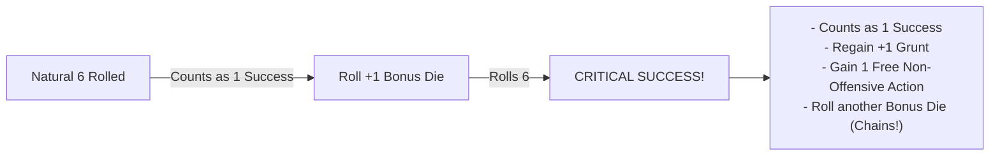

[MISSING RULE / GAP: Bangaranga Multi-Explosion Critical Cascade Definition — When rolling Bangaranga Dice, a natural 6 explodes into two regular dice simultaneously. The rules must define whether a 6 rolled on either bonus die triggers a Critical Success. Suggested Resolution: Any bonus die generated from an exploding die that rolls a 6 is treated as a Critical Success, granting +1 Grunt and a free non-offensive action. However, a single test action can grant a maximum of +1 Grunt and 1 bonus Free Action regardless of how many individual double-six chains occur in that single pool throw.]

---

## Zero Dice Pools & The Salvage Roll

When extreme Banes, encumbrance penalties, or debilitating conditions reduce your active dice pool to **0d6 or fewer dice**, the action automatically fails by default. However, a goblin always makes one last desperate attempt.

### The Salvage Roll
When forced to test with a pool of **0d6 or fewer**, you roll exactly **1d6** as a **Salvage Roll**:

| Die Face | Result | Mechanical Outcome |
| :---: | :--- | :--- |
| **6** | **Miraculous Salvage** | Generates exactly **1 Success**. The die **does not explode**, and cannot trigger a Critical Success. |
| **1** | **Catastrophic Fumble** | The action fails catastrophically and triggers an immediate **Fumble**. If an allied **Mob** is present in your zone or an adjacent zone, you lose **1 Grunt**. |
| **2, 3, 4, 5** | **Clean Failure** | The action fails normally with no additional penalties or Grunt loss. |

---

## The Gobbo Gamble

When an initial roll fails, a goblin can push luck by doubling down on their worst dice.

### Declaring the Gamble
If your initial test fails to accumulate enough successes to meet the **Target Number (TN)**, but your roll contains one or more dice showing **1s**, you may declare a **Gobbo Gamble**:

1.  **Reroll All 1s**: Pick up all dice showing natural **1s** from the failed pool and reroll them together. You cannot choose to reroll only some of the 1s; all 1s must be rerolled.
2.  **The Blessing**: If the rerolled dice produce enough new successes to bring your total pool successes up to or above the **TN**, the test succeeds normally.
3.  **The Fumble**: If the total successes are still fewer than the **TN** after rerolling the 1s, you have **Fumbled**. The action fails catastrophically, and your **Goblin Boss** immediately loses **1 Grunt**.
4.  **Accepting Failure**: If you choose not to reroll your 1s (or if your failed roll contained zero 1s), the action fails normally. You suffer no **Fumble** penalty and lose **0 Grunt**.

> **Example:** You make a `Tough 5+/2` test with a pool of 3d6. The dice show **1**, **1**, and **3** (0 successes). Because you have two 1s, you declare a **Gobbo Gamble** and reroll both 1s. 
> *   *Outcome A:* The rerolled dice land on **5** and **6**. You now have 2 successes. The test succeeds!
> *   *Outcome B:* The rerolled dice land on **2** and **5**. You now have 1 success (short of the TN of 2). The test fails, you trigger a **Fumble**, and you lose **1 Grunt**.

---

## Boons & Banes

Circumstances, tactical positioning, environmental traits, and specialized gear modify dice pools by adding or removing physical dice.

### Boons (+1d)
A **Boon** represents a tactical advantage (such as attacking an unalert target, using masterwork lockpicks, or having high ground). Each Boon adds **+1d6** to your active dice pool before the roll is made.

### Banes (-1d)
A **Bane** represents an active hindrance (such as attacking through thick smoke, firing into partial cover, or moving while over-encumbered). Each Bane removes **1d6** from your active dice pool before the roll is made.

### The Net Cap Rule
Multiple environmental, tactical, or situational modifiers do not stack indefinitely:
*   **1-to-1 Cancellation**: Boons and Banes cancel each other out on a 1-to-1 basis.
*   **Net Modifier Cap**: After cancellation, situational and environmental modifiers are capped at a net maximum of **+1d (Boon 1)** or **-1d (Bane 1)** on any single test.
*   *Exception*: Distinct gear properties (such as Heavy Armor imposing Bane 2 on Slink) or specific high-tier Quirks explicitly state when they bypass the situational net cap.

---

## The Bangaranga Pool Engine

The **Bangaranga Pool** is a shared, communal pool of distinctly colored standard d6s (such as bright red or neon green) placed in the center of the table. It represents the collective hype, screaming, bloodlust, and erratic momentum of the entire goblin horde.

>> **The Bangaranga Pool:** Shared Horde Momentum • Double-Exploding 6s • High Risk

### 1. Seeding the Pool (Raid Start)
At the start of every raid, the **Bangaranga Pool** is seeded with initial dice based on party composition:

| Party Element | Dice Seeded into Pool |
| :--- | :---: |
| Each **Goblin Boss** present | **+1d** per Boss |
| Each controlled **Mob** of **Size 3** or **Size 4** | **+1d** per Mob |
| Each controlled **Mob** of **Size 5** | **+2d** per Mob |

> **Example:** A raiding party consists of 3 **Goblin Bosses**, one **Size 4 Mob**, and one **Size 2 Mob**. At the start of the raid, the table seeds the **Bangaranga Pool** with **4d6** (3d from Bosses + 1d from the Size 4 Mob + 0d from the Size 2 Mob).

### 2. Loading the Pool (Hype Triggers)
During play, notable chaotic feats add physical dice to the active **Bangaranga Pool**:

| Trigger Event | Condition | Dice Added |
| :--- | :--- | :---: |
| **Critical Success** | Any player rolls a double-six Critical Success on any test | **+1d6** |
| **Fumble** | Any player fumbles a test (via failed Gamble or 0d6 Salvage) | **+1d6** |
| **Notable Kill** | Defeating an enemy with the `[Notable]` or `[Big Threat]` tag | **+1d6** |
| **Major Loot Cache** | Claiming a chest or zone with the `[Big Loot]` or `[Hoard]` tag | **+1d6** |
| **Shenanigan Indulged** | Indulging a Gang **Shenanigan** compulsion to the party's detriment | **+1d6** |
| **Mob Mischief** | Rolling natural 1s during background node **Chaos Ticks** | **+1d6 per 1** |

### 3. Tapping the Pool & The Bangaranga Tax
Before rolling any test, a **Goblin Boss** may draw dice from the **Bangaranga Pool** to add to their active dice pool:
*   **Grunt Draw Limit**: You can draw a maximum number of Bangaranga dice equal to your Boss's current **Grunt** rating.
*   **The Bangaranga Tax**: If the number of Bangaranga dice drawn is **strictly greater than the test's Target Number (TN)**, you must pay a **1-die Tax**. One additional die is removed from the Bangaranga Pool and discarded unrolled back to the box.
*   **Pool Coverage Requirement**: If the Bangaranga Pool contains insufficient dice to cover both the drawn dice and the required tax die, you cannot draw that number of dice.

> **Example (Tax Calculation on a 5+/2 Test):**
> *   Drawing 1 or 2 Bangaranga dice: No tax (2 dice drawn <= TN 2). Exactly 2 dice are drawn and rolled.
> *   Drawing 3 Bangaranga dice: Tax applies (3 dice drawn > TN 2). Requires 4 total dice in the pool. 3 dice are rolled, and 1 die is discarded unrolled.

### 4. Rolling Bangaranga Dice (Double Explosions)
Bangaranga dice are rolled alongside your standard pool dice:
*   Every natural **6** rolled on a Bangaranga die counts as **1 Success** and **explodes twice**.
*   You immediately roll **two regular d6s** into your pool for each exploding Bangaranga 6. These bonus regular dice can themselves succeed or explode normally.

### 5. Overreaching & Drain
Relying on the crowd's chaotic energy carries severe penalties when things go wrong:
*   **Grunt Loss**: If a test fails after including Bangaranga dice, your Boss immediately loses **1 Grunt**. (Because failure already costs 1 Grunt, you should always declare a **Gobbo Gamble** on any 1s rolled).
*   **Pool Drain**: If a test using Bangaranga dice ends in failure (either by accepting failure with 1s or failing the Gobbo Gamble) and the final pool contains **any natural 1s**, the hype collapses. You must immediately remove and discard a number of dice from the communal **Bangaranga Pool** equal to the number of Bangaranga dice drawn for that test.

---

## Opposed & Resistance Resolution

Because the **Game Master (GM)** never rolls dice, all adversarial resistance, environmental opposition, and physical contests are resolved using static target profiles.

### Static Threat & Resistance Profiles
When an NPC, enemy guard, or trap resists a player's action:
1.  **Static Threshold**: The GM references the adversary's or obstacle's static rating, formatted as `Difficulty Face+/Resistance TN` (e.g. an alert guard possesses a passive detection profile of `5+/2`).
2.  **Active Player Test**: The player makes an active test using the appropriate stat (**Slink** for stealth, **Mouth** for intimidation, **Tough** for wrestling) against that static profile.
3.  **Outcome**: If player successes meet or exceed the static Resistance TN, the player overcomes the opposition. If successes fall short, the action fails and triggers enemy awareness or retaliation.

[MISSING RULE / GAP: Unified Opposed & Resistance Test Mechanics — While the core engine specifies that the GM never rolls dice, complex opposed contests between multiple NPCs or asymmetric player-versus-player disputes lack an explicit tie-breaking formula. Suggested Resolution: In any direct contest between two active player characters, both roll their active stat pools against a default Normal (5+) difficulty; the character with the higher net successes wins. If tied, the character with the higher base Main Stat wins; if still tied, both suffer a chaotic collision and gain the Staggered condition.]

---

## Summary of Core Resolution Rules

1.  **ROLL:** Assemble pool = **Base Stat / Mob Size** + **Boons** - **Banes** + **Bangaranga**. The GM never rolls.
2.  **COUNT:** Match faces against Difficulty (**Easy 4+**, **Normal 5+**, **Hard 6**).
3.  **EXPLODE:** Every natural **6** is +1 success and rolls +1 bonus d6.
    *   Double explosion (6 -> 6) is a **Critical Success**: +1 Grunt & +1 Free Non-Offensive Action.
    *   Bangaranga **6** explodes into **two regular dice**.
4.  **EVALUATE:** Compare total successes to **Target Number (TN)**.
    *   **Successes >= TN:** Action succeeds.
    *   **Successes < TN with 1s:** Optional **Gobbo Gamble** (reroll all 1s; fail = lose 1 Grunt).
    *   **Pool <= 0d6:** **Salvage Roll** (1d6: 6 = Success, 1 = Fumble & lose 1 Grunt, 2–5 = Failure).

---

<a id="doc-4"></a>
<!-- ============================================================ -->
<!-- DOCUMENT 4: 02_PROD_Core_Rules/02_Boss_Profile_and_Gang.md -->
<!-- ============================================================ -->
# Boss_Profile_and_Gang
*Source: `02_PROD_Core_Rules/02_Boss_Profile_and_Gang.md`*

# Attributes, Boss Profile & Gang Fundamentals

*Every goblin Boss clawed their way to the top of the muck pile by being slightly meaner, faster, louder, or weirder than the screaming runts around them. But individual bosses are disposable; it is the Gang that endures, hoarding scrap and building a bloody legacy across generations.*

This chapter defines the attributes and secondary metrics of a **Goblin Boss**, the character creation engine, the rules governing authority and **Grunt**, the persistent mechanics of the **Gang as Class Archetype**, and the structural schema for **Quirks**.

---

### Main Attributes (Level 1 to 5)

Every **Goblin Boss** possesses four **Main Stats** rated from **Level 1** to **Level 5**. A rating of Level 1 represents basic goblin competence, while Level 5 represents the pinnacle of goblin prowess.

>> **Main Stats:** **TOUGH (T)** • **SLINK (S)** • **MOUTH (M)** • **BRAINS (B)**

*   **Tough (T)**: Muscle, physical violence, brute resilience, intimidation, and raw lifting power. Tough forms the base dice pool for melee attacks and heavy physical feats.
*   **Slink (S)**: Agility, sleight of hand, stealth, acrobatics, balance, and quick reflexes. Slink forms the base dice pool for ranged attacks and evasion.
*   **Mouth (M)**: Shouting, bullying, bluffing, herd control, and vocal leadership. Mouth forms the base dice pool for commanding Mobs and rallying disorganized goblins.
*   **Brains (B)**: Cunning, trap awareness, salvage valuation, mechanical crafting, and volatile magic words. Brains forms the base dice pool for noticing hidden hazards, disarming mechanisms, crafting gear, and casting spells.

>> **IMPORTANT (Retirement at Level 6):** If any Main Stat advances to **Level 6**, the Boss immediately retires from active raiding to become an **Elder** (see [Elders & Retirement](#elders--retirement)).

---

## Secondary Stats & Progression Tracks

Each **Main Stat** governs two derived **Secondary Stats** that scale automatically as the parent stat increases:

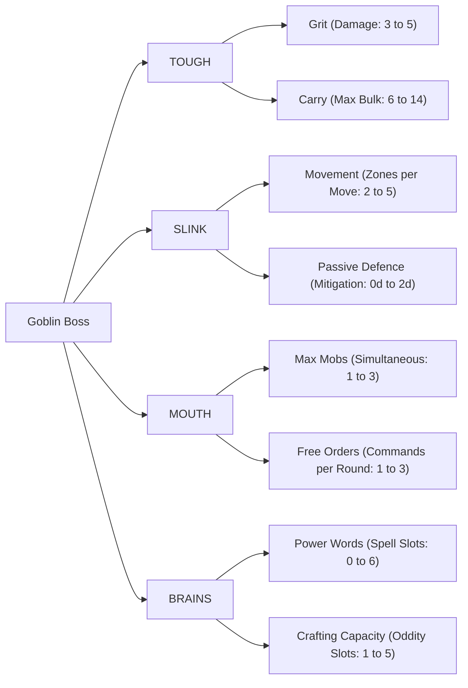

### Tough Derived Stats: Grit & Carry

| Tough Level | Grit (Damage Capacity) | Carry Capacity (Max Bulk) |
| :---: | :---: | :---: |
| **Level 1** | **3** | **6 Bulk** |
| **Level 2** | **4** | **8 Bulk** |
| **Level 3** | **4** | **10 Bulk** |
| **Level 4** | **5** | **12 Bulk** |
| **Level 5** | **5** | **14 Bulk** |

*   **Grit**: The amount of physical damage your Boss can absorb before entering the **Downed State** (see [Damage, Grit & Wounds](07_Damage_Grit_and_Wounds.md)).
*   **Carry Capacity**: The total **Bulk** of equipment, weapons, and Loot you can carry before suffering encumbrance.
    *   **Over-Laden Rule**: If your carried Bulk exceeds your **Carry Capacity**, you suffer **-1 Zone Movement** per Move action and a **Bane 1 (-1d)** on all physical **Slink** and **Tough** tests. You cannot carry more than your Carry Capacity + 4 Bulk under any circumstances.ances.

### Slink Derived Stats: Movement & Passive Defence

| Slink Level | Movement (Zones per Move) | Passive Defence (Armor Mitigation Dice) |
| :---: | :---: | :---: |
| **Level 1** | **2 Zones** | **0d** |
| **Level 2** | **3 Zones** | **0d** |
| **Level 3** | **3 Zones** | **+1d6** |
| **Level 4** | **4 Zones** | **+1d6** |
| **Level 5** | **5 Zones** | **+2d6** |

*   **Movement**: The maximum number of discrete environmental **Zones** your Boss can cross by spending a single **Move** action (see [Zones, Movement & Environment](04_Zones_and_Movement.md)).
*   **Passive Defence**: Innate dodging reflexes that grant passive mitigation dice. These dice are rolled alongside your equipped armor dice in the **Clatter Roll**, reducing incoming damage on rolls of **5+** even if you have saved zero actions to actively Dodge (see [Combat Engine](05_Combat_Engine.md)).

### Mouth Derived Stats: Max Mobs & Free Orders

| Mouth Level | Max Controlled Mobs | Free Orders per Round |
| :---: | :---: | :---: |
| **Level 1** | **1 Mob** | **1 Free Order** |
| **Level 2** | **2 Mobs** | **1 Free Order** |
| **Level 3** | **2 Mobs** | **2 Free Orders** |
| **Level 4** | **3 Mobs** | **2 Free Orders** |
| **Level 5** | **3 Mobs** | **3 Free Orders** |

*   **Max Controlled Mobs**: The maximum number of distinct allied **Mobs** you can maintain under your command simultaneously during an encounter.
*   **Free Orders per Round**: The number of Mob command actions you can issue each round without spending your Boss's **Standard Actions** (see [Action Economy & Turn Flow](03_Action_Economy_and_Turn_Flow.md)).

### Brains Derived Stats: Power Words & Crafting Capacity

| Brains Level | Power Words (Spell Tag Slots) | Crafting Capacity (Oddity Slots) |
| :---: | :---: | :---: |
| **Level 1** | **0 Slots** | **1 Oddity Slot** |
| **Level 2** | **0 Slots** | **2 Oddity Slots** |
| **Level 3** | **2 Slots** | **3 Oddity Slots** |
| **Level 4** | **4 Slots** | **4 Oddity Slots** |
| **Level 5** | **6 Slots** | **5 Oddity Slots** |

*   **Power Words**: The maximum number of volatile magical element and delivery tags your Boss can commit to memory for casting spells (see [Magic & Bangaranga](08_Magic_and_Bangaranga.md)). You must have at least **Brains 3** to memorize Power Words and cast spells.
*   **Crafting Capacity**: The maximum number of specialized **Oddities** (custom mechanical attachments, alchemical coatings, spikes, and contraptions) you can install onto a single crafted item during downtime (see [The Lair Loop and Progression](10_The_Lair_Loop_and_Progression.md)).

---

## Grunt & Command Limits

**Grunt** represents personal authority, intimidation, and psychological command momentum. It determines how large a **Mob** you can intimidate into following orders, and acts as the currency for activating high-tier **Quirks**.

### Calculating Maximum Grunt
A Boss's **Maximum Grunt** is strictly equal to the Boss's **second-highest Main Stat**:

**Max Grunt** = **Second-Highest Stat** (among Tough, Slink, Brains, Mouth)

> **Example Calculations:**
> *   Stats: **Tough 3**, **Slink 1**, **Brains 1**, **Mouth 1** -> Second-highest is 1 -> **Max Grunt = 1**.
> *   Stats: **Tough 2**, **Slink 2**, **Brains 1**, **Mouth 1** -> Second-highest is 2 -> **Max Grunt = 2**.
> *   Stats: **Tough 4**, **Slink 3**, **Brains 2**, **Mouth 1** -> Second-highest is 3 -> **Max Grunt = 3**.

### Tracking Current Grunt
Unlike the four static Main Stats, **Current Grunt** fluctuates dynamically between **0** and **Max Grunt** during a raid:

*   **Gaining Grunt (+1)**:
    *   Achieving a double-explosion **Critical Success** on any test (+1 Grunt).
    *   Personally slaying an enemy in your current or an adjacent Zone (+1 Grunt).
    *   Successfully dealing damage via **Assert Dominance** (+1 Grunt).
*   **Losing Grunt (-1)**:
    *   Suffering a **Fumble** on any test or failed **Gobbo Gamble** (-1 Grunt).
    *   Failing any test that included drawn **Bangaranga Dice** (-1 Grunt).
    *   Failing to deal damage when attempting **Assert Dominance** (-1 Grunt).

### Mob Command Limits & The Rebellion Test
A **Goblin Boss** can only maintain direct command over a **Mob** whose current **Size** is less than or equal to the Boss's **Current Grunt**:

**Maximum Commandable Mob Size <= Current Grunt**

*   **Rebellion Test**: If your current **Grunt** drops below the current **Size** of a Mob under your command (or if you attempt to command a Mob larger than your Grunt), you must immediately make a command test:
    `Tough or Mouth 5+/[Mob Size]`
    *   **Success**: The Mob remains intimidated and obeys your command for this round.
    *   **Failure**: The Mob realizes you are weak, breaks command, and immediately becomes **Out of Control** (see [Mob Mechanics](06_Mob_Mechanics.md)).

### Assert Dominance
When your Grunt is low and your Mobs are restless, you can beat your own followers to re-establish fear:
*   **Action Cost**: 1 **Standard Action**.
*   **Execution**: Make an undefended melee attack against a friendly **Mob** under your command in your Zone.
*   **Outcome**:
    *   If the attack deals **>= 1 damage** to the Mob's health dice, your Boss immediately regains **+1 Grunt** (up to Max Grunt).
    *   If the attack rolls **0 successes** (dealing 0 damage), the attack bounces, your goblins laugh at you, and your Boss loses **-1 Grunt**.

---

## Boss Creation Engine

Follow these sequential steps to create a starting **Goblin Boss**:

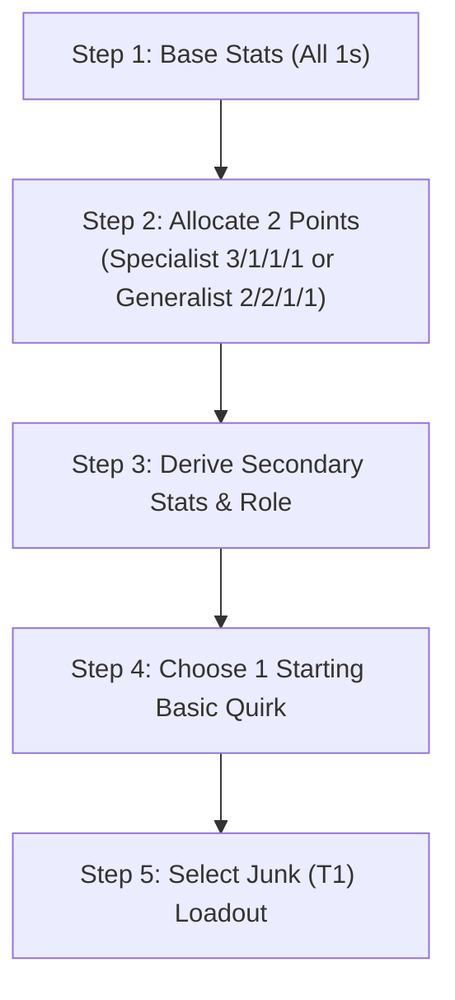

### Step 1: Set Base Stats
Set all four **Main Stats** to **1**:
*   **Tough**: 1
*   **Slink**: 1
*   **Mouth**: 1
*   **Brains**: 1

### Step 2: Distribute Starting Points
You have **2 points** to distribute among your four Main Stats. At character creation, no stat can be increased above **Level 3**.

Choose one of two core archetype distributions:
1.  **Specialist (3, 1, 1, 1)**: Invest both points into one primary stat.
    *   *Result*: Primary Stat = 3, remaining stats = 1.
    *   *Derived Grunt*: **Max Grunt = 1**. (Can command a **Size 1 Mob** at campaign start).
2.  **Generalist (2, 2, 1, 1)**: Invest one point into two different stats.
    *   *Result*: Two Stats at 2, two stats at 1.
    *   *Derived Grunt*: **Max Grunt = 2**. (Can command a **Size 2 Mob** at campaign start).

### Step 3: Derive Secondary Stats & Role
Consult the progression tables above to record your **Grit**, **Carry Capacity**, **Movement**, **Passive Defence**, **Max Mobs**, **Free Orders**, **Power Words**, and **Crafting Capacity**.

Your highest stat and second-highest stat define your starting **Role** (e.g. Tough Specialist = Meat-Wall; Tough/Slink Hybrid = Raider; Slink/Brains Hybrid = Saboteur; Slink/Mouth Hybrid = Ring-Leader; Mouth/Brains Hybrid = Chant-Monger; Brains Specialist = Sage-Tinker).

### Step 4: Choose 1 Starting Basic Quirk
Select **1 Basic Quirk** matching a stat where your Boss's stat level meets or exceeds the Quirk's Tier (starts with 0 Twists).

### Step 5: Select Starting Loadout
Choose starting gear of **Junk (T1)** quality from the scrap pile:
1.  **Melee Weapon (Choose 1)**:
    *   *Light Melee Weapon* (Bulk 1, One-Handed, Impact Size 1).
    *   *Medium Melee Weapon* (Bulk 2, One-Handed, Impact Size 1).
    *   *Heavy Melee Weapon* (Bulk 3, Two-Handed, Impact Size +1).
2.  **Ranged Weapon (Optional, Choose 1)**:
    *   *Sling* (Bulk 1, One-Handed, Range 1 Zone).
    *   *Shortbow* (Bulk 2, Two-Handed, Range 2 Zones).
    *   *Throwing Daggers* (Bulk 1, One-Handed, Range 1 Zone).
3.  **Defense (Optional, Choose 1)**:
    *   *Light Armor* (Bulk 1, +1d Passive Armor Die).
    *   *Shield* (Bulk 1, One-Handed, +1d Passive Armor Die, enables Tough Parry).

[MISSING RULE / GAP: Weapon Damage Metric & Loadout Notation Discrepancy — Legacy character creation drafts incorrectly listed starting weapons with "+2d damage / +3d damage" dice bloat. In the standardized rules engine, all weapon attacks roll the Boss's Tough (melee) or Slink (ranged) dice pool against the target's Defence TN, dealing flat 1 damage or 1 Wound per success threshold. Weapon category dictates Hands, Bulk, Range, and Impact Size (+1 Heavy, +2 Crushing).]

[MISSING RULE / GAP: Dual-Wielding Melee Weapons — Character creation references wielding two Light Melee weapons simultaneously, but requires formal resolution. Suggested Resolution: Wielding an off-hand Light Melee weapon grants a passive Boon 1 (+1d) to melee attack pools or allows splitting scored successes between two distinct targets in the same Zone.]

---

## The Gang as Class Archetype

In **Gobbos**, players do not play isolated lone heroes. The player's persistent, leveling entity is the **Gang**, which survives the death or retirement of individual Bosses.

>> **The Gang:** Persistent Entity • Infamy Track (1–5) • The Hoard • The Bone Pile

### 1. Infamy Track (Level 1 to 5)
**Infamy** represents how feared, respected, and notorious your Gang is across the Lair. It acts as the Gang's overall level, scaling from **Infamy 1** to **Infamy 5**.

#### Earning Infamy Marks
A Gang advances its Infamy by earning **Infamy Marks**:
1.  **Loot Contribution**: Every **10 Loot Value** brought back from raids and deposited into the Lair Hoard grants **1 Infamy Mark**.
2.  **Gang Agendas**: Completing a chosen **Gang Agenda** during a raid grants **1 Infamy Mark** (maximum 1 Mark from Agendas per raid).

#### Infamy Milestones & Scaling
| Infamy Level | Cumulative Marks Required | Successor Starting XP | Max Equipped Gang Quirks |
| :---: | :---: | :---: | :---: |
| **Infamy 1** | **0 Marks** | **4 XP** | **1 Gang Quirk** |
| **Infamy 2** | **3 Marks** | **8 XP** | **2 Gang Quirks** |
| **Infamy 3** | **6 Marks** | **12 XP** | **3 Gang Quirks** |
| **Infamy 4** | **10 Marks** | **16 XP** | **4 Gang Quirks** |
| **Infamy 5** | **15 Marks** | **20 XP** | **5 Gang Quirks** |

### 2. Successor Boss Generation (Roguelite Legacy)
When a **Goblin Boss** dies, the Gang promotes the next biggest goblin to take command:
1.  **Base Setup**: The successor begins with base **1** in all four Main Stats, plus the standard **2 starting points**.
2.  **Successor XP**: The successor receives a bonus pool of **Successor XP** equal to **Infamy Level x 4** to purchase additional stat upgrades at standard advancement costs.
3.  **Successor Stat Cap**: A newly generated successor cannot raise any stat above **Level 4** at creation.
4.  **The Gang Mark**: The successor receives a permanent tattoo inked in soot and blood, inheriting **1 Quirk or Twist** possessed by the deceased Boss, completely bypassing stat tier prerequisites.

### 3. The Gang Hoard
**The Hoard** is the Gang's central stockpile of unrefined scrap, stolen tools, spare weapons, and trade wealth stored in the Lair. 
*   Before embarking on a raid, the Gang draws from the Hoard to outfit recruited **Mobs** with weapons, armor, and utility consumables.
*   Loot brought back from raids that is not contributed to Lair infrastructure is melted down into the Hoard (see [The Raid Loop](09_The_Raid_Loop.md)).

### 4. The Bone Pile & Relics
The **Bone Pile** is a literal monument of skulls and bones belonging to the Gang's deceased former Bosses.
*   **Forging Relics**: When a Boss dies, the Gang can recover a bone or token and attach it to a weapon or armor piece to forge a **Relic**.
*   **Relic Boon**: The Relic grants a mechanical Boon (+1d) tied to the deceased Boss's highest Main Stat. A Boss may equip at most **1 Relic** at a time.

### 5. Elders & Retirement
When any **Goblin Boss** reaches **Level 6** in any Main Stat, that Boss automatically retires from active raiding to become an **Elder**. Elders are permanently staffed at Lair facilities to grant persistent bonuses:
*   **Elder of Tough (Training Ring)**: All Mobs commanded by the Gang gain **+1 Passive Armor Die** without consuming Bulk.
*   **Elder of Slink (Shadow Den)**: Reduces the Target Number (**TN**) of all environmental traps by **1** (minimum TN 1).
*   **Elder of Mouth (Council Chambers)**: Increases the Boss's Maximum **Grunt** by **+1**; once per raid, allows rallying all fleeing Mobs in the zone as a Free Action.
*   **Elder of Brains (Tinker Yard)**: Allows installing **+1 extra Oddity** onto crafted custom gear beyond standard Crafting Capacity.

### 6. Gang Shenanigan (Cultural Identity)
Every Gang possesses a defining cultural trait called a **Shenanigan** (e.g. *Pyromaniacs, Shiny-Snatchers, Trap-Trippers, Skull-Bangers*):
*   **The Boon**: Grants a **+1d Boon** on action tests directly aligned with the Shenanigan.
*   **The Compulsion**: When presented with an opportunity to indulge the Shenanigan, the Boss must make a `Brains 5+/1` test to resist.
*   **Feeding the Bangaranga**: Whenever a player willingly indulges your Shenanigan to the tactical detriment of the party, immediately add **+1d6** to the communal **Bangaranga Pool**.

---

## Quirk Structural Schema

Quirks are modular personal abilities that modify dice outcomes, manipulate conditions, or alter the action economy. Every Quirk must conform to the following formal schema:

```markdown
### [CONTENT INSTANCE: Boss Quirk]
**Name**: <Quirk Name>
**Category**: <Tough | Slink | Brains | Mouth | General | Gang Legacy>
**Tier**: <T1 | T2 | T3 | T4 | T5>
**Prerequisite**: <Stat Name> Level >= Tier
**Cost**: <Passive | 1 Grunt | 1 Standard Action | 1 Reaction | 1 Free Order>
**Trigger**: <Passive | On Hit | On Dodge | On Fumble | Start of Turn | Action Declaration>
**Target Hub**: <Self | Allied Mob | Enemy in Zone | Zone Environment>
**Mechanical Effect**: <Direct Tier A rule specifying dice modification, condition, or action bypass>
**Twist Slots**: <1 Twist Max | 0 Twists>
**Keywords**: <[Keywords from Master Index]>
```

### [CONTENT EXTENSION POINT: Boss Quirks & Talents]
*All specific Boss Quirks, talent trees, and Twist modifiers are maintained in the modular Quirks Compendium and attach directly to the core rules via the schema above.*

---

<a id="doc-5"></a>
<!-- ============================================================ -->
<!-- DOCUMENT 5: 02_PROD_Core_Rules/03_Action_Economy_and_Turn_Flow.md -->
<!-- ============================================================ -->
# Action_Economy_and_Turn_Flow
*Source: `02_PROD_Core_Rules/03_Action_Economy_and_Turn_Flow.md`*

# Action Economy & Turn Flow

*A goblin battle is a storm of frantic screaming, chaotic orders, flying junk, and desperate scurrying. Victory belongs to the Boss who spends their momentum wisely—knowing when to strike, when to command the horde, and when to save an action to dive out of the way of a swinging axe.*

This chapter defines the action budgets for **Goblin Bosses** and **Mobs**, the standard action catalog, reaction holding mechanics, and the structured 5-Phase combat loop.

---

## Action Budgets & Categories

During an encounter, time is measured in **Rounds**. Every round, combatants receive a fresh allocation of actions that resets at the start of each round.

>> **Round Action Budgets:**
>> *   **Goblin Boss:** 3 Standard Actions + 1 to 3 Free Orders + Free Actions
>> *   **Goblin Mob:** 2 Actions (Governed by the Boredom Rule)

### Goblin Boss Action Budget
Every **Goblin Boss** receives the following action budget per round:
1.  **Three (3) Standard Actions**: The core currency of your turn. Standard Actions are spent to **Move**, **Attack**, **Plunder**, **Manipulate**, or issue an **Order**. Unspent Standard Actions may be saved to perform **Reactions** during the enemy turn.
2.  **Free Orders per Round**: An innate command allowance determined by your **Mouth** stat (1 Free Order at Mouth 1–2; 2 Free Orders at Mouth 3–4; 3 Free Orders at Mouth 5). Free Orders allow commanding Mobs without spending your precious Standard Actions.
3.  **Free Actions**: Minor, instantaneous maneuvers that cost zero Standard Actions (e.g. dropping an item, speaking, shouting a battle cry, drawing 1 light item once per turn).
4.  **Reactions**: Out-of-turn defensive or triggered responses (such as **Dodge**, **Parry**, **Scatter**, or reactive Quirks). Performing a Reaction strictly requires spending a saved **Standard Action** (or an unused Free Order for the Scatter reaction).

### Mob Action Budget
Every allied **Mob** possesses a strict budget of **two (2) actions** per round:
*   Mobs only act when given an **Order** by a Boss or during the **Unordered Mobs** step of the Player Active Turn.
*   If an Order directs a Mob to spend both actions on offense or movement, the Mob has 0 saved actions remaining and cannot react defensively if attacked later in the round.

### The Boredom Rule
Goblins have notoriously short attention spans and cannot stay focused on repetitive tasks.
*   **The Constraint**: A **Mob** cannot perform the exact same action twice in a single round. A Mob cannot Attack twice or Plunder twice in the same round.
*   **The Sole Exception**: A Mob *can* perform the **Move** action twice in a single round if it is actively charging toward an enemy or fleeing from danger.

---

## Standard Action Catalog

The following five actions constitute the core activities available to **Goblin Bosses** and **Mobs**:

>> **Standard Actions:** 1. **Move** | 2. **Attack** | 3. **Plunder** | 4. **Manipulate** | 5. **Order**

### 1. Move (Boss or Mob)
Spend 1 action to cross up to your **Movement** rating in connected **Zones**:
*   **Boss Movement**: Equal to your derived **Movement** stat (2 to 5 Zones based on **Slink**; see [Boss Profile and Gang](02_Boss_Profile_and_Gang.md)).
*   **Mob Movement**: Baseline 2 Zones per Move action (see [Mob Mechanics](06_Mob_Mechanics.md)).
*   **Environmental Profiles**: Crossing hazardous terrain, climbing vertical cliffs, or leaping chasms requires testing **Slink** against the established **Zone Profile** (e.g. `Slink 5+/1`; see [Zones, Movement & Environment](04_Zones_and_Movement.md)).

### 2. Attack (Boss or Mob)
Spend 1 action to engage an enemy in combat:
*   **Melee Attack**: Roll your **Tough** dice pool against the target's static **Defence TN** in your current Zone.
*   **Ranged Attack**: Roll your **Slink** dice pool against the target's static **Defence TN** across connected Zones within weapon range.
*   **Mob Attack**: Mobs roll **Size d6** for melee attacks (or 2d6 for ranged thrown attacks; see [Combat Engine](05_Combat_Engine.md)).

### 3. Plunder (Boss or Mob)
Spend 1 action to snatch, strip, and secure treasure in your current Zone:
*   **Securing Loot**: Collect loose Loot items, open unlocked chests, or strip valuables from fallen enemies (see [The Raid Loop](09_The_Raid_Loop.md)).
*   **Mob Plundering**: A Mob spending a Plunder action strips up to its current **Size** in loose Loot items from the Zone into its Loot Capacity.

### 4. Manipulate (Boss or Mob)
Spend 1 action to interact with physical mechanisms, terrain objects, or volatile contraptions:
*   **Simple Manipulation**: Open doors, throw levers, pick up dropped weapons, light torches, or uncork potions (requires no roll).
*   **Complex Manipulation**: Picking complex locks, disarming traps, or sabotaging steam pipes requires a **Brains** test against the mechanism's profile (e.g. `Brains 5+/2`).

### 5. Order (Boss Action Only)
Spend 1 **Free Order** (or 1 **Standard Action**) to issue verbal or physical commands to an allied **Mob**:
*   **Controlled Mobs**: Issuing orders to a Mob whose **Size** is <= your current **Grunt** requires no dice roll.
*   **Rebellious Mobs**: If Mob Size > your current Grunt, issuing an order requires passing an immediate **Rebellion Test** (`Tough or Mouth 5+/[Mob Size]`).
*   **Scope of Orders**: An Order directs the Mob to spend 1 or both of its round actions immediately (e.g. "Move and Attack!", "Plunder the chest!", "Hold the line!").

>> **IMPORTANT (Free Orders vs. Standard Orders):** Free Orders can only be spent on the **Order** action. They cannot be converted into personal attacks, movement, or plunder actions for the Boss.

---

## Free Actions & Free Orders

To maintain fast tactical flow, minor adjustments and commanding shouts do not consume your primary combat budget.

### Free Actions
A **Free Action** takes negligible time and can be performed freely on your turn (up to a reasonable limit enforced by common sense):
*   Dropping a held weapon or item to the ground.
*   Speaking a short sentence, screaming an insult, or sounding a war horn.
*   Drawing or stowing 1 light weapon/item (once per turn).
*   Spending a **Critical Success** bonus action to Move, Plunder, or Manipulate.

### Free Orders
A **Free Order** is a dedicated command shout granted by your **Mouth** stat. 
*   Free Orders function identically to the standard **Order** action, but **do not consume any of your 3 Standard Actions**.
*   You may spend Free Orders during your turn to command Mobs, or save an unused Free Order to shout the reactive **"Scatter!"** command during the enemy turn.

[MISSING RULE / GAP: Free Order Action Permissibility in Self-Defense Reactions — Rules clarify that Free Orders can be saved to issue a reactive "Scatter!" command to a Mob, but must explicitly define whether an unused Free Order can be spent by the Boss to Dodge or Parry in self-defense. Resolution: Free Orders are strictly limited to Mob command actions. A Boss cannot spend a Free Order to actively Dodge or Parry an attack directed at the Boss's own person; personal evasion strictly requires spending a saved Standard Action.]

---

## Reactions & Holding Actions

Combat in **Gobbos** is reactive. Enemies act deterministically, and player survival depends on tactical action preservation.

>> **The Reaction Doctrine:**
>> *   **SAVE Standard Actions on your turn** -> Spend as Reactions on enemy turn
>> *   **SPEND ALL Actions on your turn** -> 0 Active Defense (Armor only!)

### Holding Actions for Defense
On the Player Active Turn, you are not required to spend all 3 Standard Actions. Any unspent Standard Actions are **held**:
*   **Active Defense Requirement**: When targeted by an incoming enemy attack or area hazard during the Enemy Active Turn, you must spend **1 saved Standard Action** to make an active defense roll (**Dodge** or **Parry**).
*   **Zero Saved Actions**: If you spent all 3 Standard Actions on your turn, you have **0 saved actions**. You cannot attempt to actively evade, and must rely entirely on passive **Armor Dice** to absorb the strike!

### Reaction Types
1.  **Dodge (Boss Reaction)**: Spend 1 saved Standard Action. Roll your active **Slink** dice pool against the incoming attack's **Threat TN** in the **Clatter Roll**. Scoring successes >= Threat TN completely negates the attack (0 damage).
2.  **Parry (Boss Reaction)**: Spend 1 saved Standard Action. Roll your active **Tough** dice pool against the incoming attack's **Threat TN** in the **Clatter Roll**. Requires an equipped **Shield** or **Heavy Weapon**. Scoring successes >= Threat TN completely negates the attack (0 damage).
3.  **Scatter (Mob Reaction)**: Spend 1 saved Boss Standard Action (or 1 unused Free Order) to order a targeted Mob with >= 1 unused action to disperse. Roll your Boss's **Mouth** pool against `Threat TN + (Mob Size - 1)`. Success negates damage and scurries the Mob 1 Zone into cover.
4.  **Reactive Quirks**: Specific Boss abilities (such as *Meat Shield* or *Ankle Bite*) trigger out of turn by paying their stated Grunt or Reaction cost.on cost.

---

## The 5-Phase Round Flow

Every round of combat follows a strict 5-phase sequence:

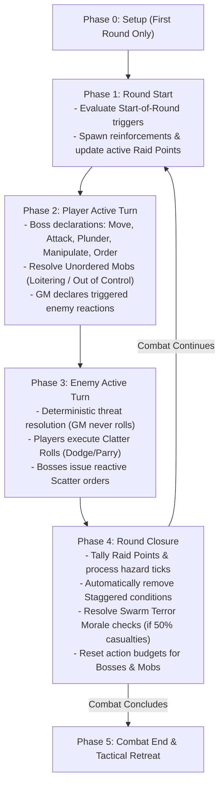

### Phase 0: Combat Setup (Initial Encounter Start)
1.  **Zone Graph Deployment**: The GM reveals the node graph of interconnected **Zones**, identifying terrain traits, cover points, and baseline **Zone Profiles** (`Difficulty+/TN`).
2.  **Unit Placement**: Place Bosses, allied Mobs, and visible enemies in starting Zones.
3.  **Objective Declaration**: The GM declares active **Raid Point** objectives and visible **Loot** caches.

### Phase 1: Round Start
1.  **Condition Triggers**: Resolve any conditions or environmental hazards with "Start of Round" triggers (e.g. acid burns, regeneration).
2.  **Reinforcements**: Deploy newly arriving enemies or wandering patrols into entry Zones.
3.  **Raid Point Assessment**: Update active timers or moving objectives.

### Phase 2: Player Active Turn
1.  **Player Declarations**: Players act in any order they choose. Bosses spend Standard Actions and Free Orders to move, attack, plunder, manipulate mechanisms, and command Mobs.
2.  **Unordered Mobs Step**: Once all players have completed their actions, any allied Mob that did not receive an Order this round resolves its behavior:
    *   *Loitering Mob*: Roll on the Loitering Table (spends 1 action, saves 1 action for defense).
    *   *Out of Control Mob*: Roll on the Out of Control Table (spends 2 actions, saves 0 actions).
3.  **Enemy Reactions**: The GM resolves any triggered enemy reactions (e.g. counter-attacks or opportunity shots).

### Phase 3: Enemy Active Turn
Enemies act deterministically in accordance with their statblock profiles:
*   Standard enemies and Enemy Mobs receive **2 actions**; Apex Bosses receive **3 actions**.
*   Enemies move toward priority targets and unleash attacks with listed **Threat Profiles** and flat **Damage**.
*   Players resolve incoming attacks via the **Clatter Roll**, spending saved Standard Actions to Dodge or Parry, shouting "Scatter!" to save Mobs, or rolling passive Armor Dice.

### Phase 4: Round Closure
1.  **Raid Points Tally**: Tally confirmed and contested Raid Points for the round.
2.  **End-of-Round Ticks**: Resolve lingering hazard ticks (e.g. fire spreading on 1d6 roll of 5–6, poison degradation).
3.  **Clear Staggered**: Automatically remove the **Staggered** condition from all PCs, Mobs, and enemies.
4.  **Morale Checks**: If any Mob or enemy force suffered 50% casualties this round, resolve a **Swarm Terror Morale Check** (see [Mob Mechanics](06_Mob_Mechanics.md)).
5.  **Reset Action Budgets**: Reset all Boss budgets to 3 Standard Actions + Free Orders, and all Mob budgets to 2 Actions.

---

## Combat End & Tactical Retreat

Combat concludes when all enemies are slain, all PCs are eliminated, or one side flees the battlefield.

### Fleeing & Disengaging
Goblins are practical cowards; a tactical retreat preserves stolen Loot and saves lives.
*   **Escape Zones**: To escape an encounter, a Boss or Mob must enter a designated exit Zone and spend 1 Move action to withdraw.
*   **Disengaging from Melee**: Leaving a Zone containing alert enemies without fighting triggers an immediate Opportunity Attack. To disengage safely, a Boss or Mob must spend 1 Standard Action to **Disengage**, testing:
    `Slink 5+/[Highest Enemy Defence TN]`
    *   **Success**: The unit withdraws safely into an adjacent connected Zone without taking damage.
    *   **Failure**: The highest-Threat enemy in the Zone executes an immediate Opportunity Attack against the fleeing unit, and the unit's movement immediately ends inside the current Zone.

[MISSING RULE / GAP: Disengage Failure & Opportunity Attack Resolution — Legacy drafts did not define exact mechanical outcomes when failing a Disengage test. Resolution codified: On a failed Disengage test, the highest Threat enemy in the zone executes an immediate Opportunity Attack, and the fleeing unit's movement ends immediately in the contested zone.]

*   **The Heavy Loot Restriction (Bulk 3+)**: Hauling an unwieldy item of **Bulk 3 or higher** requires two hands. You **cannot perform a Disengage action while clutching a Bulk 3+ item**. To escape safely, you must drop the heavy loot as a Free Action, hand it off to a Mob, or defeat the pursuing enemies.

---

<a id="doc-6"></a>
<!-- ============================================================ -->
<!-- DOCUMENT 6: 02_PROD_Core_Rules/04_Zones_and_Movement.md -->
<!-- ============================================================ -->
# Zones_and_Movement
*Source: `02_PROD_Core_Rules/04_Zones_and_Movement.md`*

# Zones, Movement, and Environment

*Battlefields in Gobbos are dynamic, chaotic playgrounds where verticality, collapsing scenery, and hazardous obstacles matter far more than measuring inches on a grid. Goblins scurry through pipes, leap across burning chasms, and hide behind crumbling statues to outmaneuver taller, stronger foes.*

---

## Zone Topology & Spatial Abstraction

Tactical combat and exploration in **Gobbos** operate on an abstract node graph rather than a square or hex grid. The physical environment is divided into discrete, bounded spatial units called **Zones**.

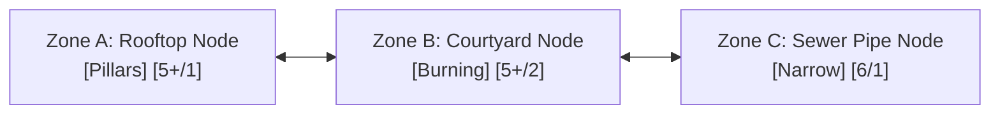

### Discrete Tactical Nodes
A **Zone** represents a distinct environmental feature or bounded room, such as a tavern taproom, a raised wooden balcony, a slippery courtyard, a sewer tunnel, or a narrow rooftop. 
*   **Intra-Zone Distance (Engaged):** All creatures, allies, hazards, and loot within the same Zone are considered adjacent and engaged with one another. Moving between targets within the same Zone costs no additional movement.
*   **Inter-Zone Distance (Node Steps):** Distance between separate locations is measured strictly as the integer number of connected Zone boundaries (steps) along the shortest available path.
*   **Adjacency & Connectivity:** Two Zones are adjacent if they share a direct spatial connection (a doorway, an open archway, a flight of stairs, or an open courtyard border). Blocked passages or sheer cliffs require specific actions or tools to cross.

### Tabletop Representation
At the physical gaming table, the environment is managed across two complementary tracking spaces:
1.  **The Macro Minimap (Point-Crawl Nodes):** Tracks the overarching raid location (dungeon, fortress, or town quarter) using connected abstract nodes. A single party token represents the main horde, showing broad exploration routes, locked security gates, and designated extraction points.
2.  **The Clash Cluster (Micro Battleground):** Deployed when combat breaks out. The GM places 3 to 6 modular Zone cards or tactile boundary markers on the table representing the immediate tactical theater. Player Boss miniatures and physical **d6** Mob health dice are placed directly onto these Zone cards.

---

## Zone Profiles

Every Zone on the battlefield possesses an intrinsic baseline difficulty known as its **Zone Profile**, written in standard slash notation: `Difficulty+/Target Number (TN)` (for example, `5+/1`, `5+/2`, or `6/1`).

>> **THE ZONE PROFILE RULE:**
>> Any general physical interaction, traversal feat, jump, climb, search, door-forcing, or balance check attempted within a Zone defaults to testing against that Zone's Profile. The GM does not invent ad-hoc Target Numbers; all unlisted environmental tests resolve against the active Zone Profile.

### Traversal and Interaction Resolution
*   **Baseline Checks:** When you attempt an unscripted physical maneuver (such as scaling a brick wall, jumping a ditch, or prying a floorboard loose), you roll the appropriate attribute pool (**Slink** for agility/traversal, **Tough** for brute force/lifting, or **Brains** for searching/spotting mechanisms) against the Zone Profile.
*   **Applying Boons and Banes:** Situational factors, specialized gear, or adverse conditions apply standard **Boons (+1d)** or **Banes (-1d)** to your dice pool before rolling, while leaving the underlying Zone Profile unchanged.

> **Example:** A crumbling armory has a Zone Profile of `5+/2`. Attempting to climb a broken weapon rack in this Zone requires a Slink test against `5+/2` (needing 2 successes on 5s or 6s). If the Goblin Boss uses a grappling hook, the tool grants a **Boon 1 (+1d)** to the pool, but the test profile remains `5+/2`.

---

## Movement & Tactical Positioning

Movement in **Gobbos** is measured in discrete Zones crossed rather than feet or inches.

### The Move Action
Spending one **Standard Action** on a **Move** action allows a character or Mob to cross a number of connected Zones up to their **Movement** rating:
*   **Goblin Boss Movement:** A Goblin Boss moves a number of Zones equal to their secondary **Movement** stat (ranging from 2 to 5 Zones per Move action, derived from their **Slink** stat; see [Boss Profile & Gang](02_Boss_Profile_and_Gang.md)).
*   **Mob Movement:** A Mob moves a baseline of **2 Zones** per Move action.
*   **Mobility Restrictions:** Difficult terrain, heavy encumbrance, or specific traits can increase movement costs or cap maximum speed.

### Tactical Disengagement & Opportunity Attacks
Leaving a Zone that contains alert, unengaged enemy combatants is inherently dangerous.

1.  **The Disengage Test:** To safely exit a Zone containing active enemies, a Goblin Boss or Mob must declare a Disengage maneuver as part of their Move action and pass a **Slink** test:
    `Slink 5+/[Highest Enemy Defence TN]`
2.  **Successful Disengage:** On a success, the unit moves out of the Zone safely along their declared movement path.
3.  **Failed Disengage:** On a failure, the highest **Threat** enemy in the Zone immediately executes an unavoidable **Opportunity Attack** against the escaping unit. Furthermore, the unit's movement is immediately halted, forcing them to remain inside the current Zone for the remainder of the round.
4.  **Bulk 3+ Restriction:** Wielding or hauling a loose object of **Bulk 3** or greater requires both hands and total focus. A character **cannot attempt a Disengage test** while clutching a Bulk 3+ item. To escape, the character must drop the item as a **Free Action**, defeat the threatening enemies, or have a Mob transport the burden.

---

## Cover Mechanics

Obstacles, low masonry, furniture, and environmental barriers provide crucial protection against incoming ranged attacks. Cover is classified into two distinct mechanical levels:

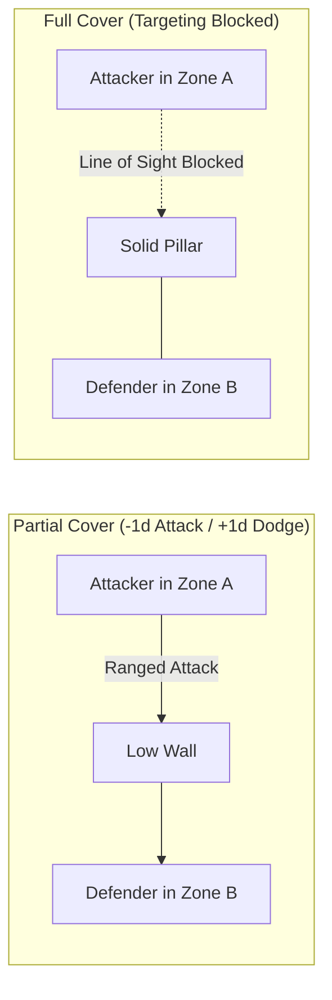

### Partial Cover
Partial Cover represents waist-high stone walls, overturned tables, dense thickets, wooden barricades, or clusters of allied goblins.
*   **Attacking into Partial Cover:** Ranged attacks targeting a creature behind Partial Cover suffer a **Bane 1 (-1d)** penalty to the attack dice pool.
*   **Defending behind Partial Cover:** A defender situated behind Partial Cover gains a **Boon 1 (+1d)** to their active **Dodge** (**Slink**) dice pool during a **Clatter Roll** against ranged threats.

### Full Cover
Full Cover represents solid stone pillars, reinforced iron doors, thick masonry walls, or total line-of-sight obstruction.
*   **Targeting Blocked:** A creature behind Full Cover cannot be targeted by direct ranged attacks, single-target spells, or line-of-sight abilities originating from the blocked direction.
*   **Bypassing Full Cover:** An attacker must spend movement to cross into a connected Zone that clears the sightline or flank around the barrier before declaring an attack.

---

## Modular Zone Traits & Hazards

A **Zone Trait** is an environmental modifier attached to a Zone that alters movement, tests, or combat resolution. Traits are modular building blocks that the GM combines to construct dynamic encounter maps.

### Hazard Severity Tiers
When an environmental hazard inflicts damage due to a failed test or unmitigated trigger, the damage scales by severity tier:
*   **Tier 1 Hazard (Minor):** Deals **1 Damage** to a Boss's **Grit** or a Mob's lowest active health die.
*   **Tier 2 Hazard (Dangerous):** Deals **2 Damage** to a Boss's **Grit** or a Mob's lowest active health die, or inflicts a sustained condition.
*   **Tier 3 Hazard (Lethal / Catastrophic):** Deals **3 Damage** to a Boss's **Grit** or a Mob's lowest active health die, or inflicts an immediate severe condition. Catastrophic hazards (such as collapsing mine shafts) can directly remove an entire Mob health die.

### Predefined Static Obstacles

| Trait Name | Category | Primary Tags | Trigger Timing | Mechanical Rule & Resolution Profile |
| :--- | :--- | :--- | :--- | :--- |
| **Slippery** | Obstacle | `[Slick]` | On Entry / Exit | Any creature entering or leaving this Zone must pass a `Slink` test against the Zone Profile. On a failure, the creature falls **Prone** and their movement ends immediately. |
| **Rubble** | Obstacle | Terrain | Traversing | Difficult ground. Moving through this Zone costs double movement speed (spending 2 Zones of movement capacity per Zone crossed). |
| **Narrow** | Obstacle | Spatial Cap | Passive | Restricts physical capacity and frontline width (default **Size 2**). Mobs exceeding this capacity suffer **Bane 1 (-1d)** on physical tests, their Movement is capped at 1 Zone, and their Melee combat pool is capped at the narrow limit. Giant foes (`[Huge]`, `[Colossal]`) cannot enter. |
| **Chasm / Pit** | Hazard (T3) | Obstacle | Crossing / Shove | Crossing or being pushed into the pit requires a `Slink` test against the Zone Profile. On a failure, the creature plummets, taking **3 Damage** and gaining the **Restrained** condition. Climbing out requires a Standard Action and a successful `Tough` test against the Profile. |
| **Vertical Cliff** | Obstacle | Elevation | Vertical Move | Scaling a sheer wall or scaffolding requires a Move action and a `Slink` test against the Zone Profile. On a failure, the climber falls, taking 1 Damage per Zone height fallen and landing **Prone**. |
| **Deep Water** | Obstacle | `[Wet]` | Passive / Move | Traversing requires a Move action to cross only 1 Zone. Swimming without a boat or flotation gear requires testing `Tough` against the Zone Profile at round start or taking 1 drowning damage per round. |
| **Pillars / Statues** | Opportunity | Cover | Passive / Free Action | A creature occupying this Zone may declare they are ducking behind a pillar as a **Free Action**, gaining **Full Cover** against attacks originating from one designated adjacent Zone. |
| **Hedges / Thickets** | Opportunity | Cover | Passive | Thick vegetation provides passive **Partial Cover** to all occupants against ranged attacks originating outside the Zone. |
| **Shadowy** | Opportunity | Stealth | Passive | Deep darkness and heavy alcoves grant a **Boon 1 (+1d)** to all stealth-related `Slink` tests made within this Zone. |
| **Junk Pile** | Opportunity | Treat | Interactive | A character can spend a Standard Action (**Manipulate**) to search the debris (`Brains` vs Zone Profile). On a success, they salvage an improvised throwing weapon (1 Damage ranged) or 1d6 Scrap. Exhausted after one successful search. |

### Predefined Dynamic Hazards

| Trait Name | Category | Primary Tags | Trigger Timing | Mechanical Rule & Resolution Profile |
| :--- | :--- | :--- | :--- | :--- |
| **Burning** | Hazard (T2) | `[Fire]`, `[Gaseous]` | Entry / Turn Start | Imposes active `[Fire]` (attacks in Zone score **+1 Success**) and `[Gaseous]` (ranged attacks suffer **Bane 1**). Entering or starting a turn here requires a `Slink` test vs Zone Profile; failure deals **2 Damage** and inflicts Burning. Spreads to flammable adjacent Zones at Round Closure on a 1d6 roll of 5–6. |
| **Crumbling Ceiling** | Hazard (T3) | `[Crushing]` | Round Start / Trigger | All occupants must test `Slink` against the Zone Profile. On a failure, they take **3 Damage** and are knocked **Prone**. After resolving, the Zone permanently gains the **Rubble** trait. |
| **Howling Wind** | Hazard (T1) | `[Gale]` | Passive | All ranged attacks passing into or through this Zone suffer a **Bane 1 (-1d)**. Moving against the wind requires a `Tough` test vs Profile; on a failure, movement speed is halved. |
| **Toxic Spores / Gas** | Hazard (T2) | `[Toxic]`, `[Gaseous]` | Turn Start | All creatures starting their turn in this Zone must test `Tough` against the Zone Profile. On a failure, they suffer the **Weakened** condition (**Bane 1 (-1d)** on physical tests) until they spend a Standard Action catching breath in a clean Zone. |
| **Quicksand / Mud** | Hazard (T2) | `[Wet]`, `[Sinking]` | On Entry | Entering or moving inside this Zone requires a `Slink` test against the Zone Profile. On a failure, the creature gains the **Restrained** condition. Escaping requires spending a Standard Action to test `Tough` against the Profile. |
| **Shoring** | Opportunity | Structural | Interactive | Goblins can deliberately collapse timber supports by spending a Standard Action (**Manipulate** or **Attack**) testing `Brains` or Melee attack vs Zone Profile. On a success, the Zone immediately triggers a **Crumbling Ceiling** hazard and all exits become blocked. Clearing a blocked exit requires a Standard Action testing `Tough` vs Profile. |

---

## Environmental Blueprints (Weather & Composite Hazards)

The GM can construct complex, encounter-wide weather patterns or atmospheric hazards by combining modular tags into unified environmental blueprints:

*   **Blizzard (T2 Hazard | `[Chilled]`, `[Blinding]`, `[Slick]`):** Freezing winds halve movement speed (`[Chilled]`), blinding snow makes ranged attacks **Hard (6)** and prevents Dodge reactions (`[Blinding]`), and icy footing requires a `Slink` test vs Zone Profile upon moving or fall **Prone** (`[Slick]`).
*   **Thunderstorm (T2 Hazard | `[Wet]`, `[Shock]`):** Heavy rain douses mundane flames and soaks all occupants (`[Wet]`). Any electrical damage or spark effect conducted through wet targets makes all incoming attacks against them **Easy (4+)** for 1 round (`[Shock]`).
*   **Smog Marsh (T2 Hazard | `[Wet]`, `[Toxic]`, `[Dark]`):** Foul sewer sumps conduct lightning (`[Wet]`), noxious marsh gas forces a `Tough` test vs Profile at round start or inflicts **Weakened** (`[Toxic]`), and dense gloom imposes **Bane 1 (-1d)** on notice and attack tests (`[Dark]`).
*   **Tornado / Gale Vortex (T3 Hazard | `[Gale]`, `[Weightless]`, `[Loud]`):** Howling vortex deflects ranged attacks (`[Gale]`), roaring winds drown out verbal orders and stealth (`[Loud]`), and updrafts lift creatures off the ground (`[Weightless]`). Stabilizing or exiting requires a `Tough` test against the Zone Profile.
*   **Acid Mire (T2 Hazard | `[Acidic]`, `[Slick]`):** Corrosive sludge destroys 1 passive Armor Die on a hit or failed hazard test (`[Acidic]`), and slick chemical mud forces a `Slink` test on entry or the creature falls **Prone** (`[Slick]`).

---

## Background Node Resolution (The Chaos Tick)

When a player chooses to split their forces and leave an unsupervised Mob behind at an inactive macro map node (for example, to guard a captured chokepoint, harvest a scrap pile, or hold a rear exit), that node is removed from active micro-combat tracking.

>> **Active vs. Background Tracking:** Active tactical zones are tracked in micro-combat rounds, while unsupervised mobs at distant macro nodes resolve their actions via the **Chaos Tick** during the Round Closure Phase.

### Unsupervised Mob Priority AI
Without direct Boss supervision, an unsupervised Mob automatically follows its base instinct priority list:
1.  **Survival:** Flee from overwhelming threats or lethal hazards.
2.  **Loot & Eat:** Scavenge loose food, mushrooms, shiny objects, and Scrap.
3.  **Violence:** Attack vulnerable stragglers or pick fights with nearby rivals.
4.  **Trash Stuff:** Vandalize architecture, smash furniture, and dismantle machinery.
5.  **Wander Off:** Scurry into adjacent corridors following noise or smell.

### Resolving the Chaos Tick
At the end of each combat round during the **Round Closure Phase**, the controlling player resolves the background Mob's actions by rolling the **Chaos Tick**:

>> **THE CHAOS TICK RULE:**
>> The player rolls a number of **d6s equal to the unsupervised Mob's current Size**. The test resolves against the background node's assigned Zone Profile (defaulting to **5+/1**):
>> *   **Successes (5+):** Tally successes to determine task progress and loot secured.
>> *   **Ones (1s):** Each **1** rolled represents growing insubordination and friction. Tally all **1s** rolled, add **+1 die per 1 rolled** to the communal **Bangaranga Pool**, and consult the **Gobbo Mischief Table**.
>> *   **The Farkle:** Rolling **zero successes** and **two or more 1s** triggers a catastrophic failure, causing the Mob to mutiny, trigger a trap, or wander off the map.

### The Gobbo Mischief Table

| 1s Rolled | Mischief Result | Mechanical Consequence |
| :---: | :--- | :--- |
| **0** | **Smooth Operations** | Perfect discipline! The Mob works together without internal fighting. |
| **1** | **Bickering** | Goblins fight over a shiny rock. The Mob takes **1 Damage** to its lowest active health die. |
| **2** | **Tasting Time** | The runts lick glowing moss or eat questionable sludge. The Mob gains the **Weakened** condition. |
| **3** | **Straying** | Several goblins get distracted and wander into dark pipes. The Mob's **Size decreases by 1**. |
| **4+** | **Mutiny / Riot** | Complete breakdown of authority! The Mob becomes **Out of Control** and permanently hostile to all Gangs, turning into an independent threat or vanishing with all carried gear. |

### Chaos Tick Success Progress

| Successes (5+) | Operational Outcome & Scavenged Payout |
| :---: | :--- |
| **0 Successes** | Distracted and idle. The Mob makes zero progress on their assignment. |
| **1 Success** | Basic task accomplished. If foraging, the Mob secures **1d6 Scrap**, or heals **1d6 damage** on its health dice by scavenging rations. |
| **2 Successes** | Productive haul. The Mob gathers **2d6 Scrap** or unearths a low-grade **Oddity** chassis. |
| **3+ Successes** | Masterful looting! The Mob completely clears and secures the node (making future traversal **Safe** with no hazard tests required) and secures **1 Standard Loot item**. |

---

## Mechanical Gap Analysis & Missing Rules

[MISSING RULE / GAP: Vertical Zone Height and Fall Damage Scaling — While falling from cliffs specifies 1 damage per Zone height, rules do not define maximum terminal fall damage or the exact interaction with Mob cushioning when falling onto enemies. Suggested Resolution: Cap falling damage at 5 damage (terminal velocity within dungeon scale). If a Boss or creature falls onto an enemy in a lower Zone, resolve as an improvised Attack with Impact Size equal to the height fallen; on a hit, damage is split equally between the falling creature and the target.]

[MISSING RULE / GAP: Zone Capacity Limits for Giant Adversaries — Narrow traits restrict Mobs and ban giant foes, but standard open Zones lack explicit entity capacity caps. In extreme scenarios, multiple player Mobs and enemy swarms could crowd into a single node. Suggested Resolution: Define standard open Zones as having a soft capacity of Size 10 total units. Exceeding Size 10 in a single Zone imposes Bane 1 (-1d) on all physical Dodge and traversal tests due to chaotic overcrowding.]

---

<a id="doc-7"></a>
<!-- ============================================================ -->
<!-- DOCUMENT 7: 02_PROD_Core_Rules/05_Combat_Engine.md -->
<!-- ============================================================ -->
# Combat_Engine
*Source: `02_PROD_Core_Rules/05_Combat_Engine.md`*

# Combat Engine

*Combat in Gobbos is fast, visceral, and uncompromisingly deterministic. The Game Master never rolls dice to strike or calculate damage; instead, enemies present lethal Threat profiles that goblin Bosses evade through acrobatic dodges, desperate shield parries, or the noisy protection of clattering scrap-iron armor.*

---

## The Attack Pipeline

All attacks in **Gobbos**—whether delivered via a rusty cleaver, a scavenged crossbow, or an explosive pot—follow a unified, single-source resolution pipeline.

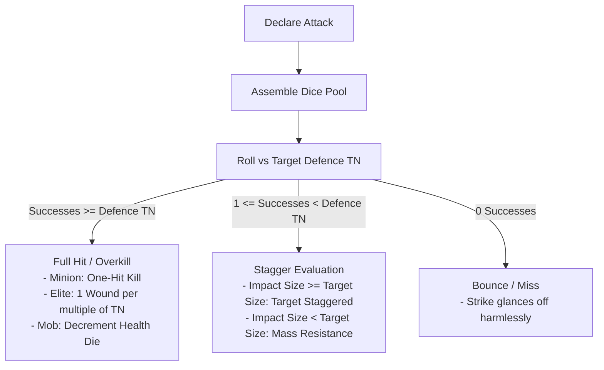

---

## Melee Attacks

A **Melee Attack** represents close-quarters combat against a target occupying the same **Zone**.

### Execution & Dice Pool
*   **Action Cost:** Costs one **Standard Action** during the **Player Active Turn**.
*   **Base Pool:** The attacking Goblin Boss rolls a dice pool equal to their **Tough** stat:
    **Melee Attack Pool** = **Tough** + **Boons (+1d)** - **Banes (-1d)** + **Bangaranga Dice**
*   **Target Number (TN):** The attack resolves against the target's static **Defence TN** (typically 1 to 4).

### Resolving Melee Outcomes
1.  **Standard Enemy (Minion):** If accumulated successes meet or exceed the target's **Defence TN** (Successes >= Defence TN), the minion is instantly defeated and removed from play (**One-Hit Kill**).
2.  **Elite / Boss Enemy (The Overkill Rule):** If successes meet or exceed the target's **Defence TN**, the strike inflicts **1 Wound for every full multiple of the Defence TN** scored on the single roll:
    **Wounds Dealt** = **Attack Successes** / **Target Defence TN** (rounded down)
    *(Example: Against an Elite with Defence 2, rolling 2 or 3 successes deals 1 Wound; rolling 4 or 5 successes deals 2 Wounds; rolling 6 successes deals 3 Wounds).*
3.  **Enemy Mob (Single-Target Melee):** If successes meet or exceed the Mob's **Defence TN**, the strike reduces the face value of the Mob's lowest active health die by the weapon's damage (default 1). If reduced below 1, the die is removed and excess damage spills over into the next lowest die.
4.  **Enemy Mob (Mob-on-Mob Clash):** When a player Mob attacks an enemy Mob, combat resolves via the **Frontline Rule** (see [Mob Mechanics](06_Mob_Mechanics.md)).
5.  **Partial Hit (Stagger):** If the roll yields at least **one (1) success** but fewer than the target's **Defence TN**, the strike deals 0 damage, but triggers an **Impact Size vs. Target Size** comparison to determine if the target is **Staggered**.
6.  **Bounce (Miss):** If the roll yields **zero (0) successes**, the attack bounces harmlessly off the target's armor or parry.

---

## Ranged Attacks

A **Ranged Attack** represents firing projectiles (stones, arrows, bolts, or thrown blades) across one or more **Zones**.

### Execution & Dice Pool
*   **Action Cost:** Costs one **Standard Action** during the **Player Active Turn**.
*   **Base Pool:** The attacking Goblin Boss rolls a dice pool equal to their **Slink** stat:
    **Ranged Attack Pool** = **Slink** + **Boons (+1d)** - **Banes (-1d)** + **Bangaranga Dice**
*   **Target Number (TN):** Resolves against the target's static **Defence TN**.

### Range in Zones
Ranged weapons measure distance strictly in discrete Zone steps:
*   **1 Zone Range (Close):** Slings, thrown daggers, firepots. Targets creatures in the same Zone or 1 adjacent connected Zone.
*   **2 Zones Range (Standard):** Shortbows, standard crossbows. Targets creatures up to 2 connected Zones away.
*   **3 Zones Range (Long / Heavy):** Heavy arbalests, sniper slings. Targets creatures up to 3 connected Zones away.

### Ranged Environmental Penalties & Cover
*   **Partial Cover:** Targeting a creature behind Partial Cover imposes a **Bane 1 (-1d)** penalty on the attack pool.
*   **Full Cover:** Line of sight is completely blocked; the creature cannot be targeted.
*   **Environmental Obstacles:** Firing through Zones with the `Howling Wind` (`[Gale]`) trait or dense smoke screens (`[Gaseous]`) imposes a **Bane 1 (-1d)** penalty.

---

## Impact Size & Stagger Resolution

When an attack scores at least **one (1) success** but falls short of the target's **Defence TN**, the blow lands with insufficient precision to pierce armor or flesh, but carries physical momentum.

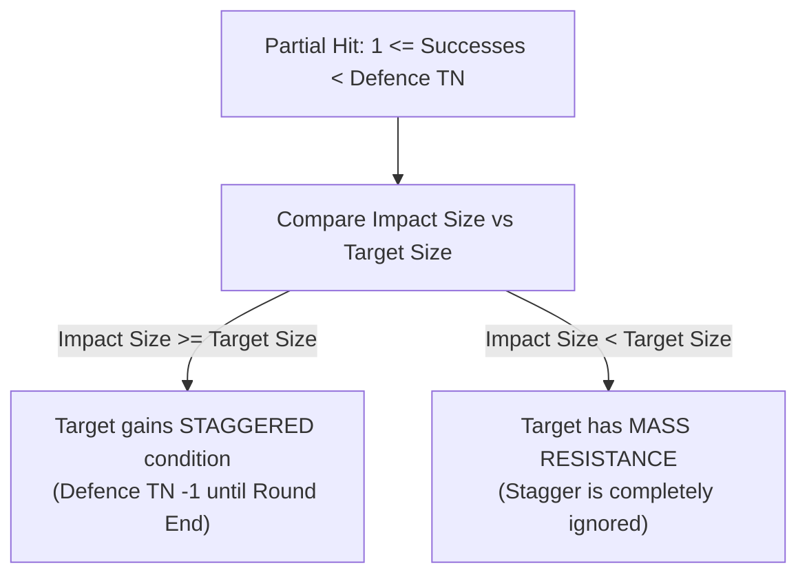

### Calculating Impact Size
**Impact Size** = **Attacker Base Size** + **Weapon Trait Modifiers**

*   **Attacker Base Size:** A Goblin Boss is **Size 1**. A Mob has a base size equal to its current **Mob Size** (1 to 5).
*   **`Heavy` Weapon Trait:** Grants **+1 Impact Size** (e.g. a Size 1 Boss wielding a heavy two-handed maul strikes with **Impact Size 2**).
*   **`Crushing` Weapon Trait:** Grants **+2 Impact Size** (e.g. a Size 1 Boss swinging a wrecking flail strikes with **Impact Size 3**).
*   **Explosives & Spells:** Explosive blast devices and magic attacks possess an Impact Size equal to their **Tier** (Tier 1 = Impact Size 1, Tier 2 = Impact Size 2, Tier 3 = Impact Size 3, Tier 4 = Impact Size 4, Tier 5 = Impact Size 5).

### Stagger Evaluation & Mass Resistance
*   **Stagger Applied (Impact Size >= Target Size):** If the attack's Impact Size equals or exceeds the target's physical **Size**, the target is thrown violently off balance and gains the **Staggered** condition until the **Round Closure Phase**.
*   **Mass Resistance (Impact Size < Target Size):** If the attack's Impact Size is strictly less than the target's physical **Size**, the giant foe absorbs the blow without budging. The target completely ignores the Stagger effect.

>> **THE STAGGERED CONDITION:**
>> A **Staggered** enemy or Boss suffers reduced combat effectiveness:
>> *   **Enemies & Bosses:** Static **Defence TN** is reduced by **1** (to a minimum of 1).
>> *   **Goblin Bosses & PCs:** Suffer a **Bane 1 (-1d)** penalty on active **Dodge** and **Parry** rolls.
>> *   **All Staggered conditions automatically clear on all combatants at the end of each round during the Round Closure Phase.**

---

## Weapon Mechanics & Traits

Weapons provide tactical reach, modify Impact Size, and grant specialized combat properties.

### Structural Properties
*   **Handedness:** One-Handed (**1H**) weapons allow holding a Shield, torch, or Loot item in the off-hand. Two-Handed (**2H**) weapons require both hands to attack and prevent holding off-hand gear.
*   **Bulk Footprint:** Light weapons occupy **Bulk 1**; Medium weapons occupy **Bulk 2**; Heavy weapons occupy **Bulk 3**. Improvised weapons occupy **Bulk 0**.
*   **Quality & Durability:** Weapons belong to a Quality Tier (T1 Junk, T2 Scrappy, T3 Standard, T4 Superior, T5 Legendary). When a player **Fumbles** a test using a weapon, they roll a 1d6 **Break Roll**:
    *   *T1 Junk:* Breaks on a roll of **1–4**.
    *   *T2 Scrappy:* Breaks on a roll of **1–3**.
    *   *T3 Standard:* Breaks on a roll of **1–2**.
    *   *T4 Superior:* Breaks on a roll of **1**.
    *   *T5 Legendary:* **Never breaks**.

### Standard Weapon Traits

| Trait | Category | Mechanical Function |
| :--- | :--- | :--- |
| `Heavy` | Offensive | Adds **+1 to Impact Size** when calculating Stagger. Requires two hands (**2H**). |
| `Crushing` | Offensive | Adds **+2 to Impact Size** when calculating Stagger. Requires two hands (**2H**). |
| `Cleave X` | Offensive | Sweeps across frontline ranks. Deals damage simultaneously to up to **X adjacent standard targets** or up to **X lowest active health dice** in an enemy Mob. |
| `Reach` | Tactical | Allows melee attacks against targets in an adjacent connected Zone without moving into that Zone. |
| `Concealable` | Utility | Compact profile (**Bulk 1**). Can be drawn or stowed as an incidental **Free Action** once per turn. |
| `Versatile` | Tactical | Balanced one-handed profile (**1H**). Can be swung with two hands to gain **+1 Impact Size**. |
| `Piercing` | Tactical | Precision point. Effective against armored foes; suffers **Bane 1 (-1d)** against skeletal Undead. |
| `Bashing` | Tactical | Blunt impact. Grants **Boon 1 (+1d)** to Melee Attack pools against brittle or skeletal Undead. |

---

## Formal Weapon Structural Schema

[CONTENT EXTENSION POINT: Weapons]

All weapon instances, armory catalogues, and custom forge chassis must adhere strictly to this standardized schema:

```markdown
### [Weapon Name]
*   **Category:** [Melee | Ranged | Improvised]
*   **Quality Tier:** [T1 Junk | T2 Scrappy | T3 Standard | T4 Superior | T5 Legendary]
*   **Hands Required:** [1H | 2H]
*   **Bulk:** [Integer 0 to 3+]
*   **Range:** [Current Zone (Melee) | 1 Zone | 2 Zones | 3 Zones]
*   **Base Impact Size:** [Wielder Size | Wielder Size + 1 | Wielder Size + 2]
*   **Attack Stat Profile:** [`Tough` (Melee) | `Slink` (Ranged)] vs Target Defence TN
*   **Break Roll Threshold:** [Breaks on 1–4 | Breaks on 1–3 | Breaks on 1–2 | Breaks on 1 | Never breaks]
*   **Built-in Traits:** [`Heavy`, `Crushing`, `Cleave X`, `Reach`, `Concealable`, `Versatile`, `Piercing`, `Bashing`]
*   **Elemental / Material Tags:** [Optional bracketed tags, e.g. `[Fire]`, `[Spiked]`, `[Silvered]`]
*   **Special Mechanical Capabilities:** [Direct Tier A rules permissions or situational boons]
```

---

## Armor & Shields Mechanics

Armor and shields provide passive protection, absorb incoming blows, and enable active parrying reactions.

### Passive Armor Dice
Worn armor provides bonus colored dice (the **Armor Dice pool**) that are thrown alongside active defense dice during a **Clatter Roll**:
*   **Light Armor (Bulk 1 | 0 Bane):** Grants **+1d Armor Die**. Flexible and quiet; imposes zero mobility or stealth penalties.
*   **Medium Armor (Bulk 2 | Bane 1):** Grants **+2d Armor Dice**. Stiff leather or mail; imposes **Bane 1 (-1d)** on all **Slink** tests.
*   **Heavy Armor (Bulk 3 | Bane 2):** Grants **+3d Armor Dice**. Rigid plate; imposes **Bane 2 (-2d)** on all **Slink** tests, and the wearer **cannot swim** (sinks instantly in Deep Water).

### Shield Mechanics
*   **Armor Bonus:** Equipping a Shield (**Bulk 1 | 1H**) grants **+1d Armor Die** to your passive mitigation pool.
*   **Enables Parry Reaction:** Wielding an active Shield unlocks the ability to declare a **Parry** reaction using your **Tough** stat instead of being limited to a Slink Dodge.

### Passive Mitigation Ceiling
>> **THE 5D MITIGATION CEILING:**
>> The total passive mitigation pool rolled on any single Clatter Roll (combining Armor Dice, Shield bonus dice, and Slink Passive Defence dice) is hard-capped at **5d6 Armor Dice** to prevent absolute invulnerability.

### Ablative Gear Sacrifice Rule
When a Goblin Boss suffers an incoming strike with enough unmitigated damage to reduce their **Grit to 0** (or cause immediate death), the Boss may declare an immediate **Gear Sacrifice**:
*   **The Shatter:** The Boss permanently destroys one equipped Shield or suit of Armor on the spot, reducing the item to worthless, unrepairable scrap.
*   **The Salvation:** The sacrifice completely absorbs the lethal impact, reducing the incoming strike's damage to **0**.
*   *(Note: This rule applies strictly to PC Goblin Bosses; Mobs do not track individual ablative gear).*

---

## Formal Armor & Shield Structural Schema

[CONTENT EXTENSION POINT: Armor & Shields]

All protective gear instances and shields must adhere strictly to this schema:

```markdown
### [Armor / Shield Name]
*   **Category:** [Light Armor | Medium Armor | Heavy Armor | Shield | Heavy Pavise]
*   **Quality Tier:** [T1 Junk | T2 Scrappy | T3 Standard | T4 Superior | T5 Legendary]
*   **Slot / Hands:** [Worn (Body) | 1H (Held)]
*   **Bulk:** [Integer 1 to 3] (For Mobs: Bulk Rating x Mob Size)
*   **Passive Armor Dice:** [+1d | +2d | +3d]
*   **Mobility Penalties:** [None | Bane 1 (-1d) on Slink | Bane 2 (-2d) on Slink, Cannot Swim]
*   **Break Roll Threshold:** [Breaks on 1–4 | Breaks on 1–3 | Breaks on 1–2 | Breaks on 1 | Never breaks]
*   **Special Mechanical Properties:** [e.g. Enables Tough Parry reaction, Ablative Sacrifice eligible]
*   **Elemental / Material Tags:** [Optional bracketed tags, e.g. `[Reinforced]`, `[Spiked]`, `[Insulated]`]
```

---

## Gear, Tools & Consumables Mechanics

Expedition tools, alchemical explosives, and utility gear provide non-combat problem solving and area threat projection.

### Design Mandate: Difficulty & Permissions
Tools never grant "+1 flat math modifiers" to die faces. Instead, tools operate through three clear mechanisms:
1.  **Narrative Permission:** Enables a task that is otherwise physically impossible (e.g. a 30 ft rope allows climbing sheer cliffs).
2.  **Difficulty Step Shift:** Reduces test Difficulty (e.g. Quality Lockpicks shift lockpicking from **Hard (6)** to **Normal (5+)**).
3.  **Dice Boons:** Adds physical dice to the test pool (**Boon 1 (+1d)**).

### Consumables & Explosive Area Threat Profiles
Explosives (grenades, molotovs, powder kegs) do not roll single-target attack pools. When thrown or detonated, they project an **Area Threat Profile** across their target Zone:

**Area Threat Profile** = `Threat [Difficulty]+/[TN]`, `[Damage]`, `[Tags]`, `Blast Range: X Zones`, `Impact Size: Y`

*   **PC Bosses in Blast Zone:** Must resolve an immediate **Clatter Roll** (Dodge vs Threat TN) or suffer full blast damage to Grit.
*   **Mobs in Blast Zone:** May execute an active **Scatter** reaction or suffer blast damage applied simultaneously to all health dice.
*   **Standard Minions in Blast Zone:** Instantly destroyed if the explosive's Threat TN >= Minion Defence TN.
*   **Elite Enemies in Blast Zone:** Take 1 Wound if Threat TN >= Defence TN, and gain **Staggered** if blast Impact Size >= Enemy Size.

---

## Formal Gear, Tools & Consumables Schema

[CONTENT EXTENSION POINT: Gear, Tools & Consumables]

All adventuring gear, tools, and consumables must adhere strictly to this schema:

```markdown
### [Item Name]
*   **Category:** [Adventuring Tool | Utility Gear | Consumable / Explosive | Loot Plunder]
*   **Quality Tier:** [T1 Junk | T2 Scrappy | T3 Standard | T4 Superior | T5 Legendary]
*   **Bulk:** [Integer 0 to 4+]
*   **Usage Lifespan:** [Permanent | Single-Use Expended | 1 Exploration Phase]
*   **Break Roll Threshold:** [Breaks on 1–4 | Breaks on 1–3 | Breaks on 1–2 | Breaks on 1 | Never breaks]
*   **Mechanical Function:** [Permission rule, Difficulty step shift, or Boon (+1d)]
*   **Area Threat Profile** *(Consumables only)*: `Threat [Face]+/[TN]`, [Damage], `[Tags]`, Blast Range: [X Zones], Impact Size: [Tier 1–5]
*   **Loot Value** *(Plunder only)*: [Tier 1–5 Value tokens]
```

---

## The Clatter Defense Roll

The **Clatter Roll** is the core defensive mechanic in **Gobbos**. When an enemy strikes during the **Enemy Active Turn**, the GM announces the attack's **Threat Profile** (`Threat [Face]+/[TN]`) and flat **Damage**. The defending Goblin Boss resolves defense in a single simultaneous throw.

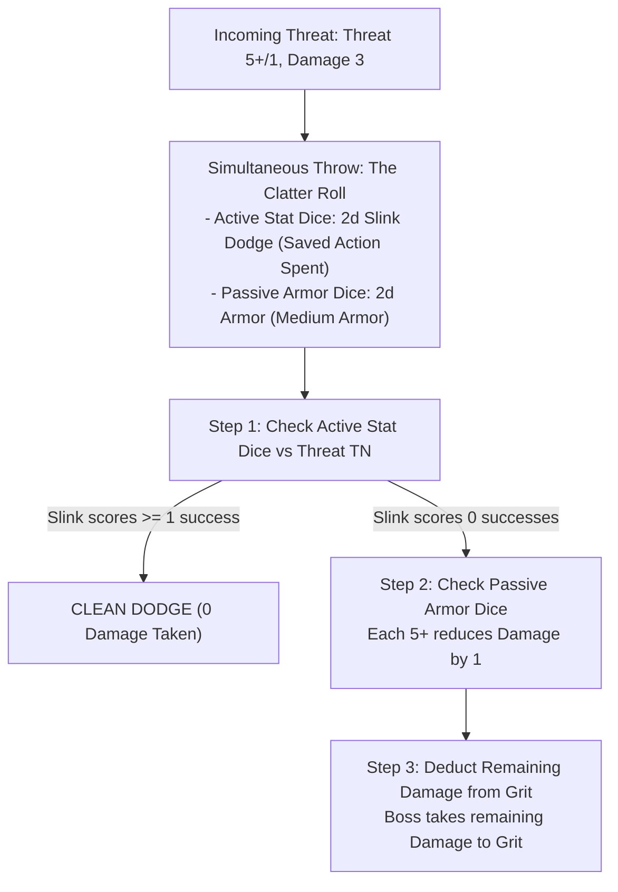

### Step-by-Step Clatter Roll Procedure

1.  **Saved Action Declaration:** To roll active **Stat Dice**, the Boss must spend one saved **Standard Action** (declaring a **Dodge** using `Slink`, or a **Parry** using `Tough` if equipped with a Shield).
    *   *Zero Saved Actions:* If the Boss spent all 3 actions on their active turn, they cannot roll Stat Dice and must rely entirely on passive Armor Dice.
2.  **Simultaneous Throw:** The player rolls their active Stat Dice alongside their distinct colored **Armor Dice** (plus any Slink Passive Defence dice) in a single roll.
3.  **Evaluating Active Evasion:**
    *   If successes on active **Stat Dice** meet or exceed the incoming **Threat TN**, the Boss achieves a **Clean Dodge/Parry**: **0 Damage is taken**.
4.  **Evaluating Armor Mitigation:**
    *   If active Stat Dice fall short of the Threat TN (or if 0 saved actions were available), the attack hits.
    *   Every success (**5+**) rolled on the **Armor Dice** reduces incoming Damage by **1**.
5.  **Grit Decrement:** Any remaining unmitigated damage is deducted directly from the Boss's **Grit** (see [Damage, Grit & Wounds](07_Damage_Grit_and_Wounds.md)).

---

## Group Attacks & Flanking

To prevent table slowdown and avoid draining all player reaction actions against large swarms of lesser foes, the GM uses **Group Attacks**.

### Group Attack (Enemy Swarm) Rules
When multiple standard minions gang up on a single Goblin Boss:
*   **Consolidated Attack:** The GM combines up to **3 standard enemies** into a single incoming strike.
*   **Damage Scaling:** The attack uses the primary enemy's Threat profile, and deals:
    **Group Damage** = **Base Enemy Damage** + (1 Damage per additional enemy)
*   **Single Defense Resolution:** The defending Boss spends only **one (1) saved Standard Action** to resolve a single Clatter Roll against the entire combined swarm attack.
*   **Targeting Cap:** A maximum of 3 standard enemies may combine against a single PC Boss. (Attacks against player Mobs have no grouping cap).

### Flanking & Crossfire Boons
*   **Flanking in Melee:** If two allied Bosses (or a Boss and an allied Mob) engage the same enemy from different approach vectors or surround a foe within a Zone, both attackers gain a **Boon 1 (+1d)** on their Melee Attack rolls.
*   **Crossfire in Ranged:** If ranged attackers target an enemy from two separate connected Zones, ranged attacks against that target gain a **Boon 1 (+1d)**.

---

## Mechanical Gap Analysis & Missing Rules

[MISSING RULE / GAP: Dual-Wielding Light Melee Weapons — Character creation permits equipping two Light Melee weapons, but the core combat rules lack an explicit mechanical rule for dual-wielding. Suggested Resolution: Wielding a secondary off-hand Light Melee weapon grants either a passive Boon 1 (+1d) to Melee Attack pools or allows splitting successes across two distinct adjacent targets in the same Zone on a single Attack action.]

[MISSING RULE / GAP: Ranged Weapon Ammunition Tracking and Depletion — Rules specify slings use scavenged stones, but bows and crossbows lack explicit ammunition management. Suggested Resolution: Standardize that a mundane Quiver/Bolt Case occupies Bulk 1 (providing sufficient ammunition for an entire raid). Fumbling a ranged attack roll with a bow or crossbow expends or breaks the active ammunition supply, requiring a Manipulate action in a Junk Pile or spending 1 Scrap to restock.]

---

<a id="doc-8"></a>
<!-- ============================================================ -->
<!-- DOCUMENT 8: 02_PROD_Core_Rules/06_Mob_Mechanics.md -->
<!-- ============================================================ -->
# Mob_Mechanics
*Source: `02_PROD_Core_Rules/06_Mob_Mechanics.md`*

# Mob Mechanics

*A Goblin Boss is only as terrifying as the screaming swarm of runts behind you. A Mob is your living shield, your sledgehammer, and your treasure wagon. When ordered well, they overwhelm knights and plunder vaults; when left to their own devices, they pick their noses, argue over shiny pebbles, and set things on fire.*

---

## Mob Anatomy & Metrics

A **Mob** is a collection of lesser goblins under the direct command of a **Goblin Boss** (Player Character). Mobs do not possess individual attribute ratings; all of their combat strength, physical mass, and carrying capacities scale from their current **Size** rating (ranging from **Size 1** to **Size 5**).

| Classification | Size | Combat Dice | Required Grunt | Loot Capacity |
| :--- | :---: | :---: | :---: | :---: |
| **Runt Mob** | **1** | **1d6** | **1** | **4 Bulk** |
| **Skirmish Group** | **2** | **2d6** | **2** | **8 Bulk** |
| **Raid Troop** | **3** | **3d6** | **3** | **12 Bulk** |
| **War Gang** | **4** | **4d6** | **4** | **16 Bulk** |
| **Horde Company** | **5** | **5d6** | **5** | **20 Bulk** |

### Core Mob Attributes
1.  **Combat & Tough Dice Pool:** A Mob rolls a physical dice pool equal to its current **Size** (**1d6 to 5d6**) for Melee Attacks, physical force, lifting, and **Tough** hazard tests.
2.  **General Skill Baseline:** For non-physical tests (**Slink**, **Brains**, and **Mouth**), a Mob rolls a flat baseline pool of **2d6**, reflecting the aggregate cunning of the crowd.
3.  **Required Grunt:** To maintain absolute authority without command resistance, the controlling Boss must maintain a current **Grunt >= Mob Size**.
4.  **Loot Capacity:** A Mob carries up to **Size x 4 Bulk** in loose Loot and expedition gear without suffering encumbrance penalties.
5.  **Over-Laden Mobs:** If a Mob carries Bulk exceeding its Loot Capacity (up to a hard cap of **Size x 6 Bulk**), it becomes **Over-Laden**: its Movement is reduced by **-1 Zone** per Move action (minimum 1 Zone) and it suffers a **Bane 1 (-1d)** penalty on all physical tests.

---

## Mob Equipment & Loot Tradeoff

A Boss can outfit a Mob with protective armor and specialized tools, but doing so directly consumes the Mob's carrying capacity.

### Mob Armor (Scaled Bulk)
Equipping an entire Mob with armor requires sufficient scrap-plates or quilted hides for every runt in the Mob.
*   **Bulk Cost:** Mob Armor costs **Bulk equal to the Armor's Bulk rating multiplied by current Mob Size** (e.g. Light Armor costs Size x 1 Bulk; Medium Armor costs Size x 2 Bulk).
*   **Passive Armor Dice:** An armored Mob rolls its passive Armor Dice (+1d or +2d) **once per incoming attack**. Every success (**5+**) reduces incoming damage by 1 across all targeted health dice before damage is applied.
*   **Casualty Scaling:** When a Mob suffers casualties and loses Size, the armor of the fallen goblins remains on their corpses on the battlefield. Equipped Mob Armor never causes an encumbrance overload when Size drops.

### Expedition Tools & Weapons
*   **Shared Expedition Tools:** Expedition tools (such as Ropes, Crowbars, Lanterns, and Shovels) are shared across the Mob. Each tool occupies its standard flat **Bulk** rating (e.g. 1 Bulk for a Climbing Rope).
*   **Mob Weapons:** Equipping a Mob with specialized weapons (e.g. Cleavers or Greatclubs) costs **Size x Weapon Bulk**, granting the entire Mob the weapon's traits (e.g. `Heavy` granting +1 Impact Size, or `Cleave` damaging additional unengaged frontline dice).

---

## Health Dice Pool & Damage Resolution

A Mob's health is physically represented on the gaming table by a pool of **d6s equal to its current Size**, with each die starting at the **"6" face**.

> **Example (Size 3 Mob at Full Health):** `[Die 1: Face 6]` `[Die 2: Face 6]` `[Die 3: Face 6]`

### Damage Delivery Modes

| Attack Delivery Type | Mechanical Resolution Across Health Dice Pool |
| :--- | :--- |
| **Single-Target Attack** | Deduct from lowest-value active die. Spillover into next lowest die if reduced below 1. |
| **Mob-on-Mob Melee** | **The Frontline Rule:** Deduct damage simultaneously from min(Attacker Size, Defender Size) lowest-value dice. |
| **Cleaving Strike (`Cleave X`)** | Deduct damage simultaneously from up to X lowest-value active health dice. |
| **True Area Threat (`[AoE]`, Explosives)** | **Full Zone AoE:** Deduct damage simultaneously from EVERY SINGLE active health die in the Mob's pool. |

1.  **Single-Target Damage & Spillover:** Single-target strikes (arrows, single sword thrusts) apply damage directly to the Mob's **lowest-value active health die**. If the die drops below 1, that die is permanently removed from the table (reducing Mob Size by 1), and any remaining excess damage **spills over** into the next lowest die.
2.  **The Frontline Rule (Mob-on-Mob Melee):** When two Mobs clash in close combat, the attacking Mob strikes a number of health dice equal to its own current Size: **min(Attacker Size, Defender Size)**.
    *   *Lowest Dice First:* Damage is applied simultaneously to the defender's lowest-value health dice up to the engagement cap.
    *   *Simultaneous Reduction:* Each engaged die is reduced by the attack's effective damage. Any die reduced below 1 is removed.
    *   *Backline Immunity:* Unengaged backline dice suffer **0 damage**.
3.  **Cleaving Attacks (`Cleave X`):** Strikes with `Cleave X` sweep across frontline ranks, applying damage simultaneously to **up to X of the Mob's lowest-value active health dice**.
4.  **True Area Threats (`[AoE]` & Explosives):** Full-zone hazards, blast devices, and dragon breath apply damage simultaneously to **every single active health die** in the Mob's pool without an engagement cap.
5.  **Casualties & Dropped Loot:** When a Mob shrinks in Size, its Loot Capacity shrinks immediately. If carried loose Loot and tools exceed the new capacity, the controlling Boss must immediately declare which items are dropped onto the Zone floor.
6.  **Post-Combat Regrouping:** Mid-combat health dice redistribution is strictly forbidden. Once an active battle concludes (or during the Round Closure of Combat End), the Boss may freely rearrange remaining health points across all surviving dice. Lost Size can only be replenished through recruitment during the Lair Phase.

> **Example (Frontline Clash):** A Size 4 Goblin Mob has health dice reading `[6, 4, 2, 1]`. A Size 2 Town Guard unit attacks and deals 2 damage. Because the guards are Size 2, they engage the 2 lowest dice (`[1]` and `[2]`). Both dice take 2 damage and are reduced below 1 and removed. The Goblin Mob is now Size 2, with surviving dice `[6, 4]`.

---

## Boss Orders & Command Flow

A Mob receives **two (2) actions** per round, reset at Round Start. Mobs act during the **Player Active Turn** when directed by their Boss.

### Command Line of Sight & Distance
*   **Visual Line of Sight:** The Boss must maintain direct visual line of sight to the Mob (or a portion of the Mob) to issue verbal or somatic commands.
*   **Command Test Profile:** Issuing an Order to a controlled Mob within Grunt limits in the same Zone requires no roll (**Automatic Success**). When commanding across distances or exceeding Grunt, resolve using this profile:

| Command Factor | Distance / Condition | Command Resolution Rule |
| :--- | :--- | :--- |
| **Size <= Grunt** | Baseline | **Target Number (TN) = 1** |
| **Size > Grunt** | Rebellious Swarm | **TN increases by +1 per point of difference** |
| **Same Zone** | Point-blank | **+1 Automatic Success** (Guaranteed pass if Size <= Grunt) |
| **Distance <= Mouth** | Voice Range | **Normal (5+)** Difficulty test |
| **Distance = Mouth + 1** | Shouting Range | **Hard (6)** Difficulty test |
| **Distance > Mouth + 1** | Out of Range | **Command is physically impossible** |

### The Boredom Rule
>> **THE BOREDOM RULE:**
>> Goblins possess notoriously short attention spans. An ordered Mob cannot perform the exact same action twice in a single round (e.g. a Mob cannot Attack twice or Plunder twice).
>> *Exception:* A Mob may spend both actions taking **Move** actions if they are fleeing or charging.

### Action Economy Allocation
*   **Spending 2 Actions:** If an Order directs a Mob to spend both actions (e.g. Move then Attack), the Mob has 0 saved actions remaining for defense reactions.
*   **Saving 1 Action:** If an Order directs a Mob to spend only 1 action (e.g. Move into cover), its second action is saved, enabling the Boss to order an active **Scatter** reaction during the Enemy Active Turn.

---

## Unordered Mob States & Behavior Tables

Mobs that receive no direct orders from their Boss resolve their actions at the end of the **Player Active Turn** (after all player characters have finished their declarations).

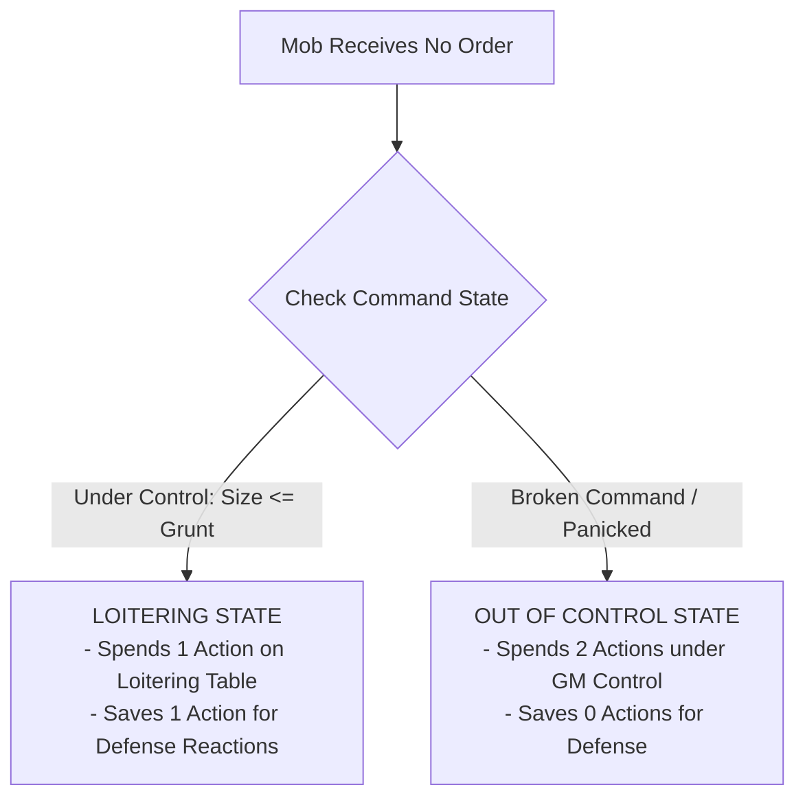

### Loitering Table (1d6)
*Under control, but idle. The Mob spends **1 action** resolving the rolled behavior and saves **1 action** for defense:*

*   **1 (Bicker):** Goblins push, argue, and complain. *(Spends 1 action, saves 1 action).*
*   **2 (Inspect):** Runts pick their noses, stare at architecture, or draw crude graffiti. *(Spends 1 action, saves 1 action).*
*   **3 (Snatch):** Goblins plunder a loose shiny object or eat nearby rations (resolves as a Plunder action if Loot is present). *(Spends 1 action, saves 1 action).*
*   **4 (Wander):** The Mob scurries **1 Zone** in a random direction, refusing to leave visual line of sight of their Boss. *(Spends 1 action, saves 1 action).*
*   **5 (Snoop):** The Mob peers around curiously, granting a **Boon 1 (+1d)** to the next allied Boss who tests to search or disarm traps in the Zone. *(Spends 1 action, saves 1 action).*
*   **6 (Taunt):** Goblins scream insults, rattle pots, and moon the nearest enemy. *(Spends 1 action, saves 1 action).*

### Out of Control Table (1d6)
*Uncontrolled swarm. The Mob spends **both actions** running amok under GM direction (0 saved actions):*

*   **1–2 (Panic / Flee):** If a **Terrifying Enemy** (Elite, Boss, or creature with `[Frightening]`) is present, the Mob spends both actions fleeing toward the nearest exit. Otherwise, they squabble violently: the Mob takes **1 Damage** to its lowest health die and gains the **Staggered** condition. *(Spends 2 actions, 0 saved).*
*   **3–4 (Loot / Trash):** If unattended loot or food is present, the Mob plunders it (eating food heals **1d6 damage** on its health dice). Otherwise, they spend both actions vandalizing doors, crates, and scenery. *(Spends 2 actions, 0 saved).*
*   **5–6 (Frenzy):** The Mob swarms and attacks the nearest living creature in their Zone (friend or foe!). If no creatures are present, they sprint **1 Zone** toward the loudest noise. *(Spends 2 actions, 0 saved).*

### Rallying & Regaining Control
To restore command over an **Out of Control** Mob, the Boss must spend a Standard Action (**Order**) on your turn and pass a **Mouth** test against the standard command distance profile. On a success, the Mob immediately returns to the **Ordered** state; on a failure, it remains Out of Control.

---

## Mob Defense & The "Scatter!" Reaction

Mobs do not possess individual stats and cannot naturally perform a Dodge or Parry. When targeted by an incoming attack during the **Enemy Active Turn**:

### 1. Passive Armor Roll
If equipped with Mob Armor, the player rolls the Mob's passive **Armor Dice** once per incoming attack. Every success (**5+**) reduces incoming damage by **1** across all targeted health dice before damage is applied.

### 2. The "Scatter!" Order Reaction
If the Mob has at least **1 saved action remaining**, the Boss may spend a saved Standard Action (or an unused **Free Order**) to scream "Scatter!":

1.  **Assemble Mouth Pool:** The Boss rolls a dice pool equal to the Boss's **Mouth** stat.
2.  **The Size Penalty:** Large swarms are clumsy to disperse. The Scatter TN equals the attack's Threat TN plus the Mob's Size penalty:
    **Scatter TN** = **Threat TN** + (**Mob Size** - 1)
3.  **Clean Scatter:** If Mouth successes >= Scatter TN, the Mob evades completely (**0 Damage taken**) and immediately moves **1 Zone** into available cover.
4.  **Failed Scatter:** If Mouth successes < Scatter TN, the Mob takes incoming damage normally, mitigated only by passive Armor Dice.
5.  **The Scatter Gamble (Gobbo Gamble):** If the initial Scatter roll falls short, the Boss may reroll all **1s** on the Mouth dice. 
    *   *If the Gamble Succeeds:* The Mob pulls off a chaotic miracle dive, taking **0 Damage**.
    *   *If the Gamble Fails:* Catastrophic stampede! The Mob takes the full attack damage, suffers **1 Trample Damage to EVERY active health die** in its pool, drops **1 Bulk** of carried Loot, and immediately becomes **Out of Control**. If the Boss occupies the same Zone, the Boss is caught in the stampede and gains the **Staggered** condition.

---

## Morale & Swarm Terror

Goblins are cowardly by nature. When battle turns against them, discipline shatters.

### Player Mob Morale Checks
*   **Trigger:** Occurs during the **Round Closure Phase** if a Mob lost **50% or more of its starting Size** during the round, or if its controlling Boss was incapacitated.
*   **The Check:** The Boss must pass an immediate **Mouth** or **Grunt** test against **Normal (5+/1)** difficulty (or **5+/2** if facing a `[Terrifying]` foe).
*   **Failure:** The Mob breaks command and enters the **Out of Control** state, fleeing toward the exit on its next turn.

### Enemy Morale & The Swarm Terror Check
When an enemy group suffers catastrophic loss (50% casualties or their commander is slain), the player horde unleashes their collective terror:

**Swarm Terror Pool** = **Surviving Mob Sizes in Zone/Adjacent** + **Surviving Bosses in Zone/Adjacent**

*   **The Roll:** Players roll the combined **Swarm Terror Pool** against the enemy's static **Morale TN** (typically 1 to 3).
*   **Success (Successes >= Morale TN):** The enemy force breaks and flees toward the nearest exit for 2 actions per turn until off the map.
*   **Commander Rally:** A surviving Enemy Commander can spend 1 action on their active turn to attempt a Rally, testing against the players' Swarm Terror profile.

---

## Splitting, Merging & Cross-Gang Mobs

### Splitting a Mob
A Boss can spend one **Order Action** to split a Mob into two smaller Mobs:
*   **Dice Distribution:** The Boss freely divides active health dice between the two new Mobs (e.g. a Size 5 Mob splits into Size 3 and Size 2).
*   **Gear Distribution:** Equipped Mob Armor travels with the goblins wearing it (both Mobs retain the armor tier). Carried tools are explicitly assigned to one of the split Mobs.

### Merging Mobs
Two allied Mobs occupying the same Zone can be merged into a single Mob using an **Order** or **Manipulate** action:
*   **Dice Combination:** Add surviving health dice together. Total combined Size **cannot exceed the Boss's Grunt** (otherwise an immediate Rebellion test is triggered: Mouth or Tough `5+/Size`).
*   **Armor Dilution:** If an armored Mob merges with an unarmored Mob, the armor is diluted and drops by **1 Tier** (e.g. Medium Armor becomes Light Armor) unless additional armor is equipped.

### The Super-Mob (Cross-Gang Merging)
Mobs belonging to different player Gangs can merge into a single colossal **Super-Mob**:
*   **Command Friction:** Any Boss attempting to issue an Order to a Cross-Gang Super-Mob must pass a **Grunt test** (**Tough** if in the same Zone, or **Mouth** from afar).
*   **In-Fighting Trigger:** Whenever a Cross-Gang Mob rolls a dice pool for *any check* (Attack, Move, or Hazard), **every 1 rolled deals 1 self-inflicted Damage to the Mob's active health dice**.

---

## Mob Sacrifice Maneuvers

When a Gang lacks proper tools, a Boss can order expendable runts into desperate tactical maneuvers:

| Maneuver Name | Minimum Mob Size | Cost | Mechanical Benefit |
| :--- | :---: | :--- | :--- |
| **Gobbo Pyramid** *(Living Ladder)* | **Size 2** | **1 Mob Action** | Goblins stack onto shoulders. An allied Boss or character climbs **1 vertical Zone** without making a climbing test. |
| **Living Bridge** *(Chasm Crosser)* | **Size 3** | **1 Mob Action** + **1 Mob Damage** | Goblins link arms across a chasm. Allied characters walk across safely without tests. The Mob takes 1 Damage from trample strain. |
| **Canary Runt** *(Trap Tripper)* | **Size 1** | **1 Mob Health Die** | A single runt triggers a discrete pressure trap or tests thin ice, clearing the passage safely for the rest of the gang. |
| **Meat Cushion** *(Soft Landing)* | **Size 1** | **Mob Reaction** (Takes Fall Damage) | If a Boss falls into a Zone occupied by an allied Mob, the Mob absorbs the blow: Boss takes **0 Damage**; Mob takes the full fall damage across its health dice. |
| **Gnaw the Hinges** *(Pry-bar Substitute)* | **Size 2** | **1 Mob Action** | The Mob tears at locked doors or chest hinges. Roll a `Tough` test (**Size dice**). If the test fails after pushing 1s, the Mob takes **1 Damage** from chipped teeth and crushed fingers. |

---

## Mechanical Gap Analysis & Missing Rules

[MISSING RULE / GAP: Mob Weapon Equipping & Scaling Rules — While Mob armor and tools have detailed Bulk rules, rules for outfitting Mobs with specialized melee weapons (e.g. Greatclubs, Cleavers, Polearms) lack an explicit framework in early drafts. Suggested Resolution: Standardize that equipping a Mob with specialized weapons costs Size x Weapon Bulk from their Loot Capacity, granting the entire Mob the weapon's built-in traits (such as Cleave or Heavy +1 Impact Size).]

[MISSING RULE / GAP: Maximum Swarm Terror Pool Ceiling — In massive multi-player raids with multiple Size 5 Mobs, Swarm Terror dice pools can reach 15d–20d6, mathematically guaranteeing enemy routs. Suggested Resolution: Cap the Swarm Terror dice pool at a maximum of 8d6 on any single Morale test, ensuring high-morale commanders retain a viable chance to hold the line.]

---

<a id="doc-9"></a>
<!-- ============================================================ -->
<!-- DOCUMENT 9: 02_PROD_Core_Rules/07_Damage_Grit_and_Wounds.md -->
<!-- ============================================================ -->
# Damage_Grit_and_Wounds
*Source: `02_PROD_Core_Rules/07_Damage_Grit_and_Wounds.md`*

# Damage, Grit, Conditions and Wounds

*Goblins are squishy, breakable, and full of bad ideas. When a tall-man swings a poleaxe, you do not absorb the blow with stoic dignity. You duck, you shriek, your armor dents, or you get flattened into paste. Surviving a raid is not about being unbreakable; it is about making sure someone else takes the hit.*

---

## 1. Damage Resolution and Boss Grit

The Game Master (GM) never rolls attack tests or damage rolls. All enemy attacks present a deterministic **Threat Profile** (`Difficulty+/TN`) and a flat **Damage** value (see [Adversaries & Threats](12_Adversaries_and_Threats.md)).

### Boss Grit Pool
**Grit** is the mechanical tracker for a **Goblin Boss's** personal survival, physical stamina, and sheer luck. 
*   **Starting Grit:** A **Goblin Boss** has a maximum **Grit** determined strictly by the **Tough** attribute score (see [Boss Profile & Gang](02_Boss_Profile_and_Gang.md)):
    *   **Tough 1:** 3 **Grit**.
    *   **Tough 2–3:** 4 **Grit**.
    *   **Tough 4–5:** 5 **Grit**.
*   **The Synonym Ban:** A **Goblin Boss** tracks **Grit**. A **Goblin Boss** never tracks *Health* or *Wounds*. **Health Dice** are used exclusively by **Mobs** (see [Mob Mechanics](06_Mob_Mechanics.md)), and **Wounds** are tracked exclusively by **Elite** and **Boss** enemies.

### Unmitigated Damage Decrement
When an incoming attack targets a **Goblin Boss**, the **Player** resolves defense using a **Clatter Roll** (see [Combat Engine](05_Combat_Engine.md)):
1.  **Active Evasion:** If the **Player** spent a saved **Standard Action** to declare a **Dodge** (testing **Slink**) or **Parry** (testing **Tough** with a shield or heavy weapon), scoring successes equal to or exceeding the attack's **Threat TN** negates the attack entirely (**0 Damage taken**).
2.  **Passive Armor Mitigation:** If active evasion fails or no saved action was available, the **Player** rolls passive **Armor Dice**. Every die showing **5+** reduces incoming **Damage** by **1**.
3.  **Grit Loss:** Any remaining unmitigated **Damage** reduces the **Goblin Boss's** current **Grit** on a 1-for-1 basis.

>> **RULE: No Mid-Roll Modifiers**
>> Damage reduction applies strictly through passive **Armor Dice** or explicit traits before deducting points. You never perform post-roll arithmetic to alter incoming damage values.

---

## 2. Zero Grit, The Final Act, and Death

When a **Goblin Boss** reaches **0 Grit**, the character dies. However, death in Gobbos is never instantaneous or silent; it triggers a blaze of chaotic glory before the character is removed from play.

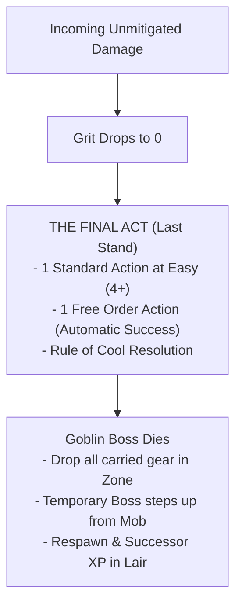

### The Final Act (Last Stand)
The moment your **Grit** reaches **0**, your **Goblin Boss** immediately triggers **The Final Act**:
*   **Action Grant:** You immediately receive **1 Standard Action** plus **1 Free Order Action**, resolved out of turn sequence before your character falls.
*   **Easy Difficulty:** The **Standard Action** is resolved at **Easy (4+)** difficulty, regardless of standard environmental penalties or combat conditions.
*   **Guaranteed Orders:** The **Order Action** succeeds automatically without a dice roll, provided the target **Mob** is within visual line of sight.
*   **The Rule of Cool:** The **GM** must interpret the outcome under the **Rule of Cool**, allowing the dying **Goblin Boss** to pull off an epic stunt, detonate a hidden explosive, shove an ally to safety, or take down a hated nemesis.
*   **Death Execution:** Once **The Final Act** concludes, the **Goblin Boss** dies permanently. All carried weapons, armor, tools, and **Loot** drop to the floor in the current **Zone**.

### The Temporary Boss
During the remainder of the active raid, the **Player** cannot generate a new full **Goblin Boss** until returning to the **Lair**:
*   **Stepping Forward:** If the deceased character's **Gang** still has a surviving **Mob** on the map, one runt steps forward as a **Temporary Boss**.
*   **Profile:** The **Temporary Boss** is controlled by the **Player**, possesses no **Quirks**, and has all attribute stats reduced by **1** compared to the deceased **Goblin Boss** (to a minimum attribute score of **1**).
*   **Survival:** The **Temporary Boss** allows the **Player** to remain active, issue commands, and extract surviving **Loot** back to the **Lair**.

### Successor Generation in the Lair
When the raid party returns to the **Lair**, the player generates a true **Successor Boss** (see [The Lair Loop & Progression](10_The_Lair_Loop_and_Progression.md)):
*   **Successor XP:** The new **Goblin Boss** starts with baseline stats plus bonus **Successor XP** equal to **Gang Infamy x 4**.
*   **Inherited Quirks:** The new character inherits 1 **Gang Mark Quirk** from the ancestral pool.
*   **Named Items:** The favorite weapon of the fallen boss can be recovered and enshrined as a **Named Item** in the **Lair**.

---

## 3. Enemy Wounds and The Overkill Rule

Adversaries do not use **Grit**. Instead, enemy casualties are resolved through two distinct mechanics based on threat tier:

### One-Hit Kill on Standard Enemies
Standard adversaries (peasants, town guards, minor beasts, skeleton grunts) possess no wound tracks:
*   **Execution:** When an attack roll scores successes equal to or greater than the standard enemy's **Defence TN**, the target is instantly killed and removed from the map.
*   **No Partial Damage:** Rolling fewer successes than the enemy's **Defence TN** inflicts **0 Damage** (though it may inflict the **Staggered** condition if **Impact Size** requirements are met).

### The Wounds Track (Elites and Bosses)
Powerful adversaries (**Elites** and **Bosses**) track survivability using a physical **Wounds Track** (ranging from **2 to 8 Wounds**).
*   **Baseline Hit:** Scoring successes equal to the target's **Defence TN** inflicts **1 Wound**.
*   **The Overkill Rule:** When a single attack roll exceeds the target's **Defence TN**, the attack deals **1 Wound for every full multiple of the Defence TN** scored on that roll:

**Wounds Dealt** = **Attack Successes** / **Target Defence TN** (rounded down)

> **Example:** A **Goblin Boss** strikes an Elite Solar Praetor (**Defence 2**, **5 Wounds**).
> *   Rolling **1 Success:** The attack fails to meet **Defence 2**. It deals **0 Wounds** (but may inflict **Staggered** if Impact Size >= Praetor Size).
> *   Rolling **2 or 3 Successes:** Scores 1 full multiple of 2. Inflicts **1 Wound**.
> *   Rolling **4 or 5 Successes:** Scores 2 full multiples of 2. Inflicts **2 Wounds**.
> *   Rolling **6 Successes:** Scores 3 full multiples of 2. Inflicts **3 Wounds**.

>> **GOLDEN RULE: No Fractional Wounds**
>> Remainder successes that do not form a complete multiple of the target's **Defence TN** are discarded. They do not carry over to subsequent attacks.

---

## 4. Impact Size and Stagger Resistance

When an attack scores at least **1 Success** but fails to meet the target's full **Defence TN**, the strike is a partial hit. A partial hit deals **0 Damage** and **0 Wounds**, but can throw the target off balance by applying the **Staggered** condition.

### Impact Size Values
Every attack possesses an **Impact Size** determined by its weapon traits, source entity, or spell tier:
*   **Standard Attack:** **Impact Size = 1** (or current **Mob Size** for **Mob** attacks).
*   **Heavy Weapon Trait:** +1 to **Impact Size** (a Size 1 **Goblin Boss** attacks with **Impact Size 2**).
*   **Crushing Weapon Trait:** +2 to **Impact Size** (attacks with **Impact Size 3**).
*   **Spells & Explosives:** **Impact Size** = **Spell/Explosive Tier** (T1 = Size 1, T2 = Size 2, T3 = Size 3, T4 = Size 4, T5 = Size 5).

### Mass Resistance Rule
A target is immune to the **Staggered** condition from partial hits unless the attack's **Impact Size** meets or exceeds the target's physical **Size**:

**Impact Size >= Target Physical Size**

*   **Size 1 Target (Humanoid/Goblin):** Staggered by **Impact Size 1** or higher.
*   **Size 2 Target (Warhorse/Bear):** Requires **Impact Size 2** or higher.
*   **Size 3 Target (Troll/Ogre):** Requires **Impact Size 3** or higher.
*   **Mass Resistance Execution:** If an attack's **Impact Size** is lower than the target's physical **Size**, the target has natural mass resistance and completely ignores the **Staggered** condition on a partial hit.

---

## 5. In-Game Status Conditions Matrix

Conditions represent temporary physiological, psychological, or tactical hindrances. Gobbos features **9 official systemic conditions**.

| Condition | Goblin Boss (PC) | Goblin Mob | Enemy / NPC |
| :--- | :--- | :--- | :--- |
| **Weakened** | **Bane 1 (-1d)** on **Tough** tests. | **Bane 1 (-1d)** on **Attack** rolls. | Attack **Threat TN** reduced by **1** (minimum 1). |
| **Restrained** | **Bane 1 (-1d)** on **Slink** tests; **Movement** becomes **0**. | Cannot **Scatter**; **Movement** becomes **0**. | **Movement** becomes **0**; **Defence TN** reduced by **1** (minimum 1). |
| **Dumb** | **Bane 1 (-1d)** on **Brains** and **Mouth** tests; cannot cast spells or activate **Brains** quirks. | **Bane 1 (-1d)** on **Morale** checks; cannot receive complex orders. | Cannot cast spells or use tactical reactions. |
| **Silenced** | **Bane 1 (-1d)** on **Mouth** tests; cannot issue verbal orders or cast vocal spells. | Cannot hear orders; **Bane 1 (-1d)** on **Morale** checks. | Cannot issue orders or shout tactical warnings. |
| **Blinded** | **Bane 1 (-1d)** on physical tests; ranged attacks are **Hard (6)**; cannot **Dodge**. | **Bane 1 (-1d)** on physical tests; ranged attacks are **Hard (6)**; cannot **Scatter**. | Attacks become **Hard (6)**; **Defence TN** reduced by **1** (minimum 1). |
| **Terrified** | **Bane 1 (-1d)** on **Brains** and **Mouth** tests; cannot move closer to source of fear. | **Bane 2 (-2d)** on **Morale** checks; **Order** tests targeting **Mob** are **Hard (6)**. | Must spend all active actions fleeing from the source of fear. |
| **Stunned** | Cannot take any **Standard Actions**, **Free Actions**, or **Reactions**. | Cannot take any actions or reactions. | Skips active turn; incoming attacks against target are **Easy (4+)**. |
| **Prone** | **Bane 1 (-1d)** on **Slink** and **Dodge** tests; costs 1 **Move** action to stand up. | **Bane 1 (-1d)** on **Scatter** tests; costs 1 **Move** action to stand up. | Incoming melee attacks against target gain **+1d**; costs 1 **Move** action to stand up. |
| **Staggered** | **Bane 1 (-1d)** on **Dodge** and **Parry** Clatter rolls. | **-1 Armor Die** (or **-1d** on **Scatter** tests). | **Defence TN** reduced by **1** (minimum 1). |

>> **RULE: Bane Stacking Limits**
>> Multiple conditions applying Banes to the same attribute do not stack beyond the standard environmental limit. A character either has a single **Bane 1 (-1d)**, a single **Bane 2 (-2d)** from a severe specific rule, or a neutral pool if countered by Boons (see [Core Resolution](01_Core_Resolution.md)).

---

## 6. Application Triggers, Duration, and Recovery

Conditions are applied by weapon traits, spells, monster abilities, or environmental hazards. They clear according to strict duration classes:

### Round-Closure Clearance (Instant Conditions)
*   **Staggered:** The **Staggered** condition is temporary. It clears automatically from all **Goblin Bosses**, **Mobs**, and **Enemies** during the **Round Closure Phase** at the end of each combat round.

### Action Clearance (Hazard & Sustained Conditions)
*   **Environmental Obstacles:** Conditions inflicted by terrain or hazards (such as **Weakened** from toxic gas, **Restrained** from sticky mud, or **Blinded** from smoke) persist while remaining in the affected **Zone**.
*   **Standard Action Recovery:** Once in a clean **Zone**, a character can clear a sustained condition by spending **1 Standard Action** (performing a **Manipulate** action to wipe eyes, cut ropes, or catch breath) and passing a **Tough 5+/1** or **Slink 5+/1** test.
*   **Combat End:** All hazard-inflicted conditions clear automatically once combat concludes and the party catches their breath.

### Rest & Medical Recovery (Downtime Afflictions)
*   **Long-Term Afflictions:** Severe conditions (such as rotting filth fever, cursed blindness, or demonic corruption) persist beyond the raid. They can only be cleansed during the **Lair Phase** through specialized apothecary treatment, surgery, or purification rituals (see [The Lair Loop & Progression](10_The_Lair_Loop_and_Progression.md)).

### Healing Rates
*   **Goblin Bosses:** A **Goblin Boss** recovers **1 Grit per hour** of quiet, uninterrupted rest outside of combat.
*   **Goblin Mobs:** A **Mob** does **not heal** lost **Size** during a raid. Fallen goblins are permanently dead. After a battle concludes, the **Goblin Boss** may freely rearrange the face values of surviving **Health Dice** (e.g. turning two dice showing `[2, 3]` into `[5]` to consolidate stability). Lost **Size** can only be replenished by recruiting new goblins in the **Lair**.

---

## 7. Condition and Hazard Structural Schema

[CONTENT EXTENSION POINT: Environmental Hazards & Conditions]

All custom environmental hazards, status effects, and zone traps must follow this structural schema:

```markdown
### [Condition / Hazard Name]
*   **Classification:** [Status Condition | Static Environmental Obstacle | Dynamic Zone Hazard | Complex Weather Blueprint]
*   **Associated Tags:** `[Tag 1]`, `[Tag 2]` (e.g. `[Toxic]`, `[Gaseous]`, `[Slick]`, `[Burning]`)
*   **Severity Tier:** [T1 Minor | T2 Dangerous | T3 Lethal / Catastrophic]
*   **Application Trigger:** [On entering zone | At start of turn in zone | On taking unmitigated damage | On failing physical check]
*   **Target Profile / Check:** `[Stat] [Target Face]+/[Successes]` (e.g. `Tough 5+/1` or `Slink 4+/2`) to resist or avoid.
*   **Mechanical Effects:**
    *   *Goblin Boss (PC):* [Specific stat penalty, Bane modifier, movement restriction, or Grit loss]
    *   *Goblin Mob:* [Specific attack penalty, Scatter restriction, health die damage, or Morale Bane]
    *   *Enemy / NPC:* [Specific Defence TN reduction, action loss, or movement cap]
*   **Duration & Persistence:** [Instant | Round-Closure Clearance | Sustained (Action-Clear) | Encounter-Bounded | Lair-Treated]
*   **Removal / Recovery Check:** [Action cost and test required to clear, e.g. Spend 1 Standard Action in clean zone testing Tough 5+/1]
```

---

## 8. Mechanical Gaps and System Clarifications

[MISSING RULE / GAP: Mid-combat redistribution of Mob health dice is explicitly forbidden. Health dice face values can only be rearranged during the Round Closure phase of Combat End or during quiet exploration outside combat to prevent game-state manipulation during active initiative rounds.]

[MISSING RULE / GAP: Player Goblin Bosses exclusively track Grit (3 to 5 points) and never possess Wounds. Wounds are strictly reserved for Elite and Boss enemy tracks, and Health Dice are strictly reserved for Mobs. Any legacy reference to PC Wounds must be treated as Grit damage.]

---

<a id="doc-10"></a>
<!-- ============================================================ -->
<!-- DOCUMENT 10: 02_PROD_Core_Rules/08_Magic_and_Bangaranga.md -->
<!-- ============================================================ -->
# Magic_and_Bangaranga
*Source: `02_PROD_Core_Rules/08_Magic_and_Bangaranga.md`*

# Magic and Bangaranga

*Goblins do not study dusty, leather-bound grimoires in high towers. We shout words carved into mossy dungeon stones, crush glowing cavern mushrooms in our bare fists, and cling to raw cosmic lightning until our teeth rattle. If you are not risking a catastrophic explosion, you are not really casting.*

---

## 1. The Pure Mechanical Casting Engine

Magic in Gobbos is unstable, highly tactile, and governed by a **Push-Your-Luck (Farkle-style)** pattern-matching dice engine. There are no mana points, spell slots, or daily casting limits. Magic is limited solely by your nerve, your **Brains** attribute, and the imminent danger of your head detonating.

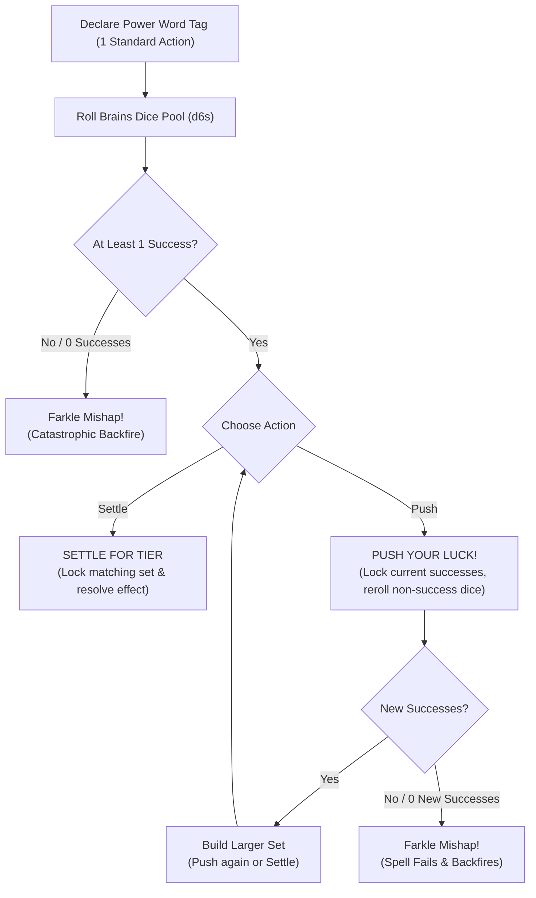

### Prerequisites to Cast
To channel the unstable currents of magic, a **Goblin Boss** must meet two mechanical requirements:
1.  **Brains Level 3+:** You must possess at least **Brains 3** to unlock **Power Word Slots**. Characters with **Brains 1** or **Brains 2** have 0 slots and cannot cast magic.
2.  **Magical Conduit:** You must possess a magic-focused **Quirk** (such as *Weirdo*, *Bone-Speaker*, or *Shaman*) or wield an active magical **Oddity** (such as a runic staff, crystal skull, or channeling wand).

### Power Word Slots and Memorization
Goblins do not learn rigid spells; they memorize **Power Words** represented by narrative **Tags** (e.g. `[Fire]`, `[Sticky]`, `[Shock]`, `[Spooky]`, `[Slip]`):
*   **Brains Level 1–2:** 0 Power Word Slots (Cannot cast).
*   **Brains Level 3:** **2 Power Word Slots**.
*   **Brains Level 4:** **4 Power Word Slots**.
*   **Brains Level 5:** **6 Power Word Slots**.
*   **Tag Swapping:** Swapping prepared **Power Words** in your slots takes place strictly in the **Lair** during the **Lair Phase** (see [The Lair Loop & Progression](10_The_Lair_Loop_and_Progression.md)). A character can attune to any Tag accessible through personal **Quirks**, carried **Gear**, or **Lair Upgrades**.

---

## 2. The Casting Step-by-Step Procedure

Casting a spell costs **1 Standard Action**. When your **Goblin Boss** casts a spell, execute the following four steps:

### Step 1 — Declare Power Word
Announce the primary **Tag** being channeled from your memorized slots (e.g. `[Fire]`, `[Toxic]`, `[Teleport]`).

### Step 2 — Roll Brains Pool
Assemble a dice pool of **d6s** equal to your **Brains** attribute (plus any optional **Bangaranga Dice** drawn from the pool). Roll against the **Difficulty** set by the **GM** based on the target's resistance or environmental warding:
*   **Easy (4+):** 4, 5, 6 are successes.
*   **Normal (5+):** 5, 6 are successes.
*   **Hard (6):** Only 6s are successes.

>> **RULE: Exploding 6s in Magic**
>> Any **6** rolled on a regular die counts as 1 success and explodes, immediately adding +1 regular die to your un-locked pool. Any **6** rolled on a **Bangaranga Die** explodes twice (+2 regular dice).

### Step 3 — Lock and Push
To maintain the spell, the roll must generate at least **one (1) success**:
*   **Settle:** You choose to stop rolling. Immediately resolve the spell's effect based on your current locked successes.
*   **Push:** You lock all current success dice and reroll all remaining non-success dice to hunt for matching faces and build higher-tier sets.

### Step 4 — The Farkle (Mishap)
If you choose to **Push** your luck and a reroll yields **zero (0) new successes**, the spell collapses into a **Farkle**. The casting fails completely, no spell effect is produced, and you must immediately roll on the **Spell Mishap** table corresponding to the spell's category.

---

## 3. Resolving Spell Tiers and Potency

The mechanical potency and area of effect of a spell are determined strictly by the size of the **largest matching set of success dice** (e.g. two 5s, three 6s, four 4s).

| Matching Set Size | Spell Tier | Delivery Footprint & Impact |
| :--- | :--- | :--- |
| **Single Success (No Pairs)** | **T1 (Minor)** | Touch / Melee (1 Success / 1 Damage) |
| **Pair (2-of-a-kind)** | **T2 (Standard)** | Ranged 1 Zone (2 Successes / 2 Damage) |
| **Triple (3-of-a-kind)** | **T3 (Heroic)** | Zone-Wide Area (3 Successes / 3 Damage) |
| **Quadruple (4-of-a-kind)** | **T4 (Blast)** | Multi-Zone Blast (4 Successes / 4 Damage) |
| **Quintuple (5-of-a-kind)** | **T5 (Legendary)** | Map-Wide Reality Warp / Annihilation |

### The Five Spell Tiers
*   **T1 Effect (Single Success, No Pairs):** Minor or niche manifestation. Inflicts 1 Grit/Size damage or grants +1 Success to an immediate physical action. Range: Touch / Melee.
*   **T2 Effect (Pair / 2-of-a-kind):** Standard tactical magic. Inflicts 2 Grit/Size damage or applies a sustained condition to 1 target. Range: Ranged (1 Zone).
*   **T3 Effect (Triple / 3-of-a-kind):** Heroic area magic. Inflicts 3 Grit/Size damage or applies a persistent condition across an entire **Zone**. Range: Zone-Wide.
*   **T4 Effect (Quadruple / 4-of-a-kind):** Destructive blast magic. Inflicts 4 Grit/Size damage or applies severe environmental hazards across the target Zone and all adjacent Zones. Range: Blast Area.
*   **T5 Effect (Quintuple / 5-of-a-kind):** Legendary encounter-scale catastrophe. Wipes out standard enemy swarms, collapses large structures, or permanently alters the battlefield topology.

### Potency (Singleton Successes)
If you roll multiple successes that do not form matching pairs (for example, rolling `[4, 5, 6]` on an Easy 4+ test), the spell resolves as a **T1 Effect**. However, every success beyond the first provides **Potency**. For each point of Potency, choose one:
*   **Extra Target:** Strike 1 additional enemy in the delivery area.
*   **Bonus Magnitude:** Add **+1 Damage** (against Grit or Mob health dice) or **+1 Success** to the spell's resolution.

> **Example:** A caster with **Brains 5** casts `[Shock]` against a **5+** profile.
> *   **First Roll:** `[5, 5, 3, 2, 1]` -> The caster locks the two `5`s (a pair -> **T2 Effect**).
> *   **The Push:** The caster wants a zone-wide lightning blast. The two `5`s remain locked, and the caster rerolls the `[3, 2, 1]`.
> *   **Second Roll:** `[5, 6, 2]` -> The roll yields a new `5` and an exploding `6`. The caster locks both. The pool now contains three `5`s (a triple -> **T3 Effect**) plus one singleton `6` (providing **1 Potency**).
> *   **Final Resolution:** The caster stops. The spell unleashes a **T3 Zone-Wide** shockwave dealing 3 damage to all enemies in the target Zone, plus +1 damage to the enemy commander from the Potency die.

---

## 4. Chaotic Leakage (Side Effects)

Channeling magical energy without precision causes raw power to bleed into the environment. Sets formed by **non-success dice** (dice faces falling below the success threshold) represent **Chaotic Leakage**:
*   **Pair of Non-Successes:** Triggers a **T2 Side Effect**.
*   **Triple of Non-Successes:** Triggers a **T3 Side Effect**.
*   **Quadruple+ of Non-Successes:** Triggers a **T4 Side Effect**.

>> **GOLDEN RULE: Hard Difficulty Volatility**
>> On **Hard (6)** casting tests, non-6 faces are non-successes. Hard casts naturally produce large non-success pools, making **Chaotic Leakage** almost guaranteed unless the caster takes the risk to **Push** and convert those non-successes into successes.

---

## 5. Standardized Mishap and Side Effect Tables

When resolving **Chaotic Leakage** or a **Farkle Mishap**, locate the table matching your **Power Word's** category:

### Category 1: Elemental & Physical
*(Tags: `[Fire]`, `[Sticky]`, `[Shock]`, `[Toxic]`, `[Acidic]`, `[Chilled]`, `[Slick]`)*

#### Elemental Side Effects (Leakage)
*   **T2 Leakage:** The element coats the floor in your **Zone**. All movement into or out of the **Zone** suffers a **Bane 1 (-1d)** until the end of the round.
*   **T3 Leakage:** Sudden backfire. The caster suffers the corresponding **T2 Condition** (e.g. **Weakened** from `[Toxic]`, **Restrained** from `[Sticky]`, or 1 fire damage from `[Fire]`).
*   **T4+ Leakage:** A wild elemental vortex engulfs your **Zone**. Every creature in the **Zone** (friend and foe) immediately loses **2 Grit** (or suffers 2 damage to Mob health dice).

#### Elemental Spell Mishap (Farkle)
*   **Mishap Outcome:** The spell detonates violently in your hands. The spell fails completely. The caster loses **2 Grit**, and the occupied **Zone** gains a permanent hazardous terrain tag matching the element (e.g. `[Burning]` or `[Toxic]`).

---

### Category 2: Mental & Social
*(Tags: `[Spooky]`, `[Loud]`, `[Confusing]`, `[Angelic]`, `[Vile]`, `[Soporific]`)*

#### Mental Side Effects (Leakage)
*   **T2 Leakage:** Sensory overload. Your eyes glow and you speak in overlapping whispers. You cannot issue verbal commands or coordinate with your **Mob** until the end of your next turn.
*   **T3 Leakage:** Psychic backlash. All allies in your **Zone** suffer a **Bane 1 (-1d)** on their next action test.
*   **T4+ Leakage:** Mental fracture. The caster gains the **Terrified** or **Dumb** condition, fleeing from the nearest ally or enemy for 1 round.

#### Mental Spell Mishap (Farkle)
*   **Mishap Outcome:** Your mind snaps under magical pressure. The spell fails, you black out until the end of the round (suffering the **Stunned** condition), and you suffer a **Bane 1 (-1d)** to all **Brains** tests until resting in the **Lair**.

---

### Category 3: Movement & Spatial
*(Tags: `[Slip]`, `[Elastic]`, `[Teleport]`, `[Fast]`, `[Bouncy]`, `[Weightless]`)*

#### Movement Side Effects (Leakage)
*   **T2 Leakage:** Gravitational wobble. The caster is violently yanked 1 **Zone** in a random direction and falls **Prone**.
*   **T3 Leakage:** Spatial swap. The caster and a random creature (friend or foe) in the same or adjacent **Zone** instantly swap physical positions.
*   **T4+ Leakage:** Dimensional phase. The caster becomes partially detached from reality, suffering a **Bane 1 (-1d)** on all physical tests (**Tough** and **Slink**) until combat ends.

#### Movement Spell Mishap (Farkle)
*   **Mishap Outcome:** Catastrophic kinetic ejection. The spell fails. You are hurled through the air into an adjacent **Zone**, take **2 Grit Damage** from the physical impact, drop all carried hand gear, and land **Prone**.

---

## 6. Bangaranga Integration in Spellcasting

A spellcaster can tap the communal **Bangaranga Pool** (see [Core Resolution](01_Core_Resolution.md)) to supercharge their magical channeling:
*   **Drawing Dice:** Before rolling **Step 2**, you may take a number of **Bangaranga Dice** up to your **Goblin Boss's** **Grunt** attribute and add them to your **Brains** casting pool.
*   **The Bangaranga Tax:** If the number of Bangaranga dice taken exceeds the test's **Target Number (TN)**, **1 extra die** must be removed from the pool and discarded back to the box as a tax.
*   **Double Explosions:** Every **6** rolled on a **Bangaranga Die** counts as a success and **explodes twice**, immediately granting two additional regular dice to the casting pool.
*   **Overreaching & Drain Risk:**
    *   If a spell that used Bangaranga dice fails or suffers a **Farkle**, the caster loses **1 Grunt**.
    *   If the failed roll contains any **1s** (even after pushing luck), the **Bangaranga Pool** is drained, immediately discarding dice equal to the number of Bangaranga dice taken.

---

## 7. Ritual Casting Mechanics

Ritual Magic represents extended, cooperative spellcasting used for monumental supernatural feats: purifying **`[Cursed]`** or **`[Bonded]`** oddities, warding the **Lair**, erecting permanent elemental barriers, or crafting magical artifacts.

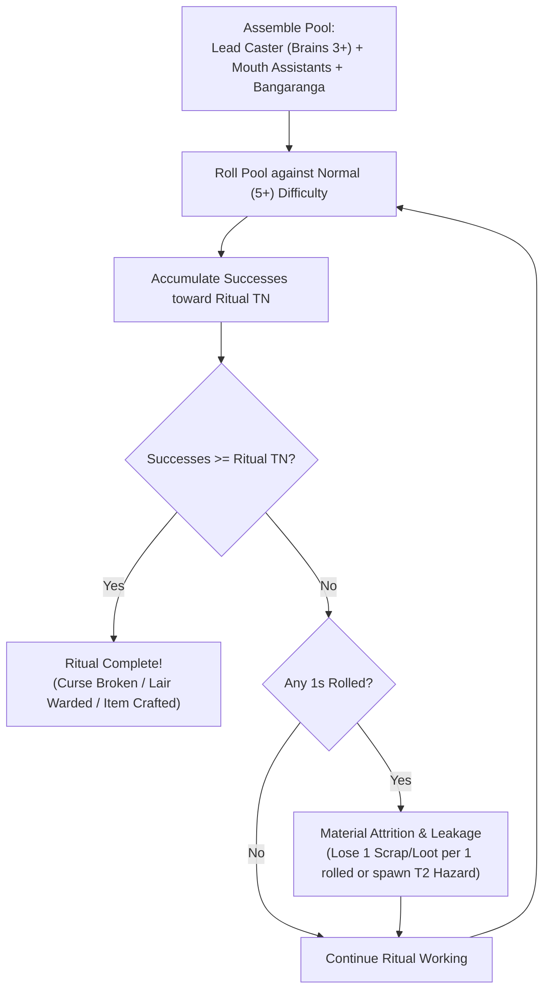

### Ritual Parameters
*   **Time & Scale:** A ritual requires **1 Lair Phase Turn** in the **Lair** (or 3 consecutive, uninterrupted combat rounds during a raid).
*   **Lead Caster:** Must possess **Brains 3+** and the relevant **Power Word** Tag.
*   **Assistants:** Up to a number of goblins equal to the Lead Caster's **Mouth** stat may assist. Each assistant contributes **+1d** to the ritual pool.
*   **Communal Fuel:** The Lead Caster may draw up to their **Grunt** in **Bangaranga Dice** to fuel the ritual.

### Extended Accumulation Engine
Rituals do not use the single-round Farkle loop. Instead, the Lead Caster rolls the assembled pool against **Normal (5+)** difficulty, accumulating successes across steps toward a **Ritual Target Number**:
*   **Tier 3 Ritual (Cleansing Minor Curses / Basic Wards):** Requires **5 Accumulated Successes**.
*   **Tier 4 Ritual (Cleansing Bonded Relics / Fortress Wards):** Requires **8 Accumulated Successes**.
*   **Tier 5 Ritual (Major Reality Transmutation / Artifact Crafting):** Requires **12 Accumulated Successes**.

### Ritual Complications and Resource Attrition
Because rituals are grounded, stable workings, failing a single roll does not destroy accumulated successes:
*   **The Cost of Failure:** Every **1** rolled during a ritual step consumes extra resources: the party must immediately discard **1 Scrap** (or 1 Bulk of carried **Loot**) per 1 rolled, or suffer a **T2 Chaotic Leakage Hazard** in the ritual chamber.
*   **Interruption:** If the Lead Caster suffers unmitigated damage or gains the **Stunned** condition during the ritual, the working collapses, wasting all invested materials.

---

## 8. Tag Effect and Spell Structural Schema

[CONTENT EXTENSION POINT: Magic Spells & Tag Effects]

All modular tag effects, living spell compendiums, and grimoire expansions must follow this formal structural schema:

```markdown
### [Spell / Tag Power Name]
*   **Primary Tag:** `[Tag Name]` (e.g. `[Fire]`, `[Sticky]`, `[Shock]`, `[Spooky]`, `[Slip]`)
*   **Tag Category:** [Elemental / Physical | Mental / Social | Movement / Spatial | Metaphysical]
*   **Delivery Type:** [Personal | Touch / Melee | Ranged (1–3 Zones) | Zone-Wide | Blast]
*   **Bangaranga / Action Cost:** 1 Standard Action (Optional: Draw up to Grunt in Bangaranga Dice)
*   **Target Profile:** GM-set Difficulty (Easy 4+, Normal 5+, Hard 6) vs Target / Environment
*   **Effect by Tier:**
    *   **T1 (Single Success):** [Minor/Niche effect, +1 Success on attack OR 1 Grit/Size damage; Potency options]
    *   **T2 (Pair / 2-of-a-kind):** [Standard effect, +2 Successes OR 2 Grit/Size damage; Sustained condition]
    *   **T3 (Triple / 3-of-a-kind):** [Heroic / Zone-wide effect, +3 Successes OR 3 Grit/Size damage; Persistent condition]
    *   **T4 (Quadruple / 4-of-a-kind):** [Destructive / Blast effect, +4 Successes OR 4 Grit/Size damage; Encounter condition]
    *   **T5 (Quintuple / 5-of-a-kind):** [Legendary / Encounter-scale effect; Instant defeat OR permanent reality warp]
*   **Chaotic Leakage (Side Effects):**
    *   *Pair of Non-Successes (T2):* [Minor zone hazard, temporary Bane, or positioning wobble]
    *   *Triple of Non-Successes (T3):* [Dangerous self-inflicted condition, friendly Bane, or spatial warp]
    *   *Quadruple+ of Non-Successes (T4+):* [Zone-wide damage, severe condition, or dimensional fracture]
*   **Farkle / Mishap Outcome:** [Catastrophic consequence triggered when a push yields zero new successes]
*   **Element Synthesis Hooks:** [Predefined synergies when combined with other tags, e.g. `[Tag]` + `[Other]` -> Result]
```

---

## 9. Mechanical Gaps and System Clarifications

[MISSING RULE / GAP: Power Word slot progression is strictly bound to Brains Level 3+ (Level 3 = 2 slots, Level 4 = 4 slots, Level 5 = 6 slots). Any early draft reference to Brains 2 granting Power Word slots is deprecated; Brains 1 and 2 characters possess 0 slots and cannot cast magic.]

[MISSING RULE / GAP: Ritual casting mechanics were previously absent from stage drafts despite multiple references to cleansing curses and warding lairs. The extended cooperative accumulation engine (Lead Caster + Assistants + Bangaranga vs TN 5/8/12) is the authoritative rule for non-combat extended magic.]

---

<a id="doc-11"></a>
<!-- ============================================================ -->
<!-- DOCUMENT 11: 02_PROD_Core_Rules/09_The_Raid_Loop.md -->
<!-- ============================================================ -->
# The_Raid_Loop
*Source: `02_PROD_Core_Rules/09_The_Raid_Loop.md`*

# The Raid Loop & Economy

*A goblin without a plan gets squashed. A goblin with a plan gets squashed while carrying something shiny. The raid is the lifeblood of the Warren—a high-stakes smash-and-grab where Bosses lead their Mobs into hostile territory to plunder riches, smash infrastructure, and haul back enough scrap to keep the Lair growing.*

---

## 1. The Four Raid Phases

Every raid operates within a continuous four-phase loop that structures the transition from the **Lair** to the target site and back again:

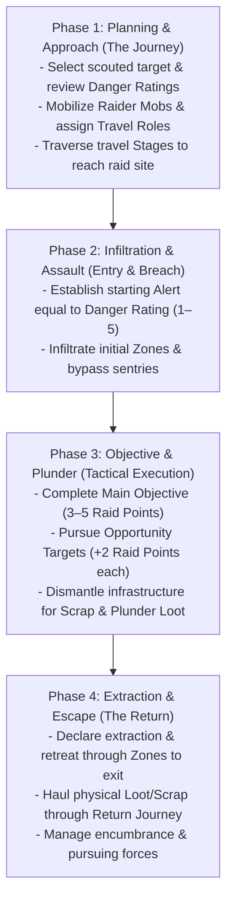

### Phase 1: Planning & Approach
Before leaving the **Lair**, you select a scouted target, inspect the known **Base Danger Rating** and **Objectives**, allocate **Raider Mobs** from the communal **Gobbo Pool** (up to your Boss's **Grunt** limit), and assign the four **Travel Roles**. The party then traverses wilderness or subterranean **Stages** as detailed in [Journeys & Hazards](11_Journeys_and_Hazards.md).

### Phase 2: Infiltration & Assault
The party breaches the target perimeter. The **GM** sets the location's starting **Alert** track equal to its **Base Danger Rating** (1 to 5). You navigate connected **Zones**, defeat sentries, bypass obstacles, and work to keep **Alert** low before sounding alarms.

### Phase 3: Objective & Plunder
The party executes tactical combat and exploration actions in the target **Zones**. You secure the **Main Objective** (worth 3–5 **Raid Points**), seek optional **Targets of Opportunity** (worth +2 **Raid Points** each), dismantle heavy machinery or architecture for **Scrap**, and spend **Plunder** **Standard Actions** to gather loose **Loot** and **Oddities**.

### Phase 4: Extraction & Escape
Once objectives are secured, or when **Alert** escalates to lethal levels, the party declares **Extraction**. You must haul all gathered physical **Loot**, **Scrap**, and **Oddities** back through the perimeter to the exit, managing encumbrance penalties and fighting off pursuers before resolving the return journey.

---

## 2. The Raid Economy

The **Gobbos** economy operates without fractional coinage or coin-counting math. Wealth and progress are measured across five standardized systemic resources:

| Resource | Scope | Acquisition Method | Primary Mechanical Function |
| :--- | :--- | :--- | :--- |
| **Loot Value (LV)** | Liquid Wealth | Plundered as physical items during raids | Smelted via Rule of Five; buys equipment, hires specialists, expands Lair facilities. |
| **Scrap** | Building Matter | Harvested from broken infrastructure and salvage | Constructs facility chassis, expands rooms, and provides base weapon materials. |
| **Infamy Marks** | Gang Level | Contributed Loot (10 LV = 1 Mark) or Agendas | Determines Gang Infamy (1–5), Successor starting XP, and equipped Gang Quirks. |
| **Raid Points (Glory)** | Shared Renown | Completing Main and Opportunity Objectives | Pooled at raid end; converts into shared **Boss XP** during Homecoming. |
| **Boss XP** | Personal Power | Pooled Raid Points, Personal Glory, Successor pools | Spent during downtime to advance **Main Stats** (**Tough**, **Slink**, **Brains**, **Mouth**). |

---

## 3. Loot Value & The Exponential Scale

All treasure plundered from a raid belongs to a **Quality Tier (T1–T5)** and possesses a **Loot Value (LV)** representing its concentrated material worth.

### The 5-to-1 Tier Ladder
Each tier represents an exponential **5-to-1 step** in value. Lower-tier items cannot bypass higher-tier economy gates without combining them in groups of five:

| Tier | Category & Quality | Single Unit Value | Typical Raid Plunder |
| :---: | :--- | :--- | :--- |
| **T1** | **Junk & Pocket Scrap** | 1x T1 | Brass buttons, bent iron nails, tin mugs, loose teeth. |
| **T2** | **Scrappy Plunder** | 5x T1 (1x T2) | Silver cutlery, iron shivs, copper kettles, crude pewter rings. |
| **T3** | **Standard Fine Treasure** | 25x T1 (5x T2 / 1x T3) | Gold banquet chalices, guard broadswords, bolts of fine silk. |
| **T4** | **Superior Masterwork** | 125x T1 (5x T3 / 1x T4) | Dwarven rune-hammers, jeweled altar idols, black pearl necklaces. |
| **T5** | **Legendary Mythic Relic** | 625x T1 (5x T4 / 1x T5) | Dragon skull trophies, intact godstone shards, astral astrolabes. |

### Multi-Unit Treasures & Hoards
Massive treasures possess a **Loot Value** greater than 1 of their Tier:
* A stolen **Alabaster Sarcophagus** might be valued at **4x T4**.
* Under the exponential scale, that single sarcophagus is worth:
  **4x T4** = **20x T3** = **100x T2** = **500x T1**
* This scale prevents hoarding loose Junk (T1) from trivializing high-tier economic purchases without physical smelting.

---

## 4. The Rule of Five: Smelting & Barter

During the **Lair Phase** (downtime between raids), you can combine, melt down, or break apart plunder using the **Rule of Five**:

1. **Trading Up (Smelting / Combining):** You combine **5 tokens of Tier X** into **1 token of Tier X+1**.
   * *Example:* 5x T2 silver goblets melt down into 1x T3 gold ingot.
2. **Trading Down (Breaking Down / Pawning):** You break down **1 token of Tier X+1** into **5 tokens of Tier X**.
   * *Example:* 1x T4 masterwork brooch trades down into 5x T3 trade bars.

>> **THE RULE OF FIVE RESTRICTION:**
>> Smelting upward requires exact multiples of five. Non-multiples of five cannot be traded up to the next tier until additional matching tokens are acquired.

---

## 5. Scrap Generation & Conversion

**Scrap** is abstract structural building matter (reclaimed iron plates, oak beams, lead pipes, chains, and masonry) required to construct Lair facilities, build defenses, and form custom weapon chassis.

### Generating Scrap
1. **Dismantling Infrastructure:** During a raid, a **Goblin Boss** or **Mob** can spend a **Standard Action** (**Manipulate** or **Attack**) to dismantle environmental objects (iron doors, portcullises, chandeliers, ballistas). A successful **Tough 5+/1** or **Brains 5+/1** test extracts **1d6 Scrap** (or the object's listed yield) into the party's carry load.
2. **Salvage Yields:** Plundered items with high structural bulk can be smelted down in the Lair. Dismantling a plundered item yields its listed **Scrap Yield** into the **Communal Hoard**.
3. **Passive Lair Yields:** Dedicated Lair facilities (such as the Junkyard Sifter or Scrap Forge) generate passive **Scrap** each **Lair Turn**.

---

## 6. Carry Capacity & Tactical Encumbrance

Greed has physical weight. All weapons, armor, tools, and plunder possess a **Bulk** rating (0 to 4+). 

### Goblin Boss Carry Capacity
Your unburdened **Carry** capacity is derived from your **Tough** stat:

**Carry Capacity** = **4 + (2 x Tough) Bulk**

| Tough Stat | Unburdened Carry | Over-Laden Threshold | Dragging Limit (2x Carry) |
| :---: | :---: | :---: | :---: |
| **Level 1** | **6 Bulk** | 7–7 Bulk | 12 Bulk |
| **Level 2** | **8 Bulk** | 9–10 Bulk | 16 Bulk |
| **Level 3** | **10 Bulk** | 11–13 Bulk | 20 Bulk |
| **Level 4** | **12 Bulk** | 13–16 Bulk | 24 Bulk |
| **Level 5** | **14 Bulk** | 15–19 Bulk | 28 Bulk |

### Load States & Penalties
Total the **Bulk** of all carried weapons, armor, gear, and plunder to determine your current **Load State**:

* **Unburdened (<= Carry):** Standard **Movement** speed (in Zones per **Move** action); zero test penalties; full access to all standard actions and reactions.
* **Over-Laden (Carry + 1 to Carry + Tough):** **-1 Zone** per **Move** action (minimum 1 Zone); **Bane 1 (-1d)** on all physical **Slink** and **Tough** tests; you cannot perform two **Move** actions in the same round.
* **Dragging (Carry + Tough + 1 to 2x Carry):** Fixed at **1 Zone** per **Move** action; auto-fails all stealth and jumping tests; requires **two hands**; you cannot attack with weapons and cannot perform **Dodge** or **Parry** **Reactions** (0 active defense).
* **Immobilized (> 2x Carry):** **0 Zones** movement speed; you cannot move and must drop carried items as a **Free Action** to regain mobility.

### The Bulk 3+ Item Rule
Items of **Bulk 3 or higher** (iron safes, great cauldrons, stone statues, heavy kegs) represent awkward, heavy loads:
* **Two Hands Required:** Hauling a loose Bulk 3+ item occupies two hands. You cannot wield a weapon, hold a shield, or cast somatic spells while carrying it.
* **No Disengage:** You cannot perform a **Disengage** action while holding a Bulk 3+ item. You must drop the item as a **Free Action** to disengage, defeat adjacent enemies, or take Opportunity Attacks.
* **Boss Hauling Limit:** A **Goblin Boss** can haul at most Tough / 2 (rounded down, minimum 1) loose Bulk 3+ items at one time.

### Mob Carry Limits & Casualties
* **Unburdened Mob Limit:** A **Mob** carries up to **Size x 4 Bulk** with normal movement and no penalties.
* **Dragging Mob Limit:** A **Mob** can drag up to **Size x 5 Bulk** (movement fixed at 1 Zone per **Move** action; cannot execute the reactive **Scatter!** order).
* **Mob Combat Penalty:** Every loose object of **Bulk 3+** carried by a **Mob** imposes **Bane 1 (-1d)** on that **Mob's** attack rolls. A **Mob** can carry a maximum number of Bulk 3+ items equal to its current **Size**.
* **Casualty Drops:** When a **Mob** takes damage that reduces its **Size**, its carry capacity shrinks immediately. The controlling **Goblin Boss** must **immediately declare which Loot items are dropped** in the current **Zone** to meet the new capacity ceiling. Picking dropped items back up requires spending a **Plunder** **Standard Action** per item.

---

## 7. Danger Scaling, Scouting & Alert

Raids scale dynamically based on site danger and the party's operational profile.

### Base Danger Rating (1 to 5)
Every raid target has a **Base Danger Rating** (T1 to T5) that sets its starting **Alert** level, baseline environmental hazard profiles, and enemy strength.

### Scouting the Target
During the Labor step of the **Lair Phase**, players allocate **Laborer Dice** to survey a target site. Roll the allocated pool against **4+**:

* **0 Successes (Blind Entry):** The location exists, but the party knows nothing. The party suffers a **Bane 1 (-1d)** on their first Zone entry test during the raid.
* **1 Success:** Reveals the **Base Danger Rating** and the **Main Objective** (worth 3–5 **Raid Points**).
* **2 Successes:** In addition to the above, reveals 1 **Target of Opportunity** (worth +2 **Raid Points**).
* **3+ Successes:** In addition to the above, reveals 2 **Targets of Opportunity** (+4 **Raid Points** total) and a **Secret Bypass** (grants the party a **Boon 1 (+1d)** on their first Zone entry test).

### The Alert Track
The **GM** tracks the raid location's active **Alert** (starting equal to the **Base Danger Rating**):
* **Alert Check Triggers:** The **GM** rolls **1d6** whenever the party enters a new **Zone**, completes a **Target of Opportunity**, or takes a rest round.
* **Resolution:**
  * If the roll is **strictly greater** than current **Alert**: The party remains undetected.
  * If the roll is **less than or equal to** current **Alert**: A complication triggers (reinforcements arrive, alarms sound, or traps arm), and **Alert** permanently increases by **+1**.

---

## 8. Post-Raid Reckoning & Payout

When the party extracts safely back to the **Lair**, rewards are tallied across three separate tracks:

### 1. Communal Glory to Shared Boss XP
All **Raid Points** earned by the party from completing objectives are pooled and converted into shared **Boss XP**:

| Pooled Raid Points | Shared Boss XP Awarded | Raid Reputation |
| :---: | :---: | :--- |
| **1–4 Points** | **0 XP** | Failure. The horde throws mud at the returning raiders. |
| **5–9 Points** | **1 XP** | Decent raid. The horde acknowledges the plunder. |
| **10+ Points** | **2 XP** | Legendary triumph! A feast is held in your honor. |

### 2. Personal Glory (+1 XP)
A **Goblin Boss** earns **+1 Personal Glory** (maximum 1 per raid, converting to **+1 XP** during Homecoming) by fulfilling at least one of these chaotic acts:
* **The Compulsion:** Voluntarily trigger your Gang's **Shenanigan** compulsion in an disadvantageous tactical situation, causing a complication and adding a die to the communal **Bangaranga Pool**.
* **The Sacrifice:** Completely destroy a custom gear item by declaring an **Overclock**.
* **The Tyrant:** Use the **Assert Dominance** action (attacking a **Mob** under your command) to regain **Grunt** in combat.
* **The Martyr:** Roll a **Fumble** or trigger **Overreaching** when rolling dice, yet survive the raid.

### 3. Communal Hoard Deposit vs. Private Gang Hoard
* **Communal Hoard:** All standard **Loot Value** and **Scrap** gathered by the party is deposited into the **Communal Hoard**. Contributing 10 **Loot Value** to the Communal Hoard earns your Gang **1 Infamy Mark**.
* **Oddity Drafting:** Rare **Oddities** extracted from the raid are placed on the table and distributed by **Player Consensus**. If an **Oddity** was physically carried out by a specific **Mob**, that **Mob's** controlling Gang holds **First Pick** rights.

---

## 9. Loot & Salvage Structural Schema

Every plundered treasure, scrap cache, or harvested monster oddity is defined by the following structural template:

```markdown
### [Item Name]
- **Category:** [Pocket Scrap | Scrappy Plunder | Fine Treasure | Masterwork | Mythic Relic | Oddity | Chassis | Consumable]
- **Quality Tier:** [T1 Junk | T2 Scrappy | T3 Standard | T4 Superior | T5 Legendary]
- **Bulk:** [0 | 1 | 2 | 3 | 4+]
- **Loot Value (LV):** [Quantity of Tier units, e.g. 1x T1, 1x T2, 3x T3, 1x T5]
- **Scrap Yield:** [Quantity of Scrap recovered if dismantled in Lair]
- **Divisibility:** [Divisible | Indivisible]
- **Special Utility / Crafting Tag:** [Attached Oddity (Tier/Bite), Weapon/Armor Tag, or Blueprint schematic]
- **Description:** [Brief physical Tier B/C description]
```

### Reference Plunder Instances

#### Bent Brass Nails
- **Category:** Pocket Scrap
- **Quality Tier:** T1 Junk
- **Bulk:** 0
- **Loot Value (LV):** 1x T1
- **Scrap Yield:** 1 Scrap
- **Divisibility:** Divisible
- **Special Utility / Crafting Tag:** None
- **Description:** *A pocketful of bent, tarnished brass nails pried from floorboards.*

#### Gilded Silver Chalice
- **Category:** Fine Treasure
- **Quality Tier:** T3 Standard
- **Bulk:** 1
- **Loot Value (LV):** 1x T3
- **Scrap Yield:** 2 Scrap
- **Divisibility:** Indivisible
- **Special Utility / Crafting Tag:** None
- **Description:** *A heavy silver banquet cup lined with gold filigree and small garnet beads.*

#### Flame Drake Bile Gland
- **Category:** Oddity
- **Quality Tier:** T4 Superior
- **Bulk:** 2
- **Loot Value (LV):** 1x T4
- **Scrap Yield:** 0 Scrap
- **Divisibility:** Indivisible
- **Special Utility / Crafting Tag:** [Fire] (Tier 4, Bite 3, [Searing] Tag)
- **Description:** *A pulsating, smoking organ harvested from a drake carcass. Warm to the touch.*

---

## Content Extension Point

[CONTENT EXTENSION POINT: Loot & Salvage Items]

All future compendiums of treasures, trade goods, monster harvest oddities, relics, and scrap caches must implement the Loot & Salvage Structural Schema defined above, respecting Quality Tiers (T1–T5), Bulk encumbrance rules, and Scrap yields.

---

## Mechanical Gaps & Unresolved Systems

[MISSING RULE / GAP: Economy Currency Normalization & Tiered Conversion]
*   **Description:** Stage drafts define Loot Value on a 5-to-1 exponential scale (T1–T5), but Lair construction rules list flat costs like "10 Loot, 15 Scrap" and Gang progression awards 1 Infamy Mark per "10 Loot Value" contributed. If a single T5 Relic equals 6,250 T1 units, depositing one T5 item would grant 625 Infamy Marks, instantly maxing Gang Infamy 40 times over.
*   **Why it is needed:** The macro progression and Lair construction loops collapse into hyper-inflation or complete ambiguity if currency tiers are not strictly normalized.
*   **Suggested Resolution:**
    1. Define all flat Lair construction costs in matching Tier tokens (e.g., Tier 2 rooms cost T2 tokens, Tier 3 rooms cost T3 tokens).
    2. Normalize Infamy Mark generation to require 10x T1 for Infamy 1, 10x T2 for Infamy 2, 10x T3 for Infamy 3, 10x T4 for Infamy 4, and 10x T5 for Infamy 5.

[MISSING RULE / GAP: Codified Extraction Phase & Chase Mechanics]
*   **Description:** While Journey rules handle travel to and from the site, there is no formal mechanical procedure for the transition between dungeon combat/plunder and extraction. If Alert reaches 4 or 5, there are no rules for whether enemies chase the party into the return journey, or how players disengage from the dungeon node to start return stages.
*   **Why it is needed:** The "Extraction & Escape" phase is one of the four core raid pillars, but currently lacks dedicated evasion mechanics.
*   **Suggested Resolution:** Define the Extraction Trigger: Once the party declares Extraction, each Zone between their current location and the entrance must be traversed. If Alert is 4+, each exit transition triggers an immediate Slink 5+/1 evasion test; failure inflicts 1 Attrition damage on all Mobs and carries +1 Alert into the Return Journey.

[MISSING RULE / GAP: Private Gang Hoard vs. Communal Hoard Economy]
*   **Description:** The Skim Downtime Action allows a Boss to secretly divert Loot into the Gang's Private Hoard. However, the rules never define what a Gang's Private Hoard can be spent on versus the Communal Hoard, or whether Private Hoard wealth counts toward Infamy Marks.
*   **Why it is needed:** Without distinct mechanical uses (e.g. purchasing personal gear without table consensus, bribing Elders for personal perks, or buying unshared Mob upgrades), the Skim action has no tactical purpose.
*   **Suggested Resolution:** Clarify that the Communal Hoard is spent strictly by group consensus for Lair upgrades and shared outfitting, while a Gang's Private Hoard is spent exclusively by that player to purchase personal gear, bribe Elders, or buy personal Mob equipment. Wealth in the Private Hoard only grants Infamy Marks when deposited into the Communal Hoard.

---

<a id="doc-12"></a>
<!-- ============================================================ -->
<!-- DOCUMENT 12: 02_PROD_Core_Rules/10_The_Lair_Loop_and_Progression.md -->
<!-- ============================================================ -->
# The_Lair_Loop_and_Progression
*Source: `02_PROD_Core_Rules/10_The_Lair_Loop_and_Progression.md`*

# The Lair Loop & Progression

*A single goblin dies in the mud, forgotten. A Warren of goblins builds an underground empire of rusted iron, stolen treasure, and smoking workshops. The Lair is the communal sanctuary where plunder is smelted, wild beasts are tamed, and the next generation of Bosses rises from the muck.*

---

## 1. The Lair Dashboard & Core Metrics

The **Lair** is the shared, cooperative base of operations managed by all players. The state of the settlement is tracked on the **Lair Sheet** across six core metrics:

| Metric | Category | Mechanical Scope |
| :--- | :--- | :--- |
| **1. Warren Tier & Capacity** | Settlement Scale | Tier 1 to 4; Max Active Assets = (Tier x 2) + 2 |
| **2. The Swarm (Gobbo Pool)** | Workforce Pool | Total population in d6s; split between Raider Mobs & Laborer Dice |
| **3. The Communal Hoard** | Shared Capital | Pooled Loot Value (liquid wealth) & Scrap (building matter) |
| **4. Swarm Mood** | Morale & Discipline | 0–5 Morale Track; Mob Mutiny triggers at Level 5 |
| **5. Threat Level** | Regional Heat | 0–5 Heat Track; Retaliatory Lair Assault triggers at Level 5 |
| **6. The Bone Pile** | Ancestral Legacy | Skull Tally; unlocks permanent Ancestral Boons every 4 Skulls |

### Warren Tier & Asset Capacity
**Warren Tier** measures the overall physical scale, engineering complexity, and regional renown of the goblin settlement:

* **Tier 1: Ragtag Mob Camp** (Hidden hovels, squatter dens under ruins; Max **4** Active Assets).
* **Tier 2: Fortified Warren** (Recognized regional hazard, reinforced palisades; Max **6** Active Assets).
* **Tier 3: Subterranean Stronghold** (Sprawling underground cavern network, heavy industry; Max **8** Active Assets).
* **Tier 4: Goblin Under-Kingdom** (Legendary subterranean fortress commanding regional outposts; Max **10** Active Assets).

**Asset Capacity** = (**Warren Tier** x 2) + 2

>> **THE ASSET CAPACITY CEILING:**
>> A Lair can only maintain a maximum number of **Active Assets** equal to (**Warren Tier** x 2) + 2. If the Lair exceeds this ceiling, the settlement suffers from overcrowding and structural strain: **Swarm Mood increases by +1 at the start of every Lair Turn for each asset over the cap.**

---

### The Gobbo Pool (Workforce)
The Lair's total goblin population is tracked as a communal dice pool: **The Gobbo Pool** (measured in **d6s**).

* **The Workforce Division:** At the start of each **Lair Turn**, players divide the **Gobbo Pool** into two groups:
  1. **Raider Mobs:** Dice assigned to **Bosses** (up to each Boss's **Grunt** limit) to form tactical **Mobs** for raids.
  2. **Laborer Dice:** Dice remaining in the Lair to perform scavenging, excavation, recruitment, and crafting operations.
* **Mob Survival & Auto-Heal:** If a Raider **Mob** returns from a raid with at least 1 health point on at least one health die (**Size** >= 1), it immediately **auto-heals back to its full allocated Size** for free during Step 1 (Homecoming).
* **Casualty Elimination:** If a **Mob** is reduced to **Size 0** (all health dice lost), those dice are permanently removed from the **Gobbo Pool**.
* **The Communal Runts Floor:** The Lair always maintains a baseline floor of **3d6 communal runts**. These runts cannot perform heavy labor or be assigned as Laborer Dice, but they guarantee that each **Player** can always lead at least a **Size 1 Runt Mob (1d6)** on a raid, even after a catastrophic wipe.
* **Vacant Nest Growth:** During Step 1 (Homecoming), if the total **Gobbo Pool** falls below **3d6 per Player** (e.g., under 9d6 in a 3-player campaign), the Lair automatically gains **+1d6** to the **Gobbo Pool** for free as wild runts move into empty burrows.

---

### The Communal Hoard
The **Communal Hoard** stores shared capital brought back from raids:
* **Loot Value (LV):** Liquid wealth (coins, gems, jewelry, fine mechanisms) used to fund Lair room construction, bribe troops, hire specialists, and purchase equipment.
* **Scrap:** Physical building material (rusted iron plates, oak timber, lead pipes, chains) used to construct facilities, clear excavations, and assemble weapon chassis.

---

### Threat Level (The Regional Heat Clock)
**Threat Level** is a track rated from **0 to 5** representing regional awareness and organized military response:

* **0–1 (Quiet):** The outside world considers the Lair minor vermin.
* **2–3 (Guarded):** Local settlements double their sentries; regional dungeon nodes gain +1 hazard.
* **4 (Hunted):** Enemy scout parties comb the wilderness; Lair complications suffer a **Bane 1 (-1d)**.
* **5 (Retaliatory Assault!):** The enemy launches a direct assault against the Lair. Players must defend the base using their **Mobs** and defenses. Following the assault resolution, **Threat Level** resets to 2.

---

### Swarm Mood (Morale & Mutiny)
**Swarm Mood** is a track rated from **0 to 5** representing internal discipline, morale, and obedience:

* **0–1 (Eager):** Grunts are hyped; all **Players** add **+1 die** to the communal **Bangaranga Pool** at the start of the next raid.
* **2–3 (Grumbly):** Standard goblin squabbling; failed orders during combat trigger immediate morale checks.
* **4 (Restless):** Grunts demand extra grog; Labor recruitment tests suffer a **Bane 1 (-1d)**.
* **5 (Mob Mutiny!):** Grunts refuse to embark on raids without upfront bribes (**5 Loot** per **Mob**). Internal brawls lock one random Lair facility until mutiny is suppressed.

---

### The Bone Pile (Ancestral Legacy)
The **Bone Pile** is a sacred memorial containing the skulls of fallen **Bosses**:
* Every dead **Boss** adds **1 Skull** to the **Bone Pile** track.
* **Ancestral Boons:** Every **4 Skulls** marked unlocks a permanent, Lair-wide ancestral perk (e.g., *Ancestral Grudge:* +1d attack against the enemy faction responsible for the most Boss deaths; *Haunted Warrens:* invaders suffer **Bane 1 (-1d)** during Lair assaults).
* **Relic Harvesting:** A **Boss** may salvage a skull or bone from the **Bone Pile** to forge a unique **Relic** item.

---

## 2. The Four-Step Lair Phase Sequence

The **Lair Phase** resolves in a strict four-step procedure between raids:

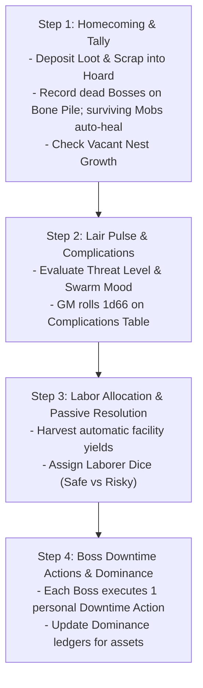

### Step 1: Homecoming & Tally
1. **Deposit Wealth:** Transfer all plundered **Loot Value** and **Scrap** into the **Communal Hoard**.
2. **Honour the Fallen:** Add deceased **Bosses** to the **Bone Pile**. Generate successor **Bosses** with starting **Successor XP** equal to **Gang Infamy x 4**.
3. **Regenerate Mobs:** Surviving **Mobs** (Size >= 1) restore all health dice to full allocated **Size**. Wiped **Mobs** are deleted from the pool.
4. **Vacant Nest Check:** If total **Gobbo Pool** is under 3d6 per player, add **+1d6** for free.

### Step 2: Lair Pulse & Complications
The **GM** rolls **1d66** on the **Lair Complications Table**:

| d66 | Event Name | Mechanical Resolution |
| :--- | :--- | :--- |
| **11–13** | **Tunnel Cave-In** | Lose **1d6 Scrap** from the Hoard, or assign 2 Laborer Dice to clear rubble. |
| **14–16** | **Squig Rampage** | A Boss must pass a **Tough 4+/1** test to subdue the beast, or lose **1d6 Runts** from the Gobbo Pool. |
| **21–23** | **Captive Breakout!** | All `[Person: Captive]` assets test escape: on a **1–2** on 1d6, they escape unless a Boss spends a Downtime Action to recapture them. |
| **24–26** | **Elder Tantrum** | Increase **Swarm Mood by +1** unless a Gang pays **5 Loot** from their private hoard to host a feast. |
| **31–33** | **Scout Probe** | Human or dwarven scouts spot smoke. Increase **Threat Level by +1** unless a Boss passes **Slink 4+/1** to silence them. |
| **34–36** | **Mushroom Rot** | Nursery mold rots food supplies. The Lair loses all passive recruitment yields this turn. |
| **41–43** | **Wandering Outcast** | A strange specialist visits the Lair. Pay **5 Loot** to recruit them as an active `[Ally]` asset. |
| **44–46** | **Turf Brawl** | Grunts riot over scrap. The two highest-Infamy Gangs lose 1 Mob health die or fight a Boss **Bar Brawl**. |
| **51–53** | **Stolen Cache** | A runt finds buried dungeon loot near the camp. Add **+2d6 Loot** (T1) to the Communal Hoard. |
| **54–56** | **Tribute Demand** | Rival warlords demand tribute. Pay **10 Loot** (T1) or increase **Threat Level by +2**. |
| **61–65** | **Smooth Operations** | The warren is humming. All active Labor tasks gain a **Boon 1 (+1d)** this turn. |
| **66** | **Ancestral Miracle!** | Green flames erupt from the Bone Pile. Add **+1 Skull** to the Bone Pile and reset **Swarm Mood to 0**. |

### Step 3: Labor Allocation & Operations
1. **Passive Harvest:** Collect automatic yields from active `[Facility]` and `[Outpost]` assets (e.g., Junkyard Sifter generating +2 Scrap).
2. **Workforce Allocation:** Assign available **Laborer Dice** to active projects:
   * **Scavenging Scrap:** Produces raw **Scrap** for the Hoard.
   * **Recruiting Runts:** Captures wild goblins to expand the **Gobbo Pool** permanently.
   * **Scouting Targets:** Surveys upcoming raid sites to reveal **Danger Ratings**, **Objectives**, and **Bypasses**.
   * **Excavating Projects:** Progresses construction thresholds for new facilities.

>> **THE LABOR RESOLUTION RULE: SAFE VS. PUSH**
>> When committing Laborer Dice to any labor task, players declare their work method:
>> * **Safe Labor (2 Dice):** Guarantees **1 automatic success**. No dice rolled; zero risk of injury.
>> * **Risky Push (1 Die):** Roll **1d6** against **4+** (6s explode). However, rolling a **1** triggers a workplace accident: the working runt is injured, placing that 1 die in the medical tent (unavailable for labor or raids for 1 Lair Turn).

### Step 4: Boss Downtime Actions
Each active **Goblin Boss** executes **one** personal Downtime Action:

* **The Pitch (Mouth Test):** Deliver an inspiring or terrifying speech. Pass a **Mouth 4+/1** test to reduce **Swarm Mood by 1**. *(Alternative: Spend 5 Loot from the Hoard to buy a round of rotgut grog, automatically reducing Swarm Mood by 1 with no roll).*
* **Laying Low (Slink Test):** Lead scouts into the surrounding wilderness to eliminate enemy patrols and erase tracks. Pass a **Slink 4+/1** test to reduce **Threat Level by 1**. *(Alternative: Spend 5 Loot to bribe local corrupt watchmen).*
* **Custom Crafting (Brains Test):** Operate a workshop to assemble, modify, or overclock weapons and armor using **Scrap** and **Oddities** (see [Combat Engine](05_Combat_Engine.md)).
* **The Skim (Slink Test):** Secretly divert wealth from the Communal Hoard into your **Gang's Private Hoard**. Pass a **Slink 4+/1** test to divert up to your **Slink** rating in **Loot Value**. If your roll contains any **1s**, you are caught: you receive 0 Loot and **Swarm Mood increases by +1**.
* **Bar Brawl / Power Play (Tough or Mouth Test):** Challenge a rival Gang's dominance over a Lair facility. Pass a **Tough 4+/1** (physical brawl) or **Mouth 4+/1** (screaming dominance) test to transfer 1 point of contribution on that asset's ledger from the defender to your Gang.
* **Beast Taming (Brains or Tough Test):** Break and train a captured beast. Pass a **Brains 4+/1** or **Tough 4+/1** test to attach a beast archetype tag (e.g., `[Wolf Mount]`, `[Squig Hound]`) to a commanded **Mob**.

---

## 3. The Modular Asset Framework & Dominance

Knowledge and infrastructure in the Lair are not an abstract tech tree. **Knowledge is held in living Persons, physical Facilities, Allies, and Blueprints.** If an asset is killed, destroyed, or lost, its capability is disabled immediately.

### The Four Asset Categories
1. `[Person]` **(Elders, Specialists, Captives):** Living experts.
   * *Elders:* Retired Level 6 Bosses. High loyalty, but frail (vulnerable to health complications).
   * *Specialists:* Hired non-goblin outcasts. Require weekly **Loot Upkeep**; leave if unpaid.
   * *Captives:* Enslaved enemies (Dwarves, Humans, Elves). Provide elite masterwork knowledge, but carry high **Flight Risk** and increase **Threat Level**.
2. `[Facility]` **(Workshops, Dens, Fortifications):** Physical structures built with **Loot** and **Scrap**.
3. `[Ally]` **(Befriended Monsters, Patron Factions):** External creatures living alongside the horde. Powerful, but demand food or cause social friction.
4. `[Blueprint]` **(Physical Schematics, Stolen Scrolls):** Fragile paper or stone schematics (Bulk 0). Destroyed if hit by fire or water complications.

### Core Asset Rules
* **The Non-Stacking Clause:** Identical mechanical boons from Lair assets do not stack. A **Mob** can only gain a maximum of **+1 passive Defense Die** from Lair assets, regardless of how many armories or martial Elders are present.
* **Loss of Knowledge:** Destroying or losing an asset immediately disables its associated capability until a replacement asset is secured.

---

### Dominance & Inter-Gang Politics
While the Lair belongs to all goblins, individual assets are controlled by specific Gangs through **Dominance**:

1. **The Contribution Ledger:** When constructing or upgrading an asset, players record the total **Loot**, **Scrap**, and **Laborer Dice** contributed by their specific Gang.
2. **Dominant Gang:** The Gang with the highest cumulative contribution holds **Dominance** over that asset.
3. **Disputed Status:** Tied contributions render an asset *Disputed* (no Gang gains the kickback) until one Gang contributes additional resources or wins a **Bar Brawl** Downtime Action.

#### Dominance Benefits
* **Renaming Rights:** The dominant Gang names the facility (e.g., *"Snikt's Exploding Forge"*).
* **Priority Access:** The dominant Gang acts first whenever facility use is contested.
* **Dominance Kickback:** The dominant Gang exclusively receives the asset's specific **Dominance Perk**.

---

### Outposts & Macro-Territory
Secured dungeon sites or regional structures (iron mines, ruined watchtowers, breweries) can be garrisoned as **Outposts**:

* **Garrison Cost:** Deduct **1d6** permanently from the **Gobbo Pool** to staff the outpost.
* **Passive Yield:** Generates a flat resource yield each **Lair Turn** (e.g., *Iron Mine: +4 Scrap; Brewery: -1 Swarm Mood*).
* **Supply Run Checks:** During Step 3, resolve shipment delivery:
  * *Safe Route:* Automatic delivery.
  * *Wild Route:* Roll **1d6**. On a **1**, bandits intercept the shipment (lose yield for this turn).
  * *Hostile Route:* Roll **2d6** against **4+**. Needs at least one success to deliver. Rolling all 1s means the Outpost is besieged and must be relieved in a raid.

---

## 4. Roguelite Generational Progression & Death

Death in **Gobbos** is a stepping stone to greater power. When a **Goblin Boss** dies, the player does not start from zero.

### The "Next Gobbo Up" (Successor Creation)
When a Boss dies, the next prominent goblin in the Gang takes command:
* **Starting Stats:** Successors start with **1** in all Main Stats, receive **2 starting advances** (standard character creation), plus a starting pool of **Successor XP**:
**Successor XP** = **Gang Infamy x 4**
* **Successor Caps:** A successor cannot raise any stat above **Level 4** at creation and cannot start as an **Elder** (Level 6).
* **The Catch-Up Boost:** A fresh successor receives **+2 bonus XP** on the first survived raid.

### Gang Marks (Tattoos of the Dead)
The successor honors the fallen predecessor by receiving a crude soot tattoo:
* The successor inherits **one Quirk or Twist** possessed by the deceased Boss.
* The successor **ignores all Stat and Tier requirements** for this inherited Quirk.
* This Quirk counts toward the Boss's limit of 3 personal Quirks.

### Named Items & Revenge Quests
When a Boss dies, the Boss's favored equipment absorbs that chaotic spirit and becomes a **Named Item**:
* **Imbued Boon:** The item gains a **T1 Boon** reflecting the deceased Boss's highest stat or cause of death.
* **Recovery:** If surviving goblins drag the item back to the Lair, the successor inherits it.
* **Enemy Wielders:** If the raid wipes and the item is lost, the enemy killer claims the weapon. The item can be reclaimed in future revenge raids.
* **Gang Rebellion:** Named items rebel if wielded by a rival Gang (e.g., treating all Criticals as Fumbles).

### Patron Saints of the Bone Pile
When creating a successor, the player may select one deceased Boss from the **Bone Pile** to adopt as a **Patron Saint**:
* **The Boon:** Grants a specific situational power related to how the Saint lived or died (e.g., *Saint Grugor: Ignore fire damage once per raid*).
* **The Behavioral Catch:** To maintain the boon, the Boss must follow the Saint's behavioral quirk (e.g., always choosing the loudest path, or never retreating).

### Retirement & Elders
When a Boss earns enough XP to raise any Main Stat to **Level 6**, the Boss automatically **Retires** from active raiding to become an **Elder**:
* **Elder of Tough:** Staffed at the Training Ring; grants **+1 passive Defense Die** (Armor) to all commanded friendly Mobs.
* **Elder of Slink:** Staffed at the Shadow Den; reduces trap **Target Numbers (TN)** by **1** (minimum 1) for the Gang.
* **Elder of Mouth:** Staffed at the Council Room; increases starting and maximum **Grunt** by **+1**, and allows rallying fleeing Mobs as a **Free Action** once per raid.
* **Elder of Brains:** Staffed at the Tinker Yard; enables installing **1 extra Oddity** on custom gear items.

---

## 5. Lair Room & Facility Structural Schema

Every constructible room, workshop, outpost, or living asset is defined by the following template:

```markdown
### [Asset Name]
- **Category / Type:** [Person: Elder | Person: Specialist | Person: Captive | Facility: Industry | Facility: Swarm | Facility: Beasts | Facility: Defense | Ally: Outcast | Blueprint]
- **Tier:** [Tier 1–4]
- **Construction Cost:** [X Base Loot, Y Base Scrap (or "None / Recruited / Discovered")]
- **Requirements & Prerequisites:** [Warren Tier X, Outpost / Mine required, or specific Elder staffed]
- **Upkeep:** [None | X Loot per Lair Turn | 1 Laborer Die per turn]
- **Passive Benefit (Boon):** [Exact mechanical modification or passive yield per Lair Turn]
- **Active Function / Crafting Station:** [Downtime Action enabled, Quality unlock, or Taming modifier]
- **Volatility & Cost (Bane / Catch):** [Complication trigger, flight risk, mutiny risk, or hazard]
- **Dominance Kickback:** [Exclusive mechanical perk granted to the Gang holding Dominance]
- **Upgrade Tiers:** [Path to upgrade to higher Tier and associated costs]
```

### Reference Facility Instances

#### The Scrap Forge
- **Category / Type:** Facility: Industry
- **Tier:** Tier 2
- **Construction Cost:** 10 Loot (T2), 15 Scrap
- **Requirements & Prerequisites:** Warren Tier 2
- **Upkeep:** None
- **Passive Benefit (Boon):** Unlocks Standard Quality (T3) weapon crafting; provides +1 Guaranteed Taming Success on weapon crafting.
- **Active Function / Crafting Station:** Custom Crafting Station for weapons and armor.
- **Volatility & Cost (Bane / Catch):** Crafting rolls containing any 1s inflict 1 Grit damage to the crafter.
- **Dominance Kickback:** The dominant Gang crafts weapon chassis for 0 base Scrap cost.
- **Upgrade Tiers:** Upgrade to Masterwork Foundry (Tier 3) for 20 Loot (T3), 30 Scrap.

#### Spore Breeding Nursery
- **Category / Type:** Facility: Swarm
- **Tier:** Tier 2
- **Construction Cost:** 10 Loot (T2), 20 Scrap
- **Requirements & Prerequisites:** Warren Tier 2
- **Upkeep:** None
- **Passive Benefit (Boon):** Generates **+1d6 Runts** added to the Gobbo Pool at the start of every Lair Turn (up to Tier cap).
- **Active Function / Crafting Station:** Safe labor assignment for runt cultivation.
- **Volatility & Cost (Bane / Catch):** If Swarm Mood is 4+, rolls of 1 on Lair Events spoil 5 Loot worth of supplies.
- **Dominance Kickback:** The dominant Gang gains first pick of recruits, increasing their commanded Mob's **Size cap by +1**.
- **Upgrade Tiers:** Upgrade to Great Fungal Warren (Tier 3) for 25 Loot (T3), 35 Scrap.

---

## Content Extension Point

[CONTENT EXTENSION POINT: Lair Rooms & Facilities]

All future compendiums of Lair structures, workshops, specialist quarters, beast pens, fortifications, and ancestral shrines must implement the Lair Room & Facility Structural Schema defined above, respecting Warren Tier caps, asset capacity limits, and Dominance kickbacks.

---

## Mechanical Gaps & Unresolved Systems

[MISSING RULE / GAP: Retaliatory Lair Assault Resolution Engine]
*   **Description:** Reaching Threat Level 5 triggers a "Retaliatory Assault" against the Lair, after which Threat resets to 2. However, there are no codified rules for how this assault is resolved, no enemy assault force generation tables, no rules for how defense facilities (like Trapped Palisade rolling 3d6) apply defensive damage, and no defined consequences if the defense is lost.
*   **Why it is needed:** Threat Level 5 is the primary external pressure clock in the game. Without clear resolution mechanics and stakes, regional heat has zero teeth.
*   **Suggested Resolution:** Establish a formal 3-step Lair Defense procedure:
    1. Determine Enemy Force based on Warren Tier and Threat level.
    2. Automated Defense Phase: Roll active Defense Facilities (e.g. 3d6 from Palisade) and assign Laborer Dice to inflict damage before enemies breach.
    3. Tactical Skirmish Phase: If enemies survive, resolve a combat round in the Lair Entrance Zone using Bosses and Raider Mobs. If defeated, the Lair suffers 1 destroyed Asset, loses 1d6 from the Gobbo Pool, and loses half the Communal Hoard.

[MISSING RULE / GAP: Mutiny Resolution Mechanics & Facility Recovery]
*   **Description:** At Swarm Mood 5, a "Mob Mutiny" locks one random Lair facility and forces grunts to demand upfront bribes of 5 Loot per Mob to embark on raids. The rules do not define how a locked facility is unlocked, what happens if players refuse to pay bribes, or how mutiny is suppressed without money.
*   **Why it is needed:** Mutiny is the core internal pressure clock. Players need actionable mechanical paths to break a strike through intimidation, brawling, or concessions.
*   **Suggested Resolution:** Codify Mutiny suppression options:
    1. Bribe: Pay 5 T1 Loot per Mob to clear the raid lockout.
    2. Tyrant's Beatdown: A Boss makes an opposed Tough 5+/2 or Mouth 5+/2 test as a Downtime Action. Success reduces Swarm Mood to 3 and unlocks the facility; failure inflicts 1 Grit damage on the Boss and increases Threat by +1 from the riot.

[MISSING RULE / GAP: Asset Decommissioning, Destruction, and Slot Recovery]
*   **Description:** A Lair can maintain up to (Tier * 2) + 2 active assets. If players wish to replace an obsolete Tier 1 facility with an advanced Tier 3 workshop, there are no rules for demolishing or dismantling existing assets, nor is it clear if dismantling returns Scrap to the Hoard.
*   **Why it is needed:** Hard asset caps force players to cycle assets as the Warren expands.
*   **Suggested Resolution:** Add a "Dismantle Asset" Downtime action: spending 1 Laborer Die dismantles an existing facility, frees the asset slot immediately, and recovers 50% of its base Scrap cost into the Communal Hoard.

[MISSING RULE / GAP: Mid-Raid Boss Death & Successor Spawning Timing]
*   **Description:** The rules describe the "Next Gobbo Up" successor generation during Homecoming. However, they do not specify what happens in the middle of a raid when a Boss dies. Does the player sit out the session, or does the next biggest runt in their Mob immediately promote to Boss status mid-combat?
*   **Why it is needed:** Player elimination during tactical skirmishes ruins table engagement and violates Tenet 1 (Fun at the Table).
*   **Suggested Resolution:** Implement the "Instant Promotion" rule: If a Boss dies during combat and commands an active Mob, the player immediately promotes the leading runt of that Mob into a makeshift Boss (with 3 Grit, 1 in all stats, and current Mob Size reduced by 1). Full successor generation and XP allocation take place during Homecoming.

[MISSING RULE / GAP: Formal Patron Saint Ledger & Appeasement Trigger System]
*   **Description:** The rules introduce Patron Saints from the Bone Pile with situational boons and behavioral appeasement catches, but lack rules governing: (a) how many Patron Saints a Gang can maintain; (b) the exact mechanical trigger for losing/restoring the boon; (c) the minimum criteria for a dead Boss to qualify as a Saint vs. a generic Skull.
*   **Why it is needed:** Patron Saints provide key roguelite meta-progression, but currently read as loose flavor suggestions.
*   **Suggested Resolution:**
    1. A Boss can attune to exactly 1 Patron Saint from the Gang's Bone Pile during character creation or Homecoming.
    2. Qualifying as a Saint requires the dead Boss to have reached at least Level 3 in one Main Stat or earned at least 5 Lifetime Glory.
    3. If the active Boss violates the Saint's behavioral catch during a raid, the boon is disabled for the remainder of that raid and the subsequent Lair Phase.

---

<a id="doc-13"></a>
<!-- ============================================================ -->
<!-- DOCUMENT 13: 02_PROD_Core_Rules/11_Journeys_and_Hazards.md -->
<!-- ============================================================ -->
# Journeys_and_Hazards
*Source: `02_PROD_Core_Rules/11_Journeys_and_Hazards.md`*

# Journeys & Hazards

*Getting to the raid is half the chaos—and usually half the casualties. The world outside the Warren is filled with human patrol hounds, rushing toxic sewers, rotting rope bridges, and worst of all, other goblins. A clever Boss herds the green horde through the wilds, but some gobbos are bound to get lost, poisoned, or squashed along the way.*

---

## 1. The Journey Loop & Travel Stages

Travel in **Gobbos** is designed to be fast, perilous, and highly chaotic. Rather than tracking individual rations or day-by-day distances, overland and subterranean journeys are resolved in abstract **Stages** before the raid begins. The primary threat during travel is **Mob Attrition**—losing goblins to the wilderness before reaching the target.

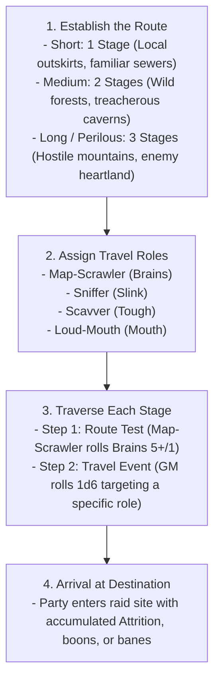

---

## 2. The Four Travel Roles

Every journey requires a clear division of labor (and someone to blame when disasters occur). All four **Travel Roles** must be assigned before rolling:

| Travel Role | Primary Attribute | Core Responsibilities & Duties |
| :--- | :---: | :--- |
| **Map-Scrawler** | **Brains** | Reads crude maps, interprets landmarks, and navigates routes. |
| **Sniffer** | **Slink** | Scouts ahead, detects ambushes, and smells out concealed traps. |
| **Scavver** | **Tough** | Clears physical debris, forages edible fungus, and hauls gear. |
| **Loud-Mouth** | **Mouth** | Enforces march discipline, suppresses panic, and silences bickering. |

### Mobs Assigned to Travel Roles
If playing with fewer than four players, a **Goblin Boss** may take multiple roles, or assign a commanded **Goblin Mob** to fill a vacant role:
* **Mobs testing Tough (Scavver):** Roll a dice pool equal to the **Mob's current Size** in d6s.
* **Mobs testing Slink, Brains, or Mouth (Sniffer, Map-Scrawler, Loud-Mouth):** Lesser goblins rely on collective cunning; they roll a baseline pool of **2d6** (as defined in [Mob Mechanics](06_Mob_Mechanics.md)).

>> **THE TRAVEL RESOLUTION RULE:**
>> The **GM** never rolls dice to resolve player success or failure during a journey. All tests are rolled by the players filling the designated roles. The standard success threshold for travel tests is **5+** (success on 5 or 6). Exploding 6s and standard fumbles apply.

---

## 3. Resolving a Stage

For each Stage of the journey, the party resolves two sequential steps:

### Step 1: The Route Test
The **Map-Scrawler** makes a **Brains 5+/1** navigation test against the route's baseline profile.

* **Success:** The route is clear. The party advances to the Stage's Travel Event with zero penalties.
* **Failure:** The party takes a grueling, hazardous detour. The entire party suffers **1 Mob Attrition** (every **Mob** in the party takes 1 point of damage to its active health die), and the party suffers a **Bane 1 (-1d)** on the upcoming **Travel Event** test.

### Step 2: The Travel Event
The **GM** rolls **1d6** on the **Gobbo Travel Event Table** below. The resulting event targets one of the other three roles, who must make a test to resolve it:

| d6 Roll | Event Name | Target Role | Stat Test | Success Outcome | Failure Outcome |
| :---: | :--- | :--- | :---: | :--- | :--- |
| **1** | **Narrow Pass** | Sniffer | **Slink 5+/1** | You slip through the crevices silently. | Gobbos get crushed by loose rocks. A **Mob** takes **2 damage** (or rolls armor defense). **Mobs of Size 3+** suffer a **Bane 1 (-1d)** on their next test. |
| **2** | **Deep Torrent** | Scavver | **Tough 5+/1** | The Scavver builds a crude rope bridge. | Gobbos are swept away. A **Mob** takes **Size damage** (losing 1 lowest-value health die, reducing Mob **Size** by 1), or you must discard 1 **Bulk** of equipped gear to save them. |
| **3** | **Spore Patch** | Scavver | **Tough 5+/1** | You harvest nourishing giant mushrooms. Restore 1 health point to a Mob's health die. | Poisonous bellyaches. Every **Mob** takes 1 damage. One random Boss tests **Tough 5+/1**; on failure, gains the **Weakened** condition. |
| **4** | **Bickering Over Loot** | Loud-Mouth | **Mouth 5+/1** | The Loud-Mouth cracks heads and restores order. Gain 1 **Loot** (T1) from the scrap. | Violent infighting! A **Mob** takes **1d6/2 (rounded up) damage**, and the Loud-Mouth Boss loses **1 Grunt**. |
| **5** | **Shadow Ambush** | Sniffer | **Slink 5+/1** | You detect the predator. Gain **Boon 1 (+1d)** on the first attack of the raid. | Caught off-guard! A random **Mob** takes **2 damage**, and the GM adds **+2 dice** to the shared **Bangaranga Pool** from the chaos. |
| **6** | **"Are We There Yet?"** | Loud-Mouth | **Mouth 5+/1** | The Loud-Mouth leads a rowdy, marching chant. | Desertion! The Loud-Mouth Boss loses **1 Grunt**, and one **Mob** shrinks by **1 Size** as runts sneak away. |

---

## 4. Return Journeys & Plunder Burden

Raiding a vault is simple; hauling heavy iron chests, bronze cauldrons, and gold idols back across the wilderness is where greed kills.

### Laden Mobs (> 50% Carry Capacity)
A **Mob** hauling significant expedition plunder (**Carried Bulk > Size x 2**) is **Laden**:
* **Laden** Mobs suffer **Bane 1 (-1d)** on all **Slink** and **Tough** tests during the return journey.
* The Map-Scrawler's **Route Test** required successes increase by +1 (e.g., from **Brains 5+/1** to **Brains 5+/2**).

### Over-Laden Mobs (Maximum & Dragging Capacity)
A **Mob** carrying at or above its unburdened carry capacity (**Carried Bulk >= Size x 4**, up to the dragging limit of **Size x 5**) is **Over-Laden**:
* **Over-Laden** Mobs suffer all penalties of being **Laden**.
* **Over-Laden** Mobs cannot roll passive armor defense dice against travel hazards.
* **Over-Laden** Mobs automatically take **1 damage** on failed Route Tests (representing exhaustion from dragging heavy scrap), in addition to standard party Attrition.
* If the party must flee or dodge a travel hazard, the party must immediately **discard 2 Bulk of Loot** per Over-Laden **Mob**, or that **Mob** becomes **Uncontrolled** as the Mob refuses to leave the plunder behind.

---

## 5. Environmental Hazards & Zone Profiles

All tactical environments (both during journeys and inside raid sites) are defined using the **Zone Profile** and **Zone Traits** framework.

### Zone Profiles
Every **Zone** possesses a standardized **Zone Profile** consisting of a **Difficulty** and a **Target Number (TN)** (e.g., `4+/1`, `5+/1`, `5+/2`, `6/2`).

>> **THE ZONE PROFILE PRINCIPLE:**
>> Any general environmental interaction, traversal, climbing, jumping, or search check attempted within a Zone defaults to using that Zone's Profile. The **GM** does not invent arbitrary DCs; all environmental tests test against the active Zone Profile.

---

### Zone Traits: Problems & Opportunities
A **Zone Trait** is a modular feature attached to a **Zone**, divided into **Problems** (Hazards/Obstacles) and **Opportunities** (Tactical Features/Treats):

#### 1. Predefined Problems (Hazards & Obstacles)
* **Burning (Hazard):** The Zone is engulfed in fire.
  * *Trigger:* Entering the Zone or starting a turn inside it.
  * *Rule:* Test **Slink** against the **Zone Profile** or suffer **1 Grit damage** (Boss) / **1 Size damage** (Mob). Spending a **Standard Action** extinguishes flames on self or an adjacent ally.
* **Narrow (Obstacle):** Tight tunnels or low sewer crawlspaces.
  * *Trigger:* Passive.
  * *Rule:* Maximum **Mob** size that can occupy the Zone without penalty is **Size 2**. Mobs of **Size 3+** suffer **Bane 1 (-1d)** on attacks and physical tests, and their **Movement** is capped at **1 Zone**. Giant enemies cannot enter.
* **Slippery (Obstacle):** Wet slime, grease, or ice.
  * *Trigger:* Entering the Zone.
  * *Rule:* Test **Slink** against the **Zone Profile** or fall **Prone** (movement ends immediately).
* **Smoky (Obstacle):** Dense smoke, fog, or spore clouds.
  * *Trigger:* Passive.
  * *Rule:* Ranged attacks targeting or passing through this Zone suffer **Bane 1 (-1d)**. Grants **Partial Cover** to all occupants.
* **Toxic (Hazard):** Poison gas or acid vapor.
  * *Trigger:* Starting a turn inside the Zone.
  * *Rule:* Test **Tough** against the **Zone Profile** or suffer the **Weakened** condition until a **Standard Action** is spent resting in a clean Zone.
* **Deep Water (Obstacle):** Flooded chambers or subterranean rivers.
  * *Trigger:* Passive / Traversal.
  * *Rule:* **Move** actions travel only **1 Zone**. Swimming creatures must test **Tough** against the **Zone Profile** each round or begin drowning (Bosses lose **1 Grit** per round; Mobs suffer **1 Size damage** per round).

#### 2. Predefined Opportunities (Features & Treats)
* **High Ground (Tactical Feature):** Ledges, scaffolding, or crate piles.
  * *Trigger:* Passive.
  * *Rule:* Ranged attacks made from this Zone gain **Boon 1 (+1d)**. Melee attacks made by enemies outside the Zone against targets inside suffer **Bane 1 (-1d)**.
* **Junk Pile (Treat):** Heaps of scrap iron, bones, and discarded tools.
  * *Trigger:* Interactive (**Manipulate** **Standard Action**).
  * *Rule:* Spend a **Standard Action** to test **Notice** against the **Zone Profile**. On success, unearth a throwable improvised weapon (1 damage ranged) or **1d6 Scrap**.
* **Shadowy (Tactical Feature):** Dark recesses and thick curtains.
  * *Trigger:* Passive.
  * *Rule:* Stealth and hiding tests made in this Zone gain **Boon 1 (+1d)** on **Slink**.
* **Shoring (Interactive Feature):** Wooden structural beams and pillars.
  * *Trigger:* Interactive (**Attack** or **Manipulate** **Standard Action**).
  * *Rule:* Spend a **Standard Action** to collapse the support beams. The Zone gains the **Crumbling** hazard (occupants test **Slink** against the **Zone Profile** or suffer **1 Grit damage** for Bosses / **1 Size damage** for Mobs) and blocks passage to adjacent Zones until cleared.

---

## 6. Journey Hazard & Event Structural Schema

Every journey hazard, weather obstacle, or wilderness encounter is defined by the following template:

```markdown
### [Hazard / Event Name]
- **Hazard Type:** [Environmental Obstacle | Ambush & Predator | Weather & Attrition | Social & Infighting | Trap & Debris]
- **Zone / Terrain Tag:** [Underground / Sewer | Forest / Wilds | Mountain / Chasm | Ruins / Keep | Swamp / Mire | Wasteland]
- **Target Role:** [Map-Scrawler (Brains) | Sniffer (Slink) | Scavver (Tough) | Loud-Mouth (Mouth)]
- **Trigger Condition:** [Route Test Failure | Travel Event Roll (1–6) | High Loot Weight]
- **Hazard Check & Difficulty:** [Stat tested against Target Number, e.g., Slink 5+/1 or Tough 5+/2]
- **Failure Consequence:** [Exact mechanical penalty: Mob Attrition damage, Boss Grit loss, Lost Bulk, Condition applied, or Alert increase]
- **Success Outcome:** [Hazard bypassed, Mob healed, Boon granted, or bonus Loot secured]
- **Mitigating Action / Avoidance:** [Equipment, Oddity, or alternative cost that bypasses the roll]
```

### Reference Hazard Instances

#### Rickety Rope Chasm
- **Hazard Type:** Environmental Obstacle
- **Zone / Terrain Tag:** Mountain / Chasm
- **Target Role:** Scavver (Tough)
- **Trigger Condition:** Travel Event Roll (2)
- **Hazard Check & Difficulty:** **Tough 5+/1**
- **Failure Consequence:** Planks snap. A **Mob** loses 1 health die (Size reduced by 1) or the party must drop 2 **Bulk** of carried equipment.
- **Success Outcome:** Ropes secured; the party crosses cleanly without delay.
- **Mitigating Action / Avoidance:** Spending 1 Climbing Kit or grappling hook guarantees automatic success with no roll.

#### Stalker Wolf Pack
- **Hazard Type:** Ambush & Predator
- **Zone / Terrain Tag:** Forest / Wilds
- **Target Role:** Sniffer (Slink)
- **Trigger Condition:** Travel Event Roll (5)
- **Hazard Check & Difficulty:** **Slink 5+/1**
- **Failure Consequence:** The pack attacks. A random **Mob** takes 2 damage and the starting **Alert** of the upcoming raid increases by +1.
- **Success Outcome:** Wolves are smelled and avoided; party gains **Boon 1 (+1d)** on their first ambush attack.
- **Mitigating Action / Avoidance:** Throwing 2 Bulk of meat or food distracts the wolves, bypassing the check.

---

## Content Extension Point

[CONTENT EXTENSION POINT: Journey Hazards & Events]

All future compendiums of travel encounters, wilderness terrain hazards, weather catastrophes, and subterranean navigation events must implement the Journey Hazard & Event Structural Schema defined above, respecting Travel Roles, Mob Attrition rules, and Zone Profile integration.

---

## Mechanical Gaps & Unresolved Systems

[MISSING RULE / GAP: Journey Terrain Difficulty Mapping & Transit Alert Coupling]
*   **Description:** Stage drafts define a flat Route Test of Brains 5+/1 regardless of terrain (mountains, swamps, or paved roads). Furthermore, loud transit failures (such as the Loud-Mouth causing a riot or failing an ambush test) do not mechanically feed into the starting Alert level of the upcoming raid.
*   **Why it is needed:** Travel difficulty should reflect the geographical environment, and noisy travel blunders should increase operational heat at the target site.
*   **Suggested Resolution:**
    1. Map Terrain Types to Route Test profiles: Mild Wilds = Brains 5+/1, Harsh Swamp/Chasm = Brains 5+/2, Perilous Mountains/Wasteland = Brains 6/2.
    2. Travel Failures that generate noise or reveal tracks add +1 to Starting Alert at the raid location.

[MISSING RULE / GAP: Mob Attrition Damage vs. Single Health Die Tracking]
*   **Description:** Route Test failure deals "1 Attrition (every Mob takes 1 damage to its active health die)". However, Mob damage rules in Chapter 06 track Mob health using a pool of d6s. The travel rules do not clarify whether Attrition damage spills over between dice if a die reaches 0, or how multi-die Mobs track travel wear.
*   **Why it is needed:** Inconsistent damage resolution between travel attrition and tactical combat creates table confusion.
*   **Suggested Resolution:** Explicitly state that Travel Attrition follows standard combat damage decrement: 1 damage reduces the active lowest health die of the Mob's pool. If a die reaches 0, it is removed and Mob Size decreases by 1, with excess damage spilling over into the next die.

---

<a id="doc-14"></a>
<!-- ============================================================ -->
<!-- DOCUMENT 14: 02_PROD_Core_Rules/12_Adversaries_and_Threats.md -->
<!-- ============================================================ -->
# Adversaries_and_Threats
*Source: `02_PROD_Core_Rules/12_Adversaries_and_Threats.md`*

# Adversaries and Threats

*Gobbos are small, loud, and easily crushed underfoot. The world is infested with towering knights, lumbering trolls, and howling beasts that want nothing more than to wipe your gang off the map. But tall-men fight in rigid formations, and monsters are predictable. Goblins win through numbers, dirty tricks, and chaotic swarm violence.*

---

## 1. Deterministic Threat Resolution Engine

In Gobbos, the Game Master (GM) **never rolls dice**. Adversaries do not test for success, roll to hit, or roll variable damage. Every enemy action is a deterministic, incoming physical threat.

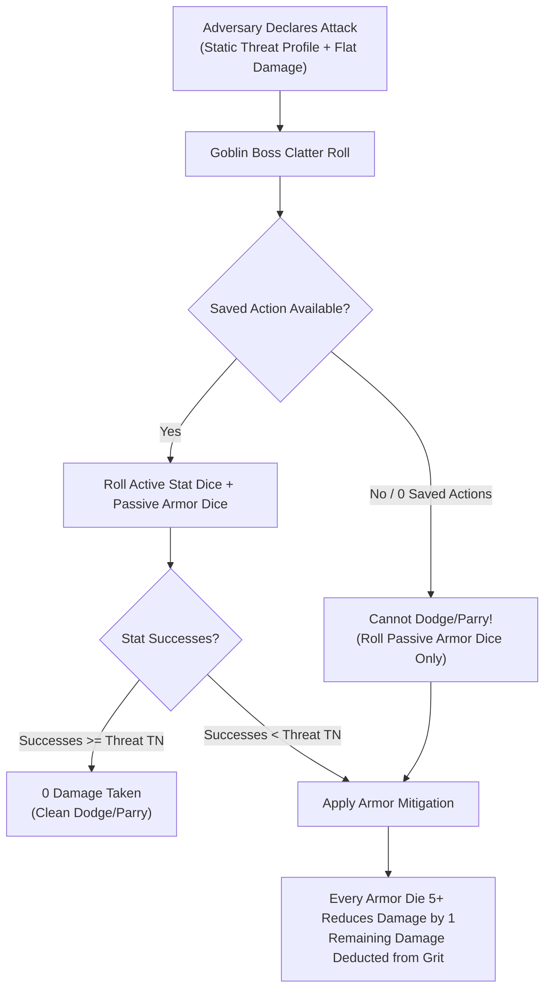

### Threat Profiles and Flat Damage
Every enemy attack is defined by a **Threat Profile** (`[Stat] [Target Face]+/[Successes]`) and a flat **Damage** value:
*   **Active Defense (Evasion):** When targeted by an attack, a **Goblin Boss** with a saved **Standard Action** rolls active stat dice (**Slink** to **Dodge**, or **Tough** to **Parry** if wielding a shield or heavy weapon). If the successes rolled meet or exceed the attack's **Threat TN**, the attack misses completely (**0 Damage taken**).
*   **Passive Defense (Armor):** If active evasion fails or the **Goblin Boss** has 0 saved actions, the attack hits. The player rolls passive **Armor Dice**; each die showing **5+** reduces incoming flat **Damage** by **1**.
*   **Unmitigated Damage:** Any remaining damage reduces the target's **Grit** (for Bosses) or removes health dice values (for Mobs).

---

## 2. The Three Enemy Scales

Adversaries are categorized into three distinct mechanical scales to govern how they absorb damage and die:

### 1. Standard Enemies (One-Hit Kill)
Standard enemies represent individual grunts, peasants, city guards, footpads, and minor monsters:
*   **One-Hit Kill:** When a player's attack scores successes equal to or greater than the standard enemy's **Defence TN**, the enemy is killed instantly and removed from the map.
*   **No Wounds:** Standard enemies do not possess a wounds track. Rolling fewer successes than **Defence TN** inflicts 0 damage (though it may inflict the **Staggered** condition if **Impact Size** meets or exceeds the target's physical **Size**).

### 2. Elites and Bosses (The Wounds Track)
Elites and Bosses represent formidable champions, armored commanders, and colossal apex predators:
*   **The Wounds Track:** Elites and Bosses track survivability using a **Wounds Track** (typically **2 to 8 Wounds**).
*   **The Overkill Rule:** An attack deals **1 Wound for every full multiple of the target's Defence TN** scored on a single attack roll:

**Wounds Dealt** = **Attack Successes** / **Target Defence TN** (rounded down)

>> **GOLDEN RULE: No Fractional Wounds**
>> Leftover successes that do not form a complete multiple of the enemy's **Defence TN** are discarded. They do not carry over to subsequent attacks.

### 3. Enemy Mobs (Swarms)
Enemy Mobs represent coordinated squads of standard foes acting as a single unit (e.g. a squad of 4 Town Watchmen or a swarm of 5 Giant Rats):
*   **Symmetrical Health Dice:** An Enemy **Mob** of **Size X** is tracked using **X physical d6s** on the table, each starting at the **"6" face**.
*   **Damage Resolution:** Single-target strikes damage the Mob's lowest active health die, spilling over to the next lowest die when a die reaches 0 and is removed.
*   **Frontline Rule:** Melee attacks from a player **Mob** apply damage simultaneously to a number of enemy health dice equal to the attacking Mob's current **Size**.
*   **Area Threats (`[AoE]`):** Full-zone explosive or breath hazards apply flat damage to **every single active die** in the Enemy Mob's pool simultaneously.
*   **The No Elite Mobs Rule:** Mobs can only consist of standard, one-hit-kill units. Elite and Boss enemies must always be fought as individual entities.

---

## 3. Enemy Mob Damage Scaling

An Enemy Mob's automatic attack damage scales deterministically with its current **Size**:

**Enemy Mob Damage** = **Base Unit Damage** + (**Current Mob Size** - 1)

*   **Attacking a Player Mob:** The Enemy Mob delivers this damage across the frontline, affecting a number of player goblin health dice equal to the Enemy Mob's current **Size** (targeting the lowest-value dice first).
*   **Attacking a Goblin Boss:** The Enemy Mob delivers this total damage as a single combined strike, which the **Goblin Boss** defends against using a single **Clatter Roll**.

---

## 4. The Three-Layer Trait Hierarchy

To eliminate rulebook page-flipping and prevent rules bloat during combat, all adversary behaviors are organized into a strict three-layer hierarchy.

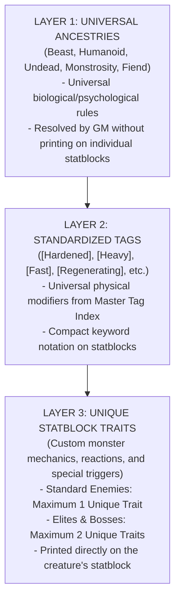

### Layer 1: Universal Ancestries
Every adversary belongs to exactly one **Ancestry**, establishing its core psychological and biological baseline:

#### 1. Beast
*   **Morale Vulnerability:** Triggers an immediate **Morale Check** if exposed to sudden `[Fire]` or `[Loud]` tags in its **Zone**.
*   **Predatory Instinct:** Gains a **Boon 1 (+1d)** to attack targets with the `[Tasty]` or `[Bleeding]` tag, prioritizing them over all other targets.
*   **Social Immunity:** Immune to verbal **Mouth** manipulation or intimidation.

#### 2. Humanoid
*   **Tactical Discipline:** Utilizes cover and prioritizes attacking enemy commanders (**Goblin Bosses**).
*   **Standard Morale:** Subject to group **Morale Checks** upon suffering 50% casualties or the death of a leader.
*   **Plunder:** Drops salvageable weapons, armor, and **Loot** upon defeat.

#### 3. Undead
*   **Morale & Fear Immunity:** Completely immune to **Morale Checks** and the **Terrified** condition.
*   **Biological Immunity:** Immune to the **Weakened** condition caused by poison or disease; immune to `[Bleeding]`.
*   **Holy Vulnerability:** Attacks carrying the `[Angelic]` or `[Light]` tags deal **+1 Success** (lowering effective **Defence TN** by 1).

#### 4. Monstrosity
*   **Mass & Stagger Resistance:** Immune to the **Staggered** condition from partial hits unless the attack's **Impact Size** meets or exceeds the monster's physical **Size** (Impact Size >= Size).
*   **Natural Cleave:** All melee attacks possess the `Cleave 2` trait (or higher), sweeping across multiple frontline health dice.

#### 5. Fiend (Demon)
*   **Fire & Terror Immunity:** Immune to damage and hazards with the `[Fire]` tag; immune to **Terrified** and **Dumb** conditions.
*   **Holy Bane:** Attacks carrying the `[Angelic]` tag ignore passive armor and reduce the Fiend's **Defence TN** by 1.
*   **Chaos Retaliation:** When a **Player** rolls a **Fumble** within 1 **Zone** of a Fiend, the Fiend immediately triggers a free reaction attack against that player.

### Layer 2: Standardized Tags
Tags represent universal physical modifiers (e.g. `[Hardened]`, `[Heavy]`, `[Teeny]`, `[Fast]`, `[Regenerating]`, `[Spiky]`). Their mechanical effects are identical across items, environments, and creatures (see [Combat Engine](05_Combat_Engine.md)).

### Layer 3: Unique Statblock Traits
Unique traits represent specialized combat maneuvers, reactions, or unique abilities printed directly on the creature's statblock:
*   **Standard Enemies:** Limited to a maximum of **one (1) unique statblock trait**.
*   **Elites and Bosses:** Limited to a maximum of **two (2) unique statblock traits**.

---

## 5. Enemy Action Economy, Reactions, and Group Attacks

### Action Economy
*   **Standard Action Pool:** On the Enemy Active Turn, each enemy unit (Standard, Mob, or Elite) receives **two (2) actions** per round to spend on **Move**, **Attack**, or **Manipulate** actions.
*   **Apex Bosses:** Colossal Bosses may possess traits granting **three (3) actions** or multi-phase action clocks.

### Enemy Reactions
Adversaries can trigger specialized reactions (such as parrying shields, retaliatory strikes, or steam vents) outside their active turn:
*   **Action Deduction:** Triggering an active reaction immediately expends **1 action** from the enemy's upcoming active turn.
*   **Reaction Cap:** Standard enemies and Elites may perform a maximum of **one (1) reaction per round**, and only if they have at least 1 saved action remaining. If an enemy has already spent both actions on its turn, it cannot trigger active reactions until actions reset at Round Start.

### Group Attacks (Enemy Swarms vs Bosses)
To prevent overwhelming action-economy drain and endless individual rolls when multiple standard enemies surround a single **Goblin Boss**:
*   **Combined Strike:** Up to **three (3) standard enemies** in melee range of the same **Goblin Boss** combine their attacks into a single strike.
*   **Damage Formula:** **Combined Damage** = **Base Damage** + 1 per additional attacking enemy.
*   **Single Defense:** The **Goblin Boss** defends against the combined blow using a single **Clatter Roll**.

---

## 6. Enemy Morale, Swarm Terror, and Rallying

### The Morale Trigger
An enemy group must make an immediate **Morale Check** during the **Round Closure Phase** if they suffer catastrophic collapse:
1.  The enemy group loses **50% or more of its total units** (or 50% of an Enemy Mob's starting **Size**).
2.  The enemy group's **Commander** is slain.

### The Swarm Terror Check
The players roll a combined **Swarm Terror Pool** against the enemy group's static **Morale TN** (testing against **5+** difficulty):

**Swarm Terror Dice** = **Surviving Mob Sizes in Zone/Adjacent** + **Surviving Bosses in Zone/Adjacent**

*   **Success (Successes >= Morale TN):** The enemy group breaks! The enemies drop heavy gear and must spend **two (2) Move actions** on their turns fleeing toward the nearest exit.
*   **Failure (Successes < Morale TN):** The enemies hold their ground and continue fighting.

### The Commander Rally
If an **Enemy Commander** survives and did not break, the commander may spend **1 Standard Action** on its turn to attempt a **Rally**:
*   **Opposed Roll:** The players roll their current **Swarm Terror Pool** against the Commander's **Morale TN**.
*   **Resolution:** If the players succeed, the goblin shouting and shield-banging drowns out the commander, and the troops continue fleeing. If the players fail, the commander restores order, and the troops return to combat.

---

## 7. Adversary and NPC Statblock Structural Schema

[CONTENT EXTENSION POINT: Bestiary & Adversary Statblocks]

All living bestiary compendiums, monster catalogs, and NPC adversaries must follow this deterministic statblock schema:

```markdown
### [Enemy Name]
*[Threat Classification: Standard | Elite | Boss | Enemy Mob] [Ancestry: Beast | Humanoid | Undead | Monstrosity | Fiend | Construct] (Size [0–5])*  
*(If Elite or Boss) **Wounds:** [Wounds Track Value, e.g. 2–8]*  
*(If Enemy Mob) **Mob Size:** [Size 1–5, tracked via X physical d6s]*

| Defence | Movement | Morale | Tags |
| :---: | :---: | :---: | :--- |
| **[Defence TN 1–4]** | **[Zones 1–4]** | **[Morale Profile, e.g. 5+/2, Immune]** | `[Tag 1]`, `[Tag 2]` |

**Special — [Unique Trait 1 Name]:** [Mechanical rule, trigger condition, and resolution. Standard enemies max 1 trait, Elites/Bosses max 2.]  
**Special — [Unique Trait 2 Name (Elite/Boss Only)]:** [Second unique trait or triggered reaction.]

#### Attacks
| Attack | Threat | Damage | Range | Special |
| :--- | :---: | :---: | :---: | :--- |
| **[Attack Name 1]** | `[Stat] [Face]+/[TN]` (e.g. `Slink 5+/1`, `Tough 5+/2`) | [Flat Damage, e.g. 1–4] | [Melee | Ranged (X Zones) | Zone-Wide] | [Traits: Cleave X, Piercing, inflicts Condition on failed evasion] |
| **[Attack Name 2 (Optional)]** | `[Stat] [Face]+/[TN]` | [Flat Damage] | [Range] | [Special effects] |

**Reactions:** [Specific out-of-turn triggers, deducting 1 action from active turn if used.]  
**Flaw Hook / Vulnerability:** [Specific Tag interaction that lowers Defence TN or makes attacks Easy (4+).]  
**Plunder:** [Salvageable Scrap tier, Loot Value tokens, or Oddity parts dropped on defeat.]
```

---

## 8. Mechanical Gaps and System Clarifications

[MISSING RULE / GAP: Enemy reaction economy is capped at 1 reaction per round for Standard and Elite foes. An enemy must have at least 1 saved action remaining to react; an enemy that spent both actions on its turn cannot react until Round Start.]

[MISSING RULE / GAP: The Swarm Terror pool formula sums both surviving Mob Sizes and surviving Goblin Bosses in the combat zone and adjacent zones. This ensures high-chaos goblin swarms exert psychological pressure proportional to their collective presence.]

---
